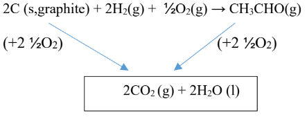
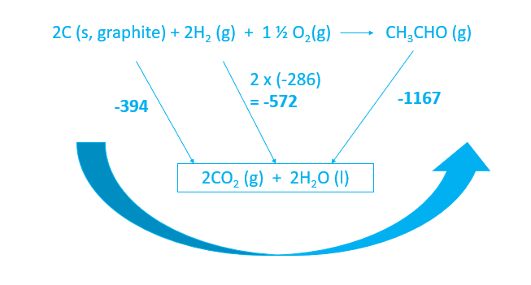
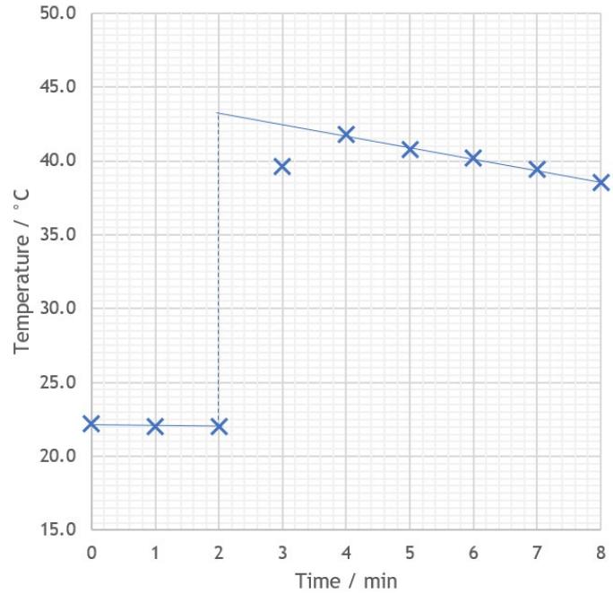
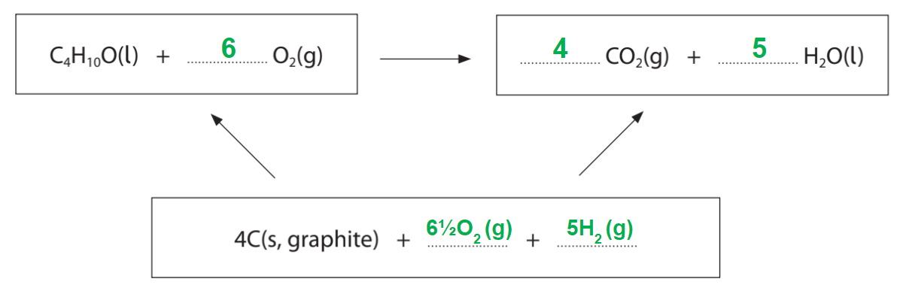
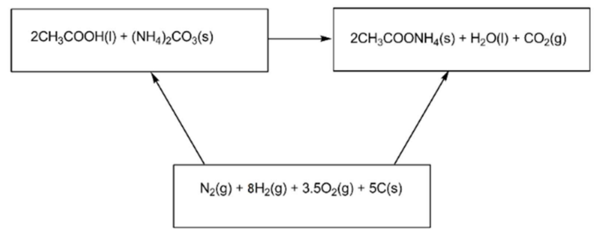
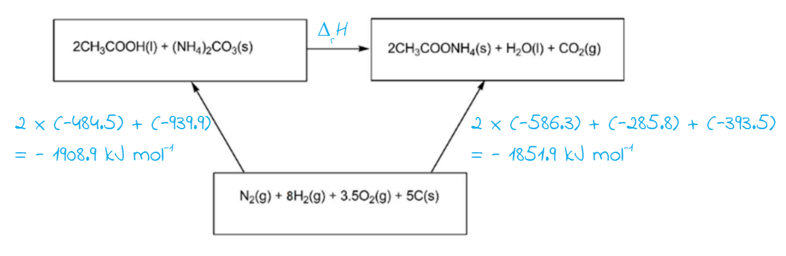
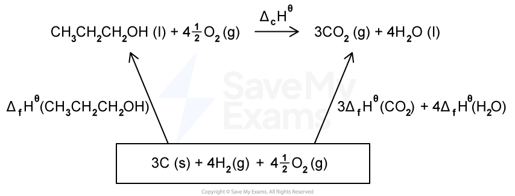
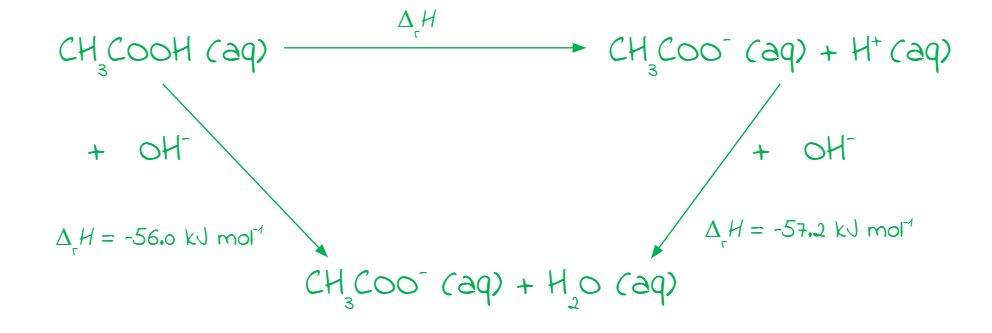

# Mark Schemes — Energetics
**2. Energetics, Group Chemistry, Halogenoalkanes & Alcohols** · Edexcel International A Level (IAL) Chemistry (YCH11)

## Q1 — medium — 16 marks · structured-questions

### 19() — 8 marks
i) The  number of moles of ethanol in 1.19 g is:

- $\frac{1.19}{46}$ =  0.025870 **OR** 2.5870 x 10 -2 (mol); **[1 mark]**

ii) The heat energy required to raise the temperature of 100 g of water from 21.6°C to 63.9°C is:

- Calculation of temperature change (63.9 - 21.6) = 42.3 (°C); **[1 mark]**
- Calculation of energy required 42.3 x 4.18 x 100 = 17681.4 (J) **OR** 17.6814 (kJ); **[1 mark]**

iii) A value for the enthalpy change of combustion of ethanol is:

- Calculation of the energy per mole $\frac{17681}{0.025870}$ = 683480 (J mol−1) **OR** 683.48 (kJ mol-1); **[1 mark]**
- Correct sign **AND** units  − 683480 J mol−1 **OR** − 683.48 kJ mol−1; **[1 mark]**
- Answer to 2 or 3 significant figures; **[1 mark]**

iv) Two reasons why this value was so inaccurate, apart from heat loss are:

- Incomplete combustion; **[1 mark]**
- Evaporation of the ethanol / alcohol / fuel; **[1 mark]**

**[Total: 8 marks]**

- *For part i) the moles are calculated using *$\frac{\mathrm{moles}}{\mathrm{molar} \mathrm{mass}}$
- *For part ii) use:*

  - *q **=** m **x** c **x Δ**T*
  
    - *m **= mass of water (100)*
    - *c **= specific heat capacity (4.18)*
    - *Δ**T **= change in temperature (42.3)*
  - *You will score 2 marks for a correct answer with no working out *
- *For part iii) to find the energy release per mole use:*

  - $\frac{q}{n}$
  
    - *n** was calculated in part i)*
    - *q** was calculated in part ii)*
  - *You can still score all three marks in part iii) if you incorrectly calculated the values for q and n *
  - *The enthalpy change of combustion is an exothermic reaction as energy is released so your value should have a negative sign *
- *Usually, heat loss is the main factor for experimental values for the enthalpy of combustion being inaccurate and would score the mark if not given in the question*

  - *The enthalpy change of combustion is the enthalpy change when one mole of a substance is burnt in **excess oxygen** understand conditions*
  - *A lack of oxygen (incomplete combustion) will therefore lead to an inaccurate enthalpy change*
  - *You will score the mark for saying there was insufficient oxygen, or that soot / carbon / carbon monoxide is formed *

### 19((b)) — 5 marks
i) The term ‘mean bond enthalpy’ is:

- The energy required to break one mole of a (specific) bond; **[1 mark]**
- In the gaseous phase / state **AND** 
Averaged over a number of (different) compounds / molecules; **[1 mark]**

ii) A value for the enthalpy change of combustion of methanol is:

- Calculation of the energy change to break the bonds (+) 2808 (kJ mol–1); **[1 mark]**
- Calculation of the energy change to make the bonds (–) 3466 (kJ mol–1); **[1 mark]**
- Calculation of the enthalpy change of the reaction 2808( kJ mol–1) −3466( kJ mol–1) = -658 (kJ mol–1); **[1 mark]**

**[Total: 5 marks]**

- *There are several definitions within the enthalpy unit that you can be asked to recall so it is worth spending time learning these*
- *To calculate the energy required to break the bonds:*

  - *(3 × C-H) + (1 × C-O)+ (1× O-H) +(1.5 O=O)*
  - *(3 × 413) + ( 1× 358) +(1 × 464) +(1.5 x 498)*
  - *(+) 2808 kJ mol**–1*
- *To calculate the energy released when bonds are made:*

  - *(2 x C=O)+ (4 x O-H)*
  - *(2 x 805) + (4 x 464)*
  - *= (–) 3466 kJ mol**–1*
- *To find the enthalpy change:*

  - *Energy required to break bonds - energy released when bonds are formed*
  - *2808 − 3466 = – 658 kJ mol**–1*
- *Combustion reactions release energy to the surroundings so are exothermic *

  - *The answer should have a – sign in front of it*
  - *If you give + 658 as your answer you will score 2 marks *

### 19((c)) — 3 marks
The completed Hess cycle and calculation of the standard enthalpy change of formation for ethanal, CH3CHO, are:

- Correct Hess cycle with an arrow on the right-hand side going down
**AND**
Correct balanced products in the box; **[1 mark]**
- Calculation of left-hand side
(2 x − 286) + (2 x −394) = −1360 (kJ mol−1); **[1 mark]**
- Correct answer **AND** sign 
− 1360 + 1167 = − 193 (kJ mol−1); **[1 mark]**

**[Total: 3 marks]**

- *When completing a Hess cycle using enthalpy of combustion data, the combustion products should be written in the box at the bottom *

  - *In this case, the combustion products of carbon and hydrogen, are carbon dioxide and water respectively *
  - *The number of atoms for each element in the combustion products should be equal to those in the main equation *
  - *The number of oxygen molecules needed on either side is written in to make sure the oxygen atoms are balanced however you will not be penalised if you have not included this *
- *To calculate the enthalpy change of formation you can take the indirect route around the cycle*

  - *Make sure you change the sign of the value if the arrow is pointing in the opposite direction to the direction you are going *
  - *Don't forget to take into account the number of moles for each substance as the enthalpy change of combustion will need multiplying by this value*
  - *− 788 − 572 **+** 1167 = − 193 kJ mol**−1*

## Q2 — medium — 13 marks · structured-questions

### 19((a)) — 2 marks
An equation is:

Mg (s) + H2SO4 (aq) → MgSO4 (aq) + H2 (g) **   **
**OR  **
Mg (s) + 2H+ (aq) → Mg2+ (aq) + H2 (g)

- Correct balancing; **[1 mark]**
- Correct state symbols; **[1 mark]**

**[Total: 2 marks]**

- *When a metal reacts with an acid:*

  - *Metal + acid   → salt + hydrogen*
  - *Magnesium ions and sulfate ions have a charge of 2+ and 2- respectively so the charges cancel out so there is one of each ion, MgSO**4*
- *You must achieve marking point 1 to score marking point 2 *

### 19((b)) — 3 marks
The number of moles of magnesium and of sulfuric acid that **reacted **is:

- Moles calculated correctly for magnesium: $\frac{0.5}{24.3}$ = 0.020576; **[1 mark]**
- Moles calculated correctly for acid: 0.2 × $\frac{25}{1000}$ = 0.005 moles of acid; **[1 mark]**
- 0.005 moles of each react as it is a 1:1 relationship; **[1 mark]**

**[Total: 3 marks]**

- *Once you have determined the moles of each substance you need to determine which one is in excess, and which is the limiting reagent*

  - *The ratio of magnesium to acid is 1:1 so:*
  
    - *The substance with more moles is the one in excess, magnesium*
    - *The one with less moles is the limiting reagent, sulfuric acid *
  - *If there are only 0.005 moles of acid, there must only be 0.005 moles of acid able to react with it due to the molar ratio being 1:1*

### 19((c)) — 4 marks
i) The completed graph is:

- A suitable choice of scale so that the points cover at least 50% of the grid in both directions and allow for extrapolation; **[1 mark]** 
**AND** 
correct choice of axes suitably labelled including units
- All points plotted correctly; **[1 mark]**

ii) The maximum change in temperature is:

- Two straight lines of best fit with the cooling curve extrapolated back to 2 minutes;**[1 mark]**
- Calculation of temperature change from the graph at 2 minutes: E.g 43.5 ‒ 22.0 = 21.5(°C); **[1 mark]**

**[Total: 4 marks]**

- *For part i) the lines of best fit do not need to be shown- this would be the completed graph once parts i) and ii) have been completed *
- *In part ii), you will be awarded marking point 2 if you complete the correct calculation using incorrect lines of best fit *

### 19((d)) — 4 marks
The molar enthalpy change for the reaction is:

- Recall of equation Δ*H* = (‒)*mc*Δ*T*; **[1 mark]**
- Substitution of correct values Δ*H* = 25 × 4.18 × 21.5 = 2246.75(J); **[1 mark]**
- Conversion to molar quantity Δ*H* ÷ 0.005 = (‒)449 350 ( J mol-1) / (‒)449 (kJ mol-1); **[1 mark]**
- Correct sign and units ‒ 449 350 J mol-1 / ‒ 449 kJ mol-1; **[1 mark]**

**[Total: 4 marks]**

- *You can achieve the marks for completing the correct calculation, using incorrect values, the errors are carried forward*
- *The temperature increased, so the reaction is exothermic and your answer must therefore be negative *
- *If you included the mass of magnesium and mass of sulfuric acid, i.e. **m **= 25.5 g, then Δ**H **would be -458 kJ mol**-1**, this would gain 3 marks*

## Q3 — medium — 12 marks · structured-questions

### 21((a)) — 5 marks
i) The completed table is:

|   | **At the start** | **At the end** | **Change** |
|---|---|---|---|
| Mass of spirit burner / g | 267.35 | 266.78 | **Final answer:** **0.57** |
| Temperature of water / °C | 19.5 | 65.3 | **Final answer:** **45.8** |

- 0.57 
**AND **
45.8; **[1 mark]**

ii) The enthalpy change of combustion, Δc*H*, of 2‐methylpropan‐2‐ol is:

- *M*r of 2‐methylpropan‐2‐ol = 74; **[1 mark]**
- Moles of 2‐methylpropan‐2‐ol = 0.57 ÷ 74 = 0.0077027 / 7.7027 x 10-3 mol; **[1 mark]**
- *q* = *m c *Δ*T* *q* = 75 x 4.18 x 45.8 = 14358 (J); **[1 mark]**
- Δ*H* = $\frac{q}{n}$ = $\frac{-14358}{0.0077027}$ Δ*H* = -18641000 / -1.8641 x 106 J mol-1 **OR** 
Δ*H* = -1864.1 / -1900 kJ mol-1; **[1 mark]**

**[Total: 5 marks]**

- *The main mistakes students make with this type of calculation are:*
- *Using the incorrect mass in **q** = **m c **Δ**T*

  - *The mass used in q should be the mass of the surrounds, i.e. whatever you are heating - in this case, 75 g of water*
  - *Careful**: Students often use the mass of fuel used but this mass is only used to calculate the number of moles of fuel used to calculate Δ**H** *
- *Not converting units*

  - *q** is calculated in J, but Δ**H** is often given in kJ mol**-1*
- *Not given a sign for Δ**H** *

  - *If the temperature increases in temperature, it is an exothermic reaction and Δ**H **should be negative*

### 21((b)) — 5 marks
i) No ∆f`H to the power of ⦵`value has been given for oxygen because:

- Oxygen is an element
**AND**
In its standard state;** [1 mark]**

ii) The complete Hess cycle is:

- Balanced reactants and products; **[1 mark]**
- Balanced elements with state symbols; **[1 mark]**

iii) The standard enthalpy change of combustion of 2‐methylpropan‐2‐ol is:

- Δ*H* = – Δf*H* reactants + Δf*H* products
**OR**
Δ*H *= − (−359) + (−394 x 4) + (−286 x 5); **[1 mark]**
- = -2647 kJ mol-1; **[1 mark]**

**[Total: 5 marks]**

- *The standard enthalpy change of formation of an element in its standard state is always 0 as there is no change that occurs - you would be awarded the first mark to state this*
- *The combustion products of an alcohol will be carbon dioxide and water, ensure that you balance the equations carefully - the balancing number of oxygen will be a fraction, you can write this as 6½ or *$\frac{13}{2}$
- *When constructing an equation to calculate the enthalpy change of combustion, use the arrows in the cycle to help you:*

  - *Two arrows start from 4C + 6½O**2** + 5H**2** and two arrows point to 4CO**2** + 5H**2**O*
  - *This means there are two routes to get from 4C + 6½O**2** + 5H**2** to 4CO**2** + 5H**2**O *
  - *One directly:*
  
    - *The enthalpy change of this route = 4 x Δ**f**H**(CO**2**)** **+ 5 x Δ**f**H**(H**2**O) = 4 x (-394) + 5 x (-286) = -3006*
  - *One indirectly via C**4**H**10**O + 6O**2*
  
    - *The enthalpy change of this route = Δ**f**H**(C**4**H**10**O) + Δ**c**H**(C**4**H**10**O) = -359 + Δ**c**H**(C**4**H**10**O)*
  - *The enthalpy change of both routes will be the same:*
  
    - *-359 + Δ**c**H**(C**4**H**10**O) = -3006*
    - *Δ**c**H**(C**4**H**10**O) = -3006 + 359 = **-2647 kJ mol**-1*
- *It is very easy to get the calculation the wrong way around and end up with a positive number, so don't rush and write down your workings meticulously so as not to make an error in rearranging*
- *You will lose a mark if you don't get the sign correct*

### 21((c)) — 2 marks
**Two** reasons for the value for Δc*H* obtained in part (a)(ii) being much less exothermic than Δccalculated in (b)(iii)

Any **two** from:

- Heat / energy is lost (in the enthalpy experiment) 
**OR** 
No account has been taken of the heat capacity of the beaker
- Incomplete combustion (of alcohol); **[1 mark]**
- Some alcohol evaporates; **[1 mark]**
- No stirrer so temperature is not uniform; **[1 mark]**

**[Total: 2 marks]**

- *These are typical reasons why the experimental values are less exothermic than the calculated values which you should know*

## Q4 — medium — 14 marks · structured-questions

### 21((a)) — 2 marks
**Two** observations you would **see** in this test are:

- (White) solid / crystals / sodium carbonate dissolves / disappears 
**OR**
Colourless solution forms; **[1 mark]**
- (Colourless) bubbles (of gas) / effervescence / fizzing; **[1 mark]**

**[Total: 2 marks]**

- *When a metal carbonate reacts with an acid, a salt, water and carbon dioxide are produced*
- *Careful**: Just stating that a gas or carbon dioxide is produced is insufficient to gain a mark as this is not an observation - the bubbles are what you observe and you can draw the conclusion that a gas is produced from this*

### 21((b)) — 5 marks
The maximum temperature reached by the hand warmer if its initial temperature is 5.0 °C is:

- Molar mass of hydrated sodium ethanoate = (2 x 12) + (9 x 1) + ((5 x 16) + 23 = 136 (g mol-1); **[1 mark]**
- Moles of hydrated sodium ethanoate = 20.1 ÷ 136 = 0.14779 (mol); **[1 mark]**
- Energy released = 0.14779 × 19700 = 2911.5 / 2.911 x 103 (J)
**OR** 2.911 (kJ); **[1 mark]**
- Δ*T* = 2911.54 ÷ (63.2 × 3.0) = 15.3562 (°C); **[1 mark]**
- Final *T* = 15.3562 + 5.0 = 20 / 20.4 (°C); **[1 mark]**

**[Total: 5 marks]**

- *This question uses the equations **q** = **mc **Δ**T **and Δ**H **= *$\frac{q}{n}$* but instead of having to use the temperature change to find Δ**H, **you are given Δ**H **and have to work backwards to find Δ**T** and then the final temperature*
- *The energy released per mole of sodium ethanoate as Δ**r**H **= -19.7 kJ mol**-1*
- *The molar ratio is 1:1, so this is the amount of energy released when 1 mole of hydrated sodium ethanoate recrystallises*
- *To find the energy released when 20.1 g of hydrated sodium ethanoate is recrystallised, this value needs to be multiplied by the number of moles present in 20.1 g:*

  - *q** = Δ**H  **x** n **= -19.7 x 0.14799 = 2.9115 kJ or 2911.5 J*
- *Now use **q** = **mc **Δ**T** to find the temperature change, where **m** is the mass of the surroundings (the mass of the hand warmer), **q** is in joules and **c** is given in the question as 3.0 J °C**-1** g**-1**:*

  - *Δ**T **= *$\frac{q}{mc}$* = *$\frac{2911.5}{63.2\times3.0}$* = 15.3562 °C*
- *Δ**T **is calculated by final temperature - initial temperature*

  - *15.3562 = final temperature - 5.0*
  - *Final temperature = 15.3562 + 5.0 = 20.4 °C*

### 21((c)) — 5 marks
The standard enthalpy change for this reaction is:

- Top 2 boxes of Hess Cycle complete (reaction); **[1 mark]**
- Bottom box of Hess Cycle complete (elements); **[1 mark]**
- Inclusion of multiples of 2 for Δf*H *[CH3COOH (l)] and Δf*H* [CH3COONH4(s)]: (2 × −586.3)
**AND **
(2 × −484.5); **[1 mark]**
- Δr*H *= [(2 × −586.3) + (−285.8) + (−393.5)] – [(2 × −484.5) + (−939.9)]; **[1 mark]**
- Δr*H *= = (+) 57 kJ mol−1; **[1 mark]**

**[Total: 5 marks]**

- *You are given all of the formulae needed so the first two marks are for using these to correctly construct the balanced equation and for identifying the elements in their standard states*
- *When calculating Δ**r**H **you can either remember the equation** Δ**r**H** = **Δ**f**H**(products) **– Δ**f**H**(reactants) or you can use the Hess cycle to construct an equation*

- *Remember**: When going in the opposite direction to an arrow, the value of the enthalpy change will have the opposite sign:*

  - *Δ**r**H **= 1908.8 = (-1851.9) = 56.9 kJ mol**-1*
- *If you give the correct answer with no working, you would be awarded the final three marks*
- *If you do not multiply either enthalpy change by 2, the answer of (+)158.8 kJ mol**-1** would score the final two marks*

### 21((d)) — 2 marks
The maximum concentration, in mol dm−3, of ammonium carbonate in such a solution is:

Method 1

- Mass of ammonium carbonate in 1 dm3 of solution = 1.8 x 10 = 18 (g dm−3); **[1 mark]**
- Concentration of solution = $\frac{18}{96}$ = 0.1875 (mol dm-3); **[1 mark]**

Method 2

- Number of moles of ammonium carbonate = $\frac{1.8}{96}$ = 0.01875 (mol); **[1 mark]**
- Concentration of solution = $\frac{0.01875}{0.1}$ = 0.1875 (mol dm-3); **[1 mark]**

**[Total: 2 marks]**

- *Method 1 involves working out the concentration in g dm**-3**, then converting to mol dm**-3** by dividing by the Mr*

  - *M**r** = 2 x [14 + (4 x 1)] + 12 + (3 x 16) = 96*
- *Method 2 involves working out the number of moles of ammonium carbonate in 1.8 g by mass ÷ **M**r*
- *Then calculating concentration in mol dm**-3** by moles ÷ volume (in dm**3**)*
- *Either method is equally valid*
- *A correct answer with no working scores 2 marks*

## Q5 — medium — 10 marks · structured-questions

### 1() — 2 marks
> **[mark-scheme]**
> A complete definition must include all of the following:
> 
> - The enthalpy/heat energy change when 1 / one mole of a substance is completely burned in oxygen / reacts completely with oxygen **[1 mark]**
> - Under standard conditions (100 kPa and a stated temperature, usually 298 K) 
> **OR **
> with the reactants in standard states **[1 mark]**
> 
> "Standard state" is accepted for one of the two marks if the other marking criteria are met.
> 
> Talking about just "energy" is not accepted

> **[exam-tip]**
> Your definition must cover four components to score full marks:
> 
> 1. One mole of the substance
> 2. Complete combustion in excess oxygen
> 3. Standard pressure (100 kPa, not 101.3 kPa; this is an Edexcel IAL convention)
> 4. Reactants and products in their standard states
> 
> Omitting any single component typically loses a mark. The temperature is usually quoted as 298 K but the definition technically holds for any *stated* temperature, so "at a stated temperature" is accepted.

### 2() — 4 marks
i) The completed Hess cycle is:

**[1 mark]**

ii) To calculate the standard enthalpy of combustion of propan-1-ol:

- Write the formation cycle formula:

Δc*H*θ = ΣΔf*H*θ(products) − ΣΔf*H*θ(reactants) **[1 mark]**

- Substitute the values (Δ*H*fθ(O2) = 0 because O2 is an element in its standard state):

Δc*H*θ = [3(−394) + 4(−286)] − [1(−303) + 4.5(0)] **[1 mark]**

Δc*H*θ = [−1182 − 1144] − [−303] = −2326 + 303

Δc*H*θ = **−2023 kJ mol****-1** **[1 mark]**

> **[mark-scheme]**
> i) 1 mark for correctly completing the Hess cycle: blank box filled with 3C (s) + 4H2 (g) + 4½O2 (g)
> 
> The arrows must point UP from the elements to BOTH the reactants AND the products.
> 
> ii) 1 mark for correct formula Δc*H*θ = ΣΔf*H*θ(products) − ΣΔf*H*θ(reactants)
> 
> 1 mark for correct substitution with stoichiometric coefficients: 3 x (−394) **AND **4 x (−286) **AND **1 x (−303)
> 
> 1 mark for final answer −2023 kJ mol-1 (exact; all data values in the table are integers)
> 
> A positive value is not accepted.
> 
> Allow error carried forward from an arithmetic slip in an earlier step.

> **[exam-tip]**
> Formation cycles use "**products minus reactants**". This is the opposite of bond-enthalpy or combustion cycles, which use reactants minus products.
> 
> Two common mistakes are:
> 
> 1. Forgetting stoichiometric coefficients
> 
> - Remember that Δ*H*fθ of any element in its standard state is 0, so 4½O2 contributes nothing.
> - Always multiply each Δ*H*fθ by its stoichiometric coefficient (here, 3 x for CO2 and 4 x for H2O)
> - Examiner reports noted that many candidates drew the cycle correctly but then forgot to apply the coefficients in the calculation itself.
> 
> 1. Wrong sign in the answer
> 
> - Combustion is always exothermic.
> - So, a positive answer tells you something has gone wrong and that you need to check the signs in your equation and calculation.

### 3() — 3 marks
To calculate the experimental enthalpy change of combustion:

- Calculate the heat energy transferred to the water:

*Q* = *mc*Δ*T* = 200 x 4.18 x (44.5 − 22.0)

*Q* = 200 x 4.18 x 22.5

*Q*= 18810 J

- Convert *Q* from J to kJ:

*Q* = $\frac{18810}{1000}$

*Q* = 18.81 kJ

**[1 mark]**

- Calculate the moles of propan-1-ol burnt:

moles = $\frac{\mathrm{mass}}{M_{r}}$

moles of propan-1-ol burnt = $\frac{0.60}{60.0}$

moles of propan-1-ol burnt = 0.010 mol

**[1 mark]**

- Calculate the enthalpy change of combustion (sign reversed because combustion is exothermic):

Δ*H*cθ = -$\frac{Q}{n}$

Δ*H*cθ = $\frac{-18.81}{0.010}$−18.81/0.010

Δ*H*cθ = **−1881 kJ mol****-1**

**[1 mark]**

> **[mark-scheme]**
> 1 mark for correct calculating *Q* = *mc*Δ*T* (18810 J **OR **18.81 kJ)
> 
> 1 mark for correct calculating the moles of propan-1-ol (0.010 mol)
> 
> 1 mark for correct calculating Δc*H*θ (−1881 kJ mol-1 **OR** -1.88 x 10-3 kJ mol-1)
> 
> Accept −1880 to −1885 kJ mol-1
> 
> The final answer must have a negative sign
> 
> Allow error carried forward from earlier incorrect values if the method is correct

> **[exam-tip]**
> Three common calorimetry pitfalls to avoid:
> 
> 1. Mass in *Q* = *mc*Δ*T*
> 
>   - *m* is always the mass of the substance being heated (the surroundings)
>   - So, the mass used in the calculation is the mass of the water / solution, not the mass of the fuel
> 2. Unit conversion
> 
>   - Forgetting to convert J to kJ (÷ 1000) before dividing by moles
> 3. Wrong sign
> 
>   - Forgetting to reverse the sign when calculating Δ*H* from *Q*
>   - *Q* is always positive (heat gained by the water)
>   - Whereas Δ*H* must be negative for an exothermic reaction
> 
> Compare your experimental value with your Hess value from part (b). The experimental value should be less negative than the Hess value, due to heat loss to the surroundings. If yours is more negative than the Hess value, check your working.

### 4() — 1 marks
> **[mark-scheme]**
> One reason why the bond enthalpy value differs from the Hess's law value:
> 
> Any **one **from:
> 
> - Mean bond enthalpies are average values taken from a range of different compounds
> - Mean bond enthalpies apply only to substances in the gaseous state, but propan-1-ol / water are liquids in this standard reaction
> - Bond enthalpy calculations do not include changes of state / enthalpy of vaporisation
> 
> **OR**
> 
> Doesn't account for vaporisation/condensation of the liquid species
> 
> **[1 mark]**
> 
> Vague answers such as "bond enthalpies are approximate / inaccurate / wrong" without reference to averaging are not accepted.
> 
> Answers that only name a species as liquid without linking to the gaseous-state assumption are not accepted.

> **[exam-tip]**
> For any "why do bond enthalpy values differ from experimental?" question, the two key limitations to know are:
> 
> - Mean bond enthalpies are averages across many molecules, so they are not specific to your compounds
> - Bond-enthalpy calculations assume all species are gaseous, so vaporisation and condensation of any liquid species are not accounted for
> 
> Either point will score the mark here; structured questions sometimes ask for **both**, in which case you must give both to score full marks.

## Q6 — easy — 1 marks · multiple-choice-questions

### 1() — 1 marks
**Correct answer: D** — 

**Final answer:** **The correct answer is ****D**** because:**

- Δ*H* is negative, which shows that this is an exothermic reaction
- The reaction is between ethanoic acid and potassium hydroxide, i.e. an acid and an alkali, to form a salt and water;  this is a neutralisation reaction

**A** is incorrect as  the reaction is exothermic and is not formation

**B** is incorrect as  the reaction is exothermic

**C** is incorrect as  the equation does not show formation

## Q7 — easy — 1 marks · multiple-choice-questions

### 1() — 1 marks
**Correct answer: A** — 

**Final answer:** **The correct answer is ****A**** because:**

- In an exothermic reaction, energy is released to the surroundings so the product has less energy than the reactant
- The enthalpy change is the difference in enthalpy between the reactants and products shown using an arrow starting from the reactants and pointing down, finishing at the products
- The activation energy is the energy required to start the reaction shown with an arrow drawn from the reactants pointing upwards to the top of the curve

**B** is incorrect as  the labels are incorrect

**C** is incorrect as  the labels are incorrect and this is for an endothermic reaction

**D** is incorrect as  the labels are incorrect and is for an endothermic reaction

## Q8 — easy — 1 marks · multiple-choice-questions

### 1() — 1 marks
**Correct answer: A** — X

**Final answer:** **The correct answer is ****A**** because:**

- **X** represents the activation energy which is the minimum energy required for the reaction to occur

**B** is incorrect as  **Y** represents the activation energy of the reverse reaction

**C** is incorrect as  **X **- **Y** is the enthalpy change for the reaction

**D** is incorrect as  **X **+ **Y** is the sum of the activation energies

## Q9 — easy — 1 marks · multiple-choice-questions

### 2() — 1 marks
**Correct answer: B** — Cl2 (g) → 2Cl (g)

**Final answer:** **The correct answer is ****B**** because:**

- The standard enthalpy of atomisation is the enthalpy change when one mole of gaseous atoms is formed from an element in its standard state, under standard conditions
- In option **B**, 2 moles of gaseous atoms are being formed, not 1 mole, so this does **not **represent the enthalpy change of atomisation

**A** is incorrect as  this is the standard enthalpy change of atomisation of magnesium

**C** is incorrect as this is the standard enthalpy change of atomisation of oxygen

**D** is incorrect as this is the standard enthalpy change of atomisation of mercury

## Q10 — easy — 1 marks · multiple-choice-questions

### 3() — 1 marks
**Correct answer: A** — 1⁄2 Br2 (l) → Br (g)

**Final answer:** **The correct answer is ****A**** because:**

- The standard enthalpy of atomisation is defined as:

  - The enthalpy change when **one mole** of **gaseous atoms** is formed from an element in its standard state, under standard conditions
  - The equation in **A** shows bromine in its standard state, a liquid, forming one mole of gaseous atoms

**B** is incorrect as  the standard enthalpy change of atomisation refers to the formation of 1 mol of atoms

**C** is incorrect as bromine’s standard state is as a liquid

**D** is incorrect as  bromine exists as diatomic molecules in the liquid state in its standard state and only 1 mol of atoms should be formed

## Q11 — medium — 1 marks · multiple-choice-questions

### 2() — 1 marks
**Correct answer: D** — Δr*H*

**Final answer:** **The correct answer is ****D**** because:**

- The enthalpy change of reaction is defined as:

  - The enthalpy change when the reactants in the stoichiometric equation react to give the products under standard conditions
  - 2C (s) + O2 (g) → 2CO (g)

**A** is incorrect as  the enthalpy of atomisation is the enthalpy change when one mole of gaseous atoms is formed from an element in its standard state under standard conditions

**B** is incorrect as  the enthalpy of combustion is the enthalpy change when one mole of a substance is burnt in excess oxygen under standard conditions

**C** is incorrect as  the enthalpy of formation is the enthalpy change when one mole of a compound is formed from its elements under standard conditions and in this case, two moles of carbon monoxide are formed

## Q12 — medium — 1 marks · multiple-choice-questions

### 3() — 1 marks
**Correct answer: B** — –16.6 kJ mol−1

**Final answer:** **The correct answer is ****B**** because:**

- Δ*H* is calculated by $\frac{q}{n}$ where q is the energy transferred and n is the number of moles of sodium hydrogencarbonate
- The energy transferred is 1030 J = 1.030 kJ
- *n* is calculated by $\frac{mass}{M_{r}}=\frac{5.20}{84.0}=0.0619...$
- Δ*H *= $\frac{1.030}{0.0619...}$ = -16.6 kJ mol-1
- Remember to give the correct sign: the temperature increases, therefore this must be an exothermic reaction which will have a negative sign

**A** is incorrect as  this is the energy change divided by the *M*r

**C** is incorrect as  this is the energy change divided by the *M*r and multiplied by the mass

**D** is incorrect as  this is the energy change but has not been correctly converted into kilojoules

## Q13 — medium — 1 marks · multiple-choice-questions

### 4() — 1 marks
**Correct answer: A** — 623 kJ mol−1

**Final answer:** **The correct answer is ****A**** because:**

- Calculate the enthalpy change for bonds broken:

  - (2 x C-H) + (1 x C=O) + (1 x O=O)
  - = (2 x 413) + (1 x C=O) + (1 x 498)
  - = (C=O) + 1324
- Calculate the enthalpy change for bonds formed:

  - (2 x C=O) + (2 x O-H)
  - = (2 x 805) + (2 x 464)
  - = 2538 kJ mol-1
- Use the equation:

  - Δr*H**ꝋ* = enthalpy change for bonds broken + enthalpy change for bonds formed
  
    - -591 = (C=O) + 1324 - 2538
    - -591 = (C=O) -1214
    - (C=O) = -591 + 1214 = **+623 kJ mol****-1**

**B** is incorrect as this is the C=O bond in CO2 added to an O‒H bond minus 591

**C** is incorrect as  this is the value for C=O in CO2

**D** is incorrect as this is the value when only one of the two C-H bonds is taken into account

## Q14 — medium — 1 marks · multiple-choice-questions

### 11() — 1 marks
**Correct answer: D** — butane

**Final answer:** **The correct answer is ****D**** because:**

- The standard enthalpy of combustion is the energy released when 1 mole of a compound is burnt in excess oxygen under standard conditions
- The mass of 1 mole of butane is moles x molar mass = 1 x ((4 x 12) + (10 x 1)) = 58 g
- Each gram releases 49.6 kJ
- So 58 g will release 58 x 49.6 = 2876.8 kJ
- Therefore the standard enthalpy of combustion for butane is -2876.6 kJ mol-1

**A** is incorrect as  the standard enthalpy of combustion of methane is −(16 x 55.6) = -889.6 kJ mol−1

**B** is incorrect as the standard enthalpy of combustion of ethane is −(30 x 52.0) = -1560 kJ mol−1

**C** is incorrect as  the standard enthalpy of combustion of propane is −(44 x 50.4) = 2217.6 kJ mol−1

## Q15 — medium — 1 marks · multiple-choice-questions

### 12() — 1 marks
**Correct answer: B** — +1.2

**Final answer:** **The correct answer is ****B**** because:**

- Constructing a Hess's Law cycle:

- Δr*H *= -56 - (-57.2) = +1.2 kJ mol-1

**A** is incorrect as  +113.2 is the value for CH3COO− + 2H2O → CH3COOH + H+ + 2OH−

**C** is incorrect as −1.2 is the value for CH3COO− + H+ → CH3COOH

**D** is incorrect as  −113.2 is the value for CH3COOH + H+ + 2OH− → CH3COO− + 2H2O

## Q16 — medium — 1 marks · multiple-choice-questions

### 1() — 1 marks
**Correct answer: B** — +70 kJ mol–1

**Final answer:** **The correct answer is B**

- For an endothermic reaction, the products sit Δ*H* **above** the reactants on the enthalpy profile, so:

  - Forward *E*a = reactants → transition state peak
  - Reverse *E*a = products → transition state peak
- Since products are higher than reactants, the reverse *E*a is **smaller** than the forward *E*a by exactly Δ*H*

reverse *E*a = forward *E*a − Δ*H* = 150 − 80 = +70 kJ mol–¹

**A** is incorrect as activation energies are always **positive**. A negative *E*a is physically meaningless. This answer comes from doing Δ*H* − forward *E*a the wrong way round.

**C** is incorrect as +80 kJ mol–¹ is just Δ*H*, this isn't the activation energy. Δ*H* and *E*a are two different quantities.

**D** is incorrect as +230 kJ mol–¹ comes from adding Δ*H* instead of subtracting, this would be correct for an exothermic reaction (where Δ*H* is negative), but here Δ*H* is positive so subtraction is needed

> **[exam-tip]**
> For any reaction, the forward and reverse activation energies are linked by Δ*H* through a single formula:
> 
> reverse *E*a = forward *E*a − Δ*H*
> 
> This one formula works for both endothermic and exothermic reactions, as long as you use the signed value of Δ*H*:
> 
> - **Endothermic** (Δ*H* positive): subtracting a positive Δ*H* gives a smaller result → reverse *E*a < forward *E*a
> - **Exothermic** (Δ*H* negative): subtracting a negative Δ*H* is the same as adding → reverse *E*a > forward *E*a
> 
> Edexcel past papers usually test this visually using an enthalpy profile with lettered arrows (e.g. W, X, Y, Z), and ask you to identify the algebraic relationship between the arrows. The mark schemes express it as forward ***E***a - reverse ***E*****a** = Δ***H***, which is the same formula rearranged.
> 
> Two common slips to watch out for:
> 
> - Confusing Δ*H* with *E*a, they are different quantities. Δ*H* is the overall enthalpy change (positive for endothermic, negative for exothermic); *E*a is the energy barrier a collision must overcome (**always positive**).
> - Getting a negative answer for *E*a, this is physically impossible. If your working gives you a negative activation energy, you've made a sign error (usually adding instead of subtracting Δ*H*).
> 
> Check your answer by picturing the enthalpy profile:
> 
> - For endothermic reactions:
> 
>   - The products sit higher than reactants
>   - So, the reverse *E*a must be smaller than forward *E*a.
> - For exothermic reactions
> 
>   - The products sit lower than the reactants
>   - So, the reverse *E*a must be larger than forward *E*a.

## Q17 — hard — 1 marks · multiple-choice-questions

### 1() — 1 marks
**Correct answer: A** — –240 kJ mol–1

**Final answer:** **The correct answer is A**

- The formation reaction:

C (s) + 2H2 (g) + ½O2 (g) → CH3OH (l)

- Using the Hess cycle formula for combustion data:

Δ*H*f = Σ Δ*H*c(reactants) − Σ Δ*H*c(products)

Δ*H*f = [Δ*H*c(C) + 2Δ*H*c(H2)] − Δ*H*c(CH3OH)

Δ*H*f = [−394 + 2(−286)] − (−726)

Δ*H*f = −966 + 726 = −240 kJ mol−¹

**B** is incorrect as +240 kJ mol–1 comes from subtracting reactants from products instead of products from reactants (the formula reversed) — right magnitude, wrong sign

**C** is incorrect as −966 kJ mol–1 is the sum of the combustion enthalpies of the reactants only [Δ*H*c(C) + 2Δ*H*c(H2) = −394 + 2(−286) = −966]; the methanol combustion enthalpy must still be subtracted

**D** is incorrect as −1406 kJ mol–1 is obtained by (i) using 1× H2 instead of 2×, AND (ii) summing all three combustion enthalpies instead of subtracting Δ*H*c(CH3OH): −394 + (−286) + (−726) = −1406

> **[exam-tip]**
> The two Hess-cycle formulas go in opposite directions, memorise both and check which data type you've been given:
> 
> - **Combustion** data: Δ*H* = Σ Δ*H*c(reactants) − Σ Δ*H*c(products)
> - **Formation** data: Δ*H* = Σ Δ*H*f(products) − Σ Δ*H*f(reactants)
> 
> Three common slips to avoid in Hess calculations:
> 
> - **Applying the formation formula to a combustion cycle** (or vice versa), gives the right magnitude but the wrong sign
> - **Forgetting the stoichiometric coefficient**; e.g. 2 mol H2 in this question must be multiplied by Δ*H*c(H2)
> - **Missing the sign check**; combustion values MUST be negative; a positive answer for Δ*H*c is always wrong
> 
> Examiner reports flagged a Hess calculation as one of the most challenging questions on the paper, with candidates routinely reversing signs or missing coefficients.
