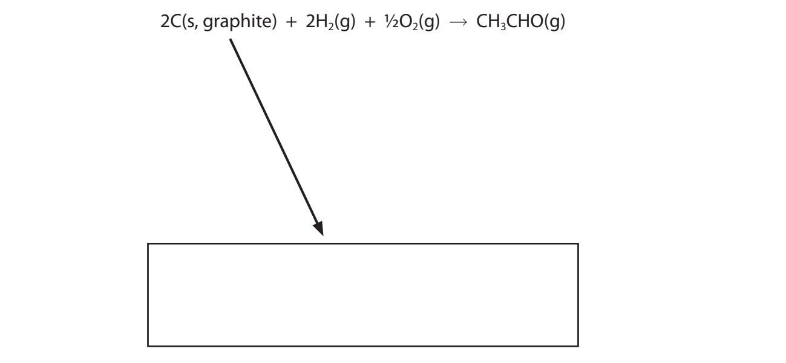
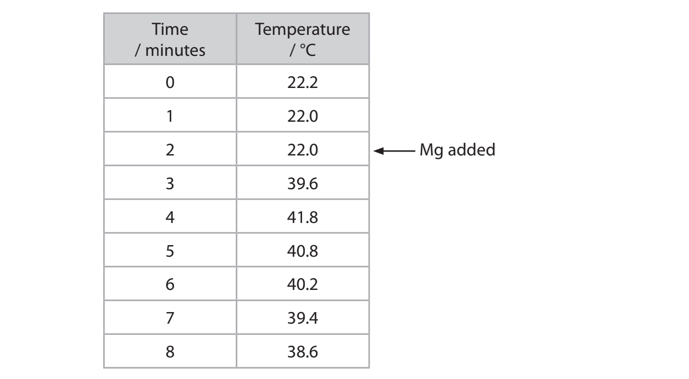
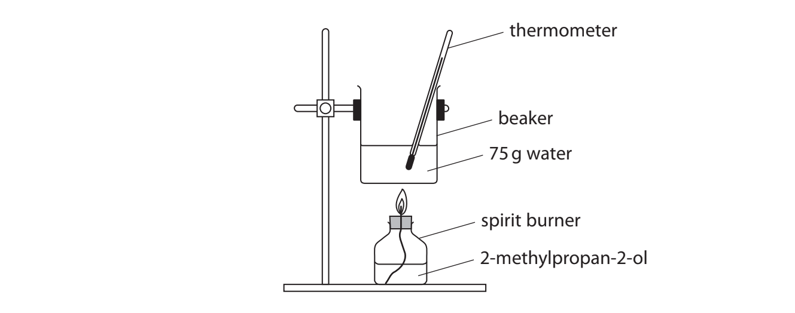
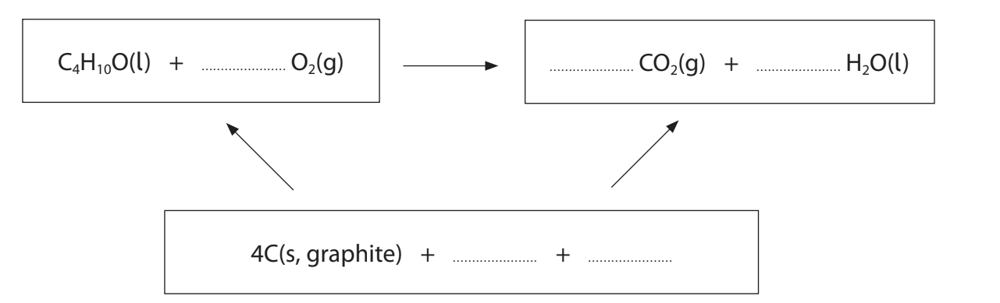
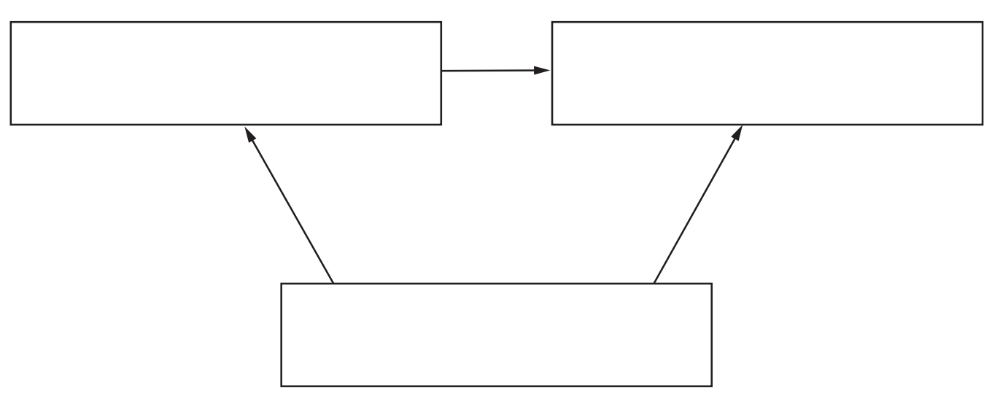
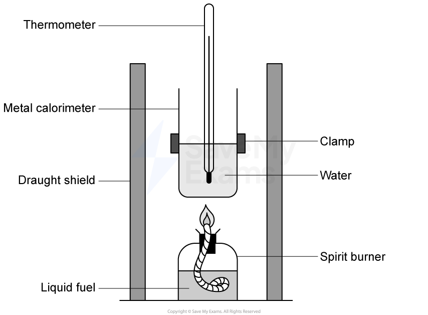
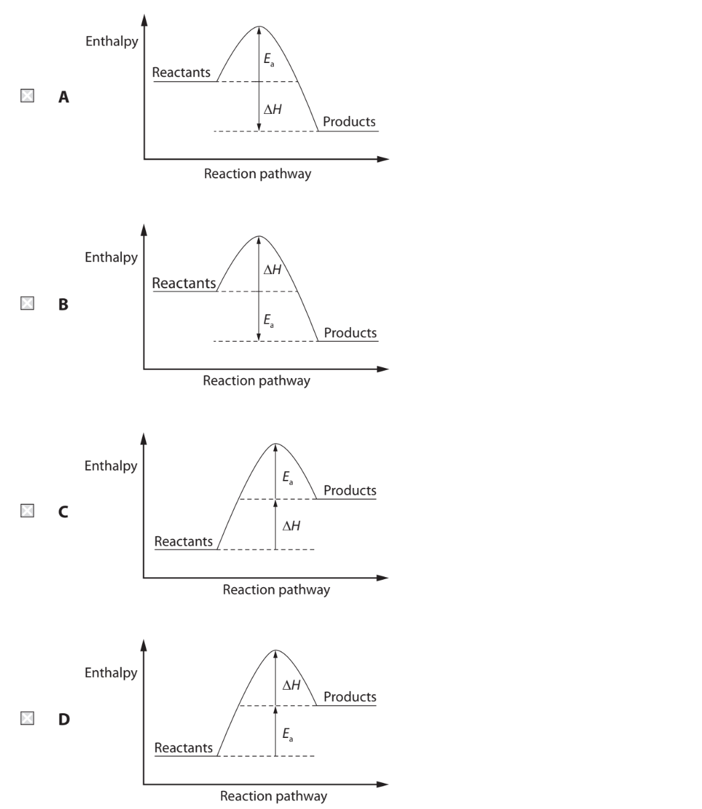
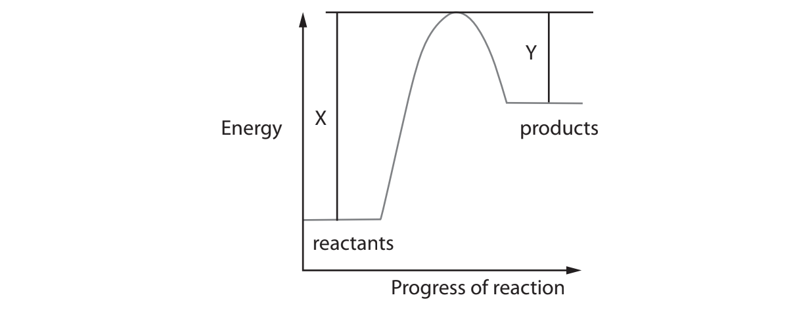
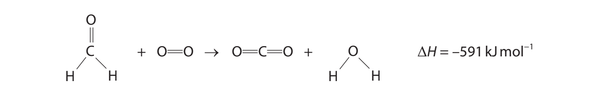

# Exam Questions — Energetics
**2. Energetics, Group Chemistry, Halogenoalkanes & Alcohols** · Edexcel International A Level (IAL) Chemistry (YCH11)
> Source: [https://www.savemyexams.com/international-a-level/chemistry/edexcel/17/topic-questions/2-energetics-group-chemistry-halogenoalkanes-and-alcohols/2-1-energetics/structured-questions/](https://www.savemyexams.com/international-a-level/chemistry/edexcel/17/topic-questions/2-energetics-group-chemistry-halogenoalkanes-and-alcohols/2-1-energetics/structured-questions/) · 17 questions · total 77 marks

## Q1 — medium — 16 marks · structured-questions

### 19() — 8 marks — command: multiple — structured — from paper Oct 2021 · WCH12/01
This question is about enthalpy changes.

An experiment was carried out to determine the enthalpy change of combustion for ethanol.

C2H5OH (l) + 3O2 (g) → 2CO2 (g) + 3H2O (l)

1.19 g of ethanol was burned in a spirit burner. The heat energy from this combustion raised the temperature of 100 g of water from 21.6°C to 63.9 °C.

i) Calculate the number of moles of ethanol in 1.19 g.

[Molar mass of ethanol = 46.0 g mol−1 ]

**(1)**

ii) Calculate the heat energy required to raise the temperature of 100g of water from 21.6 °C to 63.9 °C.

[Specific heat capacity of water = 4.18 J g−1 °C−1]

**(2)**

iii) Use your answers to (a)(i) and (ii) to calculate a value for the enthalpy change of combustion of ethanol. Give your answer to an appropriate number of significant figures and include a sign and units.

**(3)**

iv) The value of the enthalpy change of combustion from this experiment was very inaccurate.

Give two reasons why this value was so inaccurate, apart from heat loss.

**(2)**

### 19((b)) — 5 marks — command: multiple — structured — from paper Oct 2021 · WCH12/01
Mean bond enthalpies can be used to calculate a value for the enthalpy change of combustion of a compound.

i) Give the meaning of the term ‘mean bond enthalpy’.

**(2)**

ii) Calculate a value for the enthalpy change of combustion of methanol, using the information in the table and the equation shown.

**(3)**

CH3OH + 1½O2 → CO2 + 2H2O

|   | **C–H** | **C–O** | **O–H** | **O=O** | **C=O** |
|---|---|---|---|---|---|
| Mean bond enthalpy / kJ mol−1 | 413 | 358 | 464 | 498 | 805 |

### 19((c)) — 3 marks — command: calculate — structured — from paper Oct 2021 · WCH12/01
Enthalpy changes of combustion can be used to calculate the enthalpy change of formation of a compound.

| **Substance** | **Standard enthalpy change of combustion, ∆****c**`bold italic H to the power of bold ⦵`**/ kJ mol****−1** |
|---|---|
| C (s,graphite) | – 394 |
| H2 (g) | – 286 |
| CH3CHO (g) | – 1167 |

Complete the Hess cycle and use it to calculate the standard enthalpy change of formation for ethanal, CH3CHO.

## Q2 — medium — 13 marks · structured-questions

### 19((a)) — 2 marks — command: write — structured — from paper June 2021 · WCH12/01
Magnesium reacts with sulfuric acid in an exothermic reaction.

Write an equation for the reaction. 
Include state symbols in your answer.

### 19((b)) — 3 marks — command: justify — structured — from paper June 2021 · WCH12/01
A student carried out an experiment to determine the enthalpy change of the reaction.

A sample of 0.50 g of magnesium powder was added to 25 cm3 of 0.20 mol dm−3 sulfuric acid.

Calculate the number of moles of magnesium and of sulfuric acid that **reacted.** Justify your answer.

### 19((c)) — 4 marks — command: multiple — structured — from paper June 2021 · WCH12/01
i) The results obtained are given in the table.

Plot the results on the grid.

**(2)**

ii) Use your graph to determine the maximum change in temperature.

You **must** show your working on the graph.

**(2)**

Δ*T* = ..............................................................

### 19((d)) — 4 marks — command: calculate — structured — from paper June 2021 · WCH12/01
Calculate the standard molar enthalpy change for the reaction, using your answers to (b) and (c)(ii).

Include a sign and units in your answer.

[Specific heat capacity of solution = 4.18 J g–1 °C–1]

## Q3 — medium — 12 marks · structured-questions

### 21((a)) — 5 marks — command: multiple — structured — from paper Jan 2022 · WCH12/01
Enthalpy changes of combustion can be determined using calorimetry or calculated using Hess cycles. Apparatus for a calorimetry experiment is shown.

A sample of 2‐methylpropan‐2‐ol was burned in a spirit burner and used to heat 75 g of water. The results are shown.

|   | **At the start** | **At the end** | **Change** |
|---|---|---|---|
| Mass of spirit burner / g | 267.35 | 266.78 |   |
| Temperature of water / °C | 19.5 | 65.3 |   |

i) Complete the table.

**(1)**

ii) Calculate the enthalpy change of combustion, Δc*H*, of 2‐methylpropan‐2‐ol. 
Give a sign and units in your answer. 
[Specific heat capacity of water = 4.18 Jg−1 °C−1]

**(4)**

### 21((b)) — 5 marks — command: multiple — structured — from paper Jan 2022 · WCH12/01
The standard enthalpy change of combustion, Δc`H to the power of ⦵`, can be calculated using standard enthalpy changes of formation.

| **Compound** | **∆****f**`H to the power of ⦵`**/ kJ mol****−1** |
|---|---|
| 2‐methylpropan‐2‐ol | –359 |
| carbon dioxide | –394 |
| water | –286 |

i) State why no ∆f`H to the power of ⦵`value has been given for oxygen.

**(1)**

ii) Complete the Hess cycle.

**(2)**

iii) Calculate the standard enthalpy change of combustion of 2‐methylpropan‐2‐ol using the data in the table and the completed Hess cycle.

**(2)**

### 21((c)) — 2 marks — command: suggest — structured — from paper Jan 2022 · WCH12/01
The value for Δc*H* obtained in part (a)(ii) is much less exothermic than Δc`H to the power of ⦵`calculated in (b)(iii).

Suggest **two** reasons for this other than non‐standard conditions.

## Q4 — medium — 14 marks · structured-questions

### 21((a)) — 2 marks — command: describe — structured — from paper Jan 2021 · WCH12/01
This question is about ethanoic acid and some related salts.

A test to confirm the presence of an aqueous acid is adding a small amount of solid sodium carbonate to the solution.

Describe **two** observations you would **see** in this test.

### 21((b)) — 5 marks — command: calculate — structured — from paper Jan 2021 · WCH12/01
Sodium ethanoate is a component of reusable hand warmers.

In use, a supersaturated solution of sodium ethanoate recrystallises to form solid hydrated sodium ethanoate, releasing energy.

CH3COONa (aq) + 3H2O (l) → CH3COONa.3H2O (s)      Δr*H* = −19.7 kJ mol−1

A hand warmer has a mass of 63.2 g and forms 20.1 g of hydrated sodium ethanoate on recrystallisation.

Calculate the maximum temperature reached by the hand warmer if its initial temperature is 5.0 °C.

[Specific heat capacity of the hand warmer = 3.0 J °C−1 g−1]

### 21((c)) — 5 marks — command: calculate — structured — from paper Jan 2021 · WCH12/01
Ammonium ethanoate, CH3COONH4(s), is used to control the pH of foods. It can be formed by the reaction of pure ethanoic acid, CH3COOH(l), with ammonium carbonate, (NH4)2CO3(s).

Calculate the standard enthalpy change for this reaction by completing the Hess cycle and using the data shown.

| **Compound** | **Enthalpy change of formation / kJ mol****−1** |
|---|---|
| CH3COOH(l) | −484.5 |
| (NH4)2CO3(s) | −939.9 |
| CH3COONH4(s) | −586.3 |
| CO2(g) | −393.5 |
| H2O(l) | −285.8 |

### 21((d)) — 2 marks — command: calculate — structured — from paper Jan 2021 · WCH12/01
Ammonium carbonate, (NH4)2CO3 , is an ingredient in cleaning solutions for camera lenses.

These are aqueous solutions which contain no more than 1.8 g of ammonium carbonate in 100 cm3 of solution.

Calculate the maximum concentration, in mol dm−3, of ammonium carbonate in such a solution.

## Q5 — medium — 10 marks · structured-questions

### 1() — 2 marks — command: state — structured
In an experiment, a student investigates the enthalpy change of combustion of propan-1-ol.

State what is meant by the term standard enthalpy of combustion.

### 2() — 4 marks — command: multiple — structured
Propan-1-ol burns completely according to the equation:

CH3CH2CH2OH (l) + 4½O2 (g) → 3CO2 (g) + 4H2O (l)

The standard enthalpies of formation, Δf*H*θ, are given below.

| Substance | Δf*H*θ / kJ mol–1 |
|---|---|
| CH3CH2CH2OH (l) | –303 |
| CO2 (g) | –394 |
| H2O (l) | –286 |

i) Complete the Hess cycle below by filling in the blank box.

[1]

ii) Calculate the standard enthalpy of combustion of propan-1-ol.

[3]

### 3() — 3 marks — command: calculate — structured
The student carries out a simple calorimetry experiment to determine an experimental value for the enthalpy change of combustion of propan-1-ol.

The apparatus used is shown.

- Mass of water in calorimeter = 200 g
- Initial temperature of water = 22.0 °C
- Maximum temperature of water = 44.5 °C
- Mass of propan-1-ol burnt = 0.60 g

(Specific heat capacity of water, c = 4.18 J g–1 K–1; *M*r(CH3CH2CH2OH) = 60.0)

Calculate the experimental enthalpy change of combustion of propan-1-ol.

### 4() — 1 mark — command: explain — structured
Using mean bond enthalpies, the enthalpy change of combustion of propan-1-ol is calculated as –1920 kJ mol–1.

Explain **one** reason why this bond enthalpy value differs from the value you calculated in part (b).

## Q6 — easy — 1 marks · multiple-choice-questions

### 1() — 1 mark — multiple_choice — from paper Jan 2022 · WCH12/01
Which are correct for the reaction shown?

CH3COOH + KOH → CH3COO−K++ H2O        Δ*H* = –55.8 kJ mol−1

|   | ** ** | **Type of reaction** | **Type of enthalpy change** |
|---|---|---|---|
| ☐ | **A** | endothermic | formation |
| ☐ | **B** | endothermic | neutralisation |
| ☐ | **C** | exothermic | formation |
| ☐ | **D** | exothermic | neutralisation |
- **A.** 
- **B.** 
- **C.** 
- **D.** 

## Q7 — easy — 1 marks · multiple-choice-questions

### 1() — 1 mark — multiple_choice — from paper June 2021 · WCH12/01
Which is the correctly labelled reaction profile for an exothermic reaction?

- **A.** 
- **B.** 
- **C.** 
- **D.** 

## Q8 — easy — 1 marks · multiple-choice-questions

### 1() — 1 mark — multiple_choice — from paper Jan 2021 · WCH12/01
The energy profile for a reaction is shown.

What is the minimum energy needed for this reaction to occur?
- **A.** X
- **B.** Y
- **C.** X − Y
- **D.** X + Y

## Q9 — easy — 1 marks · multiple-choice-questions

### 2() — 1 mark — multiple_choice — from paper Jan 2022 · WCH12/01
Which equation does **not** represent a standard enthalpy change of atomisation?
- **A.** Mg (s) → Mg (g)
- **B.** Cl2 (g) → 2Cl (g)
- **C.** 1⁄2O2 (g) → O (g)
- **D.** Hg (l) → Hg (g)

## Q10 — easy — 1 marks · multiple-choice-questions

### 3() — 1 mark — multiple_choice — from paper Jan 2021 · WCH14/01
Which equation represents the standard enthalpy change of atomisation, Δat*H*, of bromine?
- **A.** 1⁄2 Br2 (l) → Br (g)
- **B.** Br2 (l) → 2Br (g)
- **C.** 1⁄2 Br2 (g) → Br (g)
- **D.** Br2 (g) → 2Br (g)

## Q11 — medium — 1 marks · multiple-choice-questions

### 2() — 1 mark — multiple_choice — from paper June 2021 · WCH12/01
The equation for a reaction is

2C (s) + O2 (g) → 2CO (g)

Which is the correct symbol for the enthalpy change for this reaction?
- **A.** Δat*H*
- **B.** Δc*H*
- **C.** Δf*H*
- **D.** Δr*H*

## Q12 — medium — 1 marks · multiple-choice-questions

### 3() — 1 mark — multiple_choice — from paper Jan 2022 · WCH12/01
5.20 g of sodium hydrogencarbonate is added to an excess of acid.

The temperature increases and the energy change is calculated to be 1030 J.

What is the enthalpy change per mole of sodium hydrogencarbonate?

[*M*r NaHCO3 = 84.0]
- **A.** –12.3 kJ mol−1
- **B.** –16.6 kJ mol−1
- **C.** –63.8 kJ mol−1
- **D.** –16600 kJ mol−1

## Q13 — medium — 1 marks · multiple-choice-questions

### 4() — 1 mark — multiple_choice — from paper Jan 2022 · WCH12/01
The equation for the complete combustion of methanal is shown.

Some bond enthalpy data are shown.

| **Bond** | **Bond enthalpy / kJ mol****−1** |
|---|---|
| C—H | 413 |
| O$=$O | 498 |
| C$=$O in CO2 | 805 |
| O—H | 464 |

What is the C$=$O bond enthalpy in methanal?
- **A.** 623 kJ mol−1
- **B.** 678 kJ mol−1
- **C.** 805 kJ mol−1
- **D.** 1036 kJ mol−1

## Q14 — medium — 1 marks · multiple-choice-questions

### 11() — 1 mark — multiple_choice — from paper Jan 2021 · WCH12/01
The table shows the amount of energy released per gram when some alkanes are burned in excess oxygen under standard conditions.

| **Alkane** | **Energy released / kJ g****−1** |
|---|---|
| methane | 55.6 |
| ethane | 52.0 |
| propane | 50.4 |
| butane | 49.6 |

Which alkane has a standard enthalpy change of combustion of −2877 kJ mol−1?
- **A.** methane
- **B.** ethane
- **C.** propane
- **D.** butane

## Q15 — medium — 1 marks · multiple-choice-questions

### 12() — 1 mark — multiple_choice — from paper Jan 2021 · WCH12/01
The enthalpy changes for two reactions are shown.

H+ (aq) + OH− (aq) → H2O (l)                    Δr*H* = −57.2 kJ mol−1

CH3COOH (aq) + OH− (aq) → CH3COO− (aq) + H2O (l)     Δr*H* = −56.0 kJ mol−1

What is the enthalpy change for the dissociation of CH3COOH (aq) into CH3COO− (aq) and H+ (aq) ions, in kJ mol−1?
- **A.** +113.2
- **B.** +1.2
- **C.** −1.2
- **D.** −113.2

## Q16 — medium — 1 marks · multiple-choice-questions

### 1() — 1 mark — multiple_choice
The reaction profile for an endothermic reaction is shown.

What is the activation energy of the **reverse** reaction?
- **A.** –70 kJ mol–1
- **B.** +70 kJ mol–1
- **C.** +80 kJ mol–1
- **D.** +230 kJ mol–1

## Q17 — hard — 1 marks · multiple-choice-questions

### 1() — 1 mark — multiple_choice
The enthalpy changes of combustion, Δc*H*, are given below.

| Substance | Δc*H* / kJ mol–1 |
|---|---|
| C (s) | –394 |
| H2 (g) | –286 |
| CH3OH (l) | –726 |

What is the enthalpy change of formation, Δf*H*, of methanol, CH3OH (l)?
- **A.** –240 kJ mol–1
- **B.** +240 kJ mol–1
- **C.** –966 kJ mol–1
- **D.** –1406 kJ mol–1
