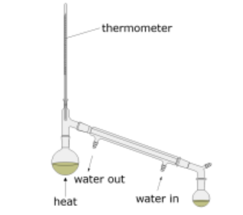
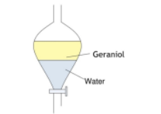
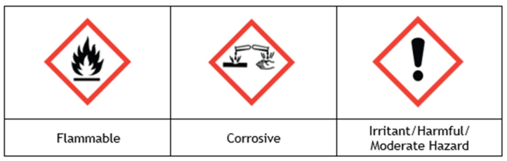
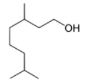
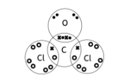
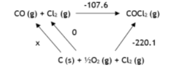
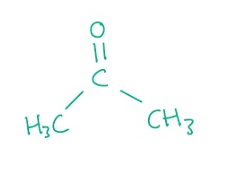

# Mark Schemes — Organic Chemistry: Techniques & Spectra
**2. Energetics, Group Chemistry, Halogenoalkanes & Alcohols** · Edexcel International A Level (IAL) Chemistry (YCH11)

## Q1 — medium — 17 marks · structured-questions

### 2((a)) — 7 marks
i) The** measurements** that should be made are:

- Mass / weight of each U-tube and their contents; **[1 mark] **
- Mass / weight before and after combustion / reaction; **[1 mark] **

ii) **Two** reasons why pure O2 (g), and **not** air, should be used are:

- To exclude water from the air; **[1 mark]**
- To exclude carbon dioxide from the air; **[1 mark]**
- For complete combustion;** [1 mark] **

iii) To calculate the empirical formula of **X**:

- Mass of oxygen Mass O = 1.33 - 0.14 - 0.63 = 0.56 (g); **[1 mark]**
- Moles of C, H and O | C | H | O |
|---|---|---|
| $\frac{0.63}{12}$= 0.0525 | $\frac{0.14}{1}$= 0.14 | $\frac{0.56}{16}$= 0.035 | ; **[1 mark]**
- Mole ratio and empirical formula | C | H | O |
|---|---|---|
| 1.5 | 4 | 1 |
| 3 | 8 | 2 | C3H8O2; **[1 mark] **

**Final answer:** **[Total: 8 marks] **

- *For part (i) you can also give*

  - *The mass of silica (gel) and soda lime *
  - *Initial mass and final mass or change in mass*
- *For part (ii)*

  - *Air will also contain water vapour and other gases such as carbon dioxide so pure oxygen will help the reaction go to completion *
- *For part (iii)*

  - *Make sure you show your working and show each stage of your calculation*
  - *If you make a mistake the examiner will be able to give you credit further on in the calculation if you make a mistake *

### 2((b)) — 1 marks
From this observation only, you can deduce that:

- (**X** contains) O-H / hydroxyl (group); **[1 mark] **

**Final answer:** **[Total: 1 mark] **

- *When an alcohol reacts with phosphorus(V) chloride a very vigorous reaction occurs at room temperature *
- *This reaction produces two inorganic products: phosphoryl chloride and hydrogen chloride *

  - *R-OH + PCl**5** → R-Cl + POCl**3** + HCl*
  - *R represents the carbon chain*

### 2((c)) — 3 marks
A **labelled** diagram of the apparatus that could be used to separate **Y** from the reaction mixture is:

- Round-bottom / pear shaped flask and still head and thermometer; **[1 mark] **
- (Downward-sloping) Liebig condenser with inner tube
**AND**
Labelled water flow; **[1 mark] **
- Heat
**AND**
Unsealed collection vessel
**AND**
Left hand side of apparatus sealed;** [1 mark] **

**Final answer:** **[Total: 3 marks] **

- *Make sure your diagrams show working apparatus *

  - *This means they do not contain any gaps where apparatus fits together for gas to escape *
- *You will be given credit for any form of heating or drawing a fractionating column*

### 2((d)) — 2 marks
This spectrum shows that **Y** contains a carboxylic acid functional group as:

- (There is a broad) peak at 3220 cm−1
**AND**
(which indicates an) O-H (in a carboxylic acid);** [1 mark] **
- The peak at 1720 cm−1
**AND**
(indicates) C=O; **[1 mark] **

**Final answer:** **[Total: 2 marks] **

- *You can give any wavenumber or range of values within 3300-2500 and you can use OH or -OH for O-H*

  - *You would not gain this mark if you specified that the OH group was in an alcohol*
- *You must also link the wavenumber to the functional group*
- *For C=O you can give the wavenumber as any number or range of numbers within 1740-1680*

### 2((e)) — 2 marks
i) The mass spectrum is consistent with **Y **having the molecular formula C3H4O3 because:

- Molecular (ion) / M(+) peak at *m* / *z* = 88 
**AND **
(Relative molecular mass of) C3H4O3 is 88; **[1 mark] **

ii) The structure of the ion causing the peak at *m / z* = 43 in the mass spectrum of **Y **is:

- CH3CO+;** [1 mark] **

**Final answer:** **[Total: 2 marks] **

- *The mass of C**3**H**4**O**3** is:*

  - *(3 x C) + (4 x H) + (3 x O) = (3 x 12) + (4 x 1) + (3 x 16) = 88*
- *You can also say the peak to the far right / with the highest **m** / **z** is 88 or give any indication of M**(+)** peak being 88 *
- *The charge on the ion can be in any place i.e. **+**CH**3**CO*
- *You can also give the formula CH**2**CHO**+** / CH**2**COH**+** / HC=CH(OH)**+** / CH**2**=C(OH)**+*

### 2((f)) — 2 marks
The structures of **X** and **Y **are:

- Structure of **X** 
CH3CH(OH)CH2OH; **[1 mark] **
- Structure of **Y** 
CH3COCOOH or CH2=C(OH)COOH; **[1 mark] **

**Final answer:** **[Total: 2 marks] **

- *You need to use the clues given in whole the question to help you answer this question *

  - *Compound **X** contains 1 type of functional group which must be an alcohol and has the empirical formula C**3**H**8**O**2*
  - *Therefore there must be two -OH groups *
- *Compound **Y** has a molar mass of 88 g mol**-1** and contains both a COOH group and C=O group *

  - *COOH has a mass of 45 meaning a mass of 43 is left*
  
    - *-CH**3**CO and -CH**2**=C(OH) both have a mass of 43*
  - *This will involve a bit of trial and error when adding up the molar mass*
  - *Make sure the structure works, so each carbon atom has the correct number of bonds *

## Q2 — medium — 16 marks · structured-questions

### 2((a)) — 4 marks
**Name** the functional groups, giving a chemical test and its positive result to show the presence of each group:

- Alkene
**AND**
Shake with bromine water; **[1 mark]**
- The bromine water decolourises
**OR**
Brown / orange / yellow to colourless; **[1 mark]**
- Alcohol 
**AND**
Add PCl5 / phosphorus(V) chloride; **[1 mark]**
- Misty fumes / white fumes / steamy fumes
**OR**
Fumes turn damp blue litmus red; **[1 mark]**

**[Total: 4 marks]**

- *Testing for functional groups are common exam questions so make sure you can give both the test AND the expected result for different ones *
- *Using bromine water is a test for unsaturation - the presence of a C=C double bond*

  - *The bromine  will add across the double bond in the alkene to form a saturated compound resulting in the orange bromine water decolourising *
- *When phosphorus(V) chloride is added to the substance, misty / steamy fumes of HCl gas are given off *

  - *The HCl gas would turn damp blue litmus paper red due to being acidic*

### 2((b)) — 3 marks
A labelled diagram of this apparatus and its contents is:

- Separating funnel; **[1 mark]**
- Diagram of separating funnel; **[1 mark]**
- Layers **AND** the right way around; **[1 mark]**

**[Total: 3 marks]**

- *The diagram should show a tap - but it does not need to be labelled - and a narrow top of the vessel, capable of being stoppered*
- *You must make sure the layers are the correct way around*

  - *You should know that the density of water is 1 g cm**-3*
  - *You are given the density of geraniol in the question as 0.889 g cm**-1*
  - *Water is the denser liquid so should be the bottom layer *
- *If the tap is labelled as a stopper you will not score mark 2 *
- *You could label geraniol as the organic or alcohol layer*

### 2((c)) — 3 marks
A sample of pure, dry geraniol can be produced by:

- Add a suitable drying agent; **[1 mark]**
- Description of mixing; **[1 mark]**
- Description of separating; **[1 mark]**

**[Total: 3 marks]**

- *A drying agent will remove traces of water from the geraniol *
- *Suitable drying agents you can score the first mark for are:*

  - *(Anhydrous) calcium chloride / CaCl**2*
  - *(Anhydrous) sodium sulfate / Na**2**SO**4*
  - *(Anhydrous) magnesium sulfate / MgSO**4*
  - *Silica gel / CaSO**4*
  - *Be careful- if you write the name and formula for the drying agent, both must be correct or you will lose the mark *
- *A description of drying / mixing would be:*

  - *Mix / shake / swirl / wait until it goes clear or until the drying agent stops lumping together *
- *A description of separating would be:*

  - *Decant or pour off the liquid **OR** Filter off the solid*

### 2((d)) — 3 marks
i) The hazard symbols are:

- Three correct; **[2 marks]**
- Two correct; **[1 mark]**

ii) **One** precaution, other than wearing safety spectacles and a laboratory coat, that should be taken when using pure geraniol to reduce the risk associated with the hazard symbol shown is:

Any **one** from:

- Wear gloves; **[1 mark]**
- Use small amounts; **[1 mark]**
- Use a test tube rack / holder; **[1 mark]**
- Keep lids on corrosive liquids; **[1 mark]**
- Any positive action to prevent drips getting on bench e.g place used pipettes in beaker; **[1 mark]**

**Final answer:** **[Total: 3  marks]**

- *It is important you can recall what different hazard symbols mean and the hazards associated with the different core practicals*
- *Use your common sense to think of how, when you carry out the experiment, you reduce the associated risks*

### 2((e)) — 1 marks
The appearance of the flame when geraniol is ignited is:

Any suitable observation:

- Smoky / sooty flame; **[1 mark]**
- Yellow / orange flame; **[1 mark]**
- Black smoke; **[1 mark]**

**[Total: 1 mark]**

- *Geraniol has a reasonably long carbon chain*
- *The larger the carbon content the greater amount of oxygen needed for complete combustion so longer chain / larger molecules will often undergo incomplete combustion*
- *Observations should therefore be those associated with incomplete combustion*

### 2((f)) — 2 marks
i) The essential condition required for this reaction are:

- Nickel / Ni (catalyst at 170 oC); ** [1 mark]**

ii) The **skeletal **formula of the product of this reaction is:

- Correct skeletal formula;** [1 mark]**

**[Total: 2 marks]**

- *A hydrogenation reaction will occur between geraniol and hydrogen *
- *If hydrogen is in excess, it can add across both double bonds to form a saturated compound*
- *You could also have said a platinum or palladium catalyst as opposed to nickel *
- *It's really important you know the conditions for the reaction between an alkene with:*

  - *hydrogen*
  - *steam*
  - *hydrogen halides*
  - *halogens*

## Q3 — medium — 20 marks · structured-questions

### 22((a)) — 2 marks
The  dot-and-cross diagram to show the bonding in phosgene is:

- Carbon singly covalently bonded to two chlorine atoms and three lone pairs on each chlorine; **[1 mark]**
- Carbon doubly bonded to an oxygen atom and two lone pairs on the oxygen; **[1 mark]**

**[Total: 2 marks]**

- *All dots or all crosses to represent the electrons will score the mark and they are not required to be in pairs*

### 22((b)) — 8 marks
i) The reaction conditions could be changed to maximise the **equilibrium **yield of phosgene in this reaction by:

Any **two** pairs from the three:

- Decrease the temperature; **[1 mark]**
- As the (forward) reaction is exothermic; **[1 mark]**
- Increase the pressure; **[1 mark]**
- As there fewer moles of (gas) on the product side; **[1 mark]**

EITHER

- Remove the phosgene (as it is formed); **[1 mark]**
- To reduce the concentration of product (so equilibrium moves to the right); **[1 mark]**

**OR**

- Add more CO / Cl2; **[1 mark]**
- To increase the concentration of the reactants (so equilibrium moves to the right); **[1 mark]**

ii) The completed Hess's law cycle:

- Correct species; **[1 mark]**
- Correct state symbols; **[1 mark]**
- Correct arrows; **[1 mark]**
- Calculation of value: Δf*H* CO = −220.1 ‒ (−107.6)= −112.5 (kJ mol−1); **[1 mark]**

**[Total: 4 marks]**

- *Remember:** Changing pressure, temperature and concentration all affect the position of equilibrium so use the information in the question to determine what changes need to be made to shift the position of equilibrium to the right *
- *You are told the forward reaction is exothermic by the negative enthalpy change, Δ**r**H** = –107.6 kJ mol**–1** *
- *In a Hess cycle to calculate the enthalpy change of formation, the elements should be written underneath in the same quantities as they are found in the equation *

### 22((c)) — 4 marks
i) The **ratio** of peak heights are at *m / z* values of 102, 100 and 98 because:

- Chlorine isotopes (35 and 37) are in the ratio of 3:1;** [1 mark]**
- (As there are) two chlorine atoms give the ratio of 9:6:1; ** [1 mark]**

ii) An  identity for the peak at *m / z* = 63 is:

- CO35Cl+; ** [1 mark]**

iii) The peak at *m / z* = 65, showing its relative intensity is:

- Peak drawn at 65 with relative intensity of 33.3; ** [1 mark]**

**[Total: 4 marks]**

- *For part i), the two marking points are marked independently meaning you can score marking point 2 without achieving marking point 1 *

  - *For marking point 1 you also score the mark by saying that 75% of chlorine exists as **37**Cl, and 25% exists as **35**Cl or show your workings:*
  
    - *CO**37**Cl**37**Cl**(+)** = 102*
    - *CO**35** Cl**37**Cl**(+)** = 100*
    - *CO**35** Cl**35** Cl**(+) **= 98*
  - *You should know that the ratio of peak heights for two chlorine atoms is 9:6:1*
- *To determine the identity for the peak at **m / z** = 63, take off the** M**r** for oxygen and carbon*

  - *63 - 12 - 16 = 35 so CO**35**Cl**+*
  - *The + can be on any of the atoms*
- *The peak at **m / z** = 65 will be due to CO**37**Cl**+*

  - *The peak will have a relative intensity of 33.3 due to existing in the ratio 3:1 with CO**35**Cl**+** (which has an abundance of 100)*

### 22((d)) — 2 marks
The wavenumber of a strong absorbance you would expect to see in the infrared spectrum for phosgene is:

- 1795 (cm−1); **[1 mark]**
- (From the) C=O (stretching vibrations); **[1 mark]**

**[Total: 2 marks]**

- *Your answer can be in the range of 1630-1850 *
- *You will only score mark 2 if you achieve mark 1 *
- *A number or range within 550-850 (cm**−1**) **AND **due to the C-Cl (stretching vibrations) will score 2 marks *

### 22((e)) — 4 marks
i) An equation for this reaction is:

- 2CHCl3 + O2 → 2COCl2 + 2HCl; **[1 mark]**

ii) The rate of this reaction decreases with time because:

- Oxygen concentration will decrease; **[1 mark]**

iii) A precaution that should be taken when opening a bottle of trichloromethane is:

- Use a fume cupboard (due to toxic and irritant gases); **[1 mark]**

iv) Suggest whether an old bottle of trichloromethane can still be used for medical treatment, giving a reason for your answer:

- No, because some of the HCl / COCl2 may have dissolved into the trichloromethane / be trapped as bubbles in the liquid; **[1 mark]**

**[Total: 4 marks]**

- *You are given the formula for phosgene in part a) *
- *Multiples of the equation are accepted *
- *Other answers that will score the mark for part iii) include:*

  - *Use a well ventilated lab*
  - *Wear a gas mask *
- *For part (iv), you could have also gained a mark for stating that trichloromethane may have reacted (with oxygen) to give (toxic) phosgene / COCl**2*
- *Trichloromethane is also known as chloroform and you would not be penalised for using this alternative name*

## Q4 — easy — 1 marks · multiple-choice-questions

### 1() — 1 marks
**Correct answer: B** — hexane

**Final answer:** **The correct answer is ****B**** because:**

- There is a peak at 2800 - 3000 cm-1 which correlates to the value in the data booklet for an alkane (2853 - 2962 cm-1)
- There are no peaks for the functional groups of an aldehyde, carboxylic acid, or alcohol

**A** is incorrect as the spectrum does not have a peak for the C=O

**C **is incorrect as  the spectrum does not have a peak for the C=O and O-H

**D** is incorrect as  the spectrum does not have a peak for the O-H

## Q5 — easy — 1 marks · multiple-choice-questions

### 4() — 1 marks
**Correct answer: D** — highest mass/charge ratio

**Final answer:** **The correct answer is ****D**** because:**

- The molecular ion is formed when it is bombarded by a stream of electrons which causes an electron to be knocked off the molecule to form a positive ion
- The molecular ion is unstable so can fragment into smaller ions but compared to them the molecular ion has the greatest mass / charge ratio

**A** is incorrect as  the molecular ion does not always have the greatest abundance

**B** is incorrect as the molecular ion does not always have the greatest stability

**C** is incorrect as the molecular ion cannot have a higher charge than the other ions

## Q6 — easy — 1 marks · multiple-choice-questions

### 5() — 1 marks
**Correct answer: C** — 43

**Final answer:** **The correct answer is ****C**** because:**

- The peak with an *m/z* value of 43 is due to the C3H7+ fragment

  - [CH3CH2CH2CH2OH]+ → [CH3CH2CH2]+ + CH2=OH
  - (3 x 12.0) + (7 x 1.0 = 43
- The structure of butan-2-ol does not allow for a peak due to C3H7+ due to the position of the -OH group

**A** is incorrect as  both would be expected to have this peak due to CH3 +

**B** is incorrect as  both would be expected to have this peak due to C2H5+

**D** is incorrect as  both would be expected to have this peak due to C4H9+

## Q7 — easy — 1 marks · multiple-choice-questions

### 12() — 1 marks
**Correct answer: C** — 

**Final answer:** **The correct answer is ****C**** because:**

- The functional groups present in CH2=CHCH2OH are a C=C double bond (alkene) and -OH group (alcohol)
- Use the data booklet to look up the wavelength range for these groups:

  - C=C has a wavelength range of 1669 - 1645 cm-1
  - -OH has a wavelength range of 3750 - 3200 cm-1
  - Option **C** has absorption peaks at both these ranges

**A** is incorrect as this shows no absorbance for the C=C stretch

**B** is incorrect as this shows no absorbance for the O-H stretch or C=C stretch

**D** is incorrect as because this shows no absorbance for the O-H stretch

## Q8 — easy — 1 marks · multiple-choice-questions

### 14() — 1 marks
**Correct answer: D** — 

**Final answer:** **The correct answer is ****D**** because:**

- The peak at **P** occurs at approximately 2850 cm-1

  - This corresponds to the aldehyde C-H stretching vibration which occurs at 2900 - 2820 cm-1
  - It also corresponds to the carboxylic acid O-H stretching vibration which occurs at 3300 -2500 cm-1 but this would be a broad peak, so this can be ruled out
- The peak at **Q** occurs at approximately 1720 cm-1

  - This corresponds to the aldehyde C=O stretching vibration at 1740 - 1720 cm-1

**A** is incorrect as **P** is too sharp to be an OH stretch and Q is outside the region of 1725 - 1700 cm−1 for a carboxylic acid C=O stretch

**B** is incorrect as **P** is too sharp to be an OH stretch

**C** is incorrect as  **Q** is outside the region of 1725 - 1700 cm−1 for a carboxylic acid C=O stretch

## Q9 — medium — 1 marks · multiple-choice-questions

### 5() — 1 marks
**Correct answer: A** — 

**Final answer:** **The correct answer is ****A ****because:**

- The IR spectrum shows two significant peaks

  - Broad peak between 2500-3500 showing an O-H bond
  - A sharp absorbance peak at 1640 to 1750 showing a C=O bond

**B** is incorrect as  the structure has no C=O group

**C** is incorrect as the structure has no O-H group

**D** is incorrect as  the structure has no O-H group

## Q10 — medium — 1 marks · multiple-choice-questions

### 13() — 1 marks
**Correct answer: B** — CH3CO+

**Final answer:** **The correct answer is ****B**** because:**

- Propanone has the structure:

- CH3CO+ is the only fragment of the options available that propanone would produce
- The other principal ion that propanone would produce is CH3+

**A**, **C**, and **D** are incorrect as  propanone does not produce these fragments

## Q11 — medium — 1 marks · multiple-choice-questions

### 1() — 1 marks
**Correct answer: D** — Tollens' reagent

**Final answer:** **The correct answer is D**

- Tollens’ reagent (ammoniacal silver nitrate) oxidises aldehydes to carboxylic acids, reducing Ag⁺ ions to metallic silver, which deposits as a silver mirror on the inside of the test tube
- Propanal (aldehyde) → silver mirror observed
- Propanone (ketone) cannot be easily oxidised under these conditions → no reaction

**A** is incorrect as 2,4-DNPH produces a **yellow or orange precipitate** with **both** aldehydes and ketones (it tests for the C=O group, not specifically for aldehydes), so it does not give a silver mirror

**B** is incorrect as acidified K2Cr2O7 distinguishes aldehydes from ketones by an **orange → green** colour change, not a silver mirror

**C** is incorrect as Fehling’s solution distinguishes aldehydes from ketones by forming a **brick-red precipitate** of Cu2O, not a silver mirror

> **[exam-tip]**
> Silver mirror observation is **exclusive** to Tollens’ reagent. The three common tests for distinguishing aldehydes from ketones each give distinct observations:
> 
> - **Tollens’** → silver mirror
> - **Fehling’s / Benedict’s** → brick-red (Cu2O) precipitate
> - **Acidified K~2~Cr~2~O~7~** → orange to green colour change
> 
> All three require **warming** or **heating under reflux**; a Paper 4 examiner-report flag is candidates omitting the heat condition.

## Q12 — hard — 3 marks · multiple-choice-questions

### 1() — 1 marks
**Correct answer: C** — 46

**Final answer:** **The correct answer is C**

- The **molecular ion peak** (M+) in a mass spectrum corresponds to the mass of the whole intact molecule (less one electron, which has negligible mass)
- M+ is always the peak at the **highest m/z**

  - Ignoring small isotope peaks at M+1, M+2
- M+ = 46

  - So, *M*r(Z) = 46
- Both ethanol (CH3CH2OH) and methoxymethane (CH3OCH3) have *M*r = 46, they are **structural isomers**, so the mass spectrum alone cannot distinguish them

**A** is incorrect as 30 is *M*r of methanal (HCHO)

**B** is incorrect as 44 is *M*r of CO2, propane, or ethanal (CH3CHO), not Z

**D** is incorrect as 60 is *M*r of propan-1-ol or ethanoic acid

> **[exam-tip]**
> The molecular ion peak (M+) is always the highest-m/z peak, NOT the tallest peak. The tallest peak is the base peak, which represents the most stable fragment; these are usually different peaks.
> 
> Ethanol (an alcohol, with C–O–H bonds) and methoxymethane (an ether, with C–O–C bonds) are structural isomers, identical *M*r but different functional groups, so IR is needed to tell them apart (see parts b and c).
> 
> When writing fragment ions, always include the positive charge: CH3+, not CH3 or CH3•. The mass spectrometer only detects positive ions, so every fragment ion must carry a + charge in your answer.

### 2() — 1 marks
**Correct answer: D** — O–H (alcohol)

**Final answer:** **The correct answer is D**

- A broad absorption in the range 3230–3550 cm–¹ is characteristic of the O–H bond of an alcohol
- Key IR absorption bands to memorise for paper 2:

  - O–H (alcohol): broad, 3230–3550 cm–¹
  - O–H (carboxylic acid): very broad, 2500–3300 cm–¹ (extends below 3200; the distinguishing feature)
  - N–H (amine): sharp, 3300–3500 cm–¹
  - C=O: sharp, 1680–1750 cm–¹
  - C–H: 2850–3100 cm–¹
  - C=C: 1620–1680 cm–¹

**A** is incorrect as C=C absorbs near 1650 cm–¹ (well below the stated range)

**B** is incorrect as C=O absorbs at 1680–1750 cm–¹ (sharp), not 3230–3550 cm–¹

**C** is incorrect as C–H absorbs near 3000 cm–¹ (medium width, lower in the range)

> **[exam-tip]**
> The IR absorption table is in the paper 2 data booklet. Use it, don't guess. Two key shape distinctions:
> 
> 1. O–H is broad
> 2. C=O is sharp
> 
> Watch for the alcohol-vs-carboxylic-acid O–H trap. These two peaks sit in different positions and have different breadths:
> 
> - Alcohol O–H: 3230–3550 cm–¹ (broad)
> - Carboxylic acid O–H: 3300–2500 cm–¹ (much broader, extending lower)
> 
> If a peak reaches down into 2500–2800 cm–¹, that's a carboxylic acid, not an alcohol.
> 
> For full marks in structured questions, you need to state **both** the specific bond (e.g. "O–H in an alcohol") **AND **the wavenumber range when justifying the presence of a functional group. Giving one without the other loses the mark.

### 3() — 1 marks
**Correct answer: A** — Ethanol, because the IR shows a broad peak at 3200–3550 cm–1

**Final answer:** **The correct answer is A**

- Both ethanol and methoxymethane have *M*r = 46

  - The mass spectrum alone does NOT distinguish them (they are structural isomers)
- Ethanol (CH3CH2OH) has an O–H bond

  - This gives a broad absorption at 3200–3550 cm–¹
- Methoxymethane (CH3–O–CH3) is an ether with a C–O–C linkage but no O–H

  - It would show no absorption in the 3200–3550 cm–¹ region
- The presence of the broad 3200–3550 cm–¹ peak uniquely identifies **Z** as ethanol

**B **is incorrect as the absence of a peak near 1715 cm–¹ (C=O stretch) does not discriminate. Neither ethanol nor methoxymethane contains C=O, so its absence rules out neither

**C** is incorrect as both compounds have *M*r = 46, so mass spectrometry alone cannot distinguish structural isomers

**D** is incorrect as methoxymethane is an ether (CH3–O–CH3) with no O–H bond. The broad 3200–3550 cm–¹ absorption actually rules methoxymethane OUT, not in

> **[exam-tip]**
> When identifying a compound from combined mass spectra and infrared data, always cite the specific spectral evidence. Give the bond **AND **the wavenumber range.
> 
> For example, full-mark phrasing looks like: "the broad peak at 3200–3550 cm-1 indicates an O–H bond in an alcohol".  The generic phrasing "because IR shows alcohol" loses marks in structured questions.
> 
> When two compounds are structural isomers (same *M*r, different connectivity), *M*r alone can't tell them apart.
> 
> The IR evidence is load-bearing. Before interpreting the IR, think about which functional groups each candidate compound actually contains:
> 
> - Alcohols → O–H (broad, 3200–3550 cm–¹)
> - Ethers → C–O–C (weak, 1000–1300 cm–¹)
> - Aldehydes / ketones / carboxylic acids → C=O (sharp, 1680–1750 cm–¹)
