# Exam Questions — Organic Chemistry: Techniques & Spectra
**2. Energetics, Group Chemistry, Halogenoalkanes & Alcohols** · Edexcel International A Level (IAL) Chemistry (YCH11)
> Source: [https://www.savemyexams.com/international-a-level/chemistry/edexcel/17/topic-questions/2-energetics-group-chemistry-halogenoalkanes-and-alcohols/2-10-organic-chemistry-techniques-and-spectra/structured-questions/](https://www.savemyexams.com/international-a-level/chemistry/edexcel/17/topic-questions/2-energetics-group-chemistry-halogenoalkanes-and-alcohols/2-10-organic-chemistry-techniques-and-spectra/structured-questions/) · 12 questions · total 64 marks

## Q1 — medium — 17 marks · structured-questions

### 2((a)) — 7 marks — command: multiple — structured — from paper Jan 2022 · WCH13/01
This question is about two organic compounds, **X **and **Y.** Both are liquids which contain carbon, hydrogen and oxygen only.

The mass of hydrogen and of carbon present in 1.33 g of **X** were determined by passing its combustion products through the apparatus shown.

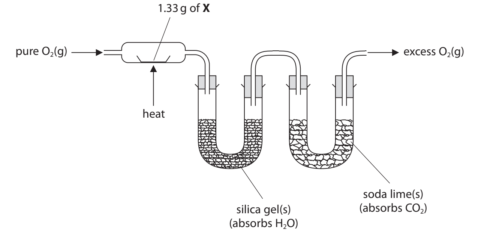

i) State the** measurements** that should be made.

**(2)**

ii) Give **two** reasons why pure O2 (g), and **not** air, should be used.

**(2)**

iii) The experiment showed that 1.33 g of **X** contains 0.14 g of hydrogen and 0.63 g of carbon.

Calculate the empirical formula of **X**, using these data.

You **must** show your working.

**(3)**

### 2((b)) — 1 mark — command: state — structured — from paper Jan 2022 · WCH13/01
When phosphorus(V) chloride is added to **X**, steamy white fumes are seen.

State what can be deduced about compound **X** from this observation only.

### 2((c)) — 3 marks — command: draw — structured — from paper Jan 2022 · WCH13/01
Compound **X** is converted into compound** Y **when refluxed with **excess **sodium dichromate(VI) in sulfuric acid.

Compound **Y** is a liquid that is soluble in the reaction mixture.

Draw a **labelled** diagram of the apparatus that could be used to separate **Y** from the reaction mixture.

### 2((d)) — 2 marks — command: explain — structured — from paper Jan 2022 · WCH13/01
The infrared spectrum of **Y** is shown.

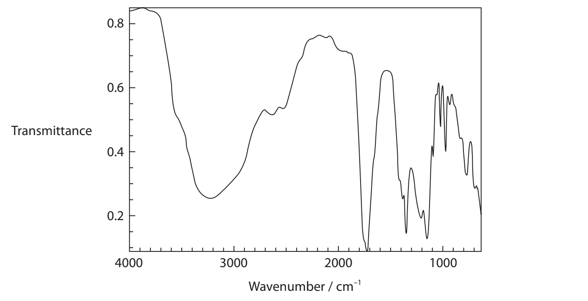

The table shows some infrared absorption data.

| **Bond** | **Wavenumber range / cm****–1** |
|---|---|
| C—H (alkane) | 2962–2853 |
| O—H (alcohols and phenols) | 3750–3200 |
| O—H (carboxylic acids) | 3300–2500 |
| C$=$C (alkene) | 1669–1645 |
| C $=$O (aldehydes, ketones, carboxylic acids) | 1740–1680 |

Explain how this spectrum shows that **Y** contains a carboxylic acid functional group, quoting data from the table.

### 2((e)) — 2 marks — command: multiple — structured — from paper Jan 2022 · WCH13/01
The mass spectrum of **Y** is shown.

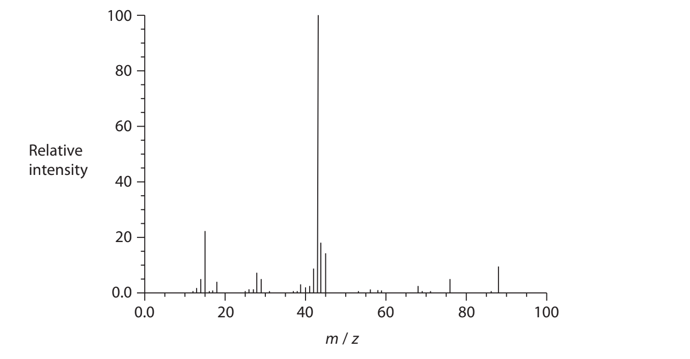

i) Show that the mass spectrum is consistent with **Y **having the molecular formula C3H4O3 .

**(1)**

ii) Suggest the structure of the ion causing the peak at *m / z* = 43 in the mass spectrum of **Y**.

**(1)**

### 2((f)) — 2 marks — command: deduce — structured — from paper Jan 2022 · WCH13/01
Compound **X** contains one type of functional group.

Compound **Y** contains two different functional groups.

Use the information in the question to deduce the structures of **X** and **Y**.

Compound **X**

Compound **Y**

## Q2 — medium — 16 marks · structured-questions

### 2((a)) — 4 marks — command: give — structured — from paper Oct 2021 · WCH13/01
Geraniol is used in perfumes and can be extracted from many plants.

Data on geraniol are shown.

| **Solubility in water** | **Melting** **temperature/°C** | **Boiling** **temperature/°C** | **Density / g cm****−3** |
|---|---|---|---|
| insoluble | −15 | 230 | 0.889 |

The structure of geraniol is shown.

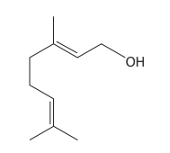

Geraniol has **two** different types of functional group.

**Name** the functional groups, giving a chemical test and its positive result to show the presence of each group.

First functional group:

Second functional group:

### 2((b)) — 3 marks — command: draw — structured — from paper Oct 2021 · WCH13/01
Geraniol is extracted by steam distillation.

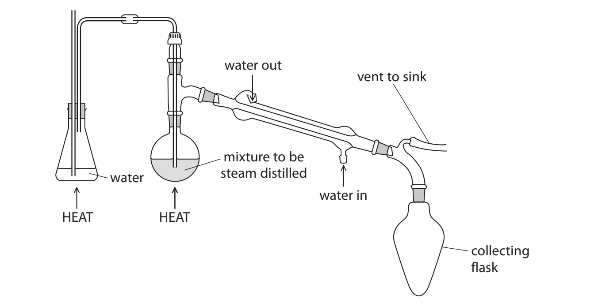

The steam distillation product is geraniol and water. The water may contain dissolved impurities which have similar boiling temperatures to geraniol.

The contents of the collecting flask are transferred to a piece of apparatus used to separate the geraniol from the water layer.

Draw a labelled diagram of this apparatus and its contents.

### 2((c)) — 3 marks — command: describe — structured — from paper Oct 2021 · WCH13/01
The geraniol will still contain small quantities of water.

Describe how to produce a sample of pure, dry geraniol using a named drying agent.

### 2((d)) — 3 marks — command: multiple — structured — from paper Oct 2021 · WCH13/01
The hazard labels for pure geraniol are shown.

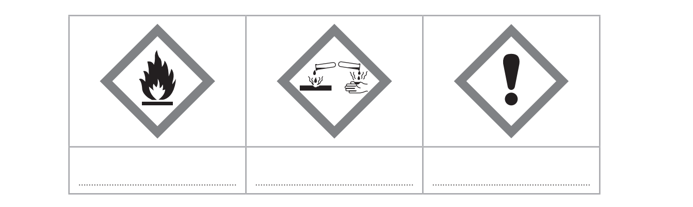

i) Complete the table to identify the hazards indicated by the symbols.

**(2)**

ii) State **one** precaution, other than wearing safety spectacles and a laboratory coat, that should be taken when using pure geraniol to reduce the risk associated with the hazard symbol shown.

**(1)**

### 2((e)) — 1 mark — command: state — structured — from paper Oct 2021 · WCH13/01
State the appearance of the flame when geraniol is ignited.

### 2((f)) — 2 marks — command: multiple — structured — from paper Oct 2021 · WCH13/01
Geraniol reacts with **excess** hydrogen gas.

i) State the essential condition required for this reaction.

**(1)**

ii) Draw the** skeletal **formula of the product of this reaction.

**(1)**

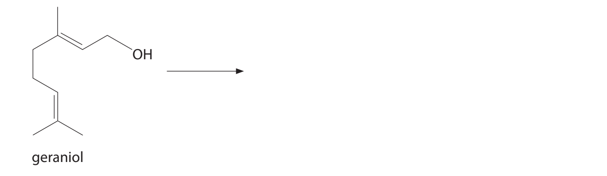

## Q3 — medium — 20 marks · structured-questions

### 22((a)) — 2 marks — command: complete — structured — from paper June 2021 · WCH12/01
Phosgene (COCl2) is a colourless gas used in the pharmaceutical industry. Phosgene has a boiling temperature of 8 °C and is extremely toxic.

Complete the dot-and-cross diagram to show the bonding in phosgene.

### 22((b)) — 8 marks — command: multiple — structured — from paper June 2021 · WCH12/01
Phosgene can be formed from carbon monoxide and chlorine, using a catalyst of activated carbon.

CO (g) + Cl2 (g) ⇌ COCl2 (g)           Δr*H* = –107.6 kJ mol–1

i) State and explain how the reaction conditions could be changed to maximise the **equilibrium **yield of phosgene in this reaction.

**(4)**

ii) The standard enthalpy change of formation for phosgene is Δf*H* = –220.1 kJ mol–1.

Complete the Hess cycle and determine the standard enthalpy change of formation for carbon monoxide. Use the data from (b)(i).

Include state symbols in your cycle.

**(4)**

CO(g) + Cl2 (g) → COCl2 (g)

### 22((c)) — 4 marks — command: multiple — structured — from paper June 2021 · WCH12/01
The mass spectrum of a sample of phosgene is shown.

The peak at *m / z* = 65 has been omitted.

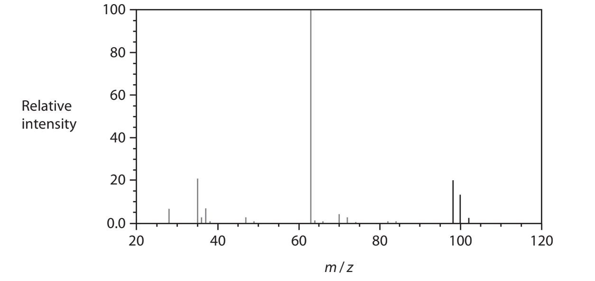

i) Give the reason for the **ratio** of peak heights at *m / z* values of 102, 100 and 98

**(2)**

ii) Suggest an identity for the peak at *m / z* = 63.

**(1)**

iii) The peak at *m / z* = 65 has been omitted.

Draw **on the mass spectrum** the peak at *m / z* = 65, showing its relative intensity.

**(1)**

### 22((d)) — 2 marks — command: justify — structured — from paper June 2021 · WCH12/01
Use your Data Booklet to suggest the wavenumber of a strong absorbance you would expect to see in the infrared spectrum for phosgene. Justify your answer.

### 22((e)) — 4 marks — command: multiple — structured — from paper June 2021 · WCH12/01
In UV light, trichloromethane (CHCl3, boiling temperature 61 °C) reacts with oxygen to form phosgene and hydrogen chloride.

i) Write an equation for this reaction. State symbols are not required.

**(1)**

ii) In a closed bottle, the rate of this reaction decreases with time.

Give a reason for this.

**(1)**

iii) Suggest a precaution that should be taken when opening a bottle of trichloromethane.

**(1)**

iv) Trichloromethane can be used as an anaesthetic.

Suggest whether an old bottle of trichloromethane can still be used for medical treatment, giving a reason for your answer.

**(1)**

## Q4 — easy — 1 marks · multiple-choice-questions

### 1() — 1 mark — multiple_choice — from paper Oct 2021 · WCH12/01
The infrared spectrum of an organic compound is shown.

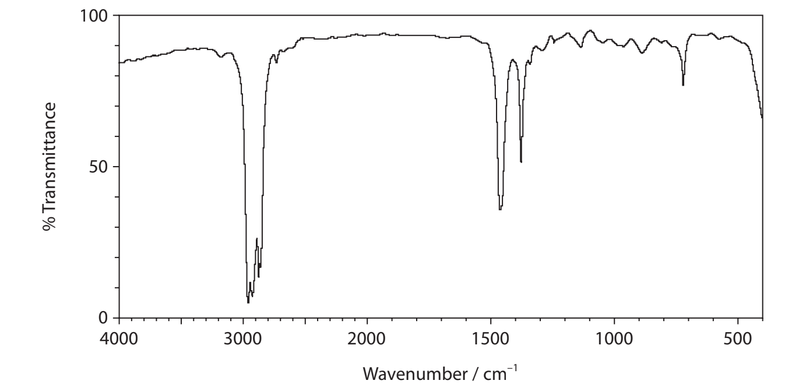

Which of these compounds would give this infrared spectrum?
- **A.** hexanal
- **B.** hexane
- **C.** hexanoic acid
- **D.** hexan-1-ol

## Q5 — easy — 1 marks · multiple-choice-questions

### 4() — 1 mark — multiple_choice — from paper Oct 2021 · WCH12/01
In a mass spectrum, the molecular ion is the ion which always has the
- **A.** greatest abundance
- **B.** greatest stability
- **C.** highest charge
- **D.** highest mass/charge ratio

## Q6 — easy — 1 marks · multiple-choice-questions

### 5() — 1 mark — multiple_choice — from paper Oct 2021 · WCH12/01
Butan-1-ol and butan-2-ol are isomers.

Which *m / z* value would be expected to have a significant peak in the mass spectrum of butan-1-ol but **not** that of butan-2-ol?
- **A.** 15
- **B.** 29
- **C.** 43
- **D.** 57

## Q7 — easy — 1 marks · multiple-choice-questions

### 12() — 1 mark — multiple_choice — from paper June 2021 · WCH12/01
Which could be the infrared spectrum of CH2=CHCH2OH?

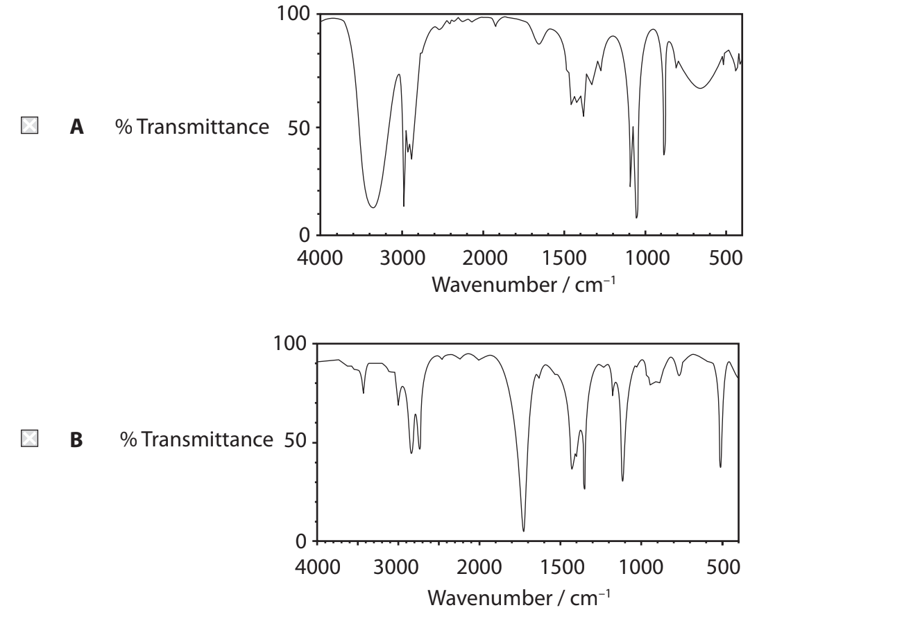

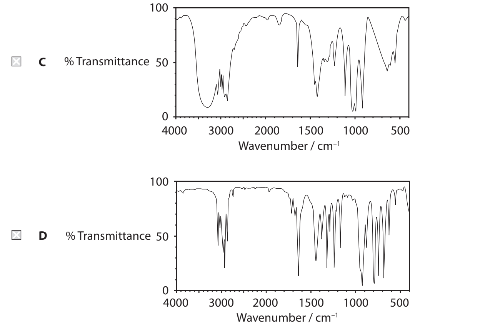
- **A.** 
- **B.** 
- **C.** 
- **D.** 

## Q8 — easy — 1 marks · multiple-choice-questions

### 14() — 1 mark — multiple_choice — from paper June 2021 · WCH15/01
An aliphatic organic compound has the infrared spectrum shown.

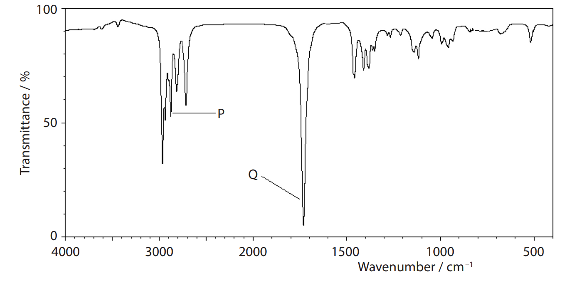

What are the bond stretches responsible for the peaks **P** and **Q** in the spectrum?

|   |   | **P** | **Q** |
|---|---|---|---|
| □ | **A** | O—H carboxylic acid | C`═`O carboxylic acid |
| □ | **B** | O—H carboxylic acid | C`═`O aldehyde |
| □ | **C** | C—H aldehyde | C`═`O carboxylic acid |
| □ | **D** | C—H aldehyde | C`═`O aldehyde |
- **A.** 
- **B.** 
- **C.** 
- **D.** 

## Q9 — medium — 1 marks · multiple-choice-questions

### 5() — 1 mark — multiple_choice — from paper Jan 2022 · WCH15/01
The infrared spectrum of a compound **X** is shown.

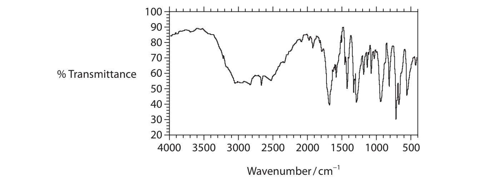

Which could be compound **X**?

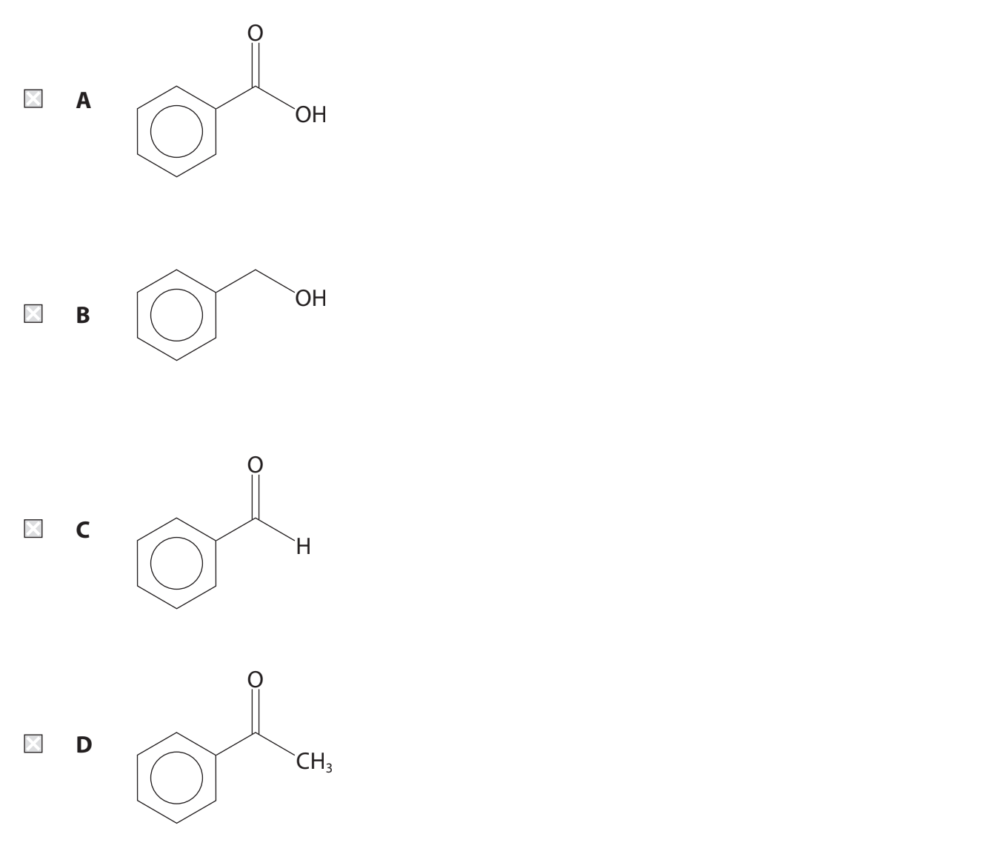
- **A.** 
- **B.** 
- **C.** 
- **D.** 

## Q10 — medium — 1 marks · multiple-choice-questions

### 13() — 1 mark — multiple_choice — from paper June 2021 · WCH12/01
The mass spectrum of propanone is shown.

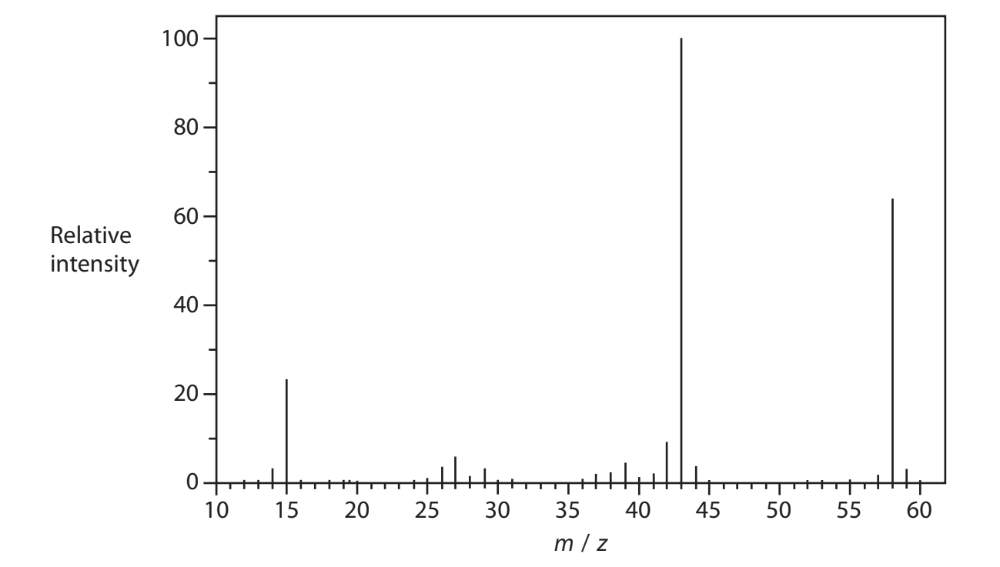

Which fragment is most likely to produce the peak at *m / z *= 43?
- **A.** CH3CH2C$H_{2}^{+}$
- **B.** CH3CO+
- **C.** CH2CHO+
- **D.** CHCH2O+

## Q11 — medium — 1 marks · multiple-choice-questions

### 1() — 1 mark — multiple_choice
Which reagent produces a silver mirror when warmed with propanal but **not** when warmed with propanone?
- **A.** 2,4-dinitrophenylhydrazine (Brady's reagent)
- **B.** Acidified potassium dichromate(VI)
- **C.** Fehling's solution
- **D.** Tollens' reagent

## Q12 — hard — 3 marks · multiple-choice-questions

### 1() — 1 mark — multiple_choice
A colourless liquid, **Z**, is known to be either ethanol (CH3CH2OH) or methoxymethane (CH3OCH3).

The mass spectrum and infrared spectrum of **Z** are shown.

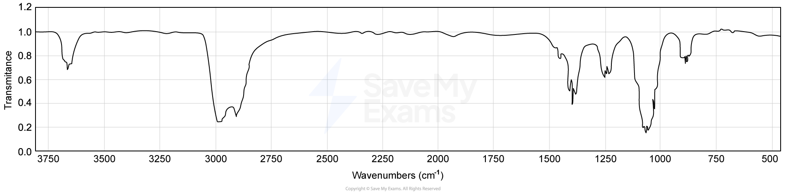

What is the relative molecular mass, *M*r, of compound **Z**?
- **A.** 30
- **B.** 44
- **C.** 46
- **D.** 60

### 2() — 1 mark — multiple_choice
The broad IR absorption in the range 3230–3550 cm–1 is characteristic of which bond?
- **A.** C=C
- **B.** C=O
- **C.** C–H
- **D.** O–H (alcohol)

### 3() — 1 mark — multiple_choice
What is the identity of compound **Z**?
- **A.** Ethanol, because the IR shows a broad peak at 3200–3550 cm–1
- **B.** Ethanol, because the IR shows no peak near 1715 cm–1
- **C.** Methoxymethane, because both compounds have *M*r = 46
- **D.** Methoxymethane, because methoxymethane contains an O–H bond
