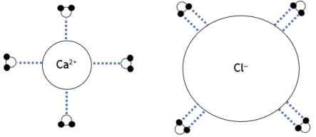
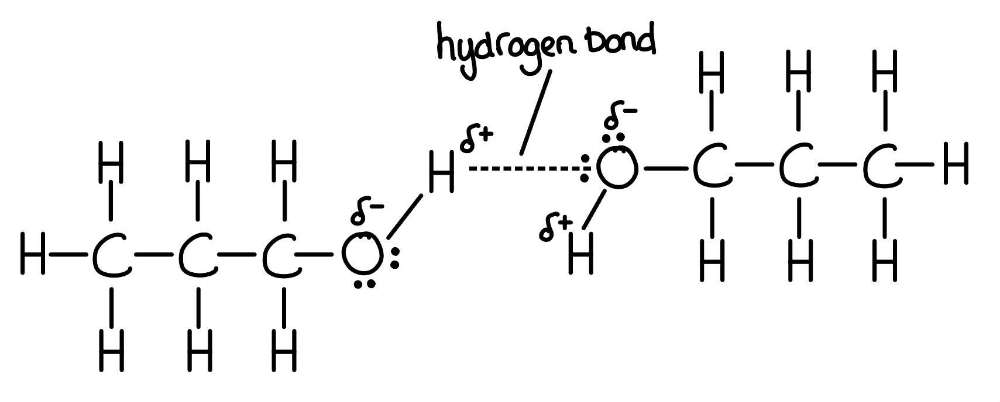

# Mark Schemes — Intermolecular Forces
**2. Energetics, Group Chemistry, Halogenoalkanes & Alcohols** · Edexcel International A Level (IAL) Chemistry (YCH11)

## Q1 — medium — 10 marks · structured-questions

### 20((a)) — 6 marks
Explain the large variation in boiling temperatures, given the small range in *M*r values:

Chemical ideas expressed:

- Fluorine molecules only have London forces (instantaneous dipole-induced dipole) between them (as it has a symmetrical electron cloud/is a symmetrical/non-polar molecule.)
- Hydrogen chloride is a polar molecule as chlorine is more electronegative than hydrogen.
- HCl forms permanent dipole-permanent dipole interactions in addition to London forces.
- Methanol contains a hydrogen attached to a small electronegative element so can form hydrogen bonds (in addition to permanent dipole-permanent dipole interactions and London Forces)
- Hydrogen bonds are the strongest intermolecular forces so take the most energy to break
- London forces are the weakest intermolecular forces, so fluorine has the lowest boiling temperature

**[Total: 6 marks]**

- *An answer scoring** 6** marks would include*

  - *6 correct marking points AND answer is written in a clear and logical order and points fully explained *

- *An answer scoring** 5** marks would include*

  - *5-4 correct marking points AND answer is written in a clear and logical order and points fully explained *

- *An answer scoring** 4** marks would include*

  - *4-3 correct marking points AND answer has some structure and gives some explained points*

- *An answer scoring **3** marks would include*

  - *3-2 correct marking points AND answer has some structure and gives some explained points*

### 20((b)) — 2 marks
The completed diagram is:

- The oxygen is closest to the calcium ion; **[1 mark]**
- The hydrogen is closest to the chloride ion; **[1 mark]**

**[Total: 2 marks]**

- *This is just one example of how you can draw the diagrams*
- *You must have a minimum of two water molecules per ion *
- *You could also have used the displayed formula of water, providing again, the oxygen atom is closest to the calcium ion etc.*
- *You can score the mark without the dotted lines*
- *You will score 1 mark if you have only a singular water molecule correctly orientated between the ions*
- *Although you do not need to label the dipoles on water, if you do and get them the wrong way around you will be penalised for it *

### 20((c)) — 2 marks
Bromine is a liquid but iodine is a solid at room temperature because:

- Iodine has more electrons (per molecule) (than bromine); **[1 mark]**
- so stronger London forces between molecules / I2 (mean a higher melting temperature for iodine); **[1 mark]**

**[Total: 2 marks]**

- *You could have said van der Waals / induced dipole- induced dipole / dispersion forces in place of London forces to achieve the mark *
- *Careful**: The forces are between molecules, any reference to atoms and you will be penalised *

## Q2 — hard — 10 marks · structured-questions

### 1() — 2 marks
> **[mark-scheme]**
> Hydrogen bonding is:
> 
> - An intermolecular force of attraction between a hydrogen atom bonded to a highly electronegative atom (N, O, or F)... **[1 mark]**
> - ...and a lone pair of electrons on a highly electronegative atom (N, O, or F) on an adjacent molecule **[1 mark]**
> 
> Reference to δ+ on the H and δ– on the N/O/F acceptor is also accepted.
> 
> Answers describing H bonded to an electronegative halogen (Cl, Br or I) are not accepted.

> **[exam-tip]**
> Full-mark hydrogen bonding definitions require two components:
> 
> 1. The **donor**: a hydrogen atom covalently bonded to N, O or F (not just "electronegative")
> 2. The **acceptor**: a lone pair on an N, O or F atom in another molecule
> 
> Remember that N, O and F are the only three elements electronegative enough to support hydrogen bonding. Halogens like Cl, Br and I do not form hydrogen bonds, despite being electronegative themselves.

### 2() — 2 marks

**[2 marks]**

> **[mark-scheme]**
> 1 mark for a correctly drawn hydrogen bond, shown as a dashed (dotted) line between the H of one molecule and a lone pair on the O of the second molecule.
> 
> 1 mark for correct dipoles: δ+ on the H of the donor O–H bond; δ– on both O atoms.
> 
> The hydrogen bond must not be a solid line and must show the lone pair on the oxygen involved in the hydrogen bond.
> 
> Reversed partial charges are not accepted. Dipoles placed on C or H atoms of CH groups are not accepted.
> 
> The H-bond angle should be approximately 180° (linear), though small deviations are accepted.
> 
> Both molecules must be drawn as propan-1-ol (CH3CH2CH2OH). Other alcohols are not accepted.

> **[exam-tip]**
> Common errors flagged in examiner reports:
> 
> 1. Drawing the H-bond as a solid line (it must be dashed/dotted to distinguish it from the covalent O–H bond)
> 2. Omitting the lone pair on the acceptor O (must show two dots)
> 3. Omitting or reversing the δ+/δ– labels
> 4. Drawing at a bent angle rather than approximately linear (180°)
> 
> A full-mark diagram must include:
> 
> - Two full propan-1-ol molecules drawn
> - The O–H of one aligned with the O of the other
> - A dashed line between them
> - A lone pair shown on the acceptor O
> - δ+ on the donor H
> - δ– on both O atoms

### 3() — 6 marks
All three compounds have similar relative molecular masses (*M*r ≈ 58–60) and therefore similar numbers of electrons, so the London dispersion forces in all three are approximately equal. Any differences in boiling point must arise from additional intermolecular forces beyond London dispersion.

Butane is non-polar, with only C–C and C–H bonds, so the only intermolecular forces present are London dispersion forces. As these are the weakest type of IMF, butane has the lowest boiling point of the three. Methoxyethane has polar C–O bonds, giving the molecule a permanent dipole, so it experiences both London dispersion forces and permanent dipole–dipole forces. However, methoxyethane has no O–H bond and cannot act as a hydrogen-bond donor, so its boiling point is higher than butane but well below propan-1-ol. Propan-1-ol contains an O–H bond and an O lone pair, allowing it to act as both a hydrogen-bond donor and acceptor; hydrogen bonding is the strongest IMF in this comparison, so significantly more energy is required to overcome it during vaporisation, and propan-1-ol has by far the highest boiling point.

The boiling-point ranking therefore follows the strongest IMF in each compound: LDF only (butane) < LDF + dipole–dipole (methoxyethane) ≪ LDF + hydrogen bonding (propan-1-ol). The very large gap between methoxyethane and propan-1-ol (+8 °C vs +97 °C) reflects the substantial extra energy required to break hydrogen bonds.

**[6 marks]**

> **[mark-scheme]**
> This question is marked using indicative points (IPs) and lines of reasoning (LoR).
> 
> 1. Award IP marks using the table below based on the number of indicative points present in the response.
> 2. Award 0, 1, or 2 LoR marks based on the quality of logical development.
> 3. Add the two scores together for the total mark (maximum 6).
> 
> | Number of indicative points | Marks for indicative content |
> |---|---|
> | 6 | 4 |
> | 5–4 | 3 |
> | 3–2 | 2 |
> | 1 | 1 |
> | 0 | 0 |
> 
> **Lines of reasoning (0–2 marks)**
> 
> - 2 marks:
> 
> - Answer demonstrates a clear and sustained line of reasoning; the comparison between the three compounds is logically developed with clear linkages between IMF type, IMF strength, and boiling point throughout
> - 1 mark:
> 
> - Some reasoning is present but the answer lacks full development or the links between IMF type, strength, and boiling point are not clearly sustained
> - 0 marks:
> 
> - Points are listed without development; no logical progression between ideas
> 
> *If any incorrect chemistry is present, deduct mark(s) from the LoR score. If no LoR marks are awarded, do not deduct.*
> 
> **Indicative points (IPs)**
> 
> - Butane is non-polar (only C–C and C–H bonds), so the only intermolecular force present is London dispersion forces
> - Methoxyethane has polar C–O bonds creating a permanent dipole, so the intermolecular forces are London dispersion forces and permanent dipole–dipole forces
> - Propan-1-ol contains an O–H bond (hydrogen-bond donor) and an O lone pair (acceptor), so it forms hydrogen bonds in addition to London dispersion forces
> - All three compounds have similar *M*r / number of electrons, so the London dispersion contribution is approximately the same in each
> - Hydrogen bonds are stronger than permanent dipole–dipole forces, which are stronger than London dispersion forces alone
> - The boiling-point ranking follows the strongest IMF in each compound: butane (LDF only) < methoxyethane (LDF + dipole–dipole) < propan-1-ol (LDF + hydrogen bonding)

> **[exam-tip]**
> For 6-mark IP/LoR questions on intermolecular forces, structure your answer molecule by molecule. For each compound, state the strongest IMF present, explain why it arises from the structure, and link the IMF strength to the boiling point value.
> 
> Open with a comparator line ("all three have similar *M*r, so London dispersion contributions are similar") to set up a clear framing for the examiner — this secures one indicative point and helps the lines-of-reasoning mark.
> 
> The most common failure is treating the three compounds in isolation without explicitly comparing IMF strengths. The strength-ranking IP and the overall boiling-point ranking IP are the high-level discriminators and are required to reach the top IP band.
> 
> Remember that methoxyethane has permanent dipoles but no O–H, so it cannot form hydrogen bonds as a donor — this is the key discriminator between methoxyethane and propan-1-ol. Any incorrect chemistry (e.g. claiming butane has dipole–dipole forces, or methoxyethane forms hydrogen bonds with itself) deducts from your reasoning marks even if other valid points are made.

## Q3 — easy — 1 marks · multiple-choice-questions

### 3() — 1 marks
**Correct answer: C** — hydrogen fluoride, HF

**Final answer:** **The correct answer is ****C**** because:**

- For hydrogen bonding to occur, a very electronegative species (O, N or F) needs to be present and an electropositive hydrogen atom
- HF contains the very electronegative F atom
- The bond is polarised so contains an electropositive hydrogen atom
- Therefore, HF will form hydrogen bonds

**A** is incorrect as it does not contain an O, N or F atom

**B** is incorrect as it does not contain an electropositive H atom

**D** is incorrect as it does not contain an O, N or F atom

## Q4 — easy — 1 marks · multiple-choice-questions

### 6() — 1 marks
**Correct answer: A** — 

**Final answer:** **The correct answer is ****A ****because:**

- Straight chained alkanes have higher boiling points than branched alkanes due to stronger London Forces between molecules
- These require more energy to overcome resulting in a higher boiling point

**B** is incorrect as the molecule is branched so has weaker London Forces

**C** is incorrect as  the molecule is branched so has weaker London Forces

**D** is incorrect as  the molecule is branched so has weaker London Forces

## Q5 — easy — 2 marks · multiple-choice-questions

### 8((a)) — 1 marks
**Correct answer: B** — hexane

**Final answer:** **The correct answer is ****B**** because:**

- The longer the carbon chain, the greater the number of electrons
- Molecules with more electrons will have a greater frequency and magnitude of temporary dipoles which require more energy to overcome leading to higher boiling points
- Hexane has the longest carbon chain, therefore the highest boiling point

**A**, **C** & **D **are** **incorrect as they all have shorter chain lengths

### 8((b)) — 1 marks
**Correct answer: A** — 

**Final answer:** **The correct answer is ****A**** because:**

- Alkane **A** has 2 branches
- The more branched an alkane is, the lower its boiling point

**B **and **C** are incorrect as they only have one branch

**D** is incorrect as  this alkane is unbranched

## Q6 — medium — 1 marks · multiple-choice-questions

### 2() — 1 marks
**Correct answer: C** — CH3C(CH3)2CH2CH(CH3)CH3

**Final answer:** **The correct answer is ****C**** because:**

- The compound with the most branching will have the lowest boiling temperature

  - This is because the surface area of a molecule is reduced by branching so adjacent molecules have less contact
  - The London forces will be weaker as the ability to induce a dipole in neighbouring molecules is not as great
- Isomer **C** has the greatest amount of branching with 3 methyl groups, therefore will have the lowest boiling temperature

**A** is incorrect as  this structure has less branching, with 2 methyl groups

**B** is incorrect as  this structure has less branching, with 1 methyl group

**D** is incorrect as  this structure has no branching

## Q7 — medium — 1 marks · multiple-choice-questions

### 5() — 1 marks
**Correct answer: D** — CH4 < Cl2 < Br2 < H2O

**Final answer:** **The correct answer is ****D**** because:**

- Generally, the greater the number of electrons, the greater the frequency and magnitude of the temporary dipoles leading to greater boiling points

  - This explains why CH4 has a lower boiling point that Cl2 which has a lower boiling point than Br2
- Although H2O has fewer electrons than Br2, its boiling point is higher
- This is due to the hydrogen bonds that exist between water molecules
- Hydrogen bonds are stronger than temporary dipoles so require more energy to overcome, hence H2O has a higher boiling point than would be expected for a small molecule

**A** is incorrect as the sequence is reversed

**B** is incorrect as methane has the lowest boiling temperature

**C** is incorrect as  methane has the lowest boiling temperature

## Q8 — medium — 1 marks · multiple-choice-questions

### 5() — 1 marks
**Correct answer: C** — 

**Final answer:** **The correct answer is ****C**** because:**

- The compound that will take the longest time is the compound that will form the strongest intermolecular forces with the compounds within the air bubble
- The compound which forms the most hydrogen bonding will have the strongest intermolecular forces
- Compound **C** contains the most OH groups so will have the most hydrogen bonding and will take the longest time to travel

**A** is incorrect as the liquid only contains one OH group so less hydrogen bonding forms

**B** is incorrect as  the liquid only contains two OH groups so less hydrogen bonding forms

**D** is incorrect as the liquid does not form hydrogen bonds

## Q9 — medium — 1 marks · multiple-choice-questions

### 6() — 1 marks
**Correct answer: C** — the H−O−H bond angle is the same in ice and in water

**Final answer:** **The correct answer is ****C**** because:**

- In water, the H-O-H bond angle is 104.5° due to the repulsion of the two lone pairs of electrons on the oxygen atom
- In ice, these lone pairs of electrons are drawn towards the partially positive hydrogen atom on a neighbouring water molecule, this reduces the repulsion of the bonded electron pairs around the oxygen atom and increases the bond angle

**A** is incorrect as  ice does have a lower density than water

**B** is incorrect as  H2O molecules are further apart in ice than in water

**D** is incorrect as molecules in ice are held together by hydrogen bonds

## Q10 — medium — 1 marks · multiple-choice-questions

### 7() — 1 marks
**Correct answer: D** — hydrogen bonding, permanent dipole‐permanent dipole forces and London forces

**Final answer:** **The correct answer is ****D**** because:**

- Hydrogen bonding exists between the lone pair of electrons on the O atom of C=O and the hydrogen of the -OH group
- Permanent dipole‐permanent dipole forces exists as the molecule has a permanent dipole
- London forces exist as they exist between all atoms and molecules due to the fluctuations in the electron charge cloud

**A** is incorrect as  there are also permanent dipole-permanent dipole interactions

**B** is incorrect as  there are also London forces

**C** is incorrect as there are also hydrogen bonds

## Q11 — medium — 1 marks · multiple-choice-questions

### 9() — 1 marks
**Correct answer: C** — hexane

**Final answer:** **The correct answer is ****C**** because:**

- Generally, 'like dissolves like', so the greatest amount of the non-polar hydrocarbon C35H72 that will dissolve will be in a non-polar solvent
- Heaxane is a non-polar solvent

**A** is incorrect as butan-1-ol contains polar bonds

**B** is incorrect as ethanoic acid contains polar bonds

**D** is incorrect as  water contains polar bonds

## Q12 — medium — 1 marks · multiple-choice-questions

### 16() — 1 marks
**Correct answer: C** — 

**Final answer:** **The correct answer is ****C**** because:**

- All of the hydrogen halides contain London forces between the molecules
- Going from HF → HCl → HBr → HI the size of these forces increases

  - This results in more energy being needed to overcome the London forces
- Hydrogen fluoride however also exhibits hydrogen bonding due to the presence of a very electronegative fluorine atom with a lone pair of electrons

  - A hydrogen bond can form between this and the H atom of a neighbouring HF molecule
  - Hydrogen bonds are much stronger than London forces so much more energy is required to overcome them resulting in HF having a higher boiling point than the other hydrogen halides

**A** is incorrect as  HF is the highest

**B** is incorrect as HI is not the lowest

**D** is incorrect as HF is the highest and the rest of the order is wrong

## Q13 — hard — 1 marks · multiple-choice-questions

### 1() — 1 marks
**Correct answer: D** — Pentane has greater surface contact between its molecules

**Final answer:** **The correct answer is D**

- Both isomers have the same molecular formula (C5H12), so they have the **same** number of electrons
- The difference comes from **molecular shape**:

- Pentane is a long, straight chain, molecules pack closely alongside one another, giving a large contact area and stronger London dispersion forces
- 2,2-dimethylpropane is compact and roughly spherical — smaller contact area, weaker London dispersion forces

- Greater LDF in pentane → higher boiling point

**A** is incorrect as both compounds share the molecular formula C5H12, so they have the same number of electrons (this is the most common trap)

**B** is incorrect as alkanes are non-polar; they have no permanent dipoles

**C** is incorrect as covalent bonds are not broken when a substance boils, only intermolecular forces are; both isomers contain the same C–C and C–H bonds

> **[exam-tip]**
> For comparisons of structural isomers, electron count is identical, so London dispersion forces depend on **shape and surface contact**:
> 
> - Long, straight molecules pack closely → stronger LDF → higher boiling point
> - Branched, spherical molecules pack poorly → weaker LDF → lower boiling point
> 
> A common slip is reaching for "more electrons" before checking the molecular formulas, always count electrons first to decide whether LDF strength comparisons are in play at all.
