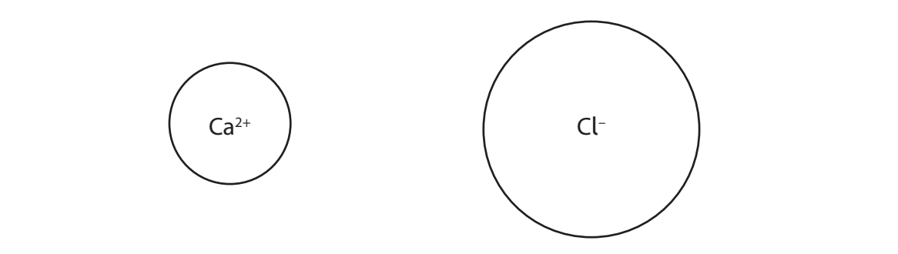
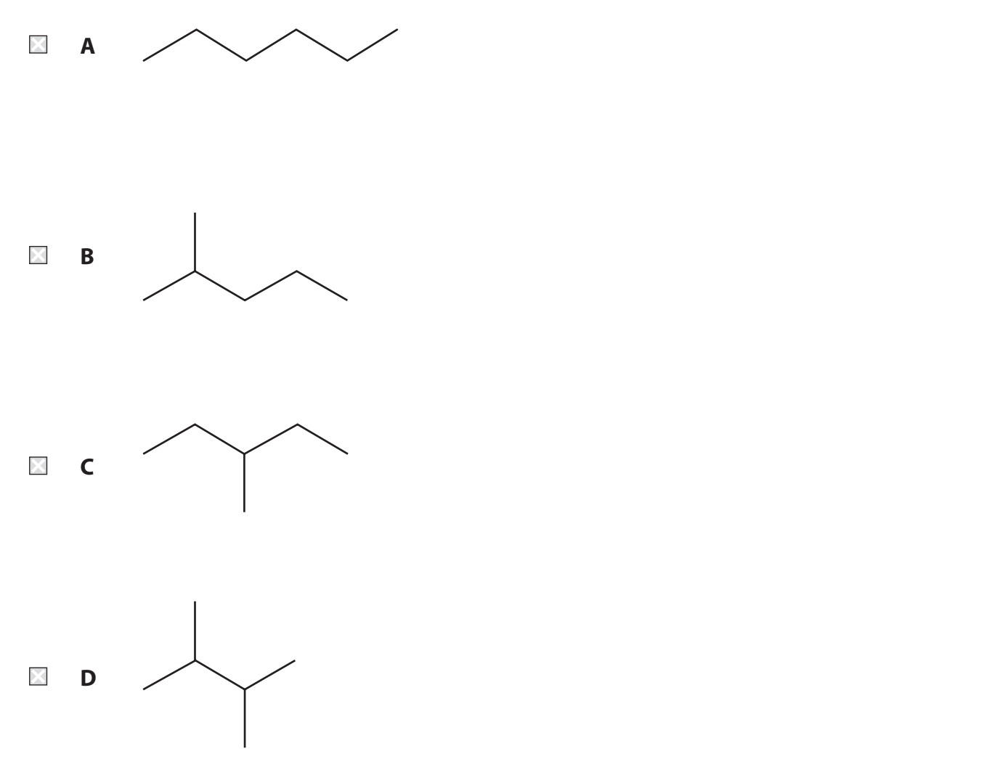
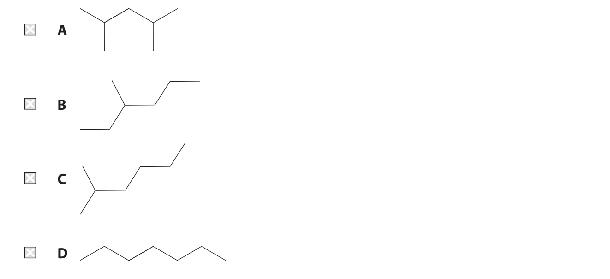
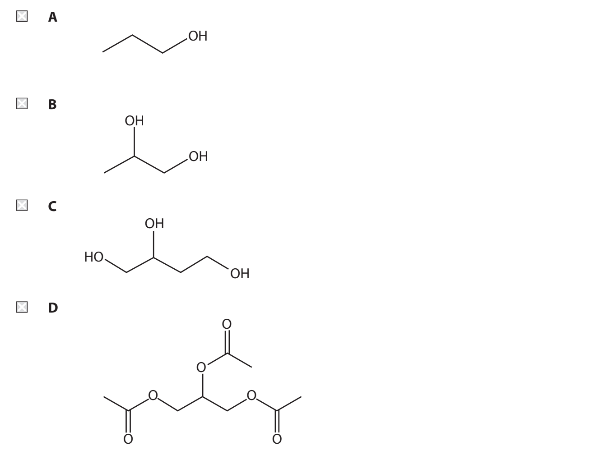

# Exam Questions — Intermolecular Forces
**2. Energetics, Group Chemistry, Halogenoalkanes & Alcohols** · Edexcel International A Level (IAL) Chemistry (YCH11)
> Source: [https://www.savemyexams.com/international-a-level/chemistry/edexcel/17/topic-questions/2-energetics-group-chemistry-halogenoalkanes-and-alcohols/2-2-intermolecular-forces/structured-questions/](https://www.savemyexams.com/international-a-level/chemistry/edexcel/17/topic-questions/2-energetics-group-chemistry-halogenoalkanes-and-alcohols/2-2-intermolecular-forces/structured-questions/) · 13 questions · total 32 marks

## Q1 — medium — 10 marks · structured-questions

### 20((a)) — 6 marks — command: explain — structured — from paper June 2021 · WCH12/01
This question is about the forces between molecules and ions.

Some data for three small molecules are shown.

| **Molecule** | ***M*****r** | **Boiling temperature / °C** |
|---|---|---|
| Fluorine | 38.0 | −188 |
| Hydrogen chloride | 36.5 | −85 |
| Methanol | 32.0 | 65 |

Explain the large variation in boiling temperatures, given the small range in *M*r values.

Detailed descriptions of the forces involved are not required.

### 20((b)) — 2 marks — command: complete — structured — from paper June 2021 · WCH12/01
Calcium chloride is soluble in water.

### 20((c)) — 2 marks — command: explain — structured — from paper June 2021 · WCH12/01
Explain why bromine is a liquid but iodine is a solid at room temperature.

Detailed explanations of the forces involved are not required.

## Q2 — hard — 10 marks · structured-questions

### 1() — 2 marks — command: state — structured
This question is about intermolecular forces.

State what is meant by the term hydrogen bonding.

### 2() — 2 marks — command: draw — structured
Draw a diagram to show a hydrogen bond between two molecules of propan-1-ol. Your diagram must clearly show the relative positions of the atoms involved, any relevant dipoles, and the lone pair on the acceptor atom.

### 3() — 6 marks — command: compare — structured
(*) The boiling points of the three compounds are shown below.

| Compound | Boiling point / °C |
|---|---|
| Butane | –1 |
| Methoxyethane | +8 |
| Propan-1-ol | +97 |

Compare and explain the boiling points of butane, methoxyethane and propan-1-ol.

In your answer, you should include:

- the types of intermolecular force present in each compound
- the relative strengths of these forces and how they account for the boiling-point trend

## Q3 — easy — 1 marks · multiple-choice-questions

### 3() — 1 mark — multiple_choice — from paper Jan 2021 · WCH12/01
Which of these pure compounds has hydrogen bonding in the liquid state?
- **A.** 1,1,1-trichloroethane, CH3CCl3
- **B.** trimethylamine, (CH3)3N
- **C.** hydrogen fluoride, HF
- **D.** hydrogen sulfide, H2S

## Q4 — easy — 1 marks · multiple-choice-questions

### 6() — 1 mark — multiple_choice — from paper Oct 2021 · WCH12/01
Which of these isomers has the **highest** boiling temperature?

- **A.** 
- **B.** 
- **C.** 
- **D.** 

## Q5 — easy — 2 marks · multiple-choice-questions

### 8((a)) — 1 mark — multiple_choice — from paper Jan 2022 · WCH12/01
This question is about alkanes.

Which of these alkanes has the **highest** boiling temperature?
- **A.** butane
- **B.** hexane
- **C.** pentane
- **D.** propane

### 8((b)) — 1 mark — multiple_choice — from paper Jan 2022 · WCH12/01
Which of these alkanes has the **lowest **boiling temperature?

**(1)**

- **A.** 
- **B.** 
- **C.** 
- **D.** 

## Q6 — medium — 1 marks · multiple-choice-questions

### 2() — 1 mark — multiple_choice — from paper Jan 2021 · WCH12/01
Which of these isomers with the formula C8H18 has the lowest boiling temperature?
- **A.** CH3CH(CH3)CH2CH2CH(CH3)CH3
- **B.** CH3CH(CH3)CH2CH2CH2CH2CH3
- **C.** CH3C(CH3)2CH2CH(CH3)CH3
- **D.** CH3CH2CH2CH2CH2CH2CH2CH3

## Q7 — medium — 1 marks · multiple-choice-questions

### 5() — 1 mark — multiple_choice — from paper Jan 2022 · WCH12/01
Which sequence shows the molecules in order of **increasing **boiling temperature?
- **A.** H2O < Br2 < Cl2 < CH4
- **B.** Br2 < CH4 < Cl2 < H2O
- **C.** Cl2 < CH4 < H2O < Br2
- **D.** CH4 < Cl2 < Br2 < H2O

## Q8 — medium — 1 marks · multiple-choice-questions

### 5() — 1 mark — multiple_choice — from paper Jan 2021 · WCH12/01
The viscosities of four liquid organic compounds are compared by placing the liquids in separate identical tubes, each with an air bubble at the top.

The tubes are inverted, and the times measured for the air bubble to travel the length of the tube. For which compound does the air bubble take the longest time?

- **A.** 
- **B.** 
- **C.** 
- **D.** 

## Q9 — medium — 1 marks · multiple-choice-questions

### 6() — 1 mark — multiple_choice — from paper Jan 2022 · WCH12/01
Which is **not** correct about ice?
- **A.** ice has a lower density than water
- **B.** H2O molecules are further apart in ice than in water
- **C.** the H−O−H bond angle is the same in ice and in water
- **D.** H2O molecules in ice are held together by hydrogen bonds

## Q10 — medium — 1 marks · multiple-choice-questions

### 7() — 1 mark — multiple_choice — from paper Jan 2022 · WCH12/01
Which intermolecular forces exist **between** the molecules of the compound shown?

- **A.** hydrogen bonding and London forces only
- **B.** hydrogen bonding and permanent dipole‐permanent dipole forces only
- **C.** London forces and permanent dipole‐permanent dipole forces only
- **D.** hydrogen bonding, permanent dipole‐permanent dipole forces and London forces

## Q11 — medium — 1 marks · multiple-choice-questions

### 9() — 1 mark — multiple_choice — from paper Jan 2022 · WCH12/01
Which solvent dissolves the greatest amount of hydrocarbon C35H72?
- **A.** butan‐1‐ol
- **B.** ethanoic acid
- **C.** hexane
- **D.** water

## Q12 — medium — 1 marks · multiple-choice-questions

### 16() — 1 mark — multiple_choice — from paper Oct 2021 · WCH12/01
Which row shows the hydrogen halides in order of** increasing** boiling temperature?

|   | ** ** | **Lowest                **$\underset{}{\rightarrow}$**                Highest** |   |   |   |
|---|---|---|---|---|---|
| ☐ | **A** | HF | HCl | HBr | HI |
| ☐ | **B** | HI | HBr | HCl | HF |
| ☐ | **C** | HCl | HBr | HI | HF |
| ☐ | **D** | HF | HI | HBr | HCl |
- **A.** 
- **B.** 
- **C.** 
- **D.** 

## Q13 — hard — 1 marks · multiple-choice-questions

### 1() — 1 mark — multiple_choice
Pentane and 2,2-dimethylpropane are structural isomers with molecular formula C5H12.

| Alkane | Boiling point / °C |
|---|---|
| Pentane | +36 |
| 2,2-dimethylpropane | +9 |

Why does pentane have the higher boiling point?
- **A.** Pentane has more electrons
- **B.** Pentane has permanent dipole–dipole forces
- **C.** Pentane has stronger covalent bonds
- **D.** Pentane has greater surface contact between its molecules
