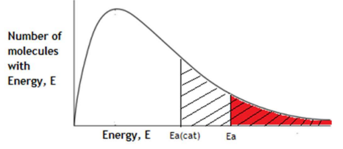
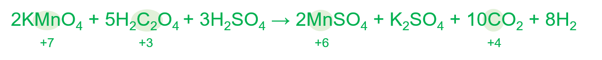

# Mark Schemes — Redox Chemistry & Acid-Base Titrations
**2. Energetics, Group Chemistry, Halogenoalkanes & Alcohols** · Edexcel International A Level (IAL) Chemistry (YCH11)

## Q1 — medium — 22 marks · structured-questions

### 22((a)) — 4 marks
i) The **overall** equation for the Liebig Process is:

- 3Ca(OH)2 + 3Cl2 + KCl → KClO3 + 3CaCl2 + 3H2O 
**OR** 
6Ca(OH)2 + 6Cl2 + 2KCl → 2KClO3 + 6CaCl2 + 6H2O; **[1 mark]**

ii) The **overall** atom economy by mass for the production of potassium chlorate(V), KClO3 is:

- *M*r of KClO3 = 39.1 + 35.5 + 48 (= 122.6); **[1 mark]**
- *M*r of all products / reactants = 122.6 + (3 ×18) + ((71 + 40.1) × 3) = 509.9; **[1 mark]**
- Overall atom economy = (122.6 ÷ 509.9) × 100 = 24.044 = 24.0%; **[1 mark]**

**[Total: 4 marks]**

- *To find the overall equation:*

  - *Identify which species is produced in stage 1 and then used as a reactant in stage 2:*
  
    - *Ca(ClO**3**)**2*
  - *Multiply either equation as necessary so that there are an equal number of moles of this species in both equations:*
  
    - *The equation in stage 1 shows 1 mol of Ca(ClO**3**)**2** being formed and in stage 2, 1 mol of Ca(ClO**3**)**2 **reacting, so in this case, no multiplication is necessary*
  - *To find the overall equation, add all of the reactants on one side of the equation, and the products on the other side of the equation:*
  
    - *6Ca(OH)**2** + 6Cl**2 ** + Ca(ClO**3**)**2** + 2KCl → Ca(ClO**3**)**2** + 5CaCl**2 **+ 6H**2**O + 2KClO**3** + CaCl**2*
  - *Cancel out any species which appear on either side of the equation - this will cancel out the species that is both produced in stage 1 and reacted in stage 2, as there are an equal number of moles on either side of the equation:*
  
    - *6Ca(OH)**2** + 6Cl**2 ** + **Ca(ClO**3**)**2** + 2KCl → **Ca(ClO**3**)**2** + 5CaCl**2 **+ 6H**2**O + 2KClO**3** + CaCl**2*
    - *6Ca(OH)**2** + 6Cl**2 ** + 2KCl → 5CaCl**2 **+ 6H**2**O + 2KClO**3** + CaCl**2*
  - *If you left the equation like this, you would score the mark, but it can be simplified further by combining the CaCl**2** and dividing by 2 to give the simplest whole number ratio:*
  
    - *3Ca(OH)**2** + 3Cl**2** + KCl →3CaCl**2 **+ 3H**2**O + KClO**3** *
- *The marks scheme above shows the calculation of atom economy using the **M**r** values for the simplified version of the equation, you would score the marks if you had used doubled the **M**r** values if using the non-simplified equation - the atom economy is still the same*

### 22((b)) — 3 marks
The type of reaction that takes place in Stage 1 of the Liebig Process is:

- Disproportionation reaction; **[1 mark]**
- As chlorine (atoms) are oxidised from 0 (in chlorine) to (+) 5 (in calcium chlorate); **[1 mark]**
- And reduced (from 0) to −1 (in calcium chloride); **[1 mark]**

**[Total: 3 marks]**

- *The question gives you a hint as it asks you to use oxidation numbers*
- *This indicates that it is a redox reaction*
- *Disproportionation is a particular type of redox reaction in which atoms of the same element are both oxidised and reduced*
- *Look out for the same element appearing in more than one species either in the reactants or in the products, then work out the oxidation number of that element in all of the species containing it in the reaction to see if disproportionation has occurred*
- *The oxidation number of Cl in Cl**2** is 0 as it is an element*
- *The oxidation number of Cl in CaCl**2** is -1:*

  - *Ca is +2, so 2 x Cl must be -2 so that the overall oxidation number is 0, therefore each Cl is -1*
  - *+2 + (2 x -1) = 0*
  - *Chlorine has been reduced*
- *The oxidation number of Cl in Ca(ClO**3**)**2** is -1*

  - *Ca is +2, each O is -2 and there are 6 O atoms so -12 due to O atoms, so 2 x Cl must be +10 so that the overall oxidation number is 0, therefore each Cl is +5*
  - *+2 + (2 x +5) + (6 x -2) = 0*
  - *Chlorine has been oxidised*

### 22((c)) — 8 marks
i) A chemical test on a solution of these crystals to **confirm** that the impurities present are chloride ions rather than bromide ions is:

- Add (dilute) nitric acid / HNO3 **AND** silver nitrate / AgNO3 (solution); **[1 mark]**
- White precipitate forms / precipitate forms whose colour is difficult to distinguish (between white and cream); **[1 mark]**
- Which dissolves in dilute ammonia / dilute NH3 / NH3 (aq); **[1 mark]**

ii) The percentage purity of the sample is:

- Mass of oxygen = 1.52 − 1.02 = 0.50 (g); **[1 mark]**
- Moles of oxygen = 0.50 ÷ 32 = 0.015625 (mol); **[1 mark]**
- Moles of potassium chlorate = 0.015625 × (2 ÷ 3) = 0.010417 (mol)
**OR**
Calculation of mass of KCl = 0.015625 x (2 ÷ 3) x 74.6 = 0.777 (g); **[1 mark]**
- Mass of potassium chlorate in impure sample = 0.010417 × (39.1 + 35.5 + 48) = 1.2771 (g)
**OR**
0.777 + 0.5 = 1.277 (g); **[1 mark]**
- % purity of sample to 2 or 3 SF = (1.2771 ÷ 1.52) × 100 = 84.019 = 84 / 84.0 (%); **[1 mark]**

**[Total: 8 marks]**

- *For part (i) you would not be given credit if you stated either hydrochloric acid or sulfuric acid, as both will form a white precipitate with silver nitrate, giving false positive results for the test*
- *However, you would gain a mark for stating acidified silver nitrate or AgNO**3** and H**+*
- *You could only gain the second 2 marks if you had identified the use of silver nitrate*
- *In part (ii), as the impurities didn't decompose during heat, the only reason for the decrease in mass is due to the loss of oxygen, which allows you to work out the number of moles of oxygen produced*

### 22((d)) — 5 marks
i) The systematic name of KClO4 is:

- Potassium chlorate(VII) 
**OR** 
Chlorate(VII) potassium; **[1 mark]**

ii) Each of the steps in this procedure is needed to show that the catalyst is **not** used up in this reaction because:

Any **four** from:

- Heat to constant mass so all of the potassium chlorate(V) decomposes / reacts; **[1 mark]**
- The solid product or potassium chloride dissolves (when the water is added)
**OR**
The catalyst does not dissolve (when the water is added); **[1 mark]**
- The rinsing removes potassium chloride (solution), which would otherwise add to the mass of the solid when it dries; **[1 mark]**
- Drying ensures the final mass recorded is only that of that catalyst
**OR**
To remove water from the catalyst / ensure the catalyst is dry; **[1 mark]**
- The mass (of solid) recorded (at the end of the procedure) should be the same of that of the catalyst at the start
**OR**
To compare to the mass of catalyst / to check the mass (of catalyst) hasn’t changed; **[1 mark]**

**[Total: 6 marks]**

- *The first part of the name gives the metal ion, potassium, and the second part is chlorate as the negative ion contains chlorine and oxygen atoms*
- *The oxidation number of chlorine is +7*

  - *This is because overall the compound has an oxidation number of 0, K has an oxidation number of +1 and the four oxygen atoms have a combined oxidation number of -8, this means that the oxidation number of chlorine must be +7:*
  - *(+1) + (+7) + (-8) = 0*
- *This is shown by the Roman numeral (VII) after chlorate*
- *In part (ii), there are 5 different steps, and 4 marks available, so it is a reasonable assumption that you should attempt to give a reason for at least four steps*

### 22((e)) — 2 marks
Using the diagram to explain how a catalyst speeds up a chemical reaction:

- Activation energies shown and labelled for both catalysed and uncatalysed reaction; **[1 mark]**
- Number of molecules with *E* >*E*a shown on diagram; **[1 mark]**

**[Total: 2 marks]**

- *You must be able to show how a Maxwell-Boltzmann distribution changes with temperature changes and with a catalyst and use this to explain how it speeds up a chemical reaction*
- *The second mark can be awarded for a written description which explains that the number of molecules with an energy greater than **E**a** is higher with the use of a catalyst*

## Q2 — easy — 1 marks · multiple-choice-questions

### 5() — 1 marks
**Correct answer: D** — +6

**Final answer:** **The correct answer is ****D**** because:**

- The sum of the oxidation numbers for a substance with no charge should be 0
- In Na2Cr2O7:

  - Sodium is a Group 1 metal so its oxidation number is always +1
  - Oxygen always has an oxidation number of -2 (unless in a peroxide)
  
    - (-2 x 7) + (+1 x 2)= - 12
    - There are two chromium atoms so each one must have an oxidation number of +6 to achieve 0 overall

**A** is incorrect as this does not consider the numbers of oxygen and sodium atoms in the compound

**B** is incorrect as  this is the number of chromium atoms in the compound

**C** is incorrect as  this does not consider the oxidation numbers of sodium and oxygen

## Q3 — easy — 1 marks · multiple-choice-questions

### 6() — 1 marks
**Correct answer: C** — N2O4

**Final answer:** **The correct answer is ****C**** because:**

- The oxidation number of oxygen is +2
- The sum of the oxidation number for N2O4 should equal 0

  - There are four oxygen atoms so 4 x -2 = -8
  - There are two nitrogen atoms so -8 ÷ 2 = -4
  - To bring the overall oxidation state to 0, the oxidation number of N must be +4

**A** is incorrect as the oxidation number of nitrogen is +1

**B** is incorrect as  the oxidation number of nitrogen averages +3

**D** is incorrect as  the oxidation number of nitrogen is +5

## Q4 — easy — 1 marks · multiple-choice-questions

### 11() — 1 marks
**Correct answer: C** — +5

**Final answer:** **The correct answer is**** C**** because:**

- For an ion, the sum of the oxidation numbers should equal the charge on the ion

  - For this question, the charge on the ion is -3
- Oxygen always has an oxidation number of -2 (unless it is a peroxide)

  - There are 4 oxygen atoms which give a total of -8
- There is only one phosphorus atom

  - So, to bring the overall charge up to -3, phosphorus must have an oxidation number of +5

**A**, **B** and **D** are incorrect as  these are the wrong value

## Q5 — easy — 1 marks · multiple-choice-questions

### 1() — 1 marks
**Correct answer: D** — +7

**Final answer:** **The correct answer is D**

- Each O has an oxidation number of –2 (standard rule for oxyanions)
- Total O contribution: 4 x (-2) = -8
- Overall charge on MnO4– is –1

Mn + (–8) = –1, giving Mn = **+7**

**A** is incorrect as it assumes oxygen is -1 or ignores overall charge

**B** is incorrect as it ignores the overall -1 charge of the ion (calculates as if 
MnO4 is neutral)

**C** is incorrect as it assumes oxygen is -2 but misses the -1 ion charge, making Mn = 8

> **[exam-tip]**
> Always write oxidation numbers in the sign-first format (+7, not 7+). The ionic-charge form loses the mark. A useful shortcut is that if the compound's name contains a Roman numeral (e.g. manganate(VII), chromate(VI)), that number is the oxidation state of the element.
> 
> Some common slips to avoid when assigning oxidation numbers:
> 
> - Applying O = –2 in compounds containing fluorine
> - F forces O to be positive
> - Assigning H = +1 in metal hydrides like NaH, LiH or LiAlH4
> - H is actually –1 in these

## Q6 — easy — 1 marks · multiple-choice-questions

### 1() — 1 marks
**Correct answer: C** — Cl2 + 2NaOH → NaCl + NaClO + H2O

**Final answer:** **The correct answer is C**

- Disproportionation is where the same element, in the same starting** **species, is simultaneously oxidised AND reduced in the same reaction
- In C: chlorine starts at oxidation number 0 in Cl2 and ends up in two different oxidation states:

  - –1 in NaCl (reduced; Cl gained an electron)
  - +1 in NaClO (oxidised; Cl lost an electron)
- Chlorine from a single starting species (Cl2) has been both oxidised and reduced.

**A** is incorrect as this is thermal decomposition. No oxidation number changes at all (not a redox reaction)

**B** is incorrect as this is halogen displacement. Cl2 is reduced (0 → –1) but the Br– is oxidised (–1 → 0). So, two different species change, not one

**D** is incorrect as Na is oxidised and H+ in H2O is reduced. Again two different species change

> **[exam-tip]**
> The disproportionation test has three parts, all must be met:
> 
> - the same element
> - in the same reactant species
> - is simultaneously oxidised AND reduced
> 
> Cl2 + NaOH is the common example you should learn:
> 
> **Cl**2** (0) → Cl**-** (–1, reduced) + ClO**-** (+1, oxidised)**
> 
> Some points to consider include:
> 
> - Marks are awarded for explicit oxidation-number values, not electron descriptions.
> - Writing "Cl gains / loses electrons" on its own is not enough, always give the numbers.
> - Watch out for false positives
> 
>   - IO3– + I– → I2 is not** **disproportionation
>   - It's comproportionation, where two different species of the same element combine.
>   - If the element comes from two different reactants, it fails the test.

## Q7 — medium — 1 marks · multiple-choice-questions

### 7() — 1 marks
**Correct answer: D** — 

**Final answer:** **The correct answer is ****D**** because:**

- 2H2O2 → 2H2O + O2
- For oxygen:

  - The oxidation number of oxygen in a peroxide is -1
  - The oxidation number of oxygen in its elemental state is 0
  - The oxidation number of oxygen in water is -2
  - There has been both an increase and decrease in oxidation number so it has been both reduced and oxidised
- For hydrogen:

  - The oxidation number of hydrogen in a peroxide is +1
  - The oxidation number of hydrogen in water is +1
  - The oxidation number is unchanged so hydrogen is neither reduced or oxidised

**A** is incorrect as  hydrogen is unchanged and oxygen is both oxidised and reduced

**B** is incorrect as hydrogen is unchanged and oxygen is both oxidised and reduced

**C** is incorrect as hydrogen is unchanged and oxygen is both oxidised and reduced

## Q8 — medium — 1 marks · multiple-choice-questions

### 7() — 1 marks
**Correct answer: D** — 

**Final answer:** **The correct answer is ****D**** because:**

- **x** IO3- + **y** S2O62- + 4H2O → **z **SO42- + 8H++ I2
- There are 2 I atoms on the RHS, so there must be 2 I atoms on the LHS, therefore **x** = 2

  - **2**IO3- + **y** S2O62- + 4H2O → **z **SO42- + 8H++ I2
- The oxidation number of I in IO3- is +5 and in I2 is 0

  - The change in oxidation number from 2IO3- to I2 is 2 x -5 = -10
- The change in oxidation number of S must therefore be +10
- The oxidation number of S in S2O62- is +5 and in SO42- is +6

  - The change in oxidation number from S2O62- to SO42- is +1
  - 10 S atoms must be oxidised to give a change of +10, therefore **y** = 5 and** z** = 10
  - **2**IO3- + **5**S2O62- + 4H2O → **10**SO42- + 8H++ I2

**A** is incorrect as charges and oxygen atoms do not balance

**B** is incorrect as  charges and oxygen atoms do not balance

**C** is incorrect as  charges, oxygen atoms and sulfur atoms do not balance

## Q9 — medium — 1 marks · multiple-choice-questions

### 8() — 1 marks
**Correct answer: C** — hydrogen ions act as oxidising agents

**Final answer:** **The correct answer is ****C**** because:**

- Hydrogen ions gain an electron to form hydrogen molecules:

  - 2H+ + 2e- → H2
- Magnesium loses electrons to form magnesium ions:

  - Mg → Mg2+ + 2e-
- Hydrogen ions are reduced and magnesium is oxidised
- Hydrogen ions, therefore, act as an oxidising agent

**A** is incorrect as ** ** magnesium atoms lose electrons

**B** is incorrect as  hydrogen molecules are a product

**D** is incorrect as  chloride ions do not gain or lose electrons

## Q10 — medium — 1 marks · multiple-choice-questions

### 9() — 1 marks
**Correct answer: B** — two

**Final answer:** **The correct answer is ****B**** because:**

- The oxidation states areas follows:

|   |   | Oxidation number |
|---|---|---|
| **Cr**O42- | 4 x O = -8  Overall charge = 2- | +6 |
| **Al**O2- | 2 x O = -4  Overall charge = 1- | +3 |
| [**Fe**(CN)6]4- | 6 x CN = -6  Overall charge 4- | +2 |
| [**Cr**Cl2(H2O)4]+ | H2O = 0  2 x Cl = -2  Overall charge = + | +3 |

**A** is incorrect as both AlO2− and [CrCl2(H2O)4]+ contain a metal with oxidation number of +3

**C** is incorrect as the Fe in [Fe(CN)6]4−has an oxidation number of +2 and the Cr in CrO42− has an oxidation number of +6

**D** is incorrect as the Fe in [Fe(CN)6]4− has an oxidation number of +2 and the Cr in CrO42− has an oxidation number of +6

## Q11 — medium — 2 marks · multiple-choice-questions

### 10((a)) — 1 marks
**Correct answer: C** — 

**Final answer:** **The correct answer is ****C**** because:**

- There are ten carbon atoms on the right hand side which can be balanced by placing a 5 in front of  H2C2O4

  - 2KMnO4 + **5**H2C2O4 + yH2SO4 → 2MnSO4 + K2SO4 + 10CO2 + zH2O
- There are three sulfur atoms on the right hand side which can be balanced by placing a 3 in front of H2SO4

  - 2KMnO4 + **5**H2C2O4 + **3**H2SO4 → 2MnSO4 + K2SO4 + 10CO2 + zH2O
- There are now 40 oxygen atoms, and 16 hydrogen atoms on the left hand side compared to 32 and 2 on the right hand side

  - These can be balanced by placing an 8 in front of H2O
  - 2KMnO4 + **5**H2C2O4 + **3**H2SO4 → 2MnSO4 + K2SO4 + 10CO2 + **8**H2O

**A** is incorrect as  y is wrong

**B** is incorrect as  x and z are wrong

**D** is incorrect as x, y and z are wrong

### 10((b)) — 1 marks
**Correct answer: B** — C2O42-

**Final answer:** **The correct answer is ****B ****because:**

- A reducing agent reduces another substance by causing it to gain electrons
- The reducing agent itself is oxidised
- Oxidation can be shown by an increase in oxidation number
- In the reaction shown, the oxidation number for C increases from +3 in H2C2O4 to +4 in CO2
- It reduces the MnO4 which is shown by the decrease in oxidation number of Mn from +7 to +6

**A **is incorrect as  the oxidation number of H has not changed

**C** is incorrect as  it is the oxidising agent

**D** is incorrect as  the oxidation numbers of S and O have not changed

## Q12 — medium — 1 marks · multiple-choice-questions

### 11() — 1 marks
**Correct answer: C** — sulfate(VI)

**Final answer:** **The correct answer is ****C**** because:**

- The oxidation number of the ion is -2 so the sum of the oxidation numbers of all of the atoms must = -2
- The oxidation number on each oxygen atom is -2 and there are 4 oxygen atoms, so the total = 4 x -2 = -8
- The sulfur atom must therefore have an oxidation number of +6

  - -2 = +6 + (-8)
- This is shown in the name with the corresponding Roman number for 6, sulfate(VI)

**A**, **B** & **C** are incorrect as  the oxidation number of sulfur is +6 which does not match the Roman numerals in these names

## Q13 — medium — 1 marks · multiple-choice-questions

### 11() — 1 marks
**Correct answer: B** — 9.77 × 10−2

**Final answer:** **The correct answer is ****B**** because:**

- The number of moles of NaOH = 0.025 x 0.1 = 0.0025 mol
- The ratio of H2A to NaOH is 1:2 so the moles of H2A is $\frac{0.0025}{2}$= 0.00125 mol
- The concentration of H2A is $\frac{0.0125}{0.0128}$= 9.77 × 10−2 dm3
- Don't forget to convert the volumes from cm3 to dm3 

**A **is incorrect as  the two volumes have been reversed

**C** is incorrect as  a mole ratio of 1:1 has been used instead of 1 mol of acid : 2 mol NaOH

**D **is incorrect as  a mole ratio of 2 mol of acid : 1 mol NaOH has been used

## Q14 — medium — 1 marks · multiple-choice-questions

### 12() — 1 marks
**Correct answer: A** — Ca(NO3)2

**Final answer:** **The correct answer is ****A**** because:**

- The oxidation number of nitrogen in Ca(NO3)2 is +5
- One method to find the oxidation number is to construct a table with the information that you do know:

|   | Ca(NO3)2 |
|---|---|
| 1 x Ca | +2 |
| 2 x N | 2 x N |
| 6 x O | 6 x -2 = -12 |
| **Total** | **0** |

- The oxidation number of Ca is +2 as it is in Group 2
- Oxygen has an oxidation number of -2 and there are 6 oxygen atoms
- The total oxidation number of all of the atoms must add up to the overall oxidation number of the compound, which is 0 as it is neutral
- This means the oxidation number of 2 x N must equal +10, therefore, each nitrogen atom must be +5, using a table can make the sum more obvious:

|   | Ca(NO3)2 |
|---|---|
| 1 x Ca | +2 |
| 2 x N | 2 x N = **+10** |
| 6 x O | 6 x -2 = -12 |
| **Total** | **0** |

**B** is incorrect as  the oxidation number of nitrogen is -3

**C** is incorrect as  the oxidation number of nitrogen is +3

**D** is incorrect as  the oxidation number of nitrogen is +3

## Q15 — medium — 1 marks · multiple-choice-questions

### 12() — 1 marks
**Correct answer: B** — 2HCl (aq) + Ba(OH)2 (aq) → BaCl2 (aq) + 2H2O (l)

**Final answer:** **The correct answer is ****B ****because:**

- A redox reaction occurs when reduction and oxidation happen simultaneously

  - Reduction involves the gain of electrons and is shown by the oxidation number of a species decreasing
  - Oxidation involves the loss of electrons and is shown by the oxidation number of a species increasing
- Within the equation:

  - 2HCl (aq) + Ba(OH)2 (aq) → BaCl2 (aq) + 2H2O (l) the oxidation state of each species within the reactants and products remains the same
  
    - H = +1
    - Cl = -1
    - Ba = +2
    - O = -2

**A** is incorrect as the chlorine is both reduced and oxidised (disproportionation)

**C** is incorrect as  Zn is oxidised and Cu is reduced

**D** is incorrect as  chlorine is both reduced and oxidised (disproportionation)

## Q16 — medium — 1 marks · multiple-choice-questions

### 13() — 1 marks
**Correct answer: A** — Cu2+ + 2Ag → 2Ag+ + Cu

**Final answer:** **The correct answer is ****A**** because:**

- An oxidising agent is a substance that oxidises another atom or ion by causing it to lose electrons
- An oxidising agent itself gets reduced, i.e. it gains electrons and its oxidation number decreases

  - Cu2+ (oxidation number +2) gains 2e- to form Cu (oxidation number 0)
  - Cu2+ + 2e- → Cu

**B** is incorrect as  the oxidation number of the copper is unchanged

**C** is incorrect as  this is a reaction where copper is oxidised

**D** is incorrect as  this is a reaction where copper is oxidised

## Q17 — medium — 1 marks · multiple-choice-questions

### 14() — 1 marks
**Correct answer: C** — 3Cu + 2N$O_{3}^{-}$+ 8H+→ 3Cu2+ + 2NO + 4H2O

**Final answer:** **The correct answer is ****C**** because:**

- To form an ionic equation, the two half equations need to be combined, but the number of electrons must be the same so that they cancel out
- First, multiply both equations to give the same number of electrons
- In this case, multiply the first half equation by 3 and the second half equation by 2, giving both equations 6 e-:

  - 3Cu → 3Cu2+ + 6e−
  - 2NO3- + 8H++ 6e−→ 2NO + 4H2O
- Now add all of the reactants and products, the electrons will cancel, giving:

  - 3Cu + 2NO3- + 8H+ → 3Cu2+ + 2NO + 4H2O

**A**, **B **& **D** are incorrect as the charges have not been balanced

## Q18 — medium — 1 marks · multiple-choice-questions

### 15() — 1 marks
**Correct answer: B** — ±0.75%

**Final answer:** **The correct answer is ****B**** because:**

- To calculate the percentage uncertainty, use the equation:
- Percentage uncertainty = $\frac{\mathrm{total} \mathrm{uncertainty}}{\mathrm{measured} \mathrm{value}}\times100$
- When using a burette, two readings are taken to obtain the titre (an initial reading and a final reading), each has an uncertainty of ±0.05 cm3 so the total uncertainty = 2 x 0.05
- So, percentage uncertainty = `fraction numerator 2 space cross times space 0.05 over denominator 13.25 end fraction space cross times space 100 space equals space 0.75 percent sign`

**A** is incorrect as only one of the readings has been taken into account

**C** is incorrect as both the uncertainty and the number of readings have been doubled

**D** is incorrect as  the value has been multiplied by 1000 instead of 100

## Q19 — medium — 3 marks · multiple-choice-questions

### 15((a)) — 1 marks
**Correct answer: B** — 5

**Final answer:** **The correct answer is ****B**** because:**

- The number of moles NaOH required for 350 cm3 of 0.25 mol dm–3 solution: $\frac{350}{1000}x0.25$ = 0.0875 mol
- Therefore the mass of NaOH required: 0.0875 x 40 = 3.5 g
- So the number of pellets needed = $\frac{3.5}{0.700}$ = 5

**A** is incorrect as this is the rounded number of grams of NaOH needed

**C** is incorrect as this is the mass of a pellet divided by the moles of NaOH

**D** is incorrect as because this is the moles of NaOH multiplied by 1000 and divided by 0.7

### 15((b)) — 1 marks
**Correct answer: A** — 0.0031

**Final answer:** **The correct answer is ****A**** because:**

- There were 0.0875 moles of NaOH in 350 cm3 (shown in part a)
- So in 25 cm3 there are $\frac{0.0875}{14}$ = 0.00625 mol of NaOH
- The molar ratio of NaOH to H2SO4 is 2:1 so the number of moles of H2SO4 that will react is $\frac{0.00625}{2}$ = 0.0031 mol

**B **is incorrect as this is the moles of sodium hydroxide

**C** is incorrect as the number of moles of NaOH has been doubled instead of halved

**D** is incorrect as  this calculation has ignored the sample of 25.0 cm3

### 15((c)) — 1 marks
**Correct answer: B** — pink → colourless

**Final answer:** **The correct answer is ****B**** because:**

- Sodium hydroxide was placed in the conical flask to which the indicator was added
- Phenolphthalein in an alkali is pink
- Once the end point is reached, it will turn colourless

**A** is incorrect as the indicator would start pink in sodium hydroxide

**C** is incorrect as  this is the opposite colour change for methyl orange indicator

**D** is incorrect as  this is the colour change for methyl orange indicator

## Q20 — medium — 1 marks · multiple-choice-questions

### 1() — 1 marks
**Correct answer: C** — 

**Final answer:** **The correct answer is C**

- Two separate effects must be considered: one kinetic (rate), one thermodynamic (equilibrium position)

Effect on rate:

- Higher temperature → molecules have greater average kinetic energy
- A greater proportion of molecules have kinetic energy ≥ *E*a → more successful collisions per unit time → rate increases

Effect on equilibrium yield:

- The forward reaction is exothermic (Δ*H* = −92 kJ mol–¹)
- By Le Chatelier's principle, the equilibrium shifts in the direction that opposes the change (the endothermic direction, absorbing the added heat)
- For an exothermic forward reaction, raising T shifts the equilibrium backwards (to reactants) → less NH3 → yield decreases

**A** is incorrect as rate always increases with temperature; this answer gets both effects wrong

**B** is incorrect as the rate does not decrease with increasing temperature; this answer confuses rate with yield

**D** is incorrect as it falls into the "faster means more" trap. Higher temperature does speed the reaction up, but for an exothermic equilibrium it also shifts the position backwards, reducing yield

> **[exam-tip]**
> Always analyse the two effects on the position of equilibrium separately:
> 
> - **Rate** depends on kinetic factors (temperature, catalyst, concentration). Higher T always = faster rate, no matter whether the reaction is exothermic or endothermic.
> - **Equilibrium position** depends on Le Chatelier (temperature + Δ*H* sign; pressure + change in moles of gas; concentration).
> 
> Three common misconceptions flagged in examiner reports:
> 
> - **"Faster means more product"**
> 
>   - This is wrong:
>   
>     - Rate is how fast the equilibrium is reached
>     - Yield is where the equilibrium settles.
>   - A reaction can be fast but low-yielding, or slow but high-yielding.
> - **Catalyst confusion**
> 
>   - A catalyst lowers *E*a for both the forward and reverse reactions equally.
>   - It speeds up the approach to equilibrium but does **not **shift the position. Yield is unchanged.
> - **Left/right contradictions**
> 
>   - When stating the direction of the shift, always match it to what you've claimed.
>   - "Shifts right" means forward, toward products
>   - "Shifts left" means backward, toward reactants.
>   - Examiner reports flag candidates getting the direction right in their reasoning but wrong in their final statement.
> 
> The Haber process is Edexcel's classic example of industrial compromise where a lower T gives higher yield but slower rate. So, real industrial conditions (450 °C, ~200 atm, Fe catalyst) are a trade-off between yield and rate.

## Q21 — hard — 3 marks · multiple-choice-questions

### 8((a)) — 1 marks
**Correct answer: C** — 0.040

**Final answer:** **The correct answer is ****C**** because:**

- The number of moles of chlorine in 10 cm3 can be calculated by $\frac{0.042}{1000}$x 10 = 4.2 x 10-4

  - You can use a value between 0.038 and 0.042 mol dm−3
- Therefore the number of moles of iodine = 4.2 x 10-4
- The number of moles of thiosulfate is double the number of moles of iodine 4.2 x 10-4 x 2 = 8.4 x 10-4 moles
- Therefore the concentration of thiosulfate = $\frac{8.4\times10^{-4}}{20}$ x 1000 = 0.042 mol dm-3

**A** is incorrect  the ratio of thiosulfate to chlorine used in the calculation is 1 : 2

**B** is incorrect  the ratio of thiosulfate to chlorine used in the calculation is 1 : 2

**D** is incorrect the ratio of thiosulfate to chlorine used in the calculation is 4 : 1

### 8((b)) — 1 marks
**Correct answer: D** — 10.0

**Final answer:** **The correct answer is ****D**** because:**

- The number of moles of chlorine in 10 cm3 can be calculated by: $\frac{0.042}{1000}$x 10 = 4.2 x 10-4
- Potassium iodide must be in excess, therefore if 10 cm3 of chlorine is added the number of moles added would be greater than 4.2 x 10-4

  - $\frac{0.1}{1000}$ x 10 = 1.0 x 10-3 moles
  - The ratio of potassium iodide to chlorine is 2:1
  - 5 x 10-4 moles of potassium iodide would give this reagent in excess
- If only 8.4 cm3 is added, then the number of moles would be:

  - $\frac{0.1}{1000}$ x 8.4 = 8.4 x 10-4 moles
  - $\frac{8.4\times10^{-4}}{2}$ = 4.2 x 10-4
  - As the potassium iodide is in excess, this would not be enough

**A** is incorrect as this is the exact amount if the concentration is 0.038

**B** is incorrect as this is the exact amount if the concentration is 0.040

**C** is incorrect as this is the exact amount if the concentration is 0.042

### 8((c)) — 1 marks
**Correct answer: D** — blue‐black to colourless

**Final answer:** **The correct answer is ****D**** because:**

- Starch will turn blue-black in the presence of iodine
- In the reaction, iodine is being reduced to iodide ions, therefore the colour change is from blue‐black to colourless

**A** is incorrect as the colour change is the wrong way around and without the starch indicator

**B** is incorrect as this is the colour change without the starch indicator

**C** is incorrect as the colour change is the wrong way around
