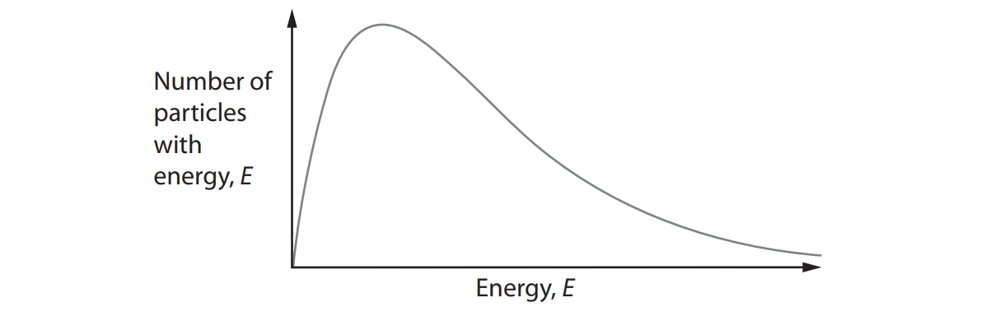

# Exam Questions — Redox Chemistry & Acid-Base Titrations
**2. Energetics, Group Chemistry, Halogenoalkanes & Alcohols** · Edexcel International A Level (IAL) Chemistry (YCH11)
> Source: [https://www.savemyexams.com/international-a-level/chemistry/edexcel/17/topic-questions/2-energetics-group-chemistry-halogenoalkanes-and-alcohols/2-3-redox-chemistry-and-acid-base-titrations/structured-questions/](https://www.savemyexams.com/international-a-level/chemistry/edexcel/17/topic-questions/2-energetics-group-chemistry-halogenoalkanes-and-alcohols/2-3-redox-chemistry-and-acid-base-titrations/structured-questions/) · 21 questions · total 47 marks

## Q1 — medium — 22 marks · structured-questions

### 22((a)) — 4 marks — command: multiple — structured — from paper Jan 2021 · WCH12/01
Potassium chlorate(V), KClO3 , is a crystalline solid used in fireworks. It is produced by the Liebig Process in two stages.

| Stage 1 | Chlorine gas is passed through hot calcium hydroxide solution forming calcium chlorate(V), Ca(ClO3)2 . |
|---|---|

6Ca(OH)2 (aq) + 6Cl2 (g) → Ca(ClO3)2 (aq) + 5CaCl2 (aq) + 6H2O (l)

| Stage 2 | Potassium chloride solution is then added to form potassium chlorate(V). |
|---|---|

Ca(ClO3)2 (aq) + 2KCl (aq) → 2KClO3 (aq) + CaCl2 (aq)

The solution is heated to reduce its volume and then allowed to crystallise. The crystals are filtered off. 
The remaining filtrate is evaporated further to obtain more crystals.

i) Write the **overall** equation for the Liebig Process. State symbols are not required.

**(1)**

ii) Calculate the **overall** atom economy by mass for the production of potassium chlorate(V), KClO3 , using your equation in (a)(i).

**(3)**

### 22((b)) — 3 marks — command: explain — structured — from paper Jan 2021 · WCH12/01
Explain the type of reaction that takes place in Stage 1 of the Liebig Process, using oxidation numbers.

6Ca(OH)2 (aq) + 6Cl2 (g) → Ca(ClO3)2 (aq) + 5CaCl2 (aq) + 6H2O (l)

### 22((c)) — 8 marks — command: multiple — structured — from paper Jan 2021 · WCH12/01
The crystals of potassium chlorate(V) formed also contain some halide ion impurities.

i) Describe a chemical test on a solution of these crystals to **confirm** that the impurities present are chloride ions rather than bromide ions. Include the expected results.

**(3)**

ii) 1.52 g of impure potassium chlorate(V), formed in the Liebig Process, was heated until the mass of solid remaining was constant at 1.02 g.

The reaction that occurred was

2KClO3 (s) → 2KCl (s) + 3O2 (g)

The impurities present did not decompose on heating.

Calculate the percentage purity of the sample. Give your answer to an appropriate number of significant figures.

**(5)**

### 22((d)) — 5 marks — command: multiple — structured — from paper Jan 2021 · WCH12/01
In fireworks, potassium chlorate(V) decomposes. This thermal decomposition takes place in two stages with a solid catalyst.

4KClO3 → KCl + 3KClO4 
KClO4 → KCl + 2O2

i)  Give the systematic name of KClO4 .

**(1)**

ii) A student investigated the role of the catalyst in this reaction.

**Procedure**

| Step 1 | Heat a sample of KClO3 , in a test tube, with a known mass of insoluble catalyst until the mass remains constant. |
|---|---|
| Step 2 | Mix the contents of the test tube with water. |
| Step 3 | Filter the mixture and rinse with deionised water. |
| Step 4 | Dry the remaining solid. |
| Step 5 | Measure the mass of the dry solid. |

Explain how each of the steps in this procedure is needed to show that the catalyst is **not** used up in this reaction.

**(4)**

### 22((e)) — 2 marks — command: explain — structured — from paper Jan 2021 · WCH12/01
Explain, using the diagram, how a catalyst speeds up a chemical reaction.

## Q2 — easy — 1 marks · multiple-choice-questions

### 5() — 1 mark — multiple_choice — from paper June 2021 · WCH12/01
What is the oxidation number of chromium in Na2Cr2O7?
- **A.** +1
- **B.** +2
- **C.** +3
- **D.** +6

## Q3 — easy — 1 marks · multiple-choice-questions

### 6() — 1 mark — multiple_choice — from paper June 2021 · WCH12/01
In an oxide of nitrogen, the oxidation number of nitrogen is +4.

Which is the formula of the oxide?
- **A.** N2O
- **B.** N2O3
- **C.** N2O4
- **D.** N2O5

## Q4 — easy — 1 marks · multiple-choice-questions

### 11() — 1 mark — multiple_choice — from paper Oct 2021 · WCH12/01
What is the oxidation number of phosphorus in the phosphate ion, P$O_{4}^{3-}$?
- **A.** –3
- **B.** +3
- **C.** +5
- **D.** +7

## Q5 — easy — 1 marks · multiple-choice-questions

### 1() — 1 mark — multiple_choice
What is the oxidation number of manganese in the ion MnO4–?
- **A.** +4
- **B.** +5
- **C.** +6
- **D.** +7

## Q6 — easy — 1 marks · multiple-choice-questions

### 1() — 1 mark — multiple_choice
Which reaction is an example of disproportionation?
- **A.** CaCO3 → CaO + CO2
- **B.** Cl2 + 2KBr → 2KCl + Br2
- **C.** Cl2 + 2NaOH → NaCl + NaClO + H2O
- **D.** 2Na + 2H2O → 2NaOH + H2

## Q7 — medium — 1 marks · multiple-choice-questions

### 7() — 1 mark — multiple_choice — from paper June 2021 · WCH12/01
Hydrogen peroxide, H2O2, breaks down into water and oxygen.

In terms of oxidation and reduction, how do hydrogen and oxygen change in this reaction?

|   | ** ** | **Hydrogen** | **Oxygen** |
|---|---|---|---|
| ☐ | **A** | oxidised | reduced |
| ☐ | **B** | oxidised and reduced | unchanged |
| ☐ | **C** | reduced | oxidised |
| ☐ | **D** | unchanged | oxidised and reduced |
- **A.** 
- **B.** 
- **C.** 
- **D.** 

## Q8 — medium — 1 marks · multiple-choice-questions

### 7() — 1 mark — multiple_choice — from paper Jan 2021 · WCH12/01
Iodate(V) ions, I$O_{3}^{-}$, oxidise dithionate ions, S2$O_{6}^{2-}$, according to the equation

**x** I$O_{3}^{-}$+ **y** S2$O_{6}^{2-}$+ 4H2O → **z **S$O_{4}^{2-}$+ 8H++ I2

What are the balancing numbers **x, y **and** z**?

|   | ** ** | **x** | **y** | **z** |
|---|---|---|---|---|
| ☐ | **A** | 2 | 1 | 2 |
| ☐ | **B** | 2 | 2 | 4 |
| ☐ | **C** | 2 | 5 | 5 |
| ☐ | **D** | 2 | 5 | 10 |
- **A.** 
- **B.** 
- **C.** 
- **D.** 

## Q9 — medium — 1 marks · multiple-choice-questions

### 8() — 1 mark — multiple_choice — from paper Jan 2021 · WCH12/01
Magnesium reacts with hydrochloric acid.

Mg (s) + 2HCl (aq) → MgCl2 (aq) + H2 (g)

Which statement about this reaction is correct?
- **A.** magnesium atoms act as oxidising agents
- **B.** hydrogen molecules act as reducing agents
- **C.** hydrogen ions act as oxidising agents
- **D.** chloride ions act as oxidising agents

## Q10 — medium — 1 marks · multiple-choice-questions

### 9() — 1 mark — multiple_choice — from paper Jan 2022 · WCH15/01
The formulae of four ions are shown.

| **Formula of ion** |
|---|
| CrO42- |
| AlO2- |
| [Fe(CN)6]4- |
| [CrCl2(H2O)4]+ |

How many of these ions contain a metal with an oxidation number of +3?
- **A.** one
- **B.** two
- **C.** three
- **D.** four

## Q11 — medium — 2 marks · multiple-choice-questions

### 10((a)) — 1 mark — multiple_choice — from paper Oct 2021 · WCH12/01
This question is about the reaction shown.

2KMnO4 + xH2C2O4 + yH2SO4 → 2MnSO4 + K2SO4 + 10CO2 + zH2O

What values of x, y and z are needed to balance the equation?

|   | ** ** | **x** | **y** | **z** |
|---|---|---|---|---|
| ☐ | **A** | 5 | 6 | 8 |
| ☐ | **B** | 10 | 3 | 4 |
| ☐ | **C** | 5 | 3 | 8 |
| ☐ | **D** | 10 | 6 | 4 |
- **A.** 
- **B.** 
- **C.** 
- **D.** 

### 10((b)) — 1 mark — multiple_choice — from paper Oct 2021 · WCH12/01
What is the reducing agent in the reaction?
- **A.** H+
- **B.** C2O42-
- **C.** MnO4
- **D.** SO4

## Q12 — medium — 1 marks · multiple-choice-questions

### 11() — 1 mark — multiple_choice — from paper Jan 2022 · WCH12/01
Which name is correct for the ion S$O_{4}^{2-}$ ?
- **A.** sulfate(II)
- **B.** sulfate(IV)
- **C.** sulfate(VI)
- **D.** sulfate(VIII)

## Q13 — medium — 1 marks · multiple-choice-questions

### 11() — 1 mark — multiple_choice — from paper Jan 2021 · WCH14/01
A diprotic acid, H2A, was titrated with sodium hydroxide solution.

H2A (aq) + 2NaOH (aq) $\rightarrow$ Na2A (aq) + 2H2O (l)

A 25.0 cm3 portion of 0.100 mol dm−3 sodium hydroxide solution required 12.80 cm3 of the solution of the diprotic acid for complete neutralisation. What is the concentration of H2A in mol dm−3?
- **A.** 2.56 × 10−2
- **B.** 9.77 × 10−2
- **C.** 1.95 × 10−1
- **D.** 3.91 × 10−1

## Q14 — medium — 1 marks · multiple-choice-questions

### 12() — 1 mark — multiple_choice — from paper Jan 2022 · WCH12/01
In which compound is the oxidation number of nitrogen +5?
- **A.** Ca(NO3)2
- **B.** Mg3N2
- **C.** N2O3
- **D.** NaNO2

## Q15 — medium — 1 marks · multiple-choice-questions

### 12() — 1 mark — multiple_choice — from paper Oct 2021 · WCH12/01
Which reaction is **not** a redox reaction?
- **A.** 4KClO3 (s) → 3KClO4 (s) + KCl (s)
- **B.** 2HCl (aq) + Ba(OH)2 (aq) → BaCl2 (aq) + 2H2O (l)
- **C.** Zn (s) + CuSO4 (aq) → ZnSO4 (aq) + Cu (s)
- **D.** Cl2 (g) + H2O (l) → HCl (aq) + HClO (aq)

## Q16 — medium — 1 marks · multiple-choice-questions

### 13() — 1 mark — multiple_choice — from paper Jan 2022 · WCH12/01
In which reaction is the copper species acting as an oxidising agent?
- **A.** Cu2+ + 2Ag → 2Ag+ + Cu
- **B.** 2Cu++ O2– → Cu2O
- **C.** 3Cu + O2 → Cu2O + CuO
- **D.** Cu + Hg2+ → Hg + Cu2+

## Q17 — medium — 1 marks · multiple-choice-questions

### 14() — 1 mark — multiple_choice — from paper Jan 2022 · WCH12/01
Two half‐equations for a reaction are shown.

Cu → Cu2+ + 2e−

NO3− + 4H+ + 3e− → NO + 2H2O

What is the overall ionic equation for this reaction?
- **A.** Cu + N$O_{3}^{-}$+ 4H+→ Cu2+ + NO + 2H2O
- **B.** 2Cu + N$O_{3}^{-}$+ 4H+→ 2Cu2+ + NO + 2H2O
- **C.** 3Cu + 2N$O_{3}^{-}$+ 8H+→ 3Cu2+ + 2NO + 4H2O
- **D.** 6Cu + 2N$O_{3}^{-}$+ 8H+→ 6Cu2+ + 2NO + 4H2O

## Q18 — medium — 1 marks · multiple-choice-questions

### 15() — 1 mark — multiple_choice — from paper Jan 2022 · WCH12/01
A titre of 13.25 cm3 was obtained using a 50 cm3 burette.

What is the percentage uncertainty in the titre?

[Each reading of the burette has an uncertainty of ±0.05 cm3]
- **A.** ±0.38%
- **B.** ±0.75%
- **C.** ±1.5%
- **D.** ±7.5%

## Q19 — medium — 3 marks · multiple-choice-questions

### 15((a)) — 1 mark — multiple_choice — from paper June 2021 · WCH12/01
A pellet of sodium hydroxide has a mass of 0.700 g.

Some pellets were dissolved to make 350 cm3 of 0.25 mol dm–3 solution.

[*M*r value: NaOH = 40]

How many pellets were dissolved?
- **A.** 4
- **B.** 5
- **C.** 8
- **D.** 125

### 15((b)) — 1 mark — multiple_choice — from paper June 2021 · WCH12/01
25.0 cm3 of the sodium hydroxide solution prepared in (a) was placed in a conical flask and titrated with sulfuric acid.

2NaOH + H2SO4 → Na2SO4 + 2H2O

Calculate the number of moles of sulfuric acid that reacted.
- **A.** 0.0031
- **B.** 0.0063
- **C.** 0.013
- **D.** 0.044

### 15((c)) — 1 mark — multiple_choice — from paper June 2021 · WCH12/01
Phenolphthalein indicator was used for the titration in (b).

What was the colour change at the endpoint?
- **A.** colourless → pink
- **B.** pink → colourless
- **C.** orange → yellow
- **D.** yellow → orange

## Q20 — medium — 1 marks · multiple-choice-questions

### 1() — 1 mark — multiple_choice
The Haber process is used industrially to manufacture ammonia:

N2 (g) + 3H2 (g) ⇌ 2NH3 (g)    Δ*H* = −92 kJ mol–1

What is the effect on both the rate of reaction and the equilibrium yield of NH3 when the temperature is increased?

|   | **Rate of reaction** | **Equilibrium yield of NH****3** |
|---|---|---|
| **A** | Decreases | Decreases |
| **B** | Decreases | Increases |
| **C** | Increases | Decreases |
| **D** | Increases | Increases |
- **A.** 
- **B.** 
- **C.** 
- **D.** 

## Q21 — hard — 3 marks · multiple-choice-questions

### 8((a)) — 1 mark — multiple_choice — from paper Jan 2022 · WCH15/01
A group of students carry out an experiment to find the concentration of chlorine, Cl2 (aq), in a solution.

Excess potassium iodide solution is added to a 10.0 cm3 sample of the chlorine solution.

Cl2 (aq) + 2I− (aq) $\rightarrow$ 2Cl− (aq) + I2 (aq)

The iodine produced is titrated with a solution of thiosulfate ions of known concentration, using starch indicator.

2S2O32- (aq) + I2 (aq) → S4O62- (aq) + 2I− (aq)

The concentration of the Cl2 (aq) is between 0.038 and 0.042 mol dm−3 .

What concentration of thiosulfate ions, in mol dm−3 , is required to give a titre of approximately 20 cm3 ?
- **A.** 0.010
- **B.** 0.020
- **C.** 0.040
- **D.** 0.080

### 8((b)) — 1 mark — multiple_choice — from paper Jan 2022 · WCH15/01
What is the most suitable volume of 0.1 mol dm−3 potassium iodide solution, in cm3, to add to the 10.0 cm3 of chlorine solution?
- **A.** 7.6
- **B.** 8.0
- **C.** 8.4
- **D.** 10.0

### 8((c)) — 1 mark — multiple_choice — from paper Jan 2022 · WCH15/01
What is the colour change at the end‐point of the titration?
- **A.** colourless to pale yellow
- **B.** pale yellow to colourless
- **C.** colourless to blue‐black
- **D.** blue‐black to colourless
