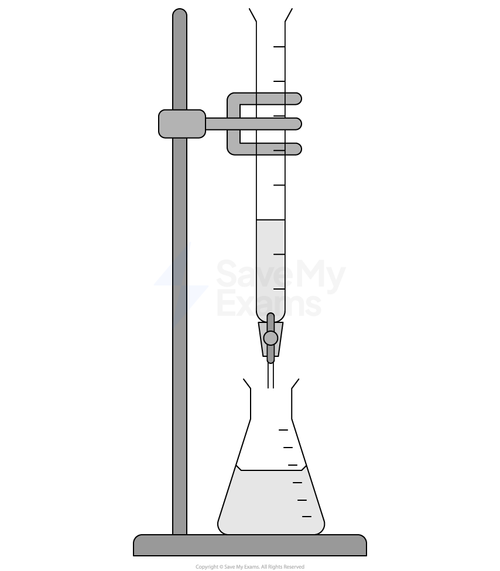

# Exam Questions — Group 7
**2. Energetics, Group Chemistry, Halogenoalkanes & Alcohols** · Edexcel International A Level (IAL) Chemistry (YCH11)
> Source: [https://www.savemyexams.com/international-a-level/chemistry/edexcel/17/topic-questions/2-energetics-group-chemistry-halogenoalkanes-and-alcohols/2-5-group-7/structured-questions/](https://www.savemyexams.com/international-a-level/chemistry/edexcel/17/topic-questions/2-energetics-group-chemistry-halogenoalkanes-and-alcohols/2-5-group-7/structured-questions/) · 10 questions · total 29 marks

## Q1 — medium — 10 marks · structured-questions

### 22((a)) — 1 mark — command: predict — structured — from paper Jan 2022 · WCH12/01
This question is about the elements in Group 7.

Use your knowledge of the trends in the properties of Group 7 elements to predict the colour and physical state of astatine at room temperature.

### 22((b)) — 3 marks — command: multiple — structured — from paper Jan 2022 · WCH12/01
i) State the meaning of the term electronegativity.

**(1)**

ii) Explain the trend in electronegativity down Group 7.

**(2)**

### 22((c)) — 6 marks — command: contrast — structured — from paper Jan 2022 · WCH12/01
Compare and contrast the reactions of chlorine with

- water
- cold, dilute aqueous alkali
- hot, concentrated aqueous alkali

Include an equation for each reaction, stating the type of reaction and the oxidation numbers of the chlorine involved. State symbols are not required.

## Q2 — medium — 10 marks · structured-questions

### 1() — 2 marks — command: identify — structured
This question is about redox chemistry, Group 2 and Group 7.

When chlorine water is added to a solution of potassium bromide, the solution turns orange.

State the changes in oxidation number of bromine and chlorine, and identify which species is the oxidising agent.

[2]

### 2() — 3 marks — command: explain — structured
Describe and explain the trend in thermal stability of the Group 2 carbonates (MgCO3 to BaCO3).

### 3() — 4 marks — command: calculate — structured
A 1.25 g sample of impure limestone is analysed to find its percentage of calcium carbonate by a back-titration method.

The sample is dissolved in 50.00 cm3 of 0.500 mol dm–3 hydrochloric acid (an excess).

The excess hydrochloric acid is then titrated against 0.200 mol dm–3 sodium hydroxide solution. The volume required to neutralise the excess acid is 25.00 cm3.

[Assume the impurities in the limestone do not react with the hydrochloric acid. *M*r(CaCO3) = 100.0]

Calculate the percentage by mass of calcium carbonate in the limestone sample.

### 4() — 1 mark — command: explain — structured
When chlorine is bubbled through cold, dilute sodium hydroxide solution, a disproportionation reaction occurs.

Cl2 + 2NaOH → NaCl + NaClO + H2O

Explain why it is classified as disproportionation.

## Q3 — easy — 1 marks · multiple-choice-questions

### 14() — 1 mark — multiple_choice — from paper Oct 2021 · WCH12/01
Which statement about the Group 7 elements chlorine, bromine and iodine is **not** correct?
- **A.** boiling temperature increases down the group
- **B.** reactivity increases down the group
- **C.** first ionisation energy decreases down the group
- **D.** electronegativity decreases down the group

## Q4 — easy — 1 marks · multiple-choice-questions

### 16() — 1 mark — multiple_choice — from paper June 2021 · WCH12/01
Which silver halides are soluble in **concentrated **aqueous ammonia?
- **A.** AgBr and AgI
- **B.** AgCl and AgI
- **C.** AgCl and AgBr
- **D.** AgCl only

## Q5 — medium — 2 marks · multiple-choice-questions

### 6((a)) — 1 mark — multiple_choice — from paper Jan 2021 · WCH12/01
This question is about the reaction of potassium iodide with concentrated sulfuric acid.

Which of these would **not **be seen?
- **A.** misty fumes
- **B.** black solid
- **C.** yellow solid
- **D.** dense white smoke

### 6((b)) — 1 mark — multiple_choice — from paper Jan 2021 · WCH12/01
One of the reaction products is the gas H2S. What is the **change** in oxidation number of sulfur as H2S forms?
- **A.** −8
- **B.** −6
- **C.** −2
- **D.** +6

## Q6 — medium — 1 marks · multiple-choice-questions

### 10() — 1 mark — multiple_choice — from paper Jan 2021 · WCH12/01
Which of these** increases **as Group 7 is descended?
- **A.** oxidising ability of the molecular halogens
- **B.** reducing ability of the halide ions
- **C.** electrostatic attraction between the nucleus and outer shell of electrons
- **D.** electronegativity of the halogen atoms

## Q7 — medium — 1 marks · multiple-choice-questions

### 15() — 1 mark — multiple_choice — from paper Oct 2021 · WCH12/01
When iodine is dissolved in a non-polar organic solvent, the solution formed is
- **A.** purple
- **B.** orange
- **C.** colourless
- **D.** brown

## Q8 — medium — 1 marks · multiple-choice-questions

### 17() — 1 mark — multiple_choice — from paper Jan 2022 · WCH12/01
Four tests used to identify ions are shown:

1   flame test
2   addition of acidified barium nitrate solution
3   addition of acidified silver nitrate solution
4   addition of sodium hydroxide solution, then testing any gas with indicator paper

Which tests could be used to positively identify the ions in ammonium chloride?
- **A.** 1 and 2
- **B.** 1 and 3
- **C.** 2 and 4
- **D.** 3 and 4

## Q9 — medium — 1 marks · multiple-choice-questions

### 17() — 1 mark — multiple_choice — from paper Oct 2021 · WCH12/01
Solid potassium bromide reacts with concentrated sulfuric acid.

Which of these substances does **not** form?
- **A.** bromine
- **B.** hydrogen bromide
- **C.** hydrogen sulfide
- **D.** sulfur dioxide

## Q10 — medium — 1 marks · multiple-choice-questions

### 1() — 1 mark — multiple_choice
A student adds chlorine water to an aqueous solution of an unknown potassium halide. A small volume of cyclohexane (density = 0.79 g cm–3) is then added and the mixture is shaken thoroughly.

The upper layer turns purple/violet.

Which halide was present in the original solution?
- **A.** KBr
- **B.** KCl
- **C.** KF
- **D.** KI
