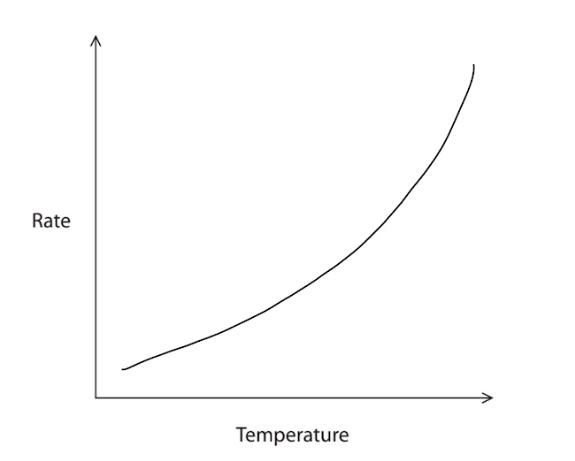
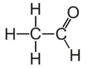
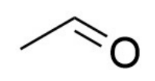
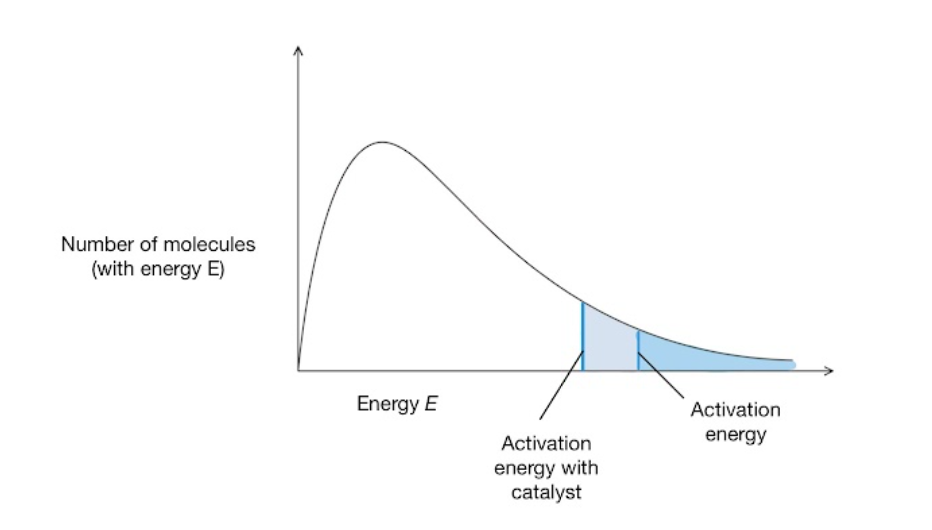
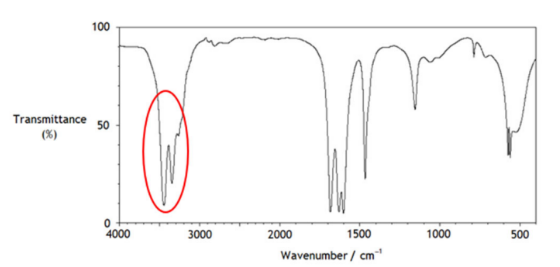
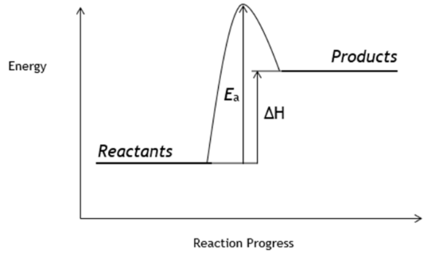
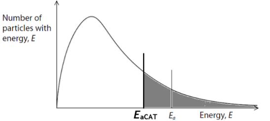
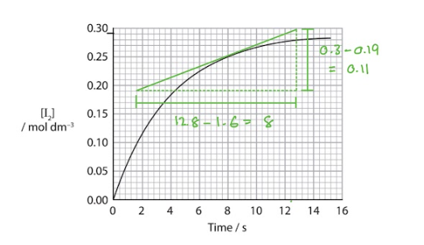

# Mark Schemes — Introduction to Kinetics & Equilibria
**2. Energetics, Group Chemistry, Halogenoalkanes & Alcohols** · Edexcel International A Level (IAL) Chemistry (YCH11)

## Q1 — medium — 7 marks · structured-questions

### 4((a)) — 4 marks
i) The  rate at 15°C to a suitable number of significant figures is:

- Calculation of rate: time read from graph = 33 seconds 
**AND** 
1 ÷ 33 = 0.0303; **[1 mark]**
- Answer to 1 or 2 SF: 0.030 / 0.03; **[1 mark]**
- Units s-1; **[1 mark]**

ii) A line showing how the rate of reaction varies with temperature for this reaction is:

- Line that shows rate increasing with temperature
**AND**
Line is curved with the gradient increasing; **[1 mark]**

**[Total: 4 marks]**

- *The question tells you to use 1/ t to calculate the rate *

  - *Read the value of t at 15 **o**C and substitute into the equation *
- *Looking at the graph showing how the temperature causes the time taken for the cross to disappear to vary;*

  - *As the temperature increases, the time taken for the cross to disappear decreases*
  - *The higher the temperature, the smaller the decrease in time taken for the cross to disappear*
  
    - *E.g. between 10 and 20 °C, the time decreases from 45 to 23 s, whereas between 50 and 60 °C, the time decreases from 8 to 6 s*
  - *This means that the rate of reaction increases with temperature, and the change in rate is greater at higher temperatures, shown by a curve with an increasing gradient on the rate vs temperature graph*
  - *The change in rate increasing with temperature can be counter-intuitive but you can think about how the rate is calculated to help:*
  
    - *Rate = 1/t*

| > *Temperature / °C* | > *t / s* | > *Rate / s**-1* |
|---|---|---|
| > *10* | > *45* | > *0.022* |
| > *20* | > *23* | > *0.043* |
| > *30* | > *15* | > *0.067* |
| > *40* | > *anomaly - ignored* |   |
| > *50* | > *8* | > *0.125* |
| > *60* | > *6* | > *0.167* |

- *This shows that as temperature increases, the rate of reaction increases but the change in the rate of increase also increases at higher temperatures, giving a steeper gradient*

### 4((b)) — 2 marks
Evaluate the students' results and decide whether it is necessary to repeat their experiments:

- All but one point is on the best fit line / there is one anomaly (at 40 °C) / a clear trend can be seen; **[1 mark]**
- It is not necessary to repeat the experiment as the anomaly has been identified (and excluded from the line of best fit); **[1 mark]**

**[Total: 2 marks]**

- *The graph clearly shows a pattern between rate and temperature*

  - *As the temperature increases the time taken for the cross to become opaque decreases, therefore the rate of reaction has increased*
- *It is only necessary to repeat the experiment in this instance if the trend could not be seen. *

### 4((c)) — 1 marks
You would change the conditions to make this chemical clock measure 40 s at 22 °C by:

- Reducing the concentration (of one or more of the reactants); **[1 mark]**

**[Total: 1 mark]**

- *The graph in part a) shows that at 22 **o**C, it takes 30 seconds for the cross to disappear *
- *The question is asking what needs to be done for it to take 40 seconds for the cross to disappear at this temperature *
- *For the time for the cross to disappear to increase, the rate of reaction must decrease*
- *The obvious suggestion is to reduce the concentration of the reactants as there will be less frequent successful collisions per unit time resulting in a lower rate of reaction *
- *Alternative specific suggestions that will also achieve the mark are:*

  - *Doubling / increasing the volume *
  - *Use a thinner / paler cross *
  - *Dilute the solution*

## Q2 — medium — 12 marks · structured-questions

### 19() — 6 marks
The chemical reasons for the conditions used and why such a low initial yield is acceptable in the industrial process are:

**Chemical ideas expressed **

- High temperature increases rate as more particles have *E* ≥ *E*a
- Catalyst increases rate by providing alternative mechanism / catalysts lower activation energy
- But high temperature reduces yield / moves equilibriumm to LHS as reaction is exothermic
- So (high) temperature (of 300 °C) is a compromise (between rate and yield)
- High pressure increases the yield as reaction / equilibrium moves to side of fewest particles / high pressure increases rate as more particles in the same volume
- (Low yield acceptable) as unconverted reactants can be recycled / passed through reactor again

**[Total: 6 marks]**

- *The first marking point can be shown on a labelled diagram*
- *You could state that the compromise is between temperature or pressure and energy costs / equipment to withstand pressure or costs to maintain temperature / pressure*
- *An answer scoring** 6** marks would include*

  - *6 correct marking points AND answer is written in a clear and logical order and points fully explained *
- *An answer scoring** 5** marks would include*

  - *5-4 correct marking points AND answer is written in a clear and logical order and points fully explained *
- *An answer scoring** 4** marks would include*

  - *4-3 correct marking points AND answer has some structure and gives some explained points*
- *An answer scoring **3** marks would include*

  - *3-2 correct marking points AND answer has some structure and gives some explained points*

### 19((b)) — 3 marks
Ethanol and water mix together fully because:

- When they mix can form hydrogen bonds (to each other); **[1 mark]**
- As both compounds have hydrogen bonds (between their molecules)
**OR**
Forces that form are similar in strength or stronger than hydrogen bonds in water / ethanol
**OR**
Ethanol-water forces can overcome ethanol-ethanol / water-water forces; **[1 mark]**
- From the lone pair / slight negative charge on an oxygen (atom in one molecule) to a slightly positive hydrogen (atom in the other molecule) (on OH group or water); **[1 mark]**

**[Total: 3 marks]**

- *The first and third mark can be awarded from a suitable diagram, such as:*

- *Polar covalent substances generally dissolve in polar solvents as a result of dipole-dipole interactions or the formation of hydrogen bonds between the solute and the solvent*
- *Ethanol and water is a typical example of this where hydrogen bonds form*
- *The solubility of alcohols decreases as the carbon chain length increases because the polar part of the molecule becomes a smaller part of the molecule*

### 19((c)) — 3 marks
i) The structure of **Y** is:

-  **OR**  ; **[1 mark]**

ii) The conditions needed to maximise the yield of each product are:

- Y - Distil (off Y from reaction mixture as it forms); **[1 mark]**
- Ethanoic acid – (heat under) reflux; **[1 mark]**

**[Total: 3 marks]**

- *When primary alcohols, such as ethanoic acid, are oxidised with acidified potassium dichromate(VI), an aldehyde is produced (ethanal) which can be further oxidised to a carboxylic acid (ethanoic acid)*
- *What product is favoured depends on the reaction conditions*

  - *Ethanol is warmed with acidified potassium dichromate(VI)*
  - *Ethanal has a lower boiling point than ethanol so it can be distilled off as soon as it forms *
  - *Further refluxing of ethanal with excess acidified potassium dichromate(VI) will oxidise it to ethanoic acid*

## Q3 — medium — 19 marks · structured-questions

### 22((a)) — 2 marks
**One** advantage and** one **disadvantage of using bioethanol in petrol are:

- Advantage: (It is produced from) renewable / sustainable (resources); **[1 mark]**
- Disadvantage: it uses up land (that could be used for food production) / uses a food crop that could be eaten 
**OR** 
It produces less energy (per mole / g); **[1 mark]**

**[Total: 2 marks]**

- *You should know the advantages and disadvantages of biofuels *

  - *Advantages include:*
  
    - *Carbon neutrality *
    - *Reducing landfill waste*
    - *Provide an income for less developed countries that have the space to grow the crops required*
  - *Disadvantages include:*
  
    - *Financial cost of converting engines / machinery to use biofuels*
    - *Developed countries often don't have the land / space to produce the plants for biofuels*
    - *Land used for biofuel production might be needed for food production*

### 22((b)) — 1 marks
This fermentation must be carried out in the absence of air because:

- Ethanol can be oxidised
**OR**
Ethanol can react with oxygen 
**OR**
To ensure only anaerobic respiration takes place**; [1 mark]**

**[Total: 1 mark]**

- *Ethanol is a primary alcohol so an oxidation reaction could result in the formation of ethanal or ethanoic acid *

### 22((c)) — 1 marks
The ethanol can be obtained, after filtering the fermentation mixture by:

- (Fractional) distillation; **[1 mark]**

**[Total: 1 mark]**

- *Once fermentation mixture has been filtered, the remaining solution would consist of water and ethanol*
- *Distillation separates a mixture of solutions based on their boiling point*

  - *Ethanol has a lower boiling point than water so will be distilled off first *

### 22((d)) — 2 marks
i) Ethanol is able to absorb water because:

- Ethanol forms hydrogen bonds (with water); **[1 mark]**

ii) A problem arising from the hygroscopic nature of ethanol when using this fuel in a motor vehicle is:

Any **one **from:

- (Water can cause) corrosion / rusting; **[1 mark]**
- Reduce the energy efficiency of the engine / fuel / ethanol; **[1 mark]**
- Causes phase separation of the fuel; **[1 mark]**

**[Total: 2 marks]**

- *You must make sure you refer to hydrogen bonding in your answer, simply referencing solubility will not score any credit *
- *You may not have come across part ii) specifically so you must apply your understanding of this topic to come up with an answer *

  - *You would also gain credit for saying that water does not burn *

### 22((e)) — 10 marks
i) These conditions are used because:

Chemical ideas expressed:

- If temperature increases, rate increases (because more particles have energy greater than Ea)
- If temperature increases, yield decreases (because forward reaction is exothermic/ reaction moves in the endothermic direction)
- If pressure increases, rate increases (because particles are more crowded and) collision frequency increases)
- If pressure increases, yield increases( as there are fewer particles on the RHS of the equation)
- The catalyst allows the use of lower temperature/less energy (for the same rate)
- High pressure (and temperature) are very expensive

ii) The completed Maxwell–Boltzmann distribution curve with explanation:

- Correct labelling of both axes; **[1 mark]**
- Activation energy labelled; **[1 mark]**
- Activation energy with a catalyst shown to the left of the uncatalysed activation energy; **[1 mark]**

Explanation:

- More particles have energy greater than the activation energy with the catalyst / *E* $\geq$*E*a 
**OR**
There are more particles to the right of the activation energy
**OR**
There is a greater area to the right of the activation energy; **[1 mark]**

**[Total: 10 marks]**

- *For part (i)*

  - *An answer scoring** 6** marks would include*
  
    - *6 correct marking points **AND **the answer is written in a clear and logical order and points fully explained *

- *An answer scoring** 5** marks would include*

  - *5-4 correct marking points **AND **the answer is written in a clear and logical order and points fully explained *

- *An answer scoring** 4** marks would include*

  - *4-3 correct marking points **AND **the answer has some structure and gives some explained points*

- *An answer scoring **3** marks would include*

  - *3-2 correct marking points **AND **the answer has some structure and gives some explained points*
- *For part ii)*

  - *The first three marks** must** be shown on the diagram *
  - *Marking point 4 can be either explained or on the diagram with labelled shading *

### 22((f)) — 3 marks
i) The advantage of using support materials containing lots of pores is:

- Large(r) surface area (so faster rate of reaction); **[1 mark]**

ii) The overall yield of this process can be improved to make it economically viable by:

- Removing the ethanol; **[1 mark]**
- Recycling the unused reactants; **[1 mark]**

**[Total: 3 marks]**

- *If the ethanol is removed, the system will shift the position of the equilibrium to oppose the change*

  - *The equilibrium will shift to the right causing an increase in the yield of ethanol *

## Q4 — medium — 20 marks · structured-questions

### 24((a)) — 3 marks
The melting temperature of urea is higher than expected for a relatively small molecule because:

- Urea forms hydrogen bonds; **[1 mark]**
- Urea forms (permanent) dipole-dipole forces; **[1 mark]**
- These forces are stronger than London forces 
**OR** 
Hydrogen bonds are the strong<u>**est**</u>** **intermolecular forces; **[1 mark]**

**[Total: 3 marks]**

- *You could draw a diagram to show the hydrogen bonds*
- *You can use the terms dispersion forces or van der Waals forces instead of London forces, but London forces is the preferred term*
- *You should be able to identify molecules that will form hydrogen bonds, even if they are unfamiliar to you *
- *Remember**: Hydrogen bonds form when a species has a highly electronegative species (O, N or F) atom bonded to a hydrogen atom*
- *You will be aware of the anomalous properties of water due to hydrogen bonds and the reason for urea having a higher than expected melting temperature is the same as for water*

### 24((b)) — 2 marks
The mass of urea in 150 cm3 of a saturated solution is:

- *M*r of urea = 60 
**OR** 
Moles of urea = (150 cm3 ÷ 1000) × 9.07 mol dm-3 = 1.36(05) mol;** [1 mark]**
- Mass of urea required = 1.36(05) × 60 = 81.63 (g) / 81.6 (g); ** [1 mark]**

**[Total: 2 marks]**

- *A correct answer without working scores 2 marks*
- *You should be confident in using the different equations relating to moles in calculations*
- *This question uses *

  - *moles =  concentration x volume (dm**3**) *
  - *mass = moles x **M**r*

### 24((c)) — 1 marks
NOx emissions are harmful to the environment because:

- (oxides of nitrogen lead to the formation of) acid rain; **[1 mark]**

**Final answer:** **[Total: 1 mark**

- *Formation of acid rain is the expected answer and you could describe the formation by explaining that HNO**3** is formed*
- *An alternative answer would be to explain that nitrogen monoxide can react with ozone (and therefore depletes the ozone layer) but you must be specific about this being caused by nitrogen monoxide, not just NO**x*
- *Careful**: NO**x** emissions are not greenhouse gases so do not contribute to global warming*

### 24((d)) — 2 marks
i) The absorption in the spectrum that could be due to the stretching of the N—H bond is:

- Correct peak circled; **[1 mark]**

ii) The bond responsible for the absorption at 1683 cm−1. is:

- C=O; **[1 mark]**

**[Total: 2 marks]**

- *This should be a straightforward case of using the Data Book to identify these peaks - simply identify the wavenumber of the peak and find the bond vibration of a bond found within urea that this corresponds to*

### 24((e)) — 4 marks
i) The equation for the **reversible **reaction between urea and water is:

(NH2)2CO + H2O $\rightleftharpoons$**2NH****3**** + CO****2**

- Correct products **AND **reversible arrow; **[1 mark]**

ii) The reaction profile for the forward reaction is:

- Line labelled products higher than line labelled reactants and to the right; **[1 mark]**
- Δ*H* labelled correctly; **[1 mark]**
- *E*a labelled correctly; **[1 mark]**

**[Total: 4 marks]**

- *You are given the products for the reaction between urea and water and you should know the formulae of ammonia and carbon dioxide*
- *Remember**: Include the reversible arrow to represent reversible reactions; you would be allowed to draw two full headed arrows, one in each direction*
- *You are given the enthalpy change for the reaction which is positive, meaning the forward reaction is endothermic*
- *You should know how to represent an endothermic reaction in a reaction profile*
- *Make sure that you draw your arrows accurately, the arrows should both start in line with the reactants, Δ**H **should point to the products and **E**a** should point to the peak of the curve, use a ruler to draw them*
- *Common errors are not drawing an arrowhead or drawing the arrowhead in the wrong direction - you would be penalised each time you made either of these mistakes*
- *Another error is using a double headed arrow - this would be penalised once*

### 24((f)) — 4 marks
i) It is **not** correct to state that urea is acting as a catalyst in the reaction because:

- The urea is a reactant and forms a new product (that leaves the catalytic converter); **[1 mark]**

ii) A catalyst increases the rate of a chemical reaction by:

- A catalyst decreases the activation energy required
**OR**
A catalyst moves* E*a to the left; **[1 mark]**
- More particles have the energy required for the reaction to take place
**OR**
The area under the curve above *E*a increases; **[1 mark]**
- Increases the number of successful collisions per unit time / frequency of successful collisions; **[1 mark]**

**[Total: 4 marks]**

- *There are a number of ways of answering part (i) that would give you the mark, which are:*

  - *Catalysts are not used up in the reaction*
  - *Urea is used up in the reaction*
  - *The amount/mass of urea changed*
  - *Urea is not reformed*
  - *The catalyst is a metal oxide*
- *You could annotate the Maxwell‐Boltzmann distribution to score the first mark: *

- *You do not have to include the shading, but if you shaded it incorrectly, you would not gain the second mark*** **

### 24((g)) — 4 marks
i) The catalytic converter reaches this temperature by:

- The hot gases from the engine warm up the catalytic converter; **[1 mark]**

ii) The number of molecules of nitrogen formed per hour is:

- Conversion of m3 to dm3: 89.3 × 1000 = 89 300 dm3; **[1 mark]**
- Moles of nitrogen = 89300 ÷ 51.1 = 1747.6 / 1748 mol; **[1 mark]**
- Number of molecules of nitrogen = 1748 × 6.02 × 1023 = 1.052 ×1027 / 1.05 ×1027 / 1.1 ×1027; **[1 mark]**

**[Total: 4 marks]**

- *The 'suggest' command word in part (i) indicates that you need to apply your knowledge as this will be something that you have not specifically learnt*
- *Don't let the unfamiliar molar volume put you off!*
- *As the temperature is greater than room temperature, a mole of gas will occupy a larger volume - the way you perform the calculation will be the same as any other calculation involving molar gas volumes, but 24 dm**3** is just replaced with 51.1 dm**3*

## Q5 — easy — 1 marks · multiple-choice-questions

### 2() — 1 marks
**Correct answer: D** — 

**Final answer:** **The correct answer is ****D**** because:**

- The average energy of the particles is shown by the peak of the curve on a Maxwell-Bolztmann distribution curve
- When the temperature increases, the curve flattens and the peak shifts to the right, showing that the average energy of the particles increases
- The activation energy remains unchanged but the proportion of particles with energy equal to or exceeding the activation energy increases

**A** is incorrect as the average energy of the particles in a system increases with temperature and activation energy is not affected by temperature

**B** is incorrect as  the average energy of the particles in a system increases with temperature

**C** is incorrect as activation energy is not affected by temperature

## Q6 — medium — 1 marks · multiple-choice-questions

### 3() — 1 marks
**Correct answer: A** — 0.01

**Final answer:** **The correct answer is ****A**** because::**

- Rate of reaction = $\frac{\mathrm{change} \mathrm{in} \mathrm{concentration}}{\mathrm{time}}$
- A tangent is drawn to the curve at 8 seconds and a gradient of the line determined using ∆y / ∆x as shown below:

- Rate of reaction: $\frac{0.11}{8}$= 0.01 mol dm-3 s-1

**B** is incorrect as this is the average rate of reaction over 15 seconds

**C** is incorrect as  this is the average rate of reaction up to 8 seconds

**D** is incorrect as  this is the concentration reading at 8 seconds

## Q7 — medium — 1 marks · multiple-choice-questions

### 4() — 1 marks
**Correct answer: C** — 

**Final answer:** **The correct answer is ****C**** because:**

- An increase in temperature increases the mean energy of the molecules so the curve shifts to the right
- A catalyst provides an alternative pathway for the reaction which has a lower activation energy, so the *E*a of the catalysed reaction will be to the left of the original, uncatalysed, *E*a

**A** is incorrect as   the curve is for a lower temperature

**B **is incorrect as  the curve is for a lower temperature and the *E*a has increased

**D** is incorrect as  the *E*a has increased

## Q8 — medium — 1 marks · multiple-choice-questions

### 18() — 1 marks
**Correct answer: B** — high temperature, low pressure

**Final answer:** **The correct answer is ****B**** because:**

- The forward reaction is endothermic, so an increase in temperature will favour the forward reaction, increasing the yield
- There are more molecules on the RHS of the equation than the LHS, so lower pressure would shift equilibrium to the right, increasing the yield

**A** is incorrect as high pressure would favour the back reaction

**C** is incorrect as both these conditions would favour the back reaction

**D** is incorrect as  low temperature would favour the back reaction

## Q9 — medium — 1 marks · multiple-choice-questions

### 19() — 1 marks
**Correct answer: C** — darker and then lighter

**Final answer:** **The correct answer is ****C**** because:**

- As the gas is compressed, the pressure increases and the particles move closer together
- As the particles are not spread out as much, the colour of the gas is more concentrated, making it darker in appearance
- The equilibrium shifts to the right to counter the change in pressure by favouring the reaction that produces fewer molecules
- More colourless N2O4 is produced, which causes the gas to become lighter

**A** is incorrect as when the equilibrium is re-established the mixture becomes lighter

**B** is incorrect as when the mixture is compressed it initially becomes darker

**D** is incorrect as  the colour change is reversed

## Q10 — hard — 3 marks · multiple-choice-questions

### 1() — 1 marks
**Correct answer: D** — Increasing the temperature

**Final answer:** **The correct answer is D**

- Going from X to Y, the peak:

  - Shifts to higher energy
  - Becomes lower and broader
- But, the  total area under the curve is unchanged
- This is the signature of a temperature increase

  - Molecules move faster on average, the distribution flattens, and a greater proportion of molecules have kinetic energy ≥ *E*a

**A** is incorrect as adding a catalyst does not change the shape of the Maxwell–Boltzmann curve, it only shifts the *E*a marker to the left (a lower energy barrier). The distribution of molecular energies is unchanged

**B** is incorrect as changing concentration changes the total area under the curve (total number of molecules) but not the shape of the distribution

**C** is incorrect as pressure does not change the shape of the Maxwell–Boltzmann curve at constant temperature, kinetic energy depends on T, not P

> **[exam-tip]**
> Memorise the key signatures of Maxwell–Boltzmann curve changes:
> 
> - Temperature increase
> 
>   - The peak shifts right and lowers
>   - The distribution broadens
>   - The area under the curve is unchanged
> - Catalyst
> 
>   - The curve itself doesn't change
>   - The dashed line for Ea shifts left
> - More particles (concentration)
> 
>   - The whole curve scales up (larger total area)
>   - The shape remains unchanged
> 
> Common slips to avoid when drawing Maxwell–Boltzmann curves on paper 2:
> 
> - Drawing a reaction profile instead of a Maxwell–Boltzmann distribution
> 
>   - The January 2024 examiner report flagged a significant number of candidates doing this and scoring zero.
>   - Check the axes:
>   
>     - Maxwell–Boltzmann distributions have number of molecules on the y-axis
>     - A reaction profile has enthalpy.
> - Starting the curve away from the origin, or letting it touch or cross the x-axis at high energies
> 
>   - The October 2020 examiner report flagged this.
>   - The curve must start at the origin and approach the x-axis asymptotically (never touch it).
> - Labelling the y-axis as "Energy" instead of "Number of molecules with activation energy"

### 2() — 1 marks
**Correct answer: C** — The rate increases

**Final answer:** **The correct answer is C**

- Under condition Y, a **larger proportion** of molecules have kinetic energy ≥ Ea (larger shaded area to the right of *E*a)
- More molecules have enough energy for a successful collision → more frequent effective collisions per unit time → faster rate
- Rate increases with temperature, often doubling or tripling for each 10°C rise, because the exponential tail of the Maxwell-Boltzmann curve is very sensitive to T

**A** is incorrect as rate increases (not decreases) with temperature

**B** is incorrect as rate continues increasing with T,  it doesn't reverse (this would only apply if the enzyme or catalyst denatured, which is outside the scope of this question)

**D** is incorrect as rate definitely changes when temperature changes

> **[exam-tip]**
> For full marks on paper 2 structured questions, you need to say: **"a greater proportion of molecules have kinetic energy equal to or greater than the activation energy"**
> 
> The January 2024 examiner report flagged students who referred only to "increased collision frequency" or "more successful collisions" without the **energy ≥***** E*****a** framing, lost marks. Generic references to "successful collisions" are not enough on their own.

### 3() — 1 marks
**Correct answer: C** — *E*a is the minimum energy required for a successful collision

**Final answer:** **The correct answer is C**

- Activation energy is the **minimum** kinetic energy that colliding particles must have for a collision to result in a reaction
- On the Maxwell–Boltzmann distribution curve, it's marked on the x-axis as a vertical line

  - Only molecules to the right of *E*a have sufficient energy to react
- *E*a is neither the average energy nor the overall enthalpy change

**A** is incorrect as the average kinetic energy is where the peak of the Maxwell-Boltzmann distribution lies (where most molecules are), this is typically well below *E*a

**B** is incorrect as the difference in enthalpy between reactants and products is Δ*H* (not *E*a)

**D** is incorrect as the total energy released by a reaction is also Δ*H* (for an exothermic reaction), not *E*a

> **[exam-tip]**
> Don't confuse Ea with Δ*H*:
> 
> - Ea is the kinetic barrier a collision must overcome (always positive)
> - Δ*H* is the enthalpy difference between products and reactants (positive for endothermic, negative for exothermic)
> 
> A catalyst lowers Ea by providing an alternative reaction pathway, but it does **not** change Δ*H*.
> 
> The January 2024 examiner report explicitly rejected candidates who wrote that a catalyst "gives molecules more energy". This is wrong because the molecular-energy distribution is unchanged by a catalyst; only the barrier is lowered.
> 
> The October 2022 examiner report also flagged students drawing double-headed arrows for Ea or Δ*H*. Always use single-headed arrows. Double-headed ones are ambiguous and lose the mark.
