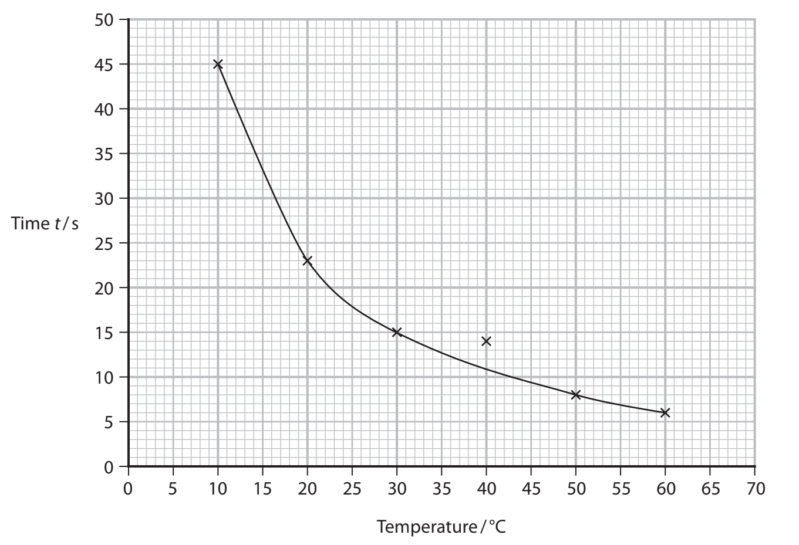
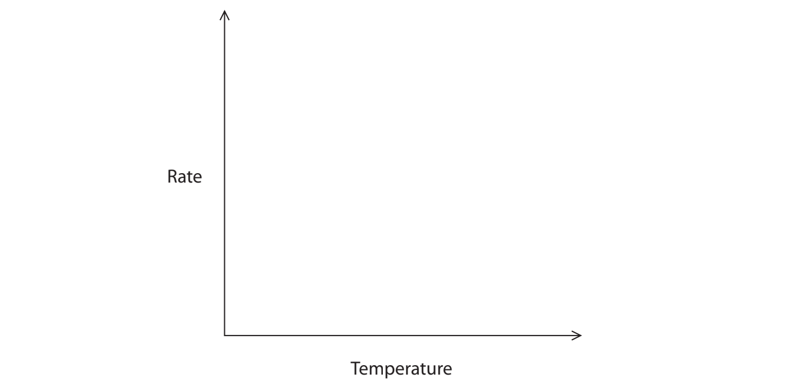
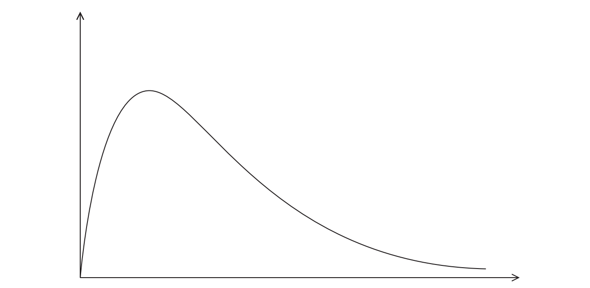
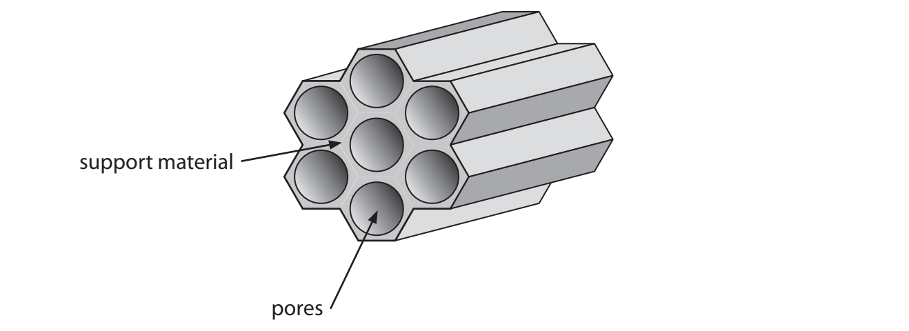
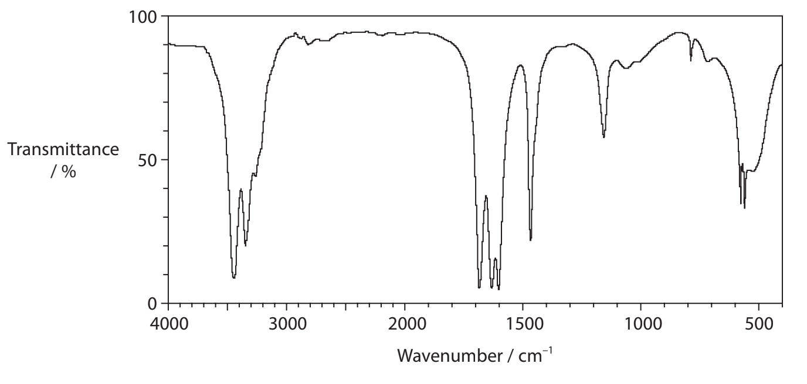
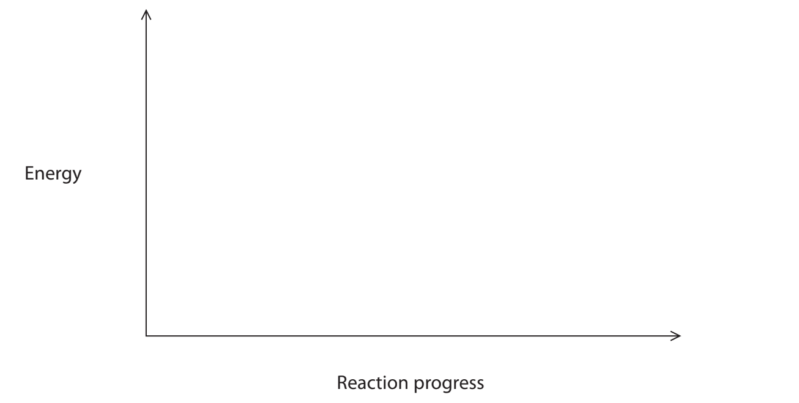
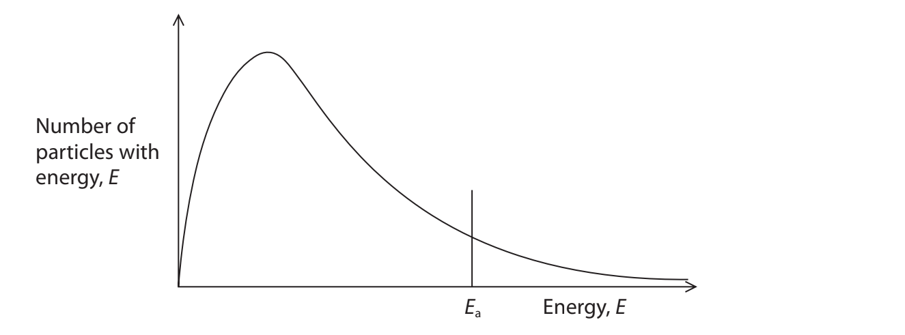
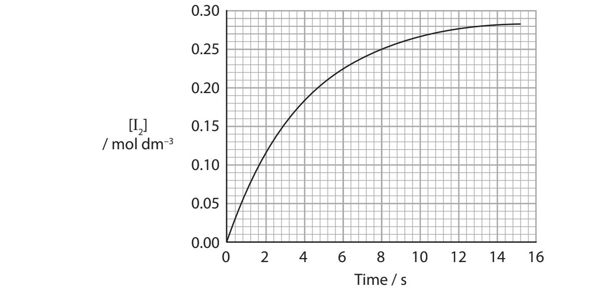
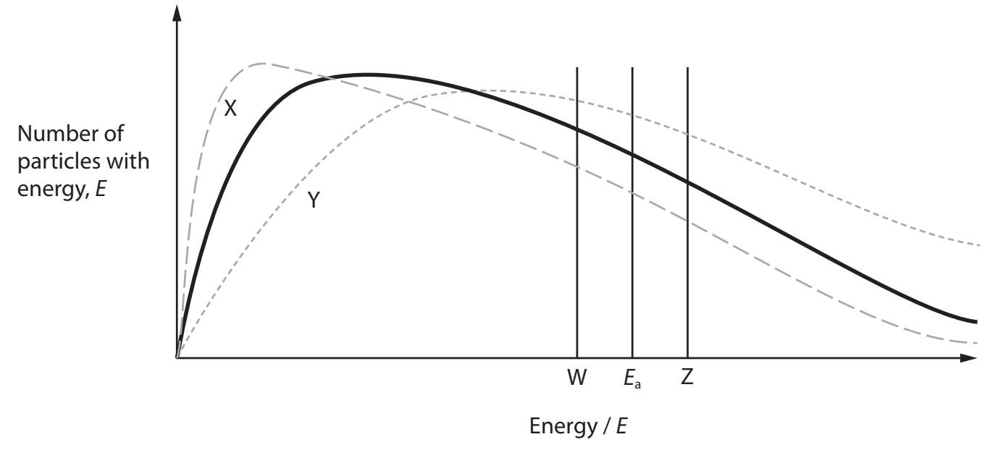

# Exam Questions — Introduction to Kinetics & Equilibria
**2. Energetics, Group Chemistry, Halogenoalkanes & Alcohols** · Edexcel International A Level (IAL) Chemistry (YCH11)
> Source: [https://www.savemyexams.com/international-a-level/chemistry/edexcel/17/topic-questions/2-energetics-group-chemistry-halogenoalkanes-and-alcohols/2-6-introduction-to-kinetics-and-equilibria/structured-questions/](https://www.savemyexams.com/international-a-level/chemistry/edexcel/17/topic-questions/2-energetics-group-chemistry-halogenoalkanes-and-alcohols/2-6-introduction-to-kinetics-and-equilibria/structured-questions/) · 10 questions · total 66 marks

## Q1 — medium — 7 marks · structured-questions

### 4((a)) — 4 marks — command: multiple — structured — from paper Oct 2021 · WCH13/01
Students were set a challenge by their teacher to produce a chemical clock measuring a 20 s time interval. They used an opaque solution that became transparent, allowing a black cross to become visible after 20 s.

The students investigated the effect of temperature on their results and plotted a graph.

In this type of experiment 1/t (where t is time) may be used as a measure of the rate of reaction.

i) Calculate the rate at 15°C to a suitable number of significant figures. Include units in your answer.

**(3)**

ii) Sketch a line showing how the rate of reaction varies with temperature for this reaction.

**(1)**

### 4((b)) — 2 marks — command: evaluate — structured — from paper Oct 2021 · WCH13/01
Evaluate the students' results and decide whether it is necessary to repeat their experiments.

### 4((c)) — 1 mark — command: state — structured — from paper Oct 2021 · WCH13/01
State how you would change the conditions to make this chemical clock measure 40 s at 22 °C.

## Q2 — medium — 12 marks · structured-questions

### 19() — 6 marks — command: explain — structured — from paper Jan 2021 · WCH12/01
Ethanol can be made in industry by the reaction of ethene with steam, using a phosphoric(V) acid catalyst.

CH2=CH2 (g) + H2O (g) ⇌ CH3CH2OH (g)  Δr*H *= −45 kJ mol−1

The reaction is carried out at 300 °C and 60 atm. An initial yield of 5% is achieved when the ethene and steam first pass through the reactor.

Explain the chemical reasons for the conditions used and why such a low initial yield is acceptable in the industrial process.

### 19((b)) — 3 marks — command: explain — structured — from paper Jan 2021 · WCH12/01
The product of the reaction is a mixture of ethanol and water.

Explain why ethanol and water mix together fully.

You may find it helpful to draw a diagram.

### 19((c)) — 3 marks — command: multiple — structured — from paper Jan 2021 · WCH12/01
Ethanol can be oxidised using a solution of acidified potassium dichromate(VI), K2Cr2O7(aq).

Ethanoic acid and another organic compound, **Y**, are both possible products.

i) Draw the structure of **Y**.

**(1)**

ii) State the conditions needed to maximise the yield of each product.

**(2)**

Conditions for maximum yield of **Y**

Conditions for maximum yield of ethanoic acid

## Q3 — medium — 19 marks · structured-questions

### 22((a)) — 2 marks — command: give — structured — from paper Oct 2021 · WCH12/01
This question is about ethanol and bioethanol.

The main fuel used as a petrol substitute is bioethanol. Bioethanol is ethanol that has been produced by fermentation. The starting material is usually some form of plant material rich in starch, such as wheat, maize or potatoes. Enzymes in yeast convert this material to simple carbohydrates such as glucose (C6H12O6) and then to ethanol and carbon dioxide.

C6H12O6 → 2CH3CH2OH + 2CO2

The mixture is left for several days until fermentation is complete. The percentage of ethanol is never greater than 15% because higher concentrations of ethanol kill the yeast.

A common blend of fuel is 95% petrol and 5% bioethanol. The engine does not need to be modified for this mixture.

Give **one** advantage and** one **disadvantage of using bioethanol in petrol.

Advantage

Disadvantage

### 22((b)) — 1 mark — command: suggest — structured — from paper Oct 2021 · WCH12/01
Suggest why this fermentation must be carried out in the absence of air.

### 22((c)) — 1 mark — command: suggest — structured — from paper Oct 2021 · WCH12/01
Suggest how the ethanol can be obtained, after filtering the fermentation mixture.

### 22((d)) — 2 marks — command: multiple — structured — from paper Oct 2021 · WCH12/01
Ethanol is hygroscopic, which means it readily absorbs water from the air.

i) Give a possible reason why ethanol is able to absorb water.

**(1)**

ii) Suggest a problem arising from the hygroscopic nature of ethanol when using this fuel in a motor vehicle.

**(1)**

### 22((e)) — 10 marks — command: explain — structured — from paper Oct 2021 · WCH12/01
Ethanol can also be produced by the hydration of ethene.

CH2=CH2 (g) + H2O (g) ⇌ CH3CH2OH (g)   ∆*H* = −45 kJ mol−1

i) Typical conditions are 300 °C and 60 atm with a catalyst of phosphoric acid.

Explain why these conditions are used, by describing the effect of changing the temperature and pressure on rate of reaction, equilibrium yield and cost.

**(6)**

ii) The rate of this reaction is increased by using a catalyst of phosphoric acid. 
Label the axes on the Maxwell–Boltzmann distribution curve and use it to explain how a catalyst increases the rate of reaction.

**(4)**

### 22((f)) — 3 marks — command: suggest — structured — from paper Oct 2021 · WCH12/01
Catalysts such as phosphoric acid are bonded to a support material that contains lots of pores.

i) Suggest the advantage of using support materials containing lots of pores.

**(1)**

ii) Under these conditions, only about 5% of the ethene is converted into ethanol as it passes over the catalyst.

Suggest how the overall yield of this process can be improved to make it economically viable.

**(2)**

## Q4 — medium — 20 marks · structured-questions

### 24((a)) — 3 marks — command: explain — structured — from paper Jan 2022 · WCH12/01
Some diesel cars contain an extra catalytic converter for the reduction of nitrogen oxides (NOx) in exhaust gases. A solution of urea is used for this process.

Urea has a melting temperature of 133°C.

Explain why this value is higher than expected for a relatively small molecule.

### 24((b)) — 2 marks — command: calculate — structured — from paper Jan 2022 · WCH12/01
A saturated solution of urea has a concentration of 9.07 mol dm–3 at 25 °C.

Calculate the mass of urea in 150 cm3 of a saturated solution.

### 24((c)) — 1 mark — command: state — structured — from paper Jan 2022 · WCH12/01
State why NOx emissions are harmful to the environment.

### 24((d)) — 2 marks — command: multiple — structured — from paper Jan 2022 · WCH12/01
An infrared spectrum of urea is shown. Refer to your Data Booklet.

i) Draw a circle around an absorption in the spectrum that could be due to the stretching of the N—H bond.

**(1)**

ii) Identify the bond responsible for the absorption at 1683 cm−1.

**(1)**

### 24((e)) — 4 marks — command: multiple — structured — from paper Jan 2022 · WCH12/01
In a diesel car exhaust system, the urea reacts with water to form ammonia and carbon dioxide. The enthalpy change for this reaction is +133 kJ mol−1.

i) Complete the equation for this **reversible** reaction. State symbols are not required.

**(1)**

(NH2)2CO + H2O ..................................................................................

ii) Sketch the reaction profile for the forward reaction on the axes provided.
Include labels for Δ*H* and the activation energy (*E*a).

**(3)**

### 24((f)) — 4 marks — command: explain — structured — from paper Jan 2022 · WCH12/01
The catalytic converter contains metal oxides. When the exhaust gases pass through the catalytic converter, ammonia reacts with NOx gases to form nitrogen and water.

i) Explain why it is **not** correct to state that urea is acting as a catalyst in the reaction.

**(1)**

ii) Explain how a catalyst increases the rate of a chemical reaction.

Use the Maxwell‐Boltzmann distribution shown and refer to the collision theory.

**(3)**

### 24((g)) — 4 marks — command: multiple — structured — from paper Jan 2022 · WCH12/01
The catalytic converter works best at a temperature of around 350 °C.

i) Suggest how the catalytic converter reaches this temperature.

**(1)**

ii) The chemical reactions in the exhaust system of a diesel car, using a catalytic converter, form 89.3 m3 of nitrogen per hour.

Calculate the number of molecules of nitrogen formed per hour.

[Molar volume at 350 °C = 51.1 dm3 mol−1 Avogadro constant, L = 6.02 × 1023 mol−1]

**(3)**

## Q5 — easy — 1 marks · multiple-choice-questions

### 2() — 1 mark — multiple_choice — from paper Oct 2021 · WCH14/01
What is the effect of increasing temperature on the average energy of the particles in a reaction and on the activation energy of the reaction?

|   | ** ** | **Effect on the** **average energy** | **Effect on the** **activation energy** |
|---|---|---|---|
| ☐ | **A** | unchanged | decreased |
| ☐ | **B** | unchanged | unchanged |
| ☐ | **C** | increased | decreased |
| ☐ | **D** | increased | unchanged |
- **A.** 
- **B.** 
- **C.** 
- **D.** 

## Q6 — medium — 1 marks · multiple-choice-questions

### 3() — 1 mark — multiple_choice — from paper June 2021 · WCH12/01
The graph shows how the concentration of iodine changes with time in a reaction.

What is the value for the rate of reaction, in mol dm−3 s−1, at 8 seconds?
- **A.** 0.01
- **B.** 0.02
- **C.** 0.03
- **D.** 0.25

## Q7 — medium — 1 marks · multiple-choice-questions

### 4() — 1 mark — multiple_choice — from paper June 2021 · WCH12/01
The solid line on the graph below shows the Maxwell–Boltzmann distribution for an uncatalysed reaction. *E*a is the activation energy of this reaction.

Which row shows the correct Maxwell–Boltzmann curve and activation energy for the reaction at a higher temperature with a catalyst?

|   | ** ** | **Maxwell-Boltzmann curve** | **Activation energy** |
|---|---|---|---|
| ☐ | **A** | X | W |
| ☐ | **B** | X | Z |
| ☐ | **C** | Y | W |
| ☐ | **D** | Y | Z |
- **A.** 
- **B.** 
- **C.** 
- **D.** 

## Q8 — medium — 1 marks · multiple-choice-questions

### 18() — 1 mark — multiple_choice — from paper Jan 2022 · WCH12/01
Which conditions give the highest yield for the forward reaction?

NH4Cl (s) ⇌ NH3 (g) + HCl (g)  Δ*H *= +176 kJ mol−1
- **A.** high temperature, high pressure
- **B.** high temperature, low pressure
- **C.** low temperature, high pressure
- **D.** low temperature, low pressure

## Q9 — medium — 1 marks · multiple-choice-questions

### 19() — 1 mark — multiple_choice — from paper Jan 2022 · WCH12/01
Nitrogen dioxide and dinitrogen tetroxide exist in equilibrium.

2NO2 (g) ⇌ N2O4 (g)         brown gas      colourless gas

When an equilibrium is set up in a gas syringe, the mixture is pale brown.

When the mixture is compressed the colour becomes
- **A.** darker
- **B.** lighter
- **C.** darker and then lighter
- **D.** lighter and then darker

## Q10 — hard — 3 marks · multiple-choice-questions

### 1() — 1 mark — multiple_choice
The Maxwell–Boltzmann distribution curves **X** and **Y** show the distribution of molecular kinetic energies for a fixed sample of gas under two different conditions.

Which change could be responsible for the difference between **X** and **Y**?
- **A.** Adding a catalyst
- **B.** Increasing the concentration of reactant
- **C.** Increasing the pressure
- **D.** Increasing the temperature

### 2() — 1 mark — multiple_choice
Compared to condition **X**, what is the effect of condition **Y** on the rate of reaction?
- **A.** The rate decreases
- **B.** The rate first increases then decreases
- **C.** The rate increases
- **D.** The rate stays the same

### 3() — 1 mark — multiple_choice
Which statement about the activation energy, *E*a, is correct?
- **A.** *E*a is the average energy of the reactant molecules
- **B.** *E*a is the difference in enthalpy between reactants and products
- **C.** *E*a is the minimum energy required for a successful collision
- **D.** *E*a is the total energy released by the reaction
