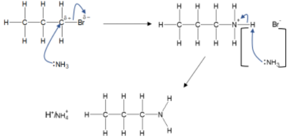
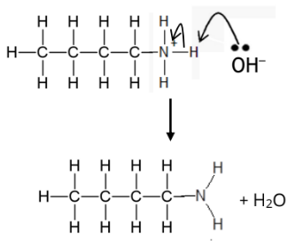
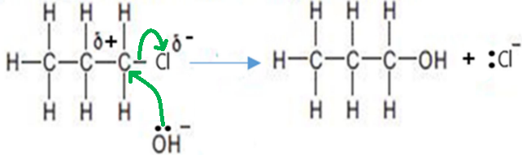
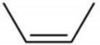
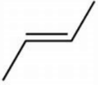
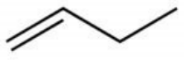
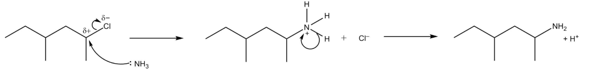
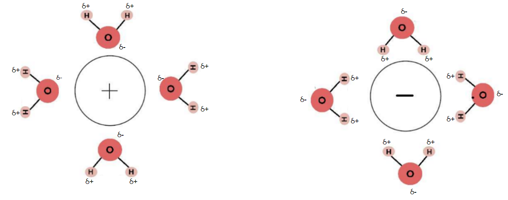
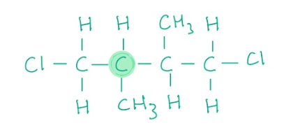

# Mark Schemes — Organic Chemistry: Halogenoalkanes
**2. Energetics, Group Chemistry, Halogenoalkanes & Alcohols** · Edexcel International A Level (IAL) Chemistry (YCH11)

## Q1 — medium — 9 marks · structured-questions

### 18((a)) — 1 marks
The reagent or reagents you would use to make 1-bromopropane from propan-1-ol are:

- 50% / concentrated
**AND**
Sulfuric acid
**AND**
Potassium bromide;** [1 mark]**

**[Total: 1 mark]**

- *As opposed to potassium bromide, you would also score the mark for:*

  - *Other named bromides Phosphorus and bromine Phosphorus(V) bromide / PBr**5** Phosphorus(III) bromide / PBr**3** Thionyl bromide / SOBr**2*
- *If you give the formula, as well as the name, then both must be correct to score the mark, if you are unsure, play it safe and just write the name*

### 18((b)) — 8 marks
i) The conditions for the formation of propene are:

- Ethanolic / alcoholic (solution); **[1 mark]**

ii) The **molecular **formula of product B is:

- C4H7N; **[1 mark]**

iii) The type and mechanism of the reaction taking place in reaction C is:

- Nucleophilic; **[1 mark]**
- Substitution; **[1 mark]**

iv) The mechanism for the reaction that occurs between ammonia and 1-bromopropane to form propylamine, CH3CH2CH2NH2 is:

- Dipole and arrow from C‒Br bond to Brδ‒ or just beyond; **[1 mark]**
- Arrow from ammonia to Cδ+
**AND**
1 or 2 correct curly arrows on intermediate (each from bond or lone pair to atom); **[1 mark]**
- Intermediate with charge; **[1 mark]**
- Ammonium / H+
**AND**
bromide ion
**OR**
HBr
**OR**
NH4Br; **[1 mark]**

**[Total: 8 marks]**

- *As you can see from this question, it is worth investing the time to learn the reactions of halogenoalkanes in detail *
- *For part i) you could also say ethanol  / alcohol*
- *For part ii) if you have incorrectly given the ammonia a negative charge, this is penalised once only*

## Q2 — medium — 10 marks · structured-questions

### 20((a)) — 2 marks
The type and mechanism of the reaction between ammonia and 1‐chlorobutane is:

- Nucleophilic; **[1 mark]**
- Substitution; **[1 mark]**

**[Total: 2 marks]**

- *When an ethanolic solution of excess ammonia is heated under pressure with 1-chlorobutane, butylamine is formed*
- *The chlorine is substituted by an amine group and ammonia acts as the nucleophile, which attacks the partial positive carbon atom of the polar C-Cl bond *

### 20((b)) — 5 marks
i) Two omissions in the student’s mechanism are:

- A lone pair on the **nitrogen** / N; **[1 mark]**
- Delta + / δ+ / partial positive (charge) on the **carbon **(attached to the chlorine); **[1 mark]**

ii) The next step of the mechanism to form butylamine is:

- Curly arrow from the lone pair on the oxygen going to the hydrogen; **[1 mark]**
- Curly arrow from the same N-H bond to N atom or +; **[1 mark]**
- Correct products; **[1 mark]**

**[Total: 5 marks]**

- *Mechanisms should always show any lone pairs and partial charges*
- *You could show the lone pair on the nitrogen atom and the partial positive charge on the carbon atoms for the marks in part (i)*
- *You would not be awarded the mark if you said that there was no lone pair on the ammonia, you must be specific about it being on the nitrogen atom*
- *Whilst you do not need to specify which carbon atom the partial positive charge is on, if you draw it on the diagram, it must be on the correct chlorine*
- *When drawing curly arrows in mechanisms, make sure that the arrow goes from either a lone pair or a bond and they show the movement of electron pairs*
- *Don't forget to give water as a product too - students sometimes forget to give this as they are concentrating on drawing butylamine*
- *Also, make sure to include the negative charge on OH**-**, you would not score the first mark if you missed this*

### 20((c)) — 3 marks
Comparing the rate of reaction of ammonia with 1‐chlorobutane and with 2‐bromo‐2‐methylpropane:

- The rate of reaction will be slower for 1-chlorobutane;** [1 mark]**
- C‒Cl has a higher bond enthalpy / greater bond strength (than C‒Br) / requires more energy to break;** [1 mark]**
- 1-chlorobutane is a primary / 1° halogenoalkane (rather than a tertiary / 3° halogenoalkane);** [1 mark]**

**[Total: 3 marks]**

- *You could give the reverse arguments of these answers for the 3 marks*
- *Don't make the mistake of referring to either species as primary or tertiary alcohols*
- *The second point is dependent on you gaining the first mark*
- *The final mark is independent*
- *The greater bond enthalpy in C-Cl is due to the larger difference in electronegativity between the carbon and chlorine atom, although you did not need to explain this for this question*

## Q3 — medium — 12 marks · structured-questions

### 20((a)) — 3 marks
i) In the experiment to compare the rates of hydrolysis you would measure:

- The time taken for the (first appearance of the) precipitate (of silver halide) to form;** [1 mark]**

ii) The halogenoalkane that would hydrolyse the fastest is:

- 1-iodopropane; **[1 mark]**
- (Because,) the C−I bond is the weakest / has the lowest bond enthalpy;** [1 mark]**

**[Total: 3 marks]**

- *A mixture of ethanol and acidified silver nitrate would be added to each halogenoalkane *
- *The silver nitrate reacts with the halogenoalkane to form a precipitate: *

  - *Silver chloride gives a white precipitate*
  - *Silver bromide gives a cream precipitate *
  - *Silver iodide gives a yellow precipitate *
- *The order of bond enthalpy starting with the strongest is*

  - *C-F > C-Cl > C-Br > C-I*
  - *The C-I bond, therefore, has the lowest bond enthalpy so is the easiest to break *
  - *The yellow precipitate would be formed first *

### 20((b)) — 2 marks
The mechanism for this hydrolysis is:

- Correct dipole on the C–Cl bond
**AND**
A curly arrow from the bond to Cl or just beyond; **[1 mark]**
- A curly arrow from the lone pair on the OH– ion to the δ+ carbon; **[1 mark]**

**[Total: 2 marks]**

- *Halogenoalkanes undergo nucleophilic substitution *

  - *The :OH**– **nucleophile attacks the carbon atom in the C–Cl bond due to it carrying a partial positive charge*
- *This mechanism is frequently asked*

  - *Make sure you learn how to draw it*
  - *Ensure your curly arrows are drawn in the correct place and the partial positive / negative charges are shown *
- *The mechanism above is actually known as an S**N**2 mechanism, which occurs when a primary halogenoalkane undergoes hydrolysis *

  - *This mechanism has only one step*
  
    - *You will cover this more on the A-level course *
  - *If in this instance, you have drawn the S**N**1 mechanism then you will score the first mark as above and marking point 2 is awarded for a curly arrow from lone pair on OH**–** ion to C**+** of the carbocation formed *

### 20((c)) — 4 marks
The trend in boiling temperature of these halogenoalkanes by comparing the intermolecular forces involved is:

- (The intermolecular forces are) London forces; **[1 mark]**
- Iodine atoms are more polarisable (than chlorine or bromine) **OR**
1-iodopropane has more electrons (than 1 chloropropane and 1-bromopropane); **[1 mark]**
- (Resulting in) stronger / more London Forces (so more energy required to overcome these forces); **[1 mark]**
- (Despite) 1-iodopropane having the weakest (permanent) dipole / (permanent) dipole forces; **[1 mark]**

**[Total: 4 marks]**

- *All three substances have London forces which get stronger going from 1-chloropropane to 1-bromopropane to 1-iodopropane due to the increased number of electrons *
- *The effect of the permanent dipole forces does not outweigh the increased strength of the London forces *
- *Had the question contained 1-fluoropropane, the hydrogen bonding within this substance would have needed considering as well *

### 20((d)) — 3 marks
The **skeletal **formulae of the three possible organic products, giving their names are:

| **Skeletal formula** | **Name** |
|---|---|
|  | Z-but-2-ene **OR** *cis*-but-2-ene |
|  | *E*-but-2-ene **OR** *trans*-but-2-ene |
|  | but-1-ene |

- All six correct; **[3 marks]**
- Four / five correct; **[2 marks]**
- Two / three correct; **[1 mark]**

**[Total: 3 marks]**

- *When 2-bromobutane is heated with ethanolic potassium hydroxide, the C-Br bond will break resulting in the formation of an alkene, butene *
- *When determining the isomers for an alkene, move the position of the double bond first*

  - *You can deduce that but-2-ene and but-1-ene are formed *
  - *But-2-ene can have the two highest priority groups, CH**3**,:*
  
    - *On opposite sides of the double bond to give the **E**-isomer*
    - *On the same side of the double bond to give the **Z**-isomer*

## Q4 — medium — 12 marks · structured-questions

### 20((a)) — 6 marks
i) The systematic name of compound **A** is:

- 4-methylhexan-2-ol; **[1 mark]**

ii) A suitable reagent for Step **1** is:

- PCl5 / phosphorus(V) chloride / phosphorus pentachloride; **[1 mark]**

iii) The mechanism for the reaction in Step **2** is:

- Arrow from lone pair on nitrogen atom in ammonia to carbon atom; **[1 mark]**
- Dipole shown and arrow from C–Cl bond to Cl or just beyond; **[1 mark]**
- Formula of intermediate including the + charge on the N atom **AND **Cl−; **[1 mark]**
- Arrow from N-H bond of the intermediate to N(+ and formulae of products); **[1 mark]**

**[Total: 6 marks]**

- *Alternative names for 4-methylhexan-2-ol that would gain a mark are:*

  - *4-methyl-2-hexanol*
  - *4-methylhexane-2-ol*
- *The addition of phosphorous(V) chloride to alcohol is used as a qualitative test for the presence of the -OH group as steamy fumes of HCl are produced*
- *Alternative reagents are: *

  - *Concentrated **hydrochloric acid *
  - *Thionyl chloride / SOCl**2*
  - *PCl**3** / phosphorus(III) chloride / phosphorus trichloride*
  - *Conc. H**2**SO**4** and KCl*
- *The reaction in part (iii) is an example of a nucleophilic substitution reaction and you should be able to draw a mechanism for this*
- *Ammonia acts as the nucleophile and chlorine is substituted by NH**2** forming a primary amine*
- *Ensure that the curly arrows start from either a bond or a lone pair of electrons*
- *Remember: **Show the positive charge on the carbocation intermediate and don't forget to include H**+** as a product in the last step*

### 20((b)) — 6 marks
i) The type of bonding that occurs between the nitrogen atom and the hydrogen ion, when the positive ion forms is:

- (The bond formed is a) dative (covalent) / coordinate bond; **[1 mark]**
- As the (lone) pair of electrons on the nitrogen (atom); **[1 mark]**
- (Form the bond) as hydrogen (ion) has an empty orbital / no electrons 
**OR**
The lone pair of electrons can be donated to / shared with the hydrogen (ion); **[1 mark]**

ii) The completed diagrams to show how the ions formed in the reaction between DMAA and hydrochloric acid interact with water molecules are:

- Dipole on at least one of the water molecules; **[1 mark]**
- DMAA ion is attracted to slightly negative oxygen atoms (in water); **[1 mark]**
- Chloride ion is attracted to slightly positive hydrogen atoms (in water); **[1 mark]**

**[Total: 6 marks]**

- *The nitrogen atom in DMMA has three bonds, 1 bond to a carbon atom and 2 bonds to hydrogen atoms, therefore it also has a lone pair of electrons not involved in bonding*
- *These electrons are donated to a hydrogen ion, which is electron deficient, forming a dative covalent bond*
- *When drawing the diagrams to show how the ions interact with water molecules, you don't need to show all of the dipoles*
- *You must draw at least 2 water molecules surrounding each ion*
- *You do not need to show any lone pairs on oxygen atoms*
- *For the final mark, you would still obtain the mark if you only showed 1 hydrogen atom attracted to the negative ion*
- *If you drew the diagrams correctly but without the dipoles, you would score 2 marks*

## Q5 — easy — 1 marks · multiple-choice-questions

### 11() — 1 marks
**Correct answer: C** — 

**Final answer:** **The correct answer is ****C**** because:**

- The structure of C is:

- A primary halogenoalkane arises when a halogen is attached to a carbon that is itself attached to **one** other alkyl group as shown above

**A** is incorrect as this is a secondary haloalkane

**B** is incorrect as this is a tertiary haloalkane

**D** is incorrect as  this is a secondary haloalkane

## Q6 — easy — 1 marks · multiple-choice-questions

### 1() — 1 marks
**Correct answer: D** — Nucleophilic substitution

**Final answer:** **The correct answer is D**

- The C–Br bond is polar, Br is more electronegative than C, giving the carbon a δ+ charge
- OH– has lone pairs of electrons and acts as a nucleophile (electron-pair donor), attacking the δ+ carbon
- OH– replaces Br– on the carbon: this is nucleophilic substitution

**A** is incorrect as electrophilic addition requires an electron-rich C=C double bond (e.g. an alkene) reacting with an electrophile, 1-bromobutane has no C=C

**B** is incorrect as electrophilic substitution typically applies to aromatic compounds, no aromatic ring is present here

**C** is incorrect as nucleophilic addition applies to polar π-bonds such as C=O in carbonyls (e.g. HCN + propanone), 1-bromobutane has only σ bonds

> **[exam-tip]**
> Always classify organic reactions using two words: the type (addition / substitution / elimination) AND the attacking species (electrophilic / nucleophilic / free radical).
> 
> For halogenoalkanes with KOH, the **solvent** decides the outcome:
> 
> - aqueous KOH → nucleophilic **substitution** (gives an alcohol)
> - ethanolic KOH → **elimination** (gives an alkene)

## Q7 — medium — 2 marks · multiple-choice-questions

### 9((a)) — 1 marks
**Correct answer: A** — CH3CHICH3

**Final answer:** **The correct answer is ****A**** because:**

- The strength of the C-X bond where X is the halide, from strongest to weakest is:

  - C-F > C-Cl > C-Br > C-I
  - The C-I bond is the weakest so less energy is required to break it and CH3CHICH3 will therefore react the fastest
  - A yellow precipitate would be seen first

**B**, **C** and **D** are incorrect as the carbon-halogen bond is stronger than C-I

### 9((b)) — 1 marks
**Correct answer: B** — CH3CH2CBr(CH3)CH3

**Final answer:** **The correct answer is ****B ****because:**

- CH3CH2CBr(CH3)CH3 is a tertiary halogenoalkane

  - The carbon atom bonded to the Br is bonded to three other alkyl groups
  - Tertiary alkanes react faster than secondary halogenoalkanes which in turn react faster than primary halogenoalkanes

**A** is incorrect as   secondary halogenoalkanes take longer to hydrolyse than tertiary

**C** and **D** are incorrrect as primary halogenoalkanes take longer to hydrolyse than tertiary

## Q8 — medium — 1 marks · multiple-choice-questions

### 1() — 1 marks
**Correct answer: C** — NaOH in water, heat under reflux

**Final answer:** **The correct answer is C**

- Hydrolysis of a halogenoalkane to form an alcohol requires aqueous hydroxide
- OH– acts as a nucleophile, replacing the halide:

CH3CH2CH2Br + OH– → CH3CH2CH2OH + Br–

- The solvent (water) is the key.
- Aqueous conditions favour substitution

**A** is incorrect as using KCN is a different synthetic route used to lengthen chains, not to make alcohols. It creates a nitrile (CH3CH2CH2CN), extending the carbon chain by one

**B** is incorrect as using KOH in ethanol favours elimination. The OH– acts as a base, removing an H+ from a carbon adjacent to the C–Br. This forms propene, which is not an alcohol

**D** is incorrect as using NH3 gives a primary amine (CH3CH2CH2NH2), not an alcohol. Further substitution can also give secondary/tertiary amines

> **[exam-tip]**
> The aqueous-vs-ethanolic switch is the most common mistake on paper 2. The January 2022 examiner report flagged this, saying that on a reagent-identification MCQ, fewer than 55% of candidates got it right.
> 
> Memorise the two conditions carefully. The only thing that changes is the solvent, but the product type flips:
> 
> 1. Aqueous KOH / NaOH
> 
>   - OH– acts as a nucleophile
>   - This favours substitution, forming an alcohol
> 2. Ethanolic KOH / NaOH
> 
>   - OH– acts as a base
>   - This favours elimination, forming an alkene
> 
> Same reagent, same cation, same temperature, same reflux. Only the solvent differs.
