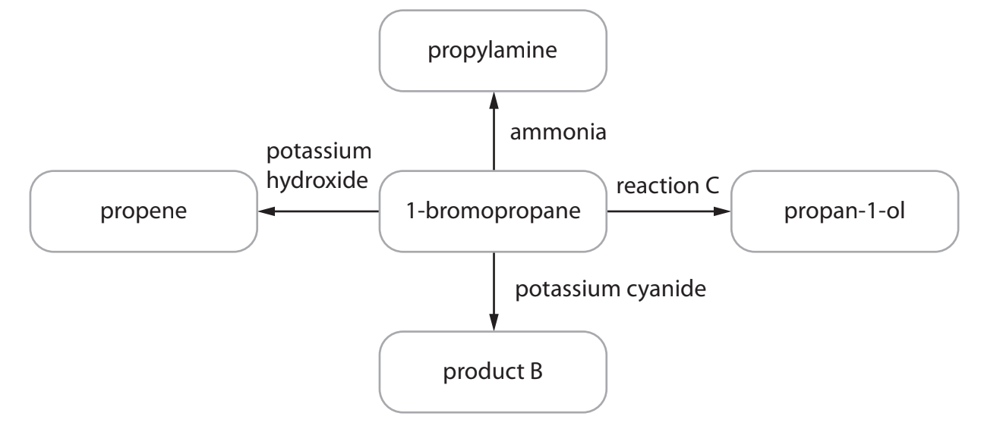
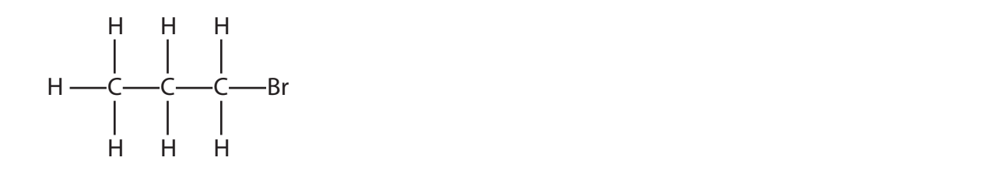
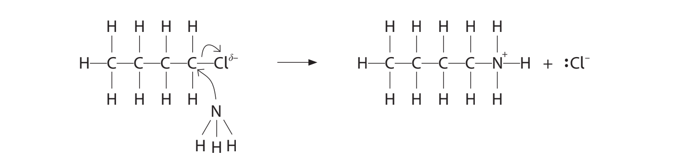
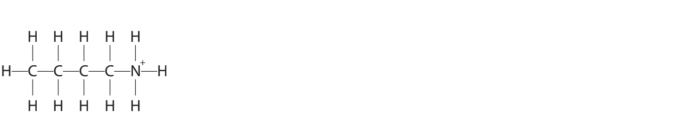
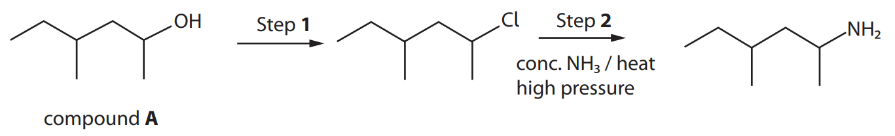
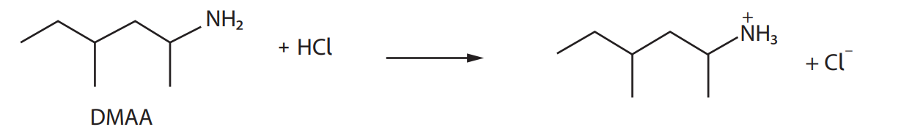
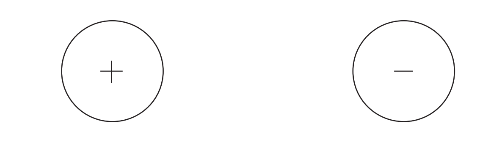
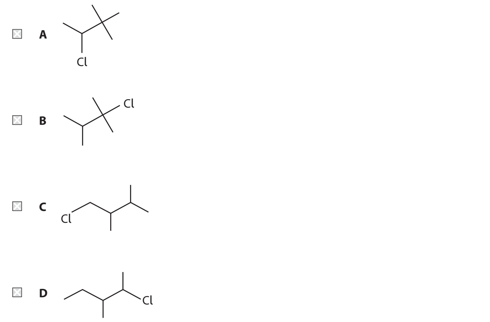

# Exam Questions — Organic Chemistry: Halogenoalkanes
**2. Energetics, Group Chemistry, Halogenoalkanes & Alcohols** · Edexcel International A Level (IAL) Chemistry (YCH11)
> Source: [https://www.savemyexams.com/international-a-level/chemistry/edexcel/17/topic-questions/2-energetics-group-chemistry-halogenoalkanes-and-alcohols/2-8-organic-chemistry-halogenoalkanes/structured-questions/](https://www.savemyexams.com/international-a-level/chemistry/edexcel/17/topic-questions/2-energetics-group-chemistry-halogenoalkanes-and-alcohols/2-8-organic-chemistry-halogenoalkanes/structured-questions/) · 8 questions · total 48 marks

## Q1 — medium — 9 marks · structured-questions

### 18((a)) — 1 mark — command: identify — structured — from paper June 2021 · WCH12/01
1-bromopropane is used for spot removal when ‘dry cleaning’ clothes.

1-bromopropane does not occur naturally but can be made from propan-1-ol. 
Identify the reagent or reagents you would use to make 1-bromopropane from propan-1-ol.

### 18((b)) — 8 marks — command: multiple — structured — from paper June 2021 · WCH12/01
Some reactions of 1-bromopropane are shown.

i) Give the conditions for the formation of propene.

**(1)**

ii) Give the **molecular **formula of product B.

**(1)**

iii) Name the type and mechanism of the reaction taking place in reaction C.

**(2)**

iv) Complete the mechanism for the reaction that occurs between ammonia and 1-bromopropane to form propylamine, CH3CH2CH2NH2 . 
Include curly arrows, and relevant lone pairs and dipoles.

**(4)**

## Q2 — medium — 10 marks · structured-questions

### 20((a)) — 2 marks — command: state — structured — from paper Jan 2022 · WCH12/01
Ammonia reacts with 1‐chlorobutane.

State the type and mechanism of this reaction.

### 20((b)) — 5 marks — command: multiple — structured — from paper Jan 2022 · WCH12/01
A student drew the first step of the mechanism for the reaction.

i) Identify **two **omissions in the student’s mechanism.

**(2)**

ii) To obtain butylamine, sodium hydroxide solution is added. Complete the next step of the mechanism to form butylamine, showing curly arrows, relevant lone pairs and the reaction products.

**(3)**

### 20((c)) — 3 marks — command: justify — structured — from paper Jan 2022 · WCH12/01
The reactions of ammonia and of hydroxide ions with halogenoalkanes are similar.

Compare the rate of reaction of ammonia with 1‐chlorobutane and with 2‐bromo‐2‐methylpropane. 
Justify your answer.

## Q3 — medium — 12 marks · structured-questions

### 20((a)) — 3 marks — command: multiple — structured — from paper Oct 2021 · WCH12/01
This question is about halogenoalkanes.

The rates of hydrolysis of 1-chloropropane, 1-bromopropane and 1-iodopropane in reactions with aqueous silver nitrate solution were compared.

i) State what would be measured in the experiment to compare the rates of hydrolysis.

**(1)**

ii) State which of these halogenoalkanes would hydrolyse the fastest. Justify your answer.

**(2)**

### 20((b)) — 2 marks — command: give — structured — from paper Oct 2021 · WCH12/01
The equation for the hydrolysis of 1-chloropropane by aqueous hydroxide ions is shown.

CH3CH2CH2Cl + OH− → CH3CH2CH2OH + Cl−

Give the mechanism for this hydrolysis. Include curly arrows, and relevant dipoles and lone pairs.

### 20((c)) — 4 marks — command: explain — structured — from paper Oct 2021 · WCH12/01
The boiling temperatures of some halogenoalkanes are shown.

| **Halogenoalkane** | **Boiling temperature / °C** |
|---|---|
| 1-chloropropane | 47 |
| 1-bromopropane | 71 |
| 1-iodopropane | 103 |

Explain the trend in boiling temperature of these halogenoalkanes by comparing the intermolecular forces involved.

Detailed explanations of the forces involved are not required.

### 20((d)) — 3 marks — command: draw — structured — from paper Oct 2021 · WCH12/01
In another experiment, 2-bromobutane is heated with ethanolic potassium hydroxide and an elimination reaction occurs.

Draw the **skeletal **formulae of the three possible organic products, giving their names.

| **Skeletal formula** | **Name** |
|---|---|
|   |   |
|   |   |
|   |   |

## Q4 — medium — 12 marks · structured-questions

### 20((a)) — 6 marks — command: multiple — structured — from paper Jan 2021 · WCH12/01
The compound DMAA was originally synthesised as a decongestant.

A suggested synthetic route for DMAA is shown.

i) Give the systematic name of compound **A**.

**(1)**

ii) Identify, by name or formula, a suitable reagent for Step **1**.

**(1)**

iii) Give the mechanism for the reaction in Step **2**.

Include curly arrows, and any relevant dipoles and lone pairs.

**(4)**

### 20((b)) — 6 marks — command: multiple — structured — from paper Jan 2021 · WCH12/01
DMAA is only slightly soluble in water but dissolves readily in hydrochloric acid to form an aqueous solution.

i) Explain the type of bonding that occurs between the nitrogen atom and the hydrogen ion, when the positive ion forms.

**(3)**

ii) Complete the diagrams to show how the ions formed in the reaction between DMAA and hydrochloric acid interact with water molecules.

**(3)**

## Q5 — easy — 1 marks · multiple-choice-questions

### 11() — 1 mark — multiple_choice — from paper June 2021 · WCH12/01
Which structure represents a primary halogenoalkane?

- **A.** 
- **B.** 
- **C.** 
- **D.** 

## Q6 — easy — 1 marks · multiple-choice-questions

### 1() — 1 mark — multiple_choice
1-bromobutane reacts with aqueous potassium hydroxide to form butan-1-ol.

Which type of mechanism describes this reaction?
- **A.** Electrophilic addition
- **B.** Electrophilic substitution
- **C.** Nucleophilic addition
- **D.** Nucleophilic substitution

## Q7 — medium — 2 marks · multiple-choice-questions

### 9((a)) — 1 mark — multiple_choice — from paper June 2021 · WCH12/01
Separate samples of some halogenoalkanes were dissolved in ethanol and a few drops of silver nitrate solution added. The faster the reaction of the halogenoalkane, the quicker a precipitate forms.

Which of these halogenoalkanes reacts the **fastest?**
- **A.** CH3CHICH3
- **B.** CH3CHBrCH3
- **C.** CH3CHClCH3
- **D.** CH3CHFCH3

### 9((b)) — 1 mark — multiple_choice — from paper June 2021 · WCH12/01
Which of these halogenoalkanes reacts the **fastest?**
- **A.** CH3CHBrCH(CH3)CH3
- **B.** CH3CH2CBr(CH3)CH3
- **C.** CH3CH(CH2Br)CH2CH3
- **D.** CH3CH2CH2CH2CH2Br

## Q8 — medium — 1 marks · multiple-choice-questions

### 1() — 1 mark — multiple_choice
Which reagent and conditions convert 1-bromopropane to propan-1-ol?
- **A.** KCN in ethanol, heat under reflux
- **B.** KOH in ethanol, heat under reflux
- **C.** NaOH in water, heat under reflux
- **D.** NH3 in ethanol, heat under reflux in a sealed tube
