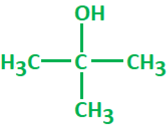
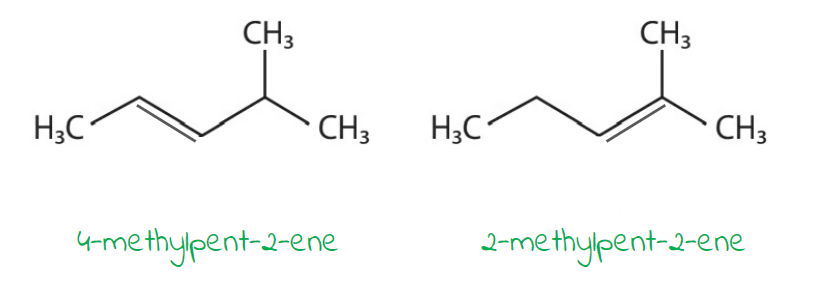

# Mark Schemes — Organic Chemistry: Alcohols
**2. Energetics, Group Chemistry, Halogenoalkanes & Alcohols** · Edexcel International A Level (IAL) Chemistry (YCH11)

## Q1 — medium — 10 marks · structured-questions

### 1() — 3 marks
The mechanism for the reaction of 1-bromobutane with aqueous sodium hydroxide solution under reflux is:

**[3 marks]**

> **[mark-scheme]**
> 1 mark for correct δ+ on the C and δ– on the Br **AND **curly arrow from the C–Br bond to the Br atom (or just beyond)
> 
> 1 mark for the lone pair shown on the :OH− ion **AND **curly arrow from the lone pair to the *δ*+ carbon atom
> 
> 1 mark for the correct final organic product (butan-1-ol) AND the bromide ion (Br−)
> 
> The curly arrows must originate from the middle of the C-Br bond and the lone pair or negative charge of the hydroxide ion
> 
> The leaving group must be shown as Br-. Br2, HBr and NaBr are not accepted.
> 
> Structural or skeletal formula for the butan-1-ol product are accepted.
> 
> Solid lines or double-headed arrows are not accepted.
> 
> A carbocation intermediate is not accepted.

> **[exam-tip]**
> Two curly-arrow rules decide most mechanism marks:
> 
> 1. The arrow from the hydroxide must start from a lone pair on the O (shown explicitly as two dots), not from the O atom symbol. This is a very common mark-losing error.
> 2. The arrow from the C–Br bond must start from the middle of the bond line, not from the C or Br atom.
> 
> Primary halogenoalkanes like 1-bromobutane react by a one-step mechanism, so do not draw a carbocation intermediate. The final products must be butan-1-ol + Br- (not HBr or NaBr).

### 2() — 2 marks
> **[mark-scheme]**
> Why 1-iodobutane reacts faster than 1-bromobutane with aqueous NaOH:
> 
> - The C–I bond is weaker than the C–Br bond / C–I has a lower bond enthalpy than C–Br **[1 mark]**
> - Therefore less energy is required to break the carbon-halogen bond (so the reaction is faster) **[1 mark]**
> 
> Reference to bond enthalpy values (C–I ≈ 238 kJ mol-1; C–Br ≈ 276 kJ mol-1) is accepted for the first mark.
> 
> Answers stating "iodine is more reactive" or "iodine is more electronegative" are not accepted.
> 
> Both marks require an explicit link between bond strength and reaction rate.

> **[exam-tip]**
> The reactivity trend down Group 7 halogenoalkanes: **C–I reacts fastest; C–F reacts slowest**. This is controlled by **bond enthalpy**, not by electronegativity or halide-ion stability.
> 
> Two recurring errors to avoid:
> 
> 1. Claiming "iodine is more electronegative" (electronegativity trend is F > Cl > Br > I, so iodine is the least electronegative)
> 2. Claiming "I- is more stable as a leaving group" (true, but not the expected reasoning here)
> 
> Stick to the bond enthalpy argument:
> 
> - Weaker C–X bond
> - → lower activation energy (*E*a)
> - → faster hydrolysis

### 3() — 3 marks
> **[mark-scheme]**
> i) The colour change is:
> 
> - Orange → green
> **OR**
> From orange to green **[1 mark]**
> 
> Both colours in the correct order are required for the mark
> 
> "Yellow" is not accepted as the starting colour.

ii) The balanced equation is:

CH3CH(OH)CH2CH3 + [O] → CH3COCH2CH3 + H2O

**[2 marks]**

> **[mark-scheme]**
> 1 mark for correct reactants and products: CH3CH(OH)CH2CH3 + [O] → CH3COCH2CH3 + H2O.
> 
> 1 mark for the equation being balanced, with only one [O].
> 
> 2[O] on the reactants side of the equation and/or H2 as a product are not accepted.

> **[exam-tip]**
> Three common errors to avoid:
> 
> 1. Writing H2 as the by-product (it must be H2O)
> 2. Stating "yellow" as the starting colour (K2Cr2O7 is orange, not yellow)
> 3. Forgetting to include [O] in the equation
> 
> The oxidation hierarchy:
> 
> - Primary alcohols oxidise to aldehyde then carboxylic acid
> - Secondary alcohols (like butan-2-ol) oxidise to a ketone and stop there
> - Tertiary alcohols do not oxidise

### 4() — 2 marks
> **[mark-scheme]**
> Tertiary alcohols are not oxidised by acidified potassium dichromate(VI) because:
> 
> - There is no hydrogen atom attached to the central carbon atom (bonded to the –OH group) / The C–OH carbon is bonded to three carbons and no hydrogens
> **OR**
> There are no C–H bonds on the carbon with the hydroxyl group **[1 mark]**
> - Oxidation would require the breaking of a strong C–C bond
> **OR**
> No C–H bond on that carbon can be broken to form C=O
> **OR**
> There is no H on the hydroxyl C that can be removed, so no C=O can form **[1 mark]**
> 
> Vague answers like "too stable" or "no reaction" without a mechanism-level explanation are not accepted.

> **[exam-tip]**
> For this style of question, you must give a mechanism-level reason. Answers like "the tertiary alcohol is too stable" or "there is no reaction" do not score.
> 
> Always point to the specific structural feature (no H on the C–OH carbon) and then explain why that blocks oxidation (a C–H bond is needed to form the new C=O).
> 
> The oxidation hierarchy:
> 
> - Primary alcohols oxidise to aldehyde
> - → then to carboxylic acid (with excess oxidant)
> - Secondary alcohols oxidise to a ketone and stop
> - Tertiary alcohols do not oxidise

## Q2 — easy — 1 marks · multiple-choice-questions

### 3() — 1 marks
**Correct answer: A** — 2-methylpropan-2-ol

**Final answer:** **The correct answer is ****A ****because:**

- Remember: Primary alcohols have one alkyl chain attached to the C-OH carbon, secondary alcohols have two alkyl chains attached and tertiary alcohols have three alkyl chains attached
- The structure of 2-methylpropan-2-ol is:

- 2-methylpropan-2-ol has three alkyl groups attached to the C-OH carbon atom

**B** is incorrect as  it is a secondary alcohol

**C **is incorrect as  it is a primary alcohol

**D** is incorrect as  it is a secondary alcohol

## Q3 — easy — 1 marks · multiple-choice-questions

### 10() — 1 marks
**Correct answer: C** — concentrated phosphoric acid

**Final answer:** **The correct answer is ****C**** because:**

- Alcohols can be dehydrated to alkenes by heating with concentrated phosphoric acid

**A** is incorrect as this would oxidise the alcohol

**B** is incorrect as this is a drying agent

**D** is incorrect as produces an alkene from a halogenoalkane

## Q4 — easy — 1 marks · multiple-choice-questions

### 1() — 1 marks
**Correct answer: B** — A carboxylic acid

**Final answer:** **The correct answer is B**

- Primary alcohols are oxidised in two sequential stages:

- Stage 1: RCH2OH → RCHO (alcohol to aldehyde)
- Stage 2: RCHO → RCOOH (aldehyde to carboxylic acid)
- **Reflux** keeps both product and unreacted oxidiser in the flask long enough for BOTH oxidations to occur

- So, a **carboxylic acid** is the final product
- Observation: acidified K2Cr2O7 is **orange** and turns **green** (Cr3+) as it is reduced

**A** is incorrect as an aldehyde is the product only under **distillation** (limited oxidising agent + immediate removal of product); reflux goes further

**C** is incorrect as esters form from the condensation reaction between a carboxylic acid and an alcohol (esterification), not from oxidation of an alcohol

**D** is incorrect as ketones form by oxidation of **secondary** alcohols, not primary

> **[exam-tip]**
> Distillation vs reflux is the key thing to get right for primary alcohol oxidation:
> 
> - **Limited oxidising agent + distillation** → aldehyde (the product is removed as it forms, preventing further oxidation)
> - **Excess oxidising agent + reflux** → carboxylic acid (the product stays in the flask and gets oxidised a second time)
> 
> State the colour change as **orange → green**. Writing "yellow → green" will lose the mark.
> 
> In mark-scheme equations, the oxidising agent is written as **[O]**; a common error is writing H2 as the by-product instead of H2O.
> 
> Tertiary alcohols are inert to this oxidation. The reason to give is that the C–OH carbon has **no hydrogen** attached, so no C–H bond can be broken to form a C=O.

## Q5 — medium — 1 marks · multiple-choice-questions

### 2() — 1 marks
**Correct answer: D** — CH3COCH3

**Final answer:** **The correct answer is ****D**** because:**

- Potassium dichromate(VI) is an oxidising agent, which can be used to oxidise:

  - Primary alcohols to aldehydes
  - Secondary alcohols to ketones
  - Aldehydes to carboxylic acids (under reflux)
- CH3COCH3 is the ketone, propanone, formed from the oxidation of propan-2-ol
- The ketone cannot undergo further oxidation so will not react with the potassium dichromate(VI)

**A **is incorrect as  it is a primary alcohol so will react to form an aldehyde

**B** is incorrect as  it is a secondary alcohol so will react to form a ketone

**C** is incorrect as  it is an aldehyde so will react to form a carboxylic acid

## Q6 — medium — 2 marks · multiple-choice-questions

### 7((a)) — 1 marks
**Correct answer: A** — addition

**Final answer:** **The correct answer is ****A**** because:**

- This diagram shows the formation of a saturated compound, an alkane from an unsaturated alkene
- For this to occur, hydrogen must be added across the double bond and as shown, only one product is formed
- This is known as an addition reaction

**B **is incorrect as  oxidation involves the addition of oxygen, loss of hydrogen or loss of electrons

**C** is incorrect as  polymerisation involves the addition of monomers to form a long chain polymer

**D** is incorrect as substitution involves replacing one atom / group of atoms with another atom / group of atoms

### 7((b)) — 1 marks
**Correct answer: B** — oxidation

**Final answer:** **The correct answer is ****B**** because:**

- The reaction shows propan-2-ol, a secondary alcohol, being oxidised to form propanone
- In this instance, oxidation is the loss of hydrogen, which has been lost from the -OH group

**A **is incorrect as it is not an addition reaction

**C** is incorrect as  it is not a reduction reaction

**D** is incorrect as  it is not a substitution reaction

## Q7 — medium — 2 marks · multiple-choice-questions

### 14((a)) — 1 marks
**Correct answer: B** — elimination

**Final answer:** **The correct answer is ****B**** because:**

- When an alcohol is heated with concentrated phosphoric acid, the OH group and hydrogen of adjacent carbons are removed, forming a C=C bond:

  - CH3CH2OH → CH2=CH2 + H2O
- This is a dehydration reaction, which is a type of elimination reaction

**A** is incorrect as  alcohols do not have a double bond

**C** is incorrect as water is a product not a reactant

**D** is incorrect as C=C double bonds do not form via substitution reactions

### 14((b)) — 1 marks
**Correct answer: C** — three

**Final answer:** **The correct answer is ****C**** because:**

- The C=C double bond can be formed in two different positions:

- 4-methylpent-2-ene has and E and a Z isomer as each C atom of the C=C double bond is attached to two different groups
- 2-methylpent-2-ene just has 1 isomer as one of the carbons in the C=C bond is attached to two methyl groups
- This gives 3 isomers altogether

**A** is incorrect as  the OH group is not terminal or in a symmetrical alcohol

**B** is incorrect as 4-methylpent-2-ene has E/Z isomers

**D** is incorrect as  2-methylpent-2-ene does not have E/Z isomers

## Q8 — medium — 1 marks · multiple-choice-questions

### 17() — 1 marks
**Correct answer: B** — 8.4 dm3

**Final answer:** **The correct answer is ****B**** because:**

- The complete combustion of C3H8O3  will produce carbon dioxide and water:

  - C3H8O3 + 3½O2 → 3CO2 + 4H2O
- The number of moles of C3H8O3 = 9.2 ÷ 92 = 0.1 moles
- 0.1 moles of C3H8O3 requires 3½ x 0.1 = 0.35 moles of oxygen
- Volume of oxygen = 0.35 x 24 = 8.4 dm3

**A** is incorrect as the number of oxygen atoms in the compound has been doubled

**C** is incorrect as the oxygen atoms in the compound have been omitted from the calculation

**D** is incorrect as  the oxygen atoms in the compound have been omitted from the calculation and one oxygen molecule has been allowed for the combustion of each pair of hydrogen atoms

## Q9 — medium — 1 marks · multiple-choice-questions

### 17() — 1 marks
**Correct answer: D** — 83.3 g

**Final answer:** **The correct answer is ****D**** because:**

- The number of moles in 37.0 g propanoic acid = mass ÷ *M*r

  - = 37.0 ÷ 74 = 0.5 mol
- The theoretical yield can be found by rearranging the formula:

  - Percentage yield = $\frac{\mathrm{actual} \mathrm{yield}}{\mathrm{theoretical} \mathrm{yield}}\times100$
  - Theoretical yield = $\frac{\mathrm{actual} \mathrm{yield}}{\mathrm{percentage} \mathrm{yield}}\times100=\frac{0.5}{36}\times100=1.38\mathrm{mol}$
- 1 mol of propan-1-ol produces 1 mol of propanoic acid, so 1.38 mol of propan-1-ol were required
- mass = moles x *M*r = 1.38 x 60 = 83.3 g

**A** is incorrect as the scaling of the reacting amount to take into account the yield of 36% is incorrect (36/100)

**B** is incorrect as  the reacting amount has not been scaled to take into account the yield of 36%

**C** is incorrect as the scaling of the reacting amount to take into account the yield of 36% in incorrect (136/100)
