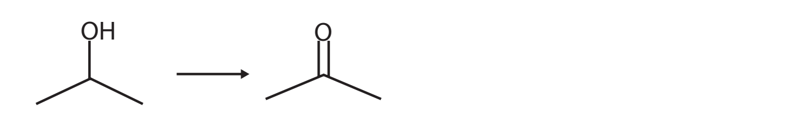

# Exam Questions — Organic Chemistry: Alcohols
**2. Energetics, Group Chemistry, Halogenoalkanes & Alcohols** · Edexcel International A Level (IAL) Chemistry (YCH11)
> Source: [https://www.savemyexams.com/international-a-level/chemistry/edexcel/17/topic-questions/2-energetics-group-chemistry-halogenoalkanes-and-alcohols/2-9-organic-chemistry-alcohols/structured-questions/](https://www.savemyexams.com/international-a-level/chemistry/edexcel/17/topic-questions/2-energetics-group-chemistry-halogenoalkanes-and-alcohols/2-9-organic-chemistry-alcohols/structured-questions/) · 9 questions · total 20 marks

## Q1 — medium — 10 marks · structured-questions

### 1() — 3 marks — command: draw — structured
This question is about the reactions of halogenoalkanes and alcohols.

1-Bromobutane (CH3CH2CH2CH2Br) reacts with aqueous sodium hydroxide solution under reflux to form butan-1-ol.

Draw the mechanism for this reaction. Your diagram must clearly show:

- the partial charges (δ+ and δ–) on the C–Br bond
- the lone pair on the hydroxide ion
- all curly arrows (each representing the movement of a pair of electrons)
- the final organic product.

### 2() — 2 marks — command: explain — structured
When 1-iodobutane and 1-bromobutane are separately heated under reflux with aqueous sodium hydroxide, 1-iodobutane reacts **more quickly** than 1-bromobutane.

Explain this observation.

### 3() — 3 marks — command: multiple — structured
Butan-2-ol (CH3CH(OH)CH2CH3) is heated under reflux with acidified potassium dichromate(VI) solution.

i) State the colour change observed.

[1]

ii) Write a balanced equation for the reaction, using [O] to represent the oxidising agent.

[2]

### 4() — 2 marks — command: explain — structured
2-Methylpropan-2-ol is a tertiary alcohol.

Explain why tertiary alcohols are NOT oxidised by acidified potassium dichromate(VI).

## Q2 — easy — 1 marks · multiple-choice-questions

### 3() — 1 mark — multiple_choice — from paper Oct 2021 · WCH12/01
Which of these compounds is a tertiary alcohol?
- **A.** 2-methylpropan-2-ol
- **B.** 3-methylbutan-2-ol
- **C.** 2,2-dimethylpropan-1-ol
- **D.** 3,3-dimethylbutan-2-ol

## Q3 — easy — 1 marks · multiple-choice-questions

### 10() — 1 mark — multiple_choice — from paper Jan 2022 · WCH12/01
Which reagent would convert an alcohol into an alkene?
- **A.** acidified potassium dichromate(VI)
- **B.** anhydrous calcium sulfate
- **C.** concentrated phosphoric acid
- **D.** ethanolic potassium hydroxide

## Q4 — easy — 1 marks · multiple-choice-questions

### 1() — 1 mark — multiple_choice
A primary alcohol is heated under reflux with acidified potassium dichromate(VI).

What is the organic product?
- **A.** An aldehyde
- **B.** A carboxylic acid
- **C.** An ester
- **D.** A ketone

## Q5 — medium — 1 marks · multiple-choice-questions

### 2() — 1 mark — multiple_choice — from paper Oct 2021 · WCH12/01
Which of these compounds does **not** react with acidified potassium dichromate(VI)?
- **A.** CH3CH2OH
- **B.** CH3CHOHCH3
- **C.** CH3CH2CHO
- **D.** CH3COCH3

## Q6 — medium — 2 marks · multiple-choice-questions

### 7((a)) — 1 mark — multiple_choice — from paper Oct 2021 · WCH12/01
Organic reactions can be classified in different ways.

How should the reaction shown be classified?

- **A.** addition
- **B.** oxidation
- **C.** polymerisation
- **D.** substitution

### 7((b)) — 1 mark — multiple_choice — from paper Oct 2021 · WCH12/01
How should the reaction shown be classified?

- **A.** addition
- **B.** oxidation
- **C.** reduction
- **D.** substitution

## Q7 — medium — 2 marks · multiple-choice-questions

### 14((a)) — 1 mark — multiple_choice — from paper Jan 2021 · WCH12/01
Some alcohols react with concentrated phosphoric(V) acid, H3PO4 , to form alkenes.

What type of reaction occurs?
- **A.** addition
- **B.** elimination
- **C.** hydrolysis
- **D.** substitution

### 14((b)) — 1 mark — multiple_choice — from paper Jan 2021 · WCH12/01
The structure of 2-methylpentan-3-ol is shown.

This alcohol reacts with concentrated phosphoric(V) acid. 
How many different alkenes can form?
- **A.** one
- **B.** two
- **C.** three
- **D.** four

## Q8 — medium — 1 marks · multiple-choice-questions

### 17() — 1 mark — multiple_choice — from paper June 2021 · WCH15/01
What is the minimum volume of oxygen gas, measured at room temperature and pressure, required for the complete combustion of 9.2 g of C3H8O3 (Mr = 92)?

[Molar volume of gas at room temperature and pressure = 24.0 dm3 mol−1]
- **A.** 4.8 dm3
- **B.** 8.4 dm3
- **C.** 12.0 dm3
- **D.** 16.8 dm3

## Q9 — medium — 1 marks · multiple-choice-questions

### 17() — 1 mark — multiple_choice — from paper Jan 2021 · WCH12/01
The oxidation of propan-1-ol by acidified potassium dichromate(VI) forms propanoic acid with a yield of 36% by mass.

What mass of propan-1-ol is needed to form 37.0 g of propanoic acid in this reaction?

[*M*r of propanoic acid = 74     *M*r of propan-1-ol = 60]
- **A.** 10.8 g
- **B.** 36.0 g
- **C.** 40.8 g
- **D.** 83.3 g
