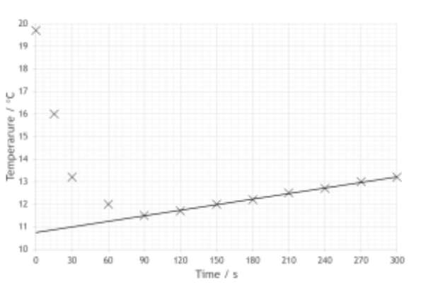
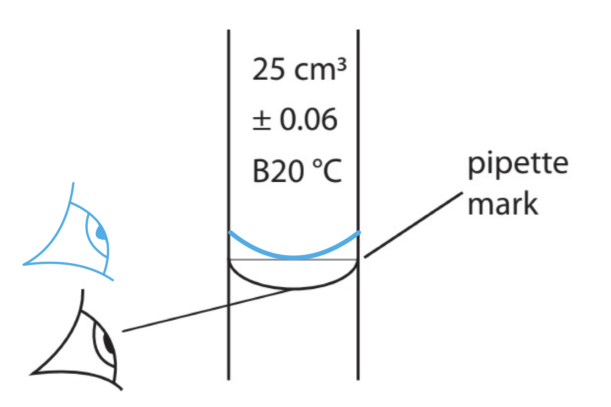
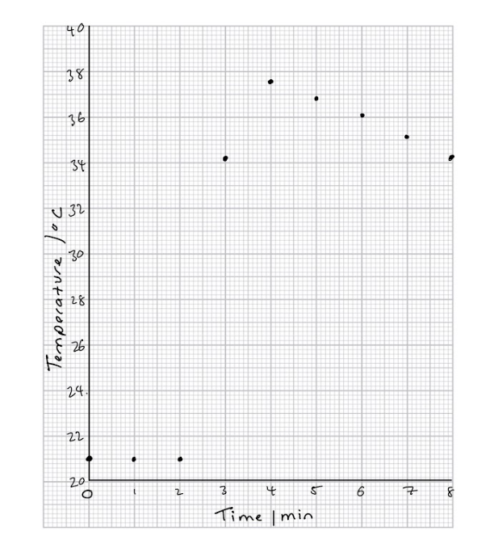
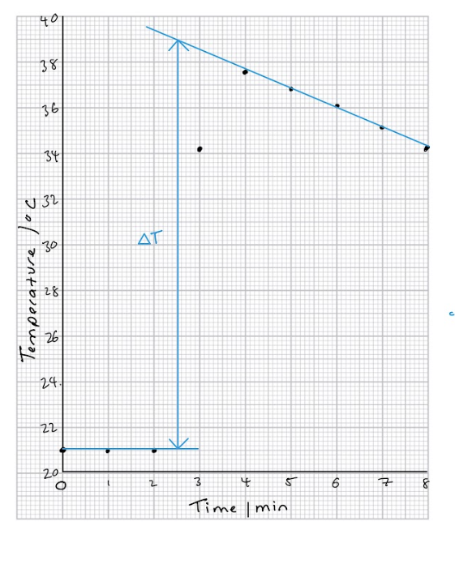
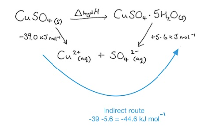
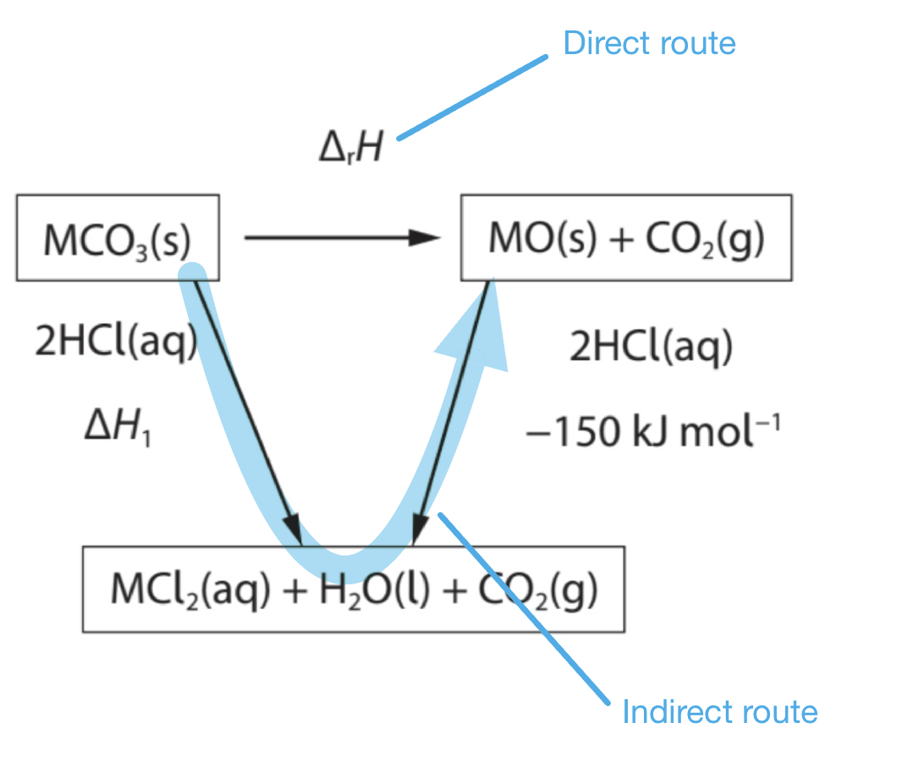
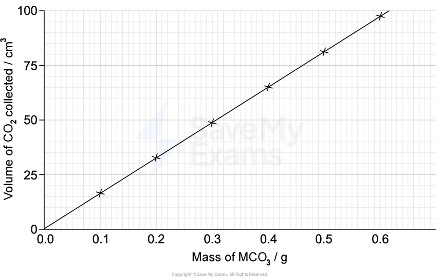
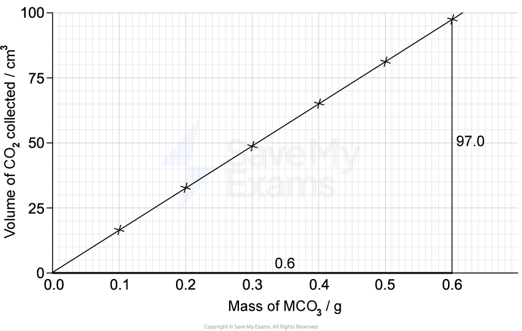
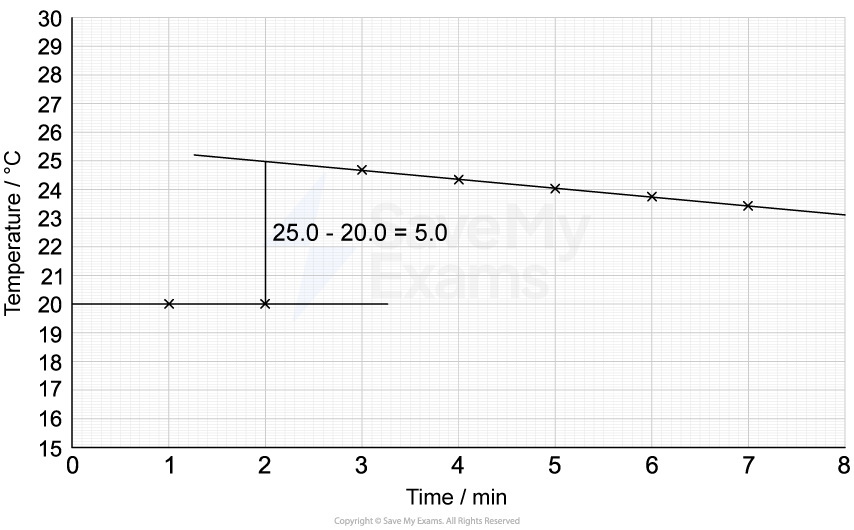

# Mark Schemes — Physical Chemistry Core Practicals
**3. Practical Skills in Chemistry I** · Edexcel International A Level (IAL) Chemistry (YCH11)

## Q1 — medium — 14 marks · structured-questions

### 1((a)) — 3 marks
i) On the addition of acidified silver nitrate solution to an aqueous solution of NH4Cl you would **see**:

- White precipitate; **[1 mark] **

ii) A test to confirm the presence of NH4+ ions in a solution of NH4Cl.

- (Add aqueous) sodium hydroxide / NaOH and warm;** [1 mark] **
- (Gas evolved) turns (damp red) litmus (paper) blue** **
**OR** 
(Gives) white smoke with hydrogen chloride / HCl; **[1 mark] **

**[Total: 3 marks]**

- *Chloride ions will give a white precipitate if acidified silver nitrate is added*

  - *Bromide ions will give a cream precipitate*
  - *Iodide ions will give a yellow precipitate*
- *You should know how to test for ammonium ions*
- *The overall equation is: NH**4**Cl (aq) + NaOH (aq) → NH**3** (g) + H**2**O (l) + NaCl (aq)*

### 1((b)) — 7 marks
i) **Two **reasons why the student stirred the solution in Steps **3 **and **4 **are:

- So that the ammonium chloride / solid dissolves; **[1 mark]**
- To ensure a uniform temperature;** [1 mark] **

ii) The maximum temperature change, Δ*T*, in this experiment

- (Data ≥ 90 s extrapolated back and) minimum temperature at t = 0 Accept minimum temperature in range of 10.7 ± 0.2 (°C); **[1 mark] **

- Calculation showing maximum temperature change, Δ*T *Δ*T* = 19.7 - minimum temperature = 19.7 - 10.7 = 9(.0 °C);** [1 mark] **

iii) This student’s graph would be different because:

- Minimum temperature would be lower;** [1 mark]**
- Temperature would increase at a slower rate (> 90 s); **[1 mark]**
- Less heat (from the surroundings) would enter the solution; **[1 mark] **

**Final answer:** **[Total: 7 marks] **

- *For part (i) you can also give the following reasons:*

  - *Reference to helping the solid dissolve*
  - *Ensure a constant temperature*
  - *Give an accurate temperature reading*
  - *(So solution is) evenly cooled / heated*
  - *But not for giving any reference to mixing or to a reaction *
- *For part (ii) you must show your working on your graph *

  - *To work out the temperature change **extrapolate **the cooling part of the graph until you intersect the time at which the second reactant was added, this was at t = 0*
  - *You can gain the mark for giving the minimum temperature as long as it is ≤ 11.5 (°C)*
  - *You can also give negative Δ**T** values from minimum minus initial temperatures*
- *For part (iii)*

  - *The student has reduced the heat loss by using a polystyrene cup therefore:*
  
    - *the temperature (values) would be lower or temperature change would be greater*
    - *the temperature would remain constant / rise more slowly (> 90 s) or the slope of graph would be less steep (> 90 s)*

### 1((c)) — 4 marks
i) **Two** assumptions made in this calculation are:

Any **two** of the following

- Solution has a density of 1 g cm–3 ; **[1 mark] **
- Mass of ammonium chloride / solid is ignored;** [1 mark] **
- (Specific) heat capacity of the solution is the same as water; **[1 mark] **

ii) To show that the enthalpy change of 14.5 kJ mol–1 is consistent with a data book value of 14.8 kJ mol–1

**Method 1**

- Calculation of uncertainty in experimental value Uncertainty = $\frac{2.6}{100}$ x 14.5 (= 0.377 kJ mol-1); **[1 mark] **
- Indication that experimental value is consistent with data book value 14.5 + 0.377 = 14.877 (kJ mol-1);** [1 mark] **

**Method 2**

- Calculation of percentage change from experimental to data book value $\frac{(14.8-14.5)}{14.5}$ x 100 (= 2.06897 %);** [1 mark] **
- Indication that percentage change is less than experimental uncertainty 2.06897 < 2.6; **[1 mark] **

**Final answer:** **[Total: 4 marks] **

- *It is important that you know how to determine the energy change for a reaction using this method*

  - *For the calculation **q** = **mc**Δ**T** you should use*
  - *m** = mass of water*
  - *c** = specific heat capacity of water*
  - *Δ**T** = change in temperature *
- *For the purposes of the calculations, some assumptions are made about the experiment, there are other assumptions that are also made*

  - *The specific heat capacity of the container is ignored*
  - *The reaction is complete*
  - *There are negligible heat losses*
- *Many students use the mass of solid added for **m** which is incorrect, remember that you are using the specific heat capacity of water so the mass of water or solution in the reaction is **m*
- *For part (ii) you are asked to show that the enthalpy change of 14.5 kJ mol**–1** is consistent with a data book value of 14.8 kJ mol**–1*

  - *Therefore you need to show the calculated value for Δ**H** (found by dividing q by the number of moles of NH**4**Cl used) is within 2.6% of the data booklet value *

## Q2 — medium — 15 marks · structured-questions

### 2((a)) — 3 marks
i) A possible reason why any solution remaining in the beaker is washed into the volumetric flask before making up to the mark

- All the acid / reactant / solid / solution / substance weighed out should be added / transferred (to the flask)
**OR**
None of the acid / reactant / solid / solution / substance weighed out / solution should be left behind (in the beaker)
**OR**
The solution remaining in the beaker will contain some dissolved ethanedioic acid / (if washings not added) the solution concentration will be lower
**OR**
To ensure the amount of acid in the solution is known accurately; **[1 mark] **

ii) To calculate the concentration of this standard solution of ethanedioic acid in mol dm–3.

- Calculation of moles ethanedioic acid in solution $\frac{2.40}{90}$= 0.0267 / 0.027 (mol);** [1 mark] **
- Calculation of concentration in mol dm−3 to 2/3 SF $\frac{0.0267}{0.250}$ = 0.1066 = 0.107 / 0.11 (mol dm−3); **[1 mark] **

**Final answer:** **[Total: 3 marks]**** **

- *Making up a standard solution is a technique that you need to be able to describe and also suggest improvements or mistakes in a given method *
- *To calculate the concentration you need to use the following equations*

  - *moles = *$\frac{\mathrm{mass}}{M_{r}}$* and concentration = *$\frac{\mathrm{moles}}{\mathrm{volume}}$
  - *Don't forget to convert the volume from cm**3** to dm**3** by dividing by 1000*

### 2((b)) — 7 marks
i) The burette is rinsed with ethanedioic acid solution in Step **2** is:

- To prevent dilution of the acid
**OR**
So the burette only contains acid
**OR**
To remove (remaining) water; **[1 mark] **

ii) The **two** mistakes the student has made are:

- The bottom of the meniscus should be on the mark; **[1 mark] **
- The reading should be taken level with the mark / meniscus (to reduce parallax error); **[1 mark] **

iii) The effect **on the titre** of completely emptying the pipette rather than leaving a small amount of solution in the tip:

- There will be more / too much sodium hydroxide / solution** J** (than expected in the conical flask); **[1 mark] **
- (So) the value of the titre will increase; **[1 mark] **

iv) The colour change in the conical flask at the end-point is:

- (From) pink; **[1 mark] **
- (To) colourless; **[1 mark] **

**Final answer:** **[Total: 7 marks] **

- *For part (i)*

  - *Stating removing impurities will not gain the mark as it is not specific enough*
- *For part (ii)*

  - *You can also score the first mark for giving:*
  
    - *The correctly drawn / amended diagrams throughout*
    - *Minimum point of curve / bottom of the curve*
    - *Reverse argument e.g. bottom of the meniscus / curve is not on the mark / top of the meniscus / curve is on the mark*
  - *For the second mark you can also give:*
  
    - *Eye level should be horizontally / parallel (to the meniscus) / bottom of the liquid / perpendicular (to the burette)*
    - *The reverse argument e.g. the reading is not level with the meniscus / taken at an angle*

- *For part (iii)*

  - *The question asks you to make a comment on the titre*
  - *If there is more solution J or sodium hydroxide solution, more ethanedioic acid is required to neutralise the solution *
  - *You will not gain the mark for saying the concentration of sodium hydroxide would change*
- *For part (iv)*

  - *If you gave the colours the wrong way round you can still score 1 mark*

### 2((c)) — 5 marks
i)

- All subtractions correct 25.05, 24.6(0), 24.5(0);** [1 mark]**
- Titres 2 and 3 chosen and correctly averaged $\frac{24.60+24.50}{2}$= 24.55 (cm3);** [1 mark] **

ii)

- Calculation of moles ethanedioic acid in titre $\frac{24.55\times0.0900}{1000}$ = 0.0022095 / 0.00221 / 2.2095 x 10-3 (mol); **[1 mark]**
- Moles sodium hydroxide in 25 cm3 aliquot 0.0022095 x 2 = 0.004419 / 0.00442 / 4.419 x 10-3 (mol); **[1 mark]**
- Calculation of sodium hydroxide concentration $\frac{0.004419}{25}$ x 1000 = 0.17676 / 0.177 / 0.18 (mol/dm3); **[1 mark] **

**Final answer:** **[Total: 5 marks] **

- *The titre readings used to calculate the mean must be concordant results (those within 0.1 cm**3**), the other results are discarded *
- *Looking at the equation we can see that 2 moles of sodium hydroxide are required to react with 1 mole of ethanedioic acid*

  - *(COOH)**2**+ 2NaOH → (COONa)**2** + 2H**2**O*
  - *This is why the number of moles of ethanedioic acid must be doubled to obtain the moles of NaOH*
- *To work out the concentration of sodium hydroxide you must use: *

  - *Moles = concentration x volume (dm**3**) OR moles =*$\frac{\mathrm{concentration}\times\mathrm{volume}(\mathrm{cm}^{3})}{1000}$
  - *Concentration = *`fraction numerator moles over denominator volume space open parentheses dm cubed close parentheses end fraction`* OR concentration = *`fraction numerator moles over denominator volume space open parentheses cm cubed close parentheses end fraction cross times 1000`

## Q3 — medium — 8 marks · structured-questions

### 3((a)) — 3 marks
A completed graph is:

- Axes correct way round 
**AND**
linear scales allow data to occupy more than half of each axis; **[1 mark]**
- Axes labelled with units; **[1 mark]**
- All points plotted correctly; **[1 mark]**

**[Total: 3 marks]**

- *You should find this graph straightforward to draw*

  - *Your y-axis does not need to start at 0*
  - *Don't forget to include units when you label your axis - you will not achieve the second marking point if you forget these *

### 3((b)) — 2 marks
The maximum temperature change, Δ*T,* using your graph is:

- Two correct extrapolated lines drawn; **[1 mark]**
- Correct value for Δ*T*;** [1 mark]**

**[Total: 2 marks]**

- *To do this, two lines of best fit should be drawn:*

  - *One line is horizontal 0 to 2.5 mins*
  - *The other line is diagonal through the final points*
  - *The diagonal line should be extrapolated back to 2.5 mins so that the difference between them can be deduced*
  - *Although the vertical line is shown on the graph, you do not need to show this*
  - *Your answer may differ depending on your graph so answers within the range of 17.1 - 18.2 are accepted*

### 3((c)) — 1 marks
**One **possible reason why this value is different from a data book value of −61.4 kJ mol−1 is:

Any **one **from:

- Heat loss (to the surroundings); **[1 mark]**
- Heat loss (to the apparatus); **[1 mark]**
- Mass of solution is more than 25 g; **[1 mark]**
- Density is more than 1 g cm‒3; **[1 mark]**
- Specific heat capacity is not 4.2 / 4.18 J g-1 oC-1; **[1 mark]**
- Heat capacity of the polystyrene cup assumed to be 0; **[1 mark]**

**[Total: 1 mark]**

### 3((d)) — 2 marks
i) The enthalpy change of hydration for the conversion of anhydrous copper(II) sulfate to hydrated copper(II) sulfate crystals is:

- ‒ 39.0 ‒ (+5.6) = ‒44.6 (kJ mol‒1); **[1 mark]**

ii) One possible reason why the enthalpy change of hydration in (d)(i) could **not** be found directly by experiment is:

- Any suitable suggestion; **[1 mark]**

**[Total: 2 marks]**

- *Hess's law states that the enthalpy change is independent of the route taken *

  - *The enthalpy change can therefore be found from the indirect route *
  - *An easy way to calculate the enthalpy change is to take the indirect route on your cycle from the CuSO**4 **to the CuSO**4**.5H**2**O, changing the sign if the arrow is going in the opposite direction*

- *Suitable suggestions for part ii) include:*

  - *It is hard to add the correct amount of water*
  - *Some crystals would be dissolved whilst others may not be (fully) hydrated*
  - *It is hard to measure the temperature (change) of a solid*

## Q4 — medium — 11 marks · structured-questions

### 3((a)) — 2 marks
The colour **change** observed at the end-point of the titration is:

- (From) yellow;** [1 mark]**
- (To) orange / peach; **[1 mark]**

**[Total: 2 marks]**

- *Methly orange is yellow in alkali solutions and red in acidic solutions*
- *It will start yellow in the conical flask containing the alkali, barium hydroxide*
- *As hydrochloric acid is added, the solution becomes less alkaline *
- *At the end point of the titration the colour changes to orange*
- *If the colour changes to red, then the solution has become acidic and the end point has been passed*

### 3((b)) — 7 marks
i) The completed table is:

| **Titration** | **1** | **2** | **3** | **4** |
|---|---|---|---|---|
| Final burette reading/ cm3 | 22.60 | 44.45 | 23.05 | **Final answer:** **45.1(0)** |
| Initial burette reading/ cm3 | 0.10 | 22.60 | 1.25 | 23.20 |
| Titre/ cm3 | 22.50 | 21.85 | **Final answer:** **21.8(0)** | 21.90 |

- Two correct values; **[1 mark]**

ii) A reason why the first titre should **not** be used to calculate the mean titre is:

- It is not concordant / not within 0.1 (cm3) / not within 0.2 cm3; **[1 mark]**

iii) The number of moles of hydrochloric acid in the mean titre is:

- Mean titre = $\frac{21.85+21.80+21.90}{3}$ = 21.85 (cm3); **[1 mark]**
- Moles of HCl = conc x vol (dm3) = 0.200 x $\frac{21.85}{1000}$ = 0.00437 / 4.37 x 10-3 (mol); **[1 mark]**

iv) The concentration of barium hydroxide, in g dm−3, to an appropriate number of significant figures is:

- Moles of Ba(OH)2 in 10 cm3 = moles of HCl ÷ 2 = 0.00437 ÷ 2 = 0.002185 / 2.185 x 10-3 (mol); **[1 mark]**
- Moles of Ba(OH)2 in 1 dm3 = 0.002185 x 100 = 0.2185 (mol); **[1 mark]**
- Concentration in g dm-3, to 2 or 3 SF = 0.2185 x 171.3 = 37 / 37.4 (g dm-3); **[1 mark]**

**[Total: 7 marks]**

- *When giving measurements from a burette, the values should be to 2 decimal places and end in either a 0 or 5, although you would not be penalised in this question for giving the answer to 1 decimal place*
- *Concordant results are those within 0.1 cm**3** of each other - in this question you would gain the mark for 0.2 cm**3** but you are best to use 0.1*
- *You would also gain this mark if you said that the first titre should not be used because it is rough / a trial / a rangefinder*
- *Titration calculations are common and you should be well practiced in performing these*
- *Remember**: Convert cm**3** to dm**3** by dividing by 1000 and use to balanced symbol equation to deduce the molar ratio*
- *To convert from concentration in mol dm**-3** to g dm**-3**, multiply by the **M**r*

  - *The **M**r** of Ba(OH)**2** = 137.3 + 2 x (16.0 + 1.0) = 171.3*
- *You would score full marks in each part for the correct answer with some working*

### 3((c)) — 1 marks
A safety precaution that should be used to minimise this risk when adding barium oxide to water is:

- Use of a fume cupboard; **[1 mark]**

**[Total: 1 mark]**

- *Ensure that the selected precaution is suitable for the hazard*
- *In this case, the hazard occurs if inhaled, therefore the precaution needs to prevent / minimise inhalation*
- *You could also give the use of a face mask or respiratory equipment as your response*
- *Other precautions that do not prevent inhalation, such as the use of a laboratory coat / goggles / gloves will not be awarded the mark*
- *The use of a well-ventilated laboratory is also insufficient as it does not reduce the risk sufficiently*

### 3((d)) — 1 marks
The meaning of this symbol is:

- Oxidising (agent) / oxidiser / oxidant; **[1 mark]**

**[Total: 1 mark]**

- *Careful**: Don't get this mixed up with the symbol for flammable which is similar*
- *This has an O inside flame to distinguish this as an oxidising agent*

## Q5 — medium — 9 marks · structured-questions

### 3() — 1 marks
The delivery tube is removed first:

- To prevent “suck back” (of the water/liquid) 
**OR** 
So that the water / liquid does not move / flow back into the tube; **[1 mark] **

**Final answer:** **[Total: 1 mark] **

- *You can also say to stop the test tube breaking or cracking but not for making reference to explosions, gases sucking back, escaping or entering the tube*

### 3((b)) — 5 marks
i) To identify the Group 2 metal:

- Calculation of moles carbon dioxide

$\frac{95}{24000}$ = 0.0039583 / 3.9583 x 10-3 moles; **[1 mark] **

- Calculation of mass of Group 2 metal

0.33 − (0.0039583 x 60) = 0.33 – 0.2375 = 0.0925 g; **[1 mark] **

- Calculation of mass number and identity of Group 2 metal

$\frac{0.0925}{0.0039583}$= 23.368 and magnesium / Mg;** [1 mark] **

ii) An appropriate comment could be:

- The increase in mass would reduce the (percentage) uncertainty / error (in the mass / volume measurement); **[1 mark] **
- (So) the volume of gas given off would be greater / would exceed the volume of the measuring cylinder; **[1 mark] **

**Final answer:** **[Total: 5 marks] **

- *For part (i) there are two other methods you could use, these are both for the second and third marking points:*

  - *Method 1*
  
    - *M**r **(MCO**3**) = 0.33 / 0.0039583 = 83.4*
    - *M**r** (CO**3**2−**) = 60*
    - *83.4 - 60 = 23.4 and magnesium / Mg*
  - *Method 2*
  
    - *Mass of Group 2 metal oxide*
    - *0.33 – (0.0039583 x 44) = 0.15583 g*
    - *A**r** = (0.15583 ÷ 0.0039583) – 16*
    - *39.3685 -16 = 23.368 and magnesium / Mg*
- *An answer of Mg and 23 / 23.4 / 23.37 / 23.368 scores 3 marks*
- *For part (ii)*

  - *A larger mass of Group 2 carbonate would increase the volume of carbon dioxide that would be collected in the experiment *
  - *Therefore a larger gas syringe would be required as otherwise gas will escape *
  - *Using a larger mass or volume of reactant will reduce the percentage error or uncertainty*
  
    - *% uncertainty = *$\frac{\mathrm{total} \mathrm{uncertainty}}{\mathrm{measured} \mathrm{value}}\times100$

### 3((c)) — 3 marks
i) To calculate the enthalpy change, Δ*H*1 , for the reaction between MCO3 and hydrochloric acid in kJ mol−1:

- Calculation of the heat energy change Q = m × C × ΔT *Q* = 60 × 4.18 × 6 = 1504.8 = 1505 (J) or 1.505 (kJ); **[1 mark]**
- Calculation of the enthalpy change, Δ*H*1 with sign Δ*H*1 = $\frac{1.505}{0.050}$  = −30.096 (kJ mol−1); **[1 mark] **

ii) To calculate the enthalpy change, Δr*H* , for the thermal decomposition of this Group 2 carbonate in kJ mol−1:

- Δ*H*1 (answer to (i)) − (−150) −30.1 + 150 = (+)119.9 / (+)120 (kJ mol−1); **[1 mark] **

**[Total: 3 marks] **

- *For part (i) you must determine **Q** first by using **Q** = **mc**Δ**T*

  - *Even though you have been given a solution of hydrochloric acid, you still use the same equation- this information is given in the question*
- *Remember **m** is the mass of the solution being heated, students often use the mass of a solid placed in the solution which is incorrect *
- *Now you have the heat change for the reaction you need to calculate the enthalpy change per mole*

  - *0.050 mol of MCO**3** is used, so you must use Δ**H**1 **= *$\frac{Q}{n}$
  - *Neutralisation is an exothermic process, so you must have a negative sign in front of your answer*
- *Thermal decomposition will be an endothermic process, therefore the enthalpy sign must be positive(+)*
- *Remember if the indirect route goes in the opposite direction of an arrow the sign must be reversed*

## Q6 — medium — 9 marks · structured-questions

### 5((a)) — 1 marks
The completed titre values are:

|   |   | **Titration number** |   |   |   |
|---|---|---|---|---|---|
|   | **Rough** | **1** | **2** | **3** | **4** |
| **Final reading / cm****3** | 24.90 | 21.25 | 42.85 | 21.80 | 43.15 |
| **Initial reading / cm****3** | 2.30 | 0.00 | 21.25 | 0.50 | 21.80 |
| **Titre/ cm****3** | **Final answer:** **22.6(0)** | **Final answer:** **21.25** | **Final answer:** **21.6(0)** | **Final answer:** **21.3(0)** | 21.35 |

- All titre values correct; **[1 mark]**

**[Total: 1 mark]**

- *Take the initial reading away from the final reading to find the titre values*
- *Although you will achieve the mark for writing some values to 1 decimal place it is good practice to be consistent throughout the table and write them to 2 *

### 4((b)) — 5 marks
i) The value from Titration 2 was **not** used to calculate the mean because:

- It is not concordant 
**OR** 
Is is more than (±)0.20 / 0.10 (cm3) from results 1, 3 and 4; **[1 mark]**

ii) The concentration of the sodium hydroxide solution in mol dm−3 is:

- Calculation of mean $\frac{21.25+21.30+21.35}{3}$ = 21.3(0) cm3; **[1 mark]**
- Calculation of moles of hydrochloric acid n = c × v = (21.30 ÷ 1000) × 0.5 = 0.01065 / 1.065 x 10−2; **[1 mark]**
- Calculation of moles of sodium hydroxide solution 0.01065 / 1.065 x 10−2; **[1 mark]**
- Calculation of concentration of sodium hydroxide solution c = 0.01065 ÷ 0.025 = 0.426 / 0.43 (mol dm-3); **[1 mark]**

**[Total: 5 marks]**

- *Concordant results are those within 0.1 cm**3** of one another *

  - *Only these results should be used to calculate the mean*
  - *Some mark schemes do allow concordant results to be within 0.2 cm**3** but not always so safer to use 0.1*
- *When determining the number of moles of hydrochloric acid, don't forget to convert the volume from cm**3** to dm**3** by dividing by 1000*
- *To calculate the moles of sodium hydroxide, look at the ratio of sodium hydroxide to hydrochloric acid in the equation:*

  - *The ratio is 1:1 so the number of moles is the same*
- *A correct answer with no workings will still score 4 marks*
- *An answer of 0.587 (mol dm**-3**) / 0.59 (mol dm**-3**) will score 3 marks*

### 5((c)) — 1 marks
The percentage uncertainty in Titration 4 is:

- (±)0.468% / (±)0.47% / (±)0.5%;** [1 mark]**

**[Total: 1 mark]**

- *Use *$\frac{\mathrm{uncertainty}}{\mathrm{measured} \mathrm{value}}\times100$* to find the percentage uncertainty *
- *The burette has been read twice, once for the initial and again for the final volume so the uncertainty needs including twice: *

  - $\frac{0.05+0.05}{21.35}\times100$
- *The measured value can be found in the table in part a) *

### 5((d)) — 2 marks
The colour change that would be seen at the end-point in this titration using phenolphthalein as the indicator is:

- (Pale) pink; **[1 mark]**
- To colourless; **[1 mark]**

**[Total: 2 marks]**

- *The indicator was initially added to sodium hydroxide *

  - *phenolphthalein is pink in alkalis *
- *Acid was added from the burette *

  - *At the end point, the phenolphthalein will turn colourless *

## Q7 — medium — 11 marks · structured-questions

### 1() — 1 marks
> **[mark-scheme]**
> When MCO3 is added to excess hydrochloric acid:
> 
> - Effervescence / fizzing / bubbles **[1 mark]**
> 
> 'Gas evolves', 'gas is given off' and 'gas is produced' are not accepted
> 
> References to the solid dissolving / disappearing are not accepted

> **[exam-tip]**
> When you are asked for observations, you need to answer with something you can detect with your senses. For this reaction:
> 
> - You can see fizzing
> - You cannot see carbon dioxide gas being produced
> 
> Gas being produced is a conclusion being drawn from the fizzing observation

### 2() — 3 marks
The completed graph is:

**[3 marks]**

> **[mark-scheme]**
> 1 mark for a scale that occupies more than 50% of the grid in both directions **AND **both axes labelled with quantity and units
> 
> 1 mark for all six data points plotted correctly, each within ± half a small square
> 
> 1 mark for a single straight line of best fit drawn passing through or close to the majority of points and through the origin
> 
> Allow (0, 0) as one of the points used for the line of best fit
> 
> A line connecting consecutive data points (joining the dots) is not accepted

> **[exam-tip]**
> The most common errors for plotting this type of graph are:
> 
> - Scale:
> 
>   - The scale must cover at least half of the blank graph or you risk a mark
>   - Larger graphs mean more accurate values for any required readings
> - Data points:
> 
>   - Points should be plotted as crosses (×), not dots
>   - Dots disappear under the line of best fit, which means that you could risk losing the plotting mark
> - Line of best fit:
> 
>   - For this set of results, you should draw one single straight line of best fit
>   
>     - Lines and curves of best fit should never be dot-to-dot
>   - This line must pass through the origin as zero mass of carbonate produces zero gas

### 3() — 5 marks
To calculate the gradient, relative formula mass of MCO3 and identify metal M:

- Draw a construction triangle on the line of best fit and read off coordinates from the line:

change in volume of CO2 produced = 97.0 - 0 = 97.0

change in mass = 0.6 - 0 = 0.6

**[1 mark]**

- Calculate the gradient:

gradient = $\frac{\mathrm{change} \mathrm{in} \mathrm{volume} \mathrm{of} \mathrm{CO}_{2}\mathrm{produced}}{\mathrm{change} \mathrm{in} \mathrm{mass}}$

gradient = $\frac{97.0}{0.60}$

gradient = 162 cm3 g-1

**[1 mark]**

- Calculate the molar mass of MCO3:

gradient = $\frac{\mathrm{molar} \mathrm{volume}}{M_{r}\mathrm{MCO}_{3}}$

*M*r MCO3 = $\frac{\mathrm{molar} \mathrm{volume}}{\mathrm{gradient}}$

*M*r MCO3 = $\frac{24000}{162}$

*M*r(MCO3) = 148 g mol-1

**[1 mark]**

- Determine the identity of M:

*M*r MCO3 = *A*r M2+ + *M*r CO32-

*A*r M2+ = *M*r MCO3 - *M*r CO32-

*A*r M2+ = 148 - 60

*A*r M2+ = 88 g mol-1

**[1 mark]**

so, M = **strontium (Sr)**

**[1 mark]**

> **[mark-scheme]**
> 1 mark for evidence on the graph to determine the change in mass and change in volume of CO2 produced
> 
> 1 mark for a correct gradient calculation giving an answer in the range 155–170 cm3 g-1
> 
> 1 mark for calculating  24 000 ÷ gradient **AND **an *M*r value in the range 142–155 g mol-1 for MCO3
> 
> 1 mark for subtracting a mass of 60 from the calculated *M*r of MCO3
> 
> 1 mark for identifying M as the Group 2 metal strontium / Sr
> 
> Any values from the graph can be used as long as they are well separated and result in an answer in the range 155–170 cm3 g-1
> 
> Evidence of working on the graph must be seen; using values directly from the data table is not accepted
> 
> Allow error carried forward from an incorrect line of best fit, incorrect gradient or incorrect *M*r
> 
> For the final answer, a Group 2 metal must be identified

> **[exam-tip]**
> A volume-versus-mass graph has a gradient equal to:
> 
> $\frac{\mathrm{molar} \mathrm{volume}}{M_{r}}$
> 
> This means that dividing the molar volume (24 000 cm3 mol-1) by the gradient gives the molar mass of the carbonate directly.
> 
> The two most common errors are:
> 
> 1. Using gradient values directly from the results table
> 
>   - You must show clear working on the graph
>   - This is how the examiner confirms you used the line, not the raw data
> 2. Forgetting to subtract the molar mass of CO32- (60 g mol-1) to get the atomic mass of M
> 
>   - The gradient calculation gives the molar mass of MCO3, not of M alone

### 4() — 2 marks
> **[mark-scheme]**
> One modification to the apparatus that would give a more accurate result is:
> 
> Any **one **of the following modification and justification pairs (1 mark for each point):
> 
> - Modification 1: Place the Group 2 carbonate in a small (plastic/glass) tube or container inside the conical flask
> - Justification 1: To prevent the loss of carbon dioxide / gas before the bung can be inserted/replaced
> **OR** Gas is lost before the bung can be replaced / inserted in the measuring-cylinder set-up, which a gas syringe avoids
> 
> - Modification 2: Use a gas syringe instead of a measuring cylinder over water
> - Justification 2: Carbon dioxide / gas dissolves or reacts with water
> **OR**
> A gas syringe has a lower uncertainty / higher resolution than a 250 cm3 measuring cylinder
> 
> **[2 marks]**
> 
> Vague answers like "prevents gas leaking" are not accepted without clearly stating "before the bung is inserted"
> 
> "The gas syringe is more accurate / more precise" is not accepted without a specific reason

> **[exam-tip]**
> This is a two-mark question:
> 
> - The first mark is for a specific modification
> - The second mark is for a correctly associated and scientifically grounded justification
> 
> For example, writing "because it is more accurate" simply restates the question, which does not score the second mark.
> 
> Always link your apparatus change to the specific source of error it removes.

## Q8 — hard — 10 marks · structured-questions

### 3((a)) — 2 marks
i) The **ionic** equation for the reaction that occurs when sodium sulfate solution is:

- Correct species and balancing and state symbols Ba2+ (aq) + SO42- (aq) → BaSO4 (s); **[1 mark]**

ii) A possible reason why it is necessary to add sodium sulfate solution is:

- (To remove) barium ions / Ba2+ (that would otherwise) form a precipitate with chromate((VI)) ions / CrO42-; **[1 mark] **

**Final answer:** **[Total: 2 marks] **

- *You must have state symbols in your equation as two solutions react together to form the characteristic precipitate of barium sulfate*
- *For part (ii):*

  - *The end point is shown by the reaction of silver ions and chromate(VI) ions so the barium ions must be removed*
  - *You can also say for the mark: *
  
    - *To stop formation of barium chromate((VI)) / BaCrO**4** or show the formation of Ba**2+** (aq) + CrO**4**2-** (aq) → BaCrO**4** (s) *
    - *To stop barium ions reacting with the indicator / chromate((VI)) ions / CrO**4**2-*

### 3((b)) — 1 marks
The red precipitate of silver chromate(VI) only forms after all the chloride ions have reacted because:

- Silver chloride is (much) less soluble (than silver chromate((VI)); **[1 mark] **

**[Total: 1 mark]**

- *You know that when silver ions react with chloride ions a white precipitate immediately forms (which is soluble in dilute ammonia)*
- *This tells you that silver chloride is very insoluble so silver chloride will form before silver chromate *
- *The solubility product, **K**sp** of silver chloride is much smaller than that of silver chromate(VI)*

  - *K**sp** stands for solubility product*
  
    - *It is not on the specification for this course, however it is an acceptable answer for you to give for this question *

### 3((c)) — 7 marks
i) The completed table and mean titre is:

- Three values correctly recorded in table;** [1 mark] **

| **Titration number** | 1 | 2 | 3 | 4 |
|---|---|---|---|---|
| **Burette reading (final) / cm****3** | 16.15 | 32.05 | 48.30 | 47.40 |
| **Burette reading (initial) / cm****3** | 0.00 | 16.15 | 32.50 | 31.55 |
| **Titre / cm****3** | 16.15 | **15.9(0)** | **15.8(0)** | **15.85** |

- Calculation of mean titre to 2 decimal places from concordant results Mean titre = $\frac{(15.90+15.80+15.85)}{3}$ = 15.85 (cm3);** [1 mark] **

ii) To determine the value of **x** in the formula of the hydrated salt, BaCl2 ·**x**H2O:

**Method 1**

**First three marks:**

- Mols Ag+ in mean titre
Mols Ag+ = $\frac{0.0324\times15.85}{1000}$ = 0.00051354 / 5.1354 × 10–4; **[1 mark] **
- Mols Ba2+ in 10.0 cm3
Mols Ba2+ in 10.0 cm3 = $\frac{0.00051354}{2}$  = 0.00025677 / 2.5677 × 10–4
**OR**
Mols Cl– in 250 cm3
mols Cl– in 250.0 cm3 = $\frac{0.00051354\times250}{10.0}$ = 0.0128385 / 1.28385 × 10–2; **[1 mark]**
- Mols Ba2+ in 250 cm3
Mols Ba2+ in 250 cm3 = $\frac{0.00025677\times250}{10.0}$ = 0.00641925 / 6.41925 × 10–3
**OR**
(From mols Cl–) = $\frac{0.0128385}{2}$ = 0.00641925 / 6.41925 × 10–3; **[1 mark] **

**Final two marks:**

- Molar mass BaCl2.xH2O
Molar mass BaCl2.xH2O =  $\frac{1.57}{0.00641925}$  = 244.58 (g mol–1); **[1 mark]**
- Molar mass of xH2O
Molar mass of xH2O = 244.58 - 208.3 = 36.277 (g mol–1)
**AND**
Value of x
Value of x = $\frac{36.277}{18.0}$= 2(.0154) (so formula is BaCl2.2H2O)
**OR**
Mass H2O in hydrated salt
**Mass H****2****O = 1.57 - (0.00641925 x 208.3) = 0.23287 (g)**
Mols H2O in hydrated salt
Mols H2O = $\frac{0.23287}{18.0}$ = 0.012937 (mol)
**AND**
Value of x
Value of x = $\frac{0.012937}{0.00641925}$ = 2(.0154) (so formula is BaCl2.2H2O); **[1 mark] **

**Method 2**

**First three marks:**

- Mass BaCl2.xH2O in 10.0 cm3
- Mass BaCl2.xH2O in 10.0 cm3 = 1.57 × $\frac{10.0}{250.0}$ = 0.0628 (g);** [1 mark]**
- Mols Ag+ in mean titre Mols Ag+ = 0.0324 × $\frac{15.85}{1000}$ = 0.00051354 / 5.1354 × 10–4; **[1 mark]**
- Mols Ba2+ in 10.0 cm3 Mols Ba2+ in 10.0 cm3 = $\frac{0.00051354}{2}$ = 0.00025677 / 2.5677 × 10–4; **[1 mark] **

**Final two marks:**

- Molar mass BaCl2.xH2O
Molar mass BaCl2.xH2O = $\frac{0.0628}{0.00025677}$= 244.58 (g mol–1); **[1 mark]**
- Molar mass of xH2O
Molar mass of xH2O = 244.58 - 208.3 = 36.277 (g mol–1)
**AND**
Value of x
Value of x = $\frac{36.277}{18.0}$ = 2(.0154)
**OR**
Mass H2O in 10.0 cm3 hydrated salt
Mass H2O = 0.0628 - (0.00025677 x 208.3) = 0.0093148 (g)
Mols H2O in hydrated salt
Mols H2O = $\frac{0.0093148}{18.0}$ = 0.00051749 (mol)
**AND**
Value of x;
Value of x = $\frac{0.00051749}{0.00025677}$ = 2(.0154) so formula is BaCl2.2H2O; **[1 mark]**

**Final answer:** **[Total: 7 marks] **

- *Concordant results should be used to determine the mean titre value *

  - *If you calculate the mean titre incorrectly you can still gain full marks for part (ii)*
- *Part (ii) is a long calculation, so take it one step at a time and show your working*
- *The key points are:*

  - *The number of moles of silver ions is the same as the number of moles of chloride ions *
  - *As the formula for barium chloride is BaCl**2**, the number of moles of chloride ions is double that of barium *
  - *Remember to scale the number of moles that are in 10 cm**3** to 250 cm**3*
  - *Once you have the number of moles of barium in 250 cm**3** you can determine the molar mass using *
  
    - *M**r** = *$\frac{\mathrm{mass}}{\mathrm{moles}}$
  - *Now you have the **M**r** of BaCl**2**.xH**2**O you can subtract the **M**r** of BaCl**2** from the total **M**r *
  - *You can then determine the ratio of BaCl**2** to H**2**O*
- *There are two methods shown, it is always best to use the one that you find easiest to understand *

## Q9 — hard — 10 marks · structured-questions

### 1() — 2 marks
To determine the maximum temperature change, Δ*T*:

- Add two lines of best fit and extrapolate to 2 minutes
- Read the values at *t* = 2 minutes to determine Δ*T*

**[2 marks]**

> **[mark-scheme]**
> 1 mark for both lines of best fit visible on the graph **AND **correctly extrapolated back to *t* = 2.0 min
> 
> 1 mark for reading off at *t* = 2.0 min **AND **determining a value of Δ*T* in the range 4.8 °C to 5.2 °C
> 
> Allow error carried forward if plots are incorrect but the extrapolation method is correctly applied to the candidate's lines

> **[exam-tip]**
> Temperature does not reach its maximum value the instant the solid is added. Some heat is lost to the surroundings during mixing.
> 
> Extrapolating both lines back to the time of mixing corrects for this heat loss and gives the true temperature change.
> 
> A common mistake is to use the highest recorded temperature (24.7 °C) and subtract the initial temperature (20.0 °C), giving Δ*T* = 4.7 °C. This underestimates the true temperature change because it ignores heat lost to the surroundings during mixing.

### 2() — 3 marks
To calculate Δ*H*sol(NiSO4):

- List the known values:

  - mass of solution, *m* = 100.0 g (volume 100.0 cm3, density 1.00 g cm-3)
  - specific heat capacity, *c* = 4.18 J g-1 °C-1
  - temperature change, Δ*T* = 5.0 °C (from part (a))
- Calculate the energy transferred, *Q*:

*Q *= *mc*Δ*T*

Q = 100.0 x 4.18 x 5.0

*Q* = 2090 J **[1 mark]**

- Calculate the moles of NiSO4:

moles = $\frac{\mathrm{mass}}{M_{r}}$

moles of NiSO4 = $\frac{3.87}{154.8}$

moles of NiSO4 = 0.0250 mol **[1 mark]**

- Calculate the enthalpy change per mole in kJ mol-1:

Δ*H*sol =  $-\frac{Q}{n}$

Δ*H*sol =  $-\frac{2090}{0.0250}$

Δ*H*sol =  -83600 J mol-1

Δ*H*sol =  $\frac{-83600}{1000}$

Δ*H*sol = **−83.6 kJ mol****-1** **[1 mark]**

> **[mark-scheme]**
> 1 mark for calculating the energy transferred, *Q*, (2090 J)
> 
> 1 mark for calculating the moles of NiSO4 (0.0250 mol)
> 
> 1 mark for correct final answer in kJ mol-1 with negative sign, in the range −79 to −88 kJ mol-1 (for Δ*T* in the range 4.8–5.2 °C)
> 
> Allow error carried forward if an incorrect Δ*T* is carried forward from part (a)(ii). Apply ECF throughout and award all three marks for correct method
> 
> Using the mass of solid alone (3.87 g) or the combined mass of solid and water (103.87 g) as *m* is not accepted

> **[exam-tip]**
> The most common error in this type of calculation is using the wrong value for *m* in *Q* = *mc*Δ*T*:
> 
> - The mass is the mass of the **solution**.
> 
>   - Using the density assumption (1.00 g cm-3), 100.0 cm3 of solution has a mass of 100.0 g
> - The mass is **not:**
> 
>   - The mass of the solid alone (3.87 g)
>   - The mass of the solid and the solution (103.87 g)
> 
> The enthalpy change must be **negative** (exothermic) because the temperature rose when the solid dissolved. Always check the sign before moving on.

### 3() — 2 marks
To calculate the enthalpy change of hydration of anhydrous nickel(II) sulfate:

- Use the Hess cycle:

Δ*H*1 = Δ*H*hyd + Δ*H*2

- Rearrange to find Δ*H*hyd:

Δ*H*hyd = Δ*H*1 - Δ*H*2 **[1 mark]**

- Substitute the values and evaluate:

Δ*H*hyd = -83.6 - (+17.0)

Δ*H*hyd = **−100.6 kJ mol****-1** **[1 mark]**

> **[mark-scheme]**
> 1 mark for correct application of Hess's Law (Δ*H*hyd = Δ*H*1 − Δ*H*2) **OR **any equivalent correct expression derived from the cycle
> 
> 1 mark for the correct final Δ*H*hyd value in the range −96 to −105 kJ mol-1
> 
> Allow error carried forward from an incorrect value in part (b) as long as the calculations show the answer from part (b) minus 17.0 kJ mol-1

> **[exam-tip]**
> The direction of the arrows in the Hess cycle determines whether you add or subtract the enthalpy values:
> 
> - Travelling in the direction of an arrow uses the value as given
> - Travelling against an arrow requires you to change the sign.
> 
> The most common error is to add the two enthalpy values, using:
> 
> Δ*H*hyd = Δ*H*1 + Δ*H*2
> 
> Δ*H*hyd = −83.6 + (+17.0) = −66.6 kJ mol-1.
> 
> This is incorrect because it does not account for the direction of the Δ*H*2 arrow. Check the direction of each arrow carefully before writing your Hess equation.
> 
> Make sure your final answer has a negative sign. Δ*H*hyd should be negative (exothermic) because forming the hydrated salt from anhydrous NiSO4 and water releases energy.

### 4() — 1 marks
> **[mark-scheme]**
> One assumption made when calculating the enthalpy change is:
> 
> Any **one **from:
> 
> - The mass of the solid / NiSO4 / 3.87 g is ignored (when calculating the mass of the solution)
> - The heat capacity of the apparatus / polystyrene cup / thermometer is zero / negligible
> - No heat / energy is lost to the surroundings
> - The mass of the solution is exactly 100 g
> 
> **[1 mark]**
> 
> 'The density of the solution is 1 g cm-3' and 'the specific heat capacity of the solution is 4.18 J g-1 °C-1' are not accepted

> **[exam-tip]**
> The question excludes density and specific heat capacity, so those two standard assumptions will not score the mark here.
> 
> The remaining assumptions that underpin *Q* = *mc*Δ*T* for this experiment are:
> 
> - The polystyrene cup and thermometer absorb no heat
> 
>   - Their heat capacity is treated as zero
> - The mass of the solid (3.87 g) is small enough to ignore / the mass of the solution is exactly 100 g
> 
>   - The mass used in the calculation is the water alone (100.0 g)
> - The system is perfectly insulated
> 
>   - No heat escapes to the surroundings during the reaction
> 
> Any one of these scores the mark. Vague answers such as 'the experiment is accurate' or 'there are no errors' will not be accepted.

### 5() — 2 marks
> **[mark-scheme]**
> How using a glass beaker would affect the enthalpy change of solution:
> 
> - The calculated enthalpy change / Δ*H*sol would be less exothermic / less negative / smaller in magnitude **[1 mark]**
> 
> Justification:
> 
> - More heat is lost to the surroundings through the glass beaker
> **OR**
> Polystyrene is a better insulator / glass is a better conductor
> **OR**
> More energy is used to heat the glass container **[1 mark]**
> 
> The justification must refer to heat loss to the surroundings or the poorer insulating properties of glass

> **[exam-tip]**
> Glass conducts heat more readily than polystyrene, so:
> 
> - More heat is lost to the surroundings
> - → the temperature rise is smaller than it should be
> - → the calculated Δ*T* is smaller than it should be
> - → the calculated *Q* = *mc*Δ*T* is smaller than it should be
> - → the enthalpy change appears less exothermic.
> 
> For the first mark, write 'less exothermic' or 'less negative' rather than just 'smaller', as 'smaller' is ambiguous.

## Q10 — hard — 9 marks · structured-questions

### 1() — 4 marks
> **[mark-scheme]**
> To prepare 250.0 cm3 of standard ethanedioic acid solution:
> 
> - Dissolve the solid in a beaker (or conical flask) using distilled / deionised water **[1 mark]**
> - Transfer the solution into a 250 cm3 volumetric / standard / graduated flask **[1 mark]**
> - Rinse the beaker (and stirring rod) with distilled/deionised water and add the washings to the volumetric flask
> **AND**
> Add distilled/deionised water to make up to the (graduation) mark **[1 mark]**
> - Stopper the flask and mix / shake / invert the flask to ensure a uniform solution **[1 mark]**
> 
> "Distilled" or "deionised" must be specified at least once in the answer to achieve full marks. 1 mark is deducted otherwise
> 
> "Pure water" is not accepted
> 
> "Add 250 cm³ of water" is not accepted as an alternative to "make up to the mark" or "make the volume up to 250 cm3"

> **[exam-tip]**
> There are four key steps for full marks:
> 
> 1. Dissolving
> 2. Transferring
> 3. Washings (and volume)
> 4. Mixing
> 
> The most common mistakes are:
> 
> - Rinsing
> 
>   - Missing the need to rinse the glassware to ensure all the solution is transferred to the volumetric flask
>   - This means that less solid is actually transferred resulting in a lower concentration solution.
> - Glassware
> 
>   - Preparing the entire solution in a beaker or a measuring cylinder
>   - These are not accurate / precise enough to make standard solutions
> - Volume
> 
>   - Stating "add 250 cm3 of water"
>   - The solution is made up to 250 cm3, but this does not necessarily mean that 250 cm3 of water is added due to the dissolving process

### 2() — 2 marks
To calculate the concentration of the standard solution:

- Calculate the moles of H2C2O4·2H2O:

moles = $\frac{\mathrm{mass}}{M_{r}}$

moles of H2C2O4·2H2O = $\frac{3.15}{126.1}$

moles of H2C2O4·2H2O = 0.02498 mol **[1 mark]**

- Convert the volume from cm3 to dm3:

volume = $\frac{250}{1000}$

volume = 0.250 dm3

- Calculate the concentration:

concentration = `fraction numerator moles over denominator volume space open parentheses dm cubed close parentheses end fraction`

concentration = $\frac{0.02498}{0.2500}$

concentration = **0.100 mol dm****-3**** (to 3 s.f.)** **[1 mark]**

> **[mark-scheme]**
> 1 mark for correctly calculating moles of H2C2O4·2H2O as 0.0250 mol **OR** 0.02498 mol
> 
> 1 mark for correctly calculating the concentration in the range 0.0999 – 0.100 mol dm-3, with correct units **AND **written to 3 significant figures

> **[exam-tip]**
> Carry at least four significant figures through the intermediate moles step before dividing by the volume.
> 
> Ideally, you should avoid rounding at any step because this can lead to incorrect final answers compared to mark schemes.

### 3() — 3 marks
To calculate the total percentage uncertainty in the concentration:

- Use the percentage uncertainty equation:

percentage uncertainty = $\frac{\text{absolute uncertainty}}{\text{measurement}}$ x 100

- Calculate the percentage uncertainty of the balance:

  - Weighing by difference
  - So, the absolute uncertainty is doubled:

percentage uncertainty (balance) = $\frac{2\times0.005}{3.15}$ x 100

percentage uncertainty (balance) = 0.317% **[1 mark]**

- Calculate the percentage uncertainty of the volumetric flask:

percentage uncertainty (flask) = $\frac{0.20}{250.0}$ x 100

percentage uncertainty (flask) = 0.0800% **[1 mark]**

- Calculate the total percentage uncertainty:

total percentage uncertainty = percentage uncertainty (balance) + percentage uncertainty (flask)

total percentage uncertainty = 0.317 + 0.0800

total percentage uncertainty = **0.397% ****[1 mark]**

> **[mark-scheme]**
> 1 mark for calculating the percentage uncertainty of the balance (0.317%)
> 
> 1 mark for calculating the percentage uncertainty of the flask (0.0800%)
> 
> 1 mark for calculating the total percentage uncertainty (0.397%)
> 
> 0.40% is an accepted answer
> 
> Answers where the balance uncertainty is not doubled are not accepted

> **[exam-tip]**
> The most common error in this type of question is forgetting to multiply the balance uncertainty by 2. When you weigh by difference, you take two readings:
> 
> - The mass of the weighing bottle plus solid
> - The mass of the weighing bottle alone
> 
> Each reading has an uncertainty of ±0.005 g, so the total absolute uncertainty in the mass is 2 × 0.005 g = 0.010 g.
> 
> Add the individual percentage uncertainties together to find the total percentage uncertainty in the final calculated value.
