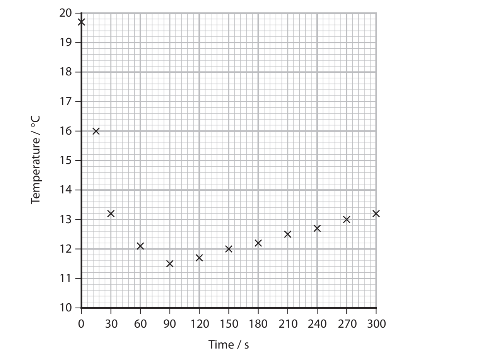
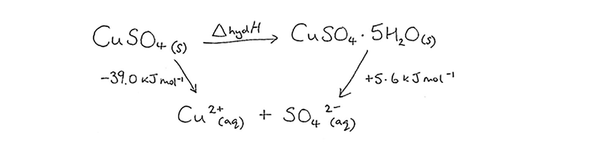
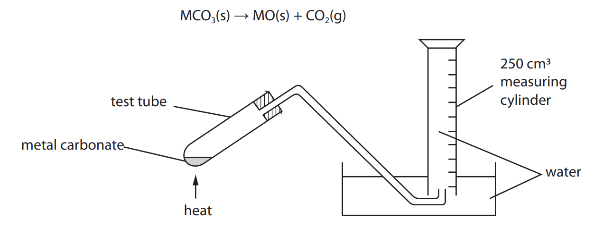
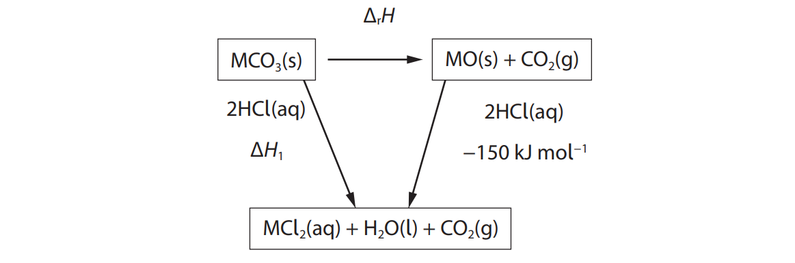
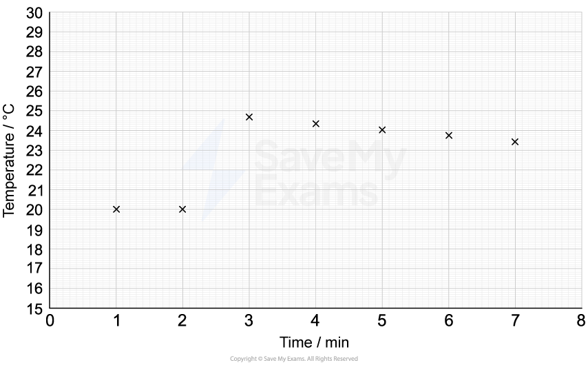

# Exam Questions — Physical Chemistry Core Practicals
**3. Practical Skills in Chemistry I** · Edexcel International A Level (IAL) Chemistry (YCH11)
> Source: [https://www.savemyexams.com/international-a-level/chemistry/edexcel/17/topic-questions/3-practical-skills-in-chemistry-i/3-1-physical-chemistry-core-practicals/structured-questions/](https://www.savemyexams.com/international-a-level/chemistry/edexcel/17/topic-questions/3-practical-skills-in-chemistry-i/3-1-physical-chemistry-core-practicals/structured-questions/) · 10 questions · total 106 marks

## Q1 — medium — 14 marks · structured-questions

### 1((a)) — 3 marks — command: multiple — structured — from paper Jan 2022 · WCH13/01
This question is about ammonium chloride, NH4Cl, a soluble ionic compound.

An aqueous solution of NH4Cl contains both ammonium ions, N$H_{4}^{+}$, and chloride ions, Cl–.

i) State what would be **seen** on the addition of acidified silver nitrate solution to an aqueous solution of NH4Cl.

**(1)**

ii) Describe a test to confirm the presence of N$H_{4}^{+}$ ions in a solution of NH4Cl. Include the result of the positive test.

**(2)**

### 1((b)) — 7 marks — command: multiple — structured — from paper Jan 2022 · WCH13/01
A student investigated the enthalpy change when dissolving NH4Cl in excess water.

NH4Cl (s) + aq → N$H_{4}^{+}$ (aq) + Cl− (aq)

**Procedure**

| Step **1** | Accurately weigh 7.17 g of NH4Cl into a glass beaker. |
|---|---|
| Step **2** | Fill a 50 cm3 measuring cylinder with deionised water. Measure the temperature of the water using a thermometer. |
| Step **3** | Pour the water from the measuring cylinder into the beaker and at the same time start a stopwatch. Stir the solution in the beaker, using the thermometer. |
| Step **4** | Record the temperature at 15 s, 30 s and then at 30 s intervals while continuing to stir the solution. |

The data from the experiment are shown on the graph.

i) Give **two **reasons why the student stirred the solution in Steps **3 **and **4**.

**(2)**

ii) Use the graph to determine the maximum temperature change, Δ*T*, in this experiment. You **must** show your working on the graph.

**(2)**

iii) Another student carried out the experiment using a polystyrene cup in place of the glass beaker.

Explain how this student’s graph would be different. You may annotate the graph as part of your answer.

**(3)**

### 1((c)) — 4 marks — command: multiple — structured — from paper Jan 2022 · WCH13/01
The experimental results of another student were used in the equation shown to calculate the enthalpy change, Δ*H*, for dissolving one mole of NH4Cl in excess water.

Δ*H* = $\frac{m\timesc\times\DeltaT}{n}$ = +14500 J mol–1

In the equation
m = mass of solution = 50 g
c = specific heat capacity of water = 4.18 J g–1 °C–1
Δ*T* = maximum temperature change of solution
*n* = moles of NH4Cl

i) State **two** assumptions made in this calculation. You do **not** need to justify your answers.

**(2)**

ii) The total percentage uncertainty in this experiment was 2.6%. Show that the enthalpy change of 14.5 kJ mol–1 is consistent with a data book value of 14.8 kJ mol–1

**(2)**

## Q2 — medium — 15 marks · structured-questions

### 2((a)) — 3 marks — command: multiple — structured — from paper Jan 2021 · WCH13/01
Sodium hydroxide solution reacts with carbon dioxide in the air and should be standardised before use. Ethanedioic acid may be used for this standardisation.

A standard solution of ethanedioic acid, (COOH)2 , is prepared.

- 2.40 g of solid ethanedioic acid is dissolved in approximately 100 cm3 of deionised water in a beaker.
- The solution is transferred into a 250.0 cm3 volumetric flask and made up to the mark with deionised water.

i) Give a possible reason why any solution remaining in the beaker is washed into the volumetric flask before making up to the mark.

**(1)**

ii) Calculate the concentration of this standard solution of ethanedioic acid in mol dm–3.

Give your answer to an appropriate number of significant figures.

[Molar mass of ethanedioic acid = 90.0 g mol−1] **(2)**

### 2((b)) — 7 marks — command: multiple — structured — from paper Jan 2021 · WCH13/01
A **different** standard solution of ethanedioic acid is used to determine the concentration of a sodium hydroxide solution J.

**Procedure**

| Step **1** | A burette is rinsed with deionised water. |
|---|---|
| Step **2** | The burette is then rinsed with 0.0900 mol dm–3 ethanedioic acid and filled with this acid solution. |
| Step **3** | A pipette is used to transfer 25.0 cm3 portions of solution **J **to conical flasks. |
| Step **4** | The portions are titrated with the ethanedioic acid solution using phenolphthalein indicator. |

i) Explain why the burette is rinsed with ethanedioic acid solution in Step **2**.

**(1)**

ii) The diagram shows how the student read the filled pipette in Step **3**.

Identify the **two** mistakes the student made.

**(2)**

iii) The student completely emptied the pipette for each transfer in Step **3**.

Explain the effect **on the titre** of completely emptying the pipette rather than leaving a small amount of solution in the tip.

**(2)**

iv) State the colour change in the conical flask at the end-point.

**(2)**

From ..............................................to .............................................

### 2((c)) — 5 marks — command: calculate — structured — from paper Jan 2021 · WCH13/01
The titration results are shown.

| **Titration** | **1** | **2** | **3** |
|---|---|---|---|
| Final reading / cm3 | 25.05 | 26.60 | 25.50 |
| Initial reading / cm3 | 0.00 | 2.00 | 1.00 |
| Titre / cm3 |   |   |   |
| Titres used in calculation of mean |   |   |   |

i) Complete the table and calculate the mean titre.

**(2)**

ii) Calculate the concentration of the sodium hydroxide solution in mol dm–3. 
The equation for the titration is

(COOH)2+ 2NaOH → (COONa)2 + 2H2O

**(3)**

## Q3 — medium — 8 marks · structured-questions

### 3((a)) — 3 marks — command: plot — structured — from paper Oct 2021 · WCH13/01
A student carried out experiments to determine the enthalpy change for the hydration of anhydrous copper(II) sulfate, CuSO4, to form hydrated copper(II) sulfate crystals, CuSO4∙5H2O.

To find the enthalpy change of solution of anhydrous copper(II) sulfate, 25.0 cm3 of distilled water was placed in a polystyrene cup and the temperature measured at one minute intervals.

After 2.5 minutes, 7.50 g of anhydrous copper(II) sulfate was added and the mixture stirred continuously.

The results are shown.

| **Time/minutes** | 0 | 1 | 2 | 2.5 | 3 | 4 | 5 | 6 | 7 | 8 |
|---|---|---|---|---|---|---|---|---|---|---|
| **Temperature/°C** | 21.1 | 21.0 | 21.0 | X | 34.2 | 37.6 | 36.9 | 36.1 | 35.2 | 34.3 |

Plot a graph of temperature against time on the grid.

### 3((b)) — 2 marks — command: determine — structured — from paper Oct 2021 · WCH13/01
Determine the maximum temperature change, Δ*T,* using your graph.

You **must** show your working on the graph.

Δ*T* = ..............................................................

### 3((c)) — 1 mark — command: give — structured — from paper Oct 2021 · WCH13/01
The value of the enthalpy change from this experiment was −39.0 kJ mol−1.

Give **one **possible reason why this value is different from a data book value of −61.4 kJ mol−1

### 3((d)) — 2 marks — command: multiple — structured — from paper Oct 2021 · WCH13/01
After another experiment to find the enthalpy change of solution of hydrated copper(II) sulfate crystals, the student constructed the Hess cycle shown.

i) Calculate the enthalpy change of hydration for the conversion of anhydrous copper(II) sulfate to hydrated copper(II) sulfate crystals.

**(1)**

ii) Give **one** possible reason why the enthalpy change of hydration in (d)(i) could **not** be found directly by experiment.

**(1)**

## Q4 — medium — 11 marks · structured-questions

### 3((a)) — 2 marks — command: state — structured — from paper June 2021 · WCH13/01
A saturated solution of barium hydroxide was formed by adding barium oxide to water until no more would dissolve. The equation for the reaction is

BaO (s) + H2O (l) → Ba(OH)2 (aq)

The resulting mixture was filtered to remove excess solid.

The concentration of the barium hydroxide solution was found by titrating portions of the saturated solution with hydrochloric acid of known concentration. 

10.0 cm3 portions of the saturated barium hydroxide solution were placed in conical flasks and titrated with 0.200 mol dm−3 hydrochloric acid added from a burette.

Three drops of methyl orange indicator were added to the solution in each conical flask.

State the colour **change** observed at the end-point of the titration.

From .................................................... to ....................................................

### 3((b)) — 7 marks — command: multiple — structured — from paper June 2021 · WCH13/01
Some of the results are shown.

| **Titration** | **1** | **2** | **3** | **4** |
|---|---|---|---|---|
| Final burette reading/ cm3 | 22.60 | 44.45 | 23.05 |   |
| Initial burette reading/ cm3 | 0.10 | 22.60 | 1.25 | 23.20 |
| Titre/ cm3 | 22.50 | 21.85 |   | 21.90 |

i) Complete the table.

**(1)**

ii) Give a reason why the first titre should **not** be used to calculate the mean titre.

**(1)**

iii) Calculate the number of moles of hydrochloric acid in the mean titre.

**(2)**

iv) The equation for the reaction in the titration is

Ba(OH)2(aq) + 2HCl(aq) → BaCl2(aq) + 2H2O(l)

Calculate the concentration of barium hydroxide, in g dm−3, giving your answer to an appropriate number of significant figures.

**(3)**

### 3((c)) — 1 mark — command: give — structured — from paper June 2021 · WCH13/01
Solid samples of soluble barium compounds such as barium oxide are toxic by inhalation due to the presence of barium ions.

Give a safety precaution that should be used to minimise this risk when adding barium oxide to water.

### 3((d)) — 1 mark — command: give — structured — from paper June 2021 · WCH13/01
Barium also forms a peroxide. A bottle of barium peroxide has the hazard symbol .

Give the meaning of this symbol.

## Q5 — medium — 9 marks · structured-questions

### 3() — 1 mark — command: give — structured — from paper Jan 2021 · WCH13/01
This question is about the thermal decomposition of Group 2 carbonates.

A student heated a sample of a Group 2 carbonate until no more gas was produced. The equation for the decomposition is

Give a reason why the delivery tube must be removed from the water bath before removing the test tube from the heat source.

### 3((b)) — 5 marks — command: multiple — structured — from paper Jan 2021 · WCH13/01
The results of the experiment are shown.

| **Measurement** | **Value** |
|---|---|
| Volume of carbon dioxide / cm3 | 95 |
| Mass of test tube + carbonate / g | 21.69 |
| Mass of test tube / g | 21.36 |
| Mass of carbonate / g | 0.33 |

i) Using the results of the experiment identify the Group 2 metal.

[Molar volume of gas at room temperature and pressure = 24.0 dm3 mol−1 ]

**(3)**

ii) The student suggested that the experiment could be made more accurate by increasing the mass of carbonate from 0.33 g to 1.00 g.

No changes to the size of the apparatus or the method of measurement of the gas produced would be made.

Comment on this suggestion.

**(2)**

### 3((c)) — 3 marks — command: calculate — structured — from paper Jan 2021 · WCH13/01
The enthalpy change for the thermal decomposition of a carbonate, Δr*H* , is difficult to measure directly.

An example of a Hess’s Law cycle to determine it indirectly is

In an experiment to determine Δ*H*1 , 0.050 mol of MCO3 was placed in a 100 cm3 beaker. 60 cm3 of 2 mol dm−3 hydrochloric acid (an excess) was added and the mixture stirred. The maximum temperature rise measured was 6.0 °C. [Heat capacity of solution produced = 4.18 J g−1 °C−1 Density of solution = 1.0 g cm−3 ]

i) Calculate the enthalpy change, Δ*H*1 , for the reaction between MCO3 and hydrochloric acid in kJ mol−1. 
Include a sign with your answer.

**(2)**

ii) Using your answer to (c)(i), calculate the enthalpy change, Δr*H* , for the thermal decomposition of this Group 2 carbonate in kJ mol−1.

Include a sign with your answer.

**(1)**

## Q6 — medium — 9 marks · structured-questions

### 5((a)) — 1 mark — command: complete — structured — from paper Oct 2021 · WCH13/01
A technician found a bottle of sodium hydroxide solution at the back of a cupboard. The technician determined its concentration by titrating 25.0 cm3 samples against 0.500 mol dm−3 hydrochloric acid from a burette.
The results obtained are shown.

Complete the titre values.

|   |   | **Titration number** |   |   |   |
|---|---|---|---|---|---|
|   | **Rough** | **1** | **2** | **3** | **4** |
| **Final reading / cm****3** | 24.90 | 21.25 | 42.85 | 21.80 | 43.15 |
| **Initial reading / cm****3** | 2.30 | 0.00 | 21.25 | 0.50 | 21.80 |
| **Titre/ cm****3** |   |   |   |   | 21.35 |

### 4((b)) — 5 marks — command: multiple — structured — from paper Oct 2021 · WCH13/01
i) State why the value from Titration 2 was **not** used to calculate the mean.

**(1)**

ii) Calculate the concentration of the sodium hydroxide solution in mol dm−3.

**(4)**

### 5((c)) — 1 mark — command: calculate — structured — from paper Oct 2021 · WCH13/01
Each reading of the burette has an uncertainty of ±0.05 cm3

Calculate the percentage uncertainty in Titration 4.

### 5((d)) — 2 marks — command: state — structured — from paper Oct 2021 · WCH13/01
State the colour change that would be seen at the end-point in this titration using phenolphthalein as the indicator.

From ............................................. to ..........................................

## Q7 — medium — 11 marks · structured-questions

### 1() — 1 mark — command: state — structured
A student investigates the molar volume of carbon dioxide by reacting different masses of an unknown Group 2 carbonate, MCO3, with excess hydrochloric acid. The gas is collected in an inverted measuring cylinder over water.

The student records the following results.

| Mass of MCO3 / g | Volume of CO2 collected / cm3 |
|---|---|
| 0.10 | 16.5 |
| 0.20 | 32.0 |
| 0.30 | 49.0 |
| 0.40 | 64.5 |
| 0.50 | 81.5 |
| 0.60 | 97.0 |

State one observation made when MCO3 is added to excess hydrochloric acid.

### 2() — 3 marks — command: complete — structured
Complete a graph of the results from part (a) by:

- plotting the points
- labelling the axes
- including a straight line of best fit.

### 3() — 5 marks — command: calculate — structured
Calculate the gradient of the line of best fit. You must show your working on the graph.

Use your value for the gradient to calculate the relative formula mass of MCO3. Hence identify the Group 2 metal, M.

[Molar volume of a gas at room temperature and pressure = 24 000 cm3 mol-1]

### 4() — 2 marks — command: justify — structured
The student notices that the volumes of CO2 collected are consistently lower than expected.

Suggest one modification to the apparatus that would give a more accurate result. Justify your answer.

## Q8 — hard — 10 marks · structured-questions

### 3((a)) — 2 marks — command: multiple — structured — from paper Jan 2022 · WCH13/01
A student used a precipitation titration to determine the value of** x** in the formula of a sample of hydrated barium chloride, BaCl2 ∙**x**H2O.

**Procedure**

| Step **1** | Prepare a solution by dissolving 1.57 g of BaCl2 ·**x**H2O in deionised water, making the solution up to the mark in a 250.0 cm3 volumetric flask and then mixing thoroughly. |
|---|---|
| Step **2** | Use a pipette to transfer 10.0 cm3 of the barium chloride solution into a conical flask. Add excess sodium sulfate solution and swirl the mixture. |
| Step **3** | Fill a burette with 0.0324 mol dm–3 silver nitrate solution. |
| Step **4 ** | Add three drops of potassium chromate(VI) solution to the conical flask and titrate the contents, while swirling, with the silver nitrate solution. The end-point is shown by the appearance of a permanent pale red precipitate. |
| Step **5** | Repeat Steps **2** to **4** until concordant results are obtained. |

During the titration, two precipitation reactions occur.

| Reaction **1** | Silver ions react with chloride ions forming silver chloride. |
|---|---|

Ag+ (aq) + Cl–  (aq) → AgCl (s)

| Reaction **2** | Once all chloride ions have reacted, silver ions react with chromate(VI) ions to form a red precipitate of silver chromate(VI). |
|---|---|

2Ag+ (aq) + Cr$O_{4}^{2-}$ (aq) → Ag2CrO4 (s)

i) Give the **ionic** equation for the reaction that occurs when sodium sulfate solution is added to the conical flask in Step** 2**. Include state symbols.

**(1)**

ii) Give a possible reason why it is necessary to add sodium sulfate solution. Justify your answer.

**(1)**

### 3((b)) — 1 mark — command: suggest — structured — from paper Jan 2022 · WCH13/01
Suggest why the red precipitate of silver chromate(VI) only forms after all the chloride ions have reacted.

### 3((c)) — 7 marks — command: multiple — structured — from paper Jan 2022 · WCH13/01
Some data obtained in the experiment are shown.

| **Titration number** | 1 | 2 | 3 | 4 |
|---|---|---|---|---|
| **Burette reading (final) / cm****3** | 16.15 | 32.05 | 48.30 | 47.40 |
| **Burette reading (initial) / cm****3** | 0.00 | 16.15 | 32.50 | 31.55 |
| **Titre / cm****3** | 16.15 |   |   |   |

i) Complete the table and use the concordant results to calculate the mean titre.

**(2)**

ii) Determine the value of **x** in the formula of the hydrated salt, BaCl2 ·**x**H2O. Use information from the procedure and your mean titre from (c)(i). 
You **must **show your working.

**(5)**

## Q9 — hard — 10 marks · structured-questions

### 1() — 2 marks — command: determine — structured
A student investigates the enthalpy of solution of anhydrous nickel(II) sulfate.

Anhydrous NiSO4 is a yellow solid. When dissolved in water it forms a pale green solution.

The student places 100.0 cm3 of water in a polystyrene cup and records its temperature every minute. At *t* = 2.0 min, the student adds 3.87 g of anhydrous NiSO4 and stirs until it has fully dissolved. The student continues to record the temperature every minute.

The data from the experiment are shown on the graph.

Determine the maximum temperature change, Δ*T*, for this reaction, using the graph. You must show your working on the graph.

### 2() — 3 marks — command: calculate — structured
Calculate the enthalpy change of solution, Δ*H*sol, for anhydrous NiSO4. Give your answer to an appropriate number of significant figures. Include a sign and units in your answer.

Data:

- Specific heat capacity of the solution = 4.18 J g-1 °C-1
- Density of the solution = 1.00 g cm-3
- *M*r(NiSO4) = 154.8

### 3() — 2 marks — command: calculate — structured
The Hess cycle below relates the enthalpy changes for the dissolution of anhydrous and hydrated nickel(II) sulfate.

Calculate the enthalpy change of hydration of anhydrous nickel(II) sulfate, Δ*H*hyd, using the Hess cycle and your answer from (b). Include a sign and units.

### 4() — 1 mark — command: state — structured
State one assumption, other than the density and specific heat capacity of the solution, that was made when calculating the enthalpy change in (b).

### 5() — 2 marks — command: justify — structured
Another student carried out the same experiment but used a glass beaker instead of a polystyrene cup.

State how this would affect the calculated value of the enthalpy change of solution. Justify your answer.

## Q10 — hard — 9 marks · structured-questions

### 1() — 4 marks — command: describe — structured
Describe the steps a student should take to make 250.0 cm3 of a standard solution of ethanedioic acid as accurately as possible.

Assume that the student is supplied with 3.15 g of ethanedioic acid dihydrate in a weighing bottle and the usual laboratory glassware.

### 2() — 2 marks — command: calculate — structured
Calculate the concentration of the standard solution of ethanedioic acid in mol dm-3. Give your answer to an appropriate number of significant figures.

[Molar mass of ethanedioic acid dihydrate = 126.1 g mol–1]

### 3() — 3 marks — command: calculate — structured
The standard solution was prepared by weighing the ethanedioic acid by difference. The uncertainty in each reading of the balance is ±0.005 g. The uncertainty of the 250.0 cm3 volumetric flask is ±0.20 cm3.

Calculate the percentage uncertainty in the concentration of the standard solution.
