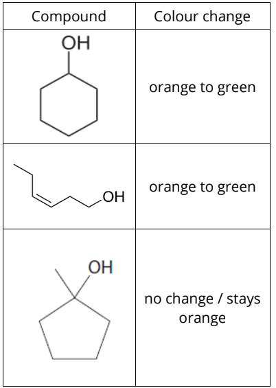
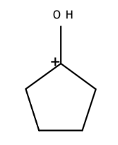
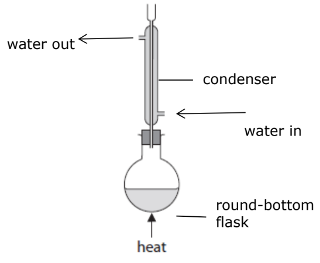
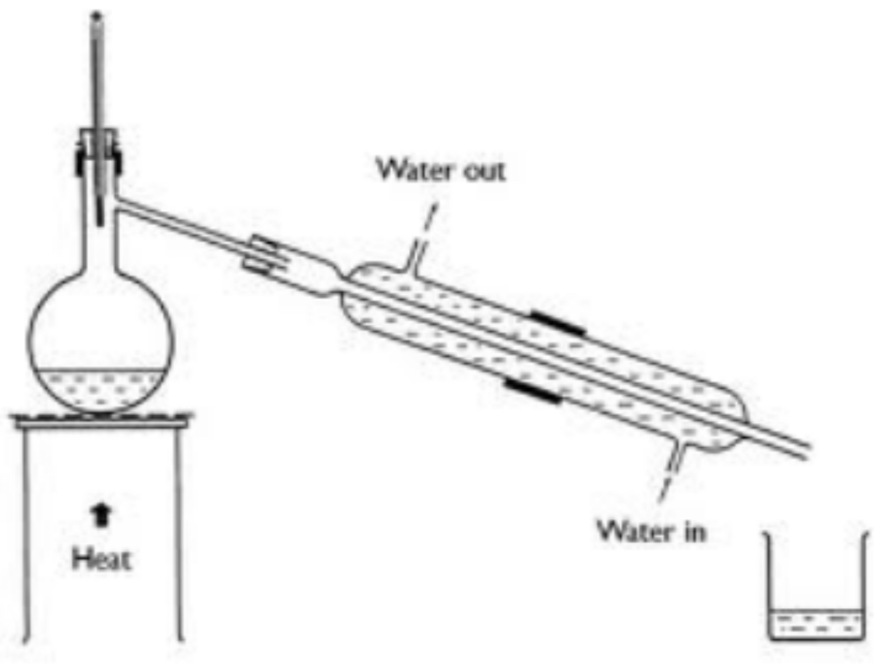

# Mark Schemes — Inorganic & Organic Chemistry Core Practicals
**3. Practical Skills in Chemistry I** · Edexcel International A Level (IAL) Chemistry (YCH11)

## Q1 — easy — 10 marks · structured-questions

### 1((a)) — 2 marks
A test for the strontium cation and the expected result is:

- Flame test; **[1 mark]**
- Red / crimson colour; **[1 mark]**

**[Total: 2 marks]**

- *You can also give a description of the flame test for the first mark *
- *Be very specific about the flame colour*

  - *You will not score the mark for brick red, yellow red or orange *
- *An alternative test and result which will score 1 mark is to add sulfate solution with a white precipitate forming *

### 1((b)) — 2 marks
The completed table is:

| **Reagent added for test** | **Expected result for the** **strontium chloride solution** |
|---|---|
| Barium chloride acidified with hydrochloric acid | no reaction; **[1 mark]** |
| Silver nitrate acidified with nitric acid | white precipitate; **[1 mark]** |

**[Total: 2 marks]**

- *Barium chloride is used as a test for sulfate ions so will have no reaction with strontium chloride *
- *The silver nitrate will react with the solution to form a white precipitate of silver chloride: *

  - *Ag**+** (aq) + Cl**-** (aq)  →  AgCl (s)*
  - *The precipitate can also be described as a solid, or crystals to achieve the mark *

### 1((c)) — 1 marks
This decomposition is unlikely to be possible in a school laboratory because:

- Suitable suggestion relating to the high temperature required; **[1 mark] **
*E.g. Bunsen burners will not be hot enough, better equipment will be required to reach the correct temperature*

**[Total: 1 mark]**

- *The temperature at which this decomposition occurs is given in the question*

  - *Use common sense to deduce that it is unlikely that school equipment such as a Bunsen burner will be able to reach these temperatures *
  - *Any indication that a **very high temperature** **is needed will score the mark *

### 1((d)) — 5 marks
i) To ensure the strontium nitrate decomposes fully:

- Heat and reweigh to constant mass; **[1 mark]**

ii) The colour of nitrogen dioxide gas is:

- Brown; **[1 mark]**

iii) The test for oxygen and the expected positive result:

- Relights a glowing splint;**[1 mark]**

iv) One observation for the reaction that takes place, and identification of the product of the reaction by name or formula:

Observation

Any **one **from:

- Solid dissolves / forms a colourless solution; **[1 mark]**
- Solid disappears; **[1 mark]**
- Gets warmer; **[1 mark]**
- Steam given off; **[1 mark]**
- Sizzling sound; **[1 mark]**

Product

- Strontium hydroxide / Sr(OH)2; **[1 mark]**

**[Total: 5 marks]**

- *Other options for part i) include:*

  - *no more brown gas given off*
  - *no more NO**2** given off*
  - *no longer relights a glowing splint*
- *You are expected to know how to test for common gases such as oxygen, hydrogen, and carbon dioxide*
- *The solid residue can be identified in the equation by its state symbol, s, which is SrO, a Group 2 oxide*

  - *When a Group 2 oxide is added to water, a very exothermic reaction occurs, with the oxide dissolving to form a hydroxide, an alkaline solution*

## Q2 — easy — 10 marks · structured-questions

### 1((a)) — 6 marks
i) A material from which the flame test wire could be made is:

- Nichrome / nickel-chromium (alloy) / NiCr / platinum / Pt; **[1 mark]**
- (Because it) is inert / does not react / does not give a flame colour
**OR**
Does not react with HCl
**OR**
It has a high melting temperature / does not melt in the flame; **[1 mark]**

ii) To carry out a flame test on a solid, and the expected flame colour for each of these compounds:

- Use of hydrochloric acid; **[1 mark]**
- Description of method, e.g. (wire then) dipped in solid / paste / solution
**AND**
Placed in (hot / roaring / colourless / blue-cone) (Bunsen) **flame**; **[1 mark]**
- Flame colour of sodium: yellow / gold / golden; **[1 mark]**
- Flame colour of potassium: Lilac; **[1 mark]**

**[Total: 6 marks]**

- *You would not be awarded a mark for nickel or chromium for the metal from which the flame test wire could be made*
- *You should be able to give the details of how to carry out a flame test, including reasons for each step*
- *You would be awarded a mark for mentioning HCl, e.g. cleaning the wire or mixing solid and acid or making a paste/solution*
- *If you gave both correct flame colours but did not identify from which metal they came from, or you reversed the colours, you would score 1 out of the 2 marks*
- *Orange, yellow-orange or any combination of the allowed colours for sodium would be allowed, however, you would not score a mark for stating purple for the flame colour of potassium*

### 1((b)) — 4 marks
A **chemical** test for each compound which would confirm the identity of the **anion** and the expected results are:

- **Test for a sulfate:**
Barium chloride (solution) / BaCl2((aq)) **AND **hydrochloric acid / HCl((aq))
**OR**
Barium nitrate (solution) / Ba(NO3)2((aq)) **AND **nitric acid / HNO3((aq));** [1 mark]**
- **Results:**
White precipitate / solid / suspension / ppt / ppte; **[1 mark]**
- **Test for a carbonate:**
Addition of hydrochloric acid / HCl((aq)) / any named acid; **[1 mark]**
- **Results:**
Effervescence / fizzing / bubbles / gas given off which turns limewater cloudy / milky; **[1 mark]**

**[Total: 4 marks]**

- *Exam technique should tell you that you will gain a mark for each of the tests and for each of the positive results of the tests*
- *When testing for sulfate ions, you must not use sulfuric acid, as this would introduce sulfate ions into the sample which would give a false positive result with barium ions*
- *You should know these different tests and their results thoroughly*

## Q3 — medium — 10 marks · structured-questions

### 1((a)) — 7 marks
i) Solution **A** is:

- Nitric acid; **[1 mark] **

ii) Solution **C** is:

- Sodium carbonate; **[1 mark] **

iii) The **ionic** equation for the reaction between solution **A** and solution **C **including state symbols is:

- CO32− (aq) + 2H+ (aq) → CO2 (g) + H2O (l);** [2 marks] **

iv) The three remaining solutions.

- Solution **B** is potassium bromide;** [1 mark] **
- Solution** D** is barium chloride; **[1 mark] **
- Solution **E **is silver nitrate; **[1 mark] **

**Final answer:** **[Total: 7 marks] **

- *For part (i)*

  - *Litmus paper will turn red in acidic solutions and blue in alkaline solutions*
  - *The only acidic solution present in the list is nitric acid as the salts are all neutral *
  - *You can also state the correct formula for nitric acid - HNO**3*
  
    - *If you give the name and formula, they must both be correct, if the formula is wrong you will lose the mark*
- *For part (ii)*

  - *When an acid is added to a carbonate bubbles are seen*
  - *These bubble are carbon dioxide which can be tested for by bubbling through limewater- if the limewater turns cloudy then carbon dioxide is present *
- *For part (iii)*

  - *The ionic equation can be worked out by:*
  - *Writing the full balanced symbol equation *
  
    - *Na**2**CO**3** (aq) + 2HNO**3** (aq) → 2NaNO**3** + CO**2** (g) + H**2**O (l)*
  - *Writing out the ions*
  
    - *2Na**+** (aq) + CO**3**2−** (aq) + 2H**+** (aq) + 2NO**3**-** (aq) → 2Na**+** (aq) + 2NO**3**- **+ CO**2** (g) + H**2**O (l)*
  - *Eliminating spectator ions*
  
    - *2Na**+** (aq) + CO**3**2−** (aq) + 2H**+** (aq) + 2NO**3**-** (aq) → 2Na**+** (aq) + 2NO**3**- **+ CO**2** (g) + H**2**O (l)*
  - *Remember to include state symbols as the question states they are required *
  - *To help, you can remember that all nitrate salts are soluble *
- *For part (iv)*

  - *This part is testing your knowledge of the reactions of the halide ions *
  - *Barium **chloride** will form a white precipitate if mixed with silver nitrate *
  - *Potassium **bromide **will form a cream precipitate is mixed with silver nitrate *
  - *If a yellow precipitate is observed then the halide ion present is iodide *
  - *No reaction will take place between the two halide salts- one will not displace the other as no halogen molecule is present *

### 1((b)) — 3 marks
The completed table is:

| **Cation formula** | **Flame colour** |
|---|---|
| Ba2+ | **AND** Apple green;** [1 mark] ** |
| K+  | **AND **Lilac**; [1 mark] ** |
| Na+ | **AND **Orange yellow; **[1 mark] ** |

**[Total: 3 marks]**

- *You need to know the results for the flame tests for Group 1 and 2 metals*
- *As well as this you must be able to confidently describe the method to carry out a flame test*

## Q4 — medium — 12 marks · structured-questions

### 2((a)) — 2 marks
A chemical test to show the presence of the OH group in all three compounds, including the expected result is:

- (Add a few crystals / small amount of) phosphorus(V) chloride / phosphorus pentachloride / PCl5; **[1 mark]**
- Result: steamy / misty fumes (of HCl) / white fumes; **[1 mark]**

**[Total: 2 marks]**

- *You could say to use thionyl chloride or SOCl**2** but not PCl**3*
- *The addition of phosphoric(V) chloride to alcohols converts them to halogenoalkanes as the hydroxyl group is replaced with a halogen atom*
- *It is also used as a test for alcohols due to the distinctive steamy fumes of HCl*
- *The above test is the expected answer, but there are other tests that you could have used, for which you would gain both marks:*
- *You could have described the formation of an ester:*

  - *Addition of a carboxylic acid / named carboxylic acid and any identified strong acid **OR** Addition of an acyl chloride / named acyl chloride; [1 mark]*
  - *Fruity / glue / characteristic smell of product; [1 mark]*
- *Alternatively, you could describe the addition of sodium:*

  - *Addition of sodium / Na; [1 mark]*
  - *Formation of bubbles / fizzing / formation of a gas which burns with a squeaky pop; [1 mark]*

### 2((b)) — 3 marks
i) A chemical test to show the presence of the carbon-carbon double bond in Z-hex-3-en-1-ol and the expected result is:

- Add bromine water / aqueous bromine / bromine solution; **[1 mark]**
- Results: orange / yellow / brown to colourless; **[1 mark]** 
**OR**
- Potassium manganate(VII) / KMnO4 and sulfuric acid / H2SO4 / potassium permanganate / acidified potassium manganate(VII); **[1 mark]**
- Result: purple to colourless; **[1 mark]**

ii) The observation for the test with 1-methylcyclopentanol is:

- Orange / yellow / brown colour still present
**OR**
Purple colour remains
**OR**
There is no change in colour / it does not decolourise; **[1 mark]**

**[Total: 3 marks]**

- *Either method is acceptable*
- *Whichever method you choose, you would not be given a mark if you used the term clear instead of colourless - they do **not **mean the same thing*
- *You would get the mark if you just said decolourises, instead of giving a specific colour change*
- *Careful**: Whilst you would be allowed the colour red-brown if you specified bromine, however, if you specified to use aqueous bromine / bromine water, this colour would **not** be allowed*

### 2((c)) — 2 marks
The completed table to give the colour changes observed is:

- Any two correct; **[1 mark]**
- Third correct; **[1 mark]**

**[Total: 2 marks]**

- *The first compound is a secondary alcohol, the second is a primary alcohol and the final compound is a tertiary alcohol*

  - *The primary alcohol will be oxidised to an aldehyde, then a carboxylic acid*
  - *The secondary alcohol will be oxidised to a ketone*
  - *The tertiary alcohol will not undergo oxidation*
- *When alcohols are oxidised by acidified potassium dichromate(VII), the orange dichromate ions are reduced to green Cr**3+** ions*
- *If you got the colours reversed (green to orange, green to orange and stays green), you would score 1 mark*
- *You would only be penalised for the omission of the start colour or the use of yellow as the start colour once*

### 2((d)) — 5 marks
i) The wavenumber range and the bond responsible for **one** peak which you would expect to see in the infrared spectra of all three compounds is:

- O-H bond **AND** 3750–3200 (cm−1); **[1 mark]**

ii) The wavenumber range and the bond responsible for **one** peak which you would expect to see in the infrared spectra of only one of the compounds is:

- C=C bond **AND **1669–1645 (cm−1); **[1 mark]**

iii) A reason why there is a peak at *m / z* = 100 in the mass spectra of all three compounds is:

- All three molecular ions have a *m / z* = 100 / all three compounds have a molar mass of 100 (g mol−1); **[1 mark]**

iv) The structures of the **two** species formed when one bond in 1-methylcyclopentanol breaks resulting in the peak at *m/ z* = 85 are:

- |  | ;**[1 mark]** |
|---|---|
- CH3• / CH3 / methyl (radical) / CH3+; **[1 mark]**

**[Total: 5 marks]**

- *All three compounds are alcohols so they should all have a peak associated with O-H stretching in alcohols*
- *The main difference in the second structure is the presence of the C=C double bond which would give this a peak that the other two compounds would not have*
- *If no other mark is awarded in (d)(i) and (d)(ii) 1 mark is given in (d)(ii) for the identification of both bonds **OR **both ranges*
- *There are a number of accepted answers for part (iii) which you would be given credit for:*

  - *This is the molecular ion peak of all three compounds*
  - *This is the molecular mass of all three compounds*
  - *The three compounds are isomers*
  - *The compounds have the same molar mass*
  - *The compounds are C**6**H**12**O / have the same molecular formula*
- *But you would not gain a mark for stating that the compounds have the same molecular ion*
- *In part (iv), you could give the displayed formula or structural formula showing the linked carbons in a ring*
- *The + can be shown anywhere including outside any brackets of the structure*

## Q5 — medium — 9 marks · structured-questions

### 4((a)) — 3 marks
i) The purpose of the anhydrous calcium chloride is

- To absorb / remove water; **[1 mark]**
- (As water) would otherwise react with aluminium chloride / the product; **[1 mark] **

ii) The reason why granules of anhydrous calcium chloride are used rather than powder is:

- To enable gases / chlorine / Cl2 to pass through (easily); **[1 mark] **

**[Total: 3 marks] **

- *It is important to remove the (water) as will react with aluminium as the(reaction with water) would decrease the yield*
- *Using the powdered calcium chloride will prevent the gas passing through properly *

  - *Anhydrous calcium chloride (CaCl**2**) absorbs moisture from the air effectively*
  - *Powder will pack together more tightly and there will be fewer gaps *

### 4((b)) — 3 marks
i) The main hazard related to chlorine gas and best way of minimising it is:

- Toxic / poisonous; **[1 mark] **
- (Perform experiment in a) fume cupboard; **[1 mark] **

ii) A reason why the concentrated hydrochloric acid is added ‘drop by drop’ to the pear-shaped flask is:

- To provide a steady stream of chlorine / gas 
**OR** 
To prevent chlorine / gas being produced too quickly; **[1 mark] **

**Final answer:** **[Total: 3 mark] **

- *For part (ii) you can say to control the rate of reaction OR to control the production of chlorine OR so that the reaction is slow / not too fast OR to prevent vigorous reaction*
- *Chlorine gas being formed in this reaction is a significant risk in this reaction so a fume hood must be used*

  - *When using the fume hood you must always make sure that the window is below the safety line otherwise the suction will not be strong enough to remove any harmful gases being formed*
- *You would not get the mark for part (ii) by saying *

  - *To prevent violent reaction / explosion / breaking flask*
  - *To prevent build-up of pressure*
  - *To prevent (acid) spray / boiling over*
  - *Making reference to an exothermic reaction*
  - *To ensure complete reaction*

### 4((c)) — 1 marks
The heating of the aluminium in Step **3** is delayed by 20 s after the initial production of chlorine gas:

- To allow chlorine to displace air from the apparatus
**OR**
To prevent oxygen reacting with the aluminium
**OR**
To prevent the formation of aluminium oxide;** [1 mark] **

**Final answer:** **[Total: 1 mark] **

- *You can also say*

  - *To fill the apparatus with chlorine (gas)*
  - *To remove all air from the apparatus*
  - *So that the chlorine reaches the aluminium first*
  - *To prevent air from reacting with the aluminium*
  - *So only chlorine reacts with the aluminium*

### 4((d)) — 1 marks
You would know the reaction is complete in Step **3**:

- (When the aluminium) stops glowing; **[1 mark] **

**Final answer:** **[Total: 1 mark] **

- *When you heat magnesium in oxygen in a crucible you know the reaction is finished when the magnesium no longer glows*
- *You can also say*

  - *When all the aluminium / solid has turned white*
  - *When no more aluminium foil remains*

### 4((e)) — 1 marks
The purpose of the potassium hydroxide in the absorption tube

- To absorb (unreacted) chlorine / hydrogen chloride (gas); **[1 mark] **

**Final answer:** **[Total: 1 mark] **

- *Hydrogen chloride gas forms hydrochloric acid when it reacts with water, so this must be removed*
- *Sodium hydroxide is an alkali so can react with acids in a neutralisation reaction *
- *To gain the mark you can also say*

  - *To absorb acidic gases*
  - *To exclude water (from the air)*

## Q6 — medium — 17 marks · structured-questions

### 4((a)) — 2 marks
The percentage yield of 1-bromobutane might be lower if the cold water bath was **not** used in Step **1 **because:

- The reaction is exothermic / vigorous / gives off heat; **[1 mark]**
- The mixture may boil causing reactant / product to escape
**OR**
Butan-1-ol / reactant or 1-bromobutane / product might evaporate
**OR**
The reaction may bubble / fizz / effervesce and overflow the round bottom flask (causing loss of reactant / product); **[1 mark]**

**[Total: 2 marks]**

- *If the percentage yield is lower, it means that the amount of product formed is lower*
- *Cooling a reaction mixture using a water bath is a common method if the reaction is exothermic as it controls the reaction*
- *If the reaction heats quickly, then the mixture may boil and some of the product will escape*
- *You would also gain a mark if you said alkene formation or charring*
- *Any references to equilibrium, rate or any side equations are ignored*

### 4((b)) — 4 marks
i) Stating what must be added to the mixture in the flask before heating in Step **2:**

- Anti-bumping granules; **[1 mark]**

ii) A labelled diagram of the apparatus that you would use to heat the mixture under reflux in Step **2 **is:

- Contains a round bottom / pear shaped flask with contents and any indication of heating; **[1 mark]**
- Contains a vertical condenser with water jacket and correct water flow; **[1 mark]**
- Is a working apparatus: not stoppered, no gaps, a joint between flask and condenser; **[1 mark]**

**[Total: 4 marks]**

- *Anti-bumping granules are used to prevent vigorous boiling caused by the release of large gas bubbles as smaller bubbles form on their surface instead, leading to more even boiling*
- *You can use other names for anti-bumping granules including:*

  - *anti-bumping chips / beads*
  - *boiling stones*
  - *broken porcelain*
  - *boiling chips*

### 4((c)) — 5 marks
i) Sodium hydrogencarbonate solution is added in Step **4**:

- To neutralise / remove (excess sulfuric) acid; [1 mark]

ii) The problem associated with vigours effervescence should be dealt with by:

- Identifies the problem: build-up of pressure (in the separating funnel);
- Gives a solution: open / remove the stopper (with the funnel upright) 
**OR** 
Open the tap (with funnel inverted);

iii) The purpose of the anhydrous calcium chloride used in Step **5 **is:

- Drying agent / to remove water;

iv) The appearance of the organic liquid would change in Step **5 **by:

- Turns from cloudy to clear;

**[Total: 5 marks]**

- *These are common methods used in the purification of organic compounds*
- *You need to know the reasons for each of these steps*
- *In part (i), you need to ensure that you make some reference to an acid, not just 'to neutralise', you would be awarded the mark if you mentioned any of the following: hydrobromic acid / HBr / sodium hydrogensulfate / NaHSO**4** / H**+*
- *In part (ii), saying to remove the stopper to release the pressure would score both marks*
- *In part (iii), you would not be awarded the mark if you stated dehydration*
- *In part (iv), there are a number of ways of wording the change in appearance that would be accepted:*

  - *The solution becomes clear*
  - *It stops being cloudy*
  - *It is no longer turbid*
  - *It is less cloudy / more clear*

### 4((d)) — 1 marks
A suitable temperature **range** for the collection of the pure 1-bromobutane is:

- Lower value 99 / 100 / 101(°C) 
**AND** 
Upper value 103 / 104 / 105 (°C); **[1 mark]**

**[Total: 1 mark]**

- *The question asks for a range, so you must give two values; 1 value, even if it is between the two ends of the range, e.g. 102 °C would not be awarded the mark*
- *The boiling temperature of 1-bromobutane is 102 °C so this temperature must fall within the range*
- *You can give the values to the nearest 0.5 °C, but any other fractions of decimals of degrees other than the nearest 0.5 °C are not accepted*
- *This is because the thermometer has 1 °C graduations, so will only be able to measure to the nearest 0.5 °C*
- *You could give a value for the size of the range around a stated temperature as long as it is within the given values e.g. 3 °C around 102 °C*

### 4((e)) — 5 marks
i) **One** possible reason for the yield being less than 100% is:

Any **one** from:

- Reaction incomplete; **[1 mark]**
- Transfer losses; **[1 mark]**
- Side reactions; **[1 mark]**

ii) The percentage yield that the student expected to obtain is:

Method 1

- Mass of 1-bromobutane required = 20 x 1.27 = 25.4 (g); **[1 mark]**
- Moles of 1-bromobutane required = 25.4 ÷ 137 = 0.18540 (mol); **[1 mark]**
- Mass butan-1-ol required = 0.18540 x 74 = 13.720; **[1 mark]**
- Percentage yield assumed = $\frac{13.720}{21.0}$ x 100 = 65.332 (%); **[1 mark]**

Method 2

- Moles of butan-1-ol used= 21 ÷ 74 = 0.28378 mol; **[1 mark]**
- Mass of 1-bromobutane for 100 % yield = 0.28378 x 137 = 38.878 g; **[1 mark]**
- Volume of 1-bromobutane for 100 % yield = 38.878 ÷ 1.27 = 30.613 (cm3); **[1 mark]**
- % yield if 20 cm3 prepared = $\frac{20}{30.613}$ x 100 = 65.332 (%); **[1 mark]**

**[Total: 5 marks]**

- *The reasons given for why the percentage yield is less than 100% are the main reasons that you should give *
- *The first method is the more common method for calculating the percentage yield*
- *If you obtain the correct answer with some working, you would score full marks*
- *The most common mistake students make with calculating percentage yield is dividing the theoretical yield by the actual yield and ending up with a percentage greater than 100% - check your calculation carefully if this is the case - you would not gain the final mark if your answer is greater than 100%*

## Q7 — medium — 16 marks · structured-questions

### 4((a)) — 10 marks
i) **Two **safety precautions are:

- (Use) gloves; **[1 mark] **
- (Use a) fume cupboard; **[1 mark] **

ii) The product in the organic layer in Step **2** does not mix with the aqueous layer because:

- The product (is a chloroalkane which) only has dipole and / or London forces;** [1 mark]**
- The chloroalkane cannot disrupt/overcome the strong hydrogen bonding forces of water; **[1 mark]**

iii) The tap of the separating funnel must be opened in Step **3** because:

- Pressure / gas / CO2 must be released; **[1 mark] **

iv) Anhydrous sodium sulfate is added to the organic layer in Step** 5** because:

- To remove water / to dry (the product) / as a drying/desiccating agent; **[1 mark] **

v) The apparatus required to distil the product and collect the distillate between 50°C and 52°C in Step **6** is:

- Round (bottomed) / pear shaped flask and heat; **[1 mark] **
- Thermometer bulb in the neck of the flask; **[1 mark]**
- Downward sloping condenser with water in / out correct; **[1 mark]**
- A collecting vessel and apparatus sealed on the left-hand side and open on the right-hand side; **[1 mark] **

**Final answer:** **[Total: 10 marks] **

- *The method of forming a halogenoalkane from an alcohol should be familiar to you as it is one of the core practicals*

  - *For safety precautions you can also say ensure that the laboratory is well-ventilated*
- *For part (ii) you can also gain the marks for:*

  - *London forces: dispersion forces / temporary dipole-induced dipole forces / van der Waals (forces)*
  - *Just water forms hydrogen bonds / H bonds it / product cannot form H bonds with water*
- *When drawing apparatus make sure your diagrams are clearly labelled and all the joints fit together properly preventing any gas from esacaping*

  - *Any vapours should also easily be able to flow through the apparatus*
- *Distillation apparatus should use a pear or round bottomed flask, you will not gain the mark for drawing a conical flask*

### 4((b)) — 3 marks
To calculate the percentage yield:

**Method 1**

- Calculation of moles of alcohol moles of alcohol = $\frac{8}{74}$ = 0.10811; **[1 mark]**
- Calculation of mass of halogenoalkane mass of halogenoalkane = 0.10811 × 92.5 = 10; **[1 mark]**
- Calculation of percentage yield percentage yield = $\frac{100\times2.62}{10}$ = 26.2 (%); **[1 mark] **

**Method 2**

- Calculation of mole ratio 92.5: 74 = 1.25; **[1 mark] **
- Calculation of expected yield 8.00 × 1.25 = 10.0 g; **[1 mark]**
- Calculation of actual yield;  $\frac{2.62}{10.0}$ × 100 = 26.2 (%)**[1 mark] **

**Method 3**

- Calculation of moles of alcohol moles of alcohol = $\frac{8}{74}$ = 0.10811; **[1 mark]**
- Calculation of moles of halogenoalkane moles of halogenoalkane = 2.62 ÷ 92.5 = 0.028324; **[1 mark] **
- Calculation of percentage yield percentage yield = 100 × $\frac{0.028324}{0.10811}$ = 26.2 (%); **[1 mark] **

**[Total: 3 marks] **

- *There are three given methods for this, so use whichever one you find the most straightforward*
- *To calculate percentage yield you can use*

  - *Percentage yield = *$\frac{\mathrm{actual} \mathrm{yield}}{\mathrm{theoretical} \mathrm{yield}}$*x 100 *

### 4((c)) — 3 marks
The results support this conclusion as:

- Rate is inversely proportional to time; **[1 mark] **
- 2-chloro-2-methylpropane is tertiary (and 1-chloro-2-methylpropane is primary) and the tertiary is faster; **[1 mark] **
- 1-chloro-2-methylpropane is a chloroalkane / has a carbon chlorine bond) and 1-bromo-2-methylpropane is a bromo alkane / has a carbon-bromine bond and bromine compound is faster; **[1 mark] **

**Final answer:** **[Total: 3 marks] **

**You can also say**

- *The tertiary halogenoalkane will react the quickest*
- *The primary halogenoalkane react the slowest*
- *The white chloride precipitate is the slowest nucleophilic substitution reaction*

  - *This is because the C-Cl bond has the highest bond enthalpy, so it is the hardest to break and will cause the Cl**-** ions to form the slowest*
- *You can also state: *

  - *Any indication that a shorter time means a faster rate e.g. 2 chloro-2methylpropane is faster/ quicker than 1- chloro- 2-methylpropane*
  - *Tertiary (2-chloro-2 methylpropane) is faster / takes less time (than the primary 1-chloro-2= methylpropane) or reverse argument*
  - *Bromo alkane (in 1-bromo-2 methylpropane) is faster than / takes less time than chloro alkane (in 1-chloro-2 methylpropane) or C—Br faster than C—Cl*

## Q8 — medium — 11 marks · structured-questions

### 1() — 1 marks
> **[mark-scheme]**
> The observation with solution A is:
> 
> - Cream / off-white
> **AND**
> Precipitate / solid **[1 mark]**
> 
> Just "white" and any shade of yellow are not accepted

> **[exam-tip]**
> The precipitate of AgBr is **cream** or **off-white** in Edexcel mark schemes:
> 
> - Pure white is AgCl
> - Yellow is AgI
> 
> You must state both the colour **and** the nature of the precipitate. Writing just 'cream' without the word 'precipitate' is not awarded the mark.

### 2() — 2 marks
The ionic equation is:

Ag+ (aq) + Br- (aq) → AgBr (s)

**[2 marks]**

> **[mark-scheme]**
> 1 mark for correct ionic equation: Ag+ + Br- → AgBr
> 
> 1 mark for all three correct state symbols: (aq), (aq), (s)
> 
> The state symbol mark is dependent on a correct or near-correct equation

> **[exam-tip]**
> The most common mistake is to write the overall equation:
> 
> AgNO3 (aq) +  BaBr2 (aq) → AgBr (s) + Ba(NO3)2 (aq)
> 
> In this reaction, Ba2+ and NO3- are spectator ions that do not take part in the precipitation. So, they do not appear in the ionic equation.
> 
> Do not forget state symbols, as they are a separate mark:
> 
> - Both reactant ions are in aqueous solution (aq)
> - The product is an insoluble solid (s)

### 3() — 2 marks
> **[mark-scheme]**
> The flame test is carried out on solution A by:
> 
> - Dipping a nichrome / platinum / Pt wire into (concentrated) hydrochloric acid / HCl (aq), then into the solution
> **AND**
> Placing it in a roaring / hot / non-luminous (Bunsen) flame **[1 mark]**
> 
> The expected observation is:
> 
> - Green / apple green / pale green flame **[1 mark]**
> 
> A silica rod or nickel-chromium / Ni-Cr wire is accepted instead of nichrome wire
> 
> Acids other than hydrochloric acid are not accepted
> 
> Yellow / luminous flames are not accepted
> 
> 'Blue-green' and 'yellow-green' are not accepted as descriptions of the barium flame colour

> **[exam-tip]**
> The most common mistakes for this question are:
> 
> - Using a wooden splint or an inappropriate wire such as just nickel or just chromium
> 
>   - These would produce flame colours that may mask the observed colour
> - Using the wrong flame
> 
>   - A yellow / luminous would mask the observed colour
> - Not using hydrochloric acid
> 
>   - Other acids may react with the barium bromide or they do not produce  metal chlorides, which are more volatile and produce better flame colours

### 4() — 3 marks
> **[mark-scheme]**
> The condition required for testing with Tollens' reagent is:
> 
> - Warm / heat / place in a (hot) water bath **[1 mark]**
> 
> The expected observations are:
> 
> - Silver mirror / black precipitate / grey solid forms with solution B **[1 mark]**
> - No change / no reaction / remains colourless  with solutions C and D **[1 mark]**
> 
> Allow 'silver deposit' or 'silver coating' as alternatives to 'silver mirror'
> 
> 'No observation' and 'nothing' are not accepted. Answers must state 'no change' or 'no reaction'.

> **[exam-tip]**
> Tollens' reagent tests specifically for **aldehydes**:
> 
> - Ethanal (solution B) contains an aldehyde group and gives a silver mirror.
> - Ethanol (C) and ethanoic acid (D) do not contain an aldehyde group and give no change.
> 
> The test must be carried out under **warm** conditions, usually by warming in a water bath at around 60 °C. The silver mirror will not form at room temperature.
> 
> When recording a negative result, write 'no change'.
> 
> - 'No observation' or 'nothing' are often not allowed and will lose you marks.

### 5() — 3 marks
> **[mark-scheme]**
> To distinguish solution C from solution D:
> 
> Any **one **of the following reagent and observation sets (1 mark for each point):
> 
> Set 1
> 
> - Reagent: Add sodium carbonate / Na2CO3 / sodium hydrogencarbonate / NaHCO3
> - Observation with C: No change / no reaction
> - Observation with D: Effervescence / fizzing / bubbles
> **OR**
> Gas given off / released which turns limewater cloudy / milky
> 
> Set 2
> 
> - Reagent: Warm/heat with acidified potassium dichromate(VI) / K2Cr2O7 + H2SO4
> - Observation with C: (Orange solution) turns green
> - Observation with D: No change / no reaction
> 
> **[3 marks]**
> 
> 'Gas evolves' without specifying effervescence or bubbles is not accepted
> 
> For the dichromate alternative, answers must specify 'acidified'. 'Potassium dichromate(VI)' alone is not accepted.

> **[exam-tip]**
> Two methods are well accepted for this test:
> 
> - Sodium carbonate (or sodium hydrogencarbonate):
> 
>   - CO2 gas is released when the carbonate reacts with the acid.
>   - You will see effervescence with ethanoic acid (D) and no change with ethanol (C).
>   - Write 'effervescence' or 'fizzing'.
>   - Do not write 'gas evolves', as this is often penalised for being too vague.
> - Acidified potassium dichromate(VI) with warming:
> 
>   - The dichromate oxidises the primary alcohol (ethanol) from orange to green.
>   - Ethanoic acid cannot be further oxidised under these conditions, so the solution remains orange.
> 
> Common incorrect answers that examiners comment on are:
> 
> - PCl5 to give misty fumes
> - Sodium metal to give effervescence
> 
> Both of these test for the -OH group generally. This means that they will produce a positive result for both the alcohol and the carboxylic acid

## Q9 — hard — 9 marks · structured-questions

### 1() — 3 marks
The labelled diagram of the apparatus is:

**[3 marks]**

> **[mark-scheme]**
> 1 mark for a round-bottomed or pear-shaped flask containing the reaction mixture **AND **a heat source indicated (label 'heat' or Bunsen burner shown)
> 
> 1 mark for the thermometer with the bulb positioned at the entrance to the side arm / condenser
> 
> 1 mark for the condenser angled downward with cold water entering at the bottom and leaving at the top **AND **an open system (not sealed)
> 
> The following are not accepted:
> 
> - A conical flask as the reaction vessel
> - The thermometer bulb positioned in the reaction mixture
> - Water flowing in at the top of the condenser and out at the bottom
> - A sealed or closed system

> **[exam-tip]**
> Apparatus drawing is one of the most commonly lost mark areas in the practical papers. According to examiner reports, these mistakes are "incredibly common":
> 
> - A closed system:
> 
>   - The collecting vessel must be open to the atmosphere.
>   - Connecting the condenser to a sealed flask with a rubber bung creates a closed pressurised system.
>   - Leave the top of the collecting vessel open or show a gap.
> - Thermometer position:
> 
>   - The thermometer bulb must sit at the side arm junction, level with the entrance to the condenser.
>   - It measures the temperature of the vapour, not the boiling liquid.
> - Condenser water flow:
> 
>   - Cold water enters at the bottom of the condenser and exits at the top.
>   - This ensures that the condenser is filled with cold flowing water.
> - Flask type:
> 
>   - A conical flask is not suitable for distillation.
> 
> All of these errors risk losing a mark in the exam.

### 2() — 1 marks
> **[mark-scheme]**
> The colour change is:
> 
> - From orange to green **[1 mark]**
> 
> Both the initial colour (orange) and the final colour (green) are required in the correct order for this mark

> **[exam-tip]**
> Examiners often comment about how students don't know the colour changes for oxidation reactions:
> 
> - Acidified potassium dichromate(VI) = from orange to green
> - Acidified potassium manganate(VII) = from purple to colourless

### 3() — 2 marks
> **[mark-scheme]**
> To confirm the presence of an aldehyde group in the distillate:
> 
> Any **one **of the following reagent and result pairs (1 mark for each point):
> 
> - Reagent 1: Tollens' reagent / ammoniacal silver nitrate and warm / heat
> - Result 1: Silver mirror 
> **OR**
> Grey / black precipitate
> 
> - Reagent 2: Fehling's solution / Benedict's solution and warm / heat
> - Result 2: Red / brick-red precipitate / solid
> 
> **[2 marks]**
> 
> Allow 'silver deposits' or 'silver coating' as alternatives to 'silver mirror'
> 
> 'Silver solution' or a description of a colour change to the reagent without reference to a silver deposit is not accepted

> **[exam-tip]**
> Examiners often comment about these regular mistakes:
> 
> - Mixing up the tests for aldehydes:
> 
>   - e.g. Tollens' gives a red precipitate, or Fehling's gives a silver mirror. These are the correct reagents with an **incorrect **result.
> - Not mentioning precipitate
> 
>   - e.g. Fehling's turns red, or Tollens' goes silver. These are the correct reagents with an **incomplete **result.
>   - Both reagents produce precipitates / solids
> - Forgetting the conditions:
> 
>   - These tests will not work at room temperature, so they need heating
>   - Many students presumably miss the conditions because they see the question is worth 2 marks. They then give the reagent and result

### 4() — 3 marks
To calculate the theoretical yield of propanal:

- Calculate the moles of propan-1-ol:

moles = $\frac{\mathrm{mass}}{M_{r}}$

moles of propan-1-ol = $\frac{3.60}{60.1}$

moles of propan-1-ol = 0.05990 mol

**[1 mark]**

- Determine the moles of propanal:

  - The molar ratio from the equation is 1:1

moles of propanal = moles of propan-1-ol

moles of propanal = 0.05990 mol

- Calculate the theoretical mass of propanal:

mass = moles x *M*r

theoretical mass of propanal = 0.05990 x 58.1

**[1 mark]**

theoretical mass of propanal = 3.48020 g

theoretical mass of propanal = **3.48 g (to 3 s.f.)**

**[1 mark]**

> **[mark-scheme]**
> 1 mark for moles of propan-1-ol = 0.0599 mol
> 
> 1 mark for theoretical mass = moles × 58.1
> 
> 1 mark for final answer = 3.48 g with correct unit **AND **given to 3 significant figures
> 
> Allow error carried forward if an incorrect molar mass is used in the first step, apply ECF throughout and award the subsequent method marks

> **[exam-tip]**
> This is a straightforward four-step calculation, but the final mark is often lost through premature rounding. Carry at least four significant figures through the intermediate steps and round only at the final answer.
> 
> The 1:1 molar ratio comes directly from the equation: one mole of propan-1-ol produces one mole of propanal. Do not confuse this with the molar masses.
> 
> Your final answer must:
> 
> - Include the unit (g)
> - Be rounded to 3 significant figures
