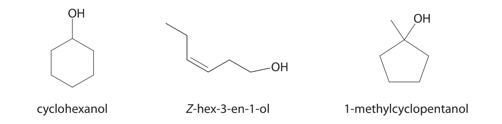
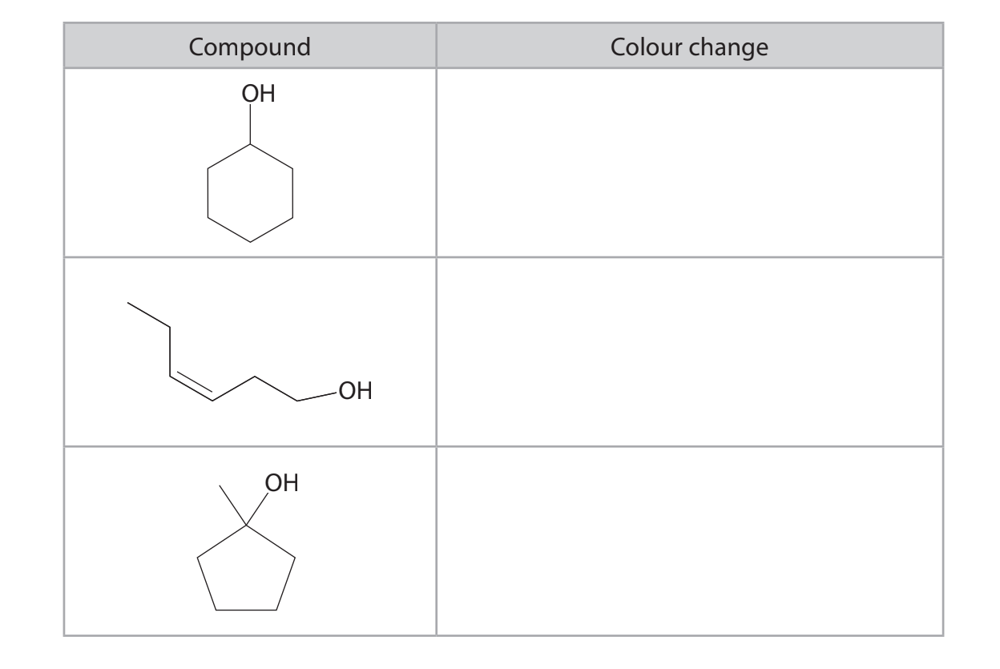
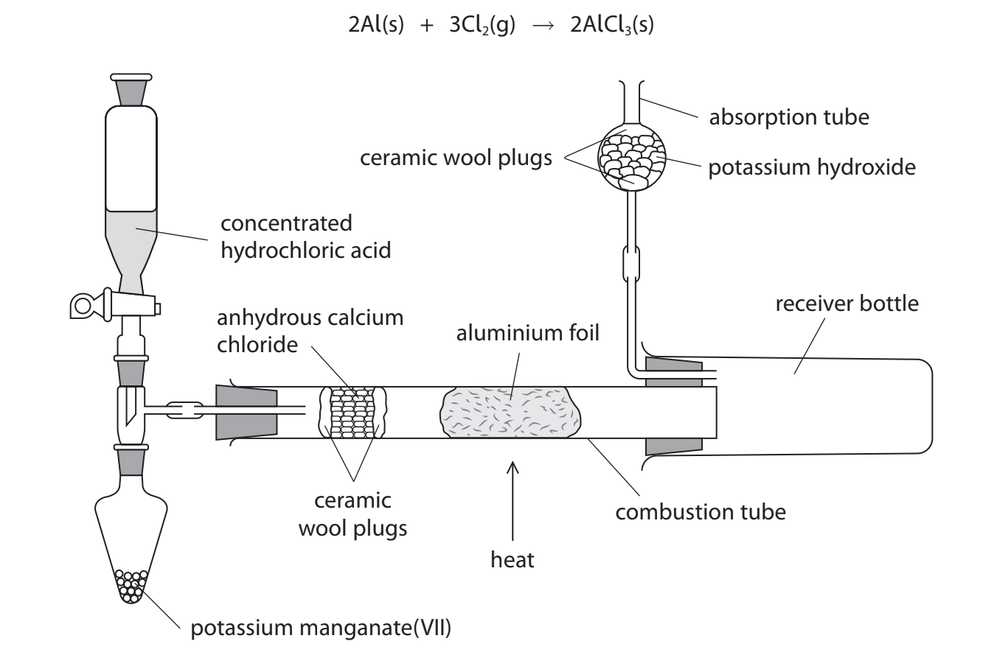
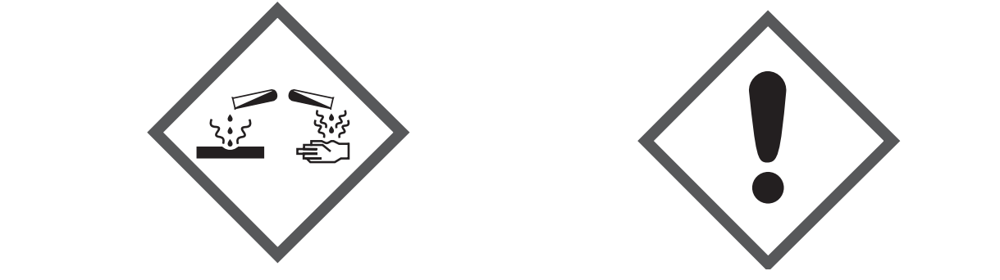

# Exam Questions — Inorganic & Organic Chemistry Core Practicals
**3. Practical Skills in Chemistry I** · Edexcel International A Level (IAL) Chemistry (YCH11)
> Source: [https://www.savemyexams.com/international-a-level/chemistry/edexcel/17/topic-questions/3-practical-skills-in-chemistry-i/3-2-inorganic-and-organic-chemistry-core-practicals/structured-questions/](https://www.savemyexams.com/international-a-level/chemistry/edexcel/17/topic-questions/3-practical-skills-in-chemistry-i/3-2-inorganic-and-organic-chemistry-core-practicals/structured-questions/) · 9 questions · total 104 marks

## Q1 — easy — 10 marks · structured-questions

### 1((a)) — 2 marks — command: state — structured — from paper Oct 2021 · WCH13/01
This question is about some compounds of strontium.

State a test for the strontium cation, giving the expected result.

### 1((b)) — 2 marks — command: complete — structured — from paper Oct 2021 · WCH13/01
An unlabelled bottle was thought to contain solid strontium chloride.

A sample of the solid was dissolved in distilled water for tests to identify the anion.

Complete the table to give the expected results of the anion tests.

| **Reagent added for test** | **Expected result for the** **strontium chloride solution** |
|---|---|
| Barium chloride acidified with hydrochloric acid | .................................................. |
| Silver nitrate acidified with nitric acid | .................................................... |

### 1((c)) — 1 mark — command: suggest — structured — from paper Oct 2021 · WCH13/01
Anhydrous strontium sulfate undergoes thermal decomposition at approximately 1300°C.

SrSO4 (s) → SrO (s) + SO2 (g) + 1⁄2O2 (g)

Suggest why this decomposition is unlikely to be possible in a school laboratory.

### 1((d)) — 5 marks — command: multiple — structured — from paper Oct 2021 · WCH13/01
Anhydrous strontium nitrate decomposes at 570°C.

Sr(NO3)2 (s) → SrO (s) + 2NO2 (g) + 1⁄2O2 (g)

i) Describe how to ensure the strontium nitrate decomposes fully.

**(1)**

ii) State the colour of nitrogen dioxide gas.

**(1)**

iii) Give the test for oxygen and the expected positive result.

**(1)**

iv) The solid residue from the decomposition was added to distilled water.

Give **one** observation for the reaction that takes place, identifying the product of the reaction by name or formula.

**(2)**

Observation

Product

## Q2 — easy — 10 marks · structured-questions

### 1((a)) — 6 marks — command: multiple — structured — from paper June 2021 · WCH13/01
The white solids sodium sulfate and potassium carbonate may be distinguished using a flame test.

i) Identify a material from which the flame test wire could be made.
Justify your answer.

**(2)**

ii) Describe how to carry out a flame test on a solid, giving the expected flame colour for each of these compounds.

**(4)**

### 1((b)) — 4 marks — command: give — structured — from paper June 2021 · WCH13/01
Sodium sulfate and potassium carbonate may also be distinguished using **chemical** tests.

Give a **chemical** test for each compound which would confirm the identity of the **anion.** Include the expected results.

Test 1 .......................................................................................................... Test 2 ...........................................................................................................

## Q3 — medium — 10 marks · structured-questions

### 1((a)) — 7 marks — command: multiple — structured — from paper Jan 2021 · WCH13/01
A student was provided with five test tubes labelled** A, B, C, D **and **E**, each containing a colourless aqueous solution.

The five solutions were known to be

barium chloride

nitric acid

potassium bromide

silver nitrate

sodium carbonate

The student carried out a series of tests to identify which test tube contained which solution.

i) The student tested each solution using universal indicator paper. Only solution **A** turned the paper red.

Identify solution **A.**

**(1)**

ii) The student mixed 1 cm3 of solution **A** separately with 1 cm3 of each of the other solutions.

There was no change for three of the mixtures but effervescence was observed when solution **A **was added to solution **C**.

Identify solution **C**.

**(1)**

iii) Write an **ionic** equation for the reaction between solution **A** and solution **C.** Include state symbols.

**(2)**

iv) The student then mixed 1 cm3 samples of the remaining solutions as shown in **Table 1.**

| **Solutions mixed** | **Observation** |
|---|---|
| **B** and **D** | no change |
| **B** and **E** | cream precipitate |
| **D** and **E** | white precipitate |

**Table 1**

Identify the three remaining solutions.

**(3)**

Solution **B**

Solution **D**

Solution **E**

### 1((b)) — 3 marks — command: complete — structured — from paper Jan 2021 · WCH13/01
Three of the cations in the compounds in (a) can be identified using flame tests.

Complete **Table 2**

| **Cation formula** | **Flame colour** |
|---|---|
|   |   |
|   |   |
|   |   |

**Table 2**

## Q4 — medium — 12 marks · structured-questions

### 2((a)) — 2 marks — command: give — structured — from paper June 2021 · WCH13/01
This question is about the reactions of three compounds with the formula C6H12O.

The compounds are cyclohexanol, Z-hex-3-en-1-ol and 1-methylcyclopentanol.

Give a chemical test to show the presence of the $-$OH group in all three compounds, including the expected result.

### 2((b)) — 3 marks — command: give — structured — from paper June 2021 · WCH13/01
i) Give a chemical test to show the presence of the carbon-carbon double bond in Z-hex-3-en-1-ol, including the expected result.

**(2)**

ii) The test you have given in (b)(i) is repeated with 1-methylcyclopentanol.

Give the observation for this test with 1-methylcyclopentanol.

**(1)**

### 2((c)) — 2 marks — command: complete — structured — from paper June 2021 · WCH13/01
Separate samples of each of these compounds are warmed with acidified potassium dichromate(VI).

Complete the table to give the colour changes observed, if any.

### 2((d)) — 5 marks — command: multiple — structured — from paper June 2021 · WCH13/01
Spectroscopy provides information about the structure of these three compounds. Some infrared data is given in the table.

| **Group** | **Wavenumber range/ cm****−1** |
|---|---|
| O$-$H stretching in alcohols | 3750–3200 |
| O$-$H stretching in carboxylic acids | 3300–2500 |
| C$=$O stretching in aldehydes | 1740–1720 |
| C$=$O stretching in ketones | 1720–1700 |
| C$=$O stretching in carboxylic acids | 1725–1700 |
| C$-$H stretching in aldehydes | 2900–2820  2775–2700 |
| C$=$C stretching in alkenes | 1669–1645 |

i) Identify the wavenumber range and the bond responsible for **one** peak which you would expect to see in the infrared spectra of all three compounds.

**(1)**

ii) Identify the wavenumber range and the bond responsible for **one** peak which you would expect to see in the infrared spectra of only one of the compounds.

**(1)**

iii) Give a reason why there is a peak at *m/ z* = 100 in the mass spectra of all three compounds.

**(1)**

iv) Fragmentation of 1-methylcyclopentanol results in a significant peak at *m/ z *= 85.

Suggest the structures of the **two** species formed when one bond in 1-methylcyclopentanol breaks resulting in the peak at *m/ z* = 85.

**(2)**

## Q5 — medium — 9 marks · structured-questions

### 4((a)) — 3 marks — command: multiple — structured — from paper Jan 2022 · WCH13/01
This question is about the preparation of anhydrous aluminium chloride, AlCl3 , which reacts vigorously with water and must be stored in tightly sealed containers.

A sample of anhydrous AlCl3 was prepared by passing chlorine gas over hot aluminium foil using the apparatus shown.

| Step **1** | Assemble the apparatus with about 5 g of potassium manganate (VII) in the pear-shaped flask, 10 cm3 of concentrated hydrochloric acid in the tap funnel and a known mass of aluminium foil in the combustion tube. |
|---|---|
| Step** 2** | Carefully open the tap of the funnel, allowing the acid to enter the pear-shaped flask drop by drop. Wait for twenty seconds. |
| Step **3** | Heat the aluminium foil until it glows brightly. Continue heating until the reaction is complete. Allow the apparatus to cool before closing the tap of the funnel. |
| Step **4** | Remove the receiver bottle, quickly scrape the product into a sample tube and seal with a lid. |

Granules of anhydrous calcium chloride are held between two ceramic wool plugs in the combustion tube.

i) Explain the purpose of the anhydrous calcium chloride.

**(2)**

ii) Give the reason why granules of anhydrous calcium chloride are used rather than powder.

**(1)**

### 4((b)) — 3 marks — command: multiple — structured — from paper Jan 2022 · WCH13/01
The reaction occurring in Step **2** produces chlorine gas.

i) Identify the main hazard related to chlorine gas, giving the **best **way of minimising the risk when using this gas.

**(2)**

ii) Give a reason why the concentrated hydrochloric acid is added ‘drop by drop’ to the pear-shaped flask. **(1)**

### 4((c)) — 1 mark — command: suggest — structured — from paper Jan 2022 · WCH13/01
Suggest why the heating of the aluminium in Step **3** is delayed by 20 s after the initial production of chlorine gas.

### 4((d)) — 1 mark — command: state — structured — from paper Jan 2022 · WCH13/01
State how you would know the reaction is complete in Step **3**.

### 4((e)) — 1 mark — command: suggest — structured — from paper Jan 2022 · WCH13/01
Suggest the purpose of the potassium hydroxide in the absorption tube.

## Q6 — medium — 17 marks · structured-questions

### 4((a)) — 2 marks — command: suggest — structured — from paper June 2021 · WCH13/01
A sample of 1-bromobutane may be prepared by reacting butan-1-ol with sodium bromide and 50% concentrated sulfuric acid.

C4H9OH + NaBr + H2SO4 → C4H9Br + NaHSO4 + H2O

**Procedure**

| Step **1** | Add suitable quantities of butan-1-ol and sodium bromide solution to a round-bottom flask. Place the flask in a cold water bath. Add concentrated sulfuric acid drop by drop to the flask. |
|---|---|
| Step **2** | Heat the mixture in the flask under reflux for about 45 minutes. |
| Step **3** | Rearrange the apparatus for distillation and distil the reaction mixture. The distillate collected contains 1-bromobutane and water in separate layers. Remove as much of the water layer as possible. |
| Step **4** | Transfer the impure 1-bromobutane to a separating funnel, add sodium hydrogencarbonate solution and shake the mixture. Run off the organic layer into a clean conical flask. |
| Step **5** | Add anhydrous calcium chloride, stopper the flask and allow it to stand. Decant the liquid. |
| Step **6** | Distil the product over a suitable temperature range to give pure 1-bromobutane. |

**Data**

| **Property** | **Butan-1-ol** | **1-Bromobutane** |
|---|---|---|
| Density / g cm−3 | 0.810 | 1.27 |
| Molar mass / g mol−1 | 74 | 137 |
| Boiling temperature / °C | 118 | 102 |

Suggest why the percentage yield of 1-bromobutane might be lower if the cold water bath was **not** used in Step **1**.

### 4((b)) — 4 marks — command: multiple — structured — from paper June 2021 · WCH13/01
i) State what must be added to the mixture in the flask before heating in Step **2.**

**(1)**

ii) Draw a labelled diagram of the apparatus that you would use to heat the mixture under reflux in Step **2**.

**(3)**

### 4((c)) — 5 marks — command: multiple — structured — from paper June 2021 · WCH13/01
Purification of the product occurs in Steps **3–6**.

i) State why sodium hydrogencarbonate solution is added in Step **4.**

**(1)**

ii) Addition of sodium hydrogencarbonate solution in Step **4** causes vigorous effervescence.

Explain how the problem associated with Step **4** should be dealt with.

**(2)**

iii) Give the purpose of the anhydrous calcium chloride used in Step **5**.

**(1)**

iv) State how the appearance of the organic liquid would change in Step **5**.

**(1)**

### 4((d)) — 1 mark — command: give — structured — from paper June 2021 · WCH13/01
For the final distillation in Step **6**, a thermometer with a scale giving readings to the nearest 1°C was provided.

Give a suitable temperature **range** for the collection of the pure 1-bromobutane.

### 4((e)) — 5 marks — command: multiple — structured — from paper June 2021 · WCH13/01
A student was asked to prepare 20 cm3 of 1-bromobutane using the procedure described. The student knew that the percentage yield would be less than 100%.

i) Give **one** possible reason for the yield being less than 100%.

**(1)**

ii) After some research the student decided to use 21.0 g of butan-1-ol to prepare 20 cm3 of 1-bromobutane.

Calculate the percentage yield that the student expected to obtain.

**(4)**

## Q7 — medium — 16 marks · structured-questions

### 4((a)) — 10 marks — command: multiple — structured — from paper Jan 2021 · WCH13/01
The halogenoalkane 2-chloro-2-methylpropane may be prepared from 2-methylpropan-2-ol. **Procedure**

| Step **1** | Add 35 cm3 of concentrated hydrochloric acid to 8.00 g of 2-methylpropan-2-ol in a conical flask. Swirl the mixture gently for 20 minutes. |
|---|---|
| Step **2** | Two distinct layers form. The upper (organic) layer contains the required product. The lower aqueous layer is removed using a separating funnel. |
| Step **3** | Add a solution of sodium hydrogencarbonate to the organic layer. Swirl gently. Stopper the separating funnel and shake it. Invert the separating funnel and open the tap. |
| Step **4** | Return the separating funnel to its upright position, remove the stopper and run off the aqueous layer. Transfer the organic layer into a clean conical flask. |
| Step **5** | Add some anhydrous sodium sulfate. Leave the flask to stand and decant off the liquid. |
| Step** 6** | Distil the liquid, collecting the product between 50°C and 52°C. |

i) The concentrated hydrochloric acid used in Step 1 was labelled

Suggest **two **safety precautions, other than wearing safety spectacles and a laboratory coat, to minimise the risk when using this reagent in Step **1**.

**(2)**

ii) Explain why the product in the organic layer in Step **2** does not mix with the aqueous layer.

**(2)**

iii) State why the tap of the separating funnel must be opened in Step **3**.

**(1)**

iv) State why anhydrous sodium sulfate is added to the organic layer in Step** 5.**

**(1)**

v) Draw the apparatus required to distil the product and collect the distillate between 50°C and 52°C in Step **6**.

**(4)**

### 4((b)) — 3 marks — command: calculate — structured — from paper Jan 2021 · WCH13/01
The equation for the reaction is

(CH3)3COH(l) + HCl(aq) → (CH3)3CCl(l) + H2O(l)

The final product after distillation weighed 2.62 g.

Calculate the percentage yield.

### 4((c)) — 3 marks — command: explain — structured — from paper Jan 2021 · WCH13/01
The choroalkane produced is used in an experiment to compare its rate of hydrolysis with two other halogenoalkanes.

A student dissolves separate 1.0 cm3 samples of each halogenoalkane in ethanol and adds 2 cm3 of silver nitrate solution.

The time taken for a precipitate to form is recorded. The results are shown.

| **Halogenoalkane** | **Time / s** |
|---|---|
| 2-chloro-2-methylpropane | 5 |
| 1-chloro-2-methylpropane | 320 |
| 1-bromo-2-methylpropane | 140 |

The student concludes that both the structure of the halogenoalkane and the identity of the halogen affect the rate of hydrolysis.

Explain how the results support this conclusion.

## Q8 — medium — 11 marks · structured-questions

### 1() — 1 mark — command: state — structured
A student is given four unlabelled solutions. The identity of each solution is shown in the table.

| Solution | Identity |
|---|---|
| A | Barium bromide, BaBr2 |
| B | Ethanal, CH3CHO |
| C | Ethanol, CH3CH2OH |
| D | Ethanoic acid, CH3COOH |

The student adds a few drops of dilute nitric acid followed by a few drops of silver nitrate solution to each solution.

State the observation made when this test is carried out on solution A.

### 2() — 2 marks — command: write — structured
Write the ionic equation for the formation of the precipitate formed in part (a). Include state symbols.

### 3() — 2 marks — command: describe — structured
Describe how a flame test is carried out on solution A, giving the expected observation.

### 4() — 3 marks — command: state — structured
The student tests solutions B, C, and D with Tollens' reagent.

State the condition required for this test and the expected observations for the three solutions.

### 5() — 3 marks — command: identify — structured
Give a chemical test, not including indicators, to distinguish between solution C and solution D. Identify the reagent used and the expected observation for each solution.

Reagent: ..........................................................................................................

Observation with C (ethanol): ...........................................................................

Observation with D (ethanoic acid): ................................................................

## Q9 — hard — 9 marks · structured-questions

### 1() — 3 marks — command: draw — structured
A student prepares propanal by partial oxidation of propan-1-ol using acidified potassium dichromate(VI) solution.

Draw a labelled diagram of the apparatus that is required to prepare and collect a sample of propanal by heating propan‑1‑ol with acidified potassium dichromate(VI)

### 2() — 1 mark — command: give — structured
Give the colour change observed in the flask during this oxidation.

From ........................................ to ........................................

### 3() — 2 marks — command: identify — structured
A chemical test may be used to confirm the presence of an aldehyde in the distillate. Identify the reagent used, giving the positive result of the test.

### 4() — 3 marks — command: calculate — structured
The equation for the formation of propanal is:

CH3CH2CH2OH + [O] → CH3CH2CHO + H2O

The student uses 3.60 g of propan-1-ol with excess acidified potassium dichromate(VI).

Calculate the theoretical yield of propanal in grams. Give your answer to an appropriate number of significant figures.

[*M*r values: propan-1-ol = 60.1; propanal = 58.1]
