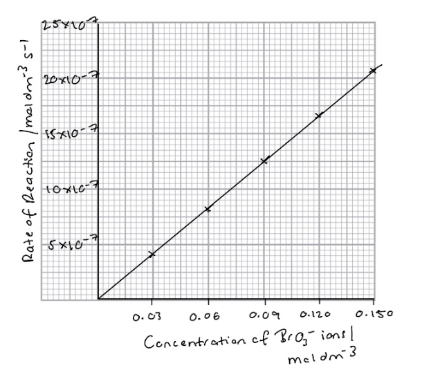
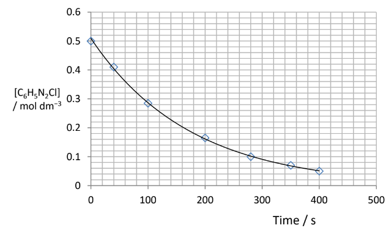
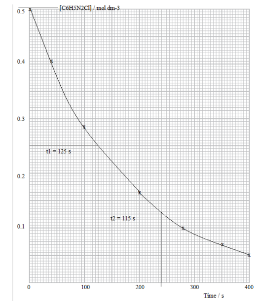
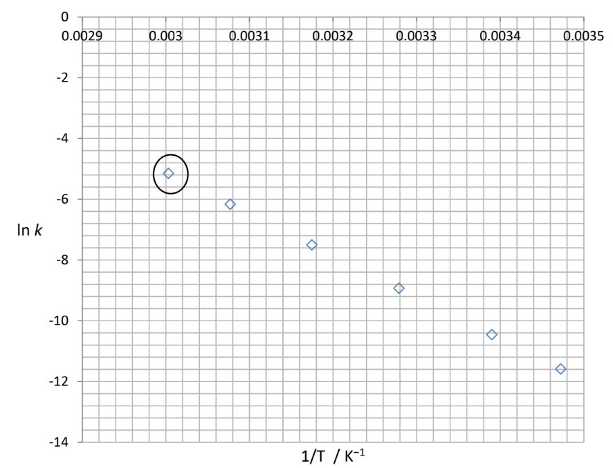
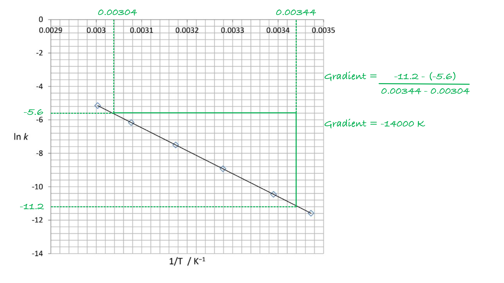
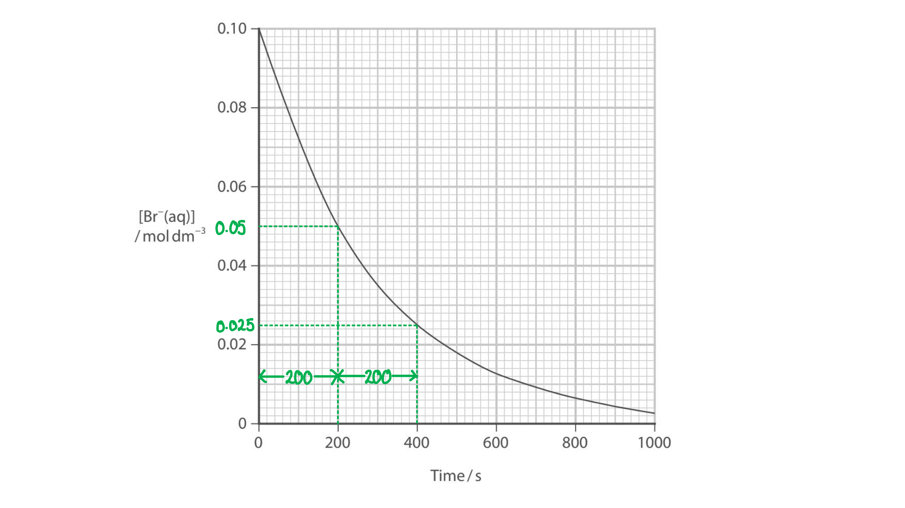
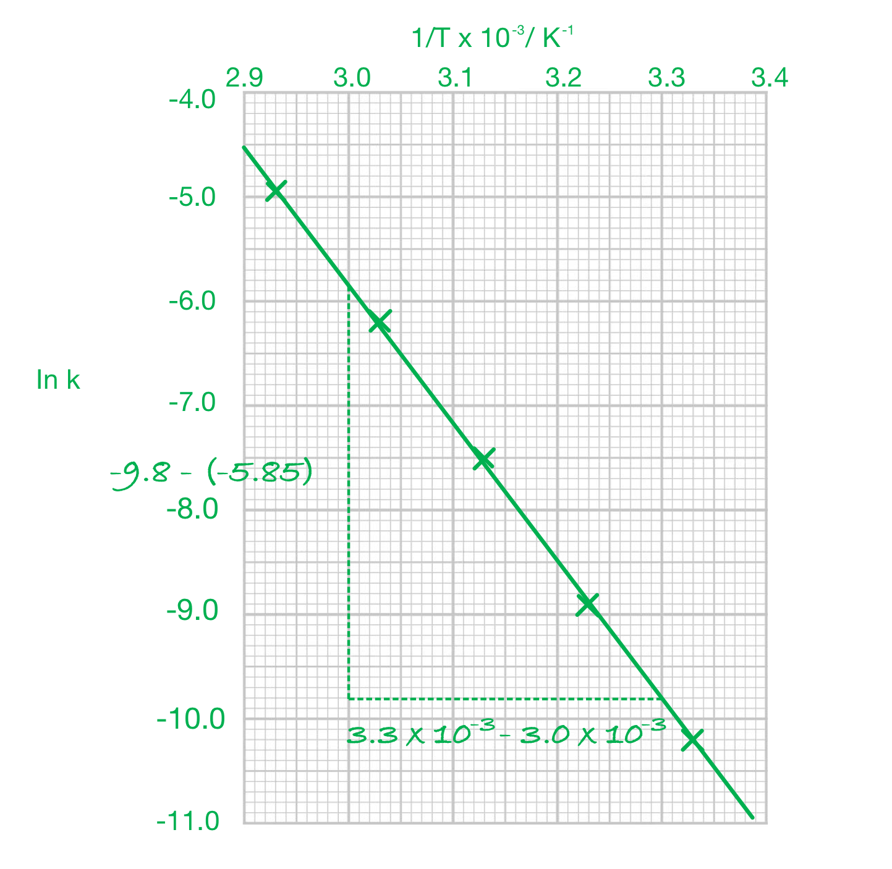
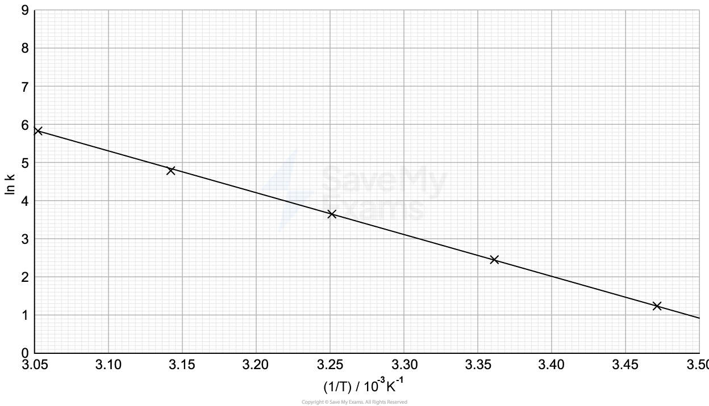
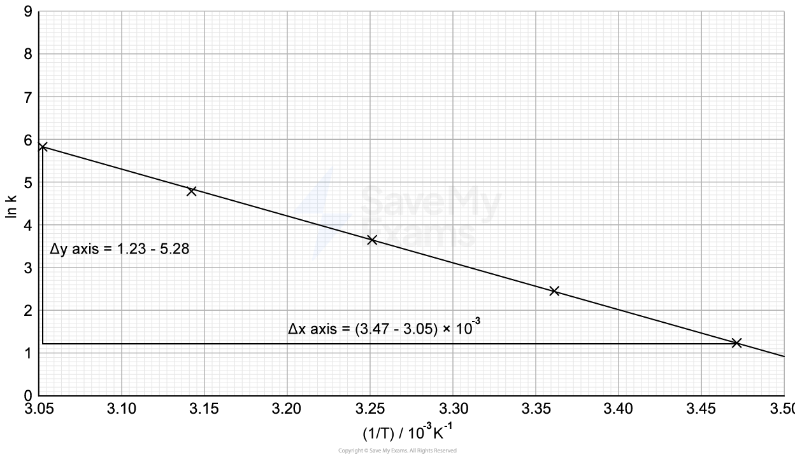

# Mark Schemes — Kinetics
**4: Rates, Equilibria & Further Organic Chemistry** · Edexcel International A Level (IAL) Chemistry (YCH11)

## Q1 — medium — 13 marks · structured-questions

### 16((a)) — 4 marks
i) The completed graph is:

- Rate (y-axis) against concentration (x-axis) graph with axes labelled including units; **[1 mark]**
- Suitable scales chosen including the origin; **[1 mark]**
- All points are plotted correctly 
**AND **
A straight line of best fit; **[1 mark]**

ii) The graph shows that the reaction is first order with respect to bromate(V) ions because:

- There is a straight line through the origin / 0,0); **[1 mark]**

**[Total: 4 marks]**

- *Make sure that your initial rates of reaction are all to the power of -7 so that you can draw an appropriate scale:*

| *Initial concentration of* *bromate(V) ions / mol dm**–3* | *Initial rate of reaction* */ mol dm**–3** s**–1* |
|---|---|
| > *0.030* | > *4.17 × 10**–7* |
| > *0.060* | > *8.34 × 10**–7* |
| > *0.090* | > *12.5 × 10**–7* |
| > *0.120* | > *16.7 × 10**–7* |
| > *0.150* | > *20.09 × 10**–7* |

- *For the reaction to be first order with respect to bromate(V) ions*

  - *The concentration of bromate ions is directly proportional to the rate of reaction*
  - *So, as the concentration of bromate(V) ions increases, the rate also increases*
- *Direct proportionality is demonstrated by a straight line which begins at the origin*
- *Other acceptable ways of justifying that the graph shows the reaction is first order with respect to bromate (V) ions are:*

  - *There is a line with a constant gradient*
  - *The rate is directly proportional to the concentration *
  - *Use of data from the graph*

### 16((b)) — 6 marks
i) The order with respect to Br– ions and H+ ions is:

- 1st order (Br–); **[1 mark]**
- 2nd order (H+); **[1 mark]**

ii) The rate equation for the reaction is:

- rate = k[BrO3–][Br–][H+]2 ; **[1 mark]**

ii) A value for the rate constant, *k*. with units is:

- k = rate / [BrO3 –][Br–][H+]2 
**OR**
k = 1.52 x 10–5÷(0.062 x 0.21 x 0.42); **[1 mark]**
- 7.2965 x 10–3; **[1 mark]**
- dm9 mol–3 s–1; **[1 mark]**

**[Total: 6 marks]**

- *From part (a), the order of reaction with respect to bromate ions is 1*
- *For bromide ions, look at experiments 1 and 3*

  - *Since the concentration of hydrogen and bromate ions remains the same, any change between these experiments is due to the bromide ions only*
  - *The concentration of bromide ions increases by a factor of three, as does the rate of reaction*
  - *The concentration and rate are therefore directly proportional so the order of reaction with respect to bromide ions is 1*
- *For hydrogen ions, look at experiments 1 and 2*

  - *The concentration of bromate ions increases by a factor of five*
  - *The concentration of hydrogen ions decreases by a factor of two*
  - *The rate of reaction increases by a factor of 1.25*
  
    - *Your calculator may show that *$\frac{5}{4}$* which makes the effect of both ions more obvious*
  - *The top half of the fraction represents the factor five **increase **in the bromate ions *
  - *The bottom half of the fraction represents the **decrease **caused by the hydrogen ions*
  
    - *Since they have decreased by a factor of 2, the order of reaction with respect to hydrogen ions must be 2 because 2**2** = 4*
- *To determine the units, replace the rate and concentrations with units and cancel them out*

  - *Don't forget, the unit for rate is mol dm**-3** s**-1** *
  - $\frac{\mathrm{mol} \mathrm{dm}^{-3}s^{-1}}{\mathrm{mol} \mathrm{dm}^{-3}x\mathrm{mol} \mathrm{dm}^{-3}x\mathrm{mol} \mathrm{dm}^{-3}x\mathrm{mol} \mathrm{dm}^{-3}}$
  - *Cancel out the terms which appear on the top and the bottom so achieve dm**9 **mol**–3 **s**–1*

### 16((c)) — 3 marks
A heterogeneous catalyst, such as palladium, increases the rate of a reaction by:

- Reactants adsorb onto palladium/catalyst surface; **[1 mark]**
- This weakens bonds in reactants; **[1 mark]**
- Products then desorb (from catalyst surface); **[1 mark]**

**[Total: 3 marks]**

- *Careful:** Be sure to say the reactatns **ad**sorb not **ab**sorb onto the catayst surface*

  - *Adsorption means they attach to the surface*
  - *Absorption means they are taken into or soaked up *

## Q2 — medium — 15 marks · structured-questions

### 17((a)) — 6 marks
i) A graph of concentration of benzenediazonium chloride against time:

- A sensible choice scale (to cover at least half the grid in both directions)
**AND**
Labelled axes with units on both axes; **[1 mark]**
- All points given in table correctly plotted; **[1 mark]**
- Any sensible (reasonably) smooth best fit curve; **[1 mark]**

ii) A value for the half-life, t1⁄2 , of this reaction is:

- Half-life / t1⁄2 = a value between 110 and 130 (s); **[1 mark]**

iii) The rate constant, *k*, for the reaction at 333 K is:

- Rearrangement of expression: *k* = ln2 ÷ t1⁄2; **[1 mark]**
- = 0.693 ÷ 120 = 5.7762 x 10−3/ 0.0057762
**AND**
Units: s-1; **[1 mark]**

**[Total: 6 marks]**

- *In part (i):*

  - *When plotting the graph, ensure you use as much of the graph paper provided as possible*
  - *Make the scale as easy as possible to use: it is easier if each graduation is divisible by 2 or 5*
  - *When drawing a line of best fit, you should draw a smooth curve that is within one square of each point*
  - *You would not be awarded the mark for a 'dot-to-dot' line*
  - *If you drew a straight line, you would score a maximum of 2 marks for part (i)*
- *In part (ii):*

  - *In order to gain this mark, you must show some evidence of working on the graph*
  - *To find the half-life, use the graph to find how long it takes for the concentration of benzenediazonium  chloride to fall to half of its initial value*
  - *Ideally, you should find two half-lives and take an average, but you would be awarded the mark for finding one value*
  - *It doesn't matter what initial concentration you use, but the half-life will be more accurate at higher concentrations*
  - *An example of using the graph:*

- *In part (iii)*

  - *You need to rearrange the equation given and substitute the value you found for the half-life to find **k*
  - *Use the expression for **k** to deduce the units by substituting in the units:*
  
    - *k** = ln2 ÷ t**½*
    - *k** = no units ÷ s = s**-1*
  - *t**1⁄2** = 110 gives **k** = 6.3013 x 10**−3 **/ 0.0063013 s**−1*
  - *t**1⁄2** = 125 gives** k** = 5.5452 x 10**−3 **/ 0.0055452 s**−1*
  - *t**1⁄2** = 130 gives **k** = 5.3319 x 10**−3 **/ 0.0053319 s**−1*

### 17((b)) — 9 marks
i) Using the rate constant calculated in (a)(iii) to obtain data for a point on the graph for 333 K:

- ln*k *= ln 5.776 x 10-3 = -5.154; **[1 mark]**
- $\frac{1}{T}=\frac{1}{333}$ = 3.003 x 10-3 / 0.003003 (K-1); **[1 mark]**

ii) Plotting the date:

- Circled point correctly plotted on graph; **[1 mark]**

iii) Determining the gradient by drawing a line of best fit:

- Best-fit line drawn through all points; **[1 mark]**
- Measure increase in ln*k* and increase in 1/T and used in correct expression; **[1 mark]**
- Final answer with sign **AND **units; **[1 mark]**

iv) The activation energy for the decomposition of benzenediazonium chloride is:

- Gradient = -EaR{"language":"en","fontFamily":"Times New Roman","fontSize":"18","autoformat":true}
**AND **
-*E*a = Gradient x *R*; **[1 mark]**
- −*E*a = −14000 x R = −14000 x 8.31 (= -116340); **[1 mark]**
- *E*a = (+)116340 J mol-1 / (+)116000 J mol-1
**OR**
*E*a = (+) 116.340 kJ mol-1 / (+) 116 kJ mol-1; **[1 mark]**

**[Total: 9 marks]**

- *The answer to part (i) will depend on the value for **k** that you obtained in part (a)(iii)*
- *A correctly plotted point can score both calculation marks*
- *The line of best fit needs to go through **all** the points, otherwise you will not gain the mark*
- *When calculating the gradient, any value between -13200 and -14200 is accepted*
- *Remember**: The line is a downward slope so will have a negative gradient*
- *Careful**: The calculated value of **E**a** will be in J mol**-1**, you can either leave this value as it is or convert to kJ mol**-1** by dividing by 1000, either way, you MUST give units*
- *E**a** is a positive value as it is the energy **required **to start a reaction*

## Q3 — medium — 6 marks · structured-questions

### 18() — 6 marks
To describe how knowledge of the rate equations for the hydrolysis of halogenoalkanes provides evidence for the mechanisms of these reactions:

**Chemical ideas expressed **

- The rate equation for primary halogenoalkanes:
Rate = k[RX][OH−]
- The rate equation for tertiary halogenoalkanes:
Rate = k[RX]
- Primary halogenoalkanes react by SN2
- Tertiary halogenoalkanes react by SN1
- For primary halogenoalkanes the slow step / RDS is when the compound reacts with hydroxide ions via a transition state
**OR**
RX + OH− → [HO---R---X]− **AND** slow / rate determining step
**OR**
RX + OH− → ROH + X− **AND** slow / rate determining step
- For tertiary halogenoalkanes the slow step / RDS is when the compound forms a carbocation (in a step that only involves the halogenoalkane)
**OR**
RX → R+ + X− **AND **slow / rate determining step

**Final answer:** **[Total: 6 marks] **

- *You can use other symbols for the halogenoalkanes*
- *You do not need to give any detailed mechanisms in the question, any attempt, even if incorrect, will be ignored*
- *If you give SN2 and SN1 the wrong way round, you would lose a mark*
- *An answer scoring** 6** marks would include*

  - *6 correct marking points AND answer is written in a clear and logical order and points fully explained *
- *An answer scoring** 5** marks would include*

  - *5-4 correct marking points AND answer is written in a clear and logical order and points fully explained *
- *An answer scoring** 4** marks would include*

  - *4-3 correct marking points AND answer has some structure and gives some explained points*
- *An answer scoring **3** marks would include*

  - *3-2 correct marking points AND answer has some structure and gives some explained points*

## Q4 — hard — 8 marks · structured-questions

### 18((a)) — 7 marks
i) Deducing the rate equation for the reaction:

- The order with respect to H+ is 2;

**AND**

The order with respect to Br‒ is 1; **[1 mark]**

- In experiments 1 and 2 the concentration of bromide ions and bromate ions remains constant while the concentration of hydrogen ions doubles and rate quadruples, so hydrogen ion is order 2; **[1 mark]**
- In experiments 1 and 3 the concentration of bromate ions increases 1.5 times and the concentration of bromide ions doubles, whilst the concentration of hydrogen ions stays constant. The rate increases by 3 times so bromide ion is order 1; **[1 mark]**
- Rate = k [BrO3‒][ Br‒][ H+]2; **[1 mark]**

ii) Calculating the rate constant for the reaction:

- The expression for k rearranged; **[1 mark]**
- The value of k; **[1 mark]**
- Units; **[1 mark]**

*Example calculation:*

k =  `fraction numerator rate over denominator space left square bracket BrO subscript 3 to the power of ‒ right square bracket left square bracket space Br to the power of ‒ right square bracket left square bracket space straight H to the power of plus right square bracket squared space end fraction` 
**OR**
k = $\frac{2.01x10^{-}^{4}}{0.15\times0.25\times0.60^{2}}$ k = 0.014889 / 0.015 / 1.4889 x 10-2 / 1.5 x 10-2 dm9 mol-3 s-1

**[Total: 7 marks]**

- *If you get the rate equation wrong in the first part you can still get full credit in the second part for using that equation correctly*
- *The units of k can be in any order, but the convention is to write the positive units first*
- *The abbreviation for seconds is s, but you won't be marked down if you use 'sec'*
- *If you use another line of data to find k, you will still receive full credit for the question*
- *If you come up with the correct answer but don't have workings or the correct units you will lose a mark*

### 18((b)) — 1 marks
**One** possible reason why the rate equation shows that the reaction cannot proceed in one step:

- There are only 4 particles in the rate equation and 12 in the equation for the reaction;

**OR**

Collisions with more than 2 particles are very unlikely;* ***[1 mark]**

**[Total: 1 mark]**

- *If you add up the coefficients in the reaction equation you will see that 12 particles are involved: 1+5+6*
- *Adding the reaction orders for the rate equation gives 4 particles*
- *Therefore it is not possible for it to be a one step reaction*
- *One step reactions can occur when the stoichiometry and rate equation match*

## Q5 — hard — 20 marks · structured-questions

### 20((a)) — 5 marks
The total entropy change,  Δ*S*total, for this reaction at 298 K is:

- ∆*S*system = (2 x 95.9) + (3 x 205.0) – (2 x 149.2)
**OR**
∆*S*system =191.8 + 615.0 – 298.4 / 806.8 – 298.4; **[1 mark]**
- ∆*S*system = (+)508.4 (J K−1 mol−1); **[1 mark]**
- ∆*S*surroundings = - -67.2298{"language":"en","fontFamily":"Times New Roman","fontSize":"18","autoformat":true}; **[1 mark]**
- ∆*S*surroundings = (+)0.2255 (kJ K−1 mol−1) 
**OR**
(+)225.5 (J K−1 mol−1); **[1 mark]**
- ∆*S*total = 508.4 + 225.5 = (+)733.9 (J K−1 mol−1)
**OR**
(+)0.7339 (kJ K−1 mol−1); **[1 mark]**

**[Total: 5 marks]**

- *The equation to find ∆**S**total **is:*

  - *∆**S**total** = ∆**S**system **+** **∆**S**surroundings*
- *So the change in entropy of the system and the surroundings need to be calculated*
- *The equations for these entropy changes are:*

  - *∆**S**system** = Σ**S**products **-** **Σ**S**reactants*
  - *∆**S**surroundings** = -∆HT{"language":"en","fontFamily":"Times New Roman","fontSize":"18","autoformat":true}*
- *When calculating Σ**S**products **and** **Σ**S**reactants**, don't forget to account for the stoichiometry of the equation*
- *Careful**: The calculated value of Δ**S**system** has the units J K**−1** mol**−1 **as **S**products **and** **S**reactants **are in J K**−1** mol**−1**, however, the calculated value of ∆**S**surroundings **has the units of kJ mol**-1** K**-1** as Δ**H** is in kJ mol**-1*
- *When calculating ∆**S**total**, make sure they are both in the same units*

### 20((b)) — 8 marks
i) The order of the reaction with respect to bromide ions, showing working on the graph, is:

- Working for at least one half-life shown on graph; **[1 mark]**
- First half-life = 200 s 
**AND**
Second half-life = 200 s ± 20 s; **[1 mark]**
- First order
**AND**
because the half-lives are constant / the same / similar; **[1 mark]**

ii) The order of reaction with respect to BrO3- ions and to H+ ions is:

- First order with respect to BrO3− ions 
**AND**
Because in runs 1 and 2 as [BrO3−] doubles (and [H+] is constant) the rate doubles; **[1 mark]**
- In runs 1 and 3, as [BrO3−] triples rate should triple (to 1.08 x 10−2) and [H+] also doubles and rate increases by a factor of 4; **[1 mark]**
- So the reaction is second order with respect to H+ ions; **[1 mark]**

iii) The overall rate equation for this reaction, with units is:

- rate = k[Br− (aq)] [BrO3− (aq)] [H+ (aq)]2; **[1 mark]**
- Units: dm9 mol−3 s−1; **[1 mark]**

**[Total: 8 marks]**

- *In order to confirm a first-order reaction from a concentration vs time graph, it is necessary to show that the half-life is constant, therefore you need to show workings for 2 half-lives*
- *Comparing runs 1 and 2 from the experimental data, only the concentration of BrO**3**-** is changed, so the rate changes must be caused by this*
- *As the concentration doubles from 0.1 to 0.2 mol dm**-3**, the rate also doubles from 3.6 x 10**-3** to 7.2 x 10**-3 **mol dm**-3** s**-1**, therefore it is first order with respect to BrO**3**-*
- *Deducing the order with respect to H**+** is more difficult as there are no two runs in which only [H**+**] changes*
- *From run 1 to run 3 [BrO**3**–**] triples from 0.1 to 0.3 mol dm**-3*

  - *This would cause a tripling of the rate to 3.6 x 10**-3** x 3 = 1.08 x10**-2** mol dm**-3** s**-1*
- *[H**+**] also is doubled from 0.1 to 0.2 mol dm**-3*

  - *This change must account for the rate changing from 1.08 x 10**-2** to 4.3 x 10**-2** mol dm**-3** s**-1*
  - $\frac{4.3\times10^{-2}}{1.08\times10^{-2}}$* **= 4, so the rate increases by a factor of 4, therefore it must be 2nd order with respect to H**+*
- *You could give your answer referring to runs 2 and 3: [BrO**3**−**] triples, [H**+**] doubles and rate x 12*
- *When giving the rate equation and units, you would be allowed error carried forward for any incorrectly identified orders*
- *To find the units, substitute the units into the rearranged rate equation and simplify:*

> `k space equals space fraction numerator rate over denominator straight k left square bracket Br to the power of minus right square bracket left square bracket BrO subscript 3 to the power of minus right square bracket left square bracket straight H to the power of plus right square bracket squared end fraction space equals space fraction numerator mol space dm to the power of negative 3 end exponent space straight s to the power of negative 1 end exponent over denominator open parentheses mol space dm to the power of negative 3 end exponent close parentheses open parentheses mol space dm to the power of negative 3 end exponent close parentheses open parentheses mol space dm to the power of negative 3 end exponent close parentheses squared end fraction space equals space fraction numerator straight s to the power of negative 1 end exponent over denominator stretchy left parenthesis mol space dm to the power of negative 3 end exponent stretchy right parenthesis stretchy left parenthesis mol space dm to the power of negative 3 end exponent stretchy right parenthesis squared end fraction space`*= dm**9** mol**-3** s**-1*

- *It is the convention to write the positive indices first but can write them in any order to gain this mark*

### 20((c)) — 7 marks
A graph of ln *k* against 1/*T* and calculation to determine the activation energy, *E*a:

- Axes correct way around
**AND**
A suitable scale; **[1 mark]**
- Both axes labelled:
y axis: ln k
**AND**
x axis: 1/T
**AND**
Units for x axis: K-1; **[1 mark]**
- All points plotted correctly
**AND**
Best-fit straight line; **[1 mark]**
- Calculation of gradient
e.g. `fraction numerator negative 9.8 space minus space open parentheses negative 5.85 close parentheses over denominator 3.3 space cross times space 10 to the power of negative 3 space end exponent minus space 3.0 space cross times space 10 to the power of negative 3 end exponent end fraction` = (-)13167; **[1 mark]**
- Sign and units of gradient: negative sign **AND** units K; **[1 mark]**
- Calculation of activation energy
*E*a = -gradient x *R*
*E*a = 13167 x 8.31 / 1000 = 109.418
**OR**
*E*a = 13167 x 8.31 = 109418; **[1 mark]**
- Sign and corresponding units of activation energy
(+)109.418 kJ mol-1
**OR**
(+)109418 J mol-1; **[1 mark]**

**[Total: 7 marks]**

- *When drawing the graph, the points / line must cover at least half the grid in both directions and ln k values must become more negative down the axis with negative signs shown*
- *When plotting the points, you are allowed ±½ square error *
- *A gradient value in the range (−)12800 to (−)13800 is allowed and this can be calculated from the graph or from using points in the table*
- *As it is a downward slope, the gradient should have a negative value*
- *When calculating **E**a**, the value will be positive as energy has to be put into starting a reaction, but if you do not show the positive sign you are not penalised - you would be penalised for a negative sign*
- *Careful**: When calculating **E**a**, be aware of units, multiplying the gradient by **R** will give a value in J mol**-1**; dividing this by 1000 gives a value in kJ mol**-1*

## Q6 — hard — 13 marks · structured-questions

### 1() — 3 marks
To deduce the order of reaction with respect to BrO3−, Br− and H+:

- **Order with respect to BrO**3**-****:**

  - Compare experiments 1 and 2 (only [BrO3−] changes).
  - [BrO3−] doubles (0.10 → 0.20 mol dm−3)
  - Rate doubles (1.20 × 10−3 → 2.40 × 10−3 mol dm−3 s−1)
  - Factor 2¹ → first order **[1 mark]**
- **Order with respect to Br**-**:**

  - Compare experiments 2 and 3 (only [Br−] changes).
  - [Br−] doubles (0.10 → 0.20 mol dm−3)
  - Rate doubles (2.40 × 10−3 → 4.80 × 10−3 mol dm−3 s−1)
  - Factor 2¹ → first order **[1 mark]**
- **Order with respect to H**+**:**

  - Compare experiments 3 and 4 (only [H+] changes).
  - [H+] doubles (0.10 → 0.20 mol dm−3)
  - Rate quadruples (4.80 × 10−3 → 1.92 × 10−2 mol dm−3 s−1)
  - Factor 2² → second order **[1 mark]**

> **[mark-scheme]**
> 1 mark for order with respect to BrO3− = 1 / first order
> 
> 1 mark for order with respect to Br− = 1 / first order
> 
> 1 mark for order with respect to H+ = 2 / second order

> **[exam-tip]**
> The golden rule for initial-rates questions: only compare two experiments where **one** concentration changes and all the others stay the same. Pick your pairs carefully, many students try to compare experiments 1 and 4 here (where three values change) and end up with an impossible ratio.
> 
> Show your working as a comparison of the factors. Examiners want to see "concentration doubles, rate quadruples, factor = 2², therefore second order" not just the final answer. A very common mark-loss is stating orders with no supporting data.
> 
> Remember that the order of a reactant is not determined by its stoichiometric coefficient. Here, Br− has a coefficient of 5 in the balanced equation but is only first order, rate equations are always determined experimentally, never read off the balanced equation.

### 2() — 3 marks
To calculate the value for the rate constant *k*:

- State the rate equation:

rate = *k*[BrO3−][Br−][H+]2 **[1 mark]**

- Rearrange the equation for *k*:

*k* = `fraction numerator rate over denominator left square bracket BrO subscript 3 to the power of minus right square bracket left square bracket Br minus right square bracket left square bracket straight H plus right square bracket squared end fraction`

- Known values from Experiment 1:

  - rate = 1.20 × 10−3 mol dm−3 s−1
  - [BrO3−] = [Br−] = [H+] = 0.10 mol dm−3
- Substitute and calculate:

*k* = `fraction numerator 1.20 cross times 10 to the power of negative 3 end exponent over denominator open square brackets 0.10 close square brackets open square brackets 0.10 close square brackets open square brackets 0.10 close square brackets squared end fraction`

*k* = **12** **[1 mark]**

- Derive the units (overall reaction order = 4):

units of *k* = $\frac{\mathrm{mol} \mathrm{dm}^{-3}s^{-1}}{(\mathrm{mol} \mathrm{dm}^{-3})^{4}}$

units of *k* = **dm****9**** mol****−3**** s****−1** **[1 mark]**

> **[mark-scheme]**
> 1 mark for the correct rate equation (rate = *k*[BrO3−][Br−][H+]2)
> 
> 1 mark for *k* = 12
> 
> 1 mark for correct units: dm9 mol−3 s−1 **OR **mol−3 dm9 s−1
> 
> Allow error carried forward from incorrect orders in part (a), provided the rate equation uses them consistently

> **[exam-tip]**
> Always derive the units of *k* by substituting into the rearranged rate equation, never try to memorise them. Concentration has units of mol dm−3 (with dm−3, not dm3) and rate has units of mol dm−3 s−1.
> 
> As a check, calculate *k* using data from more than one experiment. If your rate equation is correct, *k* should come out the same (within experimental error) every time. If it varies wildly, your orders are probably wrong, go back to part (a).
> 
> For an overall order *n*, the concentration terms contribute (mol dm−3)ⁿ in the denominator, which flips to mol−n dm3n in the numerator.

### 3() — 2 marks
> **[mark-scheme]**
> The mechanism consistent with the rate equation from part (b) is:
> 
> - Mechanism 2 **[1 mark]**
> 
> Explanation:
> 
> - The stoichiometry of the slow step ( **one** BrO3−, **one** Br− and **two** H+ ions) matches the orders in the rate equation
> **OR**
> Mechanism 1 would require the simultaneous collision of 12 particles, which is highly unlikely
> **OR**
> Mechanism 1 would predict rate = *k*[BrO3−][Br−]5[H+]6, which is inconsistent with the experimental data **[1 mark]**
> 
> 'Mechanism 1 is wrong because it is a single step' is not accepted without a link to the rate equation or to kinetic unreasonableness.

> **[exam-tip]**
> The rate equation is the fingerprint of the rate-determining step. Read off the orders: each first-order reactant contributes one molecule to the slow step, each second-order reactant contributes two, and any zero-order reactant is absent from the slow step.
> 
> When the stoichiometric numbers in the overall equation add up to more than about three or four, the reaction is almost certainly multi-step, because a single collision between many particles at once is far too improbable.
> 
> This is a two-way skill: rate equation → slow step, or given mechanism → predicted rate equation. Practise both directions.

### 4() — 5 marks
To determine the activation energy, *E*a, from the Arrhenius plot:

- Complete the table — calculate 1/*T* (with *T* in K) and ln *k* for each data point:

| *T* / °C | *T* / K | 1/*T* / 10−3 K−1 | *k* / dm9 mol−3 s−1 | ln *k* |
|---|---|---|---|---|
| 15 | 288 | 3.47 | 3.43 | 1.23 |
| 25 | 298 | 3.36 | 12.0 | 2.48 |
| 35 | 308 | 3.25 | 39.8 | 3.68 |
| 45 | 318 | 3.14 | 119 | 4.78 |
| 55 | 328 | 3.05 | 338 | 5.82 |

**[1 mark]**

- Plot the points and draw a straight line of best fit:

**[2 marks]**

- Calculate the gradient using two well-separated points on the line, e.g. (3.05, 5.82) and (3.47, 1.23):

gradient = $\frac{(1.23-5.82)}{(3.47-3.05)\times10^{-3}}$

gradient = −1.11 × 104 K

**[1 mark]**

- Calculate *E*a:

*E*a = −gradient × *R*

*E*a = −(−1.11 × 104) × 8.31

*E*a = 92 200 J mol−1

- Convert to kJ mol-1:

*E*a = $\frac{92200}{1000}$

*E*a = **92.2 kJ mol****−1**

**[1 mark]**

> **[mark-scheme]**
> 1 mark for correct values of 1/*T* and ln *k*, matching the table above (small rounding tolerances allowed)
> 
> 1 mark for axes labelled with correct quantities and sensible linear scales covering at least half the grid
> 
> 1 mark for all points plotted correctly and a straight line of best fit drawn
> 
> 1 mark for a correctly calculated gradient in the range −1.05 × 104 to −1.15 × 104 K
> 
> 1 mark for a positive value of *E*a in the range 87 to 95 kJ mol−1, including unit of  kJ mol−1
> 
> Units of °C−1 on the x-axis are not accepted
> 
> Gradient must be calculated from two well-separated points marked clearly on the line of best fit, not from raw data points
> 
> Allow error carried forward from an incorrect gradient when calculating *E*a

> **[exam-tip]**
> Four things to watch for on an Arrhenius plot:
> 
> 1. Convert to Kelvin first.
> 
>   - *T*(K) = *T*(°C) + 273.
>   - The x-axis units must be K−1
>   - Examiner reports flag °C−1 as a regular mark-losing error
> 2. Use a ruler for the line of best fit.
> 
>   - Freehand lines cost you marks.
>   - The line should pass through as many data points as possible with roughly equal numbers above and below
> 3. Read the gradient from two points ON the line, not from the raw data points.
> 
>   - Use the largest possible triangle to minimise reading error
> 4. Units matter.
> 
>   - Forgetting units on *E*a loses the final mark.
>   - The calculation gives J mol−1 when *R* is used in J K−1 mol−1
>   - Divide by 1000 to convert to kJ mol−1
> 
> The gradient is always negative (−*E*a/*R*) but *E*a itself is always positive. If you calculate a negative *E*a, check your signs.

## Q7 — easy — 3 marks · multiple-choice-questions

### 1() — 1 marks
**Correct answer: A** — rate = *k*

**Final answer:** **The correct answer is ****A**** because:**

- The overall order of the reaction is the sum of the powers of the reactants in a rate equation
- In this case, the order of the reaction with respect to each reactant is zero as they do not appear in the rate equation, therefore the overall order is also zero

**B** is incorrect as  this is a first order rate equation

**C** is incorrect as  this is a second order rate equation

**D** is incorrect as  this shows overall order four and refers to the reverse reaction

### 1((b)) — 1 marks
**Correct answer: C** — mol dm−3 s−1

**Final answer:** **The correct answer is ****C**** because:**

- The rate equation shows that:

  - *k* = rate
- Substituting the values in this equation with the units of that value gives:

  - Units of *k* = mol dm3 s-1

**A** is incorrect as rate constants always have units

**B** is incorrect as  these are the units of a first order rate constant

**D** is incorrect as  these are the units of a second order rate constant

### 1((c)) — 1 marks
**Correct answer: A** — 

**Final answer:** **The correct answer is ****A**** because:**

- In a zero-order reaction, the rate of the reaction is independent of the concentration of the reactants
- The rate will remain constant throughout the reaction which is shown by a horizontal line on a rate-concentration graph

**B** is incorrect as  this graph shows a first order reaction

**C** is incorrect as this graph shows a first order reaction

**D** is incorrect as  this graph shows no reaction occurring

## Q8 — medium — 1 marks · multiple-choice-questions

### 5() — 1 marks
**Correct answer: D** — 

**Final answer:** **The correct answer is ****D ****because:**

- 2-bromo-2-methylbutane  is a tertiary halogenoalkane
- Tertiary halogeoalkanes undergo nucleophilic substitution via the SN1 mechanism which consists of two steps:

  - In the first step, the C-Br bond will break heterolytically forming a Br- ion and tertiary carbocation
  - In the second step, the tertiary carbocation will be attacked by the :OH- nucleophile to form 2-methylbutan-2-ol

**A** is incorrect as  the halogenoalkane is tertiary so mechanism would be SN1 which has two steps

**B** is incorrect as  although the mechanism has two steps the halogenoalkane is tertiary so mechanism would be SN1

**C** is incorrect as  although the mechanism is SN1, it would have two steps

## Q9 — medium — 1 marks · multiple-choice-questions

### 6() — 1 marks
**Correct answer: D** — Step 2 is the rate determining step and the overall order is 3

**Final answer:** **The correct answer is ****D**** because:**

- The rate determining step is the slowest step within a chemical reaction which determines the overall rate of a chemical reaction
- There are three steps involved in this reaction with Step 2 being identified as the slowest
- Step 2 is therefore the rate determining step which eliminates options A and B
- The rate equation for this reaction would be:

  - Rate = k [NO2]2[H2]
  - There are three reactants species up to and including the rate equation:
  
    - **2NO** ⇌ N2O2
    - **N****2****O****2** +** H****2**** **→ N2O + H2O
    - The N2O2 appears in both equations so cancels out leaving **2NO and H****2**
    - To work out the overall order of reaction, add up the powers of the reactants, 2 + 1 = 3

**A** is incorrect as step 3 is fast

**B** is incorrect as  step 3 is fast

**C** is incorrect as the overall order is 3

## Q10 — medium — 1 marks · multiple-choice-questions

### 8() — 1 marks
**Correct answer: C** — 1.0 × 10−3

**Final answer:** **The correct answer is ****C**** because:**

- Rearranging the rate expression gives

  - *k *= `fraction numerator rate over denominator open square brackets straight A close square brackets squared open square brackets straight B close square brackets to the power of 0 end fraction`, however [B]0 is 1, so substituting in the other values
  - *k* = `fraction numerator 9.0 cross times 10 to the power of negative 5 end exponent over denominator open parentheses 0.3 close parentheses squared end fraction`= 1.0 x 10-3

**A **is incorrect as the initial rate and the rate constant have been mixed up

**C** is incorrect as  [A] has not been squared

**D **is incorrect as  [B] has been included

## Q11 — medium — 1 marks · multiple-choice-questions

### 1() — 1 marks
**Correct answer: A** — *K*c = [CO2]

**Final answer:** **The correct answer is A**

- For heterogeneous equilibria, pure **solids are omitted** from the *K*c expression because their concentration is constant (determined by density and molar mass)
- CaCO3 (s) and CaO (s) are both solids, so neither appears in *K*c
- Only CO2 (g) contributes:

*K*c = [CO2]

**B** is incorrect as CaCO3 is a solid and must be omitted

**C** is incorrect as both CaO and CaCO3 are solids and must be omitted. The expression is also inverted (reactants over products)

**D** is incorrect as CaO and CaCO3 are both solids and must be omitted

> **[exam-tip]**
> Paper 4 mark schemes state explicitly: "solids are not included in the *K*c expression for this equilibrium." The concentration of a pure solid is a constant absorbed into the equilibrium constant itself; only species whose concentrations can vary (aqueous or gaseous) appear in the expression. Always check states before writing any *K*c expression.

## Q12 — medium — 1 marks · multiple-choice-questions

### 1() — 1 marks
**Correct answer: B** — Decreasing the temperature

**Final answer:** **The correct answer is B**

- The expression for *K*p for this equilibrium is:

$K_{p} = \frac{p(\text{SO}_{3})^{2}}{p(\text{SO}_{2})^{2}\timesp(\text{O}_{2})}$

- The value of *K*p depends **only** on temperature; catalysts, pressure changes, and concentration changes do **not** alter *K*p
- The forward reaction is exothermic (Δ*H*θ = −197 kJ mol⁻¹); lowering the temperature shifts the equilibrium position toward the products
- For exothermic reactions, **decreasing the temperature increases *K*~p~**

**A** is incorrect as a catalyst speeds up both forward and reverse reactions equally. It does not shift the position of equilibrium and does **not** change the value of *K*p

**C** is incorrect as changing the total pressure does not change *K*p. It only shifts the position of equilibrium (here, toward the side with more moles of gas, so back toward reactants). *K*p itself is temperature-dependent only

**D** is incorrect as increasing the temperature **decreases** *K*p for an exothermic reaction (equilibrium shifts toward reactants, which absorbs heat)

> **[exam-tip]**
> Core rule: *K*p and *K*c are only changed by temperature.
> 
> Catalysts, total pressure changes, and concentration changes can shift the position of equilibrium but do NOT change the value of the equilibrium constant. For exothermic reactions, *K* decreases as *T* increases (and vice versa).
> 
> Examiner reports repeatedly flag candidates incorrectly claiming a catalyst or a pressure change alters *K*p

## Q13 — medium — 1 marks · multiple-choice-questions

### 1() — 1 marks
**Correct answer: C** — 

**Final answer:** **The correct answer is C**

- Read successive half-lives from the curve:

- [A] falls from 0.80 → 0.40 mol dm-3 in 20 s
- [A] falls from 0.40 → 0.20 mol dm-3 in a further 20 s
- [A] falls from 0.20 → 0.10 mol dm-3 in a further 20 s
- The half-life is **constant** (20 s), which is the diagnostic test for **first-order** kinetics, the time for [A] to halve is independent of the starting concentration
- For a first-order reaction, rate = *k*[A]. Rearranging for the units of *k*:

*k* = rate ÷ [A] = mol dm-3 s-1 ÷ mol dm-3 = s-1

- Therefore order = 1, units of *k* = s-1

**A** is incorrect as a zero-order reaction would give a **straight-line** concentration–time graph with a constant negative gradient, not a curve. The units of *k* for zero order are mol dm-3 s-1.

**B** is incorrect as a zero-order reaction produces a straight line, not the curved decay shown. The half-life of a zero-order reaction also decreases as the reaction proceeds, which contradicts the constant half-life seen here.

**D** is incorrect as the units of *k* for a first-order reaction are s-1; mol dm-3 s-1 are the units for a zero-order reaction.

> **[exam-tip]**
> For concentration–time graphs, the shape and half-life pattern give the order directly:
> 
> - **Zero order**: straight line with constant negative gradient — half-life **decreases**
> - **First order**: smooth curve with **constant** half-life
> - **Second order**: smooth curve with half-life that **increases** as the reaction proceeds
> 
> Always read at least two successive half-lives from the curve to confirm the order — a single half-life cannot distinguish first from second order.
> 
> For a first-order reaction, *t*₁/₂ = ln 2 ÷ *k* = 0.693 ÷ *k*, independent of starting concentration. The curve here shows three half-lives of 20 s in sequence — the diagnostic signature of first-order kinetics.

## Q14 — hard — 1 marks · multiple-choice-questions

### 7() — 1 marks
**Correct answer: C** — – gradient × R

**Final answer:** **The correct answer is ****C ****because:**

- The expression is in the form of y = mx + c
- m = gradient = -$\frac{E_{a}}{R}$
- Rearranging gives -*E**a* = gradient x *R*
- Which becomes* E**a** *=* -*gradient x* R*

**A** is incorrect as  the Arrhenius equation has been rearranged incorrectly

**B and D **are incorrect as  the gradient of the graph is negative, so this expression would give a negative value for an activation energy

## Q15 — hard — 1 marks · multiple-choice-questions

### 7() — 1 marks
**Correct answer: A** — `CH subscript 3 COCH subscript 3 space plus space straight H to the power of plus space space space space space space space space rightwards harpoon over leftwards harpoon space CH subscript 3 straight C left parenthesis straight O with plus on top straight H right parenthesis CH subscript 3 space space space space space space space space space space space space space space space space space fast
CH subscript 3 straight C left parenthesis straight O with plus on top straight H right parenthesis CH subscript 3 space space space space space space space space space space space space rightwards arrow space CH subscript 3 straight C left parenthesis OH right parenthesis ═ CH subscript 2 space plus space straight H to the power of plus space space space space slow space
CH subscript 3 straight C left parenthesis OH right parenthesis ═ CH subscript 2 space plus space straight I subscript 2 space rightwards arrow space CH subscript 3 COCH subscript 2 straight I space plus space HI space space space space space space space space space space space space space fast`

**Final answer:** **The correct answer is ****A**** because:**

- Only substances in the rate equation, or intermediates that form them, can appear in the slow step of the reaction mechanism
- In option **A**, the only reactant in the slow step is CH3C+(OH)CH3
- However, this is an intermediate formed by CH3COCH3 and H+ which appear in the rate equation, so this would be consistent with the mechanism in option **A**

**B **is incorrect as  the steps up to and including the slow step must include CH3COCH3 and H+ ions and I2 must only be involved in a fast step

**C** is incorrect as  the steps up to and including the slow step must include CH3COCH3 and H+ ions and I2 must only be involved in a fast step

**D **is incorrect as the steps up to and including the slow step must include CH3COCH3 and H+ ions and I2 must only be involved in a fast step
