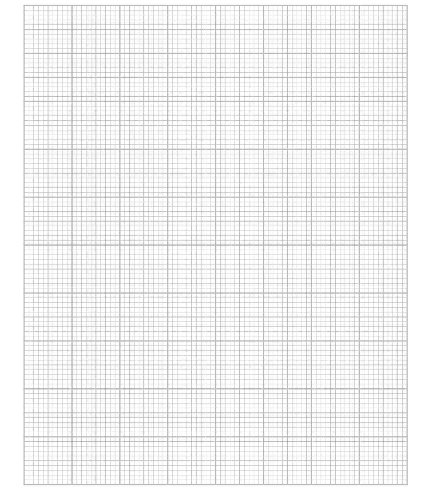
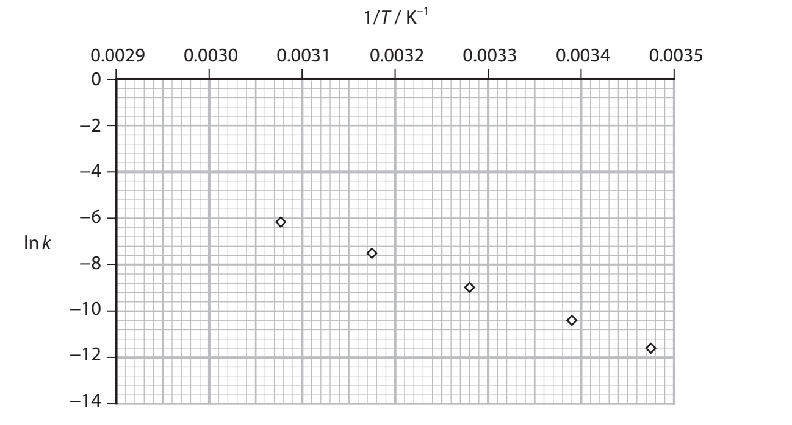
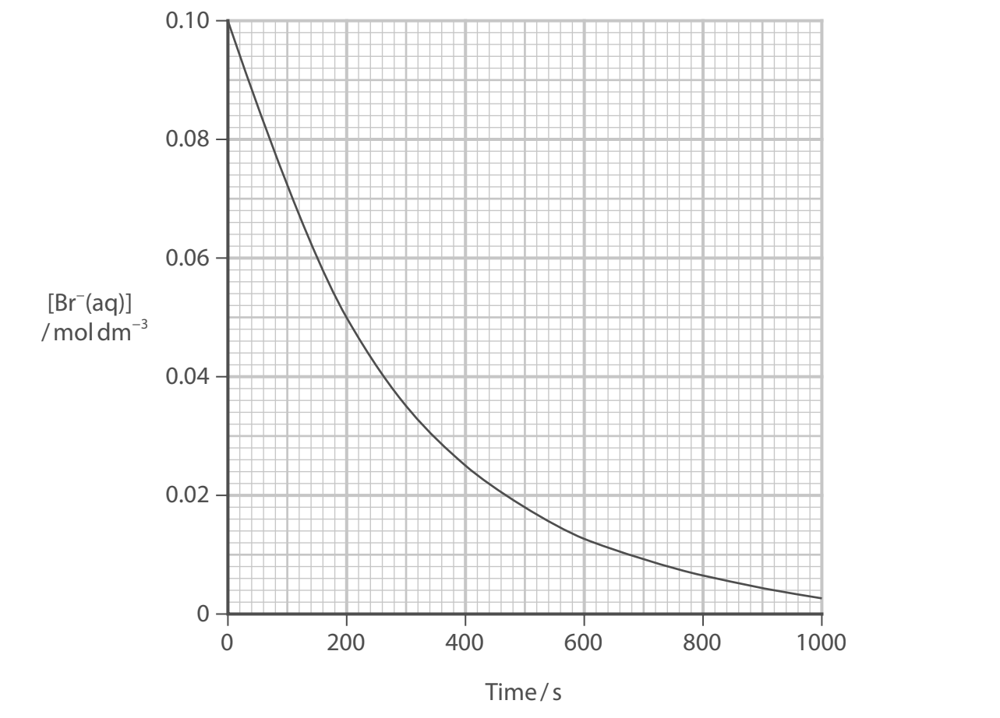
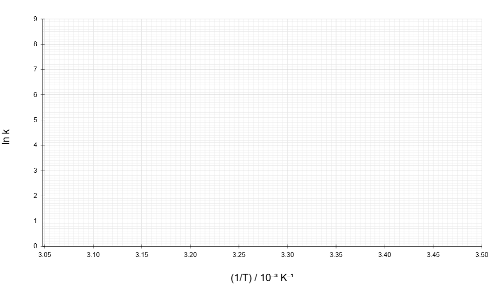
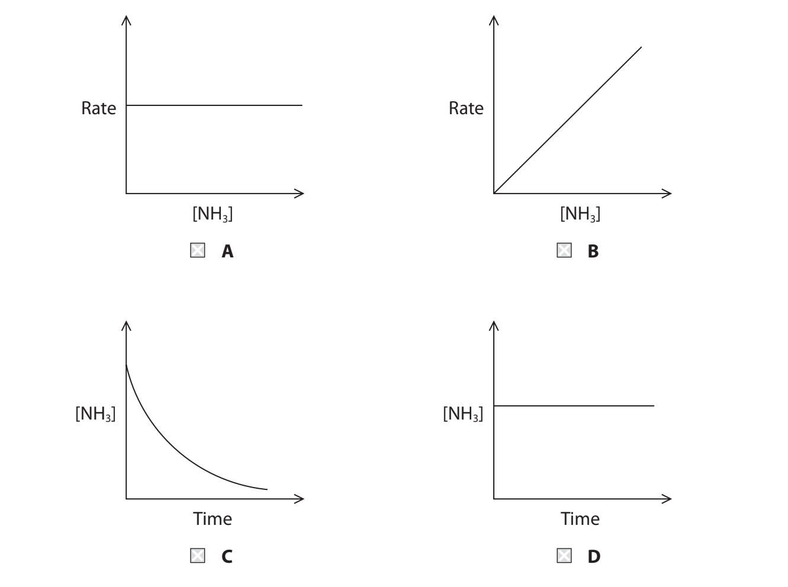

# Exam Questions — Kinetics
**4: Rates, Equilibria & Further Organic Chemistry** · Edexcel International A Level (IAL) Chemistry (YCH11)
> Source: [https://www.savemyexams.com/international-a-level/chemistry/edexcel/17/topic-questions/4-rates-equilibria-and-further-organic-chemistry/4-1-kinetics/structured-questions/](https://www.savemyexams.com/international-a-level/chemistry/edexcel/17/topic-questions/4-rates-equilibria-and-further-organic-chemistry/4-1-kinetics/structured-questions/) · 15 questions · total 86 marks

## Q1 — medium — 13 marks · structured-questions

### 16((a)) — 4 marks — command: multiple — structured — from paper June 2021 · WCH14/01
A student investigated the kinetics of the reaction between bromate(V) ions and bromide ions in acidic conditions.

$\mathrm{BrO}_{3}^{-}$(aq) + 5Br– (aq) + 6H+ (aq) → 3Br2(aq) + 3H2O(l)

In the first experiment, the student measured the initial rate of the reaction at five different concentrations of bromate(V) ions, $\mathrm{BrO}_{3}^{-}$ . In each case, the initial concentrations of bromide ions and hydrogen ions were constant and in large excess. The results obtained are shown.

| **Initial concentration of** **bromate(V) ions / mol dm****–3** | **Initial rate of reaction** **/ mol dm****–3**** s****–1** |
|---|---|
| 0.030 | 4.17 × 10–7 |
| 0.060 | 8.34 × 10–7 |
| 0.090 | 1.25 × 10–6 |
| 0.120 | 1.67 × 10–6 |
| 0.150 | 2.09 × 10–6 |

i) Use the results to plot a suitable graph that can be used to show that the reaction is first order with respect to bromate(V) ions.

**(3)**

ii) State how your graph shows that the reaction is first order with respect to bromate(V) ions.

**(1)**

### 16((b)) — 6 marks — command: multiple — structured — from paper June 2021 · WCH14/01
In the second experiment, the student determined the initial rates of the same reaction starting with different concentrations of the reactants.

| **Run** | **[**$\mathrm{BrO}_{3}^{-}$**]** **/ mol dm****–3** | **[Br****–****]** **/ mol dm****–3** | **[H****+****]** **/ mol dm****–3** | **Initial rate of reaction** **/ mol dm****–3**** s****–1** |
|---|---|---|---|---|
| 1 | 0.062 | 0.21 | 0.40 | 1.52 × 10–5 |
| 2 | 0.31 | 0.21 | 0.20 | 1.90 × 10–5 |
| 3 | 0.062 | 0.63 | 0.40 | 4.56 × 10–5 |

i) Use these results and your answer to (a) to deduce the orders with respect to Br– ions and H+ ions.

**(2)**

Br-  ions................................................................................................................. 
H+   ions.................................................................................................................

ii) Write the rate equation for the reaction.

**(1)**

iii) Use the results for Run 1 and your rate equation from (b)(ii) to calculate the value for the rate constant, *k*. Include units in your answer.

**(3)**

### 16((c)) — 3 marks — command: describe — structured — from paper June 2021 · WCH14/01
The presence of bromate(V) ions in drinking water is harmful to humans. Bromate(V) ions can be converted to less harmful bromide ions by passing the water through palladium with a reducing agent.

Describe how a heterogeneous catalyst, such as palladium, increases the rate of a reaction.

## Q2 — medium — 15 marks · structured-questions

### 17((a)) — 6 marks — command: multiple — structured — from paper Oct 2021 · WCH14/01
The decomposition of benzenediazonium chloride is a first order reaction.

C6H5N2Cl + H2O → C6H5OH + N2 + HCl

The activation energy of this reaction was determined by measuring the rate constant
at various temperatures.

In an experiment at 333 K, the concentration of a sample of benzenediazonium chloride was measured at various times during its decomposition. The results of this experiment are shown.

| **Time / s** | **[C****6****H****5****N****2****Cl] / mol dm****−3** |
|---|---|
| 0.0 | 0.500 |
| 40.0 | 0.410 |
| 100 | 0.285 |
| 200 | 0.165 |
| 280 | 0.100 |
| 350 | 0.070 |
| 400 | 0.050 |

i) Plot a graph of concentration of benzenediazonium chloride against time.

**(3)**

ii) Determine a value for the half-life, t1⁄2 , of this reaction.

You **must** show your working on the graph.

**(1)**

iii) Calculate the rate constant, *k*, for the reaction at 333 K.
Include units in your answer.

Use the expression ln2 = *k*t1⁄2

**(2)**

### 17((b)) — 9 marks — command: multiple — structured — from paper Oct 2021 · WCH14/01
The experiment described in (a) was repeated for five temperatures and the data used to plot a graph for the Arrhenius equation in the form

ln*k * =  −$\frac{E_{a}}{R}\times\frac{1}{T}$ +  constant

i) Use the rate constant that you have calculated in (a)(iii) to obtain data for a point on the graph for 333K.

**(2)**

ii) Plot your data from (b)(i) on the graph.

**(1)**

iii) Determine the gradient of the graph by drawing a best-fit line.
Include a sign and units in your answer.

**(3)**

iv) Use the gradient determined in (b)(iii) to calculate the activation energy for the decomposition of benzenediazonium chloride.
Include a sign and units with your answer.

**(3)**

## Q3 — medium — 6 marks · structured-questions

### 18() — 6 marks — command: describe — structured — from paper Oct 2021 · WCH14/01
The hydrolysis of halogenoalkanes by alkali is a nucleophilic substitution reaction.

RX + OH− → ROH + X−

The mechanism of this reaction for primary halogenoalkanes is different from the mechanism for tertiary halogenoalkanes.

Describe how knowledge of the rate equations for the hydrolysis of halogenoalkanes provides evidence for the mechanisms of these reactions.

Curly arrow mechanisms are **not **required.

## Q4 — hard — 8 marks · structured-questions

### 18((a)) — 7 marks — command: multiple — structured — from paper Jan 2022 · WCH14/01
Bromate(V) ions, Br$O_{3}^{-}$, oxidise bromide ions, Br–, in dilute acid.

Br$O_{3}^{-}$(aq) + 5Br–(aq) + 6H+ (aq) → 3Br2 (aq) + 3H2O(l)

Experiments to determine initial reaction rates were carried out using different initial concentrations of the three reactants.

The results are shown in the table.

| **Experiment number** | **[Br**$O_{3}^{-}$**(aq)] /mol dm****–3** | **[Br****–****(aq)] /mol dm****–3** | **[H****+**** (aq)] /mol dm****–3** | **Initial rate of reaction** **/ mol dm****–3**** s****−1** |
|---|---|---|---|---|
| 1 | 0.10 | 0.25 | 0.30 | 3.36×10–5 |
| 2 | 0.10 | 0.25 | 0.60 | 1.34×10–4 |
| 3 | 0.15 | 0.50 | 0.30 | 1.01×10–4 |
| 4 | 0.15 | 0.25 | 0.60 | 2.01×10–4 |

The reaction is first order with respect to bromate(V) ions.

i) Deduce the rate equation for the reaction. Justify your answer using the data.

**(4)**

ii) Use the data from Experiment 4 and your answer to (a)(i) to calculate the rate constant for the reaction. Include units in your answer.

**(3)**

### 18((b)) — 1 mark — command: give — structured — from paper Jan 2022 · WCH14/01
Give** one** possible reason why the rate equation shows that the reaction cannot proceed in one step.

## Q5 — hard — 20 marks · structured-questions

### 20((a)) — 5 marks — command: calculate — structured — from paper Jan 2021 · WCH14/01
This question is about some compounds of bromine.

Potassium bromate(V) decomposes to form potassium bromide and oxygen.

`2 KBrO subscript 3 space left parenthesis straight s right parenthesis space rightwards arrow space 2 KBr space left parenthesis straight s right parenthesis space plus space 3 straight O subscript 2 space left parenthesis straight g right parenthesis space space space space space space space space space space increment subscript straight r space H to the power of ⦵ equals space minus 67.2 space kJ space mol to the power of negative 1 end exponent`

The standard molar entropies of these substances are given in the table.

| **Substance** | KBrO3 (s) | KBr (s) | O2 (g) |
|---|---|---|---|
| `bold S to the power of bold ⦵ bold space bold divided by bold space bold J bold space bold K to the power of bold minus bold 1 end exponent bold space bold mol to the power of bold minus bold 1 end exponent` | 149.2 | 95.9 | 205.0 |

Calculate the total entropy change,  Δ*S*total, for this reaction at 298 K.

### 20((b)) — 8 marks — command: multiple — structured — from paper Jan 2021 · WCH14/01
Bromide ions react with bromate(V) ions in acidic solution.

$5\mathrm{Br}^{-}(\mathrm{aq})+\mathrm{BrO}_{3}^{-}(\mathrm{aq})+6H^{+}(\mathrm{aq})\rightarrow3\mathrm{Br}_{2}(\mathrm{aq})+3H_{2}O(l)$

Two experiments are carried out.

i) **Experiment 1**

The concentration of Br− ions is determined at different times.

The concentrations of $\mathrm{BrO}_{3}^{-}$ ions and H+ ions are in large excess and effectively constant.

The graph of concentration of Br− ions against time is shown.

Determine the order of the reaction with respect to bromide ions.

Show your working on the graph.

**(3)**

ii) **Experiment 2**

The initial concentrations of $\mathrm{BrO}_{3}^{-}$ ions and H+ ions are changed and the initial rate of reaction is determined.

The initial concentration of Br− ions is constant and in large excess.

| **Run** | **[Br**$O_{3}^{-}$**(aq)] / mol dm****−3** | **[H****+****(aq)] / mol dm****−3** | **Initial rate / mol dm****−3**** s****−1** |
|---|---|---|---|
| 1 | 0.1 | 0.1 | 3.6 × 10−3 |
| 2 | 0.2 | 0.1 | 7.2 × 10−3 |
| 3 | 0.3 | 0.2 | 4.3 × 10−2 |

Determine the order of reaction with respect to $\mathrm{BrO}_{3}^{-}$ ions and to H+ ions.

You must explain your working.

**(3)**

iii) Give the overall rate equation for this reaction.
Include the units for the rate constant.

**(2)**

### 20((c)) — 7 marks — command: plot — structured — from paper Jan 2021 · WCH14/01
The rate constant for the reaction between bromoalkane and cyanide ions is determined at five different temperatures.

The results are given in the table.

| **Temperature (*****T *****)** **/ K** | **1/Temperature (1/*****T *****)** **/ K****−1** | **Rate constant (*****k*****)** **/ s****−1** | **ln *****k*** |
|---|---|---|---|
| 300 | 3.33 × 10−3 | 3.72 × 10−5 | −10.20 |
| 310 | 3.23 × 10−3 | 1.34 × 10−4 | −8.92 |
| 320 | 3.13 × 10−3 | 5.48 × 10−4 | −7.51 |
| 330 | 3.03 × 10−3 | 2.01 × 10−3 | −6.21 |
| 340 | 2.93 × 10−3 | 7.23 × 10−3 | −4.93 |

Plot a graph of ln *k* against 1/*T* and use it to determine the activation energy, *E*a.

Include the sign and units of the gradient and the activation energy.

The Arrhenius equation can be expressed as

$\mathrm{ln}k=-\frac{E_{a}}{R}\times\frac{1}{T}+\mathrm{constant}$

`left square bracket R space equals space 8.31 space straight J space mol to the power of negative 1 end exponent space straight K to the power of negative 1 end exponent right square bracket`

## Q6 — hard — 13 marks · structured-questions

### 1() — 3 marks — command: deduce — structured
The reaction between bromate(V) ions and bromide ions in acidic solution is given by the equation:

BrO3- (aq) + 5Br- (aq) + 6H+ (aq) → 3Br2 (aq) + 3H2O (l)

A student investigated the rate of this reaction. The results of four experiments carried out at 298 K are shown below.

| Experiment | [BrO3−] / mol dm−3 | [Br−] / mol dm−3 | [H+] / mol dm−3 | Initial rate / mol dm−3 s−1 |
|---|---|---|---|---|
| 1 | 0.10 | 0.10 | 0.10 | 1.20 × 10−3 |
| 2 | 0.20 | 0.10 | 0.10 | 2.40 × 10−3 |
| 3 | 0.20 | 0.20 | 0.10 | 4.80 × 10−3 |
| 4 | 0.20 | 0.20 | 0.20 | 1.92 × 10−2 |

Use the data in the table to deduce the order of reaction with respect to BrO3−, Br− and H+. Show your reasoning.

### 2() — 3 marks — command: calculate — structured
Write the overall rate equation for this reaction. Use the data from experiment 1 to calculate a value for the rate constant, *k*, and state its units.

### 3() — 2 marks — command: deduce — structured
A student proposes two possible mechanisms for this reaction.

**Mechanism 1**

Step 1 (slow): BrO3− + 5Br− + 6H+ → 3Br2 + 3H2O

**Mechanism 2**

Step 1 (slow): BrO3− + Br− + 2H+ → HBrO + HBrO2

Step 2 (fast): HBrO + Br− + H+ → Br2 + H2O

Step 3 (fast): HBrO2 + 3Br− + 3H+ → 2Br2 + 2H2O

Deduce which mechanism is consistent with the rate equation from part (b). Explain your answer.

### 4() — 5 marks — command: plot — structured
In a separate investigation, the student measures the rate constant *k* for this reaction at five different temperatures. The data collected is shown below.

| *T* / °C | *T* / K | 1/*T* / 10−3 K−1 | *k* / dm9 mol−3 s−1 | ln *k* |
|---|---|---|---|---|
| 15 |   |   | 3.43 |   |
| 25 |   |   | 12.0 |   |
| 35 |   |   | 39.8 |   |
| 45 |   |   | 119 |   |
| 55 |   |   | 338 |   |

The Arrhenius equation is:

`\ln k = -\frac{E_{a}}{R}\left(\frac{1}{T}\right) + \ln A`

On the grid, plot a graph of ln *k* against 1/*T* .

Use the graph to determine the activation energy, *E*a, for this reaction. Give your answer in kJ mol−1.

(*R* = 8.31 J K−1 mol−1)

## Q7 — easy — 3 marks · multiple-choice-questions

### 1() — 1 mark — multiple_choice — from paper Oct 2021 · WCH14/01
The decomposition of ammonia is catalysed by tungsten metal.

2NH3 (g) $\overset{\mathrm{tungsten}}{\rightarrow}$ N2 (g) + 3H2 (g)

This reaction has zero order kinetics.

What is the rate equation for this reaction?
- **A.** rate = *k*
- **B.** rate = *k*[NH3]
- **C.** rate =* k*[NH3]2
- **D.** rate = *k*[N2][H2]3

### 1((b)) — 1 mark — multiple_choice — from paper Oct 2021 · WCH14/01
What are the units of the rate constant, *k*, for this zero order reaction?
- **A.** no units
- **B.** s−1
- **C.** mol dm−3 s−1
- **D.** dm3 mol−1 s−1

### 1((c)) — 1 mark — multiple_choice — from paper Oct 2021 · WCH14/01
Which of these graphs represents this zero order reaction?

- **A.** 
- **B.** 
- **C.** 
- **D.** 

## Q8 — medium — 1 marks · multiple-choice-questions

### 5() — 1 mark — multiple_choice — from paper June 2021 · WCH14/01
The halogenoalkane 2-bromo-2-methylbutane was hydrolysed with sodium hydroxide solution, NaOH (aq).

Which suggestion about the mechanism of this reaction is correct?

|   |   | **Type of mechanism** | **Number of steps in mechanism** |
|---|---|---|---|
| □ | **A** | SN2 | one |
| □ | **B** | SN2 | two |
| □ | **C** | SN1 | one |
| □ | **D** | SN1 | two |
- **A.** 
- **B.** 
- **C.** 
- **D.** 

## Q9 — medium — 1 marks · multiple-choice-questions

### 6() — 1 mark — multiple_choice — from paper June 2021 · WCH14/01
Nitrogen monoxide and hydrogen react together to form nitrogen and water.

2NO + 2H2 → N2 + 2H2O

The steps in the mechanism of the reaction are

| Step 1 | 2NO ⇌ N2O2 | fast |
|---|---|---|
| Step 2 | N2O2 + H2 → N2O + H2O | slow |
| Step 3 | N2O + H2 → N2 + H2O | fast |

Which statement about the reaction is correct?
- **A.** Step 3 is the rate determining step and the overall order is 2
- **B.** Step 3 is the rate determining step and the overall order is 4
- **C.** Step 2 is the rate determining step and the overall order is 2
- **D.** Step 2 is the rate determining step and the overall order is 3

## Q10 — medium — 1 marks · multiple-choice-questions

### 8() — 1 mark — multiple_choice — from paper Jan 2021 · WCH14/01
The rate equation for a reaction is

rate = *k *[A]2 [B]0

The initial rate of reaction is 9.0 × 10−5 mol dm−3 s−1 when [A] = 0.30 mol dm−3 and [B] = 0.20 mol dm−3.

What is the value of the rate constant in dm3 mol−1 s−1?
- **A.** 8.1 × 10−6
- **B.** 3.0 × 10−4
- **C.** 1.0 × 10−3
- **D.** 5.0 × 10−3

## Q11 — medium — 1 marks · multiple-choice-questions

### 1() — 1 mark — multiple_choice
Calcium carbonate decomposes on heating according to the equilibrium shown.

CaCO3 (s) ⇌ CaO (s) + CO2 (g)

Which of these is the expression for *K*c for this equilibrium?
- **A.** *K*c = [CO2]
- **B.** *K*c = `fraction numerator left square bracket CO subscript 2 right square bracket over denominator left square bracket CaCO subscript 3 right square bracket end fraction`
- **C.** *K*c = `fraction numerator left square bracket CaCO subscript 3 right square bracket over denominator left square bracket CaO right square bracket left square bracket CO subscript 2 right square bracket end fraction`
- **D.** *K*c = `fraction numerator left square bracket CaO right square bracket left square bracket CO subscript 2 right square bracket over denominator left square bracket CaCO subscript 3 right square bracket end fraction`

## Q12 — medium — 1 marks · multiple-choice-questions

### 1() — 1 mark — multiple_choice
Sulfur dioxide reacts with oxygen in the Contact process to form sulfur trioxide.

2SO2 (g) + O2 (g) ⇌ 2SO3 (g)      Δ*H*° = −197 kJ mol⁻¹

Which of these changes would increase the value of *K*p?
- **A.** Adding a catalyst
- **B.** Decreasing the temperature
- **C.** Decreasing the total pressure
- **D.** Increasing the temperature

## Q13 — medium — 1 marks · multiple-choice-questions

### 1() — 1 mark — multiple_choice
A reaction is monitored by measuring the concentration of reactant **A** at regular time intervals. The results are shown on the concentration–time graph.

What is the order of the reaction with respect to **A**, and what are the units of the rate constant *k*?

|   | Order | Units of *k* |
|---|---|---|
| **A** | 0 | s-1 |
| **B** | 0 | mol dm-3 s-1 |
| **C** | 1 | s-1 |
| **D** | 1 | mol dm-3 s-1 |
- **A.** 
- **B.** 
- **C.** 
- **D.** 

## Q14 — hard — 1 marks · multiple-choice-questions

### 7() — 1 mark — multiple_choice — from paper June 2021 · WCH14/01
The Arrhenius equation can be shown as

In $k=--\frac{E_{a}}{R}\times\frac{1}{T}+\mathrm{constant}$

A graph is plotted of ln* k* against 1/*T* for a reaction. The activation energy, *E**a** *, of this reaction equals
- **A.** – gradient ÷ R
- **B.** + gradient ÷ R
- **C.** – gradient × R
- **D.** + gradient × R

## Q15 — hard — 1 marks · multiple-choice-questions

### 7() — 1 mark — multiple_choice — from paper Jan 2021 · WCH14/01
Propanone reacts with iodine in the presence of a catalyst of dilute hydrochloric acid. The reaction occurs in aqueous solution.

CH3COCH3 + I2 → CH3COCH2I + HI

The rate equation for this reaction is

rate = k[CH3COCH3][H+]

Which is a possible mechanism for the reaction?
- **A.** `CH subscript 3 COCH subscript 3 space plus space straight H to the power of plus space space space space space space space space rightwards harpoon over leftwards harpoon space CH subscript 3 straight C left parenthesis straight O with plus on top straight H right parenthesis CH subscript 3 space space space space space space space space space space space space space space space space space fast
CH subscript 3 straight C left parenthesis straight O with plus on top straight H right parenthesis CH subscript 3 space space space space space space space space space space space space rightwards arrow space CH subscript 3 straight C left parenthesis OH right parenthesis ═ CH subscript 2 space plus space straight H to the power of plus space space space space slow space
CH subscript 3 straight C left parenthesis OH right parenthesis ═ CH subscript 2 space plus space straight I subscript 2 space rightwards arrow space CH subscript 3 COCH subscript 2 straight I space plus space HI space space space space space space space space space space space space space fast`
- **B.** `CH subscript 3 COCH subscript 3 space plus space straight H to the power of plus space space space space space space space space rightwards harpoon over leftwards harpoon space CH subscript 3 straight C left parenthesis straight O with plus on top straight H right parenthesis CH subscript 3 space space space space space space space space space space space space space space space space space space fast space space
CH subscript 3 straight C left parenthesis straight O with plus on top straight H right parenthesis CH subscript 3 space space space space space space space space space space space space space space rightwards arrow space CH subscript 3 straight C left parenthesis OH right parenthesis ═ CH subscript 2 space plus space straight H to the power of plus space space space space fast space
CH subscript 3 straight C left parenthesis OH right parenthesis ═ CH subscript 2 space plus space straight I subscript 2 space space space rightwards arrow space CH subscript 3 COCH subscript 2 straight I space plus space HI space space space space space space space space space space space space space slow`
- **C.** $\mathrm{CH}_{3}\mathrm{COCH}_{3}\rightarrow\mathrm{CH}_{3}\mathrm{COCH}_{2}^{-}+H^{+}\mathrm{slow}\,I_{2}\rightarrowI^{+}+I^{-}\mathrm{slow}\,\mathrm{CH}_{3}\mathrm{COCH}_{2}^{-}+I^{+}\rightarrow\mathrm{CH}_{3}\mathrm{COCH}_{2}I\mathrm{fast}$
- **D.** $I_{2}\rightarrowI^{+}+I^{-}\mathrm{slow}\,\mathrm{CH}_{3}\mathrm{COCH}_{3}+I^{-}\rightarrow\mathrm{CH}_{3}\mathrm{COC}H_{2}^{-}+\mathrm{HI} \mathrm{slow}\,\mathrm{CH}_{3}\mathrm{COCH}_{2}^{-}+I^{+}\rightarrow\mathrm{CH}_{3}\mathrm{COCH}_{2}I\mathrm{fast}$
