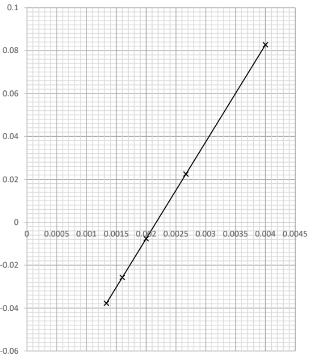

# Mark Schemes — Entropy
**4: Rates, Equilibria & Further Organic Chemistry** · Edexcel International A Level (IAL) Chemistry (YCH11)

## Q1 — medium — 5 marks · structured-questions

### 15((a)) — 2 marks
A value for the standard entropy change in the surroundings is:

- Correct expression for ∆*S*θsurroundings
$-\frac{\DeltaH}{T}=-\frac{25.7}{298}$; **[1 mark]**
- Correct evaluation
**AND**
Correct units
**AND**
Correct sign
– 0.086242 kJ K–1 mol–1 / – 86.242 J K–1 mol–1; **[1 mark]**

**[2 marks]**

- *Make sure your units are consistent:*

  - *If you convert +25.7 kJ mol**–1 **into J mol-1 then make sure your answer is in J K**–1** mol**–1*
- *A correct answer with no working out still scores 2 marks*

### 15((b)) — 3 marks
We can deduce that:

- ∆*S*θsystem must be positive; **[1 mark]**
- ∆*S*θsystem > 86.24 J mol–1 / answer to (a); **[1 mark]**
- (As compound does dissolve) ∆Stotal is > 0 / positive; **[1 mark]**

**[Total: 3 marks]**

- *The ammonium nitrate dissolves and so the reaction is therefore feasible *

  - *For a reaction to be feasible,  Δ**S**total **should be positive when calculated from the Δ**S** **Θ**sys** + Δ**S**Θ**surr*
  
    - *Δ**S**Θ** **total** = Δ**S** **Θ**sys** + Δ**S**Θ**surr*
- *With Δ**S** **Θ**sys **being a negative value,  Δ**S**Θ**surr  **must be a positive value and above 86.24 to bring Δ**S**Θ** **total **above 0  *

  - *E.g  Δ**S**Θ** **total **= 86.25 + (-86.24)= 0.01 J K**-1 **mol**-1*

## Q2 — hard — 20 marks · structured-questions

### 22((a)) — 2 marks
Calculating the standard entropy of one mole of ammonia:

- State or use the equation; **[1 mark]**
- Calculating *S*θ products; **[1 mark]**

*Example Calculation*

Δ*S*θsystem = *S*θproducts – *S*θreactants –98.0 = *S*θproducts – ((0.5 x 192) + (1.5 x 131)) *S*θproducts = 292.5 – 98 *S*θproducts = (+)194.5 / 195 (J K-1 mol-1)

**[Total: 2 marks]**

- *If you give units they must be correct, though they are not needed to score the final mark*
- *You can get both marks if you have the final answer without working; the first marking point is to give you some credit even if you couldn't calculate **S**θ**products *

### 22((b)) — 2 marks
A graph of Δ*S*total against *1/T* on the grid and line of best fit:

- 5 points plotted on the graph to within one square; **[1 mark]**
- Straight line of best fit passing through all points; **[1 mark]**

**[Total: 2 marks]**

### 22((c)) — 3 marks
i)   The gradient of the line plotted in (b), including units:

- Using the line or points from the data to calculate the gradient and units; **[1 mark]**

*Example calculation*

Gradient =`begin mathsize 14px style fraction numerator open parentheses 8.27 space x space 10 to the power of negative sign 2 end exponent close parentheses space – space open parentheses – 0.76 space x space 10 to the power of negative sign 2 end exponent close parentheses over denominator open parentheses 4.00 space x space 10 to the power of negative sign 3 end exponent close parentheses space – space open parentheses 2.00 space x space 10 to the power of negative sign 3 end exponent close parentheses end fraction end style`  = 45.15 kJ mol-1

ii)   The thermodynamic quantity that can be obtained from this gradient.

- Enthalpy change (of reaction) / Δr*H* (of the Haber process); **[1 mark]**

iii)   The temperature at which the reaction ceases to be thermodynamically feasible at a pressure of 100 kPa.

- Value of *T* found either by reading from the graph the value of *T* when Δ*S*total = 0 
**OR** 
By calculation; **[1 mark]**

*Example calculation*

460 (K) Allow an answer between 440 - 480

=  $\frac{\mathrm{answer} \mathrm{to}(c)(i)}{98}$ = $\frac{45150}{98}$ = 460.71 / 460 (K)
**OR** = `fraction numerator ‒ answer space to space left parenthesis straight b right parenthesis over denominator 98 end fraction`

= `begin mathsize 14px style fraction numerator ‒ 45150 over denominator ‒ 98 end fraction end style` = 460.71 / 460 (K)

**[Total: 3 marks]**

- *When finding a gradient from a graph always choose the largest triangle to minimise errors in the scaling*
- *The number of significant figures in the answers is generally ignored unless it is only one*
- *An answer between 42.0 – 48.0 would be acceptable in part i)*

### 22((d)) — 7 marks
i)  The relationship between the total entropy, Δ*S*total , and the equilibrium constant, K:

- Total entropy, Δ*S* = Rln *K*; **[1 mark]**

**OR**

lnK = ΔS / R

**OR** K= e ΔS/R; **[1 mark]**

ii)  The value of the equilibrium constant *K* at 750 K:

- Calculation of ln *K*; **[1 mark]**
- Evaluation of *K*; **[1 mark]**

*Example Calculation*

−37.7 = 8.31 x ln *K* ln *K *= −4.5367 *K* = 0.01071 / 1.071 x 10-2

iii)  Why Δ*S*total decreases with an increase in temperature:

- Δ*S*total decreases because Δ*S*system (and Δ*H*) do not change with temperature (significantly); **[1 mark]**
- Therefore Δ*S*surroundings must decrease (so that Δ*S*total decreases); **[1 mark]**
- This is because Δ*S*surroundings = ‒Δ*H*/T (so as T increases ‒Δ*H*/T becomes less positive because Δ*H* is exothermic); **[1 mark]**

*Alternative*

- The reaction is exothermic;

**AND**

So increasing temperature shits the equilibrium to the left / towards the reactants; **[1 mark]**

- The value of *K* decreases; **[1 mark]**
- Because Δ*S*total is proportional to *K* / Δ*S*total = R ln *K* the value of Δ*S*total decreases;** [1 mark]**

iv)  How the Haber Process is made economically feasible at 750 K even though the total entropy change is negative:

- The overall conversion to ammonia is increased by recycling unused reactants; **[1 mark]**

**[Total: 7 marks]**

- *In part ii) you can score both marks if the final answer is correct even without any workings*
- *In Part iii) you can also express the change as saying the backward reaction is favoured*
- *Another way of expressing why the reaction is economically feasible is by stating that the ammonia is removed from the equilibrium / as it is formed*

### 22((e)) — 6 marks
i)  An equation for the production of this fertiliser.

2NH3 + H3PO4 → (NH4)2HPO4

- Correct formula of diammonium hydrogenphosphate; **[1 mark]**
- Balanced equation; **[1 mark]**

ii)  An **ionic** equation to show that ammonium ions are acidic in aqueous solution.

- NH4+ ⇌ NH3 + H+;

**OR**

NH4+ + H2O ⇌ NH3 + H3O+; **[1 mark]**

iii)  The effect of adding a small amount of acid to this buffer.

- The mixture contains a large amount/ (large) reservoir of both ammonium ions and ammonia / of NH4+ and NH3; **[1 mark]**

*Either*

- Added H+ reacts with ammonia to form ammonium ions / H+ + NH3 ⇌ NH4+;

**OR**

Added H+ combines with OH- ions in water to form water / H+ + OH- → H2O; **[1 mark]**

**AND**

Ammonia reacts with water to produce OH- ions / NH3 + H2O ⇌ NH4+ + OH-; **[1 mark]**

- The ratio of ammonium ions to ammonia hardly changes; **[1 mark]**

**[Total: 6 marks]**

- *Multiples of the coefficients in part i) would be acceptable, as would showing the product as ions as long as the ratios are correct*
- *You don't need to add state symbols*
- *The last mark can also be scored by saying the pH is unchanged or changes very little because the added H**+** is removed and the change in concentration of NH**3** and NH**4**+** is small*

## Q3 — easy — 1 marks · multiple-choice-questions

### 1() — 1 marks
**Correct answer: A** — carbon dioxide, CO2

**Final answer:** **The correct answer is ****A**** because:**

- Entropy is a measure of disorder in a system

  - The more disorder there is,, the higher the entropy
- Gases have a higher entropy than liquids which have a higher entropy than solids
- At 298 K and 1 atmosphere, carbon dioxide and hydrogen are both gases but carbon dioxide consists of larger molecules than hydrogen which results in higher entropy

**B **is incorrect as  copper is a solid at 298 K and 1 atm pressure so has the lowest entropy

**C** is incorrect as  ethanol is a liquid at 298 K and 1 atm pressure and has a lower entropy than a gas

**D** is incorrect as hydrogen is also a gas at 298 K and 1 atm pressure, but its molecules are smaller than carbon dioxide molecules

## Q4 — medium — 1 marks · multiple-choice-questions

### 1() — 1 marks
**Correct answer: D** — SO2

**Final answer:** **The correct answer is ****D**** because:**

- The entropy of a given system is the number of possible arrangements of the particles and their energy in a given system
- The more energy and possible arrangements, (and disorder) the higher the entropy
- SO2 consists of two atoms and a total of 24 electrons
- This is more electrons than the other options given so there is a greater amount of disorder and greater entropy

**A** is incorrect as  although it has four atoms, it has ten electrons

**B** is incorrect as  it has two atoms and two electrons

**C** is incorrect as  it has two atoms and only fourteen electrons

## Q5 — medium — 1 marks · multiple-choice-questions

### 2() — 1 marks
**Correct answer: A** — –198.8

**Final answer:** **The correct answer is ****A**** because:**

- To calculate the standard entropy change:

  - Δ*S*Θ*system* = ΣΔ*S*Θ*products* - ΣΔ*S*Θ*reactants*
  - Δ*S*Θ*system*  = (191.6 + (3 x 130.6) - (2 x 192.3))
  - Δ*S*Θ*system*=  –198.8 J K–1 mol–1
  - Don't forget to consider the number of moles of each substance in the equation

**B** is incorrect as  the number of moles of NH3 and H2 have not been considered

**C** is incorrect as  the number of moles of NH3 and H2 have not been considered and the expression to find the standard entropy of the system is the wrong way round

**D** is incorrect as  the expression to find the standard entropy of the system is the wrong way round

## Q6 — medium — 1 marks · multiple-choice-questions

### 2() — 1 marks
**Correct answer: B** — reactions **P** and **Q** only

**Final answer:** **The correct answer is ****B**** because:**

- For a reaction to be thermodynamically feasible, the total entropy change needs to be positive
- Total entropy change is calculated using Δ*S*Θ total = Δ*S* Θsys + Δ*S*Θsurr
- The total entropy change for **P** is +245 + 34 = 279
- The total entropy change for **Q** is +350 +(-276) = 74

**A** is incorrect as  both reactions **P** and **Q** have a positive value for ∆*S*total

**C** is incorrect as  reaction **R** has a negative value for ∆*S*total so is not feasible

**D** is incorrect as  both reactions **R** and **S** have a negative value for ∆*S*total so are not feasible

## Q7 — medium — 1 marks · multiple-choice-questions

### 3() — 1 marks
**Correct answer: D** — the entropy change of the system, ∆*S*system , is positive

**Final answer:** **The correct answer is ****D**** because:**

- This reaction is endothermic, therefore Δ*S**surroundings** *is negative
- However, Δ*S**system* is positive
- Δ*S**system *> Δ*S**surroundings* and the reaction is spontaneous** **

> *A** is incorrect as  this is a statement not an explanation*

> *B** is incorrect as  activation energy affects rate not direction of change*

> *C** is incorrect as  the overall enthalpy of reaction is still endothermic*

## Q8 — medium — 1 marks · multiple-choice-questions

### 4() — 1 marks
**Correct answer: B** — 

**Final answer:** **The correct answer is ****B**** because:**

- **∆***S*system is positive as a gas is produced, increasing the disorder in the systems which increases the entropy
- **∆***S*surroundings $=-\frac{ΔH}{T}$
- As **∆***H**** ***is positive, **∆***S*surroundings must be negative

**A** is incorrect as endothermic reactions have negative ∆*S*surroundings

**C** is incorrect as  when there are more gas molecules in the products than the reactants ∆*S*system is positive and endothermic reactions have negative ∆*S*surroundings

**D** is incorrect as  when there are more gas molecules in the products than the reactants ∆*S*system is positive

## Q9 — medium — 1 marks · multiple-choice-questions

### 5() — 1 marks
**Correct answer: D** — changes when the temperature changes and when the substance changes state

**Final answer:** **The correct answer is ****D**** because:**

- Entropy is a measure of disorder
- The standard molar entropy of a substance will be different for the substance in different states as the degree of disorder will differ
- The standard molar entropy will also be different for the substance at different temperatures; the higher the temperature, the greater the disorder

**A** is incorrect as  standard molar entropy is affected by change of state and change in temperature

**B** is incorrect as  standard molar entropy is affected by change of state

**C** is incorrect as standard molar entropy is affected change in temperature

## Q10 — medium — 1 marks · multiple-choice-questions

### 5() — 1 marks
**Correct answer: C** — the total entropy change when KCl dissolves is positive

**Final answer:** **The correct answer is ****C**** because:**

- Potassium chloride dissolving in water would be classed as a spontaneous reaction
- For a spontaneous reaction to occur the total entropy must be positive
- In this case it is, as the particles will begin in fixed positions within the solid and become more disordered as they dissolve in the water, causing entropy to increase

**A **is incorrect as the enthalpy change of hydration for all ions and lattice energy for all ionic compounds are exothermic so this does not explain why KCl is soluble

**B** is incorrect as  the enthalpy change of hydration for all ions and lattice energy for all ionic compounds are exothermic

**D **is incorrect as  the total entropy must be positive for a spontaneous reaction

## Q11 — medium — 2 marks · multiple-choice-questions

### 1() — 1 marks
**Correct answer: C** — 

**Final answer:** **The correct answer is C**

- Δ*S*system: the reaction converts 2 moles of gas (CH4 + H2O) into 4 moles of gas (CO + 3H2)

- More moles of gas means more ways to distribute particles and energy quanta, Δ*S*system is positive
- Δ*S*surroundings: the reaction is endothermic (Δ*H*θ = +206 kJ mol⁻¹)

- Heat is taken in from the surroundings, reducing their disorder, Δ*S*surroundings is negative (Δ*S*surr = −Δ*H*/*T*, so a positive Δ*H* gives a negative Δ*S*surr)

**A** is incorrect as the number of moles of gas increases (2 to 4), so Δ*S*system must be positive

**B** is incorrect as Δ*S*system must be positive (more moles of gas) and Δ*S*surr must be negative for an endothermic reaction

**D** is incorrect as Δ*S*surr must be negative for an endothermic reaction (heat taken from surroundings lowers their disorder)

> **[exam-tip]**
> Two independent checks:
> 
> 1. Count the change in moles of gas for Δ*S*system
> 2. Use the sign of Δ*H* for Δ*S*surr
> 
> Examiner reports consistently flag candidates confusing the two. Always state both reasoning steps to reach the correct answer reliably.

### 2() — 1 marks
**Correct answer: C** — Only at high temperatures

**Final answer:** **The correct answer is C**

- From part (a), the reaction has **positive ΔS~system~** and **negative Δ*S*~surroundings~** (endothermic)
- Δ*S*surr = −Δ*H*/*T*, so as temperature **increases**, the magnitude of this (negative) term **decreases** (dividing by a larger *T* gives a smaller number)
- At **low** temperatures: the large negative Δ*S*surr outweighs the positive Δ*S*system → Δ*S*total < 0 → **not feasible**
- At **high** temperatures: the (shrinking) negative Δ*S*surr is outweighed by the positive Δ*S*system → Δ*S*total > 0 → **feasible**
- This is why steam reforming is run industrially at ∼700–1100 °C

**A** is incorrect as at low temperatures the negative Δ*S*surr dominates → Δ*S*total is negative → not feasible

**B** is incorrect as Δ*S*system is positive and outweighs |Δ*S*surr| at sufficiently high temperatures, so the reaction becomes feasible above the tipping-point temperature

**D** is incorrect as the opposite pattern applies: low temperatures give a *larger* magnitude of negative Δ*S*surr, making the reaction **less** feasible, not more

> **[exam-tip]**
> For **endothermic** reactions with **positive Δ*S*~system~**, feasibility is a **high-temperature** story.
> 
> The key relationship Δ*S*surr = −Δ*H*/*T* means the unfavourable (negative) entropy contribution shrinks as *T* rises, eventually letting the positive Δ*S*system win.
> 
> The tipping-point temperature can be calculated from *T* = Δ*H*/Δ*S*system.
> 
> Always convert Δ*H* from kJ to J if Δ*S*system is given in J K⁻¹ mol⁻¹ (as this is a classic Paper 4 trap.
