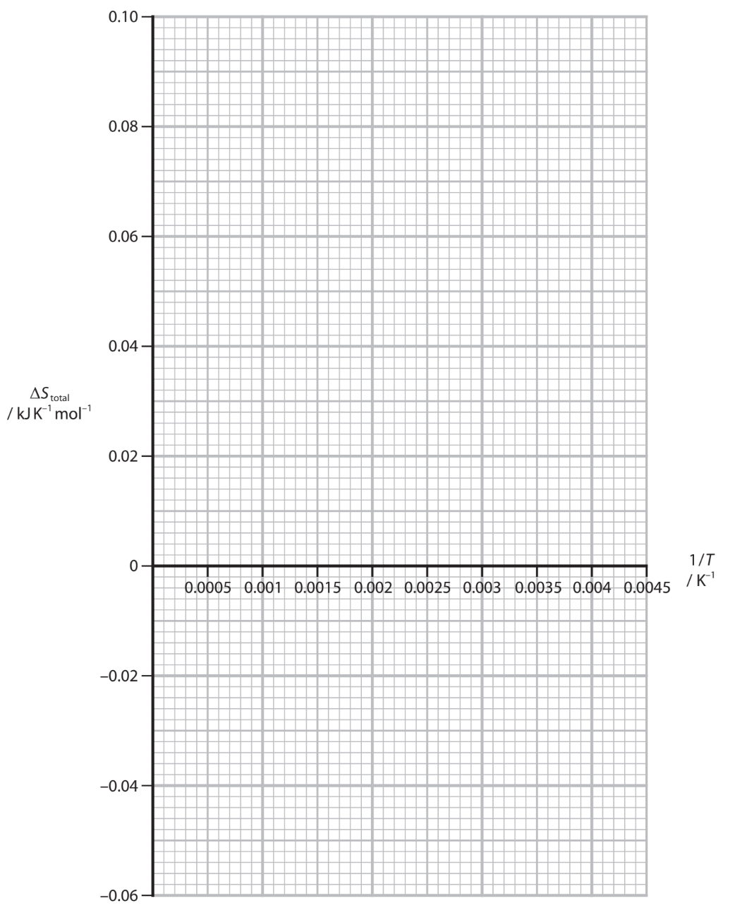

# Exam Questions — Entropy
**4: Rates, Equilibria & Further Organic Chemistry** · Edexcel International A Level (IAL) Chemistry (YCH11)
> Source: [https://www.savemyexams.com/international-a-level/chemistry/edexcel/17/topic-questions/4-rates-equilibria-and-further-organic-chemistry/4-2-entropy/structured-questions/](https://www.savemyexams.com/international-a-level/chemistry/edexcel/17/topic-questions/4-rates-equilibria-and-further-organic-chemistry/4-2-entropy/structured-questions/) · 11 questions · total 35 marks

## Q1 — medium — 5 marks · structured-questions

### 15((a)) — 2 marks — command: calculate — structured — from paper June 2021 · WCH14/01
The standard enthalpy change of solution for ammonium nitrate, NH4NO3 , is +25.7 kJ mol–1.

Calculate the value for the standard entropy change in the surroundings, ∆*S*θsurroundings, when ammonium nitrate dissolves in water at 298 K.  Include a sign and units with your answer.

### 15((b)) — 3 marks — command: explain — structured — from paper June 2021 · WCH14/01
Explain what can be deduced from your answer in (a) about the sign and the value of the standard entropy change in the system, ∆*S*θsystem, when NH4NO3 dissolves.

## Q2 — hard — 20 marks · structured-questions

### 22((a)) — 2 marks — command: calculate — structured — from paper Jan 2022 · WCH14/01
The equation for the formation of ammonia in the Haber Process is shown

1⁄2N2 (g) +1 1⁄2H2 (g) ⇌ NH3 (g)

At 298 K the standard entropy change of the system, `increment S subscript system superscript ⦵` = –98 JK–1mol–1.

Calculate the standard entropy of one mole of ammonia. Use the value of `increment S subscript system superscript ⦵` and the data in the table.

| **Substance** | **Standard molar entropy, **`S to the power of ⦵`**/JK****–1****mol****–1** |
|---|---|
| N2 | 192 |
| H2 | 131 |

### 22((b)) — 2 marks — command: plot — structured — from paper Jan 2022 · WCH14/01
The value of the total entropy change, Δ*S*total , varies with temperature.

Data for the value of Δ*S*total at different temperatures but at standard pressure of 100 kPa are given for this reaction.

| **Temperature / K** | ***1/T***** / K****–1** | **Δ*****S*****total**** / kJ K****–1****mol****–1** |
|---|---|---|
| 250 | 4.00×10–3 | 8.27×10–2 |
| 375 | 2.67×10–3 | 2.25×10–2 |
| 500 | 2.00×10–3 | –0.764×10–2 |
| 625 | 1.60×10–3 | –2.57×10–2 |
| 750 | 1.33×10–3 | –3.77×10–2 |

Plot a graph of Δ*S*total against *1/T* on the grid. Include a line of best fit.

### 22((c)) — 3 marks — command: multiple — structured — from paper Jan 2022 · WCH14/01
The relationship between ΔStotal and 1/T can be found by combining the two equations:

Δ*S*total = Δ*S*surroundings + Δ*S*system

and Δ*S*surroundings = –Δ*H*/T to give

Δ*S*total = –Δ*H/T* + Δ*S*system

i) Determine the gradient of the line plotted in (b), including units in your answer.

**(1)**

ii) Identify the thermodynamic quantity that can be obtained from this gradient.

**(1)**

iii) Determine the temperature at which the reaction ceases to be thermodynamically feasible at a pressure of 100kPa.

**(1)**

### 22((d)) — 7 marks — command: multiple — structured — from paper Jan 2022 · WCH14/01
The industrial synthesis of ammonia

1⁄2N2 (g) +1 1⁄2H2 (g) ⇌ NH3 (g)

is carried out at pressures of about 20000kPa and temperatures between 700 K and 750 K. These temperatures are higher than the answer to (c)(iii).

i) State the relationship between the total entropy, Δ*S*total , and the equilibrium constant, K.

**(1)**

ii) Calculate the value of the equilibrium constant *K* at 750 K. [Δ*S*total at 750K = –37.7JK–1 mol–1]

**(2)**

iii) Explain why Δ*S*total decreases with an increase in temperature.

**(3)**

iv) State how the Haber Process is made economically feasible at 750 K even though the total entropy change is negative.

**(1)**

### 22((e)) — 6 marks — command: multiple — structured — from paper Jan 2022 · WCH14/01
Ammonia from the Haber Process reacts with acids. With phosphoric acid, H3PO4, a number of products are formed in solution. One of these is the fertiliser diammonium hydrogenphosphate.

i) Write an equation for the production of this fertiliser. State symbols are not required.

**(2)**

ii) Write an **ionic** equation to show that ammonium ions are acidic in aqueous solution. 
State symbols are not required.

**(1)**

iii) A solution containing both ammonia and ammonium ions acts as a buffer. 
Explain, using a relevant ionic equation, the effect of adding a small amount of acid to this buffer.

**(3)**

## Q3 — easy — 1 marks · multiple-choice-questions

### 1() — 1 mark — multiple_choice — from paper Jan 2021 · WCH14/01
Which of these has the **highest** standard molar entropy at 298 K and 1 atm pressure?
- **A.** carbon dioxide, CO2
- **B.** copper, Cu
- **C.** ethanol, C2H5OH
- **D.** hydrogen, H2

## Q4 — medium — 1 marks · multiple-choice-questions

### 1() — 1 mark — multiple_choice — from paper June 2021 · WCH14/01
Which of these gases would have the greatest standard molar entropy?
- **A.** NH3
- **B.** H2
- **C.** N2
- **D.** SO2

## Q5 — medium — 1 marks · multiple-choice-questions

### 2() — 1 mark — multiple_choice — from paper June 2021 · WCH14/01
What is the standard entropy change of the system, in J K–1 mol–1, for the reaction between nitrogen and hydrogen to form ammonia?

N2 + 3H2 → 2NH3

|   | ** Standard molar entropy / J K****–1**** mol****–1** |
|---|---|
| H2 | 130.6 |
| N2 | 191.6 |
| NH3 | 192.3 |
- **A.** –198.8
- **B.** –129.9
- **C.** +129.9
- **D.** +198.8

## Q6 — medium — 1 marks · multiple-choice-questions

### 2() — 1 mark — multiple_choice — from paper Jan 2021 · WCH14/01
The entropy change of the surroundings, Δ*S*surroundings, and the entropy change of the system,  Δ*S*system, for four different reactions are given.

| **Reaction** | **Δ*****S*****surroundings ****/ J K****−1**** mol****−1** | **Δ*****S*****system ****/ J K****−1**** mol****−1** |
|---|---|---|
| **P** | +245 | +34 |
| **Q** | +350 | −276 |
| **R** | −482 | +65 |
| **S** | −563 | −128 |

Which of these is thermodynamically feasible?
- **A.** reaction **P** only
- **B.** reactions **P** and **Q** only
- **C.** reaction **R** only
- **D.** reactions **R** and **S** only

## Q7 — medium — 1 marks · multiple-choice-questions

### 3() — 1 mark — multiple_choice — from paper Oct 2021 · WCH14/01
Ammonium nitrate is very soluble in water.

NH4NO3 (s) + aq → N$H_{4}^{+}$ (aq) + N$O_{3}^{-}$ (aq)  ∆`H to the power of ⦵`= +25.8 kJ mol−1

What is the best explanation for this?
- **A.** all ammonium salts are soluble in water
- **B.** the activation energy of the reaction is very low
- **C.** the enthalpies of hydration of the ions are very exothermic
- **D.** the entropy change of the system, ∆*S*system , is positive

## Q8 — medium — 1 marks · multiple-choice-questions

### 4() — 1 mark — multiple_choice — from paper Oct 2021 · WCH14/01
The decomposition of calcium carbonate is an important reaction in the manufacture of cement.

CaCO3 (s) → CaO (s) + CO2 (g)     ∆`H to the power of ⦵`= +178 kJ mol−1

What are the signs of the entropy change of the system, ∆*S*system , and of the entropy change of the surroundings, ∆*S*surroundings ?

|   | ** ** | **Sign of ∆*****S*****system** | **Sign of ∆*****S*****surroundings** |
|---|---|---|---|
| ☐ | **A** | positive | positive |
| ☐ | **B** | positive | negative |
| ☐ | **C** | negative | positive |
| ☐ | **D** | negative | negative |
- **A.** 
- **B.** 
- **C.** 
- **D.** 

## Q9 — medium — 1 marks · multiple-choice-questions

### 5() — 1 mark — multiple_choice — from paper Oct 2021 · WCH14/01
The standard molar entropy, `S to the power of ⦵`, of a substance
- **A.** is not affected by changes of state or changes in temperature
- **B.** only changes when the temperature changes
- **C.** only changes when the substance changes state
- **D.** changes when the temperature changes and when the substance changes state

## Q10 — medium — 1 marks · multiple-choice-questions

### 5() — 1 mark — multiple_choice — from paper Jan 2021 · WCH14/01
The standard enthalpy change of solution of potassium chloride, KCl, is +17 kJ mol−1.

The solubility of potassium chloride in water at 298 K is 359 g dm−3.

Which of these explains the solubility of potassium chloride in water?
- **A.** the hydration enthalpy of K+ and the lattice energy of KCl are exothermic
- **B.** the hydration enthalpy of K+ and the lattice energy of KCl are endothermic
- **C.** the total entropy change when KCl dissolves is positive
- **D.** the total entropy change when KCl dissolves is negative

## Q11 — medium — 2 marks · multiple-choice-questions

### 1() — 1 mark — multiple_choice
Methane reacts with steam in the industrial process known as steam reforming. This is the main route for producing hydrogen used in the Haber process.

CH4 (g) + H2O (g) ⇌ CO (g) + 3H2 (g)      Δ*H*θ = +206 kJ mol⁻¹

What are the signs of the entropy changes for this reaction?

|   | Δ*S*system | Δ*S*surroundings |
|---|---|---|
| **A** | negative | negative |
| **B** | negative | positive |
| **C** | positive | negative |
| **D** | positive | positive |
- **A.** 
- **B.** 
- **C.** 
- **D.** 

### 2() — 1 mark — multiple_choice
From the equation in part (a), at which temperature(s) is the reaction feasible?
- **A.** At all temperatures
- **B.** Never feasible
- **C.** Only at high temperatures
- **D.** Only at low temperatures
