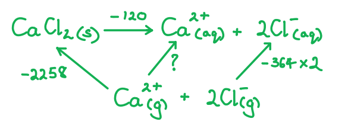

# Mark Schemes — Energetics
**4: Rates, Equilibria & Further Organic Chemistry** · Edexcel International A Level (IAL) Chemistry (YCH11)

## Q1 — medium — 6 marks · structured-questions

### 18() — 6 marks
Compare and contrast the type and strength of bonding in these compounds:

Chemical ideas expressed:

- The bonding in sodium chloride is (almost) 100% ionic bonds
**AND**
As the theoretical and Born-Haber values are (very) similar
- The bonding in magnesium iodide has some covalent character
**AND**
As the theoretical and Born-Haber values are (significantly) different
- The anion is (more) polarised in magnesium iodide (than sodium chloride)
- The magnesium ion has a greater charge density (than sodium ion), so greater polarising power
- The iodide ion is larger (than chloride ion), so is more easily polarised
- Magnesium iodide has stronger bonding than sodium chloride because the charge on the magnesium ion is twice as large (as the charge on the sodium ion)

**[Total: 6 marks]**

- *You will be penalised once in your answer if you use the word 'atoms' instead of ions'*
- *You must reference polarisation at least once to achieve marks 3, 4 and 5 *
- *An answer scoring** 6** marks would include*

  - *6 correct marking points **AND **the answer is written in a clear and logical order and points fully explained *
- *An answer scoring** 5** marks would include*

  - *5-4 correct marking points **AND **the answer is written in a clear and logical order and points fully explained *
- *An answer scoring** 4** marks would include*

  - *4-3 correct marking points **AND **the answer has some structure and gives some explained points*

- *An answer scoring **3** marks would include*

  - *3-2 correct marking points **AND **the answer has some structure and gives some explained points*

## Q2 — hard — 10 marks · structured-questions

### 1() — 2 marks
> **[mark-scheme]**
> Lattice energy is:
> 
> - The enthalpy change / heat energy released when **one mole** of an ionic solid is formed from its constituent gaseous ions under standard conditions. **[1 mark]**
> 
> The balanced equation with state symbols is:
> 
> - Mg2+ (g) + 2I- (g) → MgI2 (s) **[1 mark]**
> 
> Specific standard conditions of 298K, 100 kPa (and ion concentrations of 1.00 mol dm-3) are accepted as standard conditions
> 
> The definition must be gaseous ions forming the ionic solid, the reverse endothermic process is not accepted
> 
> The equation must have correct balancing, charges and state symbols to achieve the mark

> **[exam-tip]**
> Edexcel defines lattice energy as the **exothermic** direction, meaning gaseous ions forming the solid lattice. Some older textbooks use the endothermic direction (solid lattice breaking up), so stick to the Edexcel convention.
> 
> Every energetics definition must include three elements:
> 
> 1. **One mole**
> 2. **Gaseous ions**
> 3. **Solid ionic lattice**.
> 
> Missing any of these loses the definition mark.
> 
> State symbols are non-negotiable in energetics equations. The gaseous ions must be (g) and the final ionic lattice must be (s).

### 2() — 5 marks
The completed Born-Haber cycle should show the following species at each level (from bottom to top):

1. MgI2 (s) (final ionic lattice, bottom)
2. Mg (s) + I2 (s) (elements in standard states; note iodine's standard state is solid, not gas)
3. Mg (g) + I2 (s) (after atomisation of Mg, given)
4. Mg+ (g) + 2I (g) + e- (after 1st IE of Mg)
5. Mg2+ (g) + 2I (g) + 2e- (after 2nd IE of Mg)
6. Mg (g) + 2I (g) (after 2 x atomisation of I; this step includes both sublimation of I2 and bond dissociation)
7. Mg2+ (g) + 2I- (g) (after 2 x 1st EA of I, downward arrow)
8. MgI2 (s) (after lattice energy, large downward arrow)

**[5 marks]**

> **[mark-scheme]**
> 1 mark for left-hand side upward arrows correctly labelled for first ionisation energy of Mg, second ionisation energy of Mg and atomisation of iodine (x2)
> 
> 1 mark for right-hand side downward arrows correctly labelled for electron affinity of iodine (x2) and Lattice Energy
> 
> 1 mark for correct species and state symbols on all horizontal energy levels
> 
> 1 mark for electrons (*e*−) shown explicitly on the appropriate levels after ionisations
> 
> 1 mark for Mg2+ (g) + 2I- (g) shown at the highest energy level

> **[exam-tip]**
> Edexcel examiner reports consistently penalise **missing state symbols** and **missing electrons**; these are the easiest marks to gain and the easiest to lose. Walk through every horizontal line in your cycle and ask:
> 
> 1. What species are here?
> 2. What are their states?
> 3. Are there free electrons to account for?
> 
> Note that iodine's standard state is **I****2**** (s)** (solid), unlike chlorine which is a gas. The atomisation step for iodine therefore spans from I2 (s) to I (g) and includes both sublimation and bond dissociation. A common error is writing I2 (g) at the datum line.
> 
> The **x2 multiplier** for atomisation and electron affinity of I is another common pitfall. You need two I atoms to make MgI2, so you need 2 x Δat*H*(I) and 2 x EA(I). You can write "2 x ..." on a single arrow or draw two separate arrows stacked, both are accepted.
> 
> Arrow directions are fixed by physics:
> 
> - Atomisation, ionisation, and 2nd electron affinity are always endothermic (up).
> - 1st electron affinity and lattice energy are always exothermic (down).

### 3() — 3 marks
To calculate the lattice energy of MgI2, apply Hess’s Law around the Born-Haber cycle:

- State the Hess expression:

Δf*H*° = Δat*H*°(Mg) + 2Δat*H*°(I) + IE1(Mg) + IE2(Mg) + 2 × EA(I) + LE **[1 mark]**

- Substitute values with correct signs:

−364 = +148 + (2 × 107) + 738 + 1451 + (2 × −295) + LE

−364 = +148 + 214 + 738 + 1451 − 590 + LE

−364 = 1961 + LE **[1 mark]**

- Rearrange for LE:

LE = −364 − 1961

LE = **−2325 kJ mol****−1** **[1 mark]**

> **[mark-scheme]**
> 1 mark for correct Hess expression with all multipliers shown:
> 
> Δf*H*° = Δat*H*(Mg) + 2 × Δat*H*(I) + IE1 + IE2 + 2 × EA(I) + LE
> 
> 1 mark for correct substitution with signs and correct coefficients (all exothermic values negative, all endothermic values positive)
> 
> 1 mark for a final answer in the range −2323 to −2327 kJ mol−1, with correct sign (negative/exothermic) and units
> 
> Allow error carried forward if the student uses their own (consistent) Born-Haber cycle from part (b)

> **[exam-tip]**
> The **multiplier error** is the biggest mark-loss in Born-Haber calculations: you need **2** moles of I for MgI2:
> 
> - Atomisation of I is doubled
> - Electron affinity of I is doubled
> - Write these as "2 × ..." in your Hess expression so you can see them before substituting.
> 
> Check the sign of your final answer:
> 
> - Lattice energies are always **large and negative** (exothermic).
> - A positive lattice energy almost certainly means you have a sign error.
> 
> A value around −2000 to −2500 kJ mol−1 is typical for MX2 compounds.
> 
> Always write out the full Hess expression before substituting numbers. It forces you to think carefully about which values need the ×2 multiplier and which don’t.

## Q3 — easy — 1 marks · multiple-choice-questions

### 3() — 1 marks
**Correct answer: C** — enthalpy change of formation of Na2SO4

**Final answer:** **The correct answer is ****C**** because:**

- To calculate the enthalpy change of solution of sodium sulfate, Na2SO4 the following equation is used:

  - Δsol*H*ꝋ = Δhyd*H*ꝋ + Δlatt*H*ꝋ
  - Δ*latt**H*ꝋ is the lattice enthalpy for sodium sulfate
  - Δ*hyd**H*ꝋ includes the enthalpy change of hydration for both the sodium and sulfate ions

**A**, **B **and **D** are incorrect as  they are all required to find the enthalpy change of solution

## Q4 — medium — 2 marks · multiple-choice-questions

### 1((a)) — 1 marks
**Correct answer: B** — 1⁄2I2(s) → I(g)

**Final answer:** **The correct answer is ****B**** because:**

- By definition atomisation occurs when free gaseous atoms are produced
- The element must be in its standard state
- One mole of gaseous gaseous must be formed
- Option **B** fits all the criteria:

1⁄2I2(s) → I(g)

**A** is incorrect as atomisation of an element is from its standard state and iodine is a solid

**C** is incorrect as  atomisation produces 1 mole of atoms and requires solid iodine

**D** is incorrect as atomisation produces 1 mole of atoms

### 1((b)) — 1 marks
**Correct answer: A** — –298 kJ mol–1

**Final answer:** **The correct answer is ****A****  because:**

- Starting from the lattice enthalpy (diagonal arrow):
- + (+160) + (+107) + (+520) + EA(I2) + (-759) = -270
- 28 + EA(I2) = -270
- Electron affinity of iodine = -270-28 = -298 kJ mol-1

**B** is incorrect as this value has had 28 added to ‒270 rather than subtracted from it

**C** is incorrect as first electron affinity values are always exothermic

**D **is incorrect as first electron affinity values are always exothermic and the wrong sign has been used for the enthalpy change of hydration

- It's a good idea to separate the sign of the enthalpy change from the mathematical operation by using brackets
- As you go around the cycle add the terms that follow the arrows, subtract the terms that go against the direction of the arrows

## Q5 — medium — 2 marks · multiple-choice-questions

### 4((a)) — 1 marks
**Correct answer: C** — potassium bromide

**Final answer:** **The correct answer is ****C**** because:**

- Lattice energy is dependent on the size and charge of the ions
- Larger ions cause the lattice energy to be less exothermic as the charge of the ions is more spread out resulting in a weaker electrostatic attraction between the two ions
- A larger ionic charge causes the lattice energy to be more exothermic as it causes a stronger attraction between the two ions
- Potassium and bromine are both in Period 4 of the Periodic Table and have charges of 1+ and 1- respectively
- They therefore have the largest ions and smallest charge compared to the other ionic compounds resulting in the least exothermic lattice enthalpy

**A **is incorrect as the least exothermic lattice energy is between the largest ions with the smallest charge and calcium ions are smaller and have a higher charge than potassium ions

**B** is incorrect as the least exothermic lattice energy is between the largest ions with the smallest charge and magnesium ions are smaller and have a higher charge than potassium ions

**D** is incorrect as  sodium ions are smaller than potassium ions

### 4((b)) — 1 marks
**Correct answer: B** — magnesium chloride

**Final answer:** **The correct answer is ****B**** because:**

- Theoretical lattice energies do not take into account the polarising power of the cation which can distort the electron density of the anion causing covalent character
- Small cations with a large charge density have the greatest polarising power and will cause the greatest distortion

  - From the options given, magnesium ions are the smallest and have a higher charge than potassium and sodium

**A **is incorrect as Ca2+ ions are larger than magnesium ions so will polarise less

**C** is incorrect as K+ ions are larger than magnesium ions and have a lower charge so will polarise less

**D **is incorrect as Na+ ions are larger than magnesium ions and have a lower charge so will polarise less

## Q6 — medium — 3 marks · multiple-choice-questions

### 7((a)) — 1 marks
**Correct answer: B** — y/2

**Final answer:** **The correct answer is ****B**** because:**

- The electron affinity of an element is the energy change when one mole of electrons is gained by one mole of gaseous atoms of an element to form one mole of gaseous ions under standard conditions
- The first electron affinity of chlorine is shown by the equation:

  - Cl (g) + e– → Cl- (g)
- The Born-Haber cycle in the question shows 2 moles of gaseous Cl atoms forming 2 moles of gaseous Cl- ions, which has an enthalpy change of y
- Therefore, the value of the enthalpy change for 1 mole of gaseous Cl atoms to form 1 mole of gaseous Cl- ions is half of this value

**A** is incorrect as the electron affinity of an element refers to a single atom of that element

**C** is incorrect as this includes the atomisation energy of two atoms of chlorine

**D** is incorrect as  this includes the atomisation energy of chlorine

### 7((b)) — 1 marks
**Correct answer: A** — LE = u − (v + w + x + y)

**Final answer:** **The correct answer is ****A**** because:**

- There are two routes of going from the two elements in their standard states, one directly and one indirectly

  - The enthalpy change of the direct route = u
  - The enthalpy change of the indirect route = v + w + x + y + LE
- The enthalpy change of each route will be there same, therefore:

  - u = v + w + x + y + LE
- Rearranging gives:

  - LE = u - (v + w + x + y)

**B** is incorrect as this expression gives −LE

**C** is incorrect as the electron affinity (x2) term and the enthalpy of formation have the wrong sign

**D** is incorrect as  this is the reverse of C which itself is incorrect.

### 7((c)) — 1 marks
**Correct answer: C** — the sum of the first and second ionisation energies of magnesium

**Final answer:** **The correct answer is ****C**** because:**

- The change that occurs in this part of the cycle is:

  - Mg (g) → Mg2+ (g) + 2e-
- This corresponds to the sum of the first and second ionisation energies of magnesium
- 1st ionisation energy of magnesium:

  - Mg (g)  → Mg+ (g) + e-
- 2nd ionisation energy of magnesium:

  - Mg+ (g) → Mg2+ (g) + e-
- Overall, this corresponds to Mg (g) → Mg2+ (g) + 2e-
- Usually, these two changes are shown as separate steps in a Born-Haber cycle

**A** is incorrect as x includes the second ionisation energy

**B** is incorrect as  x includes the first ionisation energy

**C** is incorrect as x does not include the atomisation energy of Mg

## Q7 — medium — 1 marks · multiple-choice-questions

### 1() — 1 marks
**Correct answer: B** — 

**Final answer:** **The correct answer is B**

- Aqueous ammonia is a weak base and hydrochloric acid is a strong acid
- For a strong acid + weak base titration, the equivalence point lies below pH 7 (the salt formed, NH4Cl, is acidic in solution)
- The steep vertical section of the titration curve is in the acidic region
- A suitable indicator has its colour-change range (pKIn) lying entirely within this steep section
- Methyl orange (pH 3.1–4.4) changes colour in the acidic region where the equivalence point lies therefore is suitable

**A** is incorrect as bromothymol blue changes colour at near-neutral pH (6.0–7.6), which falls in the gradual part of the curve, not the steep vertical section

**C** is incorrect as phenol red (6.8–8.4) also lies in the gradual section. Its range straddles neutral pH rather than the acidic equivalence region

**D** is incorrect as phenolphthalein (8.3–10.0) changes colour in the basic region, suitable for weak acid + strong base titrations (equivalence above pH 7), but not for strong acid + weak base

> **[exam-tip]**
> Three-step method:
> 
> 1. Identify whether the acid/base is strong or weak;
> 2. Predict the equivalence-point pH (above/below/at 7);
> 3. Pick the indicator whose pKᴵⁿ falls within the steep vertical section.
> 
> Examiner reports consistently flag candidates picking phenolphthalein for strong acid + weak base titrations (or methyl orange for weak acid + strong base), always check the direction of the equivalence-point pH.

## Q8 — hard — 1 marks · multiple-choice-questions

### 2() — 1 marks
**Correct answer: B** — –1650 kJ mol–1

**Final answer:** **The correct answer is ****B**** because:**

- You can solve this in an equation or using a Hess cycle:
- Δ*H* hydCa2+ +(-364 x 2) = +(-2258) + (-120)
- Δ*H* hydCa2+ -728 = -2258 -120
- Δ*H* hydCa2+ = -1650 kJ mol-1
- A Hess cycle for this problem is:

**A** is incorrect as this uses the wrong sign for the enthalpy change of solution

**C** is incorrect as this uses only one mole of chloride ions

**D** is incorrect as  this does not change the sign of the lattice enthalpy

- Always be careful to check the molar quantities - in this case two moles of chloride ions are present
