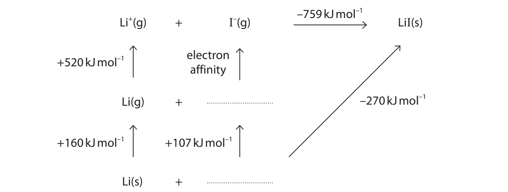
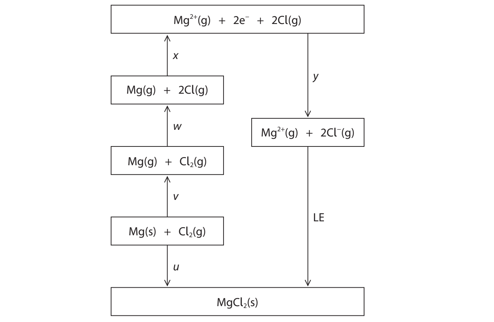

# Exam Questions — Energetics
**4: Rates, Equilibria & Further Organic Chemistry** · Edexcel International A Level (IAL) Chemistry (YCH11)
> Source: [https://www.savemyexams.com/international-a-level/chemistry/edexcel/17/topic-questions/4-rates-equilibria-and-further-organic-chemistry/4-3-energetics/structured-questions/](https://www.savemyexams.com/international-a-level/chemistry/edexcel/17/topic-questions/4-rates-equilibria-and-further-organic-chemistry/4-3-energetics/structured-questions/) · 8 questions · total 26 marks

## Q1 — medium — 6 marks · structured-questions

### 18() — 6 marks — command: contrast — structured — from paper June 2021 · WCH14/01
The table shows the theoretical and experimental (Born-Haber) lattice energy data for two metal halide compounds, sodium chloride and magnesium iodide.

|   | **Lattice energy / kJ mol****–1** |   |
|---|---|---|
| **Metal halide** | **Theoretical** | **Experimental** **(Born-Haber)** |
| Sodium chloride | −770 | −780 |
| Magnesium iodide | −1944 | −2327 |

Using the data, compare and contrast the type and strength of bonding in these compounds. Give reasons for your answers.

## Q2 — hard — 10 marks · structured-questions

### 1() — 2 marks — command: define — structured
This question is about the energetics of ionic compounds.

Define the term **lattice energy**. Include a balanced equation, with state symbols, to represent the lattice energy of magnesium iodide, MgI2.

### 2() — 5 marks — command: complete — structured
The Born-Haber cycle for MgI2 is partially drawn below.

Complete the Born-Haber cycle for MgI2. Your diagram must include:

- The correct species at each energy level, with state symbols
- All electrons shown explicitly
- Labels for each enthalpy change

### 3() — 3 marks — command: calculate — structured
Using the data below and your Born-Haber cycle, calculate the lattice energy of MgI2.

| Enthalpy change | Value / kJ mol−1 |
|---|---|
| Δf*H*°(MgI2) | −364 |
| Δat*H*°(Mg) | +148 |
| Δat*H*°(I) | +107 |
| 1st IE(Mg) | +738 |
| 2nd IE(Mg) | +1451 |
| 1st EA(I) | −295 |

## Q3 — easy — 1 marks · multiple-choice-questions

### 3() — 1 mark — multiple_choice — from paper June 2021 · WCH14/01
The enthalpy change of solution of sodium sulfate, Na2SO4 , may be calculated using three pieces of data.
Which of these pieces of data is **not** required?
- **A.** lattice energy of Na2SO4
- **B.** enthalpy change of hydration of Na+
- **C.** enthalpy change of formation of Na2SO4
- **D.** enthalpy change of hydration of $\mathrm{SO}_{4}^{2-}$

## Q4 — medium — 2 marks · multiple-choice-questions

### 1((a)) — 1 mark — multiple_choice — from paper Jan 2022 · WCH14/01
A simplified Born-Haber cycle for the formation of lithium iodide is shown.

The enthalpy change of atomisation of iodine (+107 kJ mol–1) is given by the equation
- **A.** 1⁄2I2(g) → I(g)
- **B.** 1⁄2I2(s) → I(g)
- **C.** I2(g) → 2I(g)
- **D.** I2(s) → 2I(g)

### 1((b)) — 1 mark — multiple_choice — from paper Jan 2022 · WCH14/01
Use the information in the cycle to calculate the electron affinity of iodine.
- **A.** –298 kJ mol–1
- **B.** –242 kJ mol–1
- **C.** +242 kJ mol–1
- **D.** +298 kJ mol–1

## Q5 — medium — 2 marks · multiple-choice-questions

### 4((a)) — 1 mark — multiple_choice — from paper Jan 2021 · WCH14/01
This question is about four ionic compounds.

Which of these compounds would be expected to have the **least** exothermic lattice energy?
- **A.** calcium chloride
- **B.** magnesium chloride
- **C.** potassium bromide
- **D.** sodium bromide

### 4((b)) — 1 mark — multiple_choice — from paper Jan 2021 · WCH14/01
Which of these compounds would be expected to have the **largest** difference between their experimental (Born–Haber) and theoretical lattice energies?
- **A.** calcium chloride
- **B.** magnesium chloride
- **C.** potassium bromide
- **D.** sodium bromide

## Q6 — medium — 3 marks · multiple-choice-questions

### 7((a)) — 1 mark — multiple_choice — from paper Oct 2021 · WCH14/01
The diagram shows the Born-Haber cycle for magnesium chloride.

Which of these is the electron affinity of chlorine?
- **A.** y
- **B.** y/2
- **C.** (w + y)
- **D.** (w + y)/2

### 7((b)) — 1 mark — multiple_choice — from paper Oct 2021 · WCH14/01
Which expression gives the lattice energy (LE) for magnesium chloride?
- **A.** LE = u − (v + w + x + y)
- **B.** LE = v + w + x + y − u
- **C.** LE = y − u − (v + w + x)
- **D.** LE = v + w + x − y + u

### 7((c)) — 1 mark — multiple_choice — from paper Oct 2021 · WCH14/01
Which energy change in the cycle does x represent?
- **A.** the first ionisation energy of magnesium
- **B.** the second ionisation energy of magnesium
- **C.** the sum of the first and second ionisation energies of magnesium
- **D.** the sum of the enthalpy change of atomisation and the first and second ionisation energies of magnesium

## Q7 — medium — 1 marks · multiple-choice-questions

### 1() — 1 mark — multiple_choice
Aqueous ammonia is titrated with hydrochloric acid.

Which of these is the most suitable indicator for this titration?

|   | Indicator | pH range |
|---|---|---|
| **A** | Bromothymol blue | 6.0–7.6 |
| **B** | Methyl orange | 3.1–4.4 |
| **C** | Phenol red | 6.8–8.4 |
| **D** | Phenolphthalein | 8.3–10.0 |
- **A.** 
- **B.** 
- **C.** 
- **D.** 

## Q8 — hard — 1 marks · multiple-choice-questions

### 2() — 1 mark — multiple_choice — from paper Jan 2022 · WCH14/01
Some energy changes are given in the table.

| **Energy change** | **Value / kJ mol****–1** |
|---|---|
| Lattice energy for CaCl2(s) | –2258 |
| Enthalpy change of solution of CaCl2(s) | –120 |
| Enthalpy change of hydration of Cl–(g) | –364 |

Use these data to calculate the enthalpy change of hydration of Ca2+(g).
- **A.** –1410 kJ mol–1
- **B.** –1650 kJ mol–1
- **C.** –2014 kJ mol–1
- **D.** –3106 kJ mol–1
