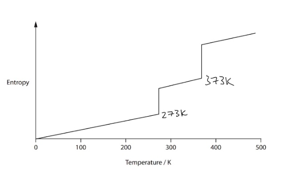

# Mark Schemes — Chemical Equilibria
**4: Rates, Equilibria & Further Organic Chemistry** · Edexcel International A Level (IAL) Chemistry (YCH11)

## Q1 — medium — 9 marks · structured-questions

### 19((a)) — 6 marks
i) The expression for the equilibrium constant, *K*p, for the reaction is:

- *K*p = `fraction numerator p open parentheses straight C subscript 2 straight H subscript 5 OH close parentheses over denominator p open parentheses straight C subscript 2 straight H subscript 4 close parentheses space cross times space p open parentheses straight H subscript 2 straight O close parentheses end fraction`; **[1 mark]**

ii) The equilibrium constant, *K*p, for the hydration of ethene at 150 °C is:

|   | **C****2****H****4** | **H****2****O** | **C****2****H****5****OH** |
|---|---|---|---|
| **Initial mol** | 1.00 | 1.00 | 0.00 |
| **Change mol** | -0.45 | -0.45 | +0.45 |
| **Equil****m**** mol** | 0.55 | 0.55 | 0.45 |
| **Mole fraction** | $\frac{0.55}{1.55}$ = 0.3548... | $\frac{0.55}{1.55}$ = 0.3548... | $\frac{0.45}{1.55}$ = 0.2903... |
| **Partial pressure** | 50 x 0.3548... | 50 x 0.3548... | 50 x 0.2903... |
| **Partial pressure values** | 17.742 | 17.742 | 14.516 |

- Calculation of moles at equilibrium; **[1 mark]**
- Calculation of mole fractions at equilibrium; **[1 mark]**
- Calculation of partial pressures at equilibrium; **[1 mark]**
- Substitution of values into equation:  *K*p = $\frac{14.516}{17.742\times17.742}$; **[1 mark]**
- Calculation of *K*p *K*p = 0.0046116 / 4.6116 x 10-2 
**AND** 
Units of atm−1; **[1 mark]**

**[Total: 6 marks]**

- *Careful**: When writing the expression for** K**p**, do not use square brackets as this denotes concentration*
- *Use an ICE table to deduce the number of moles of each species at equilibrium, as shown above*
- *ICE stands for** I**nitial, **C**hange and **E**quilibrium*
- *To work out the change in the number of moles of each species, use the balanced symbol equation*
- *The change in the number of moles of C**2**H**5**OH is + 0.45 moles, i.e. it has increased by 0.45 moles (from 0.0 to 0.45 moles)*
- *As it is a 1:1:1 reacting ratio, the number of moles of C**2**H**4** and H**2**O must both decrease by 0.45 moles giving both an equilibrium amount of 0.55 moles (1.00 - 0.45 = 0.55 moles)*
- *Mole fractions can be calculated by:*

  - *Mole fraction of A = moles of A ÷ total number of moles*
  - *In this case the total number of moles at equilibrium = 0.55 + 0.55 + 0.45 = 1.55 moles*
- *Partial pressures are calculated by:*

  - *Partial pressure of A = mole fraction of A x total pressure*
- *The units of **K**p** can be deduced by substituting the units into the expression for **K**p** and simplifying:*
- *Units of **K**p** = *$\frac{\mathrm{atm}}{\mathrm{atm}\times\mathrm{atm}}=\frac{1}{\mathrm{atm}}=\mathrm{atm}^{-1}$

### 19((b)) — 3 marks
Commenting on the conditions in relation to their effect on the equilibrium and the overall yield of ethanol:

- High pressure favours the formation of ethanol
**AND**
because 2 mol (of gas) form 1 mol; **[1 mark]**
- High temperature lowers the formation of ethanol
**AND**
because the (forward) reaction is exothermic; **[1 mark]**
- High temperature is needed because otherwise the rate of reaction is too slow
**OR**
Unconverted reactants can be recycled to increase the overall yield; **[1 mark]**

**[Total: 3 marks]**

- *For the first 2 marks, you could refer to:*

  - *The yield of ethanol, i.e. high pressure increases yield and high temperature decreases yield*
  - *The shift in equilibrium, i.e. high pressure shifts equilibrium to the right, high pressure shifts equilibrium to the left*
- *If you gave the first statements for the first 2 marks without an explanation, you would score 1 out of the 2 marks*
- *You could have given the reverse of any of these statements for the marks*
- *Temperature conditions are often a compromise between rate and yield when the forward reaction is exothermic *

## Q2 — medium — 12 marks · structured-questions

### 21((a)) — 6 marks
i)  The value of the equilibrium constant, *K*c, for this reaction at 25°C:

- Calculation of the moles of acid present in the mixture; **[1 mark]**
- Calculation of the moles of ester and water present in the mixture; **[1 mark]**
- Calculation of the moles of ethanol present in the mixture; **[1 mark]**
- Correct expression for *K*c and final answer; **[1 mark]**

*Example calculation*

mol of acid = mol of NaOH = $\frac{34.8\times2.50}{1000}=0.087$(mol) mol of ester = mol of water = 0.2 – 0.087 = 0.113(mol)

mol of ethanol = 0.150 – 0.113 = 0.037

*K*c = `begin mathsize 14px style fraction numerator space open square brackets C H subscript 3 C O O C subscript 2 H subscript 5 close square brackets open square brackets H subscript 2 O close square brackets space over denominator space open square brackets C H subscript 3 C O O H close square brackets open square brackets C subscript 2 H subscript 5 O H close square brackets space end fraction end style`= 3.9668 / 4.0 
**AND**
a statement that the volumes cancel out

**OR**

*K*c = $\frac{0.113/V\times0.113/V}{0.087/V\times0.037/V}=$3.9668 / 4.0  (no units)

ii)  How a small enthalpy change might have been predictable:

- The <u>same type</u> of / similar bonds being broken and made; **[1 mark]**
- The<u> same number </u>of each type of bond being broken and made; **[1 mark]**

**[Total: 6 marks]**

- *Notice you do have to include water in the calculation of **K**c**, which is not the case when dealing with aqueous solutions where water is present in a large quantity and therefore its concentration is effectively constant *

  - *You can still get most of the marks for this question by forgetting to include water as long as this rest is correct*
- *An easy mistake to make here is to assume that 0.087 mol of acid used up will give 0.087 mol of ester and water; however, that is incorrect, 0.087 mol of acid is left after equilibrium, not the moles of acid used up*

  - *The moles of acid used up is: initial amount-equilibrium amount: 0.200- 0.087 = 0.113*
- *A way to manage this type of calculation systematically is to make what is called an ICE table: initial, change, equilibrium*

|   | > *CH**3**COOH(l) * | > *C**2**H**5**OH(l)* | > *CH**3**COOC**2**H**5**(l)* | > * H**2**O(l)* |
|---|---|---|---|---|
| > *Initial/ mol* | > *0.200* | > *0.150* | > *0* | > *0* |
| > *Change/ mol* | > *0.087-0.200 = -0.113* | > *-0.113* | > *+0.113* | > *+0.113* |
| > *Equilibrium/ mol* | > *0.087* | > *0.150-0.113= 0.037* | > *0.113* | > *0.113* |

- *Don't forget the **K**c** is expressed it terms of concentrations not moles so you have to divide moles by the volume*
- *The volume is constant cancels out in the expression, but it still must be shown or reference to score the final mark in part i)*
- *In part ii) you can get credit for listing the actual bonds broken and made (C-O and O-H) to illustrate the explanation*

### 21((b)) — 6 marks
i)  The carboxylic acid, alcohol and catalyst used in Reaction **1**.

Any **three** correct; **[2 marks]**

Any **two** correct; **[1 mark]**

- methanoic acid;
- Catalyst: (concentrated) sulfuric acid;
- 2-methylpropan-1-ol;

ii)  **One** advantage and **one** disadvantage of using Reaction 2 rather than Reaction **1**.

Any **one** of the following advantages and explanation:

- No heat required / works at room temperature; **[1 mark]**
- So reduces energy cost; **[1 mark]**

**OR**

- No catalyst required; **[1 mark]**
- Reducing product purification costs / making purification easier / no need to recover catalyst; **[1 mark]**

**OR**

- Reaction is not an equilibrium / reaction goes to completion; **[1 mark]**
- So produces a higher yield; **[1 mark]**

Any **one** of the following disadvantages and explanation:

- Hydrogen chloride produced is acidic / corrosive; **[1 mark]**
- Corrosion resistant plant/equipment required (which is more expensive); **[1 mark]**

**OR**

- HCl is toxic; **[1 mark]**
- Have to use a fume cupboard / clean exhaust gases / capture the gas (for sale); **[1 mark]**

**[Total: 6 marks]**

- *Esterification needs a strong acid catalyst and concentrated sulfuric or hydrochloric can be used*
- *Drawing out the molecules which have side groups can help to get the naming right*

## Q3 — medium — 10 marks · structured-questions

### 1() — 1 marks
> **[mark-scheme]**
> The *K*p expression is:
> 
> - *K*p = $\frac{p(NO_{2})^{2}}{p(N_{2}O_{4})}$ **[1 mark]**
> 
> Any notation for partial pressure (P, p, PP, pp) is accepted; but square brackets are not accepted

> **[exam-tip]**
> Never use square brackets in a *K*p expression as these are for concentration, which is *K*c. Using them in a *K*p expression is an instant mark loss even if the rest of the expression is correct.

### 2() — 4 marks
To calculate *K*p at 298 K:

- Complete the ICE table using the stoichiometry N2O4 : NO2 = 1 : 2

|   | N2O4 | NO2 |
|---|---|---|
| Initial moles | 1.00 | 0 |
| Change in moles | −0.20 | +0.40 |
| Equilibrium moles | 0.80 | 0.40 |

- Calculate the equilibrium moles of N2O4:

moles of NO2 formed = 0.40 moles

N2O4 : NO2 = 1 : 2

moles of N2O4 reacted = $\frac{0.40}{2}$

moles of N2O4 reacted = 0.20 moles

moles of N2O4 at equilibrium = 1.00 - 0.20

moles of N2O4 at equilibrium = 0.80 mol

**[1 mark]**

- Calculate total moles at equilibrium:

total moles = 0.80 + 0.40

total moles = 1.20 mol

- Calculate mole fractions at equilibrium:

mole fraction of N2O4 at equilibrium = $\frac{0.80}{1.20}$

mole fraction of N2O4 at equilibrium = 0.667

mole fraction of NO2 at equilibrium = $\frac{0.40}{1.20}$

mole fraction of NO2 at equilibrium = 0.333

**[1 mark]**

- Calculate partial pressures:

*p*(gas) = mole fraction × total pressure

*p*(N2O4) = 0.667 × 0.60

*p*(N2O4) = 0.400 atm

*p*(NO2) = 0.333 × 0.60

*p*(NO2) = 0.200 atm

**[1 mark]**

- Substitute into the *K*p expression and evaluate:

*K*p = $\frac{0.200^{2}}{0.400}$

*K*p = **0.10 atm (to 2 s.f.)**

**[1 mark]**

> **[mark-scheme]**
> 1 mark for correct equilibrium moles of N2O4 = 0.80 mol **AND** NO2 = 0.40 mol
> 
> 1 mark for correct total moles (1.20) **AND **correct mole fractions of N2O4 = 0.667 **AND **NO2 = 0.333
> 
> 1 mark for correct partial pressures of N2O4 = 0.400 **AND **NO2 = 0.200 atm
> 
> 1 mark for *K*p = 0.10 atm to 2 or 3 significant figures with correct units
> 
> A correct answer, including units, without working scores 4 marks

> **[exam-tip]**
> Follow the four-step pathway for every *K*p calculation:
> 
> 1. Equilibrium moles via ICE
> 2. Mole fractions
> 3. Partial pressures
> 4. Substitute into *K*p
> 
> Always use two checkpoints:
> 
> - Mole fractions must sum to 1
> - Partial pressures must sum to the total pressure
> 
> If either fails, find the arithmetic slip before continuing.
> 
> Keep partial pressures in atm throughout, and quote the units (atm for this reaction, because there is one more mole of gas on the right than on the left).

### 3() — 3 marks
> **[mark-scheme]**
> To calculate the total entropy change and determine feasibility at 298 K:
> 
> - Substitute *K*p = 0.10 atm:
> 
> Δ*S*total = *R* ln *K*p
> 
> Δ*S*total = 8.31 × ln(0.10) = 8.31 × (−2.303)
> 
> Δ*S*total = **−19.1 J K****-1**** mol****-1**** ****[1 mark]**
> 
> - The forward reaction is **not feasible** at 298 K **[1 mark]**
> - Δ*S*total is negative (< 0), so the reaction is not thermodynamically spontaneous / is thermodynamically unfavourable **[1 mark]**
> 
> Allow error carried forward from an incorrect *K*p in part (b)
> 
> Allow error carried forward from an incorrect Δ*S*total, provided the conclusion follows correctly from the sign of the candidate's value
> 
> Allow error carried forward from an incorrect Δ*S*total, provided the stated reason is consistent with the candidate's sign

> **[exam-tip]**
> The relationship Δ*S*total = *R* ln *K* directly links equilibrium constants to total entropy changes and is examinable at WCH14. It works in both directions:
> 
> - *K* > 1
> 
>   - → ln *K* > 0
>   - → Δ*S*total > 0
>   - The reaction is feasible
> - *K* < 1
> 
>   - → ln *K* < 0
>   - → Δ*S*total < 0
>   - The reaction is not feasible
> - *K* = 1
> 
>   - → ln *K* = 0
>   - → Δ*S*total = 0
>   - This is the exact feasibility threshold
> 
> Make sure to use the correct units as *R* is in J K−1 mol−1, so Δ*S*total calculated this way is in J K−1 mol−1, not kJ. Examiners note this as a common mistake.
> 
> Even though this reaction has a positive Δ*S*system (1 mol of gas → 2 mol of gas increases disorder in the system), it is endothermic, so Δ*S*surroundings is strongly negative at 298 K and outweighs the positive Δ*S*system, giving a negative overall Δ*S*total. The forward reaction only becomes feasible at higher temperatures, where the magnitude of Δ*S*surroundings shrinks and Δ*S*total eventually flips positive.

### 4() — 2 marks
> **[mark-scheme]**
> The value of *K*p for this equilibrium **increases** because:
> 
> - Δ*S*surroundings / −$\frac{ΔH}{T}$ becomes less negative as temperature increases
> **OR**
> −$\frac{ΔH}{T}$ increases **[1 mark]**
> - Therefore Δ*S*total becomes more positive, increasing the value of ln*K**p* and *K**p*
> **OR**
> Therefore Δ*S*total increases, and since Δ*S*total = *R*ln*K**p*, *K**p* must increase **[1 mark]**
> 
> Answers using Le Chatelier-based explanations are not accepted, and gain zero marks

> **[exam-tip]**
> When an examiner asks for an **entropy-based** explanation of how temperature affects *K*, the mark scheme does not accept Le Chatelier reasoning. You must use Δ*S*surroundings = −Δ*H*/*T* and the relationship Δ*S*total = *R* ln *K*.
> 
> For an endothermic forward reaction (Δ*H* > 0):
> 
> - Δ*S*surroundings is always negative (heat taken from surroundings reduces their disorder)
> - As *T* increases, Δ*S*surroundings becomes less negative
> - Hence Δ*S*total increases → ln *K* increases → *K* increases
> 
> For an exothermic forward reaction, the opposite applies: raising *T* makes Δ*S*surroundings less positive, so *K* decreases.
> 
> At IAL, Δ*S*system is treated as temperature-independent. Do not suggest it changes significantly with temperature.
> 
> Examiner reports stress: stick to entropy language, name Δ*S*surroundings explicitly, and reference Δ*S*total = *R* ln *K*.
> 
> Le Chatelier-based answers lose full marks on this part.

## Q4 — hard — 20 marks · structured-questions

### 18((a)) — 8 marks
i) The effect, if any, of the catalyst on the value of the equilibrium constant, *K*p is:

- No effect / none / nothing / no change; **[1 mark]**

ii) The effect of an increase in temperature on the equilibrium yield of sulfur trioxide is:

- The (equilibrium) yield (of sulfur trioxide / SO3 / product) decreases; **[1 mark]**
- The equilibrium constant / *K*p / *K*c / *K *decreases (as temperature increases) 
**AND**
Because the (forward / right) reaction is exothermic / releases heat (energy) / ∆*H* is negative; **[1 mark]**

iii) The expression for the equilibrium constant, *K*p , for this equilibrium is:

- $\frac{p(\mathrm{SO}_{3}(g))^{2}}{p(\mathrm{SO}_{2}(g))^{2}xp(O_{2}(g))}$; **[1 mark]**

iv) The value of *K*p is:

- Calculation of equilibrium moles:
SO2 = 0.4, O2= 0.2, SO3= 1.6; **[1 mark]**
- Calculation / expressions for 3 partial pressures:
SO2 = 0.90909
**AND**
O2= 0.45455
**AND**
SO3= 3.6364  ; **[1 mark]**
- Substitution of values into *K*p expression:
`fraction numerator 3.6364 squared over denominator open parentheses 0.90909 squared space straight x space 0.45455 close parentheses end fraction`; **[1 mark]**
- *K*p = 35.2 / 35
**AND**
Answer given to 2 / 3 significant figures
**AND**
Units = atm−1; **[1 mark]**

**[Total: 8 marks]**

- *Remember: **Only changes in temperature affect the value of the equilibrium constant so a catalyst has no effect*
- *For the equilibrium constant, products go on the top and reactants at the bottom*

  - *Careful:** Do not use square brackets*
  
    - *Square brackets are used to calculate **K**c** where concentrations are involved and you will not score the mark if they are present *
  - *Any variations of P can be used for partial pressure, e.g P / PP / pp which can also be inside the brackets *
  - *It is not essential that you have the state symbols in your expression *
- *To calculate the value of **K**p** draw an ICE table*

  - *You are given the initial moles for SO**2** and O**2** and the equilibrium moles for SO**3** in the question- fill these in first *

|   | > *SO**2 * | > *O**2 * | > *SO**3* |
|---|---|---|---|
| > *Initial moles* | > *2.00* | > *1.00* | > *0* |
| > *Reacting mole* | > * * | > * * |   |
| > *Equilibrium moles* |   |   | > *1.60* |
| > *Total moles at equilibrium* |   |   |   |
| > *Partial pressure / atm* |   |   |   |

- *1.60 mol of SO**3** is formed so this is the reacting moles represented as +1.60*

  - *Then calculate the reacting moles of the other substances using the balanced equation:*
  
    - * 1.60 mol of SO**2** reacted with 0.8 mol of O**2** to give 1.60 mol of SO**3** *
    - *Use these to work out the equilbrium moles for SO**2** and O**2** and total moles at equilibrium *

|   | > *SO**2 * | > *O**2 * | > *SO**3* |
|---|---|---|---|
| > *Initial moles* | > *2.00* | > *1.00* | > *0* |
| > *Reacting mole* | > * -1.60* | > *-0.8 * | > *+1.60* |
| > *Equilibrium moles* | *2.00 – 1.60* *= 0.40* | *1.00 – 0.80* *= 0.20* | > *1.60* |
| > *Total mol at equilibrium* | > *0.40 + 0.20 + 1.60 = 2.20* |   |   |
| > *Partial pressure / atm* |   |   |   |

- *To calculate the partial pressures find the mole fraction for each substance and then multiply this value by the total pressure *

|   | > *SO**2 * | > *O**2 * | > *SO**3* |
|---|---|---|---|
| > *Initial moles* | > *2.00* | > *1.00* | > *0* |
| > *Reacting mole* | > * -1.60* | > *-0.8 * | > *+1.60* |
| > *Equilibrium moles* | *2.00 – 1.60* *= 0.40* | *1.00 – 0.80* *= 0.20* | > *1.60* |
| > *Total mol at equilibrium* | > *0.40 + 0.20 + 1.60 = 2.20* |   |   |
| > *Partial pressure / atm* | $\frac{0.40x5.00}{2.20}$ *= 0.90909* | $\frac{0.20x5.00}{2.20}$ *= 0.45455* | $\frac{1.60x5.00}{2.20}$ *= 3.6364* |

- *You then add these values into the **K**p** expression to achieve the final answer *

### 18((b)) — 5 marks
i) The concentration of this sulfuric acid in mol dm−3 is:

- Calculation of mass of H2SO4 in 1 dm3 0.985 x 1800 = 1773 (g); **[1 mark]**
- Calculation of concentration of acid $\frac{1773}{(2x1.0)+32.1+(4x16.0)}$=  18.073 / 18.07 / 18.1 / 18 (mol dm−3)'; **[1 mark]**

ii) The concentration of hydrogen ions, in mol dm−3, in this solution is:

- Calculation of [H+ (aq)]  [H+ (aq)] = 10−0.97
- [H+ (aq)] = 0.10715 / 0.1072 / 0.107 / 0.11 (mol dm−3); **[1 mark]**

iii) The concentration of hydrogen ions in a 0.10 mol dm−3 solution of sulfuric acid is **not** 0.20 mol dm−3 because:

First equilibrium

- The first ionisation of sulfuric acid is complete 
**OR** 
The equilibrium position of the first equation lies very far to the right; **[1 mark]**

Second equilibrium

- So, [H+ (aq)] (from the second equilibrium) is very small; **[1 mark]**

**[Total: 5 marks]**

- *For part i)*

  - *Use mass = density x volume to calculate the mass of sulfuric acid*
  - *Divide this by the **M**r** of sulfuric acid to convert g dm**-3 **to mol dm**-3*
  - *If  you use 98 as opposed to 98.1 as the **M**r**, you will still achieve the mark for a final answer of 18.092 or 18.09 *
  - *A correct answer to three or more significant figures with no working still scores 2 marks *
- *Calculate the hydrogen ion concentration using [H**+**] = 10**-pH** *

  - *You may write [H**3**O**+ **(aq)] instead of [H**+ **(aq)]*
- *For part iii)*

  - *You are told that the **K**a **value is very large for this equilibrium*
  
    - *The larger the **K**a** value, the stronger the acid which implies that the sulfuric acid has fully dissociated (you could also say this to achieve marking point 1)*
  - *There will be a large concentration of H**3**O**+ **ions so to counteract this change, the second equilibrium will shift to the left to reduce the concentration (again you can say this for the second mark)*

### 18((c)) — 7 marks
i) Two ionic equations to show how the solution acts as a buffer are:

- HSO4− + OH− → SO42− + H2O; **[1 mark]**
- SO42− + H+ → HSO4− 
**OR**
 SO42− + H3O+ → HSO4− + H2O; **[1 mark]**

ii)The pH of this buffer solution are:

- Calculation of the concentration of SO42− ions $\frac{25.0x0.150}{1000}\times\frac{1000}{100}=0.0375(\mathrm{mol} \mathrm{dm}^{-3})$; **[1 mark]**
- Calculation of the concentration of HSO4− ions $\frac{75.0x0.100}{1000}\times\frac{1000}{100}=0.075(\mathrm{mol} \mathrm{dm}^{-3})$; **[1 mark]**
- Expression for *K*a *K*a = `begin mathsize 14px style fraction numerator open square brackets H to the power of plus sign close square brackets left square bracket S O subscript 4 to the power of 2 minus sign end exponent right square bracket over denominator left square bracket H S O subscript 4 to the power of minus sign right square bracket end fraction end style`; **[1 mark]**
- Re-arrangement of expression 
**AND** 
Calculation of [H+] [H+] = `fraction numerator Ka left square bracket HSO subscript 4 to the power of minus right square bracket space over denominator left square bracket SO subscript 4 to the power of 2 minus end exponent right square bracket end fraction equals space fraction numerator 0.012 space straight x space 0.075 over denominator 0.0375 end fraction equals space 0.024 space left parenthesis mol space dm to the power of negative 3 end exponent right parenthesis
`; **[1 mark]**
- Calculation of pH −log[H+] = −log 0.024 = 1.6198 / 1.620 / 1.62 / 1.6; **[1 mark]**

**[Total: 7 marks]**

- *To determine the concentration for each ion:*

  - *Find the number of moles in each original solution using concentration x volume*
  
    - *Mol of SO**4**2−**= 0.00375 mol *
    - *Mol of HSO**4**−**= 0.0075 mol*
  - *The new volume of the solution will be 100 cm**3** (75 + 25) so find the concentration in the new volume using *$\frac{\mathrm{moles}}{\mathrm{volume}}$* *
  
    - *Conc of SO**4**2-** = *$\frac{0.00375}{0.1}$*= 0.0375 mol dm**-3*
    - *Conc of HSO**4**−**= *$\frac{0.0075}{0.1}$*= 0.0075 mol dm**-3*
    - *Remember: The volume should be in dm**3** so 0.1 dm**3*
    - *If you only found the number of moles, you are still awarded the marks and can use these to find the pH in further steps *
- *The equation for the dissociation of HSO**4**− **is:*

  - *HSO**4**−** →  SO**4**2− **+ H**+*
  - *Use this to write your expression for **K**a**, rearrange it to find H**+ **and find the pH*
  - *A correct answer with no working scores 5 marks*

## Q5 — hard — 19 marks · structured-questions

### 20((a)) — 7 marks
The effect, if any, of each of the following changes has on the yield of chlorine at equilibrium **and** on the equilibrium constant, *K**p**:*

i) The effect of increased pressure:

- Equilibrium moves to the right-hand side 
**AND **
The yield (of chlorine) increases; **[1 mark]**
- As there are fewer gas molecules on the the right-hand side (5:4); **[1 mark]**
- *K*p remains constant; **[1 mark]**

ii) The effect of increased temperature

- Equilibrium moves to the left-hand side as the (forward) reaction is exothermic; **[1 mark]**
- *K*p decreases 
**AND **
The yield (of chlorine) decreases; **[1 mark]**

iii) The effect of a catalyst:

- The rate of backward and forward reactions increase by the same amount; **[1 mark]**
- So, *K*p and the yield (of chlorine) are unchanged; **[1 mark]**

**[Total: 7 marks]**

- *For each question, the marking points are independent so you don't need to have scored the first mark to achieve the second*
- *Remember: **According to Le Chatalier's principle, the system will move the position of the equilibrium to counteract any changes made: *

  - *Temperature:** *
  
    - *Increasing the temperature will cause the equilibrium to shift in the direction that will decrease the temperature - the endothermic reaction*
    - *The negative enthalpy change given for the forward reaction indicates it is exothermic*
    - *This means that the reverse reaction will be favoured shifting the equilibrium to the left and decreasing the yield of the product*
    - *Temperature is the only factor that affects **K**p*
    - *K**p** = *$\frac{p^{2}H_{2}Op^{2}\mathrm{Cl}_{2}}{p^{4}\mathrm{HCl}pO_{2}}$* *
    - *When temperature is increased, the ratio of [products] to [reactants] decreases so the equilibrium constant will decrease*
  - *Pressure** *
  
    - *Increasing pressure will cause the system to decrease the pressure, it will do this by shifting the equilibrium to the side with fewer moles of gas*
    - *For this reaction, there are 5 moles of reactant and 4 moles of product so the equilibrium shifts to the right-hand side*
    - *The equilibrium shifts to the right causing an increased yield of product *
    - *Changing pressure never has any effect on the value of **K**p*
  - *Catalyst*
  
    - *A catalyst only increases the rate of the forward and backward reactions*
    - *It has no effect on the yield of the product made, it just produces it at a faster rate*
    - *A catalyst never has any effect on the value of **K**p*

### 20((b)) — 9 marks
i) The completed table is:

| **Substance** | **Initial amount** **/ mol** | **Equilibrium amount** **/ mol** | **Mole fraction** **at equilibrium** |
|---|---|---|---|
| HCl | 0.850 | **Final answer:** **0.350** | **Final answer:** **0.26415** |
| O2 | 0.600 | **Final answer:** **0.475** | **Final answer:** **0.35849** |
| H2O | 0 | **Final answer:** **0.250** | **Final answer:** **0.18868** |
| Cl2 | 0 | 0.250 | 0.189 |
| Total moles at equilibrium = **1.325** |   |   |   |

- 1 correct equilibrium amount; **[1 mark]**
- Other 2 correct equilibrium amounts; **[1 mark]**
- Consequential total moles and mole fraction; **[1 mark]**

ii) The expression for the equilibrium constant, *K*p is:

- *K*p = $\frac{p(H_{2}O)^{2}p(\mathrm{Cl}_{2})^{2}}{p(\mathrm{HCl})^{4}p(O_{2})}$; **[1 mark]**

iii) The value for *K*p to an appropriate number of significant figures with units is:

- Mole fractions converted to partial pressure; **[1 mark]** | **Substance** | **Partial pressure** |
|---|---|
| HCl | 0.39623 |
| O2 | 0.53774 |
| H2O | 0.28302 |
| Cl2 | 0.28302 |
- Final value for *K*p given to 2 or 3 significant figures: `fraction numerator open parentheses 0.28302 close parentheses squared open parentheses 0.28302 close parentheses squared over denominator open parentheses 0.39623 close parentheses to the power of 4 open parentheses 0.53774 close parentheses end fraction`= 0.48 / 0.484; **[1 mark]**
- Correct units given; atm–1; **[1 mark]**

iv) A value for the total entropy change of the reaction, Δ*S*total is:

- Δ*S*total = *R* ln*K*; **[1 mark]**
- = 8.31 x – 0.726 = – 6.033 (J K-1 mol-1); **[1 mark]**

**[Total: 9 marks]**

- *To complete the table, you need to determine the reacting moles*

  - *Sometimes, this is an extra column which you need to fill in but they have made the question harder by not including it*
  - *It is easier to draw your own table with an extra column:*

| > *Substance* | > *Initial amount / mol* | > *Reaction amount / mol* | > *Equilibrium amount / mol* | > *Mole fraction at equilibrium * |
|---|---|---|---|---|
| > *HCl* | > *0.850* | > *-0.500* | > *0.350* | > *0.26415* |
| > *O**2* | > *0.600* | > *-0.125* | > *0.475* | > *0.35849* |
| > *H**2**O* | > *0* | > *+0.250* | > *0.250* | > *0.18868* |
| > *Cl**2* | > *0* | > *+0.250* | > *0.250* | > *0.189* |
| > *Total moles at equilibrium: 1.325* |   |   |   |   |

- *The equation is:  4HCl (g) + O**2 **(g) ⇌ 2H**2**O (g) + 2Cl**2 **(g)*

  - *The moles of water and chlorine are the same, so the equilibrium and reaction moles will be equal *
  - *The ratio of moles of oxygen to chlorine is 1:2 so the reacting moles is halved to 0.125*
  - *The ratio of moles of HCl to chlorine is 4:2 so the reacting moles for chlorine is doubled to 0.500*
  - *Once the reacting moles have been determined, the equilibrium amount of moles are deduced for HCl and O**2** *
  
    - *O**2 **= 0.600 - 0.125 = 0.475 mol *
    - *HCl = 0.850 - 0.500 = 0.350 mol*
  - *To calculate the mole fraction, the number of moles for each substance is divided by the total amount of equilibrium moles e.g For HCl, *$\frac{0.350}{1.325}$* = 0.26415 and so on *
- *For parts ii) and iii) you should  know how to write an equilibrium constant for Kp for any given equation and subsequently find **K**p** using it*

  - *You will not score the mark if you use square brackets in the equation *
- *Partial pressure = mole fraction x total pressure*

  - *The total pressure is given in the question as 1.5 atm*
- *To determine the units:*

  - *Look at your equation for **K**p** and substitute in the units and cancel them down  *
  - $\frac{(\mathrm{atm})^{2}(\mathrm{atm})^{2}}{(\mathrm{atm})^{4}(\mathrm{atm})}$*= atm**-1*

### 20((c)) — 3 marks
A  sketch of entropy against temperature for water to illustrate the entropy changes as temperature increases, including when water changes state:

- General increase from left to right; **[1 mark]**
- Two vertical stages for melting and boiling; **[1 mark]**
- Include the use of 273K for melting and 373K for boiling temperature either by labelling or position on x axis; **[1 mark]**

**[Total: 3 marks]**

- *The melting point of water is 273K **OR **0 **o**C*
- *So, the boiling point of water is 273 + 100 = 373K *
- *You will only score mark 3 if you have included two vertical stages for melting **AND **boiling in the second marking point *

## Q6 — medium — 2 marks · multiple-choice-questions

### 3((a)) — 1 marks
**Correct answer: A** — the mole fraction of carbon dioxide

**Final answer:** **The correct answer is ****A****  because:**

- If the temperature is lowered an equilibrium will respond by shifting in the exothermic direction to counteract the temperature change
- In this case that is the to the left, or the backward reaction
- The mole fraction of CO2 will therefore increase when the temperature is lowered

**B** is incorrect as the equilibrium will move to the left hand side so this will decrease

**C** is incorrect as  the rate of both reactions will decrease at lower temperature

**D **is incorrect as  the equilibrium will move to the left hand side so this will decrease

### 3((b)) — 1 marks
**Correct answer: C** — 0.474

**Final answer:** **The correct answer is ****C****  because:**

- Partial pressure is the fraction of the mixture of gases that a gas occupies
- The only two gases in the mixture are CO and CO2
- If the CO occupies 52.6% of the mixture the CO2 must occupy 100-52.6 = 47.4%
- As a fraction this would be 0.474

**A** is incorrect as  this answer divides the mole fraction of carbon dioxide by 2

**B** is incorrect as  this answer divides the mole fraction of carbon monoxide by 2

**D **is incorrect as  this is the partial pressure of carbon monoxide

## Q7 — medium — 1 marks · multiple-choice-questions

### 4() — 1 marks
**Correct answer: A** — dm9 mol–3

**Final answer:** **The correct answer is ****A**** because:**

- To solve this you need to write the units out as they appear in a calculation and cross out the common units
- *K**c* = $\frac{\mathrm{mol} \mathrm{dm}^{-3}}{\mathrm{mol} \mathrm{dm}^{-3}\times\mathrm{mol} \mathrm{dm}^{-3}\times\mathrm{mol} \mathrm{dm}^{-3}}$
- However, the PbCl2 is a solid, so its concentration is constant and the expression becomes:
- *K**c *= $\frac{1}{\mathrm{mol} \mathrm{dm}^{-3}\times\mathrm{mol} \mathrm{dm}^{-3}\times\mathrm{mol} \mathrm{dm}^{-3}}$ = mol-3 dm9  or  dm9 mol-3

**B** is incorrect as the units of concentration should be raised to the power of -3 not -2

**C** is incorrect as the units should be the reciprocal of concentration raised to the power of -3 not -2

**D **is incorrect as the units should be the reciprocal of concentration raised to the power of -3 not -

- It is standard practice to place the units with positive powers first

## Q8 — medium — 2 marks · multiple-choice-questions

### 6((a)) — 1 marks
**Correct answer: C** — *K*c = `begin mathsize 16px style fraction numerator open square brackets C O close square brackets open square brackets H subscript 2 close square brackets over denominator open square brackets H subscript 2 O close square brackets end fraction end style`

**Final answer:** **The correct answer is ****C**** because:**

- For a reaction

  - **aA + bB ⇌ cC + dD,**
- The expression for the equilibrium constant is

  - *K*c= `fraction numerator open square brackets straight C close square brackets to the power of straight c open square brackets straight D close square brackets to the power of straight d over denominator open square brackets straight A close square brackets to the power of straight a open square brackets straight B close square brackets to the power of straight b end fraction`
- Solids are not shown in the equilibrium expression
- This means that the equilibrium constant for the reaction in the question is:

  - *K*c = `fraction numerator stretchy left square bracket CO stretchy right square bracket stretchy left square bracket straight H subscript 2 stretchy right square bracket over denominator stretchy left square bracket straight H subscript 2 straight O stretchy right square bracket end fraction`

**A** is incorrect as  the concentration of steam has been omitted

**B** is incorrect as  the concentration of steam has been omitted and carbon is not in the gas phase

**D** is incorrect as carbon is not in the gas phase

### 6((b)) — 1 marks
**Correct answer: B** — 

**Final answer:** **The correct answer is ****B**** because:**

- The forward reaction is endothermic, so as the temperature increases the forward reaction is favoured and equilibrium shifts to the right
- The concentration of products increases and the concentration of the reactants decreases, therefore *K*c of the forward reaction will increase
- The expression for the reverse reaction is

  - *K*c = `fraction numerator stretchy left square bracket straight H subscript 2 straight O stretchy right square bracket over denominator stretchy left square bracket CO stretchy right square bracket stretchy left square bracket straight H subscript 2 stretchy right square bracket end fraction`
- Therefore *K*c of the reverse reaction will decrease

**A** is incorrect as the reverse reaction is exothermic so* K*c decreases

**C** is incorrect as the forward reaction is endothermic so *K*c increases and the reverse reaction is exothermic so *K*c decreases

**D** is incorrect as the forward reaction is endothermic so *K*c increases

## Q9 — medium — 2 marks · multiple-choice-questions

### 1() — 1 marks
**Correct answer: A** — 4.57

**Final answer:** **The correct answer is A**

- Use the *K*a rearrangement:

[H+] = *K*a × (moles HA / moles A-)

- Substitute into the *K*a rearrangement:

- Moles can be substituted directly
- The volume cancels as both species share the same solution

[H+] = (1.34 × 10-5) × (0.400 / 0.200)

[H+] = 2.68 x 10-5 mol dm-3

- Calculate the pH:

pH = -log(2.68 x 10-5)

pH = 4.57

**B** is incorrect as 4.87 is the p*K*a of propanoic acid. This is the pH only when [HA] = [A⁻], not when the ratio is 2:1

**C** is incorrect as 5.17 comes from inverting the ratio ([A⁻]/[HA] instead of [HA]/[A⁻]), gives [H⁺] = 6.7 × 10⁻⁶

**D** is incorrect as 9.43 = 14 − pH, this is the pOH, not the pH (a classic WCH14 confusion)

> **[exam-tip]**
> Examiners recommend working from the *K*a rearrangement rather than the Henderson–Hasselbalch equation, it's more reliable and avoids log-ratio sign errors. Moles can be substituted directly because the volumes of HA and A⁻ are identical (same solution). Always check your final pH is reasonable for an acidic buffer (typically pH 3–6).

### 2() — 1 marks
**Correct answer: A** — 4.40

**Final answer:** **The correct answer is A**

- The added H⁺ reacts with the conjugate base (A⁻) to form more weak acid (HA). Both components must be adjusted:

new moles of A⁻ = 0.200 − 0.050 = 0.150 mol

new moles of HA = 0.400 + 0.050 = 0.450 mol

- Substitute into the *K*a rearrangement:

[H+] = (1.34 × 10-5) × (0.450 / 0.150)

[H+] = 4.02 x 10-5 mol dm-3

- Calculate the pH:

pH = -log(4.02 x 10-5)

pH = 4.40

**B** is incorrect as 4.57 is the pH **before** the HCl addition. This would only be correct if neither HA nor A⁻ changed

**C** is incorrect as 4.87 is the p*K*a (when [HA] = [A⁻]). The new ratio is 3:1, not 1:1

**D** is incorrect as 5.35 comes from inverting the adjusted ratio after the HCl addition ([A⁻]/[HA] instead of [HA]/[A⁻])

> **[exam-tip]**
> The critical rule: when acid is added, A⁻ **decreases** AND HA **increases** by the same number of moles. WCH14 examiner reports flag adjusting **only one** component (and leaving the other unchanged) as the single most common buffer-calc error. The total moles (HA + A⁻) stay constant, which is a useful check.

## Q10 — hard — 1 marks · multiple-choice-questions

### 6() — 1 marks
**Correct answer: A** — 3.61 × 10−5

**Final answer:** **The correct answer is ****A**** because:**

- The relationship between the total entropy and equilibrium constant is Δ*S**total* = *R* ln*K*
- This can be rearranged to $\mathrm{In}K=\frac{\DeltaS_{total}}{R}$ so K = $e^{\frac{^{-85}}{8.31}}$= 3.61 × 10−5 

**B **is incorrect as  *R* and ∆*S*total are the wrong way up

**C** is incorrect as  the temperature should not be included

**D** is incorrect as the negative sign for ∆*S*total has been omitted
