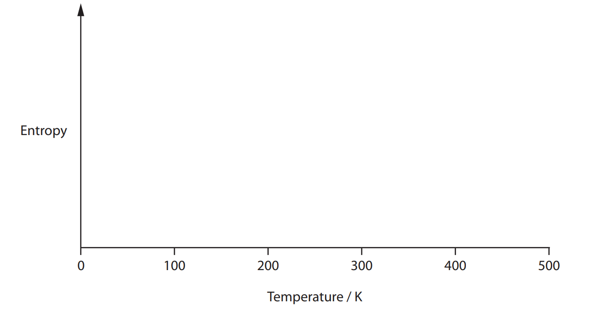

# Exam Questions — Chemical Equilibria
**4: Rates, Equilibria & Further Organic Chemistry** · Edexcel International A Level (IAL) Chemistry (YCH11)
> Source: [https://www.savemyexams.com/international-a-level/chemistry/edexcel/17/topic-questions/4-rates-equilibria-and-further-organic-chemistry/4-4-chemical-equilibria/structured-questions/](https://www.savemyexams.com/international-a-level/chemistry/edexcel/17/topic-questions/4-rates-equilibria-and-further-organic-chemistry/4-4-chemical-equilibria/structured-questions/) · 10 questions · total 78 marks

## Q1 — medium — 9 marks · structured-questions

### 19((a)) — 6 marks — command: multiple — structured — from paper Oct 2021 · WCH14/01
Ethanol may be manufactured by the hydration of ethene.

C2H4 (g) + H2O (g) ⇌ C2H5OH (g)     ∆`H to the power of ⦵`= −45.3 kJ mol−1

In a laboratory investigation of this reaction, 1.00 mol of ethene was mixed with 1.00 mol of steam at 150 °C. At equilibrium, when the total pressure of the system was 50.0 atm, 0.450 mol of ethanol had formed.

i) Give the expression for the equilibrium constant, *K*p, for the reaction.

**(1)**

ii) Calculate the equilibrium constant, *K*p, for the hydration of ethene at 150 °C.

Include units with your answer.

**(5)**

### 19((b)) — 3 marks — command: comment — structured — from paper Oct 2021 · WCH14/01
The manufacture of ethanol is carried out at 230 °C and 70 atm; the overall conversion into ethanol is 95%.

Comment on these conditions in relation to their effect on the equilibrium and the overall yield of ethanol.

## Q2 — medium — 12 marks · structured-questions

### 21((a)) — 6 marks — command: multiple — structured — from paper Jan 2022 · WCH14/01
Esters are used in flavourings and perfumes. They can be made by reactions involving alcohols.

A flask containing a mixture of 0.200 mol of ethanoic acid and 0.150 mol of ethanol was left at 25°C, in the presence of a catalyst, until equilibrium had been established.

CH3COOH(l) + C2H5OH(l) ⇌ CH3COOC2H5(l) + H2O(l)

The ethanoic acid present in the equilibrium mixture required 34.8 cm3 of a 2.50 mol dm–3 solution of sodium hydroxide for complete neutralisation.

i) Calculate the value of the equilibrium constant, *K*c, for this reaction at 25°C.

**(4)**

ii) The enthalpy change for this reaction is small. Explain, by reference to the type and number of bonds being broken and made, how this might have been predicted.

**(2)**

### 21((b)) — 6 marks — command: multiple — structured — from paper Jan 2022 · WCH14/01
An ester which smells of raspberries can be formed by either of two different reactions.

Reaction **1**

HCOOH + (CH3)2CHCH2OH → HCOOCH2CH(CH3)2 + H2O

Reaction **2 **HCOCl + (CH3)2CHCH2OH → HCOOCH2CH(CH3)2 + HCl

i) **Name** the carboxylic acid, alcohol and catalyst used in Reaction **1**.

**(2)**

HCOOH .............................................                   catalyst ......................... (CH3)2CHCH2OH ..............................

ii) Explain **one** advantage and **one** disadvantage of using Reaction 2 rather than

Reaction **1**.

**(4)**

## Q3 — medium — 10 marks · structured-questions

### 1() — 1 mark — command: write — structured
Dinitrogen tetroxide dissociates into nitrogen dioxide in a reversible gaseous equilibrium:

N2O4 (g) ⇌ 2NO2 (g)  Δ*H* = +57.2 kJ mol-1

Write the expression for the equilibrium constant, *K*p, for this reaction.

### 2() — 4 marks — command: calculate — structured
1.00 mol of N2O4 was sealed in a closed container at 298 K and allowed to reach equilibrium. At equilibrium, the total pressure was 0.60 atm and 0.40 mol of NO2 had been formed.

Calculate the value of *K*p at 298 K. Give your answer to 2 significant figures.

### 3() — 3 marks — command: calculate — structured
Use your value of *K*p from part (b) and the relationship

Δ*S*total = *R* ln *K*p

to calculate the total entropy change for the forward reaction at 298 K.

Hence state, with a reason, whether the forward reaction is feasible at 298 K.

[*R* = 8.31 J K⁻¹ mol⁻¹]

### 4() — 2 marks — command: explain — structured
Explain, in terms of entropy, why the value of *K*p for this equilibrium **increases** as the temperature is raised.

Do **not** refer to Le Chatelier's principle in your answer.

## Q4 — hard — 20 marks · structured-questions

### 18((a)) — 8 marks — command: multiple — structured — from paper Jan 2021 · WCH14/01
This question is about sulfuric acid and its salts.

The manufacture of sulfuric acid involves the equilibrium

2SO2(g) + O2(g) ⇌ 2SO3(g)   Δr*H *= −197 kJ mol−1

i) A catalyst of vanadium(V) oxide is used in this reaction.

State the effect, if any, of the catalyst on the value of the equilibrium constant, *K*p.

**(1)**

ii) The temperature used for this reaction in industry is 700 K.

Explain, in terms of the equilibrium constant and the equilibrium position, the effect of an increase in temperature on the equilibrium yield of sulfur trioxide.

**(2)**

iii) Write the expression for the equilibrium constant, *K*p, for this equilibrium.

State symbols are not required.

**(1)**

iv) A mixture of 2.00 mol of sulfur dioxide and 1.00 mol of oxygen is allowed to reach equilibrium at 5.00 atm pressure.

1.60 mol of sulfur trioxide is formed.

Calculate the value of *K*p.

Include units and give your answer to an appropriate number of significant figures.

**(4)**

### 18((b)) — 5 marks — command: multiple — structured — from paper Jan 2021 · WCH14/01
Sulfur trioxide is used to produce sulfuric acid.

i) Commercial concentrated sulfuric acid contains 98.5 % H2SO4 and 1.5 % water by mass.

The density of concentrated sulfuric acid is 1800 g dm−3.

Calculate the concentration of this sulfuric acid in mol dm−3.

**(2)**

ii) The pH of a 0.10 mol dm−3 solution of sulfuric acid at 25 °C is 0.97.

Calculate the concentration of hydrogen ions, in mol dm−3, in this solution.

**(1)**

iii) In an aqueous solution of sulfuric acid, the following equilibria exist.

$H_{2}\mathrm{SO}_{4}(\mathrm{aq})+H_{2}O(l)\rightleftharpoonsH_{3}O^{+}(\mathrm{aq})+\mathrm{HSO}_{4}^{-}(\mathrm{aq})K_{a}\mathrm{very} \mathrm{large}\,\mathrm{HSO}_{4}^{-}(\mathrm{aq})+H_{2}O(l)\rightleftharpoonsH_{3}O^{+}(\mathrm{aq})+\mathrm{SO}_{4}^{2-}(\mathrm{aq})K_{a}=0.012\mathrm{mol} \mathrm{dm}^{-3}$

Explain, in terms of these equilibria, why the concentration of hydrogen ions in a 0.10 mol dm−3 solution of sulfuric acid is **not** 0.20 mol dm−3.

No calculation is required.

**(2)**

### 18((c)) — 7 marks — command: multiple — structured — from paper Jan 2021 · WCH14/01
A buffer solution is made from HSO4– and SO42– ions.

i) Write two ionic equations involving HSO4– and SO42– ions to show how this solution acts as a buffer.

State symbols are not required.

**(2)**

ii) A buffer solution is formed by mixing 25.0 cm3 of a solution that is 0.150 mol dm-3 with respect to SO42– ions with 75.0 cm3 of a solution that is 0.100 mol dm-3 with respect to HSO4– ions.

Calculate the pH of this buffer solution.

[*K*a for HSO4– ions = 0.012 mol dm-3]

**(5)**

## Q5 — hard — 19 marks · structured-questions

### 20((a)) — 7 marks — command: explain — structured — from paper June 2021 · WCH14/01
The reversible reaction between hydrogen chloride and oxygen produces water **vapour** and chlorine.

4HCl (g) + O2 (g) ⇌ 2H2O (g) + 2Cl2 (g)   ∆*H* = –114 kJ mol–1

Explain what effect, if any, each of the following changes has on the yield of chlorine at equilibrium **and** on the equilibrium constant, *K**p**.*

i) An increase in the total pressure

**(3)**

ii) An increase in the temperature

**(2)**

iii) The use of a catalyst

**(2)**

### 20((b)) — 9 marks — command: multiple — structured — from paper June 2021 · WCH14/01
0.850 mol of hydrogen chloride was mixed with 0.600 mol of oxygen and allowed to reach equilibrium in a closed flask. At equilibrium the total pressure was 1.50 atm and there was 0.250 mol of chlorine in the flask.

4HCl(g) + O2(g) ⇌ 2H2O(g) + 2Cl2(g)

i) Complete the table.

**(3)**

| **Substance** | **Initial amount** **/ mol** | **Equilibrium amount** **/ mol** | **Mole fraction** **at equilibrium** |
|---|---|---|---|
| HCl | 0.850 |   |   |
| O2 | 0.600 |   |   |
| H2O | 0 |   |   |
| Cl2 | 0 | 0.250 | 0.189 |
| Total moles at equilibrium = |   |   |   |

ii) Write the expression for the equilibrium constant, *K*p .

**(1)**

iii) Use your answers to (b)(i) and (b)(ii) to calculate the value for *K*p. Give your answer to an appropriate number of significant figures, and include units.

**(3)**

iv) Use your answer to (b)(iii) to calculate a value for the total entropy change of the reaction, Δ*S*total .

**(2)**

### 20((c)) — 3 marks — command: draw — structured — from paper June 2021 · WCH14/01
Draw a sketch of entropy against temperature for water to illustrate the entropy changes as temperature increases, including when water changes state.

A scale is not required for the vertical axis.

## Q6 — medium — 2 marks · multiple-choice-questions

### 3((a)) — 1 mark — multiple_choice — from paper Jan 2022 · WCH14/01
The reaction shown is at equilibrium. The forward reaction is endothermic.

C (s) + CO2 (g) ⇌ 2CO (g)

Which will** increase** when the temperature is lowered?
- **A.** the mole fraction of carbon dioxide
- **B.** the partial pressure of carbon monoxide
- **C.** the rate of the backward reaction
- **D.** the value of Kp for the forward reaction

### 3((b)) — 1 mark — multiple_choice — from paper Jan 2022 · WCH14/01
b)

At 680 °C and 1 atm, 52.6% of the molecules in the gas mixture are carbon monoxide. What is the partial pressure of carbon dioxide, in atmospheres?
- **A.** 0.237
- **B.** 0.263
- **C.** 0.474
- **D.** 0.526

## Q7 — medium — 1 marks · multiple-choice-questions

### 4() — 1 mark — multiple_choice — from paper Jan 2022 · WCH14/01
The equation for the precipitation of lead(II) chloride is shown.

Pb2+ (aq) + 2Cl– (aq) ⇌ PbCl2 (s)

What are the units of the equilibrium constant, *K*c?
- **A.** dm9 mol–3
- **B.** dm6 mol–2
- **C.** mol2 dm–6
- **D.** mol3 dm–9

## Q8 — medium — 2 marks · multiple-choice-questions

### 6((a)) — 1 mark — multiple_choice — from paper Oct 2021 · WCH14/01
The water gas reaction is used in the manufacture of hydrogen.

C (s) + H2O (g) ⇌ CO (g) + H2 (g)    ∆`H to the power of ⦵`= +131.2 kJ mol−1

What is the equilibrium constant, *K*c , for this reaction?
- **A.** *K*c = [CO][H2]
- **B.** *K*c = `begin mathsize 16px style fraction numerator open square brackets C O close square brackets open square brackets H subscript 2 close square brackets over denominator open square brackets C close square brackets end fraction end style`
- **C.** *K*c = `begin mathsize 16px style fraction numerator open square brackets C O close square brackets open square brackets H subscript 2 close square brackets over denominator open square brackets H subscript 2 O close square brackets end fraction end style`
- **D.** *K*c = `fraction numerator open square brackets CO close square brackets open square brackets straight H subscript 2 close square brackets over denominator open square brackets straight H subscript 2 straight O close square brackets open square brackets straight C close square brackets end fraction`

### 6((b)) — 1 mark — multiple_choice — from paper Oct 2021 · WCH14/01
What happens to the equilibrium constants of the forward and reverse reactions when the temperature is **increased?**

|   | ** ** | ***K*****c**** of forward reaction** | ***K*****c**** of reverse reaction** |
|---|---|---|---|
| ☐ | **A** | increases | increases |
| ☐ | **B** | increases | decreases |
| ☐ | **C** | decreases | increases |
| ☐ | **D** | decreases | decreases |
- **A.** 
- **B.** 
- **C.** 
- **D.** 

## Q9 — medium — 2 marks · multiple-choice-questions

### 1() — 1 mark — multiple_choice
An acidic buffer is prepared by mixing 0.400 mol of propanoic acid (CH3CH2COOH) with 0.200 mol of sodium propanoate (CH3CH2COONa) in water.

[*K*a of propanoic acid = 1.34 × 10-5 mol dm-3]

What is the pH of this buffer?
- **A.** 4.57
- **B.** 4.87
- **C.** 5.17
- **D.** 9.43

### 2() — 1 mark — multiple_choice
0.050 mol of HCl is added to the buffer from part (a).

[*K*a of propanoic acid = 1.34 × 10⁻⁵ mol dm⁻³]

What is the new pH of the buffer?
- **A.** 4.40
- **B.** 4.57
- **C.** 4.87
- **D.** 5.35

## Q10 — hard — 1 marks · multiple-choice-questions

### 6() — 1 mark — multiple_choice — from paper Jan 2021 · WCH14/01
The total entropy change, Δ*S*total, of a reaction at 298 K is −85.0 J K−1 mol−1.

What is the value of the equilibrium constant for this reaction at 298 K?

[*R* = 8.31 J mol−1 K−1]
- **A.** 3.61 × 10−5
- **B.** 9.07 × 10−1
- **C.** 9.66 × 10−1
- **D.** 2.77 × 104
