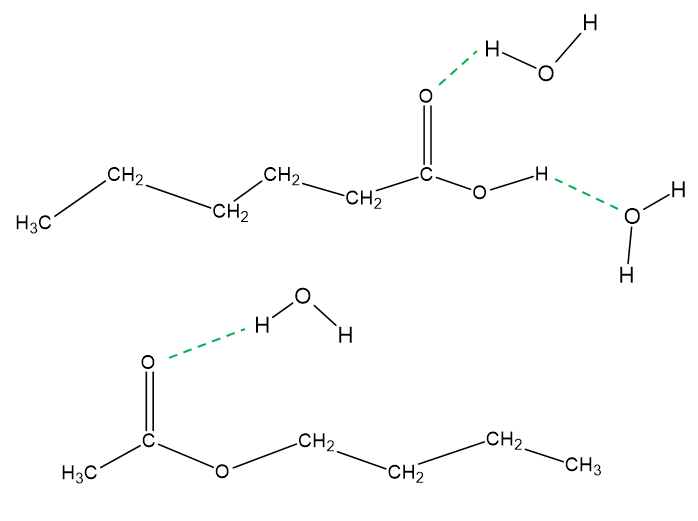
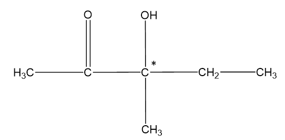
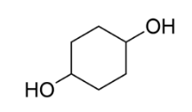

# Mark Schemes — Acid-base Equilibria
**4: Rates, Equilibria & Further Organic Chemistry** · Edexcel International A Level (IAL) Chemistry (YCH11)

## Q1 — hard — 20 marks · structured-questions

### 20((a)) — 8 marks
i) The equation for the acid dissociation constant, *K*a, of hexanoic acid is:

- *K*a = `fraction numerator left square bracket straight C subscript 5 straight H subscript 11 COO to the power of ‒ right square bracket left square bracket straight H to the power of plus right square bracket over denominator left square bracket straight C subscript 5 straight H subscript 11 COOH right square bracket end fraction`; **[1 mark]**

ii)  The pH of a 0.100 mol dm–3 solution of hexanoic acid:

- Using the expression for p*K*a; **[1 mark]**
- Using the *K*a expression; **[1 mark]**
- Rearrange and solve for H+; **[1 mark]**
- Finding the pH; **[1 mark]**

*Example Calculation*

*K*a = 10‒p*K*a / *K*a = 10‒4.88 / p*K*a = ‒log10*K*a / 4.88 = ‒log10*K*a / *K*a = 0.000013183 / 1.3183 x 10‒5

10-4.88 / 1.3183 x 10‒5 / 0.000013183 = `fraction numerator left square bracket straight H to the power of plus right square bracket squared over denominator 0.1 end fraction`

[H+] = √0.000013183 x 0.1 = 0.0011482 / 0.00115 / 1.1482 x 10‒3 / 1.15 x 10‒3 (mol dm-3)

pH = -log10[H+] = 2.94 / 2.9400

iii)  The differences in these data in terms of the hydrogen bonding between hexanoic acid and water, and between butyl ethanoate and water:

- Hexanoic acid forms more hydrogen bonds (per molecule) with water than butyl ethanoate does; **[1 mark]**
- Hexanoic acid has an -OH group which forms hydrogen bonds (with water); **[1 mark]**
- Butyl ethanoate / hexanoic acid has a C=O group which forms hydrogen bonds (with water); **[1 mark]**

**[Total: 8 marks]**

- *You must use square not round brackets in the **K**a** expression as the terms are concentrations*

  - *It needs to be clear what the functional groups are, so molecular formula would be acceptable in the** K**a** expression*
- *In part ii) the correct final answer with or without working scores full credit*

  - *If you forgot to find the square root you will get an answer of pH 5.88 and lose a mark*
  - *If you use 4.88 as **K**a** instead of p**K**a**, the answer comes to 0.1588 and you will lose one mark*
- *Hexanoic acid has two very polar groups, the O-H and the C=O*
- *Both of these can form hydrogen bonds with water*

### 20((b)) — 10 marks
i) Calculating the empirical formula of compound **A:**

- Calculating the mass of oxygen; **[1 mark]**
- Dividing the masses by the relative atomic mass; **[1 mark]**
- Dividing by the smallest to find the simplest ratio;

**AND**

The correct empirical formula, C3H6O; **[1 mark]**

*Example Calculation*

Mass of O = 10 - 6.21 - 1.03 = 2.76(g)

| Element | C | H | O |
|---|---|---|---|
| Mass | 6.21 | 1.03 | 2.76 |
| Mass/Atomic Mass | $\frac{6.21}{12}=0.5175$ | $\frac{1.03}{1.03}=1$ | $\frac{2.76}{16}=0.1725$ |
| Ratio | 3 | 6 | 1 |

ii) How you might use your answer to (b)(i) and a mass spectrum of compound **A** to prove that compound **A** is an isomer of hexanoic acid:

- The molecular ion peak / peak at highest mass will be at twice the mass of the empirical formula / will be at 116; **[1 mark]**

iii) Deducing the structure for compound **A:**

Any of the following chemical ideas expressed** [6 marks]**

- Misty fumes suggest OH group present
- Orange precipitate suggests a carbonyl group is present (so no carboxylic acid, must be alcohol)
- (Negative) Benedict’s / Fehling’s reagent suggests no aldehyde group present / a ketone is present
- Acidified potassium dichromate(VI) suggests not a primary, a secondary alcohol or an aldehyde present
- Polarimetry indicates a chiral centre is present / it is a chiral molecule
- Structure of 3-hydroxy-3-methylpentan-2-one

**[Total: 10 marks]**

- *For part iii) An answer scoring** 6** marks would include:*

  - *6 correct marking points AND answer is written in a clear and logical order and points fully explained *
- * An answer scoring** 5** marks would include:*

  - *5-4 correct marking points AND answer is written in a clear and logical order and points fully explained *
- * An answer scoring** 4** marks would include:*

  - *4-3 correct marking points AND answer has some structure and gives some explained points*
- * An answer scoring **3** marks would include:*

  - *3-2 correct marking points AND answer has some structure and gives some explained points*

### 20((c)) — 2 marks
The structure of compound **B**:

- A structure containing two –OH groups; **[1 mark]**
- The correct structure; **[1 mark]**

**[Total: 2 marks]**

- *If the C-13 NMR spectrum has only two peaks that tells you the molecule is highly symmetrical and has only two carbon environments*
- *The chemical shift of a carbon next to an OH group is in the region of 55-79 ppm (see the data booklet) which matches the structure shown*

## Q2 — hard — 20 marks · structured-questions

### 20((a)) — 8 marks
i) The equation for the dissociation of the hydrogensulfate ion in aqueous solution is:

- HSO4− ⇌ H+ + SO42− 
**OR** 
HSO4− + H2O ⇌ H3O+ + SO42−; **[1 mark]**

ii) The concentration of a solution of sodium hydrogensulfate that has pH = 1.13, in g dm−3 is:

- **Expression for *****K*****a****:**
*K*a = `begin mathsize 16px style fraction numerator open square brackets straight H to the power of plus close square brackets open square brackets SO subscript 4 superscript 2 minus end superscript close square brackets over denominator open square brackets HSO subscript 4 superscript minus close square brackets end fraction end style`
**OR**
*K*a = `fraction numerator begin mathsize 16px style stretchy left square bracket straight H to the power of plus stretchy right square bracket squared end style over denominator begin mathsize 16px style stretchy left square bracket HSO subscript 4 superscript minus stretchy right square bracket end style end fraction`; **[1 mark]**
- **Calculation of *****K*****a**** from p*****K*****a**** and [H****+****] from pH:**
*K*a = $10^{-pK_{a}}$ = 10-1.92 (= 0.012023)
**AND**
[H+] = 10-pH = 10-1.13 (= 0.074131); **[1 mark]**
- **Rearrangement of expression for *****K*****a**** and substitution of values and calculation of [NaHSO****4****] in mol dm****−3****:**
[HSO4-] = $\frac{0.074131^{2}}{0.012023}$ = 0.45709(mol dm-3); **[1 mark]**
- **Calculation of *****M*****r****(NaHSO****4****):**
*M*r(NaHSO4) = 23.0 + 1.0 + 32.1 + (4 x 16.0) = 120.1; **[1 mark]**
- **Calculation of [NaHSO****4****] in g dm****−3****:**
[NaHSO4] = 120.1 x 0.45709 
= 54.896 (g dm−3); **[1 mark]**

iii) The assumptions used in (a)(ii) are:

- Hydrogensulfate (ion) dissociation / ionisation is negligible / partial / incomplete; **[1 mark]**
- [H+] is only due to (the dissociation / ionisation of) HSO4− / hydrogensulfate (ion); **[1 mark]**

**[Total: 8 marks]**

- *In part (i):*

  - *Other accepted equations are:*
  
    - *HSO**4**−** + H**2**O ⇌ H**+** + SO**4**2−*
    - *HSO**4**−** ⇌ H**3**O**+** + SO**4**2−*
  - *The use of → instead of *$\rightleftharpoons$* is also accepted*
- *In part (ii)*

  - *You would get credit for using the** M**r** of NaHSO**4** to be 120, giving a final answer of 54.851 g dm**-3*
  - *A correct answer with some working scores 5 marks*
  - *If you found the **M**r** of HSO**4**-** for the 4th mark, you could still score the 5th mark for a value of 44.383 g dm**-3*
- *In part (iii):*

  - *The assumption that the dissociation of HSO**4**-** to SO**4**2-**is negligible, means that the concentration of HSO**4**- ** at equilibrium is practically the same as the initial concentration of HSO**4**-*
  
    - *The initial concentration of HSO**4**-** is the same as the concentration of NaHSO**4*
    - *This assumption, therefore, means we can use the value for the concentration of NaHSO**4** for [HSO**4**-**] in the expression for **K**a*
  - *The second assumption is that [H**+**] is only due to the dissociation of HSO**4**−**, i.e. the dissociation of water is negligible so that [H**+**] = [SO**4**2-**] - you would get a mark for stating these *
  
    - *This means that [H**+**] can be used as the value for [SO**4**2-**] in the expression for **K**a*
- *You can use the term [H**3**O**+**] for [H**+**]*
- *You would not be penalised for using SO**4**-** instead of SO**4**2-*
- *You would be penalised once for the omission of [ ]*
- *You would be penalised once for the use of HA or 'weak acid' or A**-*

### 20((b)) — 9 marks
i) The term buffer means:

- A buffer resists / withstands change in pH 
**OR**
Maintains a **fairly **/ **nearly **constant pH; **[1 mark]**
- On the addition of **small **amounts of acid / H+ and / or of alkali / base / OH-; **[1 mark]**

ii) The pH of the buffer prepared by dissolving 0.750 mol of sodium hydrogensulfate and 0.500 mol of sodium sulfate in distilled water to make 1.00 dm3 of solution is:

- **Substitution of values into *****K*****a**** expression:** 
*K*a = `fraction numerator open square brackets straight H to the power of plus close square brackets open square brackets SO subscript 4 superscript 2 minus end superscript close square brackets over denominator open square brackets HSO subscript 4 superscript minus close square brackets end fraction`
 10-1.92 = `fraction numerator stretchy left square bracket straight H to the power of plus stretchy right square bracket space cross times space 0.500 over denominator 0.75 end fraction`; **[1 mark]**
- **Rearrangement of *****K*****a**** expression:**
 [H+] = $\frac{K_{a}\times0.750}{0.500}$; **[1 mark]**
- **Calculation of pH to at least 1 dp:** 
pH = −log `open parentheses fraction numerator 0.012023 space cross times space 0.750 over denominator 0.500 end fraction close parentheses` (= −log 0 .018034) = 1.744; **[1 mark]**

iii)  The pH** changes** that result in each case are:

- **Calculation of pH:** pH (0.00500 mol dm−3 HCl) = −log(0.00500) = 2.30
**AND**
**Change in pH for water**: Δ(pH) = 7 − 2.30 = 4.70; **[1 mark]**
- **Calculation of new [HSO****4****−****]**: 0.750 + 0.00500 = 0.755 (mol dm−3)
**AND**
**Calculation of new [SO****4****2−****]**: 0.500 − 0.00500 = 0.495 (mol dm−3); **[1 mark]**
- **Calculation of [H****+****]**: 
[H+] = $\frac{K_{a}\times0.755}{0.495}=\frac{0.012023\times0.755}{0.495}$
= 0.018338 (mol dm-3); **[1 mark]**
- **Calculation of pH**: pH = −log(0.018338) = 1.737
**AND**
**Change in pH for buffer**: Δ(pH) = 1.744 − 1.737 = 0.007
**OR**
Δ(pH) = 1.74 − 1.737 = 0.003 if rounded value given in (b)(ii); **[1 mark]**

**[Total: 9 marks]**

- *You would not be awarded the mark for the definition of buffer if you said that a buffer maintained a constant pH*
- *When calculating the pH in part (ii), you would gain full marks for the correct answer with some working*
- *An alternative method is to use the Henderson-Hasselbach equation:*

  - *pH = p**K**a** + log*`fraction numerator open square brackets SO subscript 4 superscript 2 minus end superscript close square brackets over denominator open square brackets HSO subscript 4 superscript minus close square brackets end fraction`
  - *pH = 1.92 + log *$\frac{0.500}{0.750}$* = 1.7439*
- *In part (iii):*

  - *When HCl is added, the equilibrium of the buffer HSO**4**-** *$\rightleftharpoons$* H**+** + SO**4**2-** will shift to the left to remove the H**+** ions added from HCl*
  
    - *0.050 mol H**+** are added, and the equilibrium will shift to remove this by reacting with 0.0050 mol SO**4**2-** and producing 0.0050 moles of HSO**4**-*
    - *As the volume is 1 dm**3**, [HSO**4**-**] increases by 0.00500 to 0.750 + 0.0050 = 0.755 mol dm**-3*
    - *[SO**4**2-**] decreases to 0.500 − 0.00500 = 0.495 mol dm**−3*
    - *These values can then be used to work out the new pH*
  - *Remember**: The question asks for the pH change, so you need to compare the pH before and after the addition of HCl*
  - *The Henderson-Hasselbach equation can be used to score the final 2 marks:*
  
    - *pH = 1.92 + log*$\frac{0.495}{0.755}$*; [1 mark]*
    - *pH = 1.92 + (− 0.18334) = 1.7367 from 1.7439; [1 mark]*

### 20((c)) — 3 marks
The observations that would be made if methyl orange (p*K*In = 3.7) were used as the indicator for this titration are:

- The colour of the methyl orange indicator will change from red to orange to yellow; **[1 mark]**
- The volume of alkali added between the start of the indicator colour change and the formation of the end-point colour is large (compared with the volume used if the indicator change colour in the vertical section of the titration curve); **[1 mark]**
- The end-point (shown by the methyl orange) will occur (well) below the equivalence point; **[1 mark]**

**[Total: 3 marks]**

- *The p**K**In** value tells you that the end point of methyl orange will occur at a pH of 3.7 *
- *This is much lower than the equivalence point of pH = 8*
- *At a pH of 8, methyl orange would have changed to yellow *
- *When choosing an indicator, the colour change should coincide with the vertical section on the titration curve*

## Q3 — medium — 11 marks · structured-questions

### 1() — 3 marks
To calculate *K*a for the ammonium ion:

- Calculate [H+] from the measured pH:

[H+] = 10−pH = 10−5.13

[H+] = 7.41 × 10−6 mol dm−3

- Apply the weak-acid assumptions for NH4+ ⇌ NH3 + H+:

1 : 1 stoichiometry

[NH3] = [H+] = 7.41 × 10−6 mol dm−3

**[1 mark]**

- The initial [NH4+] remains roughly the same as there is minimal dissociation:

[NH4+] ≈ 0.100 mol dm−3

**[1 mark]**

- Substitute into the *K*a expression:

*K*a = `fraction numerator left square bracket NH subscript 3 right square bracket left square bracket straight H to the power of plus right square bracket over denominator left square bracket NH subscript 4 to the power of plus right square bracket end fraction`

*K*a = `fraction numerator open square brackets 7.41 cross times 10 to the power of negative 6 end exponent close square brackets squared over denominator 0.100 end fraction`

*K*a = **5.5 × 10****−10**** mol dm****−3**

**[1 mark]**

> **[mark-scheme]**
> 1 mark for [H+] and [NH3]= 7.41 × 10−6 mol dm−3 (or 7.4 × 10−6 to 2 sf)
> 
> 1 mark for [NH4+] ≈ 0.100 mol dm−3 (weak-acid approximation)
> 
> 1 mark for a final answer of *K*a in the range 5.4 × 10−10 to 5.6 × 10−10 mol dm−3 **AND **correct units
> 
> A correct final answer, including units, without working scores 3 marks

> **[exam-tip]**
> This is the **reverse direction** of the standard weak-acid *K*a calculation — you are given the pH and asked to find *K*a, rather than given *K*a and asked to find pH. The method is the same, just rearranged.
> 
> The key conceptual move: even though NH4Cl is a salt (not a molecular weak acid), the NH4+ ion acts as a weak acid in water, so you apply the standard weak-acid approximations:
> 
> - [H+] = [NH3] (from 1 : 1 dissociation)
> - [NH4+] at equilibrium ≈ initial concentration (minimal dissociation)
> 
> Edexcel handles basic species this way: NH4+ is the weak acid, NH3 is its conjugate base, and only *K*a is needed, never *K*b.
> 
> *K*a(NH4+) should be a very small number (around 10−9 to 10−10). A value much larger than 10−6 usually means you have forgotten to square [H+] in the numerator.

### 2() — 4 marks
To calculate the mass of NH4Cl needed for a buffer of pH 9.50:

- Calculate [H+] from the target pH:

[H+] = 10−9.50 = 3.1623 × 10−10 mol dm−3

**[1 mark]**

- Rearrange the *K*a expression for NH4+:

*K*a = `fraction numerator left square bracket NH subscript 3 right square bracket left square bracket straight H to the power of plus right square bracket over denominator left square bracket NH subscript 4 to the power of plus right square bracket end fraction`

[NH4+] = `fraction numerator left square bracket NH subscript 3 right square bracket left square bracket straight H to the power of plus right square bracket over denominator K subscript a end fraction`

- Calculate [NH4+] required:

[NH4+] = `fraction numerator open square brackets 0.100 close square brackets open square brackets 3.1623 cross times 10 to the power of negative 10 end exponent close square brackets over denominator 5.5 cross times 10 to the power of negative 10 end exponent end fraction`

[NH4+] = 0.057496 mol dm-3

**[1 mark]**

- Calculate moles of NH4Cl in 100 cm3:

moles = concentration x volume (dm3)

moles of NH4Cl in 100 cm3 = 0.057496 x 0.100

moles of NH4Cl in 100 cm3 =  0.0057496 mol

- Calculate molar mass of NH4Cl:

*M**r*(NH4Cl) = 14.0 + 4.0 + 35.5

*M**r*(NH4Cl) = 53.5

**[1 mark]**

- Calculate mass of NH4Cl:

mass = moles x *M*r

mass of NH4Cl = 5.75 × 10−3 × 53.5

mass of NH4Cl = **0.308 g (to 3 s.f.)**

**[1 mark]**

> **[mark-scheme]**
> 1 mark for correctly calculating [H+] = 3.16 × 10−10 mol dm−3 from pH = 9.50
> 
> 1 mark for the *K*a expression rearranged for [NH4+] **AND **calculating [NH4+] = 0.057496 mol
> 
> 1  mark for calculating moles NH4Cl in 100 cm3 =  0.0057496 mol **AND** *M**r*(NH4Cl) = 53.5
> 
> 1 mark for a final mass in the range 0.30 to 0.32 g depending on *K*a value used from part (a)
> 
> A final mass in the range 0.30 to 0.32 g scores 4 marks
> 
> Answers must be given to 2 or more significant figures
> 
> Allow error carried forward from an incorrect *K*a in part (a), provided the subsequent calculation is arithmetically consistent
> 
> The equivalent Henderson–Hasselbalch approach pH = p*K*a + log(n(NH3)/n(NH4+)) is accepted as long as the ratio is the correct way round

> **[exam-tip]**
> This is the **reverse direction** of the more familiar "given the buffer composition, find the pH" calculation. Rearranging the *K*a expression to solve for one of the moles is a spec point in its own right (14.20 — calculating concentrations to prepare a buffer of a given pH).
> 
> The key conceptual shift for basic buffers: **NH****4****+**** acts as the weak acid** and NH3 is its conjugate base. This is why *K*a of NH4+ is used, not *K*b of NH3. Edexcel handles all basic buffers this way, so you never need *K*b.
> 
> Common pitfalls:
> 
> - Inverting the ratio — always put the acid (NH4+) on top and the conjugate base (NH3) on the bottom in the [H+] expression
> - Forgetting to convert the final moles into mass — the question asks for mass in grams, so multiply by *M*r(NH4Cl) = 53.5
> - Sign slip when calculating [H+] from pH — use 10−pH, not 10+pH
> 
> For a pH 9.50 buffer with p*K*a ≈ 9.26, the ratio n(NH4+) : n(NH3) should be a little less than 1 (pH > p*K*a means slightly more base than acid).

### 3() — 2 marks
> **[mark-scheme]**
> The effect this dilution has on the pH of the solution is:
> 
> - The pH remains the same / unchanged 
> **OR**
> No effect **[1 mark]**
> - Because the ratio of [NH3] to [NH4+] remains unchanged (as the total volume cancels out in the *K*a expression)
> **OR**
> Both concentrations are diluted by the same factor **[1 mark]**
> 
> Answers that include equilibrium-shift explanations without referencing the acid:base ratio are not accepted

> **[exam-tip]**
> Dilution of a buffer is counter-intuitive for many students. You might expect adding water to push the pH towards 7 (as it does for a pure weak acid or pure weak base), but for a buffer the pH is almost unaffected.
> 
> The reason is structural: the *K*a expression involves the **ratio** of conjugate acid to base concentrations, not their absolute values. Dilution reduces both concentrations by the same factor, so the ratio is preserved, and the pH is therefore preserved.
> 
> A useful analogy: the buffer "carries" its pH with it. Dilution changes the buffer's capacity (how much added acid or alkali it can absorb before failing) but not its pH.
> 
> At extremely high dilutions (1000-fold or more) the approximation breaks down because the concentration of OH− from water autoionisation becomes comparable to the weak base concentration, but at 10-fold dilution the effect is negligible and the pH is unchanged to within rounding.

### 4() — 2 marks
> **[mark-scheme]**
> The diluted buffer still resists a change in pH when small amounts of acid or alkali are added because:
> 
> When acid (H+) is added:
> 
> - NH3 + H+ → NH4+
> **OR**
> The conjugate base  / NH3 reacts with H+ to form more of the conjugate acid **[1 mark]**
> 
> When alkali (OH-) is added:
> 
> - NH4+ + OH− → NH3 + H2O
> **OR**
> The conjugate acid / NH4+ reacts with OH- to form more of the conjugate base and water **[1 mark]**
> 
> The reversible arrow, ⇌, is accepted instead of →
> 
> H3O+ is accepted instead of H+
> 
> Answers talking about neutralisation are not accepted

> **[exam-tip]**
> Both directions are needed: you must give an equation for what happens when acid is added **and** when alkali is added. Writing only one loses half the marks.
> 
> The mnemonic: opposites pair up.
> 
> - Added H+ (an acid) is absorbed by NH3 (a base).
> - Added OH− (a base) is absorbed by NH4+ (an acid).
> 
> In the NH3 / NH4+ system:
> 
> - NH3 acts as the "base reservoir" that mops up added H+
> - NH4+ acts as the "acid reservoir" that mops up added OH−.
> - This is symmetrical to the acidic buffer case, with the roles of species reversed.
> 
> Avoid the word "neutralises" as a buffer resists pH change, it does not eliminate it entirely.

## Q4 — medium — 3 marks · multiple-choice-questions

### 4() — 1 marks
**Correct answer: C** — 0.1 mol dm–3 HCl

**Final answer:** **The correct answer is**** C**** because:**

- The final pH of the solution is approximately 2 so a strong acid has been added as opposed to a weak one

  - This eliminates options A and B which show a weak acid, ethanoic acid
- Looking at the options of concentration of HCl, a concentration of 0.1 mol dm–3 is the only option that would give a final approximate pH of 2

**A** and **B **are incorrect as  CH3COOH / ethanoic acid is a weak acid and the final pH would be greater than 2

**D** is incorrect as  adding HCl at this concentration would result in a final pH that is less than 1

### 4((b)) — 1 marks
**Correct answer: A** — NH3

**Final answer:** **The correct answer is ****A**** because:**

- The pH of the alkali is approximately 10 as shown on the titration curve
- This is the pH of a weak base
- Ammonia is the only weak base of the options available

**B**, **C **and **D** are incorrect as  these are strong bases and would cause the curve to begin at a higher pH

### 4((c)) — 1 marks
**Correct answer: C** — 3

**Final answer:** **The correct answer is ****C**** because:**

- The pH range of the indicator should be in the pH range where the curve is steepest, as this is where the equivalence point will lie and when the indicator will change colour
- The curve is steepest from approximately pH 3-6
- Using your data booklet, you can ascertain that the pH ranges are:

  - thymol blue  1.2 - 2.8
  - methyl orange: 3.2 - 4.4
  - bromophenol blue: 2.8 - 4.6
  - bromocresol green: 3.8 - 5.4
  - phenolphthalein: 8.2 - 10.0
- Therefore, methyl orange, bromophenol blue, and bromocresol green could all be suitable for this titration

**A**, **B**, and **D** are incorrect as  these indicators will not change colour for the pH range where the curve is the steepest

## Q5 — medium — 1 marks · multiple-choice-questions

### 5() — 1 marks
**Correct answer: D** — phenolphthalein

**Final answer:** **The correct answer is ****D ****because:**

- You can see from the curve the end point for the second proton in cis-butenedioic acid, pKa = 6.33, is in the range pH 8-10
- Phenolphthalein is the only indicator in this range

**A, B **and** C **are incorrect as  the indicator needs a range contained between pH 8 and pH 11

- The first proton would have a smaller pKa and lower pH range of change

## Q6 — medium — 1 marks · multiple-choice-questions

### 6() — 1 marks
**Correct answer: A** — 

**Final answer:** **The correct answer is ****A**** because:**

- The dissociation of water (splitting into ions) involves bond breaking so it is endothermic
- As the temperature increases further dissociation occurs
- This means there will more more ions at a higher temperature so the concentration of hydrogen ions is larger at 100o C than at 25o C

**B** is incorrect as at higher temperatures more hydrogen ions are present

**C** is incorrect as the dissociation of water is endothermic

**D **is incorrect as the dissociation of water is endothermic

## Q7 — medium — 1 marks · multiple-choice-questions

### 8() — 1 marks
**Correct answer: C** — CH2ClCOOH and CH3COO$H_{2}^{+}$

**Final answer:** **The correct answer is ****C**** because:**

- A Brønsted-Lowry acid is a proton donor
- CH2ClCOOH donates a proton to form CH2ClCOO−
- CH3COOH2+ donates a proton to form CH3COOH

**A** is incorrect as  ethanoic acid accepts a proton in this system so is a base

**B** is incorrect as ethanoic acid accepts a proton in this system so is a base

**D** is incorrect as CH2ClCOO− is a base

## Q8 — medium — 1 marks · multiple-choice-questions

### 9() — 1 marks
**Correct answer: C** — 12.3

**Final answer:** **The correct answer is ****C**** because:**

- [Ca(OH)2] = 0.010 mol dm-3
- For every 1 mole of Ca(OH)2, there are 2 moles of OH- ions
- So, [OH-] = 2 x 0.010 = 0.020
- The question gives the value of p*K*w which can be used to deduce *K*w at this temperature:

  - *K*w = 10-pKw = 10-14 = 1 x 10-14
- The expression for *K*w is:

  - *K*w = [H+][OH-]
- Substituting gives:

  - 1 x 10-14 = [H+] x 0.020
- Rearranging:

  - [H+] = 1 x 10-14 ÷ 0.020 = 5 x 10-13
- pH = - log (5 x 10-13) = 12.3

**A** is incorrect as   the concentration of hydroxide ions has been halved instead of doubled

**B** is incorrect as the concentration of hydroxide ions has been taken as 0.01 mol dm−3

**D** is incorrect as this has been calculated using 0.1 mol dm−3 as the concentration of calcium hydroxide

## Q9 — medium — 3 marks · multiple-choice-questions

### 10((a)) — 1 marks
**Correct answer: B** — region **U**

**Final answer:** **The correct answer is ****B**** because:**

- A buffer solution will keep the pH almost constant which can be seen at region **U**

**A **is incorrect as  in region **T **there is only aqueous ammonia at the start of the titration

**C** is incorrect as  in region **V**, the vertical part of the graph, represents the end-point of the titration

**D **is incorrect as region **W** all the aqueous ammonia has been neutralised

### 10((b)) — 1 marks
**Correct answer: A** — methyl red

**Final answer:** **The correct answer is ****A**** because:**

- The vertical part of the graph at region **V**, shows the end point of the titration
- The indicator used needs to have a pH range that falls within the values of this vertical range
- Methyl red has a pH range of 4.2-6.3 which correlates with the pH values at region **V**

**B **is incorrect as phenol red has a pH range of 6.8 to 8.4 and 8.4 is not in the vertical region

**C** is incorrect as  phenolphthalein has a pH range of 8.2 to 10.0 and this is not in the vertical region

**D **is incorrect as thymol blue has a pH range of 1.2 to 2.8 and this is not in the vertical region

### 10((c)) — 1 marks
**Correct answer: B** — 5.8

**Final answer:** **The correct answer is ****B ****because:**

- Comparing the options given and comparing them to the pH curve, the most appropriate answer is 5.8 as this is where the end point roughly lies

**A **is incorrect as  this is the approximate pH when excess hydrochloric acid has been added

**C** is incorrect as this is the approximate pH near the start of the end point when there is still excess aqueous ammonia

**D **is incorrect as  this is the approximate pH of aqueous ammonia

## Q10 — medium — 1 marks · multiple-choice-questions

### 1() — 1 marks
**Correct answer: C** — The two enantiomers rotate plane-polarised light by equal amounts in opposite directions, which cancel out

**Final answer:** **The correct answer is C**

- A **racemic mixture** contains equal amounts (50:50) of both enantiomers
- Each enantiomer rotates the plane of plane-polarised light by the **same magnitude** but in **opposite directions**: one clockwise (dextrorotatory, +), the other anticlockwise (laevorotatory, −)
- The equal and opposite rotations **cancel out**, giving no net rotation

**A** is incorrect as a racemic mixture is **by definition** a 50:50 (equimolar) mixture of the two enantiomers

**B** is incorrect as each molecule in a racemic mixture still contains a chiral centre, and the lack of net rotation arises from **cancellation**, not absence of chirality

**D** is incorrect as the two enantiomers rotate light in **opposite** directions, not the same direction. Rotations in the same direction would **add**, not cancel

> **[exam-tip]**
> Use the exact phrase: "the two enantiomers rotate the plane of plane-polarised light by equal amounts in opposite directions, which cancel out." Paper 4 examiner reports consistently penalise:
> 
> - Saying "bend" or "deflect" instead of "rotate"
> - Omitting "plane" when describing rotation of light
> - Claiming a racemate contains no chiral centre (a recurring misconception)

## Q11 — medium — 1 marks · multiple-choice-questions

### 1() — 1 marks
**Correct answer: A** — First electron affinity

**Final answer:** **The correct answer is A**

- **First electron affinity** is the enthalpy change when one mole of gaseous atoms each gain one electron to form one mole of gaseous 1− ions.

X (g) + e⁻ → X⁻ (g)

- The added electron is attracted to the positively charged nucleus, releasing energy
- This is **always exothermic (negative)** for Edexcel IAL

**B** is incorrect as first ionisation energy is **always endothermic**, energy must be supplied to remove an electron against the nuclear attraction

**C** is incorrect as the standard enthalpy change of atomisation is **always endothermic**, bonds (covalent, metallic, ionic, or intermolecular) must be broken to produce gaseous atoms, and bond breaking absorbs energy

**D** is incorrect as the standard enthalpy change of vaporisation is **always endothermic**, energy must be supplied to overcome intermolecular forces when converting one mole of liquid to one mole of gas at the boiling point

> **[exam-tip]**
> Sign conventions for thermodynamic processes:
> 
> - 1st electron affinity: always **exothermic** (−)
> 
>   - Attraction of the added electron to the nucleus releases energy
> - 1st ionisation energy: always **endothermic** (+)
> 
>   - Energy supplied to remove an electron
> - Atomisation: always **endothermic** (+)
> 
>   - Bonds broken to form gaseous atoms
> - Vaporisation: always **endothermic** (+)
> 
>   - IMFs broken to form gas from liquid
> 
> Memory aid: anything that **breaks** bonds or interactions is endothermic; anything that **forms** bonds or attractions (e.g. an electron joining a positive nucleus) is exothermic.

## Q12 — medium — 1 marks · multiple-choice-questions

### 1() — 1 marks
**Correct answer: B** — ethyl ethanoate

**Final answer:** **The correct answer is B**

The spectrum shows three peaks with distinct patterns:

- Triplet at δ ≈ 1.26 ppm (3H):

  - A CH3 adjacent to a CH2
- Singlet at δ ≈ 2.05 ppm (3H):

  - A CH3 with no adjacent H (consistent with the CH3CO– acetyl group)
- Quartet at δ ≈ 4.12 ppm (2H):

  - A CH2 adjacent to a CH3, with the high chemical shift indicating attachment to an O atom (–OCH2–)
- This matches ethyl ethanoate (CH3COOCH2CH3):

  - The CH3CO– gives the 2.05 singlet
  - The –OCH2– gives the 4.12 quartet
  - The –CH3 of the ethyl group gives the 1.26 triplet.

**A** is incorrect as butanoic acid (CH3CH2CH2COOH) would show **4** peaks: terminal CH3 triplet, central CH2 sextet, α-CH2 triplet, and a broad COOH singlet near δ 11 ppm

**C** is incorrect as ethyl methanoate (HCOOCH2CH3) would show a distinctive singlet near δ 8 ppm for the HCOO– proton (not at δ 2.05)

**D** is incorrect as methyl propanoate (CH3CH2COOCH3) has the methoxy CH3 singlet at δ ≈ 3.6–3.7 ppm (attached to O), not at δ 2.05. The α-CH2 quartet would appear at δ ≈ 2.3

> **[exam-tip]**
> Combine **three pieces of NMR data** to identify a compound:
> 
> - **Chemical shift** → electronic environment (Data Booklet provided)
> - **Integration** → number of H atoms in each environment
> - **Splitting pattern** → number of adjacent non-equivalent H atoms via the *n*+1 rule
> 
> The classic **ethyl group** (–CH2CH3) signature is always a **quartet (2H) + triplet (3H)** in a 2:3 integration ratio. Protons separated by a C=O, –O–, or quaternary C do **not** couple; they appear as singlets.

## Q13 — hard — 2 marks · multiple-choice-questions

### 9((a)) — 1 marks
**Correct answer: B** — 1.95

**Final answer:** **The correct answer is ****B**** because:**

- *K*a = 10-p*k*a 

  - *K*a = 10-2.9 = 1.25893 x 10-3
- [H+] =`square root of straight K subscript straight a end root cross times open square brackets w e a k space a c i d close square brackets`

  - [H+] = $\sqrt{1.25893x10^{-3}}\times0.1$= 0.0112
- pH= -log10[H+]

  - pH= -log[0.0112]= 1.95

**A **is incorrect as *pK**a* has not been converted to *K*a

**C** is incorrect as this is the pH of 0.100 mol dm−3 ethanoic acid

**D **is incorrect as the square root of *K*a x [CH2ClCOOH] has not been used to calculate [H+]

### 9((b)) — 1 marks
**Correct answer: C** — 

**Final answer:** **The correct answer is ****C**** because:**

- Chloroethanoic acid has a lower p*K*a value and therefore higher *K*a value than ethanoic acid meaning it is a stronger acid
- Chloroethanoic acid will act as an acid in the reaction and ethanoic acid will act as a the base
- A conjugate base is formed once the acid has lost a proton
- So, when CH2ClCOOH loses a proton, the conjugate base is CH2ClCOO–

**A** is incorrect as ethanoic acid has a higher p*K*a than  chloroethanoic acid so acts as a base in this reaction

**B** is incorrect as ethanoic acid has a higher p*K*a than chloroethanoic acid so acts as a base in this reaction

**D** is incorrect as chloroethanoic acid loses a proton when it acts as an acid
