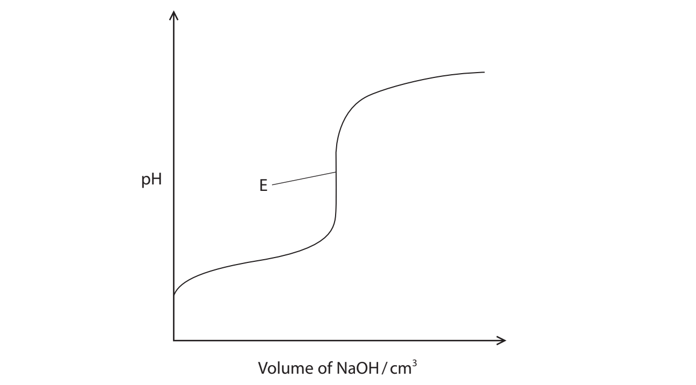
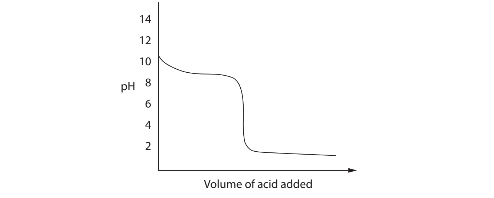
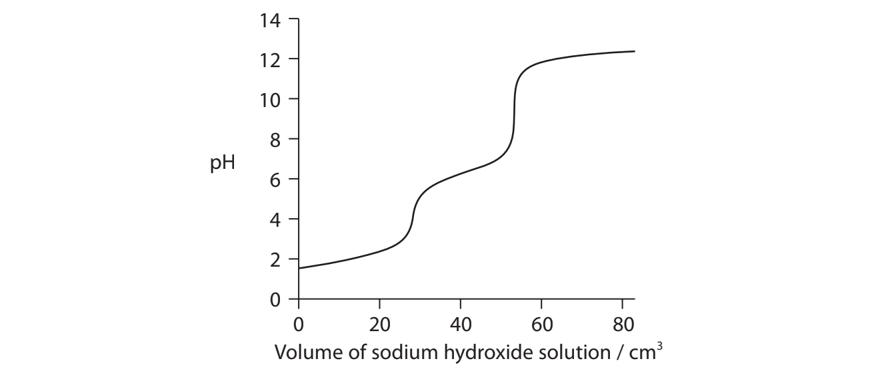
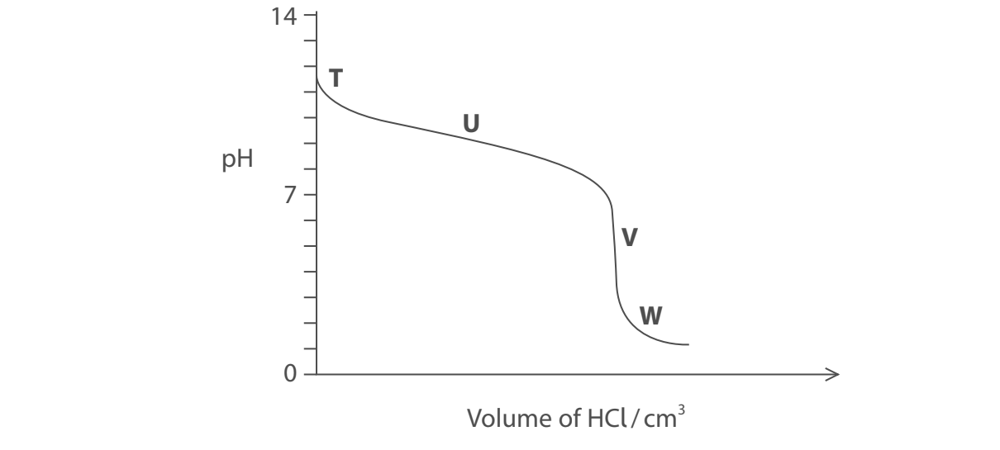

# Exam Questions — Acid-base Equilibria
**4: Rates, Equilibria & Further Organic Chemistry** · Edexcel International A Level (IAL) Chemistry (YCH11)
> Source: [https://www.savemyexams.com/international-a-level/chemistry/edexcel/17/topic-questions/4-rates-equilibria-and-further-organic-chemistry/4-5-acid-base-equilibria/structured-questions/](https://www.savemyexams.com/international-a-level/chemistry/edexcel/17/topic-questions/4-rates-equilibria-and-further-organic-chemistry/4-5-acid-base-equilibria/structured-questions/) · 13 questions · total 66 marks

## Q1 — hard — 20 marks · structured-questions

### 20((a)) — 8 marks — command: multiple — structured — from paper Jan 2022 · WCH14/01
This question is about compounds with the molecular formula C6H12O2.

Hexanoic acid, C5H11COOH, is a weak acid.

i) Write the equation for the acid dissociation constant, *K*a, of hexanoic acid.

**(1)**

ii) Calculate the pH of a 0.100 mol dm–3 solution of hexanoic acid. [p*K*a of hexanoic acid = 4.88]

**(4)**

iii) The solubility of hexanoic acid in water is 1.08 g per 100 g of water. The isomer of hexanoic acid, butyl ethanoate, CH3CO2C4H9, has a solubility of 0.68 g per 100 g of water.

Explain the differences in these data in terms of the hydrogen bonding between hexanoic acid and water, and between butyl ethanoate and water.

**(3)**

### 20((b)) — 10 marks — command: multiple — structured — from paper Jan 2022 · WCH14/01
i) Compound **A** is thought to be another isomer of hexanoic acid.

10 g of compound **A** is found to contain 6.21 g of carbon and 1.03 g of hydrogen, with the remainder being oxygen.

Use the data to calculate the empirical formula of compound **A**.

You must show **all** your working.

**(3)**

ii) State how you might use your answer to (b)(i) and a mass spectrum of compound **A** to prove that compound **A** is an isomer of hexanoic acid.

**(1)**

iii) A series of tests was performed on compound **A**.

|   | **Test** | **Observation** |
|---|---|---|
| 1 | addition of phosphorus(V) chloride | misty fumes |
| 2 | addition of 2,4-dinitrophenylhydrazine | orange precipitate |
| 3 | addition of Benedict’s or Fehling’s reagent | solution remains blue with no precipitate |
| 4 | addition of acidified potassium dichromate(VI) | solution remains orange |
| 5 | test using polarimetry | plane of plane polarised light is rotated |

Deduce the structure for compound **A**. Justify your answer by using all the test results.

**(6)**

### 20((c)) — 2 marks — command: draw — structured — from paper Jan 2022 · WCH14/01
Compound **B**, another isomer with the molecular formula C6H12O2, contains a ring of six carbon atoms.

The carbon-13 NMR spectrum has only two peaks, one of which is at 69 ppm.

Draw the structure of compound **B.**

## Q2 — hard — 20 marks · structured-questions

### 20((a)) — 8 marks — command: multiple — structured — from paper Oct 2021 · WCH14/01
Sodium hydrogensulfate is a widely used acid, with applications that include removing limescale and as a food additive. Sodium hydrogensulfate is a weak acid because of the presence of the hydrogensulfate ion, HS$O_{4}^{-}$ .

i) Write the equation for the dissociation of the hydrogensulfate ion in aqueous solution. State symbols are not required.

**(1)**

ii) A solution of sodium hydrogensulfate has pH = 1.13 Calculate the concentration of this solution, in g dm−3.
[p*K*a of HS$O_{4}^{-}$= 1.92]

** (5)**

iii) State the assumptions you have used in (a)(ii).

**(2)**

### 20((b)) — 9 marks — command: multiple — structured — from paper Oct 2021 · WCH14/01
A solution containing sodium hydrogensulfate and sodium sulfate is a buffer that is used to preserve urine for steroid analysis.

i) State what is meant by the term buffer.

**(2)**

ii) Calculate the pH of the buffer prepared by dissolving 0.750 mol of sodium hydrogensulfate and 0.500 mol of sodium sulfate in distilled water to make 1.00 dm3 of solution.

**(3)**

iii) Separate samples of 0.00500 mol of hydrochloric acid are added to 1.00 dm3 of distilled water and to the buffer in (b)(ii).

Calculate the pH** changes** that result in each case. Assume that the volumes remain constant at 1.00 dm3.

**(4)**

### 20((c)) — 3 marks — command: explain — structured — from paper Oct 2021 · WCH14/01
The titration curve obtained from the addition of sodium hydroxide solution to a weak acid is shown. The equivalence point (E) of this titration occurred at pH = 8

Explain the observations that would be made if methyl orange (p*K*In = 3.7) were used as the indicator for this titration.

## Q3 — medium — 11 marks · structured-questions

### 1() — 3 marks — command: calculate — structured
A 0.100 mol dm−3 solution of ammonium chloride, NH4Cl, has a pH of 5.13 at 298 K.

The ammonium ion acts as a weak acid in aqueous solution:

NH4+ (aq) ⇌ NH3 (aq) + H+ (aq)

Calculate the value of *K*a for the ammonium ion at 298 K.

Give your answer to 2 significant figures.

### 2() — 4 marks — command: calculate — structured
Calculate the mass of ammonium chloride, NH4Cl, that must be added to 100 cm3 of 0.100 mol dm−3 aqueous ammonia to prepare a buffer of pH 9.50.

Give your answer to an appropriate number of significant figures.

[Assume the volume change on adding NH4Cl is negligible. Use your value of *K*a(NH4⁺) from part (a), or *K*a(NH4⁺) = 5.5 × 10-10 mol dm-3.]

### 3() — 2 marks — command: explain — structured
The buffer prepared in part (b) is diluted by a factor of 10 by adding distilled water.

State the effect this dilution has on the pH of the solution. Use the *K*a expression to explain your answer.

### 4() — 2 marks — command: explain — structured
Using equations, explain how the diluted buffer still resists a change in pH when small amounts of acid or alkali are added.

## Q4 — medium — 3 marks · multiple-choice-questions

### 4() — 1 mark — multiple_choice — from paper June 2021 · WCH14/01
A graph of pH against volume of acid added for an acid-base titration is shown.

Which acidic solution was used in the titration?
- **A.** 0.1 mol dm–3 CH3COOH
- **B.** 1.0 mol dm–3 CH3COOH
- **C.** 0.1 mol dm–3 HCl
- **D.** 1.0 mol dm–3 HCl

### 4((b)) — 1 mark — multiple_choice — from paper June 2021 · WCH14/01
Which basic solution was used in the titration?
- **A.** NH3
- **B.** LiOH
- **C.** Ba(OH)2
- **D.** NaOH

### 4((c)) — 1 mark — multiple_choice — from paper June 2021 · WCH14/01
A student suggested five indicators that might be used in this titration:

thymol blue
methyl orange
bromophenol blue
bromocresol green
phenolphthalein

How many of these indicators would be suitable? Use your Data Booklet.
- **A.** 5
- **B.** 4
- **C.** 3
- **D.** 2

## Q5 — medium — 1 marks · multiple-choice-questions

### 5() — 1 mark — multiple_choice — from paper Jan 2022 · WCH14/01
An example of a diprotic acid is cis-butenedioic acid. Titration of this acid using sodium hydroxide solution gave the titration curve shown.

Which indicator would be most suitable for measuring the end-point of the neutralisation of the proton in cis-butenedioic acid which has a p*K*a = 6.33?

Use your Data Booklet.
- **A.** bromocresol green
- **B.** bromothymol blue
- **C.** litmus
- **D.** phenolphthalein

## Q6 — medium — 1 marks · multiple-choice-questions

### 6() — 1 mark — multiple_choice — from paper Jan 2022 · WCH14/01
At 25°C, the pH of pure water is 7.00 and at 100°C, the pH of pure water is 6.14. What can be deduced from this information?

**(1)**

|   | ** ** | **Enthalpy change of** **dissociation of water** | **Concentration of hydrogen ions** |
|---|---|---|---|
| ☐ | **A** | endothermic | higher at 100°C than at 25°C |
| ☐ | **B** | endothermic | lower at 100°C than at 25°C |
| ☐ | **C** | exothermic | higher at 100°C than at 25°C |
| ☐ | **D** | exothermic | lower at 100°C than at 25°C |
- **A.** 
- **B.** 
- **C.** 
- **D.** 

## Q7 — medium — 1 marks · multiple-choice-questions

### 8() — 1 mark — multiple_choice — from paper Oct 2021 · WCH14/01
When ethanoic acid and chloroethanoic acid are mixed, an equilibrium is set up.

CH3COOH + CH2ClCOOH ⇌ CH3COO$H_{2}^{+}$+ CH2ClCOO−

The Brønsted-Lowry acids in this equilibrium are
- **A.** CH3COOH and CH2ClCOOH
- **B.** CH3COOH and CH3COO$H_{2}^{+}$
- **C.** CH2ClCOOH and CH3COO$H_{2}^{+}$
- **D.** CH3COO$H_{2}^{+}$and CH2ClCOO−

## Q8 — medium — 1 marks · multiple-choice-questions

### 9() — 1 mark — multiple_choice — from paper Oct 2021 · WCH14/01
What is the pH of 0.010 mol dm−3 aqueous calcium hydroxide, Ca(OH)2 (aq)?

[p*K*w = 14]
- **A.** 11.7
- **B.** 12.0
- **C.** 12.3
- **D.** 13.3

## Q9 — medium — 3 marks · multiple-choice-questions

### 10((a)) — 1 mark — multiple_choice — from paper Jan 2021 · WCH14/01
A titration was carried out by adding 0.1 mol dm−3 hydrochloric acid to 0.1 mol dm−3 aqueous ammonia.

HCl (aq) + NH3 (aq) $\rightarrow$ NH4Cl (aq)

The titration curve is shown.

Which region of the graph represents the most effective buffer solution?
- **A.** region **T**
- **B.** region **U**
- **C.** region **V**
- **D.** region **W**

### 10((b)) — 1 mark — multiple_choice — from paper Jan 2021 · WCH14/01
Which of these is the best indicator to use in this titration?

[Refer to the Data Booklet]
- **A.** methyl red
- **B.** phenol red
- **C.** phenolphthalein
- **D.** thymol blue

### 10((c)) — 1 mark — multiple_choice — from paper Jan 2021 · WCH14/01
What is the approximate pH of an ammonium chloride solution?
- **A.** 2.0
- **B.** 5.8
- **C.** 9.7
- **D.** 11.3

## Q10 — medium — 1 marks · multiple-choice-questions

### 1() — 1 mark — multiple_choice
A racemic mixture of a chiral compound shows **no net rotation** of plane-polarised light.

Which of these is the reason?
- **A.** The mixture contains unequal amounts of each enantiomer
- **B.** The molecules in the mixture do not contain a chiral centre
- **C.** The two enantiomers rotate plane-polarised light by equal amounts in opposite directions, which cancel out
- **D.** The two enantiomers rotate plane-polarised light in the same direction, which cancels out

## Q11 — medium — 1 marks · multiple-choice-questions

### 1() — 1 mark — multiple_choice
Which of these processes is **always** exothermic?
- **A.** First electron affinity
- **B.** First ionisation energy
- **C.** Standard enthalpy change of atomisation
- **D.** Standard enthalpy change of vaporisation

## Q12 — medium — 1 marks · multiple-choice-questions

### 1() — 1 mark — multiple_choice
The high-resolution ¹H NMR spectrum of a compound with molecular formula C4H8O2 is shown.

Which compound corresponds to this spectrum?
- **A.** butanoic acid
- **B.** ethyl ethanoate
- **C.** ethyl methanoate
- **D.** methyl propanoate

## Q13 — hard — 2 marks · multiple-choice-questions

### 9((a)) — 1 mark — multiple_choice — from paper Jan 2021 · WCH14/01
This question is about weak acids.

p*K*a of ethanoic acid, CH3COOH = 4.8

p*K*a of chloroethanoic acid, CH2ClCOOH = 2.9

What is the pH of a 0.100 mol dm−3 solution of chloroethanoic acid?
- **A.** 0.27
- **B.** 1.95
- **C.** 2.90
- **D.** 3.90

### 9((b)) — 1 mark — multiple_choice — from paper Jan 2021 · WCH14/01
Which is the acid-conjugate base pair in the reaction between ethanoic acid and chloroethanoic acid?

|   | ** ** | **Acid** | **Conjugate base** |
|---|---|---|---|
| ☐ | **A** | $\mathrm{CH}_{3}\mathrm{COOH}$ | $\mathrm{CH}_{3}\mathrm{COO}^{-}$ |
| ☐ | **B** | $\mathrm{CH}_{3}\mathrm{COOH}$ | $\mathrm{CH}_{3}\mathrm{COOH}_{2}^{+}$ |
| ☐ | **C** | $\mathrm{CH}_{2}\mathrm{ClCOOH}$ | $\mathrm{CH}_{2}\mathrm{ClCOO}^{-}$ |
| ☐ | **D** | $\mathrm{CH}_{2}\mathrm{ClCOOH}$ | $\mathrm{CH}_{2}\mathrm{ClCOOH}_{2}^{+}$ |
- **A.** 
- **B.** 
- **C.** 
- **D.** 
