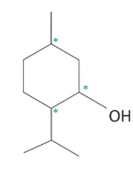
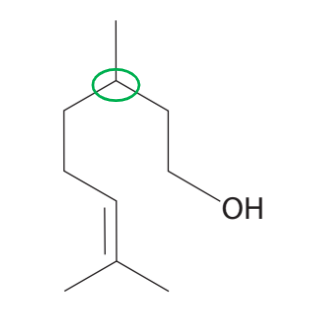
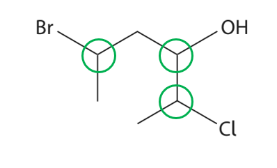
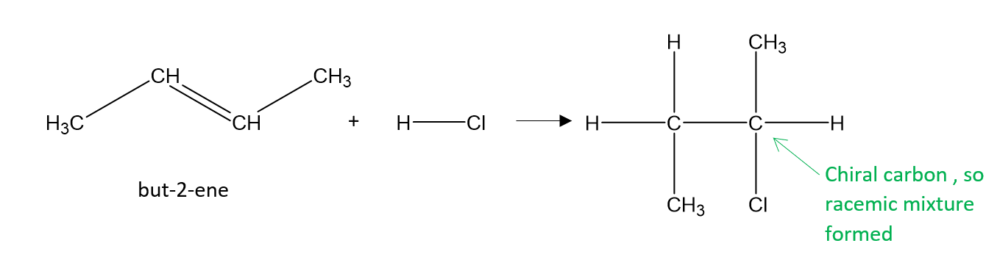
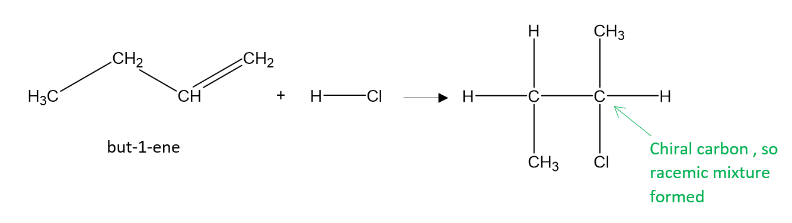
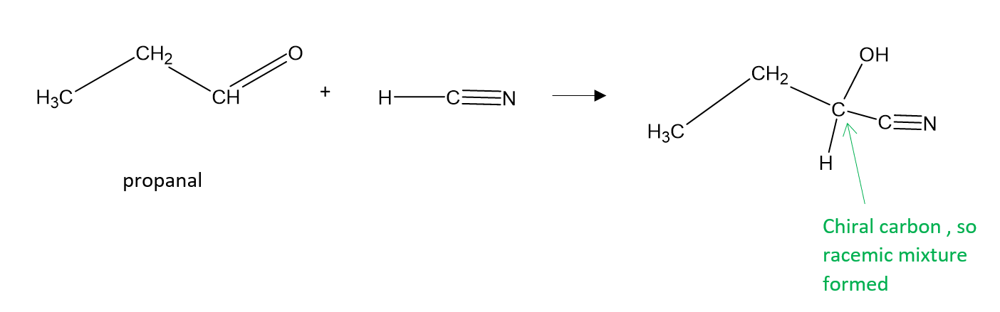
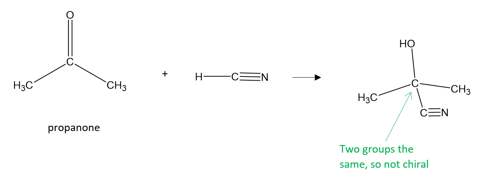
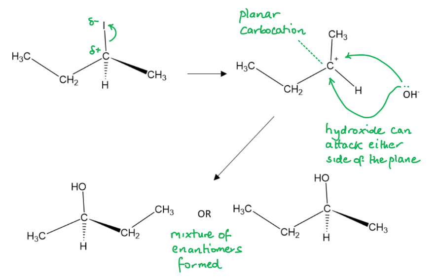

# Mark Schemes — Organic Chemistry: Chirality
**4: Rates, Equilibria & Further Organic Chemistry** · Edexcel International A Level (IAL) Chemistry (YCH11)

## Q1 — medium — 1 marks · multiple-choice-questions

### 8() — 1 marks
**Correct answer: C** — 3

**Final answer:** **The correct answer is ****C****  because:**

- There are three carbons which have four different groups attached

**A, B **and **D** are  incorrect as  there are three chiral centres

- It can be hard to determine the number of chiral centres where cyclic compounds are involved, but you need to imagine the lines of symmetry arising from the whole of the rest of the molecule not just the immediate atoms attached
- It is easy to forget that on skeletal diagrams the hydrogens are not shown, so don't forget to check for them

## Q2 — medium — 1 marks · multiple-choice-questions

### 10() — 1 marks
**Correct answer: B** — optical isomerism only

**Final answer:** **The correct answer is ****B**** because:**

- Citronellol has a carbon atom that has four different atoms / groups attached to it, i.e. it has a chiral carbon:

- A compound with a chiral carbon exists as two optical isomers, known as enantiomers, which are mirror images of each other
- Geometric isomers occur when two different atoms are attached to a carbon of the C=C double bond

  - In this case, one of the carbon atoms of the C=C double bond has two methyl groups, therefore geometric isomers of this compound cannot exist

**A** is incorrect as one of the carbon atoms of the double bond has two methyl groups

**C** is incorrect as  one of the carbon atoms of the double bond has two methyl groups and there is a chiral carbon

**D** is incorrect as  there is a chiral carbon

## Q3 — medium — 1 marks · multiple-choice-questions

### 13() — 1 marks
**Correct answer: D** — 8

**Final answer:** **The correct answer is ****D ****because:**

- An optical isomer occurs when molecules have the same molecular formula and structural formula but cannot be superimposed on one another
- The number of optical isomers is determined by raising 2 to the power of how many chiral centres there are
- A chiral centre is one where the carbon atom is attached to four different groups of atoms
- It is sometimes easier to draw out the displayed formula of the compound and circle the chiral centres
- In this case, there are three chiral centres, so the number of optical isomers is 23 or  2 x 2 x 2 = 8

**A**, **B** and **C** are incorrect as  the number of optical isomers= 2n where n is the number of chiral centres

## Q4 — medium — 1 marks · multiple-choice-questions

### 1() — 1 marks
**Correct answer: B** — rate = *k*[A][B]2

**Final answer:** **The correct answer is B**

- **Order with respect to A:** compare experiments 1 and 2

  - [A] **halves** (0.40 → 0.20),
  - [B] is unchanged, rate **halves** (1.28 × 10-2 → 6.4 × 10-3).
  
    - Rate factor (0.5) = (concentration factor)1 → **first order in A**
- **Order with respect to B:** compare experiments 2 and 3

  - [B] **halves** (0.40 → 0.20),
  - [A] is unchanged, rate falls to **one-quarter** (6.4 × 10-3 → 1.6 × 10-3).
  
    - Rate factor (0.25) = (concentration factor)2 → **second order in B**
- Rate equation: rate = *k*[A][B]2 (overall third order)

**A** is incorrect as the order with respect to B is 2, not 1 (halving [B] reduces the rate by a factor of 4, not 2)

**C** is incorrect as the orders are the wrong way round, A is first order, B is second order

**D** is incorrect as the order with respect to A is 1, not 2 (halving [A] only halves the rate, not quarters it)

> **[exam-tip]**
> The systematic method applies equally to rate **increases** and **decreases**:
> 
> 1. Find a pair of experiments where only **one** concentration changes;
> 2. Find the concentration factor (may be less than 1 for a decrease)
> 3. Find the rate factor;
> 4. If rate factor = (conc factor)n, the order is *n*.
> 
>   - Halving → unchanged = 0 order
>   - Halving → halving = 1st order
>   - Halving → quartering = 2nd order
> 
> **Orders cannot be deduced from the balanced equation**. Examiner reports consistently flag this as the most frequent kinetics error.

## Q5 — medium — 1 marks · multiple-choice-questions

### 1() — 1 marks
**Correct answer: C** — 

**Final answer:** **The correct answer is C**

- A chiral centre is a carbon atom bonded to four different atoms or groups
- In butan-2-ol (CH3CH(OH)CH2CH3), the C2 carbon is bonded:

  - H
  - OH
  - CH3
  - CH2CH3
- Since it is bonded to four different groups, it is chiral

**A** is incorrect as in 2-bromopropane (CH3CHBrCH3), the C2 carbon is bonded to H, Br, CH3, and CH3, two of the four groups are identical

**B** is incorrect as in propan-2-ol (CH3CH(OH)CH3), C2 is bonded to H, OH, and two CH3 groups, two identical

**D** is incorrect as in 2-methylpropan-2-ol ((CH3)3COH), the central carbon is bonded to three CH3 groups and one OH, three identical groups

> **[exam-tip]**
> Always compare the **full group** bonded to each carbon, not just the first atom. Two carbon chains that differ in length (e.g., CH3 vs CH2CH3) count as different groups even though both begin with C.
> 
> Paper 4 examiner reports flag identifying the wrong carbon as a recurring error, walk through each carbon in turn and check all four substituents.

## Q6 — hard — 1 marks · multiple-choice-questions

### 9() — 1 marks
**Correct answer: D** — propanone with HCN

**Final answer:** **The correct answer is ****D **** because:**

- A racemic mixture can only be formed when there is a chiral centre in the product
- When you sketch out the reaction for **D**, you can see that only one product is formed with no chiral centres
- CH3COCH3 + HCN → CH3C(OH)(CN)CH3

**A** is incorrect as  the product, 2-chlorobutane, is chiral and each enantiomer is formed in equal amounts

**B** is incorrect as  the product, 2-chlorobutane, is chiral and each enantiomer is formed in equal amounts

**D **is incorrect as  the product, 2-hydroxybutanenitrile is chiral and each enantiomer is formed in equal amounts

## Q7 — hard — 1 marks · multiple-choice-questions

### 10() — 1 marks
**Correct answer: C** — the reaction proceeds via a carbocation intermediate

**Final answer:** **The correct answer is ****C**** because:**

- 2-iodobutane contains a chiral carbon, but the question states the reaction is for one of the enantiomers
- The reaction with sodium hydroxide is nucleophilic substitution, so the iodine is replaced with a hydroxyl group
- This is a secondary halogenoalkane so it could proceed via a SN1 or SN2 mechanism
- The SN2 mechanism involves a planar carbocation which can be attacked from either side of the plane by OH- leading to a mixture of the two enantiomers, as the product is chiral
- This is consistent with the information in the question and option C

**A** is incorrect as  while it is true, it does not explain the observation

**B** is incorrect as this would lead to only one enantiomer

**D **is incorrect as while this is true, it does not explain the observation

## Q8 — hard — 1 marks · multiple-choice-questions

### 12() — 1 marks
**Correct answer: C** — tertiary only

**Final answer:** **The correct answer is ****C**** because:**

- Tertiary halogenoalkanes undergo nucleophilic substitution by an SN1 mechanism
- This involves a two step reaction:

  - In the first step, the C-Br bond will break heterolytically resulting in the formation of a bromide ion and a planar tertiary carbocation
  - This carbocation can be attacked by the nucleophile from either side of the plane resulting in the formation of a racemic mixture

**A** is incorrect as  primary bromoalkanes react by an SN2 mechanism and the product would be optically active

**B** is incorrect as secondary bromoalkanes react by an SN1 or an SN2 mechanism and the product could be optically active

**D** is incorrect as  primary and secondary bromoalkanes react by SN1 and SN2 mechanisms and the products could be optically active

## Q9 — hard — 1 marks · multiple-choice-questions

### 14() — 1 marks
**Correct answer: D** — Structure D

**Final answer:** **The correct answer is ****D**** because:**

- A, B and C have two bonds in the same plane as the paper (solid lines) one bond behind the plane pointing away from you(the dashed line), and another in front of the plane, pointing towards you (wedged line)
- D has two dashed bonds indicating that two bonds are pointing away from you and therefore is not identical to the other structures

**A** is incorrect as it is identical to B and C

**B** is incorrect as  it is identical to A and C

**C** is incorrect as it is identical to A and B
