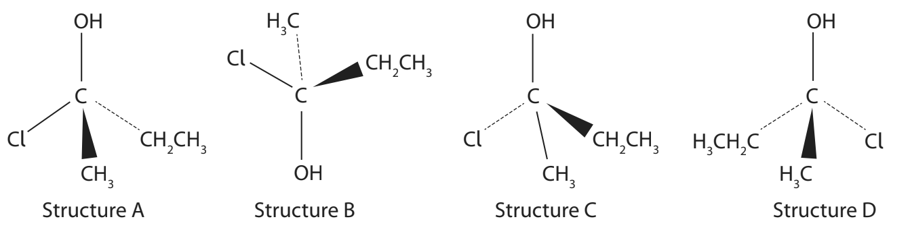

# Exam Questions — Organic Chemistry: Chirality
**4: Rates, Equilibria & Further Organic Chemistry** · Edexcel International A Level (IAL) Chemistry (YCH11)
> Source: [https://www.savemyexams.com/international-a-level/chemistry/edexcel/17/topic-questions/4-rates-equilibria-and-further-organic-chemistry/4-6-organic-chemistry-chirality/multiple-choice-questions/](https://www.savemyexams.com/international-a-level/chemistry/edexcel/17/topic-questions/4-rates-equilibria-and-further-organic-chemistry/4-6-organic-chemistry-chirality/multiple-choice-questions/) · 9 questions · total 9 marks

## Q1 — medium — 1 marks · multiple-choice-questions

### 8() — 1 mark — multiple_choice — from paper Jan 2022 · WCH14/01
Menthol has a number of medicinal uses. It can be extracted from the peppermint plant. The structure of menthol is

How many chiral centres are there in one molecule of menthol?
- **A.** 1
- **B.** 2
- **C.** 3
- **D.** 4

## Q2 — medium — 1 marks · multiple-choice-questions

### 10() — 1 mark — multiple_choice — from paper Oct 2021 · WCH14/01
Citronellol is found in rose and geranium oils.

The type(s) of stereoisomerism shown by citronellol is
- **A.** optical and geometric isomerism
- **B.** optical isomerism only
- **C.** geometric isomerism only
- **D.** neither optical nor geometric isomerism

## Q3 — medium — 1 marks · multiple-choice-questions

### 13() — 1 mark — multiple_choice — from paper June 2021 · WCH14/01
How many optical isomers does this molecule have?

- **A.** 2
- **B.** 3
- **C.** 6
- **D.** 8

## Q4 — medium — 1 marks · multiple-choice-questions

### 1() — 1 mark — multiple_choice
The rate of a reaction between two reactants, A and B, was studied using the initial-rates method.

The results are shown in the table.

| Experiment | [A] / mol dm-3 | [B] / mol dm-3 | Initial rate / mol dm-3 s-1 |
|---|---|---|---|
| 1 | 0.40 | 0.40 | 1.28 × 10-2 |
| 2 | 0.20 | 0.40 | 6.4 × 10-3 |
| 3 | 0.20 | 0.20 | 1.6 × 10-3 |

What is the rate equation for this reaction?
- **A.** rate = *k*[A][B]
- **B.** rate = *k*[A][B]2
- **C.** rate = *k*[A]2[B]
- **D.** rate = *k*[A]2[B]2

## Q5 — medium — 1 marks · multiple-choice-questions

### 1() — 1 mark — multiple_choice
Which of these molecules contains a chiral centre?
- **A.** 
- **B.** 
- **C.** 
- **D.** 

## Q6 — hard — 1 marks · multiple-choice-questions

### 9() — 1 mark — multiple_choice — from paper Jan 2022 · WCH14/01
Which of these reactions does **not **result in the formation of a racemic mixture?
- **A.** but-2-ene with HCl
- **B.** but-1-ene with HCl
- **C.** propanal with HCN
- **D.** propanone with HCN

## Q7 — hard — 1 marks · multiple-choice-questions

### 10() — 1 mark — multiple_choice — from paper Jan 2022 · WCH14/01
When a single enantiomer of 2-iodobutane reacts with sodium hydroxide, the product is a mixture of enantiomers. This is because
- **A.** the reaction is a nucleophilic substitution
- **B.** the reaction proceeds via a negatively charged transition state
- **C.** the reaction proceeds via a carbocation intermediate
- **D.** the reaction rate depends on the concentration of 2-iodobutane

## Q8 — hard — 1 marks · multiple-choice-questions

### 12() — 1 mark — multiple_choice — from paper Jan 2021 · WCH14/01
A sample of a bromoalkane, RBr, containing a single optical isomer reacts with hydroxide ions in an SN1 mechanism.

RBr + OH− $\rightarrow$ ROH + Br−

The alcohol formed is a racemic mixture.

From this information, it can be deduced that RBr is most likely to be
- **A.** primary only
- **B.** secondary only
- **C.** tertiary only
- **D.** primary, secondary or tertiary

## Q9 — hard — 1 marks · multiple-choice-questions

### 14() — 1 mark — multiple_choice — from paper June 2021 · WCH14/01
Which of these structures is **not** identical to the others?

- **A.** Structure A
- **B.** Structure B
- **C.** Structure C
- **D.** Structure D
