# Mark Schemes — Organic Chemistry: Carbonyls
**4: Rates, Equilibria & Further Organic Chemistry** · Edexcel International A Level (IAL) Chemistry (YCH11)

## Q1 — medium — 16 marks · structured-questions

### 19((a)) — 1 marks
The molecular formula of menthone is:

- C10H18O; **[1 mark]**

**[Total: 1 mark]**

- *The molecular formula is the number of atoms of each element present in a compound so all you need to do is count them *
- *Some students find it easier to draw the displayed formula so that you can clearly see the number of bonds coming from each carbon atom and don't miscount the number of hydrogen atoms*
- *You can have the elements in any order, as long as the number of each element is correct, you will score the mark*

### 19((b)) — 4 marks
The mechanism for this reaction is:

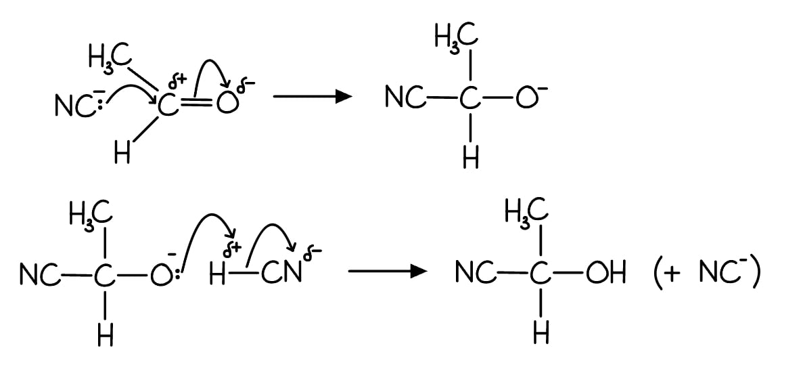

- Curly arrow from lone pair on C of CN− towards C of aldehyde group; **[1 mark]**
- Curly arrow from C=O to, or just beyond 
**AND** 
dipole on C=O; **[1 mark]**
- Intermediate; **[1 mark]**
- Curly arrow from lone pair on O− to H and curly arrow from H-CN bond to anywhere on CN and final organic product; **[1 mark]**

**[Total: 4 marks]**

- *You will be penalised for an incorrect dipole only once, similarly for a curly arrow not starting from a lone pair or using half arrowheads *
- *The CN**-** can attack from any angle, and you can also display the bond between the C-N atoms to achieve the marks *
- *If you have drawn the curly arrow from the N instead of the C for the first mark, then the CN can be joined through the N for the third mark *

### 19((c)) — 5 marks
i) The name or formula of the group in **F** identified by this test is:

- CH3CO− / −COCH3 / methyl ketone; **[1 mark]**

ii) The **skeletal** formulae of the four possible structures of carbonyl compound **F **are:

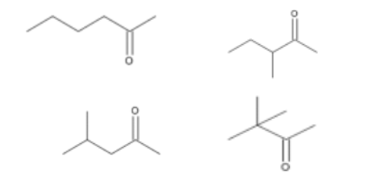

- Any 2 skeletal formulae; **[1 mark]**
- Remaining 2 skeletal formulae; **[1 mark]**

iii) The **displayed** formula of F is:

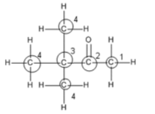

- Displayed formula of **F**; **[1 mark]**
- Carbon atoms labelled; **[1 mark]**

**[Total: 5 marks]**

- *To work out the possible skeletal formulas for compound **F**:*

  - *Draw the methyl ketone group out first*
  - *Removing the number of atoms in the methyl ketone group from the molecular formula means there are four carbon and nine hydrogen atoms left over*
  - *Start by drawing this chain, C**4**H**9** , onto the methyl ketone group then work out variations of this for the other structures*
  - *You can score 1 mark for 4 correct displayed / structural formulae*
- *For four peaks to occur on the NMR spectrum, there must be four different carbon environments as shown in the answer *
- *The other three structures would show six peaks as each carbon atom is in a different environment *

### 19((d)) — 6 marks
Explain why butanal has a higher boiling temperature than pentane but a lower boiling temperature than propanoic acid:

Chemical ideas expressed:

- **London forces**
Pentane (only) has London forces / all have London forces
- **Butanal**
Butanal (also) has (permanent) dipole-dipole interactions
- **Propanoic acid**
Propanoic acid (also) has (dipole-dipole and) hydrogen bonding
- **Intermolecular forces**
The London forces have about the same strength as they have a similar number of electrons / pentane has 42, butanal has 40 (and propanoic acid has 40 electrons)
**OR**
butanal has dipole-dipole interactions because it is polar / has a dipole on C=O
**OR**
propanoic acid has hydrogen bonding because it contains OH / COOH group
- **Butanal and pentane**
Dipole-dipole interactions are stronger than London forces
**OR**
more energy is needed to overcome the dipole-dipole interactions than London forces
- **Butanal and propanoic acid**
Hydrogen bonding is stronger than dipole-dipole interactions
**OR**
more energy is needed to overcome hydrogen bonding than dipole- dipole interactions

**[Total: 6 marks]**

- *An answer scoring** 6** marks would include*

  - *6 correct marking points AND answer is written in a clear and logical order and points fully explained *

- *An answer scoring** 5** marks would include*

  - *5-4 correct marking points AND answer is written in a clear and logical order and points fully explained *

- *An answer scoring** 4** marks would include*

  - *4-3 correct marking points AND answer has some structure and gives some explained points*

- *An answer scoring **3** marks would include*

  - *3-2 correct marking points AND answer has some structure and gives some explained points*

## Q2 — hard — 20 marks · structured-questions

### 16((a)) — 6 marks
i) A reason why the oxygen used must be dry is:

- Otherwise the mass of water from the combustion cannot be measured; **[1 mark]**

ii) The empirical formula of **X** is C4H6O3 because:

- Moles of CO2 = 4.31 ÷ 44 = 0.097955
**AND**
Moles of H2O = 1.32 ÷ 18 = 0.073333; **[1 mark]**
- Mass of C = 0.097955 x 12 = 1.1755 g
**AND**
Mass of H = 0.073333 x 2 = 0.1467 g; **[1 mark]**
- Mass of O = 2.50 - (1.1755 + 0.1467) = 1.1778 g; **[1 mark]**
- Moles of C = moles CO2 = 0.097955
**AND**
Moles of H = 2 x moles of H2O = 2 x 0.0733 = 0.147
**AND**
Moles of O = 1.1778 ÷ 16 = 0.0736; **[1 mark]**
- Ratio C : H : O = 1.33 : 2 : 1
**AND**
Empirical formula: C4H6O3; **[1 mark]**

**[Total: 6 marks]**

- *This question does not start with the mass or percentage composition of each element within the compound*
- *You need to use the information given to calculate the mass of each element within the compound before you can continue to perform the calculation to deduce the empirical formula*

  - *Use moles = mass ÷ **M**r** to find the number of moles of CO**2** and H**2**O*
  - *The number of moles of C is the same as the number of moles of CO**2**, so the mass of C can be calculated by:*
  
    - *moles x **M**r** = 0.097955 x 12 = 1.1755 g*
  - *The number of moles of H is 2 x moles of H**2**O, so the mass of H is:*
  
    - *(2 x 0.0733) x 1 = 0.147 g*
  - *The total mass of the compound is 2.50 g, so the rest of the mass must be due to oxygen *
- *Remember**: To find the ratio, divide the number of moles of each element by the smallest number*
- *Careful**: Make sure that you write the empirical formula - it is surprising the number of students that manage to complete all of the calculations but forget to give the empirical formula and lose the final mark*
- *An alternative method that is accepted but less common is to use an inductive calculation:*

  - *Balanced equation: C**4**H**6**O**3** + 4O**2** → 4CO**2** + 3H**2**O; [1 mark]*
  - *M**r** of C**4**H**6**O**3** = (4 x 12) + (6 x 1) + (3 x 16) = 102 (g mol**-1**); [1 mark]*
  - *Product masses from equation: CO**2** = 4 x 44 = 176 (g) **AND **H**2**O = 3 x 18 = 54 (g); [1 mark]*
  - *Mass of CO**2** from 2.5 g of X = 2.5 x 176 ÷ 102 = 4.31 (g); [1 mark]*
  - *Mass of H**2**O from 2.5 g of X = 2.5 x 54 ÷ 102 = 1.32 (g); [1 mark]*

### 16((b)) — 9 marks
i) The **two** possible structures of **X**, and how this information supports this answer:

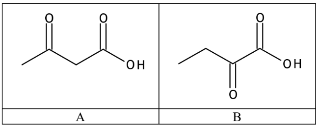

- One correct structure;** [1 mark]**
**OR**
Two correct structures; **[2 marks]**
- 13C spectrum shows four different (types of) carbon atom / X has four carbon environments /  13C spectrum shows X has four types of carbon atom (so molecular formula same as empirical formula); **[1 mark]**
- Reaction with Brady’s reagent indicates a carbonyl compound; **[1 mark]**
- No reaction with Tollens’ reagent indicates a ketone (group) / not an aldehyde; **[1 mark]**
- Reaction with NaHCO3 (forming CO2) indicates (carboxylic) **acid **/ COOH (group); **[1 mark]**

ii) A **chemical** test which would allow you to distinguish between the two compounds you have given in (b)(i) is:

- Reagents for iodoform test: iodine / I2
**AND**
Sodium hydroxide / NaOH / potassium hydroxide / KOH / alkali / OH-; **[1 mark]**
- Result for methyl ketone: (pale) yellow precipitate / solid / antiseptic smell; **[1 mark]**
- Result for ethyl ketone: No change / precipitate / reaction / (pale) yellow precipitate does not form; **[1 mark]**

**[Total: 9 marks]**

- *In part (i), you would be given credit if you gave the displayed or structural formulae or any combination of skeletal, displayed and structural*
- *When identifying the structures, you must explain how you deduced that X is a ketone or has a C=O present as you will not get the mark for just stating this*
- *When methyl ketones, i.e. contain the CH**3**CO- group, are heated with an alkaline solution of iodine, a yellow precipitate of tri-iodomethane (iodoform) is produced *

  - *Structure A is a methyl ketone so will form a yellow precipitate in this test*
  - *Structure B is an ethyl ketone so will not*
- *You must give the results of the test for both structures*

### 16((c)) — 5 marks
To explain how the number of peaks in the 1H NMR spectrum, together with their relative heights, their chemical shifts and their splitting patterns, may be used to confirm the structure of **X**:

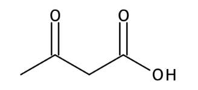

- Strucutre of X; **[1 mark]**
- (Three) peaks indicate three proton environments / number of peaks shows number of proton environments; **[1 mark]**
- Peak heights / areas indicate environments contain 3, 2 and 1 protons; **[1 mark]**
- All singlets / no splitting so no adjacent proton environments; **[1 mark]**
- Peak at δ about 11.1 is COO**H**
**AND**
Peak at δ about 1.9 is C**H**3CO
**AND**
Peak at δ about 2.5 is -OCC**H**2COOH / alkane proton / **H**-C-C; **[1 mark]**

**[Total: 5 marks]**

- *The number of peaks gives you the number of proton environments, i.e. 3 different environments*

  - *In this case, the peaks are not split*
  - *Splitting occurs due to the number of protons on the neighboring environments*
  - *This lack of splitting shows that there are no protons on adjacent carbon atoms*
- *The chemical shift gives you information about the chemical environment*
- *The peak heights provide information about the number of protons in each environment*
- *It is useful to draw the displayed formula so that you can clearly see the protons, the chemical environment each is in and how many are in that chemical environment:*

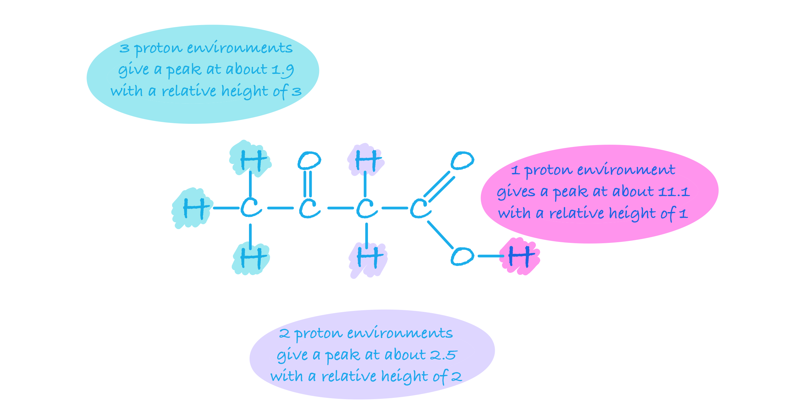

- *You could score the 2nd, 3rd and 5th mark without referring to a structure, so even if you can't work out the structure, it is still worth writing as much information that you can deduce from the spectrum*

## Q3 — hard — 10 marks · structured-questions

### 19((a)) — 8 marks
i) The completed mechanism for the reaction is:

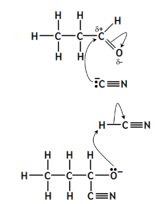

*Step 1*

- Showing the lone pair of electrons on C of C≡N;
- Curly arrow from anywhere on the C of C≡N to C in propanal including the charge;
- Curly arrow from C=O bond to or just beyond O;
- Showing the dipole on C=O;

*Step 2*

- Showing the lone pair on O in intermediate Step 1 or Step 2;
- Curly arrow from the O (or minus charge) of intermediate to H of H-C≡N;
- curly arrow from H-C bond to C of H-C≡N;

**All 7 points scores 4 marks**
**5 or 6 points scores 3 marks**
**3 or 4 points scores 2 marks**
**2 points scores 1 mark**

ii)  Why the reaction between propanal and HCN in the absence of KCN is very slow:

- The value of *K*a / dissociation is (very) small/ the equilibrium lies (very) well to the left; **[1 mark]**
- So the concentration of CN− ions is (very) low / there is a lack of CN− ions; **[1 mark]**

iii) Justifying why KCN is a **homogeneous catalyst** in this reaction:

- KCN increases the rate of reaction by providing CN− ions in the <u>same phase / state</u>**; [1 mark]**
- KCN / CN− ion is <u>regenerated</u> in Step 2, so overall is <u>not used up</u> in the reaction**; [1 mark]**

**[Total: 8 marks]**

- *In part i) If you get the formula of products wrong you will still receive credit for the mechanism*

  - *You don't need to show the dipoles on HCN, however you will lose marks if you show dipoles on C-O in the intermediate instead of a full negative charge*
- *You can also say in part ii) that HCN is a (very) weak acid or has partial dissociation or that all / most CN**−** in the reaction comes from KCN*

### 19((b)) — 2 marks
The three-dimensional structures of these enantiomers:

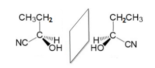

**OR**

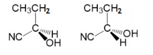

- A three-dimensional diagram of 2-hydroxybutanenitrile showing at least one dotted bond;

**AND**

At least one wedged bond which are next to each other; **[1 mark]**

- The mirror image of the first structure; **[1 mark]**

**[Total: 2 marks]**

- *Diagrams may show a mirror / plane of symmetry though this is not necessary*
- *Diagrams that swap two of the four substituents are acceptable*
- *You must have wedge and hatched bonds to get both marks in this question*

## Q4 — hard — 18 marks · structured-questions

### 19((a)) — 11 marks
i) The mechanism for Step **1 **is:

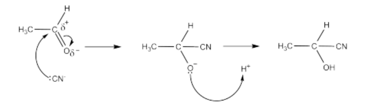

- Arrow from lone pair on carbon of cyanide ion to carbonyl carbon;** [1 mark]**
- Dipoles on carbon and oxygen in carbonyl bond and arrow from carbonyl bond to oxygen or just beyond; ** [1 mark]**
- Structure of intermediate, including charge; ** [1 mark]**
- Arrow from lone pair of oxygen in intermediate to hydrogen ion / H in HCN; ** [1 mark]**

ii) A student predicted that the product of Step **1** would rotate the plane of plane-polarised light. Comment on this prediction:

- Ethanal is planar around the carbonyl carbon atom / planar around the CHO; **[1 mark]**
- (so in Step 1) the (carbonyl) carbon can be attacked from above or below; **[1 mark]**
- Hence both stereoisomers (of intermediate / product) will form in equal amounts 
**OR** 
So product mixture is racemic / rotates the plane of plane- polarised light equally in both directions; **[1 mark]**

iii) The completed table is:

| Conversion of CH3CH(OH)CN to lactic acid |   |
|---|---|
| Reaction type | hydrolysis; **[1 mark]** |
| Reagent | (dilute) hydrochloric acid / HCl (aq); **[1 mark]** |
| Conditions | heat (under reflux) / reflux; **[1 mark]** |
| Equation | CH3CH(OH)CN + 2H2O + H+ → CH3CH(OH)COOH + NH4+ ** AND**  CH3CH(OH)COO– + H+  → CH3CH(OH)COOH; **[1 mark]** |

**[Total: 11 marks]**

- *You are required to know the mechanisms and conditions for many different reactions in organic chemistry and will be asked to recall this information at a very detailed level, shown by this question so make sure you learn them *
- *If you miss out the lone pair of electrons on the CN you will only be penalised once*
- *Other accepted equations for the first part of the mark in iii) are: *

  - * CH**3**CH(OH)CN + 2H**2**O → CH**3**CH(OH)COOH + NH**3*
  - *CH**3**CH(OH)CN + 2H**2**O + HCl → CH**3**CH(OH)COOH + NH**4**Cl*
  - *CH**3**CH(OH)CN + H**2**O + OH**–** → CH**3**CH(OH)COO**–** + NH**3** (If you have written NaOH as opposed to OH**-** this is also accepted)*

### 19((b)) — 1 marks
The equation for the reaction between sodium hydrogencarbonate and lactic acid is:

- CH3CH(OH)COOH + NaHCO3 → CH3CH(OH)COO–Na+ + H2O + CO2 
**OR** 
H+ + HCO3– → H2O + CO2; **[1 mark]**

**[Total: 1 mark]**

- *The products for the reaction are the same as that of any acid reacting with a metal carbonate*

  - *A salt, water and carbon dioxide *
  - *CH**3**CH(OH)COONa and H**2**CO**3** are accepted as products *

### 19((c)) — 6 marks
i) The buffer keeps the pH of blood nearly constant when a small increase in the concentration of hydrogen ions occurs by:

- (Large concentration of) HCO3 – react with (extra) H+ ions; **[1 mark]**
- Equilibrium 1 moves to the RHS to keep concentration of H+ ions constant / H2CO3 forms to keep concentration of H+ ions constant; **[1 mark]**
- Equilibrium 2 moves to RHS to form CO2 (which can be excreted from the body) / H2CO3 then forms CO2 (and water); **[1 mark]**

ii) The ratio of the concentration of HCO3- to H2CO3 in the blood sample is:

- Calculation of [H+] / [H3O+] [H+] = 10–7.41 / = 3.8905 x 10–8; **[1 mark]**
- *K*a expression *K*a= `fraction numerator open square brackets HCO subscript 3 close square brackets open square brackets straight H to the power of plus close square brackets over denominator open square brackets straight H subscript 2 CO subscript 3 close square brackets end fraction`; **[1 mark]**
- Rearrangement of *K*a expression and calculation of [HCO3–] : [H2CO3] = 4.5 x 10–7 ÷ 3.8905 x 10–8 = 11.567 : 1 = 11.6 (: 1); **[1 mark]**

**[Total: 3 marks]**

- *To calculate the concentration of hydrogen ions use: [H**+**] = 10**-pH*
- *Rearranging the **K**a** expression gives: *`fraction numerator K subscript straight a over denominator open square brackets straight H to the power of plus close square brackets end fraction equals space fraction numerator open square brackets HCO subscript 3 to the power of minus close square brackets over denominator open square brackets straight H subscript 2 CO subscript 3 close square brackets end fraction`* so   *`fraction numerator space 4.5 space straight x space 10 to the power of negative 7 end exponent space over denominator space 3.8905 space straight x space 10 to the power of negative 8 end exponent space end fraction equals space fraction numerator stretchy left square bracket HCO subscript 3 to the power of minus stretchy right square bracket over denominator stretchy left square bracket straight H subscript 2 CO subscript 3 stretchy right square bracket end fraction
`
- *Therefore 11.567 = *`begin mathsize 14px style fraction numerator stretchy left square bracket H C O subscript 3 to the power of minus sign stretchy right square bracket over denominator stretchy open square brackets H subscript 2 C O subscript 3 stretchy close square brackets end fraction end style`* or 11.567: 1 *
- *An alternative method is:*

  - *Calculation of p**K**a** = – log 4.5 x 10**–7** = 6.3468*
  - *Henderson Hasselbalch expression: pH = p**K**a** + log*`open parentheses fraction numerator open square brackets HCO subscript 3 to the power of minus close square brackets over denominator open square brackets straight H subscript 2 CO subscript 3 close square brackets end fraction close parentheses`
  - *Rearrangement of **K**a** expression and calculation of [HCO**3**–**] : [H**2**CO**3**]: * *7.41 - 6.3468 = log([HCO**3**–**] ÷ [H**2**CO**3**])*
- *A correct answer will score 3 marks with no working*

## Q5 — medium — 3 marks · multiple-choice-questions

### 8((a)) — 1 marks
**Correct answer: C** — 3

**Final answer:** **The correct answer is ****C**** because:**

- A chiral centre invovles a carbon atom being attached to four different atoms / groups of atoms
- It is helpful to draw out the displayed formula for the structure so that the groups can be seen more clearly:

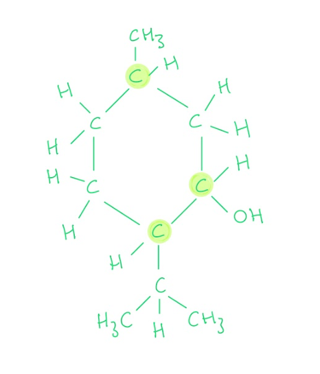

- There are three carbon atoms that are attached to four different groups as shown above

**A**, **B** and **D** are incorrect as  there are 3 chiral carbon atoms

### 8((b)) — 1 marks
**Correct answer: B** — Q

**Final answer:** **The correct answer is ****B ****because:**

- On a 13C NMR spectrum, non-equivalent carbon atoms appear as peaks with different chemical shifts
- Using the data booklet, you can look up which carbon environment will cause a peak at 72 ppm

  - It will tell you C-OH, C-Cl, and C-Br are possible environments that will cause a peak at this value
  - When you compare these carbon environments to the structure in part (a) you can see that the carbon atom in environment **Q** has a carbon atom bonded to an OH group

**A**, **C** and **D** are incorrect as these carbons would produce a peak between 0 and 60 ppm

### 8((c)) — 1 marks
**Correct answer: B** — Two

**Final answer:** **The correct answer is ****B**** because:**

- Menthol is a secondary alcohol, which will be oxidised by sodium dichromate(VI) to form a ketone
- 2,4-dinitrophenylhydrazine** **is used to test for the presence of a C=O bond

  - A ketone will react with this to give a deep-orange precipitate
- Fehling's solution acts as an oxidising agent

  - Ketones do not undergo further oxidation so there will be no reaction
- PCl5 is a standard test to test for the presence of an -OH group in an alcohol

  - Ketones will therefore not react

**A **is incorrect as  the oxidation product is a ketone, so would not react with PCl5

**C **is incorrect as  the oxidation product is a ketone, so would not react with Fehling’s solution

**D** is incorrect as  the oxidation product is a ketone, so would not react with PCl5 but would react with 2,4- dinitrophenylhydrazine

## Q6 — medium — 1 marks · multiple-choice-questions

### 11() — 1 marks
**Correct answer: C** — 4

**Final answer:** **The correct answer is ****C**** because:**

- To react with Tollens' reagent there must be an aldehyde group present, -CHO
- The four structural isomers with formula C5H10O, containing -CHO are:

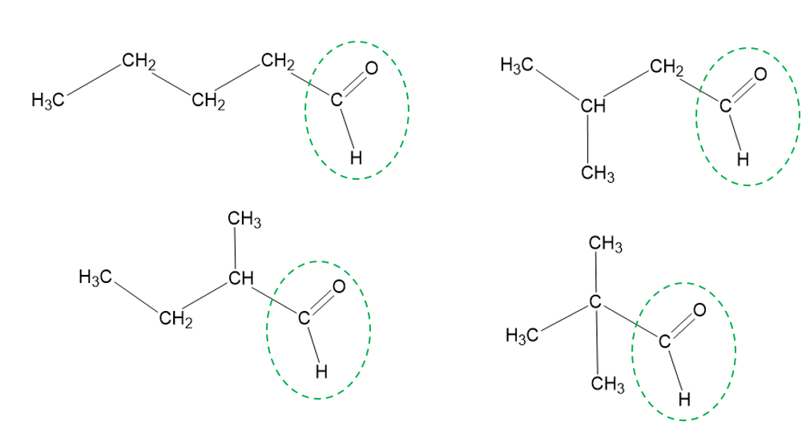

**A, B** and** D** are incorrect as there are 4 aldehydes with this molecular formula that are structural isomers

## Q7 — medium — 1 marks · multiple-choice-questions

### 11() — 1 marks
**Correct answer: D** — 

**Final answer:** **The correct answer is ****D**** because:**

- To explain the higher boiling temperature of ethanal:

  - Ethanal has a permanent dipole in its structure
  - The carbonyl group has a dipole with a δ+ carbon and a δ– oxygen
  - Therefore ethanal has permanent dipole-dipole interactions and London forces between molecules
  - There are no polar bonds in ethanal that result in a δ+ hydrogen for hydrogen bonding, so pure ethanal does not form hydrogen bonds
  - Propane has no diploes, therefore, will just have London forces between molecules
  - The boiling point of ethanal is higher than propane as permanent dipole forces are stronger than London forces
- To explain the solubility of ethanal and propane:

  - Ethanal can form hydrogen bonds with water as the δ– oxygen atom from the carbonyl group uses its lone pairs to form hydrogen bonds with the δ+ hydrogen from water, making it soluble in water
  - Propane is almost insoluble in water as it is a non-polar molecule

**A** is incorrect as pure ethanal does not form hydrogen bonds

**B** is incorrect as permanent dipole forces are less important than hydrogen bonding in the solubility of ethanal in water

**C** is incorrect as  pure ethanal does not form hydrogen bonds and permanent dipole forces are less important than hydrogen bonding in the solubility of ethanal in water

## Q8 — medium — 2 marks · multiple-choice-questions

### 12((a)) — 1 marks
**Correct answer: D** — 

**Final answer:** **The correct answer is ****D**** because:**

- Under acidic conditions propanone produces iodopropanone, CH3COCH2I

CH3COCH3 + I2  → CH3COCH2I + H+ + I-

- Under alkaline condition propanone produces triiodomethane(iodoform)

CH3COCH3 + 3I2  + 4OH- → CH3COO- + CHI3 + 3I- + 3H2O

**A** is incorrect as CH3I is not formed in acidic conditions

**B** is incorrect as  CH3COCI3 is not formed in acidic conditions

**C **is incorrect as CH3I is not formed in alkaline conditions

### 12((b)) — 1 marks
**Correct answer: C** — 2.5

**Final answer:** **The correct answer is ****C**** because:**

- The rate equation shows that the rate is first order with respect to hydrogen ions
- In the first reaction the pH = 2, and since [H+] = 10-pH then [H+] = 10-2 = 0.01 mol dm-3
- If the second rate is 1/3 of the original value that means that [H+] has to be 1/3 of the original value or 0.0033 mol dm-3
- Therefore pH = -log(0.0033) = 2.477 which rounds to 2.5

**A** is incorrect as the value of the pH has been divided by 3

**B** is incorrect as the concentration of H+ ions has been multiplied by 3 rather than divided

**D **is incorrect as this value is adding 1/3 of 2 onto 2

## Q9 — medium — 1 marks · multiple-choice-questions

### 12() — 1 marks
**Correct answer: A** — 2,4-dinitrophenylhydrazine

**Final answer:** **The correct answer is ****A**** because:**

- 2,4-dinitrophenylhydrazine (2,4-DNPH) detects the presence of carbonyl compounds
- The carbonyl group of aldehydes and ketones undergoes a condensation reaction with 2,4-DNPH
- The product formed is a deep-orange precipitate that can be purified by recrystallisation
- The melting point of the formed precipitate can then be measured and compared to literature values to find out which specific aldehyde or ketone had reacted with 2,4-DNPH

**B** is incorrect as  the precipitate is copper(I) oxide for all aldehydes

**C** is incorrect as  no precipitate is formed

**D** is incorrect as the precipitate is silver for all aldehydes

## Q10 — medium — 1 marks · multiple-choice-questions

### 13() — 1 marks
**Correct answer: D** — 

**Final answer:** **The correct answer is ****D**** because:**

- Aldehydes and ketones will give an orange precipitate with 2,4-dinitrophenylhydrazine as this is used to test for the presence of the C=O bond
- Only aldehydes will give a silver mirror with Tollens' reagent
- **D** is the ketone, 3-methyl-2-butanone so cannot be **X **

**A,** **B** and **C** are incorrect as they are aldehydes and will give a silver mirror with Tollens’ reagent

## Q11 — medium — 1 marks · multiple-choice-questions

### 1() — 1 marks
**Correct answer: A** — propan-1-ol

**Final answer:** **The correct answer is A**

- LiAlH4 is a powerful reducing agent that reduces the carboxyl group (–COOH) to a primary alcohol (–CH2OH)
- Because the –COOH group is always at the end of the carbon chain, reduction always gives a primary alcohol
- CH3CH2COOH → CH3CH2CH2OH (propan-1-ol)

**B** is incorrect as propan-2-ol is a **secondary** alcohol, which would only form by reduction of propanone (a ketone), not of propanoic acid

**C** is incorrect as propanal (an aldehyde) is an intermediate, but **excess** LiAlH4 reduces all the way through to the alcohol. Aldehydes cannot be isolated under these conditions

**D** is incorrect as propanone (a ketone) is not a possible reduction product of propanoic acid, as it would require a branched secondary alcohol precursor

> **[exam-tip]**
> Key reducing agent rules: **LiAlH~4~ (in dry ether)** is powerful enough to reduce carboxylic acids to primary alcohols (and aldehydes/ketones to alcohols); **NaBH~4~ (in water)** is milder. It reduces aldehydes/ketones but is **too weak** to reduce carboxylic acids. A Paper 4 examiner-report flag: saying “NaBH4” for the reduction of a carboxylic acid loses the reagent mark.
