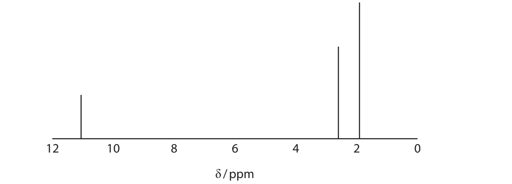
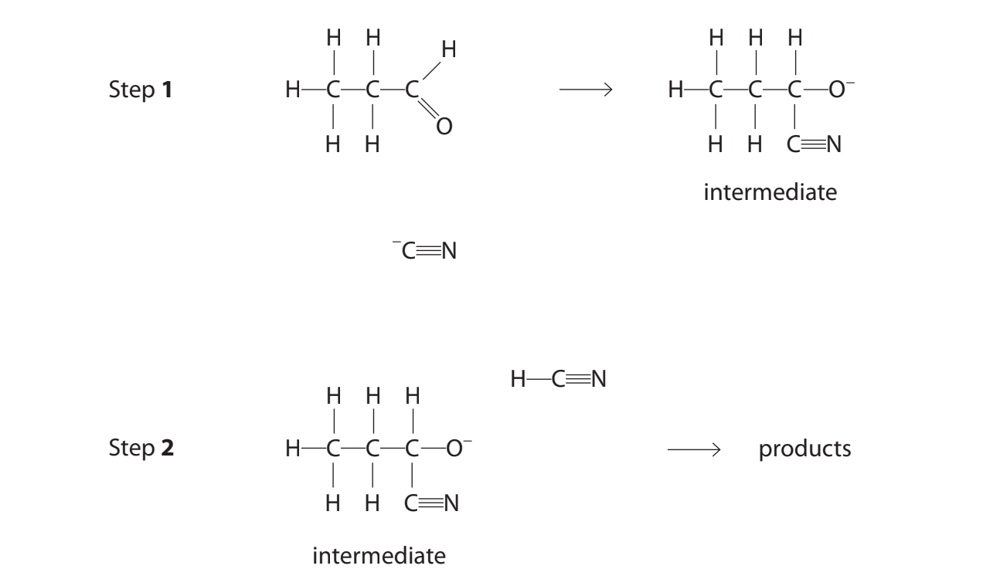
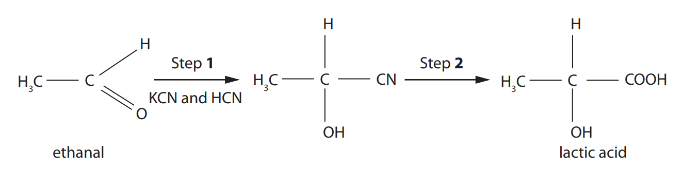
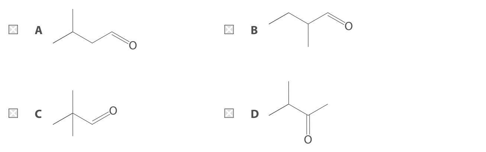

# Exam Questions — Organic Chemistry: Carbonyls
**4: Rates, Equilibria & Further Organic Chemistry** · Edexcel International A Level (IAL) Chemistry (YCH11)
> Source: [https://www.savemyexams.com/international-a-level/chemistry/edexcel/17/topic-questions/4-rates-equilibria-and-further-organic-chemistry/4-7-organic-chemistry-carbonyls/structured-questions/](https://www.savemyexams.com/international-a-level/chemistry/edexcel/17/topic-questions/4-rates-equilibria-and-further-organic-chemistry/4-7-organic-chemistry-carbonyls/structured-questions/) · 11 questions · total 74 marks

## Q1 — medium — 16 marks · structured-questions

### 19((a)) — 1 mark — command: give — structured — from paper Jan 2021 · WCH14/01
This question is about carbonyl compounds.

The skeletal formula of menthone is shown.

Give the molecular formula of menthone.

### 19((b)) — 4 marks — command: draw — structured — from paper Jan 2021 · WCH14/01
Ethanal, CH3CHO, reacts with hydrogen cyanide in the presence of cyanide ions to form 2-hydroxypropanenitrile.

Draw the mechanism for this reaction. Include curly arrows, and any relevant lone pairs and dipoles.

### 19((c)) — 5 marks — command: multiple — structured — from paper Jan 2021 · WCH14/01
A carbonyl compound, **F**, has the molecular formula C6H12O.

i) **F** reacts with iodine in an alkaline solution to give a pale yellow precipitate.

Give the name or formula of the group in **F** identified by this test.

**(1)**

ii) Draw the **skeletal** formulae of the four possible structures of carbonyl compound **F**.

**(2)**

|   |   |
|---|---|
|   |   |

iii) The carbon-13 (13C) NMR spectrum of **F** has four peaks.

Identify **F** by drawing its **displayed** formula.

Justify your answer by labelling the carbon atoms or groups of carbon atoms responsible for the four peaks in the spectrum.

**(2)**

### 19((d)) — 6 marks — command: explain — structured — from paper Jan 2021 · WCH14/01
Explain, in terms of all the intermolecular forces involved, why butanal has a higher boiling temperature than pentane but a lower boiling temperature than propanoic acid.

| **Substance** | **Boiling temperature / °C** |
|---|---|
| butanal | 76 |
| pentane | 36 |
| propanoic acid | 141 |

## Q2 — hard — 20 marks · structured-questions

### 16((a)) — 6 marks — command: multiple — structured — from paper Oct 2021 · WCH14/01
Compound **X** is used by mammals as an alternative energy source to sugars. **X** is a compound of carbon, hydrogen and oxygen only.

Complete combustion of a 2.50 g sample of **X** in dry oxygen produced 4.31 g of carbon dioxide and 1.32 g of water as the only products.

i) Give a reason why the oxygen used must be dry.

**(1)**

ii) Show that the empirical formula of **X** is C4H6O3 . You **must **show your working.

**(5)**

### 16((b)) — 9 marks — command: multiple — structured — from paper Oct 2021 · WCH14/01
Compound **X** gave an orange precipitate with Brady’s reagent (2,4-dinitrophenylhydrazine) but no reaction with Tollens’ reagent. 
When **X** was added to a solution of sodium hydrogencarbonate, effervescence occurred and the gas evolved turned limewater cloudy.

The carbon-13 NMR spectrum of **X** had only four peaks.

i) Deduce the **two** possible structures of **X**, showing how this information supports your answer.

**(6)**

ii) Give a **chemical** test which would allow you to distinguish between the two compounds you have given in (b)(i). Include the reagents required and the result for each of the compounds.

**(3)**

### 16((c)) — 5 marks — command: explain — structured — from paper Oct 2021 · WCH14/01
A simplified **high **resolution proton (1H) NMR spectrum of compound X is shown.

Explain how the number of peaks in the 1H NMR spectrum, together with their relative heights, their chemical shifts and their splitting patterns, may be used to confirm the structure of **X**. Use the chemical shifts given in your Data Booklet.

## Q3 — hard — 10 marks · structured-questions

### 19((a)) — 8 marks — command: multiple — structured — from paper Jan 2022 · WCH14/01
Propanal reacts very slowly with HCN at 298 K. To increase the rate of reaction potassium cyanide, KCN, is added.

i) Complete the mechanism for this reaction by adding curly arrows, and relevant lone pairs and dipoles to Step **1** and Step **2**.

**(4)**

ii) Explain why the reaction between propanal and HCN in the absence of KCN is very slow, referring to the value of *K*a. No calculation is required.

[For HCN,* K*a = 4.9×10–10 mol dm–3]

**(2)**

iii) KCN is a **homogeneous catalyst** in this reaction. Justify this description by referring to the mechanism.

**(2)**

### 19((b)) — 2 marks — command: draw — structured — from paper Jan 2022 · WCH14/01
The organic products of this reaction are enantiomers.

Draw the three-dimensional structures of these enantiomers.

## Q4 — hard — 18 marks · structured-questions

### 19((a)) — 11 marks — command: multiple — structured — from paper June 2021 · WCH14/01
The compound lactic acid can be synthesised from ethanal in two steps.

i) Give the mechanism for Step **1**. Include curly arrows, and any relevant lone pairs and dipoles.

**(4)**

ii) A student predicted that the product of Step **1** would rotate the plane of plane-polarised light. Comment on this prediction.

**(3)**

iii) Complete the table that summarises information about Step **2**. 
State symbols are not required for the equation.

**(4)**

| **Conversion of CH****3****CH(OH)CN to lactic acid** |   |
|---|---|
| Reaction type |   |
| Reagent |   |
| Conditions |   |
| Equation |   |

### 19((b)) — 1 mark — command: write — structured — from paper June 2021 · WCH14/01
Sodium hydrogencarbonate, NaHCO3 , has been used by some athletes to help prevent lactic acid causing muscle pain during exercise.

Write an equation for the reaction between sodium hydrogencarbonate and lactic acid.

### 19((c)) — 6 marks — command: multiple — structured — from paper June 2021 · WCH14/01
Sodium hydrogencarbonate is part of a buffer in the body that controls the pH of blood. Two of the equilibria involved in this process are shown.

Equilibrium 1       HCO3- + H3O+ ⇌ H2CO3 + H2O

Equilibrium 2       H2CO3 ⇌ CO2 + H2O

i) Use the equilibria to explain how the buffer keeps the pH of blood nearly constant when a small increase in the concentration of hydrogen ions occurs.

**(3)**

ii) The pH of a blood sample was found to be 7.41.  Calculate the ratio of the concentration of HCO3- to H2CO3 in the blood sample.

H2CO3 + H2O  ⇌  HCO3- + H3O+

*K*a = 4.50 x 10–7 mol dm–3

**(3)**

## Q5 — medium — 3 marks · multiple-choice-questions

### 8((a)) — 1 mark — multiple_choice — from paper June 2021 · WCH14/01
The compound menthol has the structure shown. Some of the carbon atoms are labelled P, Q, R and S.

What is the number of chiral centres in a molecule of menthol?
- **A.** 1
- **B.** 2
- **C.** 3
- **D.** 4

### 8((b)) — 1 mark — multiple_choice — from paper June 2021 · WCH14/01
Which of the carbon atoms is responsible for a peak at 72 ppm in the 13C NMR spectrum of menthol?
- **A.** P
- **B.** Q
- **C.** R
- **D.** S

### 8((c)) — 1 mark — multiple_choice — from paper June 2021 · WCH14/01
Four groups of students warmed samples of menthol with sodium dichromate(VI) in acid. They purified the reaction mixture and carried out a series of qualitative tests on the organic product.

The findings of each group in the class are shown in the table.

|   | **Qualitative test** |   |   |
|---|---|---|---|
| **Group** | **Add**  **2,4-dinitrophenylhydrazine** | **Warm with** **Fehling’s solution** | **Add** **PCl****5** |
| One | ✔ | ✖ | ✔ |
| Two | ✔ | ✖ | ✖ |
| Three | ✔ | ✔ | ✖ |
| Four | ✖ | ✖ | ✔ |

A tick (✔) shows a positive result, a cross (✖) shows a negative result.

Which group recorded the results you would expect?
- **A.** One
- **B.** Two
- **C.** Three
- **D.** Four

## Q6 — medium — 1 marks · multiple-choice-questions

### 11() — 1 mark — multiple_choice — from paper Jan 2022 · WCH14/01
How many structural isomers with the molecular formula C5H10O react with Tollens’ reagent?
- **A.** 2
- **B.** 3
- **C.** 4
- **D.** 5

## Q7 — medium — 1 marks · multiple-choice-questions

### 11() — 1 mark — multiple_choice — from paper Oct 2021 · WCH14/01
Ethanal and propane have the same molar mass but ethanal has a much higher boiling temperature.

Ethanal is fully miscible in water but propane is almost insoluble.

Which intermolecular forces of ethanal are mainly responsible for the differences in these properties?

|   | ** ** | **Higher boiling temperature** | **Greater solubility in water** |
|---|---|---|---|
| ☐ | **A** | hydrogen bonds | hydrogen bonds |
| ☐ | **B** | permanent dipole forces | permanent dipole forces |
| ☐ | **C** | hydrogen bonds | permanent dipole forces |
| ☐ | **D** | permanent dipole forces | hydrogen bonds |
- **A.** 
- **B.** 
- **C.** 
- **D.** 

## Q8 — medium — 2 marks · multiple-choice-questions

### 12((a)) — 1 mark — multiple_choice — from paper Jan 2022 · WCH14/01
Propanone reacts with iodine in both acidic and alkaline conditions.

The products of the reactions under the stated conditions include

|   | ** ** | **Acidic conditions** | **Alkaline conditions** |
|---|---|---|---|
| ☐ | **A** | CH3I | CH3COO– |
| ☐ | **B** | CH3COCI3 | CH3COO– |
| ☐ | **C** | CH3COCH2I | CH3I |
| ☐ | **D** | CH3COCH2I | CHI3 |
- **A.** 
- **B.** 
- **C.** 
- **D.** 

### 12((b)) — 1 mark — multiple_choice — from paper Jan 2022 · WCH14/01
The rate equation for the reaction between propanone and iodine in acidic conditions is

rate = k[H+][CH3COCH3]

The reaction was carried out at two different pH values, all other conditions remaining unchanged.

In the first reaction pH = 2.0

In the second reaction the rate was found to be 1/3 of the original value.

What was the pH of the second reaction, to 1 decimal place?
- **A.** 0.7
- **B.** 1.5
- **C.** 2.5
- **D.** 2.7

## Q9 — medium — 1 marks · multiple-choice-questions

### 12() — 1 mark — multiple_choice — from paper Oct 2021 · WCH14/01
An unknown aldehyde may be identified by measuring the melting temperature of the purified precipitate formed in its reaction with
- **A.** 2,4-dinitrophenylhydrazine
- **B.** Fehling’s solution
- **C.** potassium dichromate and sulfuric acid
- **D.** Tollens’ reagent

## Q10 — medium — 1 marks · multiple-choice-questions

### 13() — 1 mark — multiple_choice — from paper Jan 2021 · WCH14/01
A compound **X**, with molecular formula C5H10O , gave an orange precipitate with 2,4-dinitrophenylhydrazine.

**X** gave a silver mirror with Tollens’ reagent.

Which of these could **not** be **X**?

- **A.** 
- **B.** 
- **C.** 
- **D.** 

## Q11 — medium — 1 marks · multiple-choice-questions

### 1() — 1 mark — multiple_choice
Propanoic acid is reacted with excess lithium tetrahydridoaluminate(III) (LiAlH4) in dry ether.

What is the organic product of this reaction?
- **A.** propan-1-ol
- **B.** propan-2-ol
- **C.** propanal
- **D.** propanone
