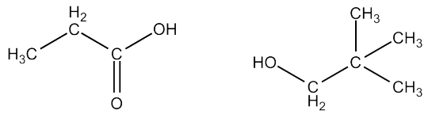
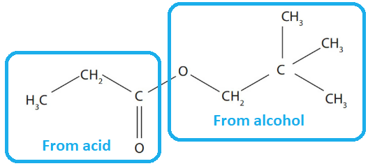
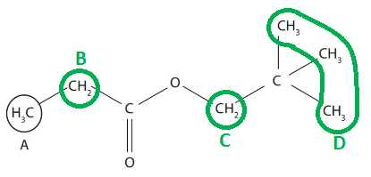
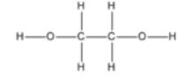
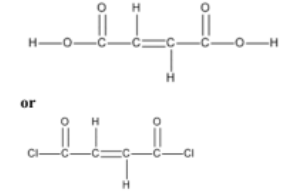
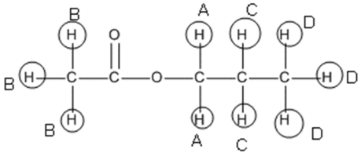
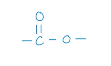
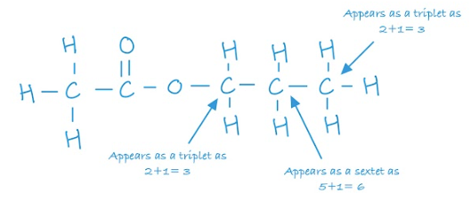

# Mark Schemes — Organic Chemistry: Carboxylic Acids
**4: Rates, Equilibria & Further Organic Chemistry** · Edexcel International A Level (IAL) Chemistry (YCH11)

## Q1 — medium — 9 marks · structured-questions

### 17((a)) — 2 marks
Show that these data are consistent with its molecular formula:

- Calculation of moles of C, H and O; **[1 mark]**
- Calculation of ratio  
**AND** 
Identify that ratio matches the molecular formula; **[1 mark]**

**[Total: 2 marks]**

- *You need to determine the empirical formula of the compound first:*

|   | > * C* | > *H* | > *O* |
|---|---|---|---|
| > *Moles* | > * *$\frac{66.7}{12}=5.56$ | $\frac{11.1}{1}=11.1$ | $\frac{22.2}{16}=1.3875$ |
| > *Ratio* | $\frac{5.56}{1.3875}=4$ | $\frac{11.1}{1.3875}=8$ | $\frac{1.3875}{1.3875}=1$ |
| > *Empirical formula* | > *C**4**H**8**O* |   |   |

- *Multiplying the empirical by 2 achieves the molecular formula C**8**H**16**O**2*

### 17((b)) — 3 marks
i) The  IUPAC name of **Y **is:

- 2,2-dimethylpropyl propanoate; **[1 mark]**

ii) Two organic compounds that would react together to form **Y **are:

- Both structures correct: **[1 mark]**

**[Total: 2 marks]**

- *Substance **Y** has the -COO functional group so can be identified as an ester *

  - *When naming an ester, the group attached to the oxygen atom in the -COO group forms the first part of the name, and the group attached to the C=O, forms the second part of the ester name*
  - *The carbon atom of the C=O bond should be included in the number of carbon atoms in the longest chain- if it wasn't, **Y **would incorrectly be identified as 2,2-dimethylpropyl ethanoate *
- *Esters are formed from the reaction between:*

  - *An alcohol and a carboxylic acid *
  - *An alcohol and acyl chloride*
  - *An acid and acid anhydride *
  - *Acyl chlorides and acid anhydrides are both derivatives of carboxylic acids *
- *The first part of the ester name is derived from the alcohol so 2,2-dimethylpropanol was used *
- *The second part of the ester name is derived from the carboxylic acid or derivative so propanoic acid, propanoyl chloride or propanoic acid are all acceptable structures to draw *
- *You can also look at the molecule and break the ester linkage to determine the component compounds* 

  - *Remember: **The portion with the C=O will come from a carboxylic acid*

### 17((c)) — 4 marks
i)The three remaining hydrogen environments B, C and D on the structure are:

- Correctly identified proton environments; **[1 mark]**

ii) The completed table is:

| **Hydrogen** **environment** | **Splitting pattern** **of peak** | **Relative** **peak area** |
|---|---|---|
| A | triplet | 3 |
| B | **quartet** | **2** |
| C | **singlet** | **2** |
| D | **singlet ** | **9** |

- Row B correct; **[1 mark]**
- Row C correct; **[1 mark]**
- Row D correct; **[1 mark]**

**[Total: 4 marks]**

- *Your B, C and D labels can be any way around as long as the three proton environments are identified correctly *
- *Similarly, the three methyl groups can be circled individually as long as they have a single label*
- *To determine the splitting pattern for each hydrogen environment:*

  - *Look at the number of protons on the adjacent carbon atom*
  - *Use n + 1 to determine the splitting pattern where n is the number of protons on the adjacent carbon atom  *
  
    - *At B, the neighbouring carbon atom is a methyl group which has 3 hydrogen atoms so 3 + 1= 4, quartet*
    - *At C, the neighbouring carbon atom has no protons so n + 1 = 1, singlet*
    - *At D, the neighbouring carbon atom has no protons so n + 1 = 1, singlet *
- *The relative peak area indicates the number of hydrogen atoms in a particular environment *

  - *At B, there is a CH**2** group / two hydrogen atoms so the peak area is 2 *
  - *At C, there is a -CH**2 **group / two hydrogen atoms so the peak area is 2 *
  - *At D, there are three -CH**3** groups / nine hydrogen atoms so the peak area is 9*

## Q2 — hard — 14 marks · structured-questions

### 17((a)) — 3 marks
i) Lactic acid shows optical isomerism because:

- It / lactic acid is non-superimposable on its mirror image; **[1 mark]**

ii) A reason for this observation is:

- It is a racemic mixture 
**OR** 
Contains equal amounts of the two enantiomers / (optical) isomers; **[1 mark]**

iii) The structure of the organic product formed when lactic acid reacts with concentrated phosphoric(V) acid, H3PO4 is:

- CH2=CHCOOH; **[1 mark]**

**[Total: 3 marks]**

- *Lactic acid has four different groups bonded to its central carbon atom, the chiral carbon (this would score the mark for i) *
- *There are two optical isomers or enantiomers that exist for lactic acid, which are non-superimposable on each other *

  - *One enantiomer will rotate light clockwise and the other anticlockwise so the effect will be cancelled out (this is also an acceptable answer for part ii) )*
  - *This only happens when there is an equal amount of each enantiomer - known as a racemic mixture *

### 17((b)) — 3 marks
The names of the substances are:

- Alcohol **X**: Butan-1-ol /  CH3CH2CH2CH2OH / CH3(CH2)2CH2OH; **[1 mark]**
- Reagent **Y:** PCl5 / phosphorus(V) chloride / phosphorus pentachloride; **[1 mark]**
- Compound **Z**: N-methylbutanamide / CH3CH2CH2CONHCH3 / CH3(CH2)2CONHCH3; **[1 mark]**

**[Total: 3 marks]**

- *You should recognise K**2**Cr**2**O**7** as an oxidising agent used to oxidise an alcohol*

  - *Primary alcohols are oxidised to form carboxylic acids whereas secondary alcohols would form a ketone so your answer must be specify butan-1-ol, you will not be awarded the mark for butanol or butan-2-ol*
- *Carboxylic acids react with solid phosphorus(V) chloride to form an acyl chloride which you should recognise from the -COCl group*
- *To form compound **Z **- a primary amine is used, CH**3**NH**2 **which results in the formation of an N-substituted amide*

  - *The amine molecule will add across the double bond in the acyl chloride and eliminate HCl*

### 17((c)) — 2 marks
The structures of monomers 1 and 2 are:

- Monomer 1: **[1 mark]**

- Monomer 2**: [1 mark]**

- *A polyester is usually formed via a condensation polymerisation reaction between a dicarboxylic acid and a diol *
- *During this reaction, water is lost, and an ester linkage -COO- formed *
- *The OH from the carboxylic acid group, -COOH will join with the H from the -OH group of the diol *
- *For this example*

  - *Find the ester linkage*
  - *The right hand side of the polymer has the C=O bond so this must be from the dicarboxylic acid monomer*
  - *The left hand side has only -O- so this must be from the diol*
  - *Acyl chlorides are sometimes used to form polyesters so this monomer will also score the mark *

### 17((d)) — 6 marks
i) The molecular formula of **E** is:

- C5H10O2; **[1 mark]**

ii) This observation tells us:

- **E** is not a carboxylic acid 
**OR**
**E** does not contain COOH (group); **[1 mark]**

iii) The functional group in **E** is:

- Ester; **[1 mark]**

iv) The structure of E is:

- Correct structure of **E**; **[1 mark]**
- 2 or 3 proton environments correct; **[1 mark]**
- 4th proton environment correct; **[1 mark]**

**[Total: 6 marks]**

- *To deduce the molecular formula in i)*

  - *The molecular ion peak corresponds to the **M**r** of the compound *
  - *You are told there are five carbon atoms in a compound containing only carbon, hydrogen and oxygen *
  
    - *The total **M**r** of the carbons= 5 x 12.000 = 60 *
    - *102.0678 - 60 = 42.0678*
  - *You know there are only hydrogen and oxygen atoms left which must total 42.0678*
  - *Say there is 1 oxygen present:*
  
    - * 42.0678 - 15.9949  = 26.072*
    - *Logically, there cannot be 26 hydrogen atoms, and this number does not divide equally using the **M**r** of hydrogen anyway*
  - *Try Including another oxygen:*
  
    - *26.072 - 15.9949 = 10.078 *
    - *10 hydrogen atoms is correct if there is a double bond present and 10.078 / 1.0078 = 10 *
  - *Therefore there are five carbons, two oxygens, and ten hydrogens*
  - *The elements can be in any order in the molecular formula to score the mark *
- *When sodium hydrogencarbonate is added to an acid, you would produce carbon dioxide gas which would be observed as effervescence*

  - *No effervescence = no acid *
- *Use your data booklet to look up the range 1750 – 1735 cm**−1 **on an infrared spectrum, it correlates to an ester *
- *To deduce the displayed formula for the ester:*

  - *Draw out the ester group, -COO-, this uses up one carbon atom, and both oxygen atoms so there are four carbon and ten hydrogens left over *

- *The position of** B** can be deduced by:*

  - *The peak being a singlet*
  
    - *Using the n+1 rule where n is the number of carbon atoms means that it is next to a carbon atom which has 0 hydrogen atoms, the ester group*
  - *The relative peak area is 3*
  
    - *There are three hydrogen atoms present *
  - *The chemical shift tells us that the hydrogen atoms are next to the ester group *
- *The relative peak area tells us **D** also has three hydrogen atoms so this must be at the end of the chain on the other side of the ester *

  - *A** and **C** both themselves have two hydrogen atoms *
  
    - *A** is next to a carbon that has two hydrogen atoms*
    - *C** is next to carbon atoms that have 5 hydrogen atoms *
    - *From this, the positions of **A** and **C** can be deduced* 

## Q3 — medium — 1 marks · multiple-choice-questions

### 13() — 1 marks
**Correct answer: C** — ethyl butanoate

**Final answer:** **The correct answer is ****C**** because:**

- Esters can be hydrolysed to reform the carboxylic acid and alcohol or salts of carboxylic acids by using either dilute acid (e.g. sulfuric acid) or alkali (e.g. sodium hydroxide) and heat
- Ethyl butanoate and water will produce ethanol and butanoic acid

**A** is incorrect as hydrolysis would give ethanoic acid

**B** is incorrect as hydrolysis would give butan-1-ol

**D** is incorrect as hydrolysis would give propanoic acid

## Q4 — medium — 1 marks · multiple-choice-questions

### 14() — 1 marks
**Correct answer: C** — (CH3)2CHCOOCH2CH3

**Final answer:** **The correct answer is ****C**** because:**

- In order to form an ester an alcohol must react with a carboxylic acid or acid chloride
- This tells you that compound Y must be a carboxylic acid with four carbons since it came from C4H10O
- The ester group must contain a section with four carbons followed by the ester link then a section with 2 carbons
- Only option **C** fits that criteria, ( (CH3)2CHCOOCH2CH3 )

**A, B & D **are** ** incorrect as these products could not be formed as compound Y must have 4 carbon atoms and the ester Z must be formed from ethanol

## Q5 — medium — 1 marks · multiple-choice-questions

### 14() — 1 marks
**Correct answer: A** — 

**Final answer:** **The correct answer is ****A**** because:**

- When terylene is formed, the H from the -COOH in terephthalic acid are removed
- The OH from the C-OH in ethan-1,2-diol are removed
- The two join together via an ester bond -COO- between them

**B** is incorrect as  this structure has —C2H4— groups at both ends

**C** is incorrect as  this structure has —C2H4— groups at both ends and the ester groups are reversed

**D** is incorrect as this structure has the ester groups reversed

## Q6 — medium — 1 marks · multiple-choice-questions

### 14() — 1 marks
**Correct answer: C** — CH3COONa and CH3CH2CH2OH

**Final answer:** **The correct answer is ****C**** because:**

- When an ester undergoes alkaline hydroysis, a carboxylate salt and alcohol are formed
- To form propyl ethanoate, CH3COOCH2CH2CH3, propanol was used which will reform upon hydrolysis
- Propanol has the formula CH3CH2CH2OH which leaves CH3COO to react with sodium and form H3COONa

**A** is incorrect as ethanoic acid reacts with NaOH to form the sodium salt

**B** is incorrect as ethanoic acid reacts with NaOH to form the sodium salt and propan-1-ol does not react with NaOH

**D** is incorrect as  propan-1-ol does not react with NaOH

## Q7 — medium — 1 marks · multiple-choice-questions

### 15() — 1 marks
**Correct answer: B** — C3H7OH

**Final answer:** **The correct answer is ****B****  because:**

- The compound CH3COOC3H7 is an ester
- When esters undergo base hydrolysis they form an alcohol and a carboxylate salt
- The salt would contain two carbons, i.e. CH3COONa and the alcohol three carbons, i.e. C3H7OH
- Only option** B** contains a correct reaction product, C3H7OH

**A** is incorrect as  the alcohol formed would be C3H7OH

**C** is incorrect as  no carboxylic acid is formed under these reaction conditions

**D** is incorrect as the sodium salt of ethanoic acid would be formed

## Q8 — medium — 1 marks · multiple-choice-questions

### 15() — 1 marks
**Correct answer: B** — 

**Final answer:** **The correct answer is ****B**** because:**

- Esters are prepared from the condensation reaction between a carboxylic acid and alcohol with concentrated H2SO4 as catalyst
- Esters can be hydrolysed to reform the carboxylic acid and alcohol or salts of carboxylic acids by using either dilute acid (e.g. sulfuric acid) or alkali (e.g. sodium hydroxide) and heat

**A** is incorrect as  bases also speed up hydrolysis

**C** is incorrect as  bases do not speed up esterification and acids also speed up hydrolysis

**D** is incorrect as   bases do not speed up esterification

## Q9 — medium — 1 marks · multiple-choice-questions

### 15() — 1 marks
**Correct answer: C** — 90.5 %

**Final answer:** **The correct answer is ****C**** because:**

- Ethanol is oxidised to produce ethanoic acid
- The equation for the reaction is CH3CH2OH + 2[O] →  CH3COOH + H2O
- The moles of ethanol is $\frac{2.5}{46}$= 0.0543... mol
- The moles of ethanoic acid that would be produced would also be 0.0543... mol as the molar quantities are equal
- The mass of ethanoic acid that should have been produced is 0.0543... x 60 = 3.261 g
- To calculate the percentage yield use $\frac{\mathrm{actual} \mathrm{yield}}{\mathrm{theoretical} \mathrm{yield}}\times100$ so $\frac{2.95}{3.261}\times100$= 90.5%

**A **is incorrect as molar masses have been used for the incorrect substances and the amount of ethanoic acid should be the numerator of the fraction

**B** is incorrect as   the masses have not been converted into moles and the amount of ethanoic acid should be the numerator of the fraction

**D **is incorrect as the masses have not been converted into moles

## Q10 — medium — 1 marks · multiple-choice-questions

### 1() — 1 marks
**Correct answer: D** — ethyl ethanoate

**Final answer:** **The correct answer is D**

- Acyl chlorides react with alcohols at room temperature by nucleophilic substitution (addition–elimination) to form an ester and HCl gas:

CH3COCl + CH3CH2OH → CH3COOCH2CH3 + HCl

- The product is ethyl ethanoate (an ester).

  - The –OH of ethanol attacks the δ+ carbonyl carbon, Cl⁻ is displaced, and HCl is eliminated
- The observation would be steamy/misty white fumes of HCl

**A** is incorrect as ethanoic acid is the product when the acyl chloride reacts with **water**, not an alcohol

**B** is incorrect as ethanol is a **reactant**, not the product

**C** is incorrect as ethoxyethane (an ether) is not a product of this reaction type. Ethers are not formed from acyl chlorides and alcohols

> **[exam-tip]**
> Reactions of acyl chlorides follow the pattern **acyl chloride + nucleophile → substituted product + HCl**. Specifically:
> 
> - + water → carboxylic acid + HCl
> - + alcohol → ester + HCl
> - + concentrated ammonia → primary amide + HCl
> - + primary amine → N-substituted amide + HCl
> 
> All four produce **steamy white fumes of HCl**, a universal observation. Acyl chlorides are preferred over carboxylic acids for making esters because the reaction goes to completion (irreversible, higher yield) at room temperature (no catalyst needed).

## Q11 — medium — 1 marks · multiple-choice-questions

### 1() — 1 marks
**Correct answer: D** — Zero order

**Final answer:** **The correct answer is D**

- The concentration-time graph is a straight line with a constant gradient
- [A] decreases at a constant rate throughout the reaction
- A constant rate, independent of [A], is the diagnostic signature of zero-order kinetics: rate = *k*

**A** is incorrect as a first-order reaction gives a **curve** on a concentration-time graph with a constant half-life (not a straight line)

**B** is incorrect as a second-order reaction gives a **steeper curve** with an increasing half-life (not a straight line)

**C** is incorrect as third-order reactions also give a curved concentration-time graph (not a straight line). Third order is also rare in IAL

> **[exam-tip]**
> **Always check the axis labels.** Concentration-time and rate-concentration graphs look different and test different things, and students frequently confuse them (a common examiner-report flag).
> 
> On a **concentration-time** graph:
> 
> - **Zero order** = straight line
> - **First order** = curve with constant half-life
> - **Second order** = steeper curve with increasing half-life.
> 
> On a **rate-concentration** graph:
> 
> - **Zero order** = horizontal line
> - **First order** = straight line through the origin
> - **Second order** = curve through the origin.

## Q12 — medium — 1 marks · multiple-choice-questions

### 1() — 1 marks
**Correct answer: B** — 49.9 kJ mol⁻¹

**Final answer:** **The correct answer is B**

- The Arrhenius equation in linear form: ln *k* = −(*E*a/*R*)(1/*T*) + ln *A*
- The gradient of an Arrhenius plot is therefore −*E*a/*R*
- Rearranging:

*E*a = −gradient × *R*

*E*a = −(−6005) × 8.31

*E*a = 4.99 × 10⁴ J mol⁻¹

- Converting from J mol-1 to kJ mol-1 (÷1000):

*E*a = **49.9 kJ mol**-1

**A** is incorrect as activation energy must be **positive**, a negative value ignores the negative sign on the gradient, giving the wrong sign on *E*a

**C** is incorrect as 722 kJ mol-1 comes from **dividing** the gradient by *R* (6005 / 8.31) instead of multiplying

**D** is incorrect as 4.99 × 10⁴ kJ mol-1 fails to convert the answer from J mol-1 to kJ mol-1,  the raw value of 49 900 J mol⁻¹ should be divided by 1000

> **[exam-tip]**
> Three common traps with Arrhenius calculations:
> 
> 1. Dropping the negative sign, remember *E*a = **−**gradient × *R*
> 2. Confusing 'multiply by *R*' with 'divide by *R*', the gradient is −*E*a/*R*, so to get *E*a you must **multiply** by *R*
> 3. Forgetting to convert from J mol⁻¹ to kJ mol⁻¹ (÷1000)
> 
> *E*a is **always positive**.

## Q13 — hard — 2 marks · multiple-choice-questions

### 9((a)) — 1 marks
**Correct answer: B** — 

**Final answer:** **The correct answer is ****B**** because:**

- The two monomers form a polymer via condensation polymerisation
- The OH from the carboxylic acid group of each compound joins with the H from the -OH group of each compound and are lost as water to produce an ester linkage -COO- between the two monomers
- B is the only repeat unit with the correct number of carbon and oxygen atoms present once the water molecules have been lost

**A** is incorrect as  the repeat unit has an extra oxygen

**B** is incorrect as there is an extra carbon at the left-hand end of the repeat unit

**C** is incorrect as the repeat unit has an extra oxygen and the structure is incorrect

### 9((b)) — 1 marks
**Correct answer: B** — hydrolysis

**Final answer:** **The correct answer is ****B ****because:**

- When the polymer was formed, for every ester linkage formed, a water molecule was eliminated via a condensation reaction
- Therefore, to reform the original monomer, water needs reintroducing in a hydrolysis reaction

**A** is incorrect as condensation is the reaction when the polymer forms

**C** is incorrect as hydration is the addition of water to a C=C bond

**D** is incorrect as  hydrogen has not been added in a reduction reaction
