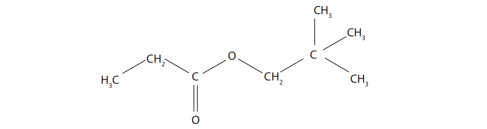
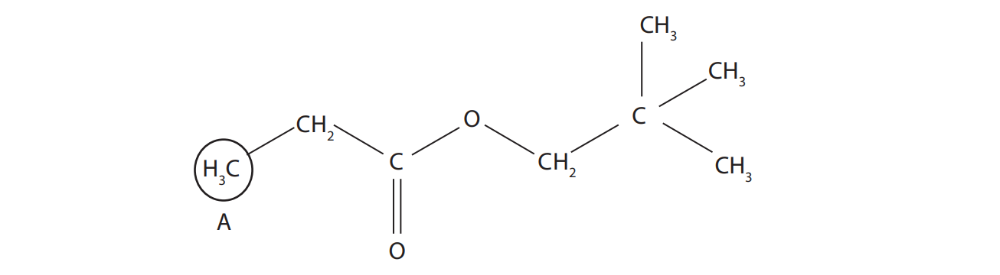
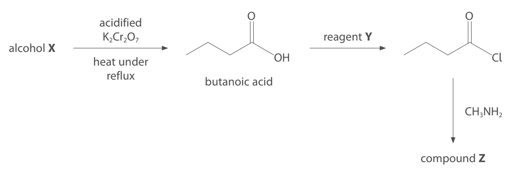
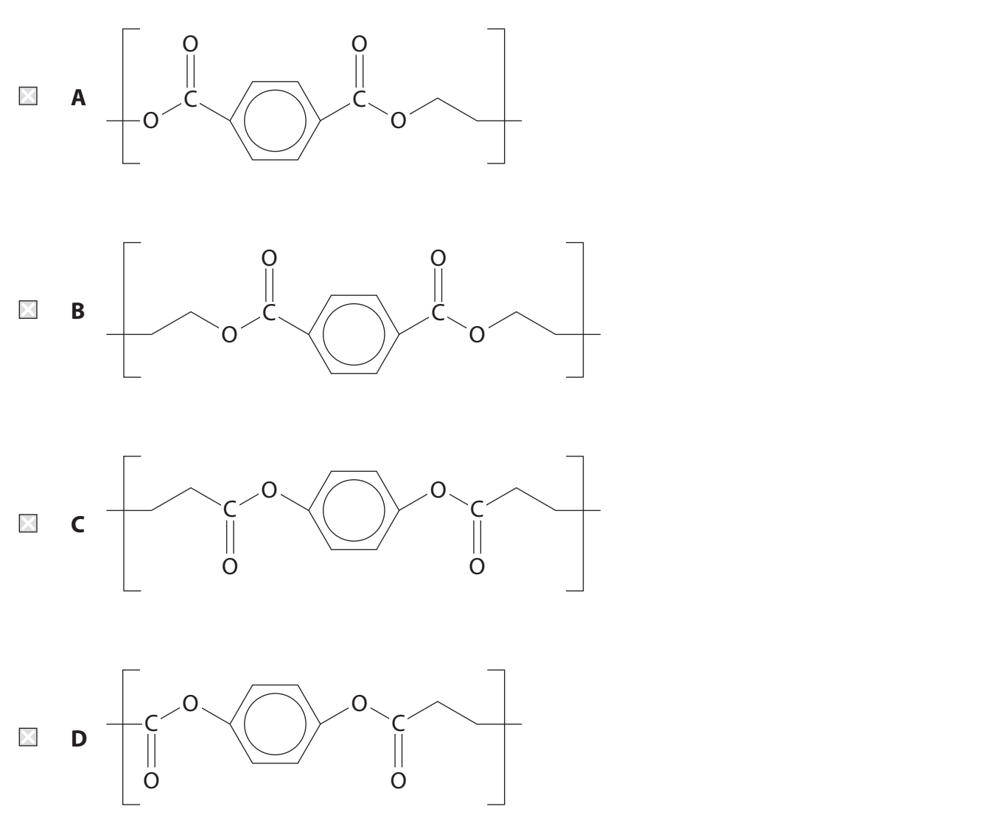
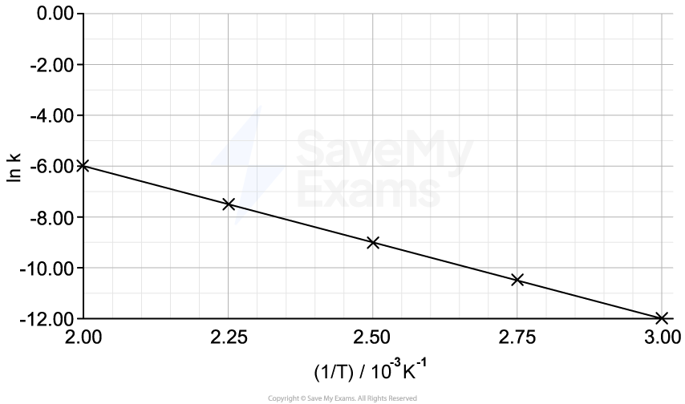
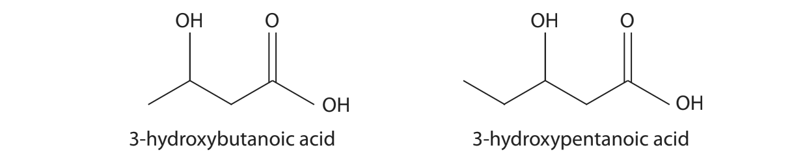
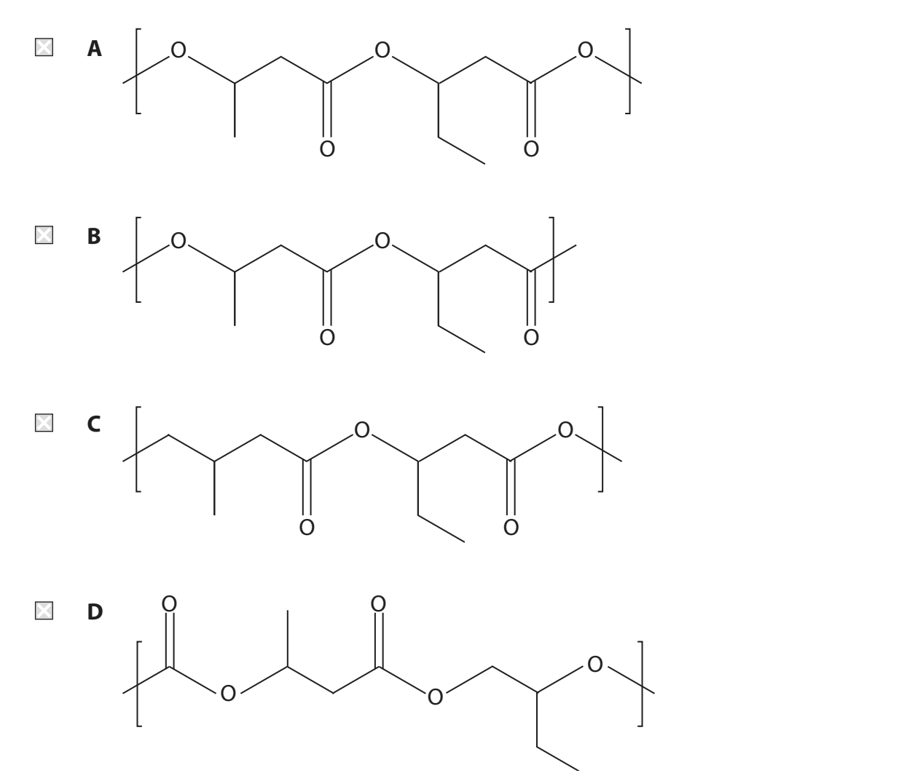

# Exam Questions — Organic Chemistry: Carboxylic Acids
**4: Rates, Equilibria & Further Organic Chemistry** · Edexcel International A Level (IAL) Chemistry (YCH11)
> Source: [https://www.savemyexams.com/international-a-level/chemistry/edexcel/17/topic-questions/4-rates-equilibria-and-further-organic-chemistry/4-8-organic-chemistry-carboxylic-acids/structured-questions/](https://www.savemyexams.com/international-a-level/chemistry/edexcel/17/topic-questions/4-rates-equilibria-and-further-organic-chemistry/4-8-organic-chemistry-carboxylic-acids/structured-questions/) · 13 questions · total 35 marks

## Q1 — medium — 9 marks · structured-questions

### 17((a)) — 2 marks — command: show — structured — from paper June 2021 · WCH16/01
This question is about an ester, **Y**, with the molecular formula C8H16O2.

**Y** contains 66.7% carbon, 11.1% hydrogen and 22.2% oxygen by mass. Show that these data are consistent with its molecular formula.

### 17((b)) — 3 marks — command: multiple — structured — from paper June 2021 · WCH14/01
The structure of compound** Y** is

i) Give the IUPAC name of **Y**.

**(2)**

ii) Draw the structures of two organic compounds that would react together to form **Y**.

**(1)**

### 17((c)) — 4 marks — command: multiple — structured — from paper June 2021 · WCH14/01
The high resolution proton NMR spectrum of compound **Y** was obtained.

i) Label the three remaining hydrogen environments B, C and D on the structure.

**(1)**

ii) Complete the table.

**(3)**

| **Hydrogen** **environment** | **Splitting pattern** **of peak** | **Relative** **peak area** |
|---|---|---|
| A | triplet | 3 |
| B |   |   |
| C |   |   |
| D |   |   |

## Q2 — hard — 14 marks · structured-questions

### 17((a)) — 3 marks — command: give — structured — from paper Jan 2021 · WCH14/01
This question is about carboxylic acids and their derivatives.

Lactic acid, CH3CH(OH)COOH, is produced in muscles as a result of anaerobic respiration.

i) The structure of lactic acid is

Give a reason why lactic acid shows optical isomerism.

**(1)**

ii) A laboratory sample of lactic acid does **not** rotate the plane of plane-polarised monochromatic light.

Give a reason for this observation.

**(1)**

iii) Give the structure of the organic product formed when lactic acid reacts with concentrated phosphoric(V) acid, H3PO4.

**(1)**

### 17((b)) — 3 marks — command: identify — structured — from paper Jan 2021 · WCH14/01
A reaction scheme involving butanoic acid is shown.

Identify **X, Y** and **Z** by name or formula.

| Alcohol **X** |
|---|
| Reagent **Y** |
| Compound **Z** |

### 17((c)) — 2 marks — command: give — structured — from paper Jan 2021 · WCH14/01
The repeat unit of a polyester is shown.

Give the structures of the two monomers that could form this polyester.

| Monomer 1 | Monomer 2 |
|---|---|

### 17((d)) — 6 marks — command: multiple — structured — from paper Jan 2021 · WCH14/01
An organic compound **E** contains carbon, hydrogen and oxygen only.

i) The accurate relative atomic masses,* A*r , of the three elements in **E** are shown in the table.

| **Element** | ***A******r*** |
|---|---|
| hydrogen | 1.0078 |
| carbon | 12.0000 |
| oxygen | 15.9949 |

**E** contains five carbon atoms and gives a molecular ion peak at *m / z* = 102.0678 in its mass spectrum.

Deduce the molecular formula of **E**.

**(1)**

ii) Aqueous sodium hydrogencarbonate is added to a sample of **E**.

No effervescence occurs.

State what can be deduced by this observation.

**(1)**

iii) The infrared spectrum of **E** has an absorption in the range 1750 – 1735 cm−1. Name the functional group in **E**.

**(1)**

iv) Data from the high resolution proton NMR spectrum of **E** is shown.

| **Peak** | **Chemical shift, **$δ$  **/ ppm for TMS** | **Splitting pattern** | **Relative peak area** |
|---|---|---|---|
| **A** | 4.02 | triplet | 2 |
| **B** | 2.05 | singlet | 3 |
| **C** | 1.65 | sextet | 2 |
| **D** | 0.95 | triplet | 3 |

Deduce the structure of **E**.

Justify your answer by labelling the protons responsible for each peak.

**(3)**

## Q3 — medium — 1 marks · multiple-choice-questions

### 13() — 1 mark — multiple_choice — from paper Oct 2021 · WCH14/01
Butanoic acid may be prepared by the acid hydrolysis of
- **A.** butyl ethanoate
- **B.** 1-chlorobutane
- **C.** ethyl butanoate
- **D.** propanenitrile

## Q4 — medium — 1 marks · multiple-choice-questions

### 14() — 1 mark — multiple_choice — from paper Jan 2022 · WCH14/01
Compound **X**, C4H10O, is oxidised to form compound **Y**.

Compound **Y** reacts with ethanol in the presence of concentrated sulfuric acid to give an ester, **Z.**

Which of these could be the formula of **Z**?
- **A.** CH3COOC(CH3)3
- **B.** CH3CH2COO(CH2)3CH3
- **C.** (CH3)2CHCOOCH2CH3
- **D.** CH3CH2COOCH2CH(CH3)2

## Q5 — medium — 1 marks · multiple-choice-questions

### 14() — 1 mark — multiple_choice — from paper Oct 2021 · WCH14/01
Terylene is a polyester derived from ethane-1,2-diol and terephthalic acid.

What is the structure of the repeat unit of terylene?

- **A.** 
- **B.** 
- **C.** 
- **D.** 

## Q6 — medium — 1 marks · multiple-choice-questions

### 14() — 1 mark — multiple_choice — from paper Jan 2021 · WCH14/01
Propyl ethanoate, CH3COOCH2CH2CH3, is hydrolysed with aqueous sodium hydroxide.

Which products are formed?
- **A.** CH3COOH and CH3CH2CH2OH
- **B.** CH3COOH and CH3CH2CH2ONa
- **C.** CH3COONa and CH3CH2CH2OH
- **D.** CH3COONa and CH3CH2CH2ONa

## Q7 — medium — 1 marks · multiple-choice-questions

### 15() — 1 mark — multiple_choice — from paper Jan 2022 · WCH14/01
Which of these compounds is a product of the hydrolysis of CH3COOC3H7 by refluxing with aqueous sodium hydroxide?
- **A.** CH3OH
- **B.** C3H7OH
- **C.** C3H7COOH
- **D.** C3H7COO–Na+

## Q8 — medium — 1 marks · multiple-choice-questions

### 15() — 1 mark — multiple_choice — from paper Oct 2021 · WCH14/01
The formation of esters and the hydrolysis of esters are reactions that are slow under normal laboratory conditions.

What speeds up these reactions?

|   | ** ** | **Esterification** | **Hydrolysis** |
|---|---|---|---|
| ☐ | **A** | acids only | acids only |
| ☐ | **B** | acids only | acids and bases |
| ☐ | **C** | bases only | bases only |
| ☐ | **D** | bases only | acids and bases |
- **A.** 
- **B.** 
- **C.** 
- **D.** 

## Q9 — medium — 1 marks · multiple-choice-questions

### 15() — 1 mark — multiple_choice — from paper Jan 2021 · WCH14/01
2.95 g of ethanoic acid is produced from 2.50 g of ethanol.

What is the percentage yield of ethanoic acid?

[Molar masses in g mol−1: ethanoic acid = 60 ethanol = 46]
- **A.** 65.0 %
- **B.** 84.7 %
- **C.** 90.5 %
- **D.** 118 %

## Q10 — medium — 1 marks · multiple-choice-questions

### 1() — 1 mark — multiple_choice
Ethanoyl chloride (CH3COCl) reacts with ethanol at room temperature.

What is the organic product of this reaction?
- **A.** ethanoic acid
- **B.** ethanol
- **C.** ethoxyethane
- **D.** ethyl ethanoate

## Q11 — medium — 1 marks · multiple-choice-questions

### 1() — 1 mark — multiple_choice
The concentration of reactant **A** was monitored against time during a reaction. The results are shown below.

![Graph showing a linear decrease in concentration [A] in mol dm⁻³ over time t in seconds, from 1.0 at 0s to 0.0 at 100s.](assets/002-graph-showing-a-linear-decrease-in-concentration.png)

What is the order of the reaction with respect to **A**?
- **A.** First order
- **B.** Second order
- **C.** Third order
- **D.** Zero order

## Q12 — medium — 1 marks · multiple-choice-questions

### 1() — 1 mark — multiple_choice
The Arrhenius plot of ln *k* against 1/*T* for a reaction is shown.

The gradient of the line is −6005 K.

[Gas constant *R* = 8.31 J K⁻¹ mol⁻¹]

Calculate the activation energy of this reaction.
- **A.** −49.9 kJ mol⁻¹
- **B.** 49.9 kJ mol⁻¹
- **C.** 722 kJ mol⁻¹
- **D.** 4.99 × 10⁴ kJ mol⁻¹

## Q13 — hard — 2 marks · multiple-choice-questions

### 9((a)) — 1 mark — multiple_choice — from paper June 2021 · WCH14/01
The substance known as PHBV is a biodegradable polymer formed from 3-hydroxybutanoic acid and 3-hydroxypentanoic acid.

Which of these is the repeat unit of the polymer?

- **A.** 
- **B.** 
- **C.** 
- **D.** 

### 9((b)) — 1 mark — multiple_choice — from paper June 2021 · WCH14/01
What reaction occurs when PHBV biodegrades to its monomers?
- **A.** condensation
- **B.** hydrolysis
- **C.** hydration
- **D.** hydrogenation
