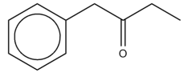
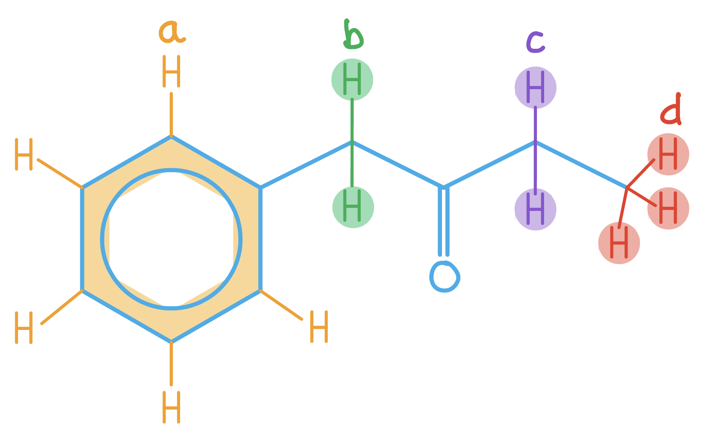
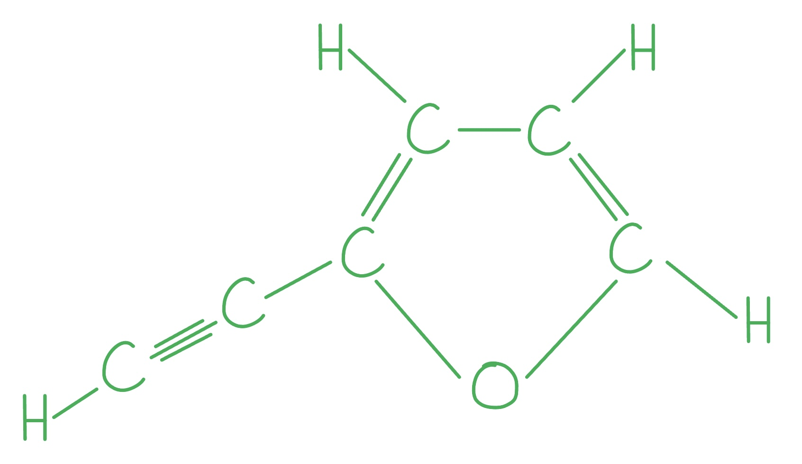
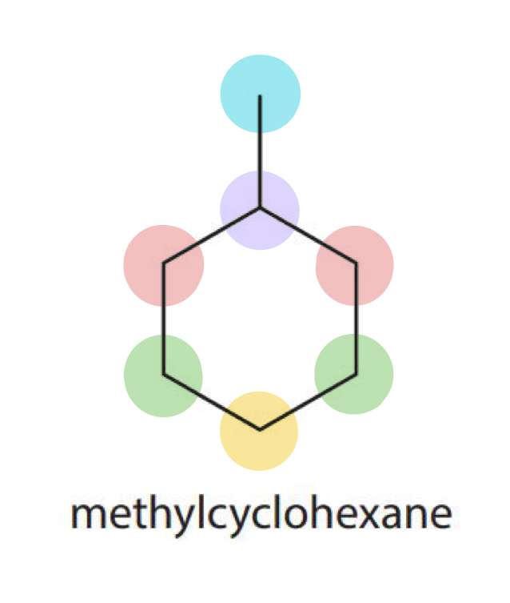
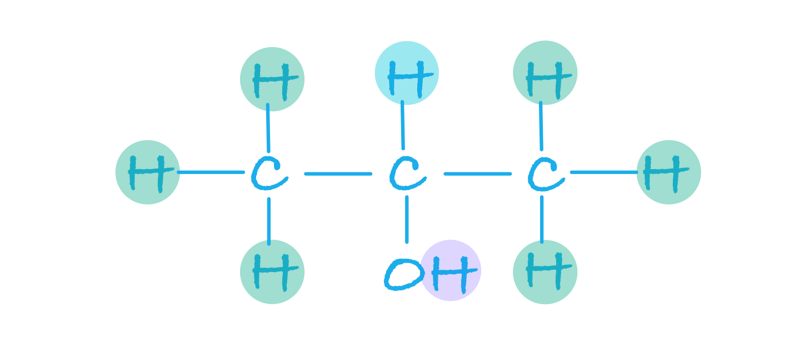

# Mark Schemes — Organic Analytical Techniques
**4: Rates, Equilibria & Further Organic Chemistry** · Edexcel International A Level (IAL) Chemistry (YCH11)

## Q1 — hard — 11 marks · structured-questions

### 15((a)) — 4 marks
To show that the molecular formula of **Q** is C10H12O:

|   | C | H | O |
|---|---|---|---|
| Mass | 14.6 x `open parentheses 12 over 44 close parentheses` = 3.982 g | 3.58 x `open parentheses 2 over 18 close parentheses` = 0.398 g | 4.91 - (3.982 + 0.398) = 0.53 g |
| Moles | $\frac{3.982}{12}$ = 0.332 mol | $\frac{0.398}{1}$ = 0.398 mol | $\frac{0.53}{16}$ = 0.0331 mol |
| Ratio | 10 | 12 | 1 |

- Mass of carbon; **[1 mark] **
- Mass of hydrogen
**AND**
Mass of oxygen; **[1 mark] **
- Moles of carbon
**AND**
Moles of hydrogen
**AND**
Moles of oxygen; **[1 mark] **
- Calculation of ratio / evidence showing that the molecular formula = C10H12O; **[1 mark] **

**Final answer:** **[Total: 4 marks] **

- *To find the mass of carbon you can*

  - *Find the moles of carbon dioxide = *$\frac{14.6}{44}$* then multiply by the **A**r** of carbon *
  - *The same can be done with hydrogen*
- *To find the mass of oxygen you need to find the difference between the mass of Q and the combined mass of carbon and hydrogen*

  - *This is because there are only three elements in the combustion equation *
- *It is then a case of following through with the empirical formula calculation to find the ratio*
- *An alternative method is: *

  - *Moles of Q = *$\frac{4.91}{148}$* = 0.0332 (mol)*
  - *Moles of CO**2** = *$\frac{14.6}{44}$* = 0.332 (mol) and moles of H**2**O = *$\frac{3.58}{18}$* = 0.199 (mol)*
  - *Calculation of the ratio 10 : 12*
  - *Show that O = 1 (10 x 12) + (12 x 1) + (16 x number of oxygen atoms) = 148 , so O = 1*

### 15((b)) — 7 marks
The structure of **Q** is:

- 

; **[1 mark] **

Justification using chemical shifts:

Any **three** of the following:

- 4 peaks / chemical shifts mean 4 (different) hydrogen environments;** [1 mark] **
- The peak at 7.5 ppm is due (to hydrogen atoms on) the benzene ring;** [1 mark] **
- The peak at 2.3 ppm is due to H-C-C=O / ketone / C=O; **[1 mark] **
- The peak at 1.0 ppm is due to H-C-C / alkyl group / methyl group / alkane; **[1 mark] **

Justification using splitting patterns:

Any **two** of the following:

- The peak at 2.3 ppm is a quartet as there are 3 hydrogens on neighbouring carbon / it is bonded to a CH3 group; **[1 mark] **
- The peak at 1.0 ppm is a triplet as there are 2 hydrogens on neighbouring carbon / bonded to a CH2; **[1 mark] **
- The peak at 3.6 ppm is a singlet as there are no hydrogens on neighbouring carbon;** [1 mark] **

Justification using the area under the curve:

- Area of 5 for the peak at 7.5 ppm shows the benzene ring has (only) 1 side group / is C6H5 ;** [1 mark] **

**Final answer:** **[Total: 7 marks] **

- *To deduce the structure, you are given a big clue in the fact it contains a benzene ring and from part (a) you know the compound has the molecular formula is C**10**H**12**O*
- *Make sure you use information from the data booklet to back up your answers - this will also help you deduce the structure *
- *The four different proton environments are shown in the diagram:*

- *Proton environment **a** shows the protons on the benzene ring - they are all in the same environment*

  - *This will give a peak at 7.5 ppm*
  - *The area under the peak (5 given in question) tells you the number of protons in the benzene ring, meaning there is only 1 substituted hydrogen on the benzene ring*
  - *This also removed C**6**H**5** from C**10**H**12**O, which means there is C**4**H**7**O left in the structure to account for*
- *Proton environment **b** shows the singlet at 3.6 ppm as there are no hydrogens on either of the neighbouring carbon atoms*

  - *Therefore we can assume there is a ketone present -C=O*
- *Proton environment **c** is shown as a quartet at 2.3 ppm given the CH**3** group at the end of the molecule (d)*

  - *Remember the n+1 rule*
  - *One quartet will tell you there is one CH**3** group *
- *Proton environment** d** is shown as a triplet at 1.0 ppm as there are two neighbouring protons in environment c*

## Q2 — easy — 1 marks · multiple-choice-questions

### 17() — 1 marks
**Correct answer: D** — 

**Final answer:** **The correct answer is ****D**** because:**

- The mobile phase is a liquid (typically an non-volatile hydrocarbon)
- The stationary phase is an inert solid such as silica
- HPLC is very similar in principle to column chromatography but instead of using gravity the solvent is forced through the column under high pressure

**A** is incorrect as high performance liquid chromatography has a liquid mobile phase

**B** is incorrect as high performance liquid chromatography has a liquid mobile phase

**D **is incorrect as high performance liquid chromatography has a solid stationary phase

## Q3 — medium — 1 marks · multiple-choice-questions

### 7() — 1 marks
**Correct answer: A** — 92.0261

**Final answer:** **The correct answer is ****A ****because:**

- The formula of the compound is C6OH4

  - **Careful: **There are 'hidden' hydrogens that are not shown in the skeletal formula
  - Also, take note of the C=C and C$\equiv$C bonds
- (C x 6) + (O x 1) + (H x 4) = (12.0000 x 6) + (15.9949 x 1) + (1.0078 x 4) = 92.0261

**B** is incorrect as  it uses O = 16

**C** is incorrect as  it has 5 hydrogens in the structure instead of 4

**D** is incorrect as it has 5 hydrogens in the structure instead of 4 **AND **uses O = 16

## Q4 — medium — 2 marks · multiple-choice-questions

### 11((a)) — 1 marks
**Correct answer: B** — 68 mm

**Final answer:** **The correct answer is B because:**

- The *R*f value is calculated using

  - *R*f= $\frac{\mathrm{distance} \mathrm{travelled} \mathrm{by} \mathrm{component}}{\mathrm{distance} \mathrm{travelled} \mathrm{by} \mathrm{solvent}}$
- This can be rearranged to:

  - Distance moved by solvent= $\frac{\mathrm{distance} \mathrm{moved} \mathrm{by} \mathrm{component}}{R_{f}}$ =  $\frac{42}{0.62}$= 67.74
  - Rounded to two significant figures, this is 68

**A** is incorrect as  it is a factor of 10 to large

**C** and **D** are incorrect as they are the distance moved by the amino acids

### 11((b)) — 1 marks
**Correct answer: A** — argon

**Final answer:** **The correct answer is ****A**** because**

- Once the sample to be separated is injected into the column, a carrier gas (the mobile phase) will move the sample through the stationary phase
- This gas must be inert / unreactive so that it does not react with the substances being separated in the mixture
- Argon is the only inert / unreactive gas given as a choice

**B,** **C **& **D **are incorrect as these are not inert gases

## Q5 — medium — 1 marks · multiple-choice-questions

### 15() — 1 marks
**Correct answer: C** — five

**Final answer:** **The correct answer is ****C**** because:**

- In methylcyclohexane, the carbon atoms are in 5 different chemical environments

  - Therefore, there will be 5 peaks in a carbon-13 NMR spectrum
- The 5 different chemical environments are shown below; some carbon atoms have the same chemical environment:

**A** is incorrect as the C atoms in methylcyclohexane are not all equivalent

**B** is incorrect as there are five types of carbon environment in methylcyclohexane, not three

**D** is incorrect as  the C atoms in methylcyclohexane are not all different

## Q6 — medium — 1 marks · multiple-choice-questions

### 16() — 1 marks
**Correct answer: B** — forces of attraction to the liquid

**Final answer:** **The correct answer is ****B**** because**

- The passage of a molecule through the gas chromatography coil depends upon the attraction between the solute and the stationary and mobile phases as well as the nature of the solute

**A** is incorrect as these do not affect passage through the stationary phase

**C** is incorrect as this is not the main reason and does not directly affect passage through the stationary phase

**D **is incorrect as these do not affect passage through the stationary phase

## Q7 — medium — 1 marks · multiple-choice-questions

### 16() — 1 marks
**Correct answer: A** — one singlet, one doublet and a heptet

**Final answer:** **The correct answer is ****A**** because:**

- The hydrogen atoms in propan-2-ol are in three different chemical environments, resulting in 3 different chemical shifts:

- The splitting patterns of these three peaks will be:
- The proton in -OH groups are not affected by neighboring protons, so results in a singlet
- The proton in C-H on C2 has six neighbouring equivalent protons (3 either side in two equivalent CH3 groups), so will be observed as a heptet (n + 1 = 6 + 1 = 7)
- The protons in C-H on C1 and C3 have 1 neighbouring proton which will appear as a doublet (n + 1 = 1 + 1 = 2)

**B** is incorrect as  this ignores the fact that the proton environments on C1 and C3 are the same

**C** is incorrect as this is the number of protons in each environment, not the splitting pattern

**D** is incorrect as  this ignores all the splitting except the effect of one methyl on the C2 proton

## Q8 — medium — 1 marks · multiple-choice-questions

### 16() — 1 marks
**Correct answer: D** — 

**Final answer:** **The correct answer is ****D**** because:**

- To calculate the *R*f value, the distance the component moved is divided by the distance the solvent moved
- The solvent (mobile phase) has always moved further, so all *R*f values are below 1
- The closer the answer is to 1, the smaller the difference was between the distance moved by the component and the solvent
- A component with an *R*f value of 0.9 must therefore have been carried relatively far through the stationary phase by the mobile phase indicating a weak attraction to the stationary phase and a strong attraction to the mobile phase

**A **is incorrect as if there was a strong attraction to the stationary phase the component would not move very far and would have a low *R*f value

**B** is incorrect as if there was a weak attraction to the mobile phase the component would not move very far and would have a low *R*f value

**C **is incorrect as  if there was a weak attraction to the mobile phase the component would not move very far and would have a low *R*f value

## Q9 — medium — 1 marks · multiple-choice-questions

### 1() — 1 marks
**Correct answer: C** — Carboxylic acid

**Final answer:** **The correct answer is C**

A carboxylic acid shows both of the diagnostic absorptions listed:

- Very broad O–H absorption (2500–3300 cm⁻¹): characteristic of the carboxylic acid O–H (much broader and lower-wavenumber than an alcohol O–H)
- Sharp, strong C=O absorption (~1700–1725 cm⁻¹): diagnostic of the carbonyl group
- The combination of the very broad O–H (extending below 3200 cm⁻¹) and a sharp C=O peak is the classic carboxylic acid fingerprint.

**A** is incorrect as an alcohol has a broad O–H absorption, but at **higher** wavenumbers (3200–3550 cm⁻¹, not extending down to 2500 cm⁻¹), and there is **no** C=O absorption at 1715 cm⁻¹

**B** is incorrect as an aldehyde has the C=O absorption at 1715 cm⁻¹ but **no** broad O–H absorption, so the very broad 2500–3300 cm⁻¹ peak could not be explained

**D** is incorrect as a ketone has the C=O absorption at 1715 cm⁻¹ but **no** broad O–H absorption, so the very broad peak could not be explained

> **[exam-tip]**
> Key distinctions: **alcohol O–H** (3200–3550 cm⁻¹, broad) vs **carboxylic acid O–H** (2500–3300 cm⁻¹, very broad, often overlapping the C–H region).
> 
> Paper 4 examiner reports consistently flag students confusing these two.
> 
> Always quote **both** the bond and the wavenumber range, and check the Data Booklet.
> 
> A sharp C=O plus a very broad O–H extending below 3200 cm⁻¹ is the definitive carboxylic acid signature.
