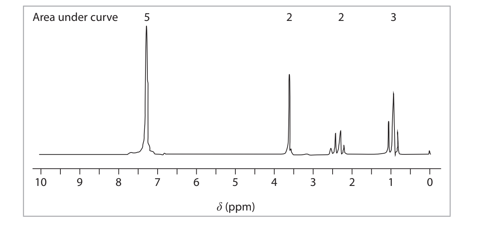

# Exam Questions — Organic Analytical Techniques
**4: Rates, Equilibria & Further Organic Chemistry** · Edexcel International A Level (IAL) Chemistry (YCH11)
> Source: [https://www.savemyexams.com/international-a-level/chemistry/edexcel/17/topic-questions/4-rates-equilibria-and-further-organic-chemistry/4-9-organic-analytical-techniques/structured-questions/](https://www.savemyexams.com/international-a-level/chemistry/edexcel/17/topic-questions/4-rates-equilibria-and-further-organic-chemistry/4-9-organic-analytical-techniques/structured-questions/) · 9 questions · total 20 marks

## Q1 — hard — 11 marks · structured-questions

### 15((a)) — 4 marks — command: show — structured — from paper Jan 2022 · WCH15/01
A compound **Q** contains the elements carbon, hydrogen and oxygen only.

Combustion analysis of 4.91 g of **Q** produces 14.6 g of carbon dioxide and 3.58 g of water.

Show that the molecular formula of **Q** is C10H12O.

You **must** show all your working. [*M*r of **Q** = 148]

### 15((b)) — 7 marks — command: justify — structured — from paper Jan 2022 · WCH15/01
The high resolution proton NMR spectrum of **Q** is shown.

Deduce the structure of **Q**. Justify your answer by considering the relative peak areas, the chemical shifts and the splitting patterns.

You will find it helpful to refer to page 8 of the Data Booklet.

The peak at 3.6 ppm is due to a proton environment on a carbon bonded to the benzene ring. The peak is not where it might be expected from the general values in the Data Booklet.

## Q2 — easy — 1 marks · multiple-choice-questions

### 17() — 1 mark — multiple_choice — from paper Jan 2022 · WCH14/01
In HPLC, the mobile and stationary phases are

|   | ** ** | **Mobile phase** | **Stationary phase** |
|---|---|---|---|
| ☐ | **A** | gas | liquid |
| ☐ | **B** | gas | solid |
| ☐ | **C** | liquid | gas |
| ☐ | **D** | liquid | solid |
- **A.** 
- **B.** 
- **C.** 
- **D.** 

## Q3 — medium — 1 marks · multiple-choice-questions

### 7() — 1 mark — multiple_choice — from paper Jan 2022 · WCH15/01
The mass spectrum of the compound shown is obtained using a high resolution mass spectrometer.

What is the mass to charge ratio, *m/ z,* of the molecular ion of this compound?

[*A*r values: H = 1.0078    C = 12.0000    O = 15.9949]
- **A.** 92.0261
- **B.** 92.0312
- **C.** 93.0339
- **D.** 93.0390

## Q4 — medium — 2 marks · multiple-choice-questions

### 11((a)) — 1 mark — multiple_choice — from paper June 2021 · WCH14/01
This question is about chromatography.

A spot caused by an amino acid has moved 42 mm from the baseline of a paper chromatogram. The Rf value for the amino acid under these conditions is 0.62.

What is the distance moved by the solvent?
- **A.** 680 mm
- **B.** 68 mm
- **C.** 42 mm
- **D.** 26 mm

### 11((b)) — 1 mark — multiple_choice — from paper June 2021 · WCH14/01
In gas chromatography, GC, which of these would be the most suitable carrier gas?
- **A.** argon
- **B.** hydrogen
- **C.** methane
- **D.** oxygen

## Q5 — medium — 1 marks · multiple-choice-questions

### 15() — 1 mark — multiple_choice — from paper June 2021 · WCH15/01
How many peaks are there in the carbon-13 (13C) NMR spectrum of methylcyclohexane?

- **A.** one
- **B.** three
- **C.** five
- **D.** seven

## Q6 — medium — 1 marks · multiple-choice-questions

### 16() — 1 mark — multiple_choice — from paper Jan 2022 · WCH14/01
In gas chromatography, a gas containing a mixture is passed over a liquid stationary phase. The main reason a mixture is separated into its components is because they have different
- **A.** boiling temperatures
- **B.** forces of attraction to the liquid
- **C.** relative molecular masses
- **D.** volatilities

## Q7 — medium — 1 marks · multiple-choice-questions

### 16() — 1 mark — multiple_choice — from paper June 2021 · WCH15/01
In the **high** resolution proton NMR spectrum of propan-2-ol, CH3CHOHCH3 there are
- **A.** one singlet, one doublet and a heptet
- **B.** one singlet, two doublets and a heptet
- **C.** two singlets and two triplets
- **D.** three singlets and a quartet

## Q8 — medium — 1 marks · multiple-choice-questions

### 16() — 1 mark — multiple_choice — from paper Jan 2021 · WCH14/01
A mixture of organic compounds was analysed using thin-layer chromatography.

The *R*f value was 0.92 for one of the components in the mixture.

What can be deduced about the attractions between that component and the stationary and mobile phases?

|   | ** ** | **Attraction between component and** **stationary phase** | **Attraction between component and** **mobile phase** |
|---|---|---|---|
| ☐ | **A** | strong | strong |
| ☐ | **B** | strong | weak |
| ☐ | **C** | weak | weak |
| ☐ | **D** | weak | strong |
- **A.** 
- **B.** 
- **C.** 
- **D.** 

## Q9 — medium — 1 marks · multiple-choice-questions

### 1() — 1 mark — multiple_choice
The infrared spectrum of an organic compound shows:

- a very broad absorption extending from approximately 2500 to 3300 cm⁻¹
- a sharp, strong absorption at approximately 1715 cm⁻¹

Which functional group is present in the compound?
- **A.** Alcohol
- **B.** Aldehyde
- **C.** Carboxylic acid
- **D.** Ketone
