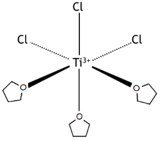
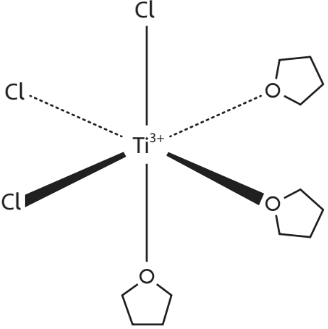
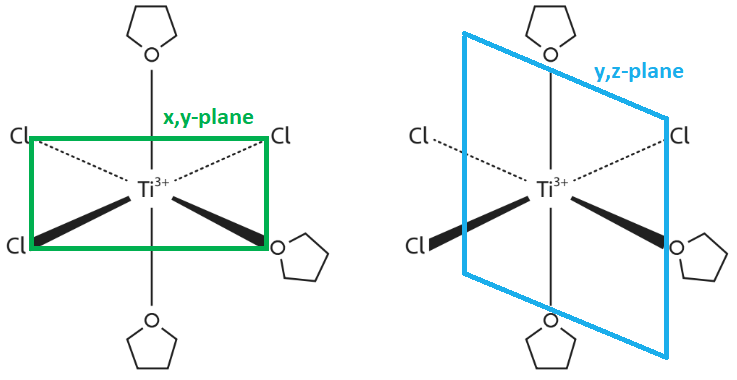
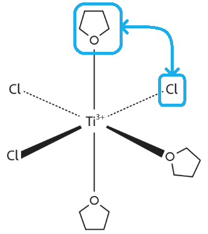
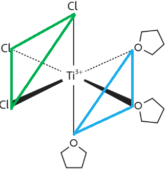
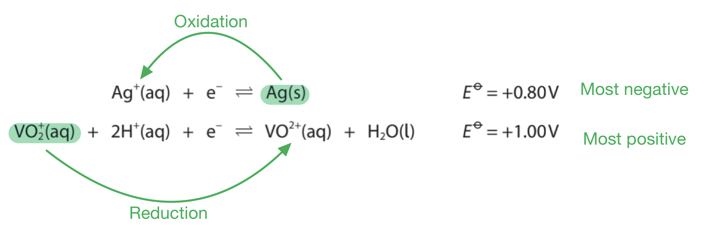
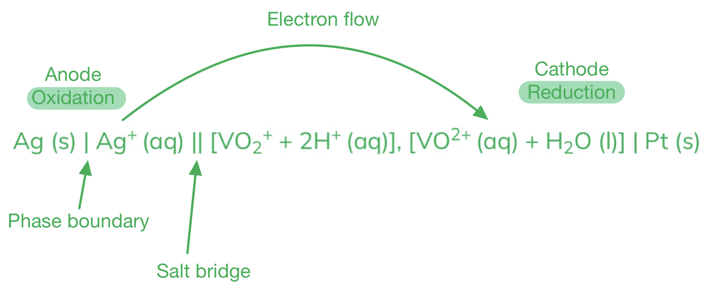

# Mark Schemes — Redox Equilibria
**5. Transition Metals & Organic Nitrogen Chemistry** · Edexcel International A Level (IAL) Chemistry (YCH11)

## Q1 — medium — 5 marks · structured-questions

### 21((a)) — 2 marks
To deduce the formulae of the ions responsible for the colours of **F** and **G**:

- Equation relating* E*θcell to half-cell values
**AND**
Determination of* E*θ for the right-hand electrode
*E*θcell = *E*θR − *E*θL
1.94 = *E*θR − (−0.61)
*E*θR = 1.94 − 0.61= (+)1.33 (V); **[1 mark] **
- Identification of** F** and **G**
**F** = Cr2O72−
**AND**
**G** = Cr3+; **[1 mark] **

**Final answer:** **[Total: 2 marks] **

- *E**θ**cell** = **E**θ**Right hand side**  − **E**θ**Left hand side *
- *Double-check the information from the data booklet as it is easy to use or identify the wrong one*
- *To gain the second mark you can give*

  - *(+)1.33 (V) with some working which relates 1.33 to 1.94 and −0.61*
  - *(+)1.33 (V) with the Cr**2**O**7**2−** / Cr**3+** half equation*
- *You need to use your knowledge of the oxidation of alcohols to help you answer this question*

  - *You know that acidified potassium dichromate turns from orange to green during this type of reaction*
  - *In the question, it tells you that F is the orange (Cr**2**O**7**2−**) and G is green (Cr**3+**)*

### 21((b)) — 2 marks
The overall equation for the reaction in the cell is:

3C2H5OH + Cr2O72− + 8H+ ⇌ 2Cr3+ + 3CH3CHO + 7H2O

- Correct species on both sides of the equation and no electrons; **[1 mark] **
- Equation balanced;** [1 mark] **

**[Total: 2 marks] **

- *To work out the full equation, you need to combine both half equations*

  - *C**2**H**5**OH ⇌  CH**3**CHO + 2H**+** + 2e**-** (multiply by 3 to balance electrons)*
  - *Cr**2**O**7**2−** + 14H**+** + 6e**-** ⇌ 2Cr**3+** + 7H**2**O*
- *Overall:*

  - *3C**2**H**5**OH  + 14H**+** + 6e**-** ⇌ 3CH**3**CHO  + 6H**+** + 6e**-** + 2Cr**3+** + 7H**2**O*
- *Cancel out electrons and hydrogens*

  - *3C**2**H**5**OH  + 14H**+** + 6e**-** ⇌ 3CH**3**CHO  + 6H**+** + 6e**-** + 2Cr**3+** + 7H**2**O*
  - *3C**2**H**5**OH  + 8H**+** ⇌ 3CH**3**CHO + 2Cr**3+** + 7H**2**O*

### 21((c)) — 1 marks
The ionic equation for the reaction of the aqueous solution of **E** with dilute sulfuric acid

- 2CrO42− + 2H+ ⇌ Cr2O72− + H2O;** [1 mark] **

**Final answer:** **[Total: 1 mark] **

- *You now know that Cr**2**O**7**2− **(dichromate(VI) ion) is formed from the yellow crystalline solid **E** when added to sulfuric acid *
- *The orange dichromate(VI) ion is formed from the yellow chromate ion CrO**4**2− *
- *Chromate(IV) ions are more stable in an alkaline solution*

  - *However, in acidic conditions, the dichromate(VI) ion is more stable*
- *The addition of acid will  push the equilibrium to the dichromate(VI) ion*

  - *This results in a colour change from yellow to orange*

## Q2 — hard — 21 marks · structured-questions

### 18((a)) — 8 marks
i) The ionic equation for the disproportionation of manganate(VI) ions, $\mathrm{MnO}_{4}^{2-}$, in **acidic** conditions is:

- Selection of the correct half-equations from the table:
[1] MnO4− + e− ⇌ MnO42−
**AND** [7] MnO42− + 4H+ + 2e− ⇌ MnO2 + 2H2O; **[1 mark]**
- Writing the balanced equation:
3MnO42− + 4H+ ⇌ 2MnO4− + MnO2 + 2H2O; **[1 mark]**

ii) Calculating `E subscript cell superscript ⦵` for the disproportionation of manganate(VI) ions in **acidic **condition and whether or not the reaction is thermodynamically feasible:

- `begin mathsize 14px style E subscript cell superscript ⦵ end style` = 2.26 − 0.56; **[1 mark]**
- = (+)1.70 (V)
**AND**
(Positive so reaction is) feasible; **[1 mark]**

iii) Assessing the thermodynamic feasibility of preparing manganate(VI) by reacting manganate(VII) and manganese(IV) oxide in **alkaline** conditions:

For marking points 1 and 2:    
**EITHER**

- 2MnO4− + MnO2 + 4OH− ⇌ 3MnO42− + 2H2O; **[1 mark]**
- `begin mathsize 14px style E subscript cell superscript ⦵ end style` = 0.56 − 0.59 = -0.03 (V); **[1 mark]**
**OR**
- Clearly identifies half-equations 1 and 2 from the table; **[1 mark]**
- Use of the anticlockwise rule or similar to show that the required reaction is not favoured, e.g. desired reaction moves ‘clockwise’ so not (thermodynamically) feasible; **[1 mark]** 
**OR**
 `begin mathsize 14px style E subscript cell superscript ⦵ end style` = 0.56 − 0.59 = -0.03 (V); **[1 mark]**

**For marking points 3 and 4:**

- (-) 0.03 V / `begin mathsize 14px style E subscript cell superscript ⦵ end style`is (very) small 
**OR**
The equilibrium has significant concentrations of reactants and products; **[1 mark]**
- The reaction may be shifted in the required direction using concentrated alkali / increasing alkaline concentration; **[1 mark]**

**[Total: 8 marks]**

- *In part (i)*

  - *As it refers to the disproportionation of manganate(VI) ions, MnO**4**2-**, the two half-equation selected need to both contain MnO**4**2-*
  - *Manganate(VI) ions need to both oxidise and reduce, this occurs in acidic conditions, so H+ ions also need to be present*
  - *So you need to select a half-equation containing MnO**4**2- **and H**+** on the left-hand side that has a more positive electrode potential than a half-equation that has MnO**4**2- **on the right-hand side. i.e. half-equations 1 and 7*
  - *As equation 7 has the more positive electrode potential, the forward reaction will occur and manganate(VI) ions are reduced:*
  
    - *MnO**4**2−** + 4H**+ **+ 2e**− **⇌ MnO**2 **+ 2H**2**O*
  - *As equation 1 has the less positive electrode potential, the reverse reaction will occur and manganate(VI) ions are oxidised:*
  
    - *MnO**4**2−  **⇌ MnO**4**−** + e**−*
  - *If you gave the correct but unbalanced ionic equation, you would score 1 mark*
  
    - *Remember**: To balance, when combining the two half-equations, the number of electrons needs to be the same, so multiply the equations as necessary to ensure the electrons are equal*
    - *In this case, multiply the reverse of equation 1 by 2 before combining*
  - *You would have been awarded the 2 marks if you had selected equations 1 and 5 and given the full balanced equation as:*
  
    - *5MnO**4**2−** + 8H**+ **⇌ 4MnO**4**−** + Mn**2+** + 4H**2**O*
  - *Use of alkaline half-equations to give 3MnO**4**2−** + 2H**2**O ⇌ 2MnO**4**−** + MnO**2** + 4OH**−** scores 1 mark*
- *In part (ii)*

  - `E subscript cell superscript ⦵ space equals space E subscript reduction superscript ⦵ space minus space E subscript oxidation superscript ⦵`* = +2.26 - (+0.56) = +1.70 V*
  - *You would gain these two marks if:*
  
    - *You used equations 1 and 5 and gave *`E subscript cell superscript ⦵`* = +1.51 - (+0.56) = +0.95 V and stated that the reaction was feasible*
    - *You used the alkaline half-equations and gave *`E subscript cell superscript ⦵`* = +0.59 − (+)0.56 = +0.03 V and stated that the reaction was feasible*
  - *You would gain one mark for a correct value for the cell potential, without a comment on the feasibility*
- *In part (iii)*

  - *Half-equations 1 and 2 are the appropriate equations to select as they include all the necessary ions and OH**-** ions needed for alkaline conditions*
  - *In order to prepare manganate(VI) ions, the forward reaction of equation 1 and the reverse of equation 2 needs to occur*
  - *This is not thermodynamically feasible as this would give a negative cell potential*
  - *By increasing the concentration of OH**-** ions, the reverse reaction in equation 2 is favoured, causing its electrode potential to become less positive*
  - *This would then cause the cell potential to become positive and therefore feasible*

### 18((b)) — 9 marks
i) The colour change at the end-point of the titration is:

- Colourless
**AND**
To pale pink; **[1 mark]**

ii) The percentage of iron in the steel wire is:

- **Calculation of moles of manganate(VII) in 27.35 cm****3****:** 27.35 x 0.0195 x 10−3  = 5.33325 x 10−4 / 0.000533325 (mol); **[1 mark]**
- **Use of 1:5 ratio to calculate mol Fe****2+**** in 25.0 cm****3****:** 5 x 5.33325 x 10−4 = 2.666625 x 10−3 / 0.002666625 (mol); **[1 mark]**
- **Scaling to 250.0 cm****3**** to give mol Fe****2+**** in 250.0 cm****3****:** 10 x 2.666625 x 10−3 = 2.666625 x 10−2 / 0.02666625 mol); **[1 mark]**
- **Conversion of mol to g of iron**:  2.666625 x 10−2 x 55.8 = 1.48798 (g); **[1 mark]**
- **Calculation of percentage of iron in the wire:** $\frac{1.48798}{1.53}\times100$ = 97.25338 **AND** **Give the final value to 3 SF:** = 97.3%; **[1 mark]**

iii) The titre value would be affected by the student’s error by:

- The brown suspension formed is manganese(IV) oxide / MnO2; **[1 mark]**
- Mn(VII) to Mn(II) provides 5 electrons per MnO4− but Mn(VII) to Mn(IV) only provides 3 electrons; **[1 mark]**
- So more MnO4− is needed / titre is greater; **[1 mark]**

**[Total: 9 marks]**

- *The titration involves titrating a solution of Fe**2+** against manganate(VII) ions*
- *A solution of Fe**2+** may appear pale green, and this would be accepted instead of colourless (not just green)*
- *The end point is when the Fe**2+** have all reacted and a pale tinge appears due to the excess manganate(VII) ions*

  - *Careful**: Despite the purple / magenta colour of a solution of manganate(VII), this is not accepted as the colour change, as this would mean too much manganate(VII) solution had been added and the end point would have been surpassed*
- *When performing these types of redox titration calculations, as with any titration calculations, you must use the molar ratios to help calculate the number of moles of each reactant*

  - *Careful**: Only 25.0 cm**3** of the original 250 cm**3** solution is used in the titration, therefore in the original 250 cm**3** solution, there would have been 10 times the number of Fe**2+** moles that there were in the 25.0 cm**3** solution used in the titration*
- *In part (iii), as the solution is made up of distilled water as opposed to sulfuric acid, equation 6 occurs instead of equation 5 as fewer hydrogen ions are present, producing MnO2 which is the brown precipitate*

  - *The full ionic equation for the reaction with Fe**2+** ions is:*
  
    - *MnO**4**-** + 4H**+** + 3Fe**2+** → MnO**2** + 3Fe**3+*
  - *Compared with the full ionic equation for the formation of Mn2+:*
  
    - *MnO**4**-** + 5H**+** + 5Fe**2+** → Mn**2+** + 4H**2**O + 5Fe**3+*
  - *This means that more MnO**4**-** is required to react with Fe**2+** when MnO**2** is produced*
  - *For the second marking point, you could explain in terms of oxidation numbers*
  - *If no other mark is scored, one mark is allowed for the titration is no longer quantitative as another reaction is (also) taking place*

### 18((c)) — 4 marks
i) The completed table:

| **Apparatus** | **Value measured** | **Uncertainty on each** **reading** | **Percentage uncertainty on** **value measured / %** |
|---|---|---|---|
| Balance | 1.53 g | ±0.005 g | 0.65 |
| Burette | 27.35 cm3 | ±0.05 cm3 | `equals space fraction numerator 2 space cross times space 0.05 over denominator 27.35 end fraction space cross times space 100 space equals space 0.37 open parentheses percent sign close parentheses` |
| Pipette | 25.0 cm3 | ±0.06 cm3 | `equals space fraction numerator 0.06 over denominator 25.0 end fraction space cross times space 100 space equals space 0.24 open parentheses percent sign close parentheses` |
| Volumetric flask | 250.0 cm3 | ±0.3 cm3 | `equals space fraction numerator 0.03 over denominator 250.0 end fraction space cross times space 100 space equals space 0.12 open parentheses percent sign close parentheses` |

- All three percentages correct; **[2 marks]**
- Any two percentages correct; **[1 mark]**

ii) To state and justify whether or not this student has given their answer to an appropriate number of significant figures:

- The total percentage uncertainty is (approximately) 1.38%; **[1 mark]**
- Because the total percentage uncertainty is much bigger than 0.863, the answer should be to no more than 2 / 3 SF; **[1 mark]**

**[Total: 4 marks]**

- *When calculating the percentage uncertainty, don't forget to take into account the number of times the piece of apparatus is used to take a measurement*
- *When reading from a burette, the initial and final volumes are measured to be able to calculate the volume used*
- *The uncertainty associated with each reading must, therefore, be multiplied by 2*
- *To calculate the total percentage uncertainty, add together the percentage uncertainties associated with all of the apparatus*
- *Careful**: Don't forget to include the uncertainty of the balance as well as those that you calculated in part (i)*
- *For the total percentage uncertainty, 1.4% would be accepted*
- *For the second mark, you could have found the percentage of correction of rounding 95.863 to 95.9 = 100 x 0.037 ÷ 95.863 = 0.039 % AND stated that this is negligible compared with 1.38%*

## Q3 — hard — 20 marks · structured-questions

### 20((a)) — 1 marks
The property of transition metals, such as titanium, that makes their **compounds** effective catalysts is:

Any **one **of the following:

- They have a variable oxidation state / number
**OR**
They are (easily) oxidised and reduced (back to their original oxidation state)
**OR**
They (easily) donate and accept electrons (from other molecules / species); **[1 mark]**

**[Total: 1 mark]**

- *The most common answer about the property of a transition metal that makes them effective an catalyst is their variable oxidation state*

### 20((b)) — 3 marks
i) The meaning of the terms **monodentate** and **ligand** are:

- Monodentate = forms a single / one dative (covalent) bond; **[1 mark]**
- Ligand = (a species with a) lone pair (of electrons) that can form a dative (covalent) bond to a (central) metal (ion); **[1 mark]**

ii) The arrangement of the ligands in complex **Z **is:

|  | **OR** |  |
|---|---|---|

- Three adjacent THF / Cl ligands
**AND**
All Cl–Ti3+–Cl bond angles are 90o
**AND**
All THF–Ti3+–THF bond angles are 90o; **[1 mark]**

**[Total: 3 marks]**

- *For transition metal chemistry, you are expected to know the definitions of terms such as:*

  - *Ligand*
  - *Monodentate*
  - *Bidentate*
  - *Multidentate*
- *For the stereoisomer of complex **Y**, you cannot draw the mirror image of complex **Y** as it is superimposable*

  - *You have to recognise that the three chloride ligands are in the same plane (x,y-plane) and that the three THF ligands are in the same plane (y,z-plane)* 
  - *The easiest way to draw the stereoisomer is to pick one chloride ligand and one THF ligand and swap them* 
  - *This results in the three chloride ligands forming one face of the octahedral complex and the three THF ligands forming another face of the octahedral complex* 
  - *Note: **The second model image is not in the same arrangement as the incomplete structure given in the question*
  
    - *While you should really use the incomplete structure given in the question, you do not have to - the examiner has to mark your given answer, even if it is drawn in a different orientation*

### 20((c)) — 16 marks
i) The colour **change** that would be observed at the end‐point of the titration is:

- From yellow to green; **[1 mark]**

ii) To determine the **final** oxidation state of nitrogen in the titration:

- Moles of Ti3+ in the titre = 0.0017595 **OR **1.7595 x 10-3; **[1 mark]**
- Moles of Mg(NO3)2•6H2O in 100 cm3 = 0.0029263 **OR **2.9263 x 10-3; **[1 mark]**
- Moles of NO3– in 10.0 cm3 = 0.00058525 **OR** 5.8525 x 10-4; **[1 mark]**
- Mole ratio of Ti3+ : NO3– = 3 : 1; **[1 mark]**
- Final oxidation state of nitrogen = (+)2; **[1 mark]**

iii) The overall** ionic **equation for the titration reaction using the answer to (c)(ii) is:

3Ti3+ + H2O + NO3- → 3TiO2+ + 2H+ + NO

- Correct selection of NO3– + 4H++ 3e–  ⇌  NO + 2H2O; **[1 mark]**
- Correctly balanced ionic equation; **[1 mark]**

iv) *E*θcell for the overall titration reaction is:

- (+)0.86 (V); **[1 mark]**

v) The contents of the conical flask are heated to:

- Speed up the reaction / increase the rate of reaction
**OR**
Ensure the fast oxidation of Ti3+ 
**OR**
Provide the (required) activation energy / *E*a 
**OR**
Meet the high activation energy / *E*a **OR** because the reaction has a high activation energy / *E*a; **[1 mark]**

vi) Assessment of the teacher's statement, *“As TiCl**3** is blue and TiO**2+** ions are colourless in aqueous solution, the titration can be carried out ****without ****an alizarin indicator.”:*

**Chemical ideas expressed:**

- Identification of the complex ion as [Ti(H2O)6]3+ **OR **[Ti(H2O)5Cl]2+ **OR** [Ti(H2O)4Cl2]+
- Ti3+ has an incomplete / partially filled d-subshell / d-orbital
**OR**
Ti3+ is 1s2 2s2 2p6 3s2 3p6 3d1 (4s0)
**OR**
Ti3+ is 3d1
- There is splitting in the energy of d-subshell / d-orbitals by water / ligands
**OR**
Ligands cause d-d splitting
- There is absorption of light / photon / (electromagnetic) radiation **AND **resulting in electronic transition 
**OR**
There is absorption of light / photon / (electromagnetic) radiation **AND **causing electrons to be promoted from lower to higher energy
**OR**
There is absorption of light / photon / (electromagnetic) radiation **AND **causing d-d transitions
- The observed colour of the complex ion is due to reflected / transmitted light
**OR**
The observed colour of the complex ion is due to the wavelengths / frequencies of light that are not absorbed
**OR**
The observed colour of the complex ion is the complementary colour
- There is a clearer colour change at end-point with an indicator
**OR**
The colours at the end-point are more intense / distinct / sharp / strong
**OR**
The concentration (of [Ti(H2O)6]3+ / TiCl3) is too low to accurately determine the end-point without an indicator

**[6 marks] **

- *An answer scoring** 6** marks would include*

  - *6 correct marking points **AND **the answer is written in a clear and logical order with points fully explained *
- *An answer scoring** 5** marks would include*

  - *5-4 correct marking points **AND **the answer is written in a clear and logical order with points fully explained *
- *An answer scoring** 4** marks would include*

  - *4-3 correct marking points **AND **the answer has some structure and gives some explained points*
- *An answer scoring **3** marks would include*

  - *3-2 correct marking points **AND **the answer has some structure and gives some explained points*

**[Total: 16 marks]**

- *For part (i)*

  - *As the titration proceeds, Ti**3+** is added but it is converted to TiO**2+** maintaining a yellow colour in the alizarin indicator*
  - *At the end-point, there is a small excess resulting in the colour change from yellow to green in the alizarin indicator*
- *For part (ii)*

  - *The moles of Ti**3+** in the titre can be calculated directly from the information given in the question *$0.085\times\frac{20.70}{1000}$* = 0.0017595 **OR **1.7595 x 10**-3** *
  - *The moles of Mg(NO**3**)**2**•6H**2**O in 100 cm**3** are calculated using the equation, moles = *$\frac{\mathrm{mass}}{M_{r}}$* Moles = *$\frac{0.75}{256.3}$* = 0.0029263 **OR **2.9263 x 10**-3** *
  - *The Mg(NO**3**)**2**•6H**2**O releases 2 moles of NO**3**– **Moles of NO**3**–** = 0.0029263 x 2 = 0.0058525 **OR** 5.8525 x 10**-3** but this is in 100 cm**3**  So, the moles of NO**3**–** in 10.0 cm**3** = *$\frac{0.0058525}{10}$* = 0.00058525 **OR** 5.8525 x 10**-4** *
  - *This leads to a mole ratio of Ti**3+** : NO**3**–** = 0.0017595 : 0.00058525 which gives a whole number ratio of 3 : 1*
  - *Using the Ti**3+** + H**2**O → TiO**2+** + 2H**+**+ e**–** question, each Ti**3+** releases one electron Combining this with the mole ratio means that 3 electrons are released for every 1 nitrate ion*
  - *The oxidation state of nitrogen in the original nitrate ion is +5 Gaining 3 electrons from Ti**3+** results in a change in the oxidation state of the nitrogen from +5 to the final oxidation state of (+)2*
- *For part (iii)*

  - *During the titration, the Ti**3+** is converted to TiO**2+** which is the first half-equation reversed Ti**3+** + H**2**O *$\rightleftharpoons$* TiO**2+** + 2H**+** + e**–** *
  - *The only half-equation with nitrogen in the +2 oxidation state is NO**3**– **+ 4H**+**+ 3e**–**  ⇌  NO + 2H**2**O*
  - *Before they can be combined the Ti**3+** equation needs to be tripled to match the number of electrons in the NO**3**–** equation 3Ti**3+** + 3H**2**O *$\rightleftharpoons$* 3TiO**2+** + 6H**+** + 3e**–** *
  - *The equations can then be combined and simplified (by appropriate cancelling) to give 3Ti**3+** + H**2**O + NO**3**-** → 3TiO**2+** + 2H**+** + NO*
- *For part (iv)*

  - *E**θ**cell** = **E**reduction** - **E** oxidation** = (+0.96) - (+0.10) = (+)0.86 V*
- *For part (v)*

  - *The most common correct answer for this part was to increase the rate of reaction / speed up the reaction*

## Q4 — hard — 15 marks · structured-questions

### 1() — 1 marks
> **[mark-scheme]**
> The species oxidised in this cell is:
> 
> - Vanadium(IV) ions / VO2+
> **OR**
> Vanadium in the +4 oxidation state **[1 mark]**

> **[exam-tip]**
> The species with the less positive *E*° value gets oxidised, acting as the reducing agent:
> 
> - VO2+ at +1.00 V is oxidised at the anode.
> - Ce4+ at +1.70 V is reduced at the cathode.
> 
> A quick rule: the species on the left-hand side of the more positive half-equation is always the oxidising agent.

### 2() — 1 marks
> **[mark-scheme]**
> The half-equation for the reaction at the negative electrode is:
> 
> - VO2+ (aq) + H2O (l) → VO2+ (aq) + 2H+ (aq) + e- **[1 mark]**
> 
> Accept equilibrium arrows.

> **[exam-tip]**
> The negative electrode is the anode, where oxidation occurs. Write the VO2+/VO2+ half-equation in the forward direction (as oxidation, not reduction).
> 
> H2O and H+ must both be included and correctly balanced. Omitting either one loses the mark.

### 3() — 1 marks
To calculate the standard cell potential:

- Identify the reduction and oxidation half-cells:

  - Cathode (Ce4+/Ce3+): *E*° = +1.70 V
  - Anode (VO2+/VO2+): *E*° = +1.00 V
- Apply the equation:

*E*°cell = *E*°cathode − *E*°anode

*E*°cell = (+1.70) - (+1.00)

*E*°cell = **+0.70 V ****[1 mark]**

> **[exam-tip]**
> Always use *E*°cell = *E*°cathode − *E*°anode (both as reduction potentials). Do not add the two values.
> 
> A positive *E*°cell confirms the reaction is spontaneous under standard conditions.

### 4() — 2 marks
To write the overall ionic equation:

- Write the reduction equation:

Ce4+ (aq) + e- ⇌ Ce3+ (aq)

- Reverse the other equation for oxidation:

VO2+ (aq) + H2O (l) ⇌ VO2+ (aq) + 2H+ (aq) + e-

- Combine the equations:

  - Balance for H+ (aq), H2O and e- if necessary

Ce4+ (aq) + VO2+ (aq) + H2O (l) → Ce3+ (aq) + VO2+ (aq) + 2H+ (aq)

**[2 marks]**

> **[mark-scheme]**
> 1 mark for correct reactants and products (Ce4+, VO2+, Ce3+, VO2+)
> 
> 1 mark for correct balancing, including 2H+ (aq) and H2O (l)

> **[exam-tip]**
> Do not cancel or omit H2O or H+ from the equation. Both are genuine products/reactants and their absence loses the balancing mark.

### 5() — 2 marks
> **[mark-scheme]**
> Platinum electrodes are needed because:
> 
> - All species in both half-cells are ions in solution / there is no solid metal present to act as an electrode **[1 mark]**
> - Platinum is an inert electrical conductor that does not react with any species in either half-cell
> **OR**
> Platinum conducts electrons without participating in or interfering with the cell reactions **[1 mark]**

> **[exam-tip]**
> A metal electrode (for example, a zinc rod) is used when the metal itself appears in the half-equation (for example, Zn2+/Zn).
> 
> When both species are aqueous ions with no solid metal present, an inert electrode is needed to make electrical contact.
> 
> Platinum and graphite are both acceptable inert electrode materials.

### 6() — 2 marks
> **[mark-scheme]**
> The purpose of the salt bridge is to:
> 
> - Allow ions to flow between the two half-cell solutions / complete the circuit by allowing ion migration **[1 mark]**
> - Maintain electrical neutrality in each half-cell / prevent charge build-up that would stop current flowing **[1 mark]**

> **[exam-tip]**
> The salt bridge carries ions, not electrons. Electrons flow through the external wire from the anode to the cathode.
> 
> Without the salt bridge, charge would accumulate in each half-cell (one becoming positive, one negative) and the cell would quickly stop working.

### 7() — 3 marks
To calculate the concentration of VO2+:

- List the known quantities:

  - *c*(Ce4+) = 0.100 mol dm-3
  - *V*(Ce4+) = 24.00 cm3 = 0.02400 dm3
  - *V*(VO2+) = 25.00 cm3 = 0.02500 dm3
- Calculate moles of Ce4+:

moles = concentration x volume (dm3)

moles of Ce4+ = 0.100 × 0.02400

moles of Ce4+ = 2.40 × 10-3 mol **[1 mark]**

- Use the 1:1 molar ratio from the overall equation:

moles of VO2+ = 2.40 × 10-3 mol **[1 mark]**

- Calculate concentration:

concentration = `fraction numerator moles over denominator volume space open parentheses dm cubed close parentheses end fraction`

concentration of VO2+ = $\frac{2.40\times10^{-3}}{0.02500}$

concentration of VO2+ = **0.0960 mol dm****-3** **[1 mark]**

> **[exam-tip]**
> The 1:1 molar ratio comes directly from the overall ionic equation in part (d). Always state it explicitly, as it earns a method mark and prevents errors in the next step.
> 
> Convert cm3 to dm3 by dividing by 1000 before any calculation.

### 8() — 3 marks
To calculate the percentage by mass of vanadium:

- Scale up to find the total moles of V in the 250 cm3 volumetric flask:

moles = concentration x volume (dm3)

total moles of V = 0.0960 × 0.250

total moles of V = 0.0240 mol **[1 mark]**

- Calculate the mass of vanadium:

mass = moles x *A*r

mass of V = 0.0240 × 50.9

mass of V = 1.2216 g **[1 mark]**

- Calculate the percentage by mass:

percentage by mass of V = $\frac{\mathrm{mass} \mathrm{of}V\mathrm{in} \mathrm{the} \mathrm{sample}}{\mathrm{total} \mathrm{mass} \mathrm{of} \mathrm{the} \mathrm{sample}}$ x 100

percentage by mass of V = $\frac{1.2216}{1.50}$ x 100

percentage by mass of V = **81.4%** **[1 mark]**

> **[mark-scheme]**
> 1 mark for correct total moles of V (0.0240 mol)
> 
> 1 mark for correct mass of vanadium (1.2216 g)
> 
> 1 mark for correct percentage (81.4% or 81.44%)
> 
> Values are accepted written normally (0.0240) or in standard form (2.40 × 10-2 mol)
> 
> Allow error carried forward from an incorrect concentration in (g) or an incorrect mass

> **[exam-tip]**
> The 25.00 cm3 aliquot is 1/10 of the 250 cm3 flask. Multiply concentration × 0.250 dm3 (the full flask volume) to get the total moles of vanadium. Using 0.0250 dm3 instead gives a mass ten times too small and loses the first marking point.
> 
> Use the *A*r of vanadium only (50.9) for the second marking point. Using the *M*r of VO2+ (67) instead gives a mass that is too high.

## Q5 — easy — 1 marks · multiple-choice-questions

### 2() — 1 marks
**Correct answer: A** — to increase the rate of the equilibrium between the hydrogen gas and the hydrogen ions

**Final answer:** **The correct answer is ****A**** because: **

- The coating of finely divided platinum black increases the surface area of the electrode
- Consequently, this increases the rate of equilibrium between the hydrogen gas and hydrogen ions

**B** is incorrect as platinum black is chemically identical to shiny platinum

**C **is incorrect as** ** platinum black has the same electrical conductivity as shiny platinum

**D **is incorrect as  platinum black does not affect the conditions of the system

## Q6 — medium — 4 marks · multiple-choice-questions

### 1((a)) — 1 marks
**Correct answer: D** — 

**Final answer:** **The correct answer is ****D**** because:**

- The half-cells both contain ions that are in different oxidation states

  - This means that inert platinum electrodes will be needed

**A**, **B** and **C** are incorrect as both electrodes should be made of platinum

### 1((b)) — 1 marks
**Correct answer: C** — 1.00 mol dm–3 HCl (aq)

**Final answer:** **The correct answer is ****C**** because:**

- The standard hydrogen electrode operates under standard conditions

  - This means that solution 1 has to be 1.00 mol dm-3
  - A 1.00 mol dm-3 solution of HCl will fully ionise to give 1.00 mol dm-3 of H+ ions

**A**, **B** and **D** are incorrect as  these acids do not fully ionise which means that they do not give 1.00 mol dm-3 of H+ ions

### 1((c)) — 1 marks
**Correct answer: B** — 17.91 g

**Final answer:** **The correct answer is ****B**** because: **

- The number of moles of potassium dichromate is $\frac{14.71}{294.2}$ = 0.05
- In a standard solution, there should be 1 mol dm-3 of both Cr2O72- and Cr3+
- This means that there should also be 0.05 moles of Cr3+ (as the volume is the same)
- One mols of Cr2(SO4)3⋅18H2O gives 2 moles of Cr3+
- Therefore, $\frac{0.05}{2}$ = 0.025 moles of Cr2(SO4)3⋅18H2O are needed
- Mass = 0.025 x 716.3 = 17.91 g

**A**, **C** and **D** are incorrect as incorrect ratios of Cr2(SO4)3⋅18H2O to Cr3+ are used

### 1((d)) — 1 marks
**Correct answer: A** — H2SO4

**Final answer:** **The correct answer is ****A**** because: **

- The dichromate ion is strongly oxidising
- However, it is not capable of oxidising sulfate ions
- So, sulfuric is always used to acidify dichromate solutions.

**B** is incorrect as chloride ions could be oxidised

**C **is incorrect as** **bromide ions would be oxidised

**D **is incorrect as** ** this would introduce additional chromium species into the mixture

## Q7 — medium — 2 marks · multiple-choice-questions

### 2((a)) — 1 marks
**Correct answer: C** — H2 (g) → 2H+ (aq) + 2e−

**Final answer:** **The correct answer is ****C**** because:**

- The reaction H2 (g) → 2H+ (aq) + 2e− is an oxidation as electrons have been lost
- Oxidation takes place at the anode in a fuel cell

  - You can remember this by thinking of 'An Ox'
  - Reduction always takes place at the cathode - you can remember this by thinking of a 'Red Cat'
- H2O (l) → 1⁄2O2 (g) + 2H+ (aq) + 2e− is also oxidation, though this is the reverse reaction that occurs at the cathode

  - 1⁄2O2 (g) +  2H+ (aq) +  2e– →  H2O (l) takes place at the cathode

**A** is incorrect as  this is the reaction at the cathode

**B** is incorrect as this is the reverse of the reaction at the cathode

**D** is incorrect as this is the reverse of the reaction at the anode

### 2((b)) — 1 marks
**Correct answer: B** — emissions do not contribute to climate change

**Final answer:** **The correct answer is ****B**** because: **

- The emissions do not contribute to climate change as water is the only reaction product
- Methanol can be made from a renewable resources

  - Renewable methanol is a low carbon and net carbon neutral liquid chemical and fuel produced from sustainable biomass, often called bio-methanol

**A** is incorrect as  methanol produces more energy per mole

**C** is incorrect as  the hydrogen gas is more difficult to store

**D** is incorrect as both can be made from renewable resources

## Q8 — medium — 1 marks · multiple-choice-questions

### 2() — 1 marks
**Correct answer: C** — Pt | Fe2+, Fe3+ || [MnO4– + 8H+], [Mn2+ + 4H2O] | Pt

**Final answer:** **The correct answer is ****C**** because:**

- This is a reaction that contains ions that are in different oxidation states

  - This means that inert platinum electrodes will be needed
- The reaction starts with MnO4– + 8H+ and produces Mn2+ + 4H2O

  - This means that MnO4– + 8H+ should be first in the right-hand cell followed by Mn2+ + 4H2O

**A** and **B** are incorrect as  both electrodes should be made of platinum

**D** is incorrect as the manganese species are the wrong way around in the right-hand cell

## Q9 — medium — 3 marks · multiple-choice-questions

### 2((a)) — 1 marks
**Correct answer: B** — −1.63V

**Final answer:** **The correct answer is ****B**** because:**

- The standard cell potential is calculated by:

  - `E subscript cell superscript ⦵ space equals space E subscript reduction superscript ⦵ space minus space E subscript oxidation superscript ⦵`
- The electrode system Fe3+/Fe2+ undergoes reduction as it is gaining electrons:

  - Fe3+ + e- → Fe2+
  - Therefore, `E subscript reduction superscript ⦵` = +0.77 V
- The electrode system Ti2+/Ti undergoes oxidation as it gains elections:

  - Ti2+ + 2e- → Ti
  - Therefore, the standard electrode potential for this system is `E subscript oxidation superscript ⦵`
- Substituting values into the equation for standard cell potential:

  - +2.40 = +0.77 - `E subscript oxidation superscript ⦵`
  - Therefore `E subscript oxidation superscript ⦵` = +0.77 - 2.40 =** -1.63 V**

**A** is incorrect as the electrode potential for the Fe3+/ Fe2+ electrode system has been added to the Eo cell value instead of being subtracted

**C** is incorrect as  the value should have a negative sign

**D** is incorrect as the value should have a negative sign and the electrode potential for the Fe3+/ Fe2+electrode system has been added to the `E subscript cell superscript ⦵` value instead of being subtracted

### 2((b)) — 1 marks
**Correct answer: C** — 

**Final answer:** **The correct answer is ****C**** because:**

- the Fe3+/Fe2+ electrode system is an ion/ion system so will require an inert electrode, such as platinum, to transport electrons
- The Ti2+/Ti electrode system is a metal/metal ion system and the metal, Ti, is able to transport electrons, so is used as the electrode

**A** is incorrect as the Fe3+/Fe2+ electrode system requires a platinum electrode

**B** is incorrect as  the Fe3+/Fe2+ electrode system requires a platinum electrode and the Ti2+/Ti electrode system requires a titanium electrode.

**D** is incorrect as  the Ti2+/Ti electrode system requires a titanium electrode.

### 2((c)) — 1 marks
**Correct answer: C** — 

**Final answer:** **The correct answer is ****C**** because:**

- For the mixture to be standard, the cell solution must be 1 mol dm-3 with respect to both Fe2+ and Fe3+
- Equal volumes of each solution are added
- For ease, assume that 0.5 dm3 of each solution are added so that the final solution has a volume of 1 dm3
- This needs to contain 1 mol of Fe2+ and 1 mol of Fe3+

  - 1 mol of FeSO4 provides 1 mol of Fe2+
  
    - Therefore, the 0.5 dm3 of the FeSO4 solution needs to contain 1 mol of FeSO4 
    - Its concentration must be 1 ÷ 0.5 = 2 mol dm-3
  - 1 mol of Fe2(SO4)3 provides 2 mol of Fe3+
  
    - Therefore, the 0.5 dm3 of the Fe2(SO4)3  solution needs to contain 0.5 mol of Fe2(SO4)3 
    - Its concentration must be 0.5 ÷ 0.5 = 1 mol dm-3

**A**,** B** & **D **are incorrect as the cell solution must be 1 mol dm−3 with respect to both Fe2+ and Fe3+ therefore the dilution on mixing and the two Fe3+ ions in each iron(III) sulfate must be taken into account

## Q10 — medium — 2 marks · multiple-choice-questions

### 3((a)) — 1 marks
**Correct answer: C** — Fe(s) | Fe2+(aq) || Sn2+(aq) | Sn(s)

**Final answer:** **The correct answer is ****C**** because: **

- Fe (s) + Sn2+ (aq) → Fe2+ (aq) + Sn (s)
- From the equation, the iron / Fe (s) is being oxidised and the tin(II) ion / Sn2+ is being reduced

  - Fe (s) → Fe2+ (aq) + 2e–
  - Sn2+ (aq) + 2e– → Sn (s)
- Both half-equations involve a metal-metal ion system so there is no need for inert platinum electrodes
- The oxidation reaction is always on the left-hand side of the cell diagram and the reduction reaction is always on the right-hand side of the diagram

  - The electron flow is: Fe (s) → Fe2+ (aq) → Sn2+ (aq) + Sn (s)
  - The electron flow also shows how the cell diagram should be presented with the addition of phase boundaries and the salt bridge Fe (s) | Fe2+ (aq) || Sn2+ (aq) | Sn (s)

**A** is incorrect as the oxidised part of Sn (s) | Sn2+ (aq) should be next to the cell junction

**B **is incorrect as** ** the oxidised part of Fe (s) | Fe2+ (aq) should be next to the cell junction

**D **is incorrect as** ** the oxidised part of both half-cells should be next to the cell junction

### 3((b)) — 1 marks
**Correct answer: B** — −0.14 V

**Final answer:** **The correct answer is ****B**** because: **

- The Fe / Fe2+ is the oxidation reaction, with a value of –0.44 V
- *E*θcell = +0.30 V
- *E*θcell = *E*θreduction – *E*θoxidation  (+0.30) = *E*θreduction – (–0.44) *E*θreduction = (+0.30) + (–0.44) *E*θreduction = –0.14 V

**A** is incorrect as the *E*θcell value has been subtracted from the electrode potential of the Fe  /Fe2+ electrode system rather than added.

**C **is incorrect as  the sign has been reversed.

**D **is incorrect as** ** the *E*θcell value has been subtracted from the electrode potential of the Fe / Fe2+ electrode system rather than added **AND **the sign has been reversed.

## Q11 — medium — 1 marks · multiple-choice-questions

### 4() — 1 marks
**Correct answer: D** — H2 (g) + 2OH− (aq) → 2H2O (l) + 2e−

**Final answer:** **The correct answer is ****D**** because: **

- The overall equation for an alkaline hydrogen-oxygen fuel cell is 2H2 (g) + O2 (g)  →   2H2O (l)
- This can also be written as  2H2 (g) + 4OH– (aq) + O2 (g) +  2H2O   +  4e– →   2H2O (l) +  4e– + 4OH– (aq)
- The half equations, at each electrode, for this reaction are Anode: H2 (g) + 2OH– (aq)  →  2H2O (l) +  2e– Cathode: O2 (g) +  2H2O  +  4e– →  4OH– (aq)

**A** is incorrect as this is the cathode reaction

**B **is incorrect as** ** this is the reverse of the cathode reaction

**C **is incorrect as** **hydrogen is the fuel and must be oxidised

## Q12 — medium — 1 marks · multiple-choice-questions

### 1() — 1 marks
**Correct answer: B** — Fe3+

**Final answer:** **The correct answer is B**

- The strongest oxidising agent has the **most positive** standard electrode potential, *E*°:

Fe3+ (aq) + e- → Fe2+ (aq) **+0.77 V**

- Oxidising agents are the species that get reduced
- This means that they are the species on the left side of the reduction half-equation

**Fe****3+**** (aq)** + e- → Fe2+ (aq)

**A** is incorrect as Fe2+ is from the right side of the most positive standard electrode potential half-equation. Although the Fe3+/Fe2+ half-equation gives the strongest oxidising agent, Fe2+ is a reducing agent, not an oxidising agent.

**C** is incorrect as Zn is taken from the right side of the most negative standard electrode potential half-equation. Zn is the strongest reducing agent in this list.

**D** is incorrect as Zn2+ is taken from the half-equation with the most negative standard electrode potential, not the most positive.

## Q13 — medium — 1 marks · multiple-choice-questions

### 1() — 1 marks
**Correct answer: B** — MnO4- + 8H+ + 5e- → Mn2+ + 4H2O

**Final answer:** **The correct answer is B**

- Write the unbalanced half-equation:

MnO4- → Mn2+

- Balance Mn:

  - One manganese atom on each side
  - Already balanced

- Balance O:

  - Add 4H2O to the right-hand side:

MnO4- → Mn2+ + **4H****2****O**

- Balance H:

  - Add 8H+ to the left-hand side:

MnO4- + **8H****+** → Mn2+ + 4H2O

- Balance charge:

  - Left side = (−1) + (+8) = +7
  - Right side = +2
  - Add 5e- to the left to balance:

MnO4- + 8H+ + **5e****-** → Mn2+ + 4H2O

**A** is incorrect as using 4H+ and 2H2O does not account for all four oxygen atoms in MnO4-. 4H2O requires 8H+, not 4H+

**C** is incorrect as the mass balance is correct (8H+, 4H2O), but the electron count is wrong. The left-hand side has a net charge of +7 and the right-hand side is +2, so 5 electrons are needed, not 7

**D** is incorrect as the values 14H+ and 7H2O belong to the dichromate(VI) half-equation (Cr2O72- + **14H****+** + 6e- → 2Cr3+ + **7H****2****O**), not manganate(VII). MnO4- has only four oxygen atoms, requiring 4H2O and 8H+

> **[exam-tip]**
> Do not try to recall the numbers in this half-equation from memory.
> 
> If you learn to derive it from scratch (balance O first with H2O, then H with H+, then charge with e-), you will always get it right.
> 
> This method works for any redox half-equation and is far more reliable than rote recall under exam conditions.

## Q14 — hard — 5 marks · multiple-choice-questions

### 3((a)) — 1 marks
**Correct answer: A** — silver nitrate

**Final answer:** **The correct answer is**** A**** because:**

- In order to be an electrolyte, the compound must be soluble
- The only soluble compound in the options is silver nitrate

  - All nitrate salts are soluble

**B** is incorrect as  silver hydroxide is insoluble

**C** is incorrect as  silver chloride is insoluble

**D** is incorrect as  silver carbonate is insoluble

### 3((b)) — 1 marks
**Correct answer: B** — 2 mol dm−3 acidified VO2+ (aq) and 2 mol dm−3 acidified VO2+ (aq)

**Final answer:** **The correct answer is ****B ****because:**

- In order to form the correct electrolyte you need

  - 2 mol dm−3 acidified VO2+ (aq) and 2 mol dm−3 acidified VO2+ (aq) are required
  - This is because if you add equal volumes of each solution, the concentration will halve
  - This results in the 1 mol dm−3 of acidified VO2+ (aq) and 1 mol dm−3 acidified VO2+ (aq) that is required to measure the *E*θ cell

**A** is incorrect as  the electrolyte will be 0.5 mol dm −3 with respect to the vanadate ions

**C** is incorrect as the electrolyte does not contain any VO2+ (aq) ions and the concentration with respect to VO2+ ions is 0.5 mol dm –3

**D** is incorrect as  the electrolyte does not contain any VO2+(aq) ions and the concentration with respect to VO2+ ions is 0.5 mol dm −3

### 3((c)) — 1 marks
**Correct answer: B** — $\mathrm{VO}_{2}^{+}(\mathrm{aq})$ + Ag(s) + 2H+(aq) $\rightarrow$VO2+(aq) + Ag+(aq) + H2O(l)

**Final answer:** **The correct answer is ****B**** because:**

- You can use the anticlockwise rule to work this out:

- Place the most negative equation first

  - Draw arrows going anti-clockwise
  - The species at the start of each arrow will be the reactants
  - This will give the reaction that is feasible
- VO2+ (aq) + Ag (s) + 2H+ (aq) → VO2+ (aq) + Ag+ (aq) + H2O (l)

**A** is incorrect as Ag+ cannot oxidise VO2+ (under standard conditions)

**C** is incorrect as  the reaction is not feasible **AND **is unbalanced

**D** is incorrect as  the reaction is not feasible **AND **is unbalanced

### 3((d)) — 1 marks
**Correct answer: C** — +0.20

**Final answer:** **The correct answer is C because:**

- *E*θcell =** ***E*θright - *E**θ*left
- *E*θcell = 1.00 - 0.80 = (+)0.20 V

A is incorrect as the expression *E*θcell = − (*E*θright + *E**θ*left) was used

B is incorrect as the expression *E*θcell = *E*θleft - *E**θ*right was used

D is incorrect as the expression *E*θcell = *E*θright + *E**θ*left was used

### 3((e)) — 1 marks
**Correct answer: B** — Ag(s) | Ag+(aq) || [ `VO subscript 2 superscript plus open parentheses aq close parentheses` + 2H+(aq)] , [VO2+(aq) + H2O(l)] | Pt(s)

**Final answer:** **The correct answer is ****B**** because:**

- The left cell is being oxidised while the right is being reduced
- If there is more than one species in solution, and the species are on different sides of the half-equation, the different species are separated by a comma

A is incorrect as a solid line is used to separate species in the same phase

C is incorrect as the order of species is R-O-R-O and a solid line is used to separate species in the same phase

D is incorrect as the order of species is R-O-R-O

## Q15 — hard — 1 marks · multiple-choice-questions

### 3() — 1 marks
**Correct answer: D** — 2Ag2+ → Ag++ Ag3+

**Final answer:** **The correct answer is ****D**** because:**

- The most positive *E*θ is the reduction reaction
- The most positive *E*θ value of the Ag2+ equations is +1.98 V and is the reaction forming Ag+
- The lowest / least positive *E*θ value of the Ag2+ equations is +1.80 V and will be the reverse reaction, which also forms forming Ag+
- Therefore, this is the feasible disproportionation reaction

**A** is incorrect as  the most positive *E*θ value of the Bk3+ equations is +1.67 V and is the reaction forming Bk3+ which means that this disproportionation reaction will not be feasible

**B **is incorrect as  the most positive *E*θ value of the Cu2+ equations is +2.40 V and is the reaction forming Cu2+ which means that this disproportionation reaction will not be feasible

**C** is incorrect as  the most positive *E*θ value of the Au+ equations is +1.80 V and is the reaction forming Au+ which means that this disproportionation reaction will not be feasible

## Q16 — hard — 1 marks · multiple-choice-questions

### 4() — 1 marks
**Correct answer: A** — the cathode has a more positive potential than the anode

**Final answer:** **The correct answer is ****A**** because:**

- **Careful:** In fuel cells, the positive electrode is the cathode and the negative electrode is the anode
- In the acidic hydrogen-oxygen fuel cell, the electrode potential of the anode is around 0.00 V and the electrode potential of the cathode is around 1.23 V
- In the alkaline hydrogen-oxygen fuel cell, the electrode potential of the anode is around -0.83 V and the electrode potential of the cathode is around 0.40 V
- Both hydrogen-oxygen fuel cells show that the anode potential is more positive

**B** is incorrect as  oxidation always occurs at the anode

**C **is incorrect as oxygen is reduced at the positive electrode

**D** is incorrect as  the overall reaction is the same under both acidic and alkaline conditions

## Q17 — hard — 1 marks · multiple-choice-questions

### 1() — 1 marks
**Correct answer: A** — H2 (g) + 2OH- (aq) → 2H2O (l) + 2e-

**Final answer:** **The correct answer is A**

- At the anode, oxidation occurs

  - H2 loses electrons
- In alkaline conditions, OH- ions are present and water is the product
- Write the unbalanced half-equation:

H2 → H2O

- Balance H:

  - Add 2OH- to the left:

H2 + **2OH****-** → **2H****2****O**

- Balance charge:

  - Left side = −2
  - Right side = 0
  - Add 2e- to the right:

H2 + 2OH- → 2H2O + **2e****-**

**B** is incorrect as this is the cathode half-equation where O2 is reduced. The cathode is where reduction occurs, not the anode.

**C** is incorrect as this is the anode equation for an acidic fuel cell, not an alkaline one. In alkaline conditions H+ ions are not available and OH- is the relevant species.

**D** is incorrect as this is the cathode equation for an acidic fuel cell. It uses H+ ions, which are not present at significant concentration in alkaline conditions.

> **[exam-tip]**
> The most common error is confusing the anode and cathode reactions. Remember:
> 
> - Anode = oxidation (hydrogen loses electrons)
> - Cathode = reduction (oxygen gains electrons).
> 
> In alkaline conditions, always include OH- in the anode equation as H2 reacts with hydroxide ions, not H+. If the question specifies alkaline, any equation with H+ is automatically wrong.
