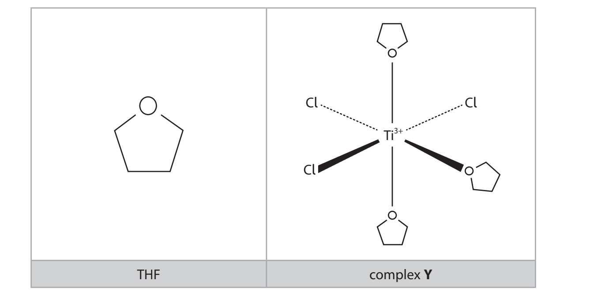
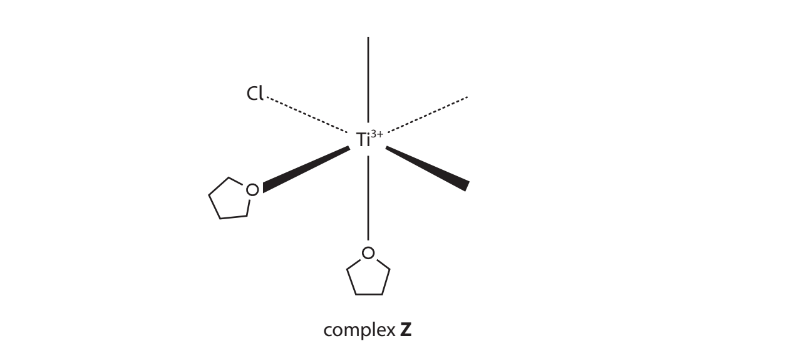
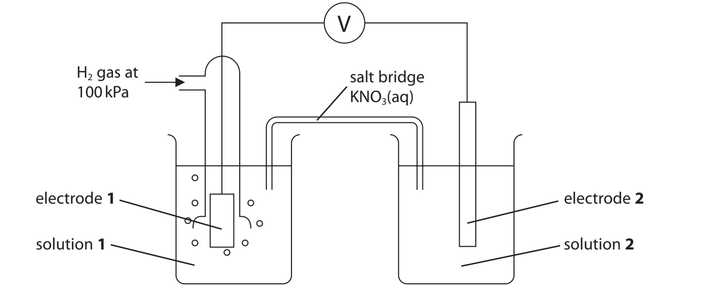
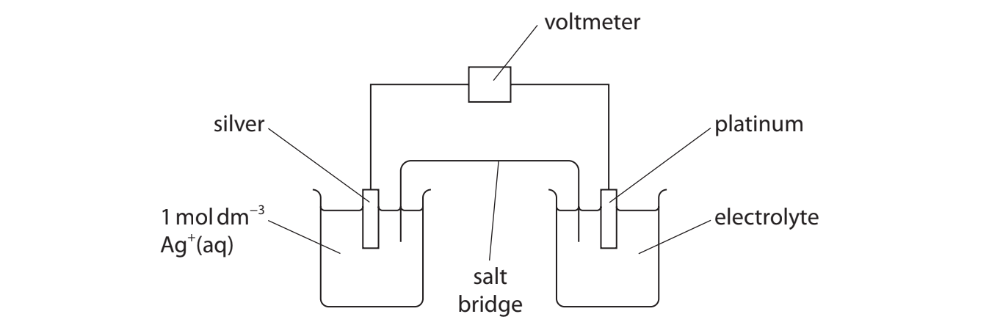

# Exam Questions — Redox Equilibria
**5. Transition Metals & Organic Nitrogen Chemistry** · Edexcel International A Level (IAL) Chemistry (YCH11)
> Source: [https://www.savemyexams.com/international-a-level/chemistry/edexcel/17/topic-questions/5-transition-metals-and-organic-nitrogen-chemistry/5-1-redox-equilibria/structured-questions/](https://www.savemyexams.com/international-a-level/chemistry/edexcel/17/topic-questions/5-transition-metals-and-organic-nitrogen-chemistry/5-1-redox-equilibria/structured-questions/) · 17 questions · total 85 marks

## Q1 — medium — 5 marks · structured-questions

### 21((a)) — 2 marks — command: deduce — structured — from paper Jan 2021 · WCH15/01
A yellow crystalline solid **E** dissolved in distilled water to give a yellow solution.

Addition of dilute sulfuric acid to this solution produced an orange solution **F**.

Warming **F** with ethanol resulted in a green solution **G**, and the formation of ethanol.

A standard cell was set up using solutions of **F** and **G** for the right-hand electrode and ethanol and ethanal for the left-hand electrode.

*E*θcell was found to be +1.94 V.

CH3CHO (aq) + 2H+ (aq) + 2e– $\rightleftharpoons$ C2H5OH (aq)   *E*θ = –0.61 V

Deduce the formulae of the ions responsible for the colours of **F** and **G**, using the standard electrode potential and *E*θ given, and the values in the Data Booklet.

### 21((b)) — 2 marks — command: write — structured — from paper Jan 2021 · WCH15/01
Write the overall equation for the reaction in the cell. State symbols are not required.

### 21((c)) — 1 mark — command: write — structured — from paper Jan 2021 · WCH15/01
Write the ionic equation for the reaction of the aqueous solution of **E** with dilute sulfuric acid. State symbols are not required.

## Q2 — hard — 21 marks · structured-questions

### 18((a)) — 8 marks — command: multiple — structured — from paper June 2021 · WCH15/01
This question is about manganese compounds. Some data are given below.

|   | **Electrode reaction** | `bold italic E to the power of bold ⦵`**/ V** |
|---|---|---|
| 1 | $\mathrm{MnO}_{4}^{-}+e^{-}$⇌ Mn$O_{4}^{2-}$ | +0.56 |
| 2 | $\mathrm{MnO}_{4}^{2-}$ + 2H2O + 2e− ⇌ MnO2 + 4OH− | +0.59 |
| 3 | Fe3+ + e− ⇌ Fe2+ | +0.77 |
| 4 | MnO2 + 4H+ + 2e− ⇌ Mn2+ + 2H2O | +1.23 |
| 5 | $\mathrm{MnO}_{4}^{-}$+ 8H+ + 5e− ⇌ Mn2+ + 4H2O | +1.51 |
| 6 | $\mathrm{MnO}_{4}^{-}$ + 4H+ + 3e− ⇌ MnO2 + 2H2O | +1.70 |
| 7 | $\mathrm{MnO}_{4}^{2-}$+ 4H+ + 2e− ⇌ MnO2 + 2H2O | +2.26 |

i) Write the ionic equation for the disproportionation of manganate(VI) ions, $\mathrm{MnO}_{4}^{2-}$, in **acidic** conditions, using relevant half-equations from the table. State symbols are not required.

**(2)**

ii) Calculate `E subscript cell superscript ⦵` for the disproportionation of manganate(VI) ions in **acidic **conditions, stating whether or not the reaction is thermodynamically feasible.

**(2)**

iii) Using the standard electrode potentials in the table, assess the thermodynamic feasibility of preparing manganate(VI) by reacting manganate(VII) and manganese(IV) oxide in **alkaline** conditions.

**(4)**

### 18((b)) — 9 marks — command: multiple — structured — from paper June 2021 · WCH15/01
Steel is an alloy of iron and carbon. A group of students determined the iron content of a sample of steel wire by a titration method.

A known mass of the wire was dissolved in dilute sulfuric acid and the resulting solution made up to 250.0 cm3 with more dilute sulfuric acid and mixed thoroughly.

Fe + H2SO4 → FeSO4 + H2

25.0 cm3 samples of the resulting solution were titrated with 0.0195 mol dm−3 potassium manganate(VII) solution.

i) State the colour change at the end-point of the titration.

**(1)**

ii) One student used 1.53 g of the wire (weighed directly on the balance pan) and obtained a mean titre of 27.35 cm3 .

Using half-equations 3 and 5 from the table, calculate the percentage of iron in the steel wire. Give your answer to **three** significant figures.

**(5)**

iii) A second student carried out the same experiment but used distilled water to make up the solution in the volumetric flask.
A brown suspension formed during the titration. Explain how, if at all, the titre value would be affected by this student’s error.

**(3)**

### 18((c)) — 4 marks — command: multiple — structured — from paper June 2021 · WCH15/01
The uncertainties of the apparatus used in the experiment in (b) are shown.

| **Apparatus** | **Value measured** | **Uncertainty on each** **reading** | **Percentage uncertainty on** **value measured / %** |
|---|---|---|---|
| Balance | 1.53 g | ±0.005 g | 0.65 |
| Burette | 27.35 cm3 | ±0.05 cm3 |   |
| Pipette | 25.0 cm3 | ±0.06 cm3 |   |
| Volumetric flask | 250.0 cm3 | ±0.3 cm3 |   |

i) Complete the table.

**(2)**

ii) A third student obtained a value of 95.863% for the proportion of iron in the wire. State whether or not this student has given their answer to an appropriate number of significant figures. Justify your answer in terms of the **total** percentage uncertainty of the experiment.

**(2)**

## Q3 — hard — 20 marks · structured-questions

### 20((a)) — 1 mark — command: state — structured — from paper Oct 2021 · WCH15/01
This question is about titanium(III) chloride, TiCl3 .

Titanium(III) chloride is used as a catalyst in the production of poly(propene).

State the property of transition metals, such as titanium, that makes their **compounds** effective catalysts.

### 20((b)) — 3 marks — command: multiple — structured — from paper Oct 2021 · WCH15/01
When dissolved in tetrahydrofuran (THF), titanium(III) chloride forms a blue solution containing complex** Y**.

i) THF acts as a monodentate ligand in complex Y. State the meaning of the terms **monodentate** and **ligand.**

**(2)**

ii) Complex **Z **is a stereoisomer of complex **Y**. Complete the diagram to show the arrangement of the ligands in complex **Z**.

**(1)**

### 20((c)) — 16 marks — command: multiple — structured — from paper Oct 2021 · WCH15/01
A student determines the change in oxidation number of** nitrogen** when a solution of magnesium nitrate, Mg(NO3)2 , is titrated with aqueous titanium(III) chloride.

**Procedure**

| Step **1** | Using a volumetric flask, prepare 100.0 cm3 of an aqueous solution containing 0.750 g of solid Mg(NO3)2•6H2O. |
|---|---|
| Step **2** | Pipette 10.0 cm3 of the solution from Step **1** into a conical flask and add a few drops of alizarin indicator. Add 2 cm3 of concentrated hydrochloric acid and heat the mixture. |
| Step **3** | Fill a burette with 0.0850 mol dm–3 aqueous titanium(III) chloride and titrate the contents of the conical flask from Step 2 while continuing to heat the mixture. |

During the titration, Ti3+ ions are oxidised to TiO2+ ions

Ti3+ + H2O → TiO2+ + 2H++ e–

Alizarin indicator is green in the presence of aqueous Ti3+ and yellow in the presence of aqueous TiO2+. The end‐point of the titration is reached on the addition of 20.70 cm3 of aqueous titanium(III) chloride.

i) State the colour **change** that would be observed at the end‐point of the titration.

**(1)**

From .............................. to ..............................

ii) Use the results to determine the **final** oxidation state of nitrogen in the titration. You **must** show your working.

[Mr value: Mg(NO3)2∙6H2O = 256.3]

**(5)**

iii) Write the overall** ionic **equation for the titration reaction using your answer to (c)(ii) and the relevant half‐equations from the list below.

**(2)**

TiO2+ + 2H++ e–  ⇌  Ti3+ + H2O   *E*θ = +0.10V

NO3– + 2H++ e–    ⇌  NO2 + H2O   *E*θ = +0.80V

NO3–  + 3H++ 2e–  ⇌ HNO2 + H2O   *E*θ  = +0.94V

NO3– + 4H++ 3e–  ⇌  NO + 2H2O   *E*θ = +0.96V

iv) Use the electrode potential data provided to calculate *E*θcell for the overall titration reaction.

**(1)**

v) Suggest why the contents of the conical flask are heated.

**(1)**

vi) The student’s teacher said, *“As TiCl**3** is blue and TiO**2+** ions are colourless in aqueous solution, the titration can be carried out ****without ****an alizarin indicator.”*

Assess the teacher’s statement. In your answer you should

- identify, by name or formula, a coloured complex ion expected to be present when TiCl3 dissolves in water
- explain how the colour of this complex ion arises
- suggest why the titration may be more accurate **with** an alizarin indicator.

**(6)**

## Q4 — hard — 15 marks · structured-questions

### 1() — 1 mark — command: state — structured
Some standard electrode potentials are shown below.

| Half-equation | *E*° / V |
|---|---|
| Ce4+ (aq) + e- ⇌ Ce3+ (aq) | +1.70 |
| VO2+ (aq) + 2H+ (aq) + e- ⇌ VO2+ (aq) + H2O (l) | +1.00 |

These two half-cells are connected to form an electrochemical cell using the apparatus shown.

State which species is oxidised in this cell.

### 2() — 1 mark — command: write — structured
Write the half-equation for the reaction occurring at the negative electrode of this cell.

### 3() — 1 mark — command: calculate — structured
Calculate the standard cell potential, *E*°cell, for this cell.

### 4() — 2 marks — command: write — structured
Write the overall ionic equation for the reaction occurring in this cell.

### 5() — 2 marks — command: explain — structured
Both half-cells require platinum electrodes. Explain why.

### 6() — 2 marks — command: state — structured
State the purpose of the salt bridge in this cell.

### 7() — 3 marks — command: calculate — structured
A 25.00 cm3 sample of a solution containing VO2+ ions was transferred to a conical flask and titrated with 0.100 mol dm−3 cerium(IV) sulfate solution. The volume of cerium(IV) sulfate solution required was 24.00 cm3.

Calculate the concentration of VO2+ in the sample.

### 8() — 3 marks — command: calculate — structured
The VO2+ solution used in part (g) was prepared by dissolving 1.50 g of a vanadium-containing sample in acid, reducing all vanadium to the +4 state, and making the solution up to 250 cm3 in a volumetric flask.

Calculate the percentage by mass of vanadium in the sample.

[*A*r: V = 50.9]

## Q5 — easy — 1 marks · multiple-choice-questions

### 2() — 1 mark — multiple_choice — from paper Jan 2021 · WCH15/01
The standard hydrogen electrode uses an electrode of platinum coated in a finely divided form of the metal called platinum black.

What is the purpose of this coating?
- **A.** to increase the rate of the equilibrium between the hydrogen gas and the hydrogen ions
- **B.** to provide an inert protective coating for the electrode
- **C.** to increase the electrical conductivity of the electrode
- **D.** to ensure that the conditions remain standard

## Q6 — medium — 4 marks · multiple-choice-questions

### 1((a)) — 1 mark — multiple_choice — from paper Oct 2021 · WCH15/01
The apparatus shown was used to measure the standard electrode potential for the reduction of Cr2$O_{7}^{2-}$ ions to Cr3+ ions in acid solution:

Cr2$O_{7}^{2-}$(aq) + 14H+(aq) + 6e–→ 2Cr3+(aq) + 7H2O(l)

Which material should be used for each electrode?

|   | ** ** | **Electrode 1** | **Electrode 2** |
|---|---|---|---|
| ☐ | **A** | Na2Cr2O7 | Cr2O3 |
| ☐ | **B** | H2 | Cr |
| ☐ | **C** | Pt | Cr |
| ☐ | **D** | Pt | Pt |
- **A.** 
- **B.** 
- **C.** 
- **D.** 

### 1((b)) — 1 mark — multiple_choice — from paper Oct 2021 · WCH15/01
Solution **1** is
- **A.** 0.33 mol dm–3 H3PO4 (aq)
- **B.** 0.50 mol dm–3 H2SO4 (aq)
- **C.** 1.00 mol dm–3 HCl (aq)
- **D.** 1.00 mol dm–3 CH3COOH (aq)

### 1((c)) — 1 mark — multiple_choice — from paper Oct 2021 · WCH15/01
Solution **2** contains 14.71g of K2Cr2O7 .

What mass of Cr2(SO4)3⋅18H2O should also be used?

[*M*r values: K2Cr2O7 = 294.2 Cr2(SO4)3⋅18H2O = 716.3]
- **A.** 8.95 g
- **B.** 17.91 g
- **C.** 19.62 g
- **D.** 35.82 g

### 1((d)) — 1 mark — multiple_choice — from paper Oct 2021 · WCH15/01
Solution **2** is **best** acidified with
- **A.** H2SO4
- **B.** HCl
- **C.** HBr
- **D.** H2CrO4

## Q7 — medium — 2 marks · multiple-choice-questions

### 2((a)) — 1 mark — multiple_choice — from paper Jan 2022 · WCH15/01
A hydrogen‐oxygen fuel cell is used to provide electrical energy for an electric motor in a car.

The electrolyte in the fuel cell is acidic. What is the half‐equation at the anode?
- **A.** 1⁄2O2 (g) + 2H+ (aq) + 2e−→ H2O (l)
- **B.** H2O (l) → 1⁄2O2 (g) + 2H+ (aq) + 2e−
- **C.** H2 (g) → 2H+ (aq) + 2e−
- **D.** 2H+ (aq) + 2e−→ H2 (g)

### 2((b)) — 1 mark — multiple_choice — from paper Jan 2022 · WCH15/01
Hydrogen‐oxygen fuel cells have advantages over methanol‐oxygen fuel cells in vehicles.

Which of these is an advantage of the hydrogen‐oxygen fuel cell?
- **A.** more energy is released per mole of fuel used
- **B.** emissions do not contribute to climate change
- **C.** hydrogen is easier to store than methanol
- **D.** only hydrogen can be obtained from renewable resources

## Q8 — medium — 1 marks · multiple-choice-questions

### 2() — 1 mark — multiple_choice — from paper Oct 2021 · WCH15/01
The equation for a redox reaction is

5Fe2+(aq) + Mn$O_{4}^{-}$(aq) + 8H+(aq) → 5Fe3+(aq) + Mn2+(aq) + 4H2O(l)

Which is the correct cell diagram to measure *E*θcell for this reaction?
- **A.** Fe | Fe2+, Fe3+ || [MnO4– + 8H+], [Mn2+ + 4H2O] | Mn
- **B.** Fe | Fe2+, Fe3+ || [Mn2+ + 4H2O], [MnO4– + 8H+] | Mn
- **C.** Pt | Fe2+, Fe3+ || [MnO4– + 8H+], [Mn2+ + 4H2O] | Pt
- **D.** Pt | Fe2+, Fe3+ || [Mn2+ + 4H2O], [Mn$O_{4}^{-}$+ 8H+] | Pt

## Q9 — medium — 3 marks · multiple-choice-questions

### 2((a)) — 1 mark — multiple_choice — from paper June 2021 · WCH15/01
This question is about the reaction

2Fe3+ (aq) + Ti (s) → 2Fe2+ (aq) + Ti2+ (aq)        `E subscript cell superscript ⦵ space equals space plus 2.40 straight V`

The electrode potential for the Fe3+/ Fe2+ electrode system is +0.77 V.

What is the electrode potential for the Ti2+/Ti electrode system?
- **A.** −3.17V
- **B.** −1.63V
- **C.** +1.63V
- **D.** +3.17V

### 2((b)) — 1 mark — multiple_choice — from paper June 2021 · WCH15/01
What metals should be used for the electrodes in the cell for this reaction?

|   |   | **Metals used for the electrode** |   |
|---|---|---|---|
|   |   | **Fe****3+****/ Fe****2+**** electrode system** | **Ti****2+****/ Ti electrode system** |
| □ | **A** | iron | titanium |
| □ | **B** | iron | platinum |
| □ | **C** | platinum | titanium |
| □ | **D** | platinum | platinum |
- **A.** 
- **B.** 
- **C.** 
- **D.** 

### 2((c)) — 1 mark — multiple_choice — from paper June 2021 · WCH15/01
The half-cell for the Fe3+/ Fe2+ electrode system is prepared by mixing **equal** volumes of solutions of iron(II) sulfate, FeSO4, and iron(III) sulfate, Fe2(SO4)3.

What concentrations of the **original** solutions are needed for the resulting mixture to be standard?

|   |   | **Concentration of the original solution** |   |
|---|---|---|---|
|   |   | **FeSO****4** | **Fe****2****(SO****4****)****3** |
| □ | **A** | 1 mol dm–3 | 0.5 mol dm–3 |
| □ | **B** | 1 mol dm–3 | 1 mol dm–3 |
| □ | **C** | 2 mol dm–3 | 1 mol dm–3 |
| □ | **D** | 2 mol dm–3 | 2 mol dm–3 |
- **A.** 
- **B.** 
- **C.** 
- **D.** 

## Q10 — medium — 2 marks · multiple-choice-questions

### 3((a)) — 1 mark — multiple_choice — from paper Jan 2021 · WCH15/01
An electrochemical cell is set up to measure `E subscript cell superscript ⦵` for the reaction

Fe (s) + Sn2+ (aq) → Fe2+ (aq) + Sn (s)

What is the cell diagram for this cell?
- **A.** Fe(s) | Fe2+(aq) || Sn(s) | Sn2+(aq)
- **B.** Fe2+(aq) | Fe(s) || Sn2+(aq) | Sn(s)
- **C.** Fe(s) | Fe2+(aq) || Sn2+(aq) | Sn(s)
- **D.** Fe2+(aq) | Fe(s) || Sn(s) | Sn2+(aq)

### 3((b)) — 1 mark — multiple_choice — from paper Jan 2021 · WCH15/01
The standard electrode potential for the Fe / Fe2+ electrode system is −0.44 V and `E subscript cell superscript ⦵` for the reaction is +0.30 V.

What is the standard electrode potential for the Sn / Sn2+ electrode system?
- **A.** −0.74 V
- **B.** −0.14 V
- **C.** +0.14 V
- **D.** +0.74 V

## Q11 — medium — 1 marks · multiple-choice-questions

### 4() — 1 mark — multiple_choice — from paper Jan 2021 · WCH15/01
Hydrogen-oxygen fuel cells can operate in acidic or alkaline conditions.

What is the reaction at the anode in an alkaline hydrogen-oxygen fuel cell?
- **A.** O2 (g) + 2H2O (l) + 4e− → 4OH− (aq)
- **B.** 4OH− (aq) → O2 (g) + 2H2O (l) + 4e−
- **C.** 2H2O (l) + 2e− → H2 (g) + 2OH− (aq)
- **D.** H2 (g) + 2OH− (aq) → 2H2O (l) + 2e−

## Q12 — medium — 1 marks · multiple-choice-questions

### 1() — 1 mark — multiple_choice
Which of these species is the **strongest** oxidising agent?

| Half-equation | *E*° / V |
|---|---|
| Cu2+ (aq) + 2e- → Cu (s) | +0.34 |
| Fe3+ (aq) + e- → Fe2+ (aq) | +0.77 |
| I2 (aq) + 2e- → 2I- (aq) | +0.54 |
| Zn2+ (aq) + 2e- → Zn (s) | −0.76 |
- **A.** Fe2+
- **B.** Fe3+
- **C.** Zn
- **D.** Zn2+

## Q13 — medium — 1 marks · multiple-choice-questions

### 1() — 1 mark — multiple_choice
Which of these is the correctly balanced half-equation for the reduction of MnO4- (aq) to Mn2+ (aq) in acidic solution?
- **A.** MnO4- + 4H+ + 3e- → Mn2+ + 2H2O
- **B.** MnO4- + 8H+ + 5e- → Mn2+ + 4H2O
- **C.** MnO4- + 8H+ + 7e- → Mn2+ + 4H2O
- **D.** MnO4- + 14H+ + 5e- → Mn2+ + 7H2O

## Q14 — hard — 5 marks · multiple-choice-questions

### 3((a)) — 1 mark — multiple_choice — from paper Jan 2022 · WCH15/01
An electrochemical cell is made from the electrode systems shown by these half‐equations.

Ag+ (aq) + e−       ⇌  Ag (s)      `E to the power of ⦵` = +0.80V

V$O_{2}^{+}$ (aq) + 2H+ (aq) + e−       ⇌  VO2+ (aq) + H2O (l)   `E to the power of ⦵`= +1.00V

The apparatus used to measure the value for `space E subscript cell space end subscript superscript ⦵` under standard conditions is shown.

Which silver compound could be used as the electrolyte in the left‐hand half‐cell?
- **A.** silver nitrate
- **B.** silver hydroxide
- **C.** silver chloride
- **D.** silver carbonate

### 3((b)) — 1 mark — multiple_choice — from paper Jan 2022 · WCH15/01
The electrolyte in the right‐hand half‐cell is prepared using equal volumes of
- **A.** 1 mol dm−3 acidified VO2+ (aq) and 1 mol dm−3 acidified VO2+ (aq)
- **B.** 2 mol dm−3 acidified VO2+ (aq) and 2 mol dm−3 acidified VO2+ (aq)
- **C.** 1 mol dm−3 VO2+ (aq) and 1 mol dm−3 HCl (aq)
- **D.** 1 mol dm−3 VO2+ (aq) and 1 mol dm−3  HCl (aq)

### 3((c)) — 1 mark — multiple_choice — from paper Jan 2022 · WCH15/01
Which is the equation for the overall cell reaction under standard conditions?
- **A.** VO2+(aq) + Ag+(aq) + H2O(l) $\rightarrow$ $\mathrm{VO}_{2}^{+}(\mathrm{aq})$ + Ag(s) + 2H+(aq)
- **B.** $\mathrm{VO}_{2}^{+}(\mathrm{aq})$ + Ag(s) + 2H+(aq) $\rightarrow$VO2+(aq) + Ag+(aq) + H2O(l)
- **C.** VO2+(aq) + 3Ag(s) + 2H+(aq) $\rightarrow$ $\mathrm{VO}_{2}^{+}(\mathrm{aq})$ + 3Ag+(aq) + H2O(l)
- **D.** $\mathrm{VO}_{2}^{+}(\mathrm{aq})$ + 3Ag+(aq) + H2O(l) $\rightarrow$VO2+(aq) + 3Ag(s) + 2H+(aq)

### 3((d)) — 1 mark — multiple_choice — from paper Jan 2022 · WCH15/01
Which is the value of `E subscript cell superscript ⦵` in volts?
- **A.** −1.80
- **B.** −0.20
- **C.** +0.20
- **D.** +1.80

### 3((e)) — 1 mark — multiple_choice — from paper Jan 2022 · WCH15/01
Which is the cell diagram for this cell, using the conventional representation of half‐cells?
- **A.** Ag(s) | Ag+(aq) || [ `begin mathsize 16px style V O subscript 2 to the power of plus sign open parentheses aq close parentheses end style` + 2H+(aq)] | [VO2+(aq) + H2O(l)] | Pt(s)
- **B.** Ag(s) | Ag+(aq) || [ `VO subscript 2 superscript plus open parentheses aq close parentheses` + 2H+(aq)] , [VO2+(aq) + H2O(l)] | Pt(s)
- **C.** Ag(s) | Ag+(aq) || [ VO2+(aq)  + H2O(l)] | [`begin mathsize 16px style V O subscript 2 to the power of plus sign open parentheses aq close parentheses end style` + 2H+(aq)] | Pt(s)
- **D.** Ag(s) | Ag+(aq) || [ VO2+(aq)  + H2O(l)] , [`begin mathsize 16px style V O subscript 2 to the power of plus sign open parentheses aq close parentheses end style` + 2H+(aq)] | Pt(s)

## Q15 — hard — 1 marks · multiple-choice-questions

### 3() — 1 mark — multiple_choice — from paper Oct 2021 · WCH15/01
Some standard electrode potentials are shown.

| **Electrode system** | `E to the power of ⦵`** / V** |
|---|---|
| Bk3+ + e– ⇌ Bk2+ | –2.80 |
| Cu2+ + e– ⇌ Cu+ | +0.15 |
| Bk4+ + e– ⇌ Bk3+ | +1.67 |
| Au+ + e– ⇌ Au | +1.69 |
| Au2+ + e– ⇌ Au+ | +1.80 |
| Ag3+ + e– ⇌ Ag2+ | +1.80 |
| Ag2+ + e– ⇌ Ag+ | +1.98 |
| Cu3+ + e– ⇌ Cu2+ | +2.40 |

Which of these disproportionation reactions is thermodynamically feasible under standard conditions?
- **A.** 2Bk3+ → Bk2+ + Bk4+
- **B.** 2Cu2+ → Cu++ Cu3+
- **C.** 2Au+ → Au + Au2+
- **D.** 2Ag2+ → Ag++ Ag3+

## Q16 — hard — 1 marks · multiple-choice-questions

### 4() — 1 mark — multiple_choice — from paper Oct 2021 · WCH15/01
Which is **true** of a hydrogen‐oxygen fuel cell?
- **A.** the cathode has a more positive potential than the anode
- **B.** hydrogen is oxidised at the cathode
- **C.** oxygen is reduced at the negative electrode
- **D.** the cell potential is different when operating under alkaline or acidic conditions

## Q17 — hard — 1 marks · multiple-choice-questions

### 1() — 1 mark — multiple_choice
Which half-equation correctly represents the reaction occurring at the anode of an alkaline hydrogen–oxygen fuel cell?
- **A.** H2 (g) + 2OH- (aq) → 2H2O (l) + 2e-
- **B.** O2 (g) + 2H2O (l) + 4e- → 4OH- (aq)
- **C.** H2 (g) → 2H+ (aq) + 2e-
- **D.** O2 (g) + 4H+ (aq) + 4e- → 2H2O (l)
