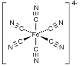
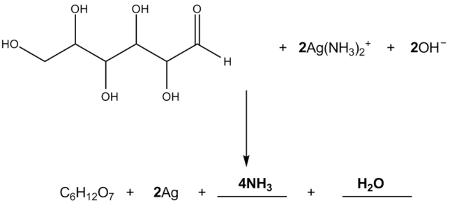
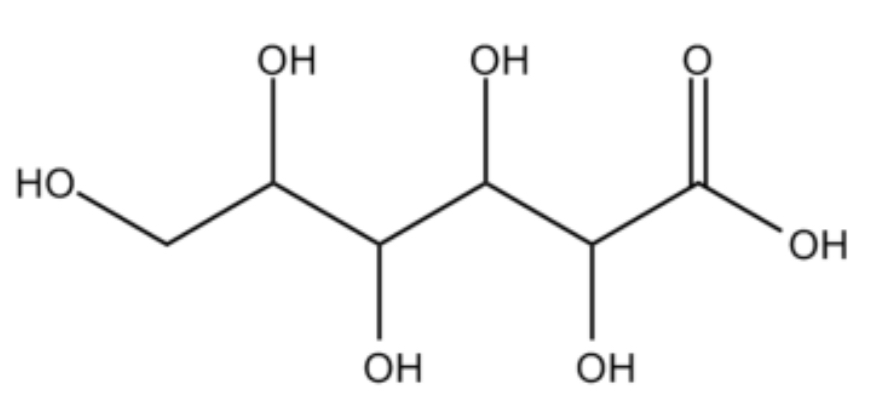
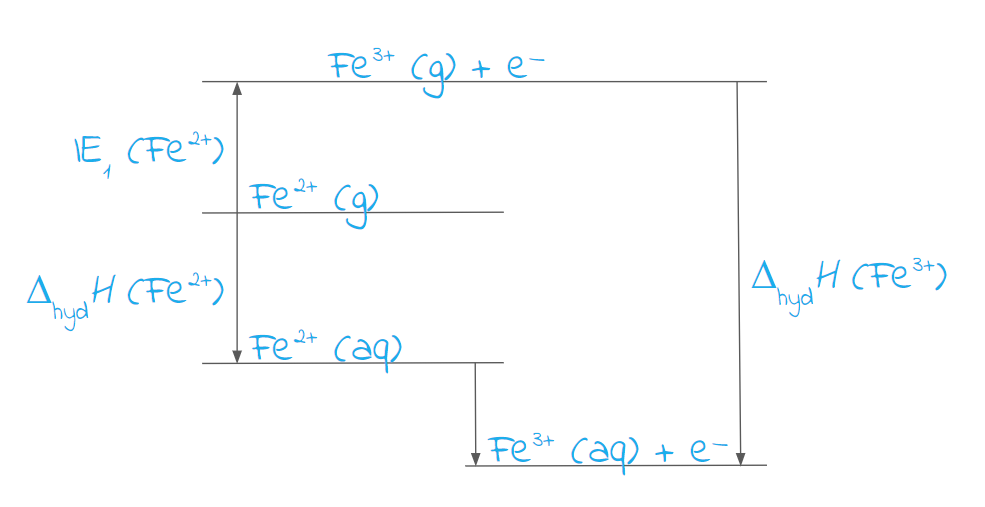
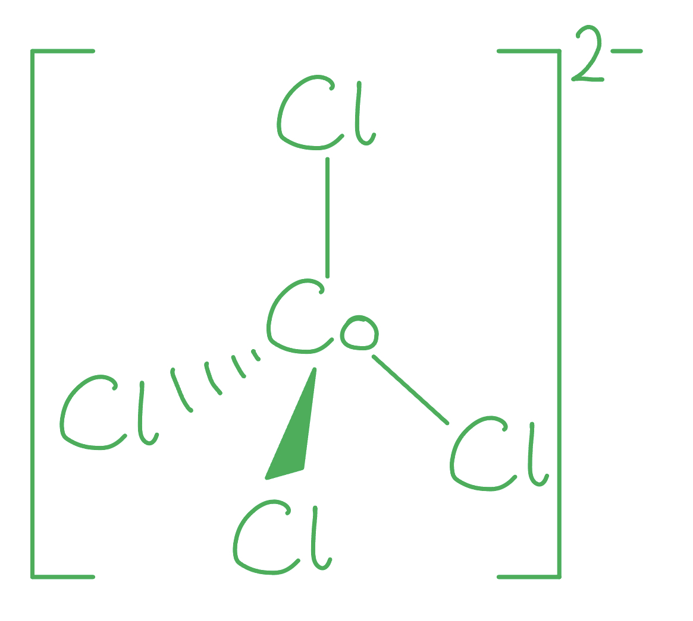

# Mark Schemes — Transition Metals & Complexes
**5. Transition Metals & Organic Nitrogen Chemistry** · Edexcel International A Level (IAL) Chemistry (YCH11)

## Q1 — medium — 11 marks · structured-questions

### 18((a)) — 2 marks
To deduce the formula of the hydrated salt **A**:

- **A** contains FeCl2 / iron(II) chloride; **[1 mark]**
- Mass of water = 72.0 g
**AND**
Moles of water = 4 moles
**AND**
**A** is FeCl2•4H2O / iron(II) chloride tetrahydrate / FeCl2(H2O)4; **[1 mark]**

**[Total: 2 marks]**

- *The key point in this question is that compound **A** is a **pale green **hydrated** salt** *
- *The pale green colour indicates that it is iron(II)*

  - *Careful:** There is a temptation to make the following common mistake:*
  
    - *Take the mass of iron(II) from the molar mass, i.e. 198.8 - 55.8 = 143*
    - *Divide this value by the atomic mass of chlorine, i.e. *$\approx$*4*
    - *Give a final answer of FeCl**4**2–** (the charge is often forgotten, making this answer even more incorrect)*
    - *FeCl**4**2–** cannot be the correct answer as there is no water and the question states that **A** is a hydrated salt*
- *It is likely that iron(II) will have two chlorides attached and be FeCl**2** / iron(II) chloride*
- *The mass of water in compound **A** is the molar mass – the mass of FeCl**2**, i.e. 198.8 - 55.8 - (2 x 35.5) = 72.0*
- *The moles of water in compound **A** is *`fraction numerator mass space open parentheses 72.0 space straight g close parentheses over denominator molar space mass space of space water space open parentheses 18.0 space straight g space mol to the power of negative 1 end exponent close parentheses end fraction`* = 4 moles*
- *Therefore, compound **A** is FeCl**2**•4H**2**O / iron(II) chloride tetrahydrate*

  - *FeCl**2**(H**2**O)**4** is an accepted answer although this is not the correct way to write the formula of a hydrated salt*

### 18((b)) — 1 marks
The formula of complex ion **B** is:

- [Fe(H2O)6]2+; **[1 mark]**

**[Total: 2 marks]**

- *The fact that compound **B** is a pale green solution indicates that the complex is charged*
- *The simplest answer is iron(II) complexed with 6 water molecules giving [Fe(H**2**O)**6**]**2+** (aq)*

  - *Other accepted answers include [Fe(OH)(H**2**O)**5**]**+** **OR **[Fe(Cl)(H**2**O)**5**]**+*
- *You need to know the various colours, states and formulae of different transition metal complexes*

  - *The common ones to feature in exams are copper(II), cobalt(II), iron(II), iron(III) and chromium(III) complexes *
  - *This can seem like a lot of individual facts to remember but you can reduce this by spotting patterns, e.g.:*
  
    - *Iron(II) is green*
    - *Iron(III) is the rusty colours of yellow, orange and brown*
    - *All precipitates are neutral / all solutions are charged*

### 18((c)) — 1 marks
The structure of complex ion **C** is:

- 

; **[1 mark]**

**[Total: 1 mark]**

- *Compound **C** has six cyanide ligands / :CN**–** *
- *This means that it has an octahedral shape*

  - *This must be shown as the question states **clearly showing its three‐dimensional shape*
- *The cyanide ion forms a dative covalent bond from the lone pair on the carbon to the central metal ion  *
- *The marking on this specific question was quite lenient and did not require:*

  - *The lone pairs / arrows for the dative covalent bonds*
  - *The square brackets*
  - *The overall charge*
  - *Connectivity of the cyanide ion - which means that you could potentially form the dative covalent bond from the lone pair on the nitrogen, although this is technically incorrect*

### 18((d)) — 3 marks
The empirical formula of salt** E** is:

- Moles of K = 0.91049
**AND **
Moles of Fe = 0.30466; **[1 mark]**
- Moles of C = 1.8250
**AND **
Moles of N = 1.8214; **[1 mark]**
- Ratio of K : Fe : C : N = 3 : 1 : 6 : 6
**AND**
Empirical formula = K3FeC6N6 **OR **K3Fe(CN)6; **[1 mark]**

**[Total: 3 marks]**

- *To calculate the empirical formula, use the EVADRA method*

  - *E**lements, **V**alues from the question, **A**tomic masses, **D**ivide, **R**atio, **A**nswer*
- | > *E**lements* | > *K* | > *Fe* | > *C* | > *N* |
|---|---|---|---|---|
| > *V**alue from Q* | > *35.6%* | > *17.0%* | > *21.9%* | > *25.5%* |
| > *A**r** * | > *39.1* | > *55.8* | > *12.0* | > *14.0* |
| > *D**ivide (moles)* | > $\frac{35.6}{39.1}$* = 0.91049* | > $\frac{17.0}{55.8}$* = 0.30466* | > $\frac{21.9}{12.0}$* = 1.8250* | > $\frac{25.5}{14.0}$* = 1.8214* |
| > *R**atio* | > $\frac{0.91049}{0.30466}\approx$*3* | > $\frac{0.30466}{0.30466}\approx$*1* | > $\frac{1.8250}{0.30466}\approx$*6* | > $\frac{1.8214}{0.30466}\approx$*6* | *A**nswer = K**3**FeC**6**N**6*

### 18((e)) — 2 marks
The** ionic** equation for the reaction of complex ion **C **with chlorine to form complex ion** D** is:

Any **one **of the following:

Option 1:

2[Fe(CN)6]4– + Cl2 → 2[Fe(CN)6]3– + 2Cl–

- [Fe(CN)6]4– reactant **AND **[Fe(CN)6]3– product; **[1 mark]**

The second mark is dependent on gaining the first mark

- Other reactant (Cl2)
**AND**
Other product (Cl–)
**AND**
Correct balancing; **[1 mark]**

Option 2:

2K4[Fe(CN)6] + Cl2 → 2K3[Fe(CN)6] + 2K+ + 2Cl–

- K4[Fe(CN)6] reactant **AND **K3[Fe(CN)6] product; **[1 mark]**

The second mark is dependent on gaining the first mark

- Other reactant (Cl2)
**AND**
Other products (K+ + Cl–)
**AND**
Correct balancing; **[1 mark]**

**[Total: 2 marks]**

- *Complex ion **D** is a red solution, which suggests that the iron(II) / Fe**2+** has become iron(III) / Fe**3+** *

  - *[Fe(CN)**6**]**4–** → [Fe(CN)**6**]**3–** *
- *This has been achieved by bubbling chlorine gas through complex ion **C** to form complex ion **D** *

  - *[Fe(CN)**6**]**4–** + Cl**2** → [Fe(CN)**6**]**3–**  *
- *The chlorine acts as an oxidising agent causing complex ion **B** to lose an electron, while the chlorine itself is reduced by gaining electrons to form chloride ions*

  - *[Fe(CN)**6**]**4–** + Cl**2** → [Fe(CN)**6**]**3–** + 2Cl**–** *
- *The equation then needs the charges / oxidation numbers balancing to complete the equation*

  - *2[Fe(CN)**6**]**4–** + Cl**2** → 2[Fe(CN)**6**]**3–** + 2Cl**–** *

### 18((f)) — 2 marks
The completed table is:

|   | **Neutralisation** | **Ligand exchange** | **Redox** |
|---|---|---|---|
| Reaction 2 |   | **✔; ****[1 mark]** |   |
| Reaction 3 |   |   | **✔; ****[1 mark]** |

**  ****[Total: 2 marks]**

- *If more than one box is ticked per row, then the mark for that row cannot be given*
- *In reaction 2*

  - *Complex ion **B** is [Fe(H**2**O)**6**]**2+** (aq)*
  - *Complex ion **C** is [Fe(CN)**6**]**2+** (aq)*
  - *The water ligands have been replaced by cyanide ligands, so this is ligand exchange*
- *In reaction 3*

  - *Complex ion **C** is [Fe(CN)**6**]**2+** (aq)*
  - *Complex ion **D** is [Fe(CN)**6**]**3+** (aq)*
  - *The oxidation state of the central iron ion has changed from +2 to +3*
  - *Chlorine gas is bubbled through the solution to achieve this*
  
    - *The chlorine gas is reduced to chloride ions*

## Q2 — medium — 9 marks · structured-questions

### 1() — 1 marks
> **[mark-scheme]**
> The coordination number of chromium in [CrCl2(en)2]+ is:
> 
> - Six / 6 **[1 mark]**

> **[exam-tip]**
> The coordination number is the total number of dative covalent bonds to the central metal ion. It is not the number of ligand molecules.
> 
> - Each Cl- contributes 1 bond
> - Each en molecule contributes 2 bonds (one from each N atom)
> - There are 2Cl- ligands and 2en ligands:
> 
> (2 x 1) + (2 x 2) = 6
> 
> The most common mistake is counting 4 ligand molecules and writing that the coordination number is 4.
> 
> Always count bonds, not ligands.

### 2() — 2 marks
> **[mark-scheme]**
> 1,2-diaminoethane acts as a bidentate ligand because:
> 
> - Each nitrogen atom has a lone pair of electrons **[1 mark]**
> - Which can both form dative covalent / coordinate bonds to the central metal ion **[1 mark]**

> **[exam-tip]**
> A bidentate ligand must have two donor atoms, each with a lone pair, positioned so that both can bond to the metal simultaneously.
> 
> In 1,2-diaminoethane, the two N atoms are separated by two CH2 groups, giving the right geometry to form a stable five-membered chelate ring with the metal.
> 
> A common error is to simply state "it donates two electron pairs", which does not include:
> 
> - Where the lone pairs are located
> - The specific type of bond formed

### 3() — 2 marks
The equation for the formation of [CrCl2(en)2]+ by ligand substitution is:

[Cr(H2O)6]3+ (aq) + 2en (aq) + 2Cl- (aq) → [CrCl2(en)2]+ (aq) + 6H2O (l)

**[2 marks]**

> **[mark-scheme]**
> 1 mark for correct reactants and products
> 
> 1 mark for correctly balanced equation including 6H2O (l) released
> 
> State symbols are not required for this answer, but they must be correct if included
> 
> en can be replaced by its full formula, NH2CH2CH2NH2, but the formula must be correct

> **[exam-tip]**
> The most common errors on this question are:
> 
> 1. Incorrect balancing
> 
>   - Each en ligand replaces 2 H2O ligands
>   - Each Cl- ligand replaced 1 H2O ligand
>   - This releases 6H2O
> 2. Incorrect charges
> 
>   - [Cr(H2O)6]3+ (aq) is +3
>   - Each Cl- (aq) is -1
>   
>     - Left side = +3 + 0 + (2 × -1) = +1
>   - [CrCl2(en)2]+ (aq) is +1
>   
>     - Right side = +1 + 0 = +1 (balanced for charge)

### 4() — 2 marks
> **[mark-scheme]**
> [CrCl2(en)2]+ is more thermodynamically stable because:
> 
> - The reaction results in an increase in the number of particles / molecules in solution 
> **OR**
> 5 particles react to form 7 particles **[1 mark]**
> - Therefore, the entropy of the system (Δ*S*system) increases / is positive **[1 mark]**
> 
> For the second mark, just "entropy increases" or "Δ*S*total increases" are not accepted

> **[exam-tip]**
> This is the chelate effect explained through entropy. Replacing monodentate ligands with polydentate ones:
> 
> - Releases more free molecules into solution
> - Increases disorder
> 
> The second mark is often lost with vague / incorrect statements like "entropy increases" or "Δ*S*total increases". You need to be clear that it is the entropy of the system (Δ*S*system) that increases

### 5() — 2 marks
> **[mark-scheme]**
> The two complexes have different colours because:
> 
> - The different ligands cause a different amount of splitting / a different energy gap between the (3)d-orbitals **[1 mark]**
> - So electrons absorb a different wavelength / frequency of (visible) light when they are promoted (to the higher energy d-orbitals) **[1 mark]**
> 
> Answers must talk about d-orbitals (plural), not d-orbital

> **[exam-tip]**
> The colour of a transition metal complex depends on the size of the d-orbital energy gap, which is determined by the identity of the ligands. Different ligands split the d orbitals by different amounts.
> 
> More strongly splitting ligands (like en) cause a larger energy gap, so higher energy (shorter wavelength) light is absorbed, shifting the observed colour.
> 
> A mistake seen by examiners is stating that colour is "emitted" when electrons drop back down. The colour is actually the complementary light remaining after specific wavelengths are absorbed

## Q3 — hard — 9 marks · structured-questions

### 10() — 5 marks
i) An explanation of the shape of [Ag(NH3)2]+ is:

- The shape is linear / the bond angle is 180° ; **[1 mark] **
- As there are 2 pairs of (bonding) electrons (around the central Ag+) / each N donates a (lone) pair of electrons (to the Ag+); **[1 mark] **
- Which adopt a position to minimise repulsion (between electron pairs / bonds); **[1 mark] **

ii) [Ag(NH3)2]+ is colourless because:

- Ag+ / silver ion has a full d-subshell / d-orbitals; **[1 mark]**
- So, electrons cannot be promoted (to higher d orbitals) 
**OR**
So, there are no d-d transitions
**OR**
So, there is no excitation / transition of electrons; **[1 mark]**

**Final answer:** **[Total: 5 marks] **

- *For part (i)*

  - *You can also*
  
    - *Draw a diagram showing the shape and bond angle *
    - *Say that each ammonia donates a (lone) pair of electrons*
- *For part (ii) *

  - *You can give the electron configuration, [Kr] 4d**10** for the silver ion but make sure you take account of the charge on the ion*
- *Transition metal complexes appear coloured because they absorb energy corresponding to certain parts of the visible electromagnetic spectrum*
- *Transition metals have a partially filled 3d energy level*
- *When ligands attach to the central metal ion the energy level splits into two levels with slightly different energies*

  - *If one of the electrons in the lower energy level absorbs energy from the visible spectrum it can move to the higher energy level*
  - *The amount of energy gained by the electron is directly proportional to the frequency of the absorbed light and inversely proportional to the wavelength*
- *If the 3d shell is full then no promotion of electrons can occur which means there is no colour observed *

### 10((b)) — 3 marks
i) The equation for the reaction is:

- Correct products;** [1 mark]**
- Correct balancing;** [1 mark] **

ii) The structure of **Y** is:

- 

; **[1 mark] **

**[Total: 3 marks]**

- *To balance the equation:*

  - *C**6**H**12**O**6** + [Ag(NH**3**)**2**]**+** + OH**-** → C**6**H**12**O**7** + Ag + _____ + _____*
  
    - *Ammonia and water are the missing products *
  - *Balance the OH**–*
  
    - *2OH**–** must be required as the glucose reactant has gained one oxygen*
    - *Having only one OH**–** would result in an H**–** being formed, whereas 2OH**–**  allows the formation of water*
    - *C**6**H**12**O**6** + [Ag(NH**3**)**2**]**+** + OH**-** → C**6**H**12**O**7** + Ag + NH**3** + H**2**O*
  - *Balance the hydrogen and nitrogen atoms on both sides*
  
    - *C**6**H**12**O**6** + **2**[Ag(NH**3**)**2**]**+** + **2**OH**-** → C**6**H**12**O**7** + Ag + **4**NH**3** + H**2**O*
  - *Balance silver atoms on the right-hand side*
  
    - *C**6**H**12**O**6** + **2**[Ag(NH**3**)**2**]**+** + **2**OH**-** → C**6**H**12**O**7** + **2**Ag + **2**NH**3** + H**2**O *
- *You will not gain the mark for using -HO on the final carbons as you must show the oxygen is bonded to the carbon *

### 10((c)) — 1 marks
The half equation at the negative electrode is:

- Zn + 2OH− → Zn(OH)2 + 2e−; **[1 mark] **

**Final answer:** **[Total: 1 mark] **

- *The overall reaction is:*

  - *Ag**2**O (s) + H**2**O (l) + Zn (s) → 2Ag (s) + Zn(OH)**2 **(s)*
- *If the reaction at the positive electrode is:*

  - *Ag**2**O (s) + H**2**O (l) + 2e**−** → 2Ag (s) + 2OH**− **(aq)*
- *The species left over are:*

  - *Zn (s) → Zn(OH)**2 **(s)*
- *This then needs balancing *

  - *The Zn atoms are balanced, so add 2OH**-** ions to the left-hand side*
  
    - *Zn + 2OH**−** → Zn(OH)**2*
  - *The charge is now not balanced so add 2 electrons to the right-hand side*
  
    - *Zn + 2OH**−** → Zn(OH)**2** + 2e**−*
- *You can also give*

  - *Zn + 2OH**−** − 2e**−**→ Zn(OH)**2*
  - *Zn → Zn**2+** + 2e**−*

## Q4 — hard — 20 marks · structured-questions

### 21((a)) — 2 marks
Iron(III) compounds are more stable than iron(II) compounds becasue:

- The electronic structure of Fe(II) is [Ar]3d6 and Fe(III) is [Ar]3d5; **[1 mark]**
- 3d5 is more stable than 3d6 because the 3d6 subshell has two paired electrons which results in repulsion / pairing of electrons is (energetically) less favourable; **[1 mark]**

**[Total: 2 marks]**

- *Even if you are not quite sure of the reason, the question prompts you to answer in terms of electronic structure, so at the very least, you could gain the first mark*

  - *Fe has 26 electrons with the configuration of [Ar]3d**6**4s**2*
  - *Fe(II) will have 24 electrons, so will lose the 4s**2** electrons: [Ar]3d**6*
  - *Fe(III) will have 23 electrons, so will lose the 4s**2** electrons and a 3d electron: [Ar]3d**5*
- *Once you have written these, it may become more obvious to you as this is a similar reason as to why chromium has the electronic configuration of [Ar]3d**5**4s**1** instead of [Ar]3d**6*
- *You can give the full electronic structure of iron(II) and iron(III) or just Fe(II) is 3d6 and Fe(III) is 3d5*
- *For the second mark, you could also state that:*

  - *A half-filled subshell is more stable*
  - *1 electron in each orbital is stable*
- *If no other mark is scored, just ‘Fe(III) has a half-filled 3d subshell' scores 1 mark*
- *You can use the terms ‘orbital’ or ‘(quantum) shell’ instead of subshell*

### 21((b)) — 4 marks
i) The equation for the third ionisation energy of iron is:

- Fe2+ (g) → Fe3+ (g) + e(−) 
**OR** Fe2+ (g) − e(−) → Fe3+ (g); **[1 mark]**

ii) **Stable** iron(III) ions can be formed from iron(II) ions in aqueous solution because:

- Conversion of iron(II) / Fe2+ to iron(III) / Fe3+ requires 2958 kJ mol−1
**OR**
Conversion of iron(II) / Fe2+ to iron(III) / Fe3+ requires (large amounts of ) energy
**OR**
Conversion of iron(II) / Fe2+ to iron(III) / Fe3+ is (very) endothermic; **[1 mark]**
- This energy is recovered by hydration (which is exothermic); **[1 mark]**
- The hydration of iron(III) / Fe3+ is more exothermic than iron(II) / Fe2+
**AND**
Because the iron(III) has a greater charge; **[1 mark]**

**[Total: 4 marks]**

- *For part (i)*

  - *When writing ionisation energy equations, you **MUST **include state symbols*
  - *Remember:** The **third **ionisation energy 3+ ions*
  - *The 3rd ionisation energy of iron tells you how much energy is required to form gaseous Fe**2+** from gaseous Fe**3+*
- *For part (ii)*

  - *Fe**3+** (aq) ions are more energetically stable than Fe**2+** (aq) ions because the enthalpy change of hydration of Fe**3+** is more exothermic than that of Fe**2+*
  
    - *This is because the Fe**3+** has a greater charge *
  - *You can think of this in terms of a Born-Haber cycle* 
  
    - *From this, Fe**3+** (aq) is more energetically stable (i.e. lower in energy) than Fe**2+** (aq)*
    - *Remember: **The lower energy that a chemical species is, the more energetically stable it is*

### 21((c)) — 3 marks
Oxyhaemocyanin and oxyhaemoglobin have different colours because:

- The energy difference between the two sets of (3)d orbitals is different; **[1 mark]**
- Because the ligands / ions are different; **[1 mark]**
- So radiation / light / quanta absorbed from different regions of the visible spectrum; **[1 mark]**

**[Total: 3 marks]**

- *Don't be sidetracked by the introduction of unknown substances into the question, this is a question that is asking you to show how complexes give different colours*
- *Careful**: You need to make sure that you use the correct terminology*

  - *For the first mark, you can say that the energy difference between the energy levels of the (3)d subshell are different*
  - *But, you would not gain this mark if you referred to orbital (instead of orbitals) or if you used the term (quantum) shell instead of subshell*
- *You must state that the difference is because the ligands or ions are different*

  - *Just stating that the complexes are different is insufficient to gain the second mark*
- *For the final mark, you could also state that different radiation / light frequencies are transmitted / reflected*

### 21((d)) — 6 marks
i) Determining whether the iron concentration in this sample of sodium carbonate meets the stated specification:

Method 1

- **Conversion of % transmittance into log(% transmittance):** log(39.8) = 1.60; **[1 mark]**
- **Use of the graph to obtain a value for the concentration of iron in mg dm****−3****:** [Fe] = 0.44 (mg dm−3); **[1 mark]** *Allow 0.42—0.46*
- **Calculation of the mass of iron in 500 cm****3**** of iron solution which is also the mass of iron in 20 g of sodium carbonate:** 0.5 x 0.44 = 0.22 mg (in 500 cm3 / 20 g) *Accept 0.21-0.23 (mg)* **OR** 0.00022 / 2.2 x 10−4 g (in 500 cm3 / 20 g); **[1 mark]**
- **Conversion of the mass Fe in 20 g to ppm:**  (106 x 2.2 x 10−4) ÷ 20 = 11 ppm; **[1 mark]**

Method 2 (M1 and M2 as Method 1)

- **Calculation of concentration of sodium carbonate:** = 20 x 1000 / 500 ÷ 1000 = 40000 mg dm−3; **[1 mark]**
- **Calculation of the ppm of Fe in 40000 mg of sodium carbonate:** ppm = 0.44 x 106 / 40000 = 11 ppm (< 20 ppm); **[1 mark]**

Method 3  (M1 and M2 as Method 1)

- **Conversion of the maximum permitted mass of iron in 20 g of sodium carbonate: ** 20 x 20 ÷ 106 = 4 x 10−4 g = 0.4 mg (> 0.22); **[1 mark]**
- **Calculation of the concentration of maximum allowed iron:** 0.4 x 1000 ÷ 500 = 0.8 mg dm−3; **[1 mark]**

ii) The type of ligand thioglycolic acid is in the iron(III) thioglycolic acid complex is:

- (Thioglycolic acid is a) bidentate (ligand); **[1 mark]**
- Because there are three ligands per complex ion and the coordination number of Fe3+ is (usually) six
**OR** 
It can form dative bonds using the lone pairs on the SH and the COOH groups; **[1 mark]**

**[Total: 6 marks]**

- *For part (i), the correct answer with some working scores 4 marks*
- *There are several different methods to determine whether or not the iron concentration meets the stated specification, choose which method makes most sense to you*
- *You must be able to convert from g dm**-3** to ppm*
- *In part (ii), you are not expected to know the type of ligand thioglycolic acid is in the complex, but you should be able to apply your knowledge*

  - *The formula shows that there are 3 ligands*
  - *You should know that Fe**3+** often forms octahedral complexes, with a coordination number of 6*
  - *This suggests that thioglycolic acid is bidentate*
- *You could say that it can form dative bonds using the lone pairs on S **AND **O atoms*
- *But any references to it forming two dative bonds or 3 ligands form 6 dative bonds, without further detail, would be ignored*
- *You would not be given credit for stating that the two dative covalent bonds are from COOH*

### 21((e)) — 4 marks
i) The catalyst is described as ‘homogeneous’ because:

- The catalyst and reactants are in the same phase / state 
**OR** 
All species are in aqueous solution; **[1 mark]**

ii) Two equations to show how iron(II) ions catalyse this oxidation are:

- Equation for oxidation of iron(II) by peroxodisulfate: S2O82− + 2Fe2+ → 2SO42− + 2Fe3+; **[1 mark]**
- Equation for oxidation of iodide ions by iron(III): 2I− + 2Fe3+ → I2 + 2Fe2+; **[1 mark]**

iii) Iron(II) ions lower the activation energy of this reaction by:

- Uncatalysed reaction involves two negatively charged ions reacting 
**AND** 
Catalysed steps involve oppositely charged ions reacting (which is kinetically more favourable / lowers the activation energy); **[1 mark]**

**[Total: 4 marks]**

- *Fe**2+** is a catalyst in this reaction as it initially acts as a reducing agent, becoming oxidised to Fe**3+** and reducing S**2**O**8**2-** to SO**4**2-*
- *Fe**3+** then acts as an oxidising agent, becoming reduced back to Fe**2+** and oxidising I**-** to I**2*
- *You can check your equations as when you add them together, Fe**2+** and Fe**3+** should cancel out, leaving the overall equation:*

  - *S**2**O**8**2−** + **2Fe**2+** + 2I**−** + **2Fe**3+** **→ 2SO**4**2−** +** 2Fe**3+** **+ I**2** + **2Fe**2+*
  - *S**2**O**8**2−** + 2I**−** ** **→ 2SO**4**2−** + I**2** *
- *The uncatalysed reaction is quite slow even though it is energetically favourable*
- *Both ions are negatively charged, so they are unlikely to make successful collisions with one another*
- *However, if iron(II) ions are added to the reaction, the rate is much quicker as it involves oppositely charged ions*

### 21((f)) — 1 marks
A possible reason why the chloro complexes of iron ions have a coordination number of four rather than six is:

- Chloride ions are large so steric hindrance is too great for six ligands to coordinate around the central ion; **[1 mark]**

**[Total: 1 mark]**

- *You would get credit for a more simplistic explanation, such as chloride ions are large or chlorine ligands are (too) large*
- *You would not get credit for identifying them as chlorine atoms*
- *Any reference to repulsion between the negative chloride ions would be ignored - this does not explain why the coordination number is 4*

## Q5 — easy — 1 marks · multiple-choice-questions

### 3() — 1 marks
**Correct answer: A** — 

**Final answer:** **The correct answer is ****A**** because:**

- The electronic configuration of chromium is an exception in that the 4s subshell begins to fill before the 3d subshell is complete
- This is because the [Ar]3d54s1 configuration, with half-filled 3d & 4s subshells, is energetically more stable than [Ar]3d6

**B**, **C **& **D **are incorrect as the most stable electronic configuration is with all six electrons unpaired in two half-filled subshells

## Q6 — easy — 1 marks · multiple-choice-questions

### 4() — 1 marks
**Correct answer: A** — electron-pair donor

**Final answer:** **The correct answer is ****A**** because:**

- A ligand is a molecule or ion that forms a dative covalent / co-ordinate bond with a transition metal by donating a pair of electrons to the bond
- This means ligands have a negative charge **or **a lone pair of electrons capable of being donated

**B** is incorrect as ligands do not need to be negatively charged

**C** is incorrect as  ligands are not electron pair acceptors

**D** is incorrect as  ligands are not electron pair acceptors and do not need to be negatively charged

## Q7 — easy — 1 marks · multiple-choice-questions

### 6() — 1 marks
**Correct answer: C** — forms stable ions with partially filled d orbitals

**Final answer:** **The correct answer is ****C**** because: **

- The definition of a transition metal is an elements with an incomplete d-subshell that can form at least one stable ion with an incomplete d-subshell

**A** is incorrect as elements can be in the d block but not be transition metals

**B **is incorrect as** ** elements can have partially filled d orbitals but not be transition metals

**D **is incorrect as** ** elements can form stable compounds with different oxidation states but not be transition metals

## Q8 — easy — 1 marks · multiple-choice-questions

### 8() — 1 marks
**Correct answer: A** — anhydrous cobalt(II) chloride is blue and hydrated cobalt(II) chloride is pink

**Final answer:** **The correct answer is ****A**** because: **

- Anhydrous cobalt(II) chloride / [CoCl4]2– is blue
- When it is hydrated, cobalt(II) chloride form the [Co(H2O)6]2+ complex which is pink
- In both species, the central metal ion remains Co2+

**B** is incorrect as the colours are the wrong way round

**C **and **D** are incorrect as** ** the test does not involve a change of oxidation state

## Q9 — easy — 1 marks · multiple-choice-questions

### 1() — 1 marks
**Correct answer: B** — +2

**Final answer:** **The correct answer is B**

- Assign the oxidation state of platinum as x
- Each Cl- ligand has a charge of −1, and there are four of them
- Set up the equation using the overall complex charge of −2:

x + (4 × −1) = −2

- Solve for x:

x − 4 = −2

x = +2

**A** is incorrect as −2 is the overall charge of the complex ion, not the oxidation state of platinum. The oxidation state must be deduced algebraically from the ligand charges and overall charge.

**C** is incorrect as +4 is the number of Cl- ligands (the coordination number), not the oxidation state. The two values happen to share the same number here, which makes this a common error.

**D** is incorrect as this comes from a sign error in the algebra. x − 4 = −2 gives x = +2, not +6. Adding 4 to both sides of the equation (not subtracting) gives the correct result.

## Q10 — easy — 1 marks · multiple-choice-questions

### 1() — 1 marks
**Correct answer: D** — 6

**Final answer:** **The correct answer is D**

- EDTA4- is a hexadentate ligand, meaning it forms six dative covalent bonds with the central metal ion
- There is one EDTA4- ligand in [Ni(EDTA)]2-, contributing all six bonds
- Coordination number = total number of dative covalent bonds to the central metal ion = 6

**A** is incorrect as 1 is the number of EDTA4- molecules in the complex, not the coordination number. Coordination number counts the total number of dative covalent bonds formed with the central metal, not the number of ligand molecules.

**B** is incorrect as 2 is the number of bonds formed by a bidentate ligand such as 1,2-diaminoethane or ethanedioate. EDTA4- is hexadentate, not bidentate.

**C** is incorrect as 4 is the charge on the EDTA4- ion, not the number of dative covalent bonds it forms. EDTA4- is hexadentate and forms six bonds regardless of its ionic charge.

## Q11 — easy — 1 marks · multiple-choice-questions

### 1() — 1 marks
**Correct answer: D** — [Zn(H2O)6]2+

**Final answer:** **The correct answer is D**

- Colour in transition metal complexes arises from d-d transitions, where electrons are promoted between split d-orbitals and visible light is absorbed
- Zn2+ has a completely full d-subshell (d10)
- With no empty or partially filled d-orbitals, d-d transitions are impossible, no visible light is absorbed, and the ion appears colourless

**A** is incorrect as [Cu(H2O)6]2+ is blue. Cu2+ has a partially filled d-subshell (d9), allowing d-d transitions and the absorption of visible light.

**B** is incorrect as [Fe(H2O)6]2+ is pale green. Fe2+ has a partially filled d-subshell (d6), allowing d-d transitions.

**C** is incorrect as [Fe(H2O)6]3+ produces a yellow-brown solution. Fe3+ has a partially filled d-subshell (d5), allowing d-d transitions.

## Q12 — medium — 3 marks · multiple-choice-questions

### 1((a)) — 1 marks
**Correct answer: B** — covalent and dative covalent only

**Final answer:** **The correct answer is ****B**** because:**

- There is **covalent **bonding present within the NH3 and H2O ligands in the complex
- A ligand is a molecule or ion that forms a **co-ordinate** bond with a transition metal by donating a pair of electrons to the bond

**A** is incorrect as  there is no ionic bonding within the complex

**C** is incorrect as there is dative covalent bonding between the metal ion and the ligand

**D** is incorrect as there is covalent bonding within NH3 and H2O

### 1((b)) — 1 marks
**Correct answer: D** — [CoCl4]2−

**Final answer:** **The correct answer is ****D**** because:**

- The tetrachlorocobaltate(2-) ion, [CoCl4]2− is a blue ion that has a tetrahedral shape

A is incorrect as [Pt(NH3)2Cl2] is square planar **AND **the general formula of the cancer treatment drug cis-platin

B is incorrect as  [Cu(H2O)4(OH)2] is octahedral

C is incorrect as [Cu(NH3)4(H2O)2]2+ is octahedral

### 1((c)) — 1 marks
**Correct answer: C** — [Ni(NH2CH2CH2NH2)3]2+

**Final answer:** **The correct answer is ****C**** because:**

- [Ni(NH2CH2CH2NH2)3]2+ contains 1,2-diaminoethane (H2NCH2CH2NH2) which is also written as **‘en’**
- This is an example of a bidentate ligand
- Bidentate ligands can each form two dative bonds to the central metal ion
- This is because each ligand contains two atoms with lone pairs of electrons

**A** is incorrect as  the ligand is tridentate

**B** is incorrect as both the ligands are monodentate

**D** is incorrect as the ligand is hexadentate

## Q13 — medium — 1 marks · multiple-choice-questions

### 1() — 1 marks
**Correct answer: D** — $\mathrm{VO}_{2}^{+}$ and VO2+

**Final answer:** **The correct answer is ****D**** because:**

- The oxidation number of V in VO2+ is +5
- The oxidation number of V in VO2+ is +4
- If it helps, you can use a table to calculate oxidation numbers - write down the oxidation number due to oxygen and the overall oxidation number of the ion (this is equal to the charges on the ion)
- The oxidation number of V + total oxidation number of O = Overall oxidation number

|   | VO2+ | VO2+ |
|---|---|---|
| V | **+5** | **+4** |
| O | 2 x -2 = -4 | -2 |
| Total | +1 | +2 |

**A** is incorrect as  both Cr have the oxidation number +6

**B** is incorrect as  both Cr have the oxidation number +6

**C** is incorrect as both V have the oxidation number +5

## Q14 — medium — 1 marks · multiple-choice-questions

### 5() — 1 marks
**Correct answer: B** — carbon monoxide forms stronger dative covalent bonds with haemoglobin than oxygen does

**Final answer:** **The correct answer is ****B**** because:**

- The dative covalent bond formed between oxygen and haemoglobin is weaker than the dative covalent bond formed between carbon monoxide and haemoglobin

**A** is incorrect as  carbon monoxide can be displaced from carboxyhaemoglobin

**C **is incorrect as the formation of carboxyhaemoglobin does not lead to an increase in the entropy of the system

**D** is incorrect as the difference in bond type does not fully explain the difference in dative covalent bond strength

## Q15 — medium — 1 marks · multiple-choice-questions

### 5() — 1 marks
**Correct answer: C** — d—d transitions are not possible because the d orbitals are fully occupied

**Final answer:** **The correct answer is ****C**** because:**

- Copper(I) ions have the electronic configuration [Ar]3d10
- When the two ammonia ligands attach to a copper(I) ion, the d orbitals split into 2 different energy levels
- However, as these d orbitals are fully occupied, no d—d transitions occur
- It is the transition between these levels that gives rise to the colour of compounds
- If the transitions cannot occur, the compound will not be coloured

**A** is incorrect as the d orbitals in copper(I) can be split

**B** is incorrect as  no d—d transitions occur

**D** is incorrect as  the ease of oxidation of an ion does not affect the colour of its complex

## Q16 — medium — 1 marks · multiple-choice-questions

### 5() — 1 marks
**Correct answer: A** — chromium

**Final answer:** **The correct answer is ****A**** because: **

- Chromium = 1s2 2s2 2p6 3s2 3p6 4s2 3d4

  - It is more energetically stable to have the 4s and 3d shells half filled
  - So, chromium becomes 1s2 2s2 2p6 3s2 3p6 4s1 3d5
  - This means that there are 6 unpaired electrons

**B** is incorrect as  iron = 1s2 2s2 2p6 3s2 3p6 4s2 3d6 which means that an atom of iron has four unpaired electrons

**C **is incorrect as** **manganese = 1s2 2s2 2p6 3s2 3p6 4s2 3d5 which means that an atom of manganese has five unpaired electrons

**D **is incorrect as** ** vanadium = 1s2 2s2 2p6 3s2 3p6 4s2 3d3 which means that an atom of vanadium has three unpaired electrons

## Q17 — medium — 1 marks · multiple-choice-questions

### 6() — 1 marks
**Correct answer: B** — 

**Final answer:** **The correct answer is ****B**** because:**

- 1,2-diaminoethane is bidentate as it contains 2 nitrogen atoms, each with a lone pair of electrons
- Three molecules of 1,2-diaminoethane form a complex with a copper(II) ion

  - Each 1,2-diaminoethane molecule forms two dative covalent bonds with the ion
- The coordination number is the number of dative covalent bonds to the central metal ion
- A total of 6 dative covalent bonds form, therefore, the coordination number is 6

**A** is incorrect as 3 is the number of ligands, not the coordination number

**C** is incorrect as  the ligand is bidentate and 3 is the number of ligands

**D** is incorrect as the ligand is bidentate

## Q18 — medium — 1 marks · multiple-choice-questions

### 7() — 1 marks
**Correct answer: B** — [Ni(EDTA)]2–

**Final answer:** **The correct answer is ****B**** because:**

- [Ni(H2O)6]2+ + EDTA4– → [Ni(EDTA)]2– + 6H2O

  - 2 moles of reactant form 7 moles of product, which is the greatest increase in entropy

**A** is incorrect as Ni(H2O)6]2+ + 4Cl– → [Ni(Cl)4]2– + 6H2O

5 moles of reactant form 7 moles of product, which is **not **the greatest increase in entropy

**C **is incorrect as [Ni(H2O)6]2+ + 2C2O42– → [Ni(C2O4)2 ]2– + 6H2O

3 moles of reactant form 7 moles of product, which is **not **the greatest increase in entropy

**D** is incorrect as [Ni(H2O)6]2+ + 3H2NCH2CH2NH2 → [Ni(H2NCH2CH2NH2)3]2+ + 6H2O

4 moles of reactant form 7 moles of product, which is **not **the greatest increase in entropy

## Q19 — medium — 2 marks · multiple-choice-questions

### 7((a)) — 1 marks
**Correct answer: D** — Pt(NH3)2Cl2 is square planar and CrCl4– is tetrahedral

**Final answer:** **The correct answer is ****D**** because: **

- **Pt(NH****3****)****2****Cl****2**** is the formula for ****cis**** / ****trans****-platin which is a square planar complex**
- **CrCl****4****–**** is a central chromium 3+ ion with four large chloride ligands**

  - **Due to their size, the chloride ligands space out to be as far apart as possible**
  - **This results in CrCl****4****–**** having a tetrahedral shape**

> *A** is incorrect as CrCl**4**−** is tetrahedral*

*B **is incorrect as*** ***Pt(NH**3**)**2**Cl**2** is square planar*

*C **is incorrect as*** *** CrCl**4**−** is tetrahedral **AND **Pt(NH**3**)**2**Cl**2** is square planar*

### 7((b)) — 1 marks
**Correct answer: B** — the bonding in both complexes is dative covalent

**Final answer:** **The correct answer is ****B**** because: **

- The bonding between any ligand and a central metal ion is dative covalent
- This is regardless of the ligand and central metal ion

**A** is incorrect as the bonding is ionic in neither complex

**C **is incorrect as** ** the bonding in CrCl4− is dative covalent

**D **is incorrect as** **the bonding in Pt(NH3)2Cl2 is dative covalent

## Q20 — medium — 1 marks · multiple-choice-questions

### 1() — 1 marks
**Correct answer: C** — [Ar] 3d10

**Final answer:** **The correct answer is C**

- Copper has an anomalous electronic configuration where the 4s electron is promoted to fill the 3d subshell:

Cu = [Ar]3d104s1

- When transition metals form ions, 4s electrons are lost before 3d electrons
- Cu+ is formed by losing one electron

  - So, the 4s1 electron is removed:

Cu+ = [Ar]3d10

**A** is incorrect as this assumes copper follows standard filling rules ([Ar]3d94s2) and then removes a 3d electron. Copper atoms have an anomalous configuration and neither step is correct

**B** is incorrect as the neutral copper atom configuration ([Ar]3d104s1) is correct, but a 3d electron has been removed instead of the 4s electron. Transition metals always lose 4s electrons before 3d electrons when forming ions

**D** is incorrect as [Ar]3d104s1 is the configuration of the neutral copper atom, not the Cu+ ion. The question asks for the configuration after one electron has been removed

> **[exam-tip]**
> There are two steps to this type of question:
> 
> 1. Recall whether the element has an anomalous configuration
> 
>   - Copper and chromium both do
> 2. Apply the 4s-before-3d rule for ion formation.
> 
> Confusing either step leads to a wrong answer.
> 
> Write out the atom’s full configuration first, then identify which electron is removed.

## Q21 — medium — 1 marks · multiple-choice-questions

### 1() — 1 marks
**Correct answer: D** — the only stable zinc ion has the electronic configuration [Ar]3d10

**Final answer:** **The correct answer is D**

- The definition of a transition metal is a d-block element that forms one or more stable ions with an incompletely filled d-subshell
- Zinc only forms one stable ion, Zn2+
- Zn2+ has the electronic configuration [Ar]3d10 with a completely filled d-subshell
- So, zinc does not meet the definition

**A** is incorrect as forming only one stable ion does not disqualify an element from being a transition metal. Scandium also forms only one stable ion (Sc3+), but is disqualified because that ion has an empty d-subshell, not because it forms only one ion.

**B** is incorrect as the classification depends on the electronic configuration of the ions, not the atom. The zinc atom does have a full 3d subshell, but this is not the defining reason for its exclusion.

**C** is incorrect as catalytic activity is a characteristic property of transition metals, not the definition used to classify them. Classification depends on whether an element forms at least one stable ion with an incompletely filled d-subshell.

> **[exam-tip]**
> Always use the precise specification definition when answering questions like this:
> 
> "A transition metal is a d-block element that forms one or more stable ions with an incompletely filled d-subshell."
> 
> Zinc and scandium are the two common exceptions, but for different reasons:
> 
> - Zinc fails because its only ion has a full d-subshell.
> - Scandium fails because its only ion has an empty one.

## Q22 — medium — 1 marks · multiple-choice-questions

### 1() — 1 marks
**Correct answer: D** — [Pt(NH3)2Cl2]

**Final answer:** **The correct answer is D**

- Pt2+ has a d8 electronic configuration, which characteristically gives square planar geometry with a coordination number of 4
- In [Pt(NH3)2Cl2] (cisplatin), the four ligands are arranged in a plane around the central Pt2+ ion at 90° bond angles

**A** is incorrect as [Ag(NH3)2]+ has a coordination number of 2 and is linear, with the two ligands arranged at 180° bond angles around Ag+.

**B** is incorrect as [CuCl4]2- is tetrahedral. Cl- is a large ligand and the spatial repulsion between four bulky chloride ions favours a tetrahedral arrangement rather than square planar.

**C** is incorrect as [Cu(NH3)4(H2O)2]2+ has a coordination number of 6 (four NH3 and two H2O ligands) and is octahedral. The subscript 4 on ammonia does not give the total ligand count — all six ligands must be counted.
