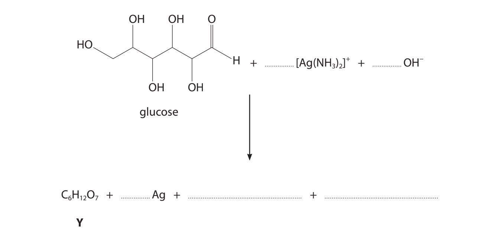
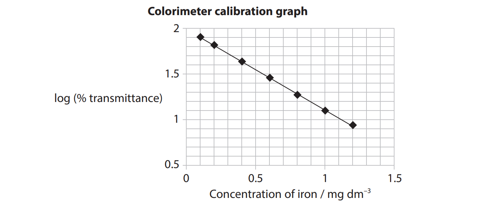

# Exam Questions — Transition Metals & Complexes
**5. Transition Metals & Organic Nitrogen Chemistry** · Edexcel International A Level (IAL) Chemistry (YCH11)
> Source: [https://www.savemyexams.com/international-a-level/chemistry/edexcel/17/topic-questions/5-transition-metals-and-organic-nitrogen-chemistry/5-2-transition-metals-and-complexes/structured-questions/](https://www.savemyexams.com/international-a-level/chemistry/edexcel/17/topic-questions/5-transition-metals-and-organic-nitrogen-chemistry/5-2-transition-metals-and-complexes/structured-questions/) · 22 questions · total 70 marks

## Q1 — medium — 11 marks · structured-questions

### 18((a)) — 2 marks — command: deduce — structured — from paper Oct 2021 · WCH15/01
A series of reactions with iron and iron complexes was carried out.

| Reaction **1** | A sample of iron was heated with hydrochloric acid and a pale green hydrated salt **A** with molar mass 198.8 g mol–1 was crystallised from the solution. |
|---|---|
| Reaction **2** | Salt **A** was dissolved in water forming a pale green solution containing complex ion **B.** On addition of excess aqueous potassium cyanide, KCN, the solution turned yellow due to the formation of complex ion **C**. |
| Reaction **3** | Chlorine gas was bubbled through the solution containing complex ion **C** forming a red solution of complex ion **D**. Salt **E**, the potassium salt of complex ion **D**, was then crystallised from the solution. |

Deduce the formula of the hydrated salt **A**. You **must** show your working.

### 18((b)) — 1 mark — command: give — structured — from paper Oct 2021 · WCH15/01
Give the **formula** of complex ion B.

### 18((c)) — 1 mark — command: draw — structured — from paper Oct 2021 · WCH15/01
Complex ion **C** has six cyanide ligands. Draw the structure of **C**, clearly showing its three‐dimensional shape.

### 18((d)) — 3 marks — command: calculate — structured — from paper Oct 2021 · WCH15/01
The percentage composition by mass of salt **E** is

K = 35.6%   Fe = 17.0%   C = 21.9%   N = 25.5%

Calculate the empirical formula of salt** E**.

### 18((e)) — 2 marks — command: write — structured — from paper Oct 2021 · WCH15/01
Write the** ionic** equation for the reaction of complex ion **C **with chlorine to form complex ion** D**.

### 18((f)) — 2 marks — command: complete — structured — from paper Oct 2021 · WCH15/01
Complete the table, using `✓` as appropriate, to identify the type of each reaction.

|   | **Neutralisation** | **Ligand exchange** | **Redox** |
|---|---|---|---|
| Reaction 2 |   |   |   |
| Reaction 3 |   |   |   |

## Q2 — medium — 9 marks · structured-questions

### 1() — 1 mark — command: state — structured
The complex ion [CrCl2(en)2]+ contains chromium(III), two chloride ligands, and two molecules of 1,2-diaminoethane (en).

The structure of 1,2-diaminoethane and the three-dimensional structure of the complex ion are shown.

State the coordination number of chromium in [CrCl2(en)2]+.

### 2() — 2 marks — command: explain — structured
Explain why 1,2-diaminoethane acts as a bidentate ligand.

### 3() — 2 marks — command: write — structured
Write the equation for the formation of [CrCl2(en)2]+ by ligand substitution from the hexaaquachromium(III) ion.

### 4() — 2 marks — command: explain — structured
Explain, in terms of entropy, why [CrCl2(en)2]+ is more thermodynamically stable than [Cr(H2O)6]3+ under the same conditions.

### 5() — 2 marks — command: explain — structured
The complex [CrCl2(en)2]+ appears a different colour in solution compared to [Cr(H2O)6]3+. Explain why the two complexes have different colours.

## Q3 — hard — 9 marks · structured-questions

### 10() — 5 marks — command: explain — structured — from paper Jan 2022 · WCH15/01
This question is about silver and silver compounds.

Glass decorations are made reflective by coating their inner surface with silver. This is achieved by using the reaction between silver nitrate solution, ammonia and glucose, under alkaline conditions.

Initially the colourless complex ion diamminesilver(I), [Ag(NH3)2]+ , forms.

i) Explain the shape of [Ag(NH3)2]+ .

**(3)**

ii) Explain why [Ag(NH3)2] + is colourless.

**(2)**

### 10((b)) — 3 marks — command: multiple — structured — from paper Jan 2022 · WCH15/01
The diamminesilver(I) complex then reacts with glucose forming silver and an organic compound, **Y**. Two other products also form.

i) Complete the equation for the reaction.

**(2)**

ii) Draw the structure of **Y**.

**(1)**

### 10((c)) — 1 mark — command: deduce — structured — from paper Jan 2022 · WCH15/01
The overall reaction in a silver cell used in watch batteries is

Ag2O (s) + H2O (l) + Zn (s) → 2Ag (s) + Zn(OH)2 (s)

The half‐equation for the reaction at the positive electrode is

Ag2O (s) + H2O (l) + 2e− → 2Ag (s) + 2OH− (aq)

Deduce the half‐equation for the reaction at the negative electrode. State symbols are **not** required.

## Q4 — hard — 20 marks · structured-questions

### 21((a)) — 2 marks — command: explain — structured — from paper June 2021 · WCH15/01
| **Iron Chemistry**  Iron is a typical transition metal. Due to the similar energies of the 3d and 4s electrons, iron forms compounds in a number of oxidation states. Iron(II) and iron(III) are the most common oxidation states, and iron(III) is the most stable.  Iron ions form many complexes, including that in haemoglobin which is responsible for oxygen transport in the blood of most vertebrates. The haemoglobin-iron complex with oxygen is responsible for the red colour of blood.  Iron(III) ions may be detected in solution by the addition of thioglycolic acid (HSCH2COOH). All the water ligands of the iron(III) ion are replaced giving a complex with an intense red colour which can be detected in very low concentrations.  The complexes of iron(II) and iron(III) usually have a coordination number of six and are octahedral but the chloro complexes have a coordination number of four and are tetrahedral.  Iron and its compounds can act as catalysts. The element catalyses the Haber process, acting as a typical heterogeneous catalyst. However, the compounds and complexes of iron are usually homogeneous catalysts. |
|---|

Explain, in terms of electronic structure, why iron(III) compounds are more stable than iron(II) compounds.

### 21((b)) — 4 marks — command: multiple — structured — from paper June 2021 · WCH15/01
The third ionisation energy of iron is 2958 kJ mol−1.

i) Write the equation for the third ionisation energy of iron. Include state symbols.

**(1)**

ii) Explain how **stable** iron(III) ions can be formed from iron(II) ions in aqueous solution. Refer to the relevant energy changes of these ions only.

**(3)**

### 21((c)) — 3 marks — command: explain — structured — from paper June 2021 · WCH15/01
Invertebrates use a copper complex, haemocyanin, to transport oxygen. Blue oxyhaemocyanin gives invertebrate blood its characteristic colour.

Explain why oxyhaemocyanin and oxyhaemoglobin have different colours.

### 21((d)) — 6 marks — command: multiple — structured — from paper June 2021 · WCH15/01
The presence of iron in sodium carbonate can affect its properties; the higher the quality of the sodium carbonate, the lower the proportion of iron.

The proportion of iron in a laboratory grade anhydrous sodium carbonate was listed as less than 20 ppm by mass.

In an experiment to check this specification, 20 g of the sodium carbonate was dissolved in sulfuric acid, and thioglycolic acid added in excess to form the iron(III) thioglycolic acid complex, $\mathrm{Fe}(\mathrm{HSCH}_{2}\mathrm{COOH})_{3}^{3+}$ . The solution was made up to 500 cm3 in a volumetric flask and thoroughly mixed.

The transmittance of the resulting solution was determined using a colorimeter and found to be 39.8%.

i) Using the calibration graph, determine whether or not the iron concentration in this sample of sodium carbonate meets the stated specification.

**(4)**

ii) Suggest what type of ligand thioglycolic acid is in the iron(III) thioglycolic acid complex. Justify your answer.

**(2)**

### 21((e)) — 4 marks — command: multiple — structured — from paper June 2021 · WCH15/01
Iodide ions are oxidised to iodine by peroxodisulfate ions.

2I− (aq) + S2$O_{8}^{2-}$ (aq) → I2 (aq) + 2S$O_{4}^{2-}$ (aq)

Iron(II) ions act as a homogeneous catalyst for this reaction.

i) State why the catalyst is described as ‘homogeneous’.

**(1)**

ii) Write two equations to show how iron(II) ions catalyse this oxidation. State symbols are not required.

**(2)**

iii) Suggest how iron(II) ions lower the activation energy of this reaction.

**(1)**

### 21((f)) — 1 mark — command: give — structured — from paper June 2021 · WCH15/01
Give a possible reason why the chloro complexes of iron ions have a coordination number of four rather than six.

## Q5 — easy — 1 marks · multiple-choice-questions

### 3() — 1 mark — multiple_choice — from paper June 2021 · WCH15/01
What is the electronic configuration of a chromium atom?

- **A.** 
- **B.** 
- **C.** 
- **D.** 

## Q6 — easy — 1 marks · multiple-choice-questions

### 4() — 1 mark — multiple_choice — from paper June 2021 · WCH15/01
A ligand must be an
- **A.** electron-pair donor
- **B.** electron-pair donor and negatively charged
- **C.** electron-pair acceptor
- **D.** electron-pair acceptor and negatively charged

## Q7 — easy — 1 marks · multiple-choice-questions

### 6() — 1 mark — multiple_choice — from paper Jan 2021 · WCH15/01
Nickel is classified as a transition metal. This is because nickel
- **A.** is a d block element
- **B.** has partially filled d orbitals
- **C.** forms stable ions with partially filled d orbitals
- **D.** forms stable compounds in which it has different oxidation states

## Q8 — easy — 1 marks · multiple-choice-questions

### 8() — 1 mark — multiple_choice — from paper Jan 2021 · WCH15/01
Cobalt chloride is used as a test for the presence of water.

This test depends on the fact that
- **A.** anhydrous cobalt(II) chloride is blue and hydrated cobalt(II) chloride is pink
- **B.** anhydrous cobalt(II) chloride is pink and hydrated cobalt(II) chloride is blue
- **C.** cobalt(II) chloride is blue and cobalt(III) chloride is pink
- **D.** cobalt(II) chloride is pink and cobalt(III) chloride is blue

## Q9 — easy — 1 marks · multiple-choice-questions

### 1() — 1 mark — multiple_choice
What is the oxidation state of platinum in the complex ion [PtCl4]2-?
- **A.** −2
- **B.** +2
- **C.** +4
- **D.** +6

## Q10 — easy — 1 marks · multiple-choice-questions

### 1() — 1 mark — multiple_choice
What is the coordination number of the nickel(II) ion in the complex [Ni(EDTA)]2-?
- **A.** 1
- **B.** 2
- **C.** 4
- **D.** 6

## Q11 — easy — 1 marks · multiple-choice-questions

### 1() — 1 mark — multiple_choice
Which of the following aqueous ions appears colourless in solution?
- **A.** [Cu(H2O)6]2+
- **B.** [Fe(H2O)6]2+
- **C.** [Fe(H2O)6]3+
- **D.** [Zn(H2O)6]2+

## Q12 — medium — 3 marks · multiple-choice-questions

### 1((a)) — 1 mark — multiple_choice — from paper Jan 2022 · WCH15/01
This question is about transition metal complexes.

The bonding **within** the complex [Cu(NH3)4(H2O)2]2+ is
- **A.** covalent, dative covalent and ionic
- **B.** covalent and dative covalent only
- **C.** covalent only
- **D.** dative covalent only

### 1((b)) — 1 mark — multiple_choice — from paper Jan 2022 · WCH15/01
Which complex is tetrahedral?
- **A.** [Pt(NH3)2Cl2]
- **B.** [Cu(H2O)4(OH)2]
- **C.** [Cu(NH3)4(H2O)2]2+
- **D.** [CoCl4]2−

### 1((c)) — 1 mark — multiple_choice — from paper Jan 2022 · WCH15/01
Which complex contains a bidentate ligand?
- **A.** [Co(NH2CH2CH2NHCH2CH2NH2)2]3+
- **B.** [Cu(NH3)4(H2O)2]2+
- **C.** [Ni(NH2CH2CH2NH2)3]2+
- **D.** [Mn(EDTA)]2−

## Q13 — medium — 1 marks · multiple-choice-questions

### 1() — 1 mark — multiple_choice — from paper June 2021 · WCH15/01
In which of the following pairs does the metal have **different** oxidation numbers?
- **A.** $\mathrm{CrO}_{4}^{2-}\mathrm{and} \mathrm{Cr}_{2}O_{7}^{2-}$
- **B.** $\mathrm{CrO}_{4}^{2-}\mathrm{and} \mathrm{CrO}_{3}\mathrm{Cl}^{-}$
- **C.** V2O5 and $\mathrm{VO}_{4}^{3-}$
- **D.** $\mathrm{VO}_{2}^{+}$ and VO2+

## Q14 — medium — 1 marks · multiple-choice-questions

### 5() — 1 mark — multiple_choice — from paper Oct 2021 · WCH15/01
Which of the following statements **best** explains carbon monoxide poisoning?
- **A.** carbon monoxide binds irreversibly to haemoglobin
- **B.** carbon monoxide forms stronger dative covalent bonds with haemoglobin than oxygen does
- **C.** the formation of carboxyhaemoglobin leads to a large increase in the entropy of the system
- **D.** carbon monoxide has a triple bond whereas oxygen has a double bond

## Q15 — medium — 1 marks · multiple-choice-questions

### 5() — 1 mark — multiple_choice — from paper June 2021 · WCH15/01
Diamminecopper(I) ions are **not** coloured because
- **A.** the d orbitals in copper(I) cannot be split
- **B.** the energy difference between the split d orbitals is outside the visible region of the spectrum
- **C.** d—d transitions are not possible because the d orbitals are fully occupied
- **D.** copper(I) complexes are readily oxidised

## Q16 — medium — 1 marks · multiple-choice-questions

### 5() — 1 mark — multiple_choice — from paper Jan 2021 · WCH15/01
Which of these has the greatest number of unpaired electrons in each of its atoms?
- **A.** chromium
- **B.** iron
- **C.** manganese
- **D.** vanadium

## Q17 — medium — 1 marks · multiple-choice-questions

### 6() — 1 mark — multiple_choice — from paper June 2021 · WCH15/01
Copper(II) ions form a complex with 1,2-diaminoethane (symbol ‘en’) with the formula Cu(en)3 2+.

What type of ligand is 1,2-diaminoethane, and what is the coordination number of copper(II) in the complex?

|   |   | **Type of ligand** | **Coordination number** |
|---|---|---|---|
| □ | **A** | bidentate | 3 |
| □ | **B** | bidentate | 6 |
| □ | **C** | tridentate | 3 |
| □ | **D** | tridentate | 6 |
- **A.** 
- **B.** 
- **C.** 
- **D.** 

## Q18 — medium — 1 marks · multiple-choice-questions

### 7() — 1 mark — multiple_choice — from paper Oct 2021 · WCH15/01
Some nickel(II) complex ions are formed by the addition of complexing agents to nickel(II) ions, [Ni(H2O)6]2+, in aqueous solution.

On formation, which of these leads to the **most** positive increase in Δ*S*system?
- **A.** [NiCl4]2–
- **B.** [Ni(EDTA)]2–
- **C.** [Ni(C2O4)2 ]2–
- **D.** [Ni(H2NCH2CH2NH2)3]2+

## Q19 — medium — 2 marks · multiple-choice-questions

### 7((a)) — 1 mark — multiple_choice — from paper Jan 2021 · WCH15/01
Platinum forms a complex with the formula Pt(NH3)2Cl2 and chromium forms a complex with the formula CrCl4–.

What are the shapes of these complexes?
- **A.** both complexes are square planar
- **B.** both complexes are tetrahedral
- **C.** Pt(NH3)2Cl2 is tetrahedral and CrCl4– is square planar
- **D.** Pt(NH3)2Cl2 is square planar and CrCl4– is tetrahedral

### 7((b)) — 1 mark — multiple_choice — from paper Jan 2021 · WCH15/01
What is the bonding between the ligands and the central atom in these complexes?
- **A.** the bonding in both complexes is ionic
- **B.** the bonding in both complexes is dative covalent
- **C.** the bonding in Pt(NH3)2Cl2 is dative covalent and in CrCl4– is ionic
- **D.** the bonding in Pt(NH3)2Cl2 is ionic and in CrCl4– is dative covalent

## Q20 — medium — 1 marks · multiple-choice-questions

### 1() — 1 mark — multiple_choice
Which of these gives the correct electronic configuration of the Cu+ ion?
- **A.** [Ar] 3d8 4s2
- **B.** [Ar] 3d9 4s1
- **C.** [Ar] 3d10
- **D.** [Ar] 3d10 4s1

## Q21 — medium — 1 marks · multiple-choice-questions

### 1() — 1 mark — multiple_choice
The element zinc is not classified as a transition metal. This is because
- **A.** zinc only forms one stable ion
- **B.** the 3d subshell of a zinc atom is full
- **C.** neither zinc nor zinc ions show catalytic properties
- **D.** the only stable zinc ion has the electronic configuration [Ar]3d10

## Q22 — medium — 1 marks · multiple-choice-questions

### 1() — 1 mark — multiple_choice
Which of the following transition metal complexes has a square planar shape?
- **A.** [Ag(NH3)2]+
- **B.** [CuCl4]2-
- **C.** [Cu(NH3)4(H2O)2]2+
- **D.** [Pt(NH3)2Cl2]
