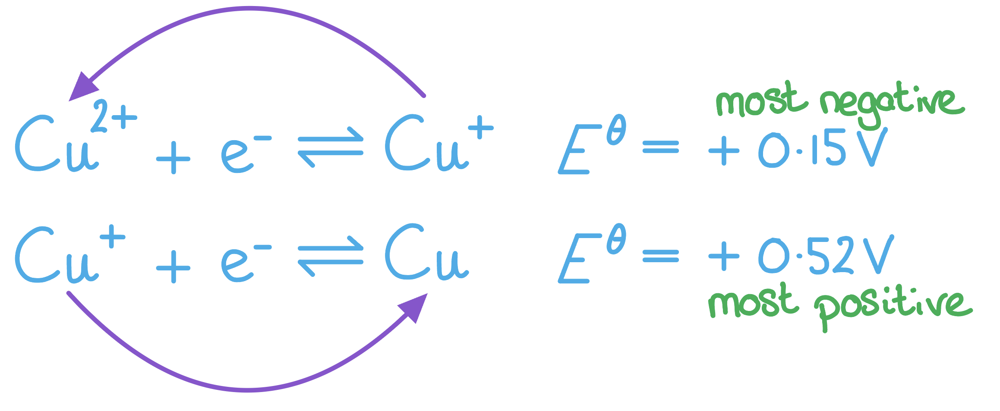

# Mark Schemes — Transition Metal Reactions
**5. Transition Metals & Organic Nitrogen Chemistry** · Edexcel International A Level (IAL) Chemistry (YCH11)

## Q1 — medium — 6 marks · structured-questions

### 14() — 6 marks
The reactions of separate samples of aqueous cobalt(II) sulfate with aqueous sodium hydroxide, excess aqueous ammonia and concentrated hydrochloric acid are:

**Chemical ideas expressed **

Sodium hydroxide

- Pink solution to blue precipitate / pink solution to pink precipitate on standing (deprotonation / precipitation / acid-base)
- [Co(H2O)6]2+ + 2OH− → [Co(H2O)4(OH)2] + 2H2O
**OR**
Co2+ + 2OH− → Co(OH)2
**OR**
CoSO4 + 2NaOH → Co(OH)2 + Na2SO4

For sodium hydroxide, you will not gain the mark for saying the precipitate dissolves in excess NaOH (aq)

Ammonia

- (Formation of) straw / yellow / yellow-brown / brown solution (ligand exchange)
- [Co(H2O)6]2+ + 6NH3 → [Co(NH3)6]2+ + 6H2O
**OR**
[Co(H2O)4(OH)2] + 6NH3 → [Co(NH3)6]2+ + 4H2O + 2OH−
**OR**
Co(OH)2 + 6NH3 → [Co(NH3)6]2+ + 2OH–

Concentrated hydrochloric acid

- (Formation of dark) blue solution (ligand exchange)
- [Co(H2O)6]2+ + 4Cl− (aq) → [CoCl4]2− + 6H2O 
**OR**
[Co(H2O)6]2+ + 4HCl (aq) → [CoCl4]2− + 6H2O + 4H+ 
**OR**
CoSO4 + 4HCl → [CoCl4]2− + 4H+ + SO42−
**OR**
Co2+ + 4Cl− → [CoCl4]2−

**Final answer:** **[Total: 6 marks] **

- *An answer scoring** 6** marks would include*

  - *6 correct marking points **AND **the answer is written in a clear and logical order with points fully explained *
- *An answer scoring** 5** marks would include*

  - *5-4 correct marking points **AND **the answer is written in a clear and logical order with points fully explained *
- *An answer scoring** 4** marks would include*

  - *4-3 correct marking points **AND **the answer has some structure and gives some explained points*
- *An answer scoring **3** marks would include*

  - *3-2 correct marking points **AND **the answer has some structure and gives some explained points*

## Q2 — medium — 6 marks · structured-questions

### 23() — 6 marks
Discussion of

**Chemical ideas expressed**

- Both platinum and V2O5 are heterogeneous catalysts
- There is adsorption of reactants on the (catalyst) surface (this applies to both reactions)
- (In the catalytic converter) adsorbed reactant bonds are weakened / broken allowing reaction to occur more easily (this applies only to the catalytic converter)
- (In the catalytic converter there is) desorption of products from the surface (this applies to both reactions)
- (In the Contact Process the) V2O5 is reduced (to V(III) / V(IV)) and by sulfur dioxide / SO2
- Vanadium species /V(III) / V(IV) is oxidised to V(V) and by oxygen

**Final answer:** **[Total: 6 marks] **

- *An answer scoring** 6** marks would include*

  - *6 correct marking points AND answer is written in a clear and logical order and points fully explained *
- *An answer scoring** 5** marks would include*

  - *5-4 correct marking points AND answer is written in a clear and logical order and points fully explained *
- *An answer scoring** 4** marks would include*

  - *4-3 correct marking points AND answer has some structure and gives some explained points*
- *An answer scoring **3** marks would include*

  - *3-2 correct marking points AND answer has some structure and gives some explained points*
- *You could describe both catalysts as providing an alternative path with a lower activation energy*
- *Remember for heterogenous catalysts the reactants are adsorbed onto the surface, not adsorbed, they then leave the you can indicate that the products leaving the surface of the catalyst*
- *If you have written an equation showing reduction of V**2**O**5** by SO**2** and the subsequent oxidation they do not need to balance to gain a mark *

  - *V**2**O**5** first reduced then (V compound) oxidised *
  
    - *2SO**2** + O**2** ⇌  2SO**3** *
    - *2CO + 2NO → 2CO**2** + N**2*

## Q3 — hard — 22 marks · structured-questions

### 19((a)) — 7 marks
The names are:

- **P** = copper / Cu; **[1 mark]**
- **Q** = hexaaquacopper(II) / [Cu(H2O)6]2+; **[1 mark]**
- **R** = copper(II) hydroxide / Cu(OH)2 / Cu(OH)2(H2O)4; **[1 mark]**
- **S** = copper(II) oxide / CuO; **[1 mark]**
- **T** = tetraamminecopper(II) / [Cu(NH3)4]2+ / [Cu(NH3)4(H2O)2]2+;** [1 mark]**
- **V** = diamminecopper(I) / [Cu(NH3)2]+; **[1 mark] **
- **W** = hexaaquacopper(II) / [Cu(H2O)6]2+; **[1 mark] **

**Final answer:** **[Total: 7 marks] **

- *To form** **compounds **P** and **Q**, CuI undergoes disproportionation*

  - *Copper(I) ions in solution disproportionate to give copper(II) ions and a precipitate of copper*
  - *Cu**+** → Cu + Cu**2+** *
- *To form compound **R**, the light blue CuSO**4** will react with ammonia to form Cu(H**2**O)**4**(OH)**2*

  - *CuSO**4** + 2NH**4**OH → Cu(OH)**2** + (NH**4**)**2**SO**4** **OR** [Cu(H**2**O)**6**]**2+** + 2NH**3** → Cu(H**2**O)**4**(OH)**2** + 2NH**4**+** *
  - *Ammonia acts as a base *
- *With excess ammonia, a dark blue complex is formed *

  - *[Cu(H**2**O)**6**]**2+** + 4NH**3** → [Cu(NH**3**)**4**(H**2**O)**2**]**2+** + H**2**O*
  - *This is ligand substitution which forms compound **T*
- *Heating copper hydroxide (compound **R**) produces copper oxide, CuO, a black solid (compound **S**)*
- *Reacting CuO (compound **S**) with HNO**3** forms Cu(NO**3**)**2** (aq)*

  - *But the species responsible for the blue solution is [Cu(H**2**O)**6**]**2+** **(compound **W**)*
- *Cu**+** in CuI becomes [Cu(NH**3**)**2**]**+** (compound **V**) a colourless solution with the addition of excess ammonia*

### 19((b)) — 6 marks
i) This type of chemical species is:

- Complex(es); **[1 mark] **

ii) **T** is coloured while **V** is colourless because:

- (The colour is due to) transition / promotion of electrons between (split) (3)d subshell / orbitals; **[1 mark] **
- In Cu(II) the d orbitals are partially filled (so electron transitions are possible); **[1 mark] **
- In Cu(I) the d orbitals are full 
**AND**
So, no (electron) transitions are possible; **[1 mark] **

iii) An explanation for the change of **V** into **T** on shaking is:

- Cu(I) is oxidised to Cu(II); **[1 mark] **
- By oxygen in the air; **[1 mark] **

**Final answer:** **[Total: 5 marks] **

- *You can say complex ions, ammine complexes, transition metal complexes, ligand complexes for part (i) *
- *Ions that have completely filled 3d energy levels and ions that have no electrons in their 3d subshells are not coloured*
- *To help answer part (ii) and relate this to copper, you can write out the electronic configurations to help*

  - *Cu is: 1s**2**2s**2**2p**6**3s**2**3p**6**3d**10**4s**1*
  - *For the Cu**+** ion, we remove one electron from 4s**1** leaving us with: 1s**2**2s**2**2p**6**3s**2**3p**6**3d**10*
  - *For the Cu**2+** ion, we remove a total of two electrons (one from the 4s1 and one from the 3d**10**) leaving us with 1s**2**2s**2**2p**6**3s**2**3p**6**3d**9*

- *Cu**+** in CuI becomes [Cu(NH**3**)**2**]**+** (compound **V**) a colourless solution with the addition of excess ammonia*

  - *It will oxidise on shaking, in air, into the deep blue solution of [Cu(NH**3**)**4**(H**2**O)**2**]**2+*

### 19((c)) — 3 marks
i) The ionic equation is:

- 2CuI → Cu + Cu2+ + 2I− 
**OR** 
2Cu+ → Cu + Cu2+; **[1 mark] **

ii) To show that the reaction in part (i) is thermodynamically feasible:

- Identification of the appropriate half-equations and *E*θ values Cu2+ + e− ⇌ Cu+   *E*θ = +0.15 V Cu+ + e− ⇌ Cu   *E*θ = +0.52 V; **[1 mark]**
- Calculation of *E*θ cell for the reaction and states (positive) so is feasible *E*θ cell (= 0.52 − 0.15) = (+)0.37 (V); **[1 mark] **

**Final answer:** **[Total: 3 marks]**

- *For a reaction to be thermodynamically feasible, the value for **E**θ** cell must be positive *

  - *E**θ** cell = **E**θ**R** - **E**θ**L**, where the right-hand side is the most positive **E**θ **OR** **E**θ** cell = **E**θ**Reduction** - **E**θ**Oxidation*
  - *So, **E**θ** cell (= 0.52 − 0.15) = (+)0.37 (V)*
- *You can use the anti-clockwise rule to show the reaction is thermodynamically feasible as well *

  - *Place the most negative standard electrode potential on the top*
  - *Draw an arrow in an anti-clockwise direction from the top right-hand product to the left and the bottom left-hand reactant to the bottom right product *
  - *The species at the start of the arrows will be the reactants in the feasible equation*

### 19((d)) — 6 marks
To calculate the value of n:

- Calculation of moles of thiosulfate in mean titre mol S2O32− = $\frac{26.65\times0.0500}{1000}$ = 1.3325 x 10−3 / 0.0013325 ; **[1 mark] **
- Determines ratio of Cu2+ to S2O32− and gives moles of Cu2+ in 25 cm3 Cu2+ in 25 cm3 = S2O32− = 1.3325 x 10−3; **[1 mark]**
- Calculation of moles of Cu2+ in 250 cm3 Cu2+ in 250 cm3 = 10 x 1.3325 x 10−3 = 1.3325 x 10−2;** [1 mark]**
- Calculation of *M*r of mitscherlichite *M*r of mitscherlichite = 4.26 / 1.3325 x 10−2 = 319.70; **[1 mark]**
- Calculation of *M*r of K2CuCl4 *M*r of K2CuCl4= 2 x 39.1 + 63.5 + 4 x 35.5 = 283.7; **[1 mark]**
- Calculation of moles of water
Mass of water = 319.7 − 283.7 = 36 **AND** moles of water, n = $\frac{36}{18}$ = 2
**OR**
Moles of water, n = $\frac{319.7-283.7}{18}$  = 2; **[1 mark]**

**Final answer:** **[Total: 6 marks] **

- *An alternative method is:*

  - *Mass of K**2**CuCl**4** in sample = 1.3325 x 10**−2** x 283.7 = 3.7803 g*
  - *Mass of water in sample = 4.26 – 3.7803 = 0.47970 *
  - *Mol water in sample = *$\frac{0.47970}{18}$* = 0.026650 **AND** Ratio H**2**O : K**2**CuCl**4** = 0.026650 : 0.013325 = 1 : 2 *
- *Don't forget to scale up from 25 cm**3** to 250 cm**3** by multiplying the number of moles by 10*
- *The equations required are:*

  - *Moles = concentration x volume (dm**3**)*
  - *M**r** = *$\frac{\mathrm{mass}}{\mathrm{moles}}$
  - *Once you have the **M**r **of both the mitscherlichite and K**2**CuCl**4** you can work out the difference in the **M**r**, this will give you the mass of water in the compound*
  - *Dividing this number by the **M**r** of water will give you n*

## Q4 — hard — 18 marks · structured-questions

### 1() — 1 marks
> **[mark-scheme]**
> The uncatalysed reaction is very slow because:
> 
> - The reaction involves two negatively charged ions / anions which repel each other (leading to a high activation energy) **[1 mark]**

> **[exam-tip]**
> For any slow reaction between two ions, always check whether both carry the same sign of charge. Like charges repel, raising the activation energy so that very few collisions have sufficient energy to react.
> 
> Simply stating "both ions are negative" without linking this to repulsion or high activation energy is not sufficient for the mark.

### 2() — 2 marks
> **[mark-scheme]**
> The ionic equations are:
> 
> - 2Fe2+ (aq) + S2O82- (aq) → 2Fe3+ (aq) + 2SO42- (aq) **[1 mark]**
> - 2Fe3+ (aq) + 2I- (aq) → 2Fe2+ (aq) + I2 (aq) **[1 mark]**
> 
> The equations can be shown in either order
> 
> Equations correctly balanced with different multiples are accepted
> 
> Fe2+ regeneration must be shown in one of the steps

> **[exam-tip]**
> The catalyst (Fe2+) must be regenerated at the end of the cycle. If it is not regenerated, it is a reagent not a catalyst.
> 
> Fe2+ acts as:
> 
> - A reducing agent
> 
>   - It reduces S2O82- and is itself oxidised to Fe3+
> - An oxidising agent
> 
>   - It oxidises I- and is itself reduced back to Fe2+
> 
> This variable oxidation state is what makes Fe2+ an effective catalyst

### 3() — 2 marks
> **[mark-scheme]**
> Fe2+ ions are a particularly effective catalyst because:
> 
> - Iron(II) and iron(III) ions can be easily oxidised and reduced (so they easily cycle between the two oxidation states)
> 
> **OR**
> 
> Fe2+ has a variable oxidation state, allowing it to accept electrons from one reagent and donate them to another **[1 mark]**
> 
> - The catalysed steps involve reactions between oppositely charged / positive and negative ions (which lowers the repulsion and activation energy)
> 
> **OR**
> 
> Fe2+ ions are positively charged, so they are electrostatically attracted to both negatively charged reactant ions / S2O82- and I- (which overcomes the repulsion between them) **[1 mark]**

> **[exam-tip]**
> Most students correctly talk about variable oxidation states, gaining the first mark.
> 
> The second mark is the trickier one — make sure you also explain how Fe2+ being positively charged means it is attracted to both negative reactant ions, lowering activation energy.

### 4() — 4 marks
> **[mark-scheme]**
> i) The type of catalysis occurring in this reaction is:
> 
> - Autocatalysis **[1 mark]**

> **[exam-tip]**
> Autocatalysis occurs when one of the products of the reaction also acts as a catalyst for that same reaction.
> 
> The giveaway in the question is that the rate starts slow and increases over time, unlike a normal catalysed reaction where the catalyst is present from the start and the rate is high immediately.

> **[mark-scheme]**
> ii) The catalyst in this reaction is:
> 
> - Mn2+ ions / manganese(II) ions **[1 mark]**

> **[exam-tip]**
> Mn2+ is a product of the reaction that also catalyses it. At the start, no Mn2+ is present, so the rate is very low.
> 
> As the reaction proceeds, Mn2+ accumulates and the rate increases. This self-accelerating behaviour is the defining feature of autocatalysis.
> 
> A common error is writing Mn3+ or Mn4+ as the catalyst, or just writing "manganese" without specifying the ion. The catalyst is specifically Mn2+, the product shown in the equation.

iii) The rate-time graph for the MnO4-/C2O42- reaction is:

**[2 marks]**

> **[mark-scheme]**
> 1 mark for axes correctly labelled with 'Rate' and 'Time'
> 
> 1 mark for a curve that starts at a low, positive, non-zero value on the y-axis, rises to a maximum, and then falls downwards towards the x-axis

> **[exam-tip]**
> The key feature distinguishing an autocatalysed rate-time graph from a normal reaction is the slow start.
> 
> At t = 0, [Mn2+] = 0, so the catalyst is absent and the rate is very low.
> 
> As Mn2+ builds up, the rate increases through a maximum before declining as reactants are used up.
> 
> The shape is often described as sigmoidal (S-shaped on the ascending side).

### 5() — 6 marks
Both the Fe2+-catalysed reaction between I- and S2O82- and the autocatalysed reaction between MnO4- and C2O42- involve homogeneous catalysis: the catalyst and reactants are in the same aqueous phase. In both cases, the catalyst provides an alternative reaction pathway with a lower activation energy, and this involves the transition metal ion cycling between two oxidation states (Fe2+/Fe3+ and Mn7+/Mn2+ respectively).

However, the two systems differ in how the catalyst enters the reaction and how the rate changes over time. Fe2+ is added to the mixture at the start, so the catalyst is present from the beginning and the rate is high initially, then decreases steadily as reactants are consumed. In contrast, Mn2+ is a product of the MnO4-/C2O42- reaction itself. At the start, no Mn2+ is present and the rate is very low. As Mn2+ accumulates, the rate increases through a maximum before declining as reactants are used up.

**[6 marks]**

> **[mark-scheme]**
> This question is marked using indicative points (IPs) and lines of reasoning (LoR).
> 
> 1. Award IP marks using the table below based on the number of indicative points present in the response.
> 2. Award 0, 1, or 2 LoR marks based on the quality of logical development.
> 3. Add the two scores together for the total mark (maximum 6).
> 
> | Number of indicative points | Marks for indicative content |
> |---|---|
> | 6 | 4 |
> | 5–4 | 3 |
> | 3–2 | 2 |
> | 1 | 1 |
> | 0 | 0 |
> 
> **Lines of reasoning (0–2 marks)**
> 
> - 2 marks:
> 
> - Answer demonstrates a clear and sustained line of reasoning; similarities and differences between the two catalytic systems are logically developed with clear linkages throughout
> - 1 mark:
> 
> - Some reasoning is present but the answer lacks full development or the links between the two systems are not clearly sustained
> - 0 marks:
> 
> - Points are listed without development; no logical progression between ideas
> 
> *If any incorrect chemistry is present, deduct mark(s) from the LoR score. If no LoR marks are awarded, do not deduct.*
> 
> **Indicative points (IPs)**
> 
> - Both are homogeneous catalysts / both catalyst and reactants are in the same phase / aqueous solution
> - Both provide an alternative reaction pathway with a lower activation energy
> - Both involve transition metal ions changing / cycling between oxidation states
> - The Fe2+ catalyst is added at the start of the reaction, whereas Mn2+ is produced during the reaction / is a product of the reaction
> - For the Fe2+-catalysed reaction, the rate is highest at the start and steadily decreases as reactants are consumed
> - For the autocatalysed reaction, the rate is slow initially, then increases as Mn2+ is formed, and then decreases as reactants are consumed

> **[exam-tip]**
> Structure your answer in two sections: similarities first, then differences. This makes it easier for the examiner to count IPs and award the lines of reasoning marks.
> 
> The most common failure is addressing only IP1 and IP2 (both homogeneous, both lower activation energy) without tackling the rate-time contrast. IP5 and IP6, which describe how the rate changes over time in each system, are the points that often separate top-band answers. So, make sure you tackle the rate-time contrast, not just the homogeneous-catalyst point.
> 
> Remember that the lines of reasoning marks (up to 2) reward logical development and linkage, not just listing points. Use connecting language to show how the differences in rate profile arise directly from the different sources of catalyst.

### 6() — 2 marks
> **[mark-scheme]**
> The student observes:
> 
> - (The sudden appearance of a) blue-black / blue / black colour **[1 mark]**
> - This shows that all the (sodium) thiosulfate has been used up / reacted (and the iodine is now free to react with the starch) **[1 mark]**
> 
> "When the reaction is complete" or "when iodine is produced / forms" are not accepted

> **[exam-tip]**
> The sodium thiosulfate acts as a chemical clock: it continuously removes I2 as it forms:
> 
> 2S2O32- (aq) + I2 (aq) → S4O62- (aq) + 2I- (aq)
> 
> Only when all the thiosulfate is used up does I2 accumulate and give the blue-black starch colour.
> 
> A shorter time to colour change means a faster initial rate. The fixed amount of thiosulfate means all experiments consume the same quantity of I2 before the colour appears, making times directly comparable.

### 7() — 1 marks
> **[mark-scheme]**
> The effect on the time taken is:
> 
> - The time taken / t is halved
> **OR**
> The colour appears in half the time **[1 mark]**
> 
> Answers like "shorter" or "decreases" alone without a specific quantitative statement are not accepted

> **[exam-tip]**
> Doubling [I-] doubles the rate of reaction, as the reaction is first order with respect to I- (rate ∝ [I-]).
> 
> A doubled rate means I2 is produced twice as quickly, so the fixed amount of thiosulfate is consumed in half the time. Rate and time are inversely proportional.
> 
> A common error is stating that the time doubles, confusing the direct relationship between rate and concentration with the inverse relationship between rate and time.

## Q5 — easy — 1 marks · multiple-choice-questions

### 6() — 1 marks
**Correct answer: D** — pink solution → blue precipitate → yellow‐brown solution

**Final answer:** **The correct answer is ****D**** because:**

- CoCl2 (aq) is a pink solution
- As ammonia is added, a blue precipitate of Co(OH)2(H2O)4 forms
- Further addition of ammonia dissolves the blue precipitate into a yellow-brown solution of [Co(NH3)6]2+

**A** and **C** are incorrect as CoCl2 (aq) is a pink solution

**B** is incorrect as  the blue precipitate dissolves in excess aqueous ammonia to form a yellow-brown solution

## Q6 — medium — 1 marks · multiple-choice-questions

### 1() — 1 marks
**Correct answer: B** — 

**Final answer:** **The correct answer is ****B**** because: **

- The overall equation for the reaction of ethene with potassium manganate(VII) solution in acidic conditions is: 5C2H4 + 2H2O + 2MnO4– + 6H+ → 5CH2OHCH2OH + 2Mn2+
- The manganate(VII) ions / MnO4– ion are reduced to manganese(II) ions Mn2+   MnO4– + 8H+ + 5e– → Mn2+ + 4H2O

  - The manganese has gained electrons
  - The oxidation number of manganese decreases from +7 in MnO4– to +2 in Mn2+

**A** is incorrect as  the oxidation number of manganese decreases

**C **is incorrect as** **manganese gains electrons **AND **its oxidation number decreases

**D **is incorrect as** **manganese gains electrons

## Q7 — medium — 1 marks · multiple-choice-questions

### 7() — 1 marks
**Correct answer: D** — 

**Final answer:** **The correct answer is ****D**** because:**

- Initially the green precipitate, Fe(OH)2(H2O)4 is formed
- When left in air, the iron(II) is oxidised to iron(III) forming the brown precipitate, Fe(OH)3(H2O)3

**A** is incorrect as Fe(OH)2 is green (initially)

**B** is incorrect as  the precipitate turns brown on standing

**C** is incorrect as  Fe(OH)2 is green (initially)

## Q8 — medium — 1 marks · multiple-choice-questions

### 8() — 1 marks
**Correct answer: D** — the products cause no harm to the environment

**Final answer:** **The correct answer is ****D**** because:**

- Catalytic converters turn pollutants such as nitrogen oxide and unburnt hydrocarbons into less harmful products

  - 2NO (g) + 2CO (g) → N2 (g) + 2CO2 (g)
  - CH3CH2CH3 (g) + 5O2 (g) → 3CO2 (g) + 4H2O (g)
  - Carbon dioxide is still harmful to the environment as it contributes to climate change

**A** is incorrect as  the reactions occurring in catalytic converters involve heterogeneous catalysis

**B** is incorrect as  carbon monoxide is adsorbed onto the surface of the catalyst

**C** is incorrect as nitrogen is desorbed from the surface of the catalyst

## Q9 — medium — 1 marks · multiple-choice-questions

### 8() — 1 marks
**Correct answer: A** — 

**Final answer:** **The correct answer is ****A**** because:**

- When aqueous ammonia is added to an aqueous solution of zinc sulfate, a white precipitate forms

  - [Zn(H2O)6]2+ (aq) + 2OH- (aq) → [Zn(H2O)4(OH)2] (s) + 2H2O (l)
- The formation of the white precipitate is a deprotonation reaction as the two hydroxide ions remove hydrogen ions from two water ligands, forming two hydroxide ligands
- **Careful**: Whilst it may look like a ligand substitution reaction, you need to know that 2 water molecules are not replaced by hydroxide ions and understand how deprotonation occurs
- The white precipitate dissolves in excess ammonia to give a colourless solution in a ligand substitution reaction as two water molecules and two hydroxide ions are replaced by four ammonia molecules

  - [Zn(H2O)4(OH)2] (s) + 4NH3 (aq) → [Zn(NH3)4(H2O)2]2+ (aq) + 2H2O (l) + 2OH- (aq)

**B** is incorrect as  the formation of the ammine complex involves ligand exchange

**C** is incorrect as  the formation of the precipitate involves deprotonation of water ligands and the formation of the ammine complex involves ligand exchange

**D** is incorrect as the formation of the precipitate involves deprotonation of water ligands

## Q10 — medium — 1 marks · multiple-choice-questions

### 9() — 1 marks
**Correct answer: C** — Mn2+

**Final answer:** **The correct answer is ****C**** because:**

- In the reaction with ethanedioate ions, manganese(II) ions take part in a redox cycle between two different oxidation states (+2 **→  **+3 **→ **+2)

4Mn2+ (aq)  +  MnO4– (aq) + 8H+ (aq)   →   5Mn3+ (aq)  + 4H2O (aq)

2Mn3+ (aq)  +  C2O42- (aq)  →  2CO2 (g) +  2Mn2+ (aq)

- The manganese(II) ion is not present at the beginning of the reaction

  - It forms during the reaction and speeds it up while being re-generated during the redox cycle

**A** is incorrect as  MnO4– ions are neither a product nor a catalyst in this reaction

**B** is incorrect as  H+ ions are neither a product nor a catalyst in this reaction

**D** is incorrect as  CO2 is not a catalyst in this reaction

## Q11 — medium — 1 marks · multiple-choice-questions

### 9() — 1 marks
**Correct answer: D** — Fe2+ is readily oxidised to Fe3+ which is then reduced to Fe2+

**Final answer:** **The correct answer is ****D**** because: **

- The reaction between iodide ions and peroxodisulfate ions is slow as they are both negatively charged
- Iron(II) ions reduce the peroxodisulfate ions to sulfate ions

  - This produces iron(III) ions in the process S2O82- + 2Fe2+  →  2SO42-   + 2Fe3+

- The iron(III) ions then oxidise iodide ions to iodine

  - This produces iron(II) ions which can be re-used in the reduction of peroxodisulfate ions 2I- + 2Fe3+  →  I2   +  2Fe2+

**A** is incorrect as Fe2+ does not react with iodide ions

**B **is incorrect as** **the number of outer electrons is not a factor in homogeneous catalysis

**C **is incorrect as** **the number of active sites is a factor in heterogeneous catalysis not in homogeneous catalysis

## Q12 — medium — 1 marks · multiple-choice-questions

### 1() — 1 marks
**Correct answer: C** — +5 → +4 → +5

**Final answer:** **The correct answer is C**

- The catalyst starts as V2O5, where vanadium is in the +5 oxidation state

- Step 1:

- V5+ is reduced to V4+
- SO2 is oxidised to SO3

SO2 + V2O5 → SO3 + V2O4

- Step 2:

- V4+ is re-oxidised to V5+ by O2, regenerating the catalyst

V2O4 + ½O2 → V2O5

- The vanadium cycles: +5 → +4 → +5

**A** is incorrect as the +2 oxidation state is reached when vanadium is reduced completely by zinc in the laboratory. In the Contact process, the catalytic cycle only involves the +4 and +5 states.

**B** is incorrect as the catalyst starts as V2O5, where vanadium is in the +5 oxidation state, not +4. The correct sequence is +5 → +4 → +5, not +4 → +5 → +4.

**D** is incorrect as +6 is not a stable oxidation state for vanadium. Vanadium has only 5 valence electrons and cannot exceed an oxidation state of +5.

## Q13 — hard — 1 marks · multiple-choice-questions

### 10() — 1 marks
**Correct answer: A** — both Fe2+(aq) and Fe3+(aq) catalyse the reaction

**Final answer:** **The correct answer is ****A**** because: **

- Iron(II) ions reduce the peroxodisulfate to sulfate ions and produces iron(III) in the process

  - S2O82- + 2Fe2+  →  2SO42-   + 2Fe3+
- The iron(III) ions will oxidise iodide ions to iodine and then are reduced once again to iron(II)

  - 2I- + 2Fe3+  →  I2   +  2Fe2+

**B**, **C** and **D** are incorrect as  both Fe2+ (aq) and Fe3+ (aq) catalyse the reaction
