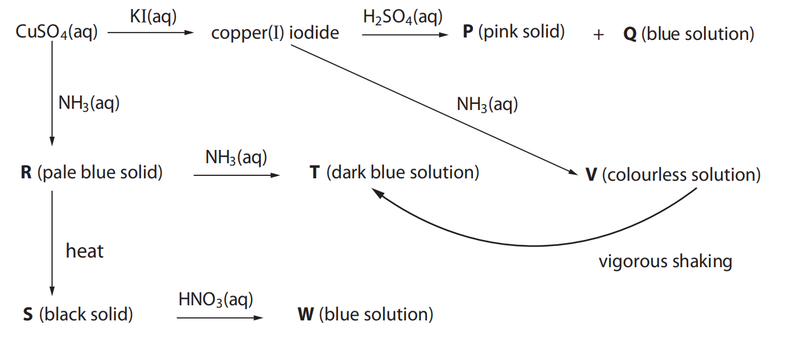

# Exam Questions — Transition Metal Reactions
**5. Transition Metals & Organic Nitrogen Chemistry** · Edexcel International A Level (IAL) Chemistry (YCH11)
> Source: [https://www.savemyexams.com/international-a-level/chemistry/edexcel/17/topic-questions/5-transition-metals-and-organic-nitrogen-chemistry/5-3-transition-metal-reactions/structured-questions/](https://www.savemyexams.com/international-a-level/chemistry/edexcel/17/topic-questions/5-transition-metals-and-organic-nitrogen-chemistry/5-3-transition-metal-reactions/structured-questions/) · 13 questions · total 61 marks

## Q1 — medium — 6 marks · structured-questions

### 14() — 6 marks — command: describe — structured — from paper Jan 2022 · WCH15/01
Describe the reactions of separate samples of aqueous cobalt(II) sulfate with aqueous sodium hydroxide, excess aqueous ammonia and concentrated hydrochloric acid.

For each reaction, link your description to an appropriate equation.

State symbols are not required.

## Q2 — medium — 6 marks · structured-questions

### 23() — 6 marks — command: contrast — structured — from paper Jan 2021 · WCH15/01
Compare and contrast the mechanism of the action of platinum as a catalyst in the removal of pollutants from car engine exhaust fumes with that of vanadium(V) oxide as a catalyst in the Contact Process for the manufacture of sulfuric acid.

General definitions of catalysts are **not** required.

## Q3 — hard — 22 marks · structured-questions

### 19((a)) — 7 marks — command: identify — structured — from paper Jan 2021 · WCH15/01
The diagram summarises some reactions of copper compounds.

Identify, by name (including the oxidation state) or formula, the species in the sequence that contain copper.

**P** ......................................................
**Q **......................................................
**R** ......................................................
**S** ......................................................
**T** ......................................................
**V** ......................................................
**W** ......................................................

### 19((b)) — 6 marks — command: multiple — structured — from paper Jan 2021 · WCH15/01
**T** and **V** are the same type of chemical species.

i) Name this type of chemical species.

**(1)**

ii) Explain why **T** is coloured while **V** is colourless.

A detailed explanation of the fact that **T** is coloured is **not** required.

**(3)**

iii) Suggest an explanation for the change of **V** into **T** on shaking.

**(2)**

### 19((c)) — 3 marks — command: multiple — structured — from paper Jan 2021 · WCH15/01
The reaction between copper(I) iodide and sulfuric acid is a disproportionation.

i) Write the **ionic** equation for this disproportionation reaction.

State symbols are not required.

**(1)**

ii) Show that the reaction in (c)(i) is thermodynamically feasible.

Use the standard electrode potentials of the relevant half-cells from the Data Booklet.

**(2)**

### 19((d)) — 6 marks — command: calculate — structured — from paper Jan 2021 · WCH15/01
The rare mineral mitscherlichite has the chemical formula K2CuCl4⦁nH2O.

4.26 g of mitscherlichite was dissolved in distilled water and the solution made up to 250.0 cm3. Excess potassium iodide solution was added to a 25.0 cm3 portion of this solution and the iodine formed was titrated against a solution of sodium thiosulfate with a concentration of 0.0500 mol dm−3.

This procedure was repeated until concordant results were obtained. The mean accurate titre was 26.65 cm3. The equations for the reactions are

$2\mathrm{Cu}^{2+}+4I^{-}\rightarrow2\mathrm{CuI}+I_{2}\,2S_{2}O_{3}^{2-}+I_{2}\rightarrowS_{4}O_{6}^{2-}+2I^{-}$

Calculate the value of n, the number of moles of water of crystallisation per mole of mitscherlichite.

## Q4 — hard — 18 marks · structured-questions

### 1() — 1 mark — command: explain — structured
Iron(II) ions catalyse the reaction between iodide ions and peroxodisulfate ions:

S2O82- (aq) + 2I- (aq) → 2SO42- (aq) + I2 (aq)

Without a catalyst, this reaction is extremely slow. The reaction profile for this reaction is shown.

![A reaction energy profile showing two curves against axes labelled Energy (y) and Reaction progress (x). A solid line shows the uncatalysed reaction with a single tall peak; a dashed line shows the Fe2+ catalysed reaction with two smaller humps separated by a trough labelled Intermediate. Upward arrows indicate Ea (uncatalysed) from the reactants level to the uncatalysed peak, Ea1 from the reactants level to the first catalysed peak, and Ea2 from the intermediate trough to the second catalysed peak. The products level is lower than the reactants level.](assets/001-a-reaction-energy-profile-showing-two-curves-aga.png)

Explain why the uncatalysed reaction between I− and S2O82− ions is very slow.

### 2() — 2 marks — command: write — structured
Fe2+ ions catalyse this reaction in two steps. Write ionic equations for each step of the catalytic cycle.

### 3() — 2 marks — command: explain — structured
Explain why Fe2+ ions are a particularly effective catalyst for this reaction.

### 4() — 4 marks — command: multiple — structured
The reaction between manganate(VII) ions and ethanedioate ions is also slow when the reactants are first mixed, but the rate increases significantly as the reaction proceeds:

2MnO4- (aq) + 5C2O42- (aq) + 16H+ (aq) → 2Mn2+ (aq) + 10CO2 (g) + 8H2O (l)

i) Name the type of catalysis occurring in this reaction.

[1]

ii) Identify the catalyst in this reaction.

[1]

iii) Sketch a graph of rate against time for the MnO4-/C2O42- reaction on the axes, starting from the moment the reactants are first mixed. Label the axes.

[2]

### 5() — 6 marks — command: contrast — structured
(*) Compare and contrast the homogeneous catalysis of the reaction between I- and S2O82- by Fe2+ ions with the autocatalysis of the reaction between MnO4- and C2O42- by Mn2+ ions.

In your answer, you should include:

- similarities between the two catalytic systems
- differences, including how the rate changes over time in each case

### 6() — 2 marks — command: explain — structured
A student investigates the rate of the Fe2+-catalysed reaction using the iodine clock method. A small, fixed amount of sodium thiosulfate solution and starch indicator are added to the reaction mixture at the start.

Describe what the student observes and explain what this shows.

### 7() — 1 mark — command: predict — structured
The same experiment is repeated with the concentration of I− doubled but all other concentrations kept constant.

Predict the effect on the time taken for the blue-black colour to appear.

## Q5 — easy — 1 marks · multiple-choice-questions

### 6() — 1 mark — multiple_choice — from paper Oct 2021 · WCH15/01
Aqueous ammonia is added drop by drop to a solution of cobalt(II) chloride, CoCl2(aq), until in excess.

What would be the sequence of observations?
- **A.** blue solution → pink precipitate → dark blue solution
- **B.** pink solution → blue precipitate
- **C.** blue solution → pink precipitate
- **D.** pink solution → blue precipitate → yellow‐brown solution

## Q6 — medium — 1 marks · multiple-choice-questions

### 1() — 1 mark — multiple_choice — from paper Jan 2021 · WCH15/01
When an alkene is added to a solution of potassium manganate(VII), the purple solution turns colourless.

In terms of electron transfer and oxidation number, how does the manganese change in this reaction?

|   | ** ** | **Electron transfer** | **Oxidation number** |
|---|---|---|---|
| ☐ | **A** | gains electrons | increases |
| ☐ | **B** | gains electrons | decreases |
| ☐ | **C** | loses electrons | increases |
| ☐ | **D** | loses electrons | decreases |
- **A.** 
- **B.** 
- **C.** 
- **D.** 

## Q7 — medium — 1 marks · multiple-choice-questions

### 7() — 1 mark — multiple_choice — from paper June 2021 · WCH15/01
Aqueous sodium hydroxide was added to aqueous iron(II) sulfate and the mixture allowed to stand.

What would be observed?

|   |   | **Observations** |   |
|---|---|---|---|
|   |   | **Immediately after adding** **sodium hydroxide** | **After standing** |
| □ | **A** | brown precipitate | no change |
| □ | **B** | green precipitate | no change |
| □ | **C** | brown precipitate | precipitate turns green |
| □ | **D** | green precipitate | precipitate turns brown |
- **A.** 
- **B.** 
- **C.** 
- **D.** 

## Q8 — medium — 1 marks · multiple-choice-questions

### 8() — 1 mark — multiple_choice — from paper Oct 2021 · WCH15/01
Which of the following is **not** true of the reactions occurring in the catalytic converter fitted to a car exhaust?
- **A.** they involve heterogeneous catalysis
- **B.** carbon monoxide is adsorbed onto the surface of the catalyst
- **C.** nitrogen is desorbed from the surface of the catalyst
- **D.** the products cause no harm to the environment

## Q9 — medium — 1 marks · multiple-choice-questions

### 8() — 1 mark — multiple_choice — from paper June 2021 · WCH15/01
When aqueous ammonia is added to an aqueous solution of zinc sulfate, a white precipitate forms which dissolves in excess ammonia to give a colourless solution.

What types of reaction are occurring?

|   |   | **Type of reaction** |   |
|---|---|---|---|
|   |   | **Formation of white** **precipitate** | **Formation of colourless** **solution** |
| □ | **A** | deprotonation | ligand exchange |
| □ | **B** | deprotonation | deprotonation |
| □ | **C** | ligand exchange | deprotonation |
| □ | **D** | ligand exchange | ligand exchange |
- **A.** 
- **B.** 
- **C.** 
- **D.** 

## Q10 — medium — 1 marks · multiple-choice-questions

### 9() — 1 mark — multiple_choice — from paper Oct 2021 · WCH15/01
The reaction of ethanedioate ions, C2O42–, with manganate(VII) ions, MnO4–, in acidic solution involves autocatalysis.

2MnO4– + 16H++ 5C2O42– → 2Mn2+ + 10CO2 + 8H2O

The catalyst in this reaction is
- **A.** Mn$O_{4}^{-}$
- **B.** H+
- **C.** Mn2+
- **D.** CO2

## Q11 — medium — 1 marks · multiple-choice-questions

### 9() — 1 mark — multiple_choice — from paper Jan 2021 · WCH15/01
Iodide ions are oxidised by peroxodisulfate ions in aqueous solution.

$2I^{-}+S_{2}O_{8}^{2-}\rightarrowI_{2}+2\mathrm{SO}_{4}^{2-}$

This reaction is catalysed by adding Fe2+ ions to the solution. This catalysis is effective because
- **A.** Fe2+ reacts with iodide ions and with peroxodisulfate ions
- **B.** Fe2+ has many electrons in its outermost subshells
- **C.** Fe2+ has many active sites on which the reaction can occur
- **D.** Fe2+ is readily oxidised to Fe3+ which is then reduced to Fe2+

## Q12 — medium — 1 marks · multiple-choice-questions

### 1() — 1 mark — multiple_choice
In the Contact process, vanadium(V) oxide (V2O5) acts as a heterogeneous catalyst. Which sequence correctly shows the changes in oxidation state of vanadium during the catalytic cycle?
- **A.** +2 → +5 → +2
- **B.** +4 → +5 → +4
- **C.** +5 → +4 → +5
- **D.** +5 → +6 → +5

## Q13 — hard — 1 marks · multiple-choice-questions

### 10() — 1 mark — multiple_choice — from paper Oct 2021 · WCH15/01
Iodide ions, I–, are oxidised by peroxodisulfate(VI) ions, S2$O_{8}^{2-}$.

2I–(aq) + S2$O_{8}^{2-}$(aq) → I2(aq) + 2S$O_{4}^{2-}$(aq)

Which of the following statements is **true** of this reaction?
- **A.** both Fe2+(aq) and Fe3+(aq) catalyse the reaction
- **B.** Fe2+(aq) catalyses the reaction but Fe3+(aq) does not
- **C.** Fe3+(aq) catalyses the reaction but Fe2+(aq) does not
- **D.** neither Fe2+(aq) nor Fe3+(aq) catalyses the reaction
