# Mark Schemes — Organic Chemistry: Arenes
**5. Transition Metals & Organic Nitrogen Chemistry** · Edexcel International A Level (IAL) Chemistry (YCH11)

## Q1 — medium — 19 marks · structured-questions

### 19((a)) — 2 marks
A chemical test, including the result, that could distinguish the Dewar structure from benzene is:

Any **one** of the following:

Option 1:

- Bromine / bromine water / Br2 (aq) / Br2 (l) / Br2 in an organic solvent; **[1 mark]**
- Bromine / bromine water decolourises with the Dewar structure
**OR**
The bromine water changes from brown / orange / yellow to colourless with the Dewar structure
**OR**
The bromine changes from red / brown / orange to colourless with the Dewar structure
**OR**
Bromine / water does not decolourise with benzene; **[1 mark]**

Option 2:

- Potassium manganate(VII) / KMnO4
**AND**
Acidified / with a named acid / H+; **[1 mark]**
- Potassium manganate(VII) decolourises with the Dewar structure
**OR**
The potassium manganate(VII) changes from pink / purple to colourless with the Dewar structure
**OR**
Potassium manganate(VII) does not decolourise with benzene; **[1 mark]**

**[Total: 2 marks]**

- *The most common correct answer to this question was the bromine unsaturation test *
- *The Dewar structure contains two distinct carbon-to-carbon double bonds / C=C*

  - *These will react to decolourise bromine / bromine water*
- *In benzene, there are no distinct carbon-to-carbon double bonds / C=C as the electrons of all the carbon-to-carbon double bonds are delocalised in the ring system*

  - *This means that there are no C=C to provide a positive test with bromine / bromine water *

### 19((b)) — 2 marks
**One** similarity and **one** difference in the** low** resolution proton NMR spectra of the Ladenburg structure and benzene would be:

Similarity:

- Both compounds have <u>one</u> peak / proton environment; **[1 mark]**

Difference:

- The chemical shift for benzene is in the range of 6.4 to 8.4 ppm (actual value is 7.3 ppm) 
**AND** 
The chemical shift for the Ladenburg structure is in the range of 0 to 2.3 ppm (actual value is 2.3 ppm); **[1 mark]**

**[Total: 2 marks]**

- *The hydrogens in the Ladenburg structure are all in the same environment so they will give one peak in the low resolution proton NMR spectra*
- *The hydrogens in the benzene structure are, also, all in the same environment so they will give one peak in the low resolution proton NMR spectra*
- *The question instructs you to give data from the Data Booklet, so look up the relevant chemical shifts and state them*

  - *The Ladenburg structure is not aromatic so these protons are in the range of 0 - 2.3 ppm*
  - *The benzene structure is aromatic so these protons are in the range of 6.4 - 8.3 ppm*

### 19((c)) — 2 marks
X‐ray diffraction shows that benzene has a delocalised structure and **not **a Kekulé structure because it shows that:

For benzene:

- All of the carbon-carbon bonds are the same length
**OR**
It is a regular hexagon
**OR**
It contains only one type of carbon-carbon bond
**OR**
The bond lengths are in between C=C and C–C; **[1 mark]**

For the Kekulé structure:

- The C=C bonds would be shorter than the C–C bonds
**OR**
There are two different lengths / types of carbon-carbon bond
**OR**
It would have alternating carbon-carbon bond lengths; **[1 mark]**

**[Total: 2 marks]**

- *The Kekulé structure has alternating single and double carbon-carbon bonds*

  - *Single carbon-carbon bonds are roughly 154 ppm*
  - *Double carbon-carbon bonds are roughly 134 ppm*
- *All of the carbon-carbon bonds in benzene are roughly 139 ppm*

  - *This is intermediate of a single and double carbon-carbon bond*

### 19((d)) — 3 marks
i) A **labelled** enthalpy level diagram showing the relative thermodynamic stability of the Ladenburg structure, the Dewar structure and benzene, including the enthalpy change values in kJ mol–1, is:

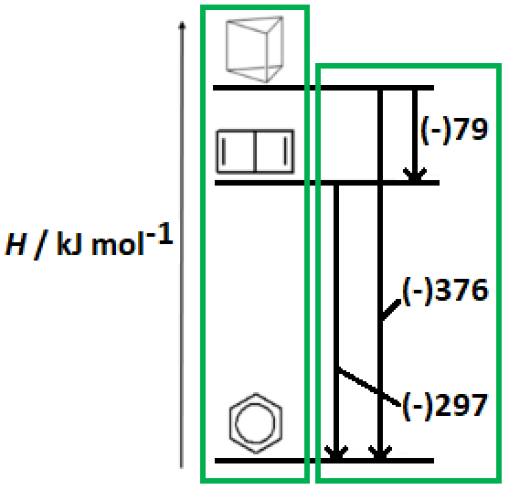

- Correct relative stabilities (left-hand box); **[1 mark]**
- Two / three <u>**correct**</u> numerical differences in enthalpy with appropriate arrows (right-hand box); **[1 mark]**

ii) A possible reason why the isomerisation of the Dewar structure to benzene has a lower activation energy than that of the Ladenburg structure to benzene is:

- π / pi bonds are weaker / more reactive / require less energy to break (than sigma bonds)
**OR**
Fewer bonds must break to convert the Dewar structure to benzene; **[1 mark]**

**[Total: 3 marks]**

- *For part (i)*

  - *The information given in the question guides you to the fact that the Ladenburg structure will be the highest on the enthalpy level diagram, followed by the Dewar structure and benzene at the bottom*
  - *You can also calculate that the enthalpy change from the Ladenburg structure to the Dewar structure is 37 - 297 = 79 kJ mol**-1** *
- *For part (ii)*

  - *This question was not answered well when this was a previous exam question*
  - *There were lots of nonspecific answers:*
  
    - *Weaker bonds in the Dewar structure*
    - *The Dewar structure contains pi / double bonds*
    - *The Dewar structure is more similar to benzene*
    - *The Dewar structure already has a hexagon / ring structure*
  - *The key difference is the presence of pi bonds in the Dewar structure but this needs to be qualified with how they are weaker / more reactive than sigma bonds*

### 19((e)) — 2 marks
Explanations for **both** of these enthalpy changes of hydrogenation in relation to the value for hex‐3‐ene:

*E*-hexa-1,4-diene:

- It is twice the hydrogenation enthalpy (of hex-3-ene) because there are two (isolated) C=C bonds
**OR**
-118 x 2 = -236 kJ mol-1 because there are two (isolated) C=C bonds
**OR**
It is twice the hydrogenation enthalpy as no delocalisation of pi-bond(s); **[1 mark]**

*E*-hexa-1,3-diene:

- It is less exothermic / less negative / more positive / more stable (by 22 kJ mol–1 than *E*-hexa-1,4-diene **AND **because there is some delocalisation of the pi / double bond(s) 
**OR**
It is less exothermic / less negative / more positive / more stable (by 22 kJ mol–1 than *E*-hexa-1,4-diene **AND **because the pi bond(s) / double bond(s) / p-orbitals are conjugated 
**OR**
It is less exothermic / less negative / more positive / more stable (by 22 kJ mol–1 than *E*-hexa-1,4-diene **AND **because the pi bond(s) / double bond(s) / p-orbitals are close enough to overlap; **[1 mark]**

**[Total: 2 marks]**

- *In **E**-hexa-1,4-diene, the carbon-carbon double bonds are far enough apart that there is no delocalisation *

  - *This results in the enthalpy of hydrogenation being double that of hex-3-ene, as expected*
- *In **E**-hexa-1,3-diene, the carbon-carbon double bonds are close enough for delocalisation to occur, just like comparing benzene with cyclohexa-1,3,5-triene*

  - *This results in the enthalpy of hydrogenation for **E**-hexa-1,3-diene being less exothermic than expected*

### 19((f)) — 8 marks
i) The **skeletal** formulae of the** three **different arenes with the formula CH3COC6H4CH3 are:

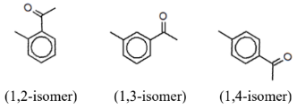

- One correct skeletal formula; **[1 mark]**
- Three correct skeletal formulae; **[2 marks]**

ii) Compound **X** is:

- The 1,4-isomer / para-isomer
**OR**
1-(4-Methylphenyl)ethanone
**OR**
1-para-methylphenylethanone; **[1 mark]**

Justification:

- There are 7 peaks consistent with 7 carbon environments
**OR**
The 1,2-isomer **AND **1,3-isomer would have 9 peaks / carbon environments
**OR**
There are 4 arene peaks consistent with 4 arene carbon environments
**OR**
The 1,2-isomer **AND **1,3-isomer would have 6 arene peaks / arene carbon environments; **[1 mark]**

iii) The completed mechanism for the formation of compound **X** in this reaction is:

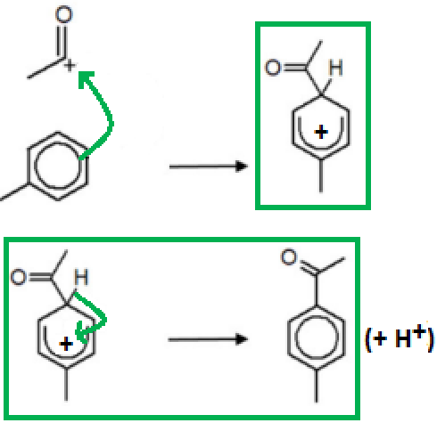

- Curly arrow from on or within the circle of benzene to the C+ of CH3CO+; **[1 mark]**
- Correct structure of the intermediate ion; **[1 mark]**
- Curly arrow from the C–H bond to within the ring
**AND**
Correct product; **[1 mark]**

Regeneration of the catalyst:

- AlCl4– + H+ → AlCl3 + HCl; **[1 mark]**

**[Total: 8 marks]**

- *Starting with the CH**3**COC**6**H**4**CH**3** formula, there is a CH**3**CO- and a CH**3** group substituted onto a benzene ring*

  - *These two groups can only be placed on:*
  
    - *Carbons 1 and 2*
    - *Carbons 1 and 3*
    - *Carbons 1 and 4*
- *You can then use the structures that you draw to identify the number of carbon environments in each isomer*

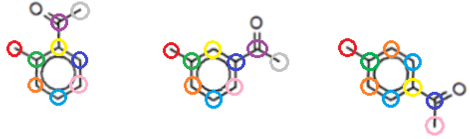

- *Tip:** It can help to look for symmetry in the isomers*

  - *The 1,2-isomer and 1,3-isomer have no symmetry resulting in 9 different carbon environments *
  - *The 1,4-isomer has a line of symmetry running through carbons 1 and 4 of the ring structure resulting in 7 different carbon environments *
- *The mechanism for this reaction is a standard electrophilic substitution mechanism*

  - *You have to know the equations for the formation of the electrophile using a metal halide carrier / catalyst such as aluminium chloride as well as how the metal halide carrier / catalyst is regenerated*

## Q2 — medium — 12 marks · structured-questions

### 20((a)) — 5 marks
i) The enthalpy of combustion of the theoretical compound ‘cyclohexa-1,3,5-triene’ is:

- The difference between the enthalpies of combustion of cyclohexene and cyclohexa-1,4-diene: −3752 – (− 3584) = −168 (kJ mol−1); **[1 mark]**
- The enthalpy of combustion of cyclohexa-1,3,5-triene: −3584 − (−168) = −3416 (kJ mol−1) 
**OR** 
−3752 – 2 x (−168) = −3416 (kJ mol−1); **[1 mark]**

ii) The reason for the difference between the enthalpy of combustion of ‘cyclohexa-1,3,5-triene’ calculated in (a)(i) and the enthalpy of combustion of benzene given in the table is:

- Calculation of the difference between the enthalpies of combustion of benzene and cyclohexa-1,3,5-triene: −3416 − (−3267) = −149 (kJ mol−1); **[1 mark]**
- Benzene is more stable than cyclohexa-1,3,5-triene by 149 (kJ mol−1)
**OR**
The enthalpy of combustion of benzene is less negative / less exothermic / lower than that of cyclohexa-1,3,5-triene
**AND**
So benzene is more stable; **[1 mark]**
- (Benzene is more stable) because the π electrons in benzene are delocalised
**OR**
Benzene has delocalisation energy / resonance stability / bonds delocalised; **[1 mark]**

**[Total: 5 marks]**

- *This question assesses your ability to use enthalpy changes to give evidence for the structure and stability of the benzene ring*
- *You would not be awarded marks for references to bond length*
- *In part (i), assume that the difference in enthalpy change of combustion between cyclohexane and cyclohexa-1,4-diene is the enthalpy change of combustion of the extra double bond in cyclohexa-1,4-diene*

  - *You do not need to give a sign for this difference of 149 kJ mol**-1** to gain this first mark *
- *As cyclohexa-1,3,5-triene has a third double bond, its theoretical enthalpy change of combustion will be:*

  - *Δ**c**H **(cyclohexa-1,4-diene) + Δ**c**H **(C=C double bond) **OR*
  - *Δ**c**H **(cyclohexene) + 2 x Δ**c**H **(C=C double bond)*
- *In part (ii), you would not be awarded the 2nd mark if the enthalpy change of combustion of benzene is more negative that the value you calculated for cyclohexa-1,3,5-triene*

### 20((b)) — 4 marks
To compare and contrast the reactions of bromine with cyclohexene to form 1,2-dibromocyclohexane, and with benzene to form bromobenzene:

Any **four** from:

Similarities

- Both reactions involve electrophilic attack; **[1 mark]**
- Both reactions form a carbonation; **[1 mark]**

Differences

- The reaction with benzene is substitution (because the stable benzene ring is retained / restored); **[1 mark]**
- The reaction with cyclohexene is addition (because σ bonds stronger than π bonds); **[1 mark]**
- The reaction with benzene requires a catalyst (and heat) 
**AND** 
Whereas the reaction with cyclohexene occurs under normal laboratory conditions / does not require catalyst / heat; **[1 mark]**

**[Total: 4 marks]**

- *You would be awarded a mark for just stating electrophilic*
- *If you incorrectly identified the reactions, e.g. as nucleophilic instead of electrophilic, you would still gain the marks for correctly identifying the reaction with benzene as substitution and with cyclohexane as addition*
- *Bromination occurs readily in alkenes due to the high electron density of the localised electrons in the π bond of the C=C double bond*
- *This causes a dipole in a bromine molecule and the δ+ bromine is attracted to the π bond and an electrophilic addition reaction occurs*
- *As benzene does not contain localised electrons but electrons that are delocalised around the ring, it does not contain a high area of electron density and cannot polarise bromine molecules*
- *In order for benzene to react with bromine, a halogen carrier, e.g. AlBr**3**, is required*

### 20((c)) — 3 marks
i) The organic product when phenol reacts with **excess** bromine is:

- 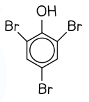 **OR** 

2,4,6-tribromophenol; **[1 mark]**

ii) Bromine reacts much faster with phenol than with benzene because:

- The lone pair of electrons on the oxygen / OH; **[1 mark]**
- Which overlap / interact with the π electrons of the ring **OR** the lone pair is donated to the π electrons of the ring
**AND**
This increases its electron density **OR **This makes it more susceptible to electrophilic attack; **[1 mark]**

**[Total: 3 marks]**

- *You need to be able to explain the reactivity of phenol with benzene, so make sure you learn this*
- *A halogen carrier is not required with phenol, as it is with benzene, and the reaction is carried out at room temperature*
- *Remember**: The -OH group is activating so it will direct incoming electrophiles to the 2, 4 and 6  positions*

  - *If you have given the name and formula, both must be correct*
  - *However, you would gain the mark for the correct structure with the name tribromophenol*
- *You would not gain credit for any reference to the reactivity of the ring increasing, or phenol being a nucleophile*

## Q3 — medium — 20 marks · structured-questions

### 24((a)) — 5 marks
i) The diagram indicates about the bonding in caffeine by:

- (π) electron system (in the right-hand ring) is delocalised; **[1 mark] **

Any **two** of the following

- The delocalisation involves the lone-pair(s) in the nitrogen (atom(s)) and the π electrons of the double bonds; **[1 mark] **
- (The right-hand ring) will undergo substitution reactions rather than addition reactions; **[1 mark] **
- Caffeine has stabilisation / delocalisation energy;** [1 mark] **
- All the C—N bonds (in the 5-membered ring) will be the same (length);** [1 mark] **

ii) Caffeine is a much weaker base than a primary amine such as ethylamine because:

- Description of basicity
Either lone pair donation
**OR**
Proton acceptor; **[1 mark] **
- Effect of delocalisation
Nitrogen lone pair incorporated in delocalised system / overlaps with the π (electron) ring
**AND**
Reduces electron density / lone pair availability; **[1 mark] **

**Final answer:** **[Total: 5 marks] **

- *Like benzene, the right hand ring will will undergo substitution reactions as they are not susceptible to addition reactions*

  - *Benzene resists addition reactions because that would involve breaking the delocalisation and losing that stability*
- *The presence of aromatic rings such as the benzene ring causes the lone pair of electrons on the nitrogen atom to be delocalised into the benzene ring*
- *The lone pair becomes less available to form a dative covalent bond with ammonia and hence decreases the amine’s basicity*

### 24((b)) — 6 marks
i) To calculate the concentration, in mol dm−3, of caffeine in this cup of coffee:

- Determination of *M*r (from molecular formula) (C8H10N4O2) *M*r = 194; **[1 mark] **
- Calculation of amount of caffeine $\frac{85}{1000\times194}$ (= 4.3814 x 10−4 / 0.00043814) (mol); **[1 mark] **
- Calculation of concentration of caffeine $\frac{1000\times85}{200\times1000\times194}$ = 2.1907 x 10-3 / 0.0021907 (mol dm-3) **OR **$\frac{1000\times0.00043814}{200}$= 2.1907 x 10-3 / 0.0021907 (mol dm-3); **[1 mark] **
- Final answer to 1 or 2 SF 2 x 10-3 / 2.2 x 10-3 / 0.002 / 0.0022 (mol dm-3); **[1 mark] **

ii) To calculate the **minimum** time needed for the amount of caffeine in their body to drop to 20 mg:

- Calculation of number of half-lives `begin mathsize 14px style 20 over 160 space equals space 1 over 8 space equals space open parentheses 1 half close parentheses to the power of n space n equals space 3 space end style` OR 160 → 80 → 40 → 20 (3 half lives); **[1 mark] **
- Applies half-lives to three hours time = 3 x 3 = 9 hours;** [1 mark] **

**Final answer:** **[Total: 6 marks] **

- *Remember: **Give your answer to the stated number of significant figures *
- *You are asked for the minimum amount of time it takes for the amount of caffeine to drop to 20 mg in the body from 160 mg *
- *The minimum half life is 3 hours, therefore you just need to figure out how many times it would take for the drop to occur*

  - *Half of 160 = 80 *
  - *Half of 80 = 40*
  - *Half of 40 = 20, so it is 3 times*

### 24((c)) — 6 marks
i) The mechanism of this electrophilic substitution, including the formation of a suitable electrophile is:

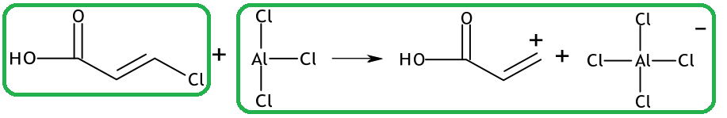

- Structure of 3-chloropropenoic acid; **[1 mark]**
- Structure of the electrophile 
**AND **
Balanced equation involving AlCl3 and AlCl4−;** [1 mark]**

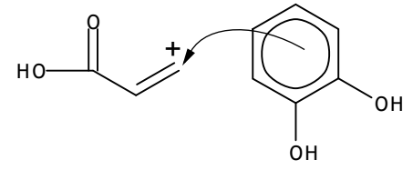

- Curly arrow from on or within the circle to the positively charged carbon;** [1 mark]**

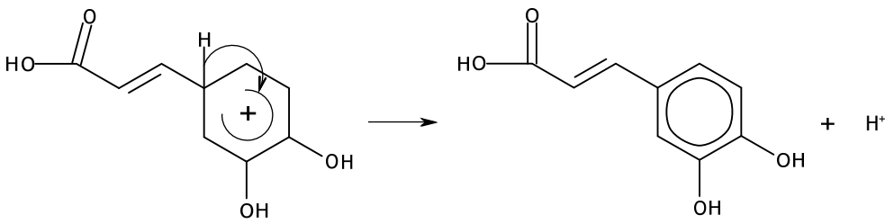

- Intermediate structure including charge with horseshoe covering at least 3 carbon atoms
**AND**
Facing the tetrahedral carbon
**AND**
With some part of the positive charge within the horseshoe; **[1 mark]**
- Curly arrow from the C―H bond to anywhere in the benzene ring reforming delocalised structure with phenol groups in the 3 and 4 positions; **[1 mark] **

ii) The structure of quinic acid is:

- 

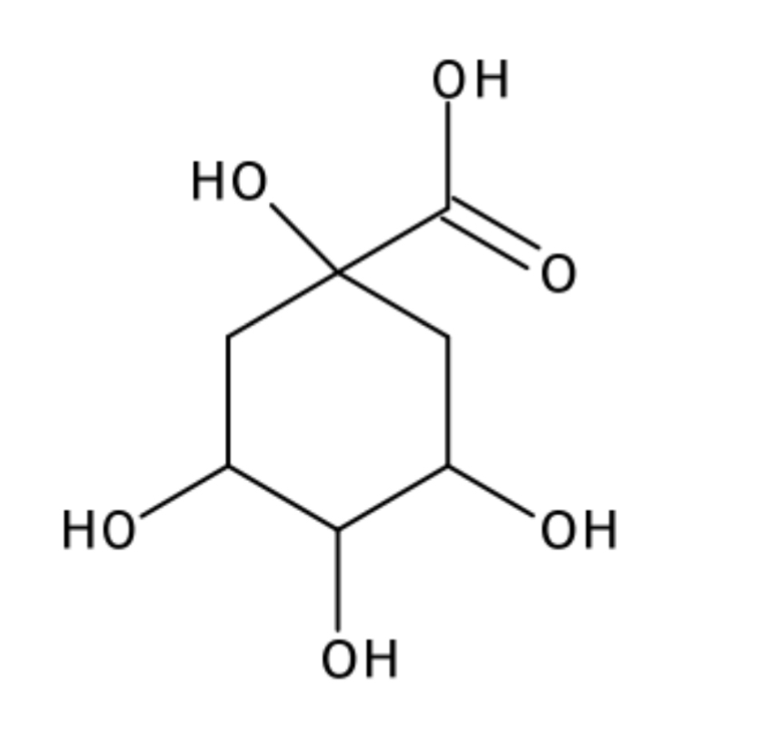

; **[1 mark] **

**Final answer:** **[Total: 6 marks] **

- *The electrophilic substitution reaction in arenes consists of three steps which you must show:*

  - *Generation of an electrophile*
  
    - *You can use Br or I for Cl and Fe for Al *
  - *Electrophilic attack*
  - *Regenerating aromaticity*
- *The general mechanism is:*

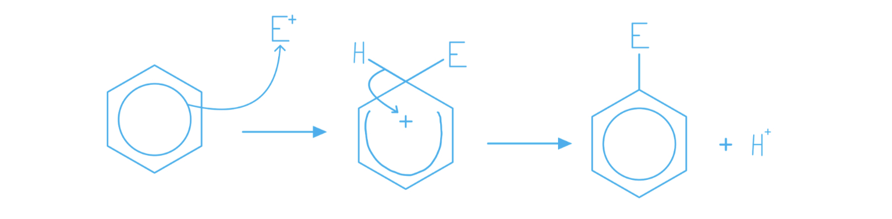

- *The structure of quinic acid that could be formed can be determined from the chlorogenic acid as shown below*
- *There is an ester linkage between the caffeic acid (blue section) and quinic acid (orange section)* 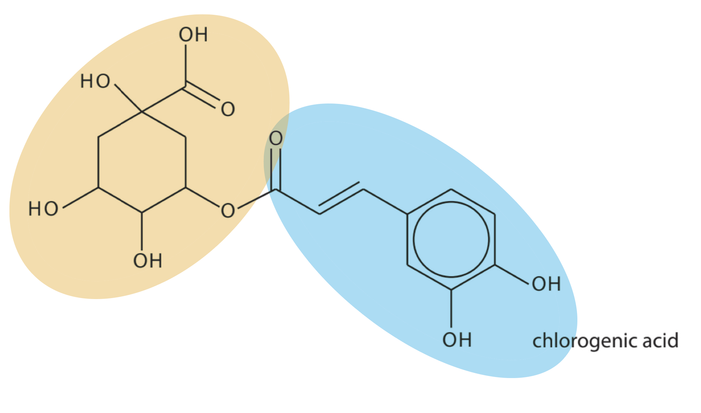

> * *

### 24((d)) — 3 marks
i) The other proton environments are:

- 

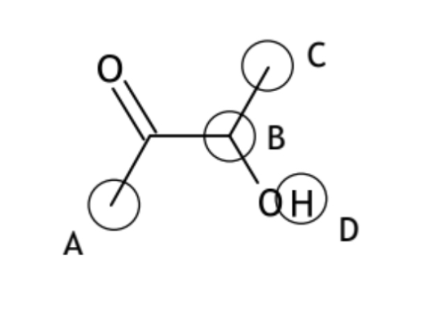

; **[1 mark] **

ii) The completed table is:

| **Proton environment** | **Splitting pattern** |
|---|---|
| A | singlet |
| B | quartet |
| C | doublet |
| D | singlet |

**   OR   **

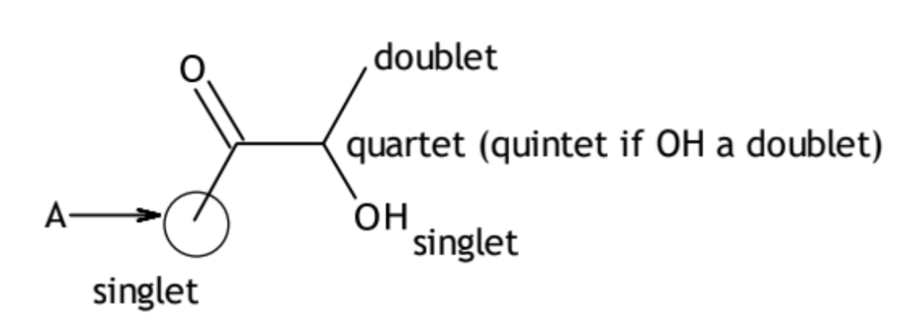

- All four proton environments correct; **[2 marks] **
- Three proton environments correct; **[1 mark]**

**Final answer:** **[Total: 3 marks] **

- *Non-standard terms such as ‘two splits’ or just ‘2’ for doublet are accepted*
- *Also if D (OH proton) is given as a doublet, B as a quartet or as a quintet would be valid *
- *It can help to draw out the structure differently, it is common for students to miss out hydrogens that are omitted in skeletal structures *

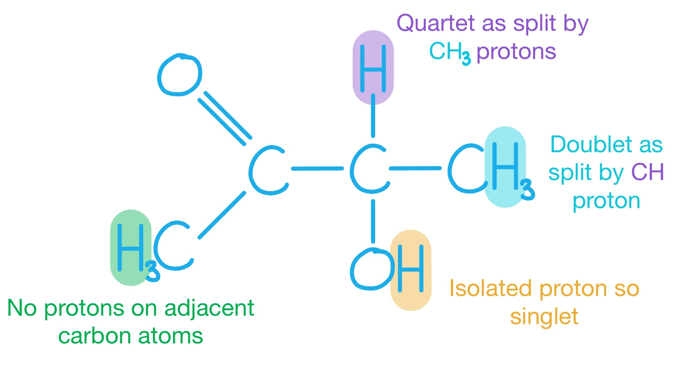

## Q4 — hard — 21 marks · structured-questions

### 16((a)) — 6 marks
A reaction scheme to produce benzoic acid from benzene, via bromobenzene and then a Grignard reagent could be:

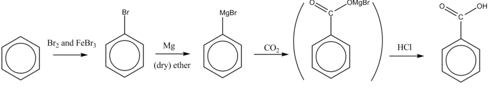

**OR**

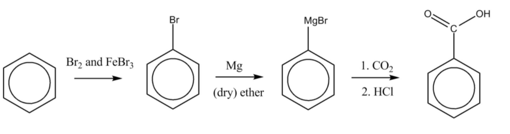

- Reaction of benzene with Br2 and FeBr3 / AlBr3 ; **[1 mark] **
- Reaction of bromobenzene with Mg; **[1 mark] **
- In (dry) ether;** [1 mark]**
- Structure of Grignard reagent (C6H5MgBr);** [1 mark] **

**EITHER**

- Reaction of the Grignard reagent with CO2;** [1 mark] **
- (Hydrolysis of acid salt) with dilute HCl;** [1 mark] **

**OR**

- Reaction of the Grignard reagent with HCHO;** [1 mark] **
- (Hydrolysis of acid salt) with dilute HCl and oxidation (of primary alcohol) with acidified Cr2O72- ;** [1 mark] **

**Final answer:** **[Total: 6 marks] **

- *Grignard reagents are used to lengthen the carbon chain *

  - *Grignard reagents are molecules with the formula RMgX*
  - *They are prepared by reacting a halogenoalkane in dry ether with magnesium *
- *You can make benzoic acid from the Grignard reagent by two possible methods:*

  - *Reaction with CO**2** then HCl  **OR*
  - *Reaction with HCHO then hydrolysis in dilute acid *
  
    - *This forms an alcohol which must then be **oxidised by acidified potassium(VI) dichromate** to form the carboxylic acid*

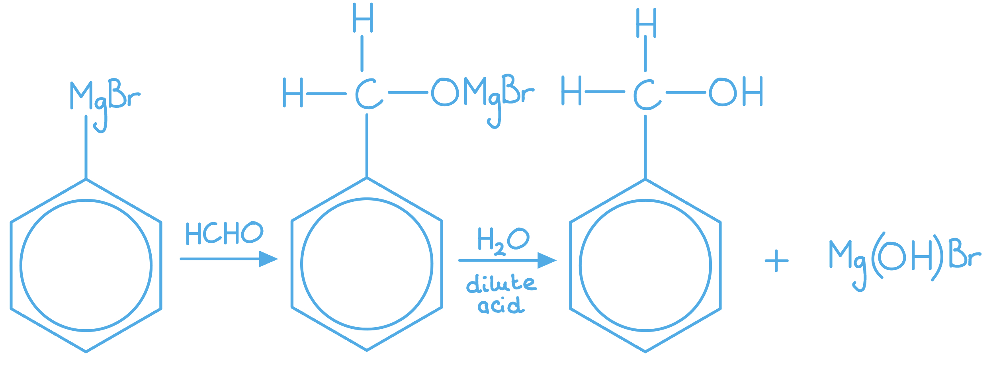

### 16((b)) — 9 marks
i) The mechanism for the reaction, using appropriate curly arrows is:

- Equation to show formation of electrophile:
HNO3 + H2SO4 → NO2+ + HSO4− + H2O
**OR**
HNO3 + 2H2SO4 → NO2+ + 2HSO4− + H3O+
**OR**
HNO3 + H2SO4 → H2NO3+ + HSO4− and H2NO3+ → NO2+ + H2O; **[1 mark]**

**   **

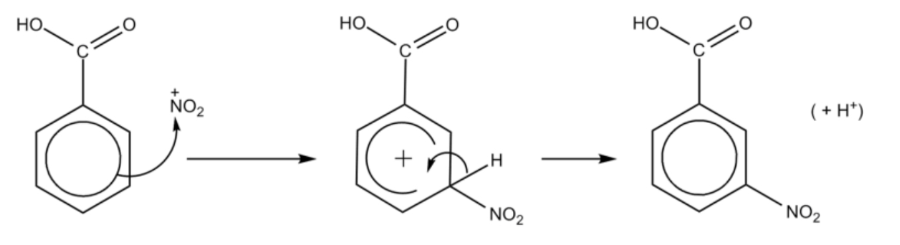

- Curly arrow from anywhere on the central ring to the positive nitrogen; **[1 mark]**
- Correct structure of intermediate;** [1 mark]**
- Curly arrow from the C-H bond to reform the ring; **[1 mark]**
- Equation to show the regeneration of the catalyst: HSO4− + H+ → H2SO4;** [1 mark] **

ii) The reagents required for this reaction are:

- Sn and (concentrated) HCl / tin and (concentrated) hydrochloric acid; **[1 mark] **

iii) A temperature at which this reaction should take place is:

- Any temperature between 0°C and 10 °C , inclusive; **[1 mark]**
- Any temperature between 0°C and 10 °C , inclusive; **[1 mark]**
- (Because,) the diazonium / it decomposes
**OR**
(Because,) the diazonium / it reacts with water
**OR**
(Because,) the diazonium / it forms a phenol 
**OR**
(Because,) the diazonium / it undergoes nucleophilic substitution; [1 mark]

iv) The structure of the azo dye formed when the diazonium ion reacts with phenol is:

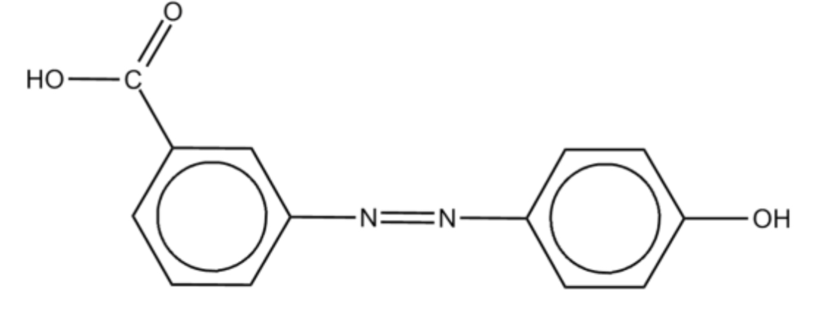

; **[1 mark] **

**Final answer:** **[Total: 9 marks] **

- *The mechanism for electrophilic substitution is the same regardless of the electrophile *

  - *Always remember to show the H**+** that have been substituted *

- *The electrophile bonds to the benzene ring, forming an intermediate with a partially delocalised electron system - shown as a horseshoe with + inside*
- *The intermediate loses a proton, restoring the delocalised electron system*
- *Reduction of NO**2 **on a benzene ring to NH**2** should be done with tin and concentrated hydrochloric acid*
- *When forming azo dyes the HNO**2** (nitrous acid) is very unstable so must be prepared in 'situ'*
- *To prevent the HNO**2** from decomposing the temperature must be kept below 10 °C*
- *The diazonium ion formed can then be coupled with phenol, C**6**H**5**OH*

  - *The phenol bonds on the 4th carbon atom of the diazonium ion (opposite side to the* +N$\equiv$N group)

### 16((c)) — 6 marks
To calculate the molar mass of hydrated calcium benzoate and hence deduce the value of x:

- Calculation of molar mass of Pb(C6H5COO)2  Molar mass of Pb(C6H5COO)2 = 449.2 g mol-1; **[1 mark] **
- Calculation of amount of Pb(C6H5COO)2 Moles of Pb(C6H5COO)2 = $\frac{3.89}{449.2}$ = 8.65984 x 10−3 (mol); **[1 mark] **
- Deduction of amount of Ca(C6H5COO)2.xH2O 1:1 so 8.65984 x 10−3 (mol); **[1 mark] **

**   EITHER**

- Calculation of *M*r of Ca(C6H5COO)2.xH2O $\frac{2.60}{8.6598\times10^{-3}}$ = 300.24; **[1 mark] **
- Calculation of mass of water in *M*r 300.24 – (40.1 + (14 x 12) + (1 x 10) + (4 x 16) = 18.14; **[1 mark] **
- Calculation of amount of water and hence x $\frac{18.14}{18}$ = 1, so x = 1; **[1 mark] **

**   OR**

- Calculation of mass of Ca(C6H5COO)2  8.65984 x 10−3 x 282.1 = 2.44 g; **[1 mark] **
- Calculation of mass of water in hydrated sample 2.60 – 2.44 = 0.16 g;** [1 mark] **
- Calculation of amount of water and hence x $\frac{0.16}{18}$ = 0.00889, so x = 1;** [1 mark] **

**Final answer:** **[Total: 6 marks] **

- *The reaction is*

  - *Ca(C**6**H**5**COO)**2**·xH**2**O + Pb(C**6**H**5**COO)**2** → Pb(C**6**H**5**COO)**2·**xH**2**O + Ca(C**6**H**5**COO)**2*
  - *This is a displacement reaction and the precipitate (once dry has a mass of  3.89 g*
- *The molar mass of Pb(C**6**H**5**COO)**2** can be worked out 449.2 g mol**-1*
- *Using moles = *$\frac{\mathrm{mass}}{\mathrm{molar} \mathrm{mass}}$* you can then work out the amount of lead(II) benzoate *
- *As the reaction has a 1:1 ratio we can assume that the number of moles of hydrated calcium benzoate is the same*
- *If you know the moles and the mass of calcium benzoate, then you can work out the molar mass calcium benzoate using moles = molar mass x mass *
- *If you take away the molar mass of Ca(C**6**H**5**COO)**2 **from the molar mass of hydrated calcium benzoate you will be left with the mass of water *

  - *In this case the mass is close to 18, so we can assume x = 1*
- *You can also do similar with the number of moles of calcium benzoate*

  - *You can work out the mass of calcium benzoate by using mass = moles x molar mass*
  - *The difference in the mass of the hydrated calcium benzoate and the anhydrous calcium benzoate is the mass of water*
  - *If the number of moles of water and calcium benzoate are similar, then you can assume x is 1*

## Q5 — easy — 1 marks · multiple-choice-questions

### 10() — 1 marks
**Correct answer: D** — p orbitals to form $π$ bonds

**Final answer:** **The correct answer is ****D**** because: **

- 3 σ bonds form in benzene

  - 2 between the carbon atoms in the benzene ring
  - 1 between the carbon atoms and the hydrogen atoms
- The remaining electrons in the p-orbitals delocalise to form π bonds / the π system

**A** and **C** are incorrect as the σ bonds are not delocalised

**B **is incorrect as** ** s orbitals do not form π bonds

## Q6 — easy — 1 marks · multiple-choice-questions

### 1() — 1 marks
**Correct answer: B** — Concentrated HNO3 and concentrated H2SO4, below 55 °C

**Final answer:** **The correct answer is B**

- The nitrating mixture requires both concentrated HNO3 and concentrated H2SO4
- H2SO4 protonates HNO3, which loses water to generate the nitronium ion (NO2+), the electrophile responsible for attack on the benzene ring
- The temperature must be kept below 55°C to ensure monosubstitution.

  - Above this temperature, further electrophilic substitution occurs and polynitrated products form

**A** is incorrect as temperatures above 55°C cause the benzene ring to undergo further substitution by nitro groups, producing dinitrobenzene and other unwanted polynitrated by-products rather than the desired mononitrated product.

**C** is incorrect as dilute H2SO4 cannot protonate HNO3 effectively enough to generate the nitronium ion at a useful rate. Both acids must be concentrated.

**D** is incorrect as dilute HNO3 does not contain a sufficient concentration of HNO3 to form the nitronium ion effectively. Both acids must be concentrated.

## Q7 — medium — 3 marks · multiple-choice-questions

### 6((a)) — 1 marks
**Correct answer: C** — five

**Final answer:** **The correct answer is ****C**** because:**

- There are five different carbon environments

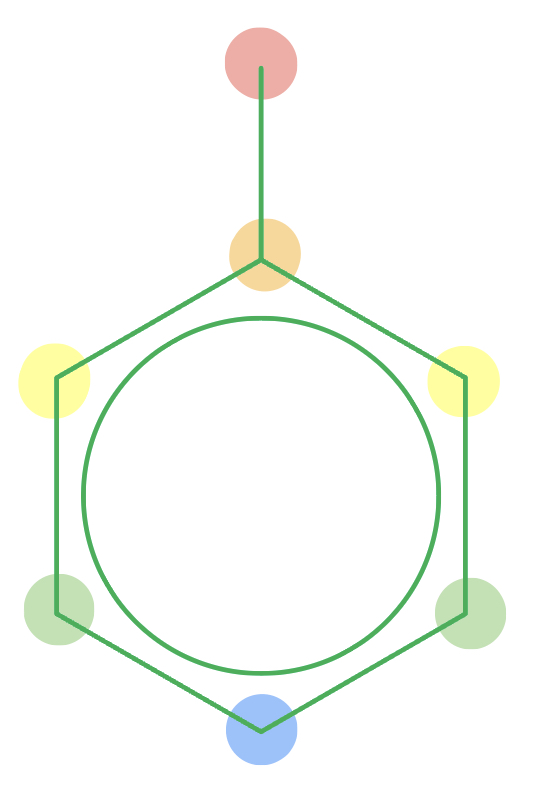

A is incorrect as  it assumes all the carbon atoms are in a different environment

B is incorrect as  it assumes only two of the benzene ring carbon atoms are in the same environment

D is incorrect as  it assumes the carbon atoms at position 1 and position 4 of the ring are in the same environment

### 6((b)) — 1 marks
**Correct answer: D** — electrophilic substitution

**Final answer:** **The correct answer is ****D**** because:**

- The two NO2 groups are substituted by for two hydrogen atoms on the benzene ring

  - Therefore this is a substitution reaction
- Benzene rings will undergo attack from an electrophile such as NO2+

**A** is incorrect as  the nitrating mixture produces an electrophile, NO2+, and addition does not occur due to stability of ring system

**B** is incorrect as  the nitrating mixture produces an electrophile, NO2+

**C** is incorrect as  addition does not occur due to stability of ring system

### 6((c)) — 1 marks
**Correct answer: A** — (10 × 85 × 227) ÷ (92 × 100)

**Final answer:** **The correct answer is ****A**** because:**

- We know that the yield of 2,4,6‐trinitromethylbenzene is 85% and this is formed from 10 g of methyl benzene
- We can assume the reaction is a 1:1 ratio
- Therefore the mass of 2,4,6‐trinitromethylbenzene can be worked out as:

  - Moles of methyl benzene = 10 ÷ 92 = 0.11
  - Moles of 2,4,6‐trinitromethylbenzene = 0.11
  - Mass of 2,4,6‐trinitromethylbenzene = 0.11 x 227 = 24.67 g
  - 85% of 24.67 g = 20.97 g
- (10 x 85 x 227) ÷ (92 x 100) = 20.97 g

**B**, **C** and **D** are incorrect as  the scaling factor for the yield is wrong

## Q8 — medium — 1 marks · multiple-choice-questions

### 9() — 1 marks
**Correct answer: C** — four

**Final answer:** **The correct answer is ****C**** because:**

- The four isomers of dichlorobenzene are:

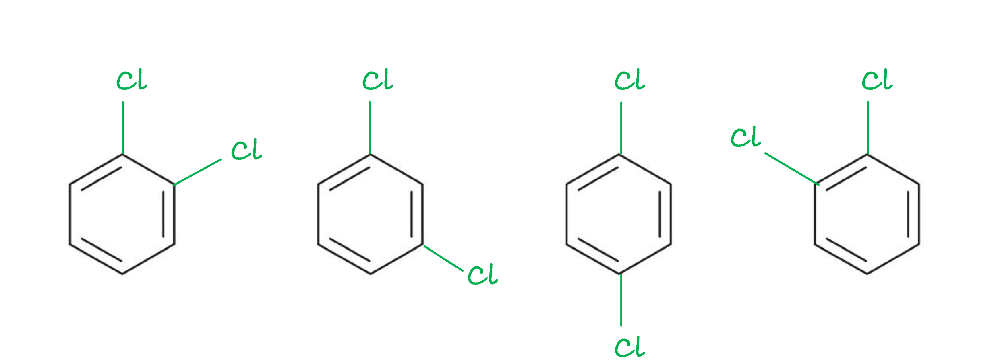

- **Careful**: The 1,3 and 1,5 (shown below) structures are identical, so don't count these as two different isomers

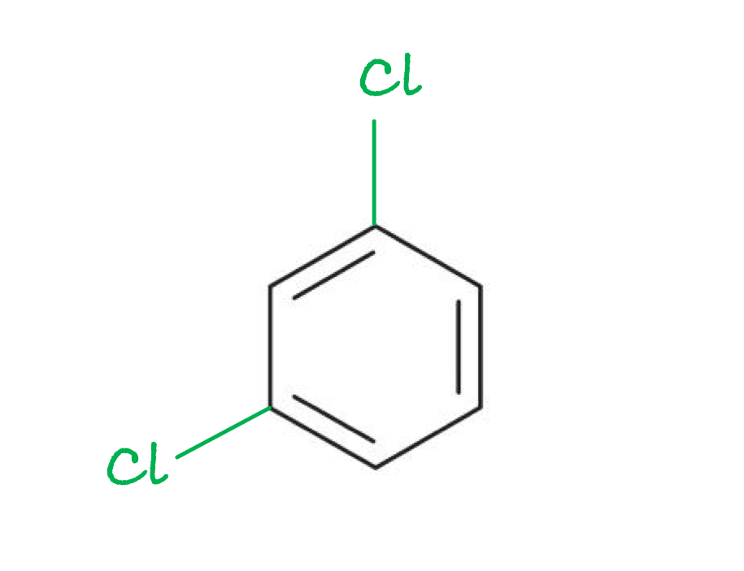

**A** is incorrect as  this omits two isomers

**B** is incorrect as  in the Kekulé structure 1,2-dichlorobenzene has two isomers, one with the carbon atoms carrying the chlorines joined by a single bond and the other with them joined by a double bond

**D** is incorrect as  this overlooks the fact that the 1,3 and 1,5 structures are identical

## Q9 — medium — 1 marks · multiple-choice-questions

### 10() — 1 marks
**Correct answer: D** — 

**Final answer:** **The correct answer is ****D**** because:**

- When benzene reacts with fuming sulfuric reaction, a substitution reaction occurs
- In this reaction, a sulfonyl group (-SO3H) replaces a hydrogen atom on benzene. producing the structure shown in **C**

**A** is incorrect as  the substituent is SO3H, not SO3

**B** is incorrect as  the substituent is SO3H with a C—S bond, not a C—O bond

**C** is incorrect as  the substituent is SO3H, not SO3H2

## Q10 — medium — 1 marks · multiple-choice-questions

### 11() — 1 marks
**Correct answer: D** — 

**Final answer:** **The correct answer is ****D**** because: **

- The metal halide carrier is enabling the formation of the carbocation: RCl + AlCl3 → R+ + AlCl4–
- **A**, **B** and **C** can form because in each case the methyl carbon on the starting material is δ+

  - The original trichloromethane will form the carbocation electrophile CHCl2+ which undergoes substitution to form (dichloromethyl)benzene / compound **A**
  - The (dichloromethyl)benzene / compound **A** will form the carbocation electrophile C(C6H5)HCl+ which undergoes substitution to form 1,1-(chloromethylene)dibenzene / chlorodiphenylmethane / compound **B**
  - The 1,1-(chloromethylene)dibenzene / chlorodiphenylmethane / compound **B** will form the carbocation electrophile C(C6H5)2H+ which undergoes substitution to form triphenylmethane / compound **C**
- However, triphenylmethane / compound **C **has no chlorine, so it cannot react with AlCl3 to form the required carbocation to make compound **D**
- Another factor in forming **D** is likely to be steric hindrance from the presence of the three surrounding phenyl groups

**A** is incorrect as  this product is formed by the substitution of one chlorine atom in CHCl3

**B **is incorrect as** ** this product is formed by the substitution of two chlorine atoms in CHCl3

**C **is incorrect as** **this product is formed by the substitution of all three chlorine atoms in CHCl3

## Q11 — medium — 1 marks · multiple-choice-questions

### 11() — 1 marks
**Correct answer: B** — 

**Final answer:** **The correct answer is ****B ****because:**

- The lone pair of electrons on the nitrogen atom in methylamine is attracted to the δ+ charge of a hydrogen atom in a water molecule
- The N----H—O bond angle is 180° as there are 2 bonding pairs of electrons around the H atoms

**A** is incorrect as  the N----H—O bond angle should be 180°

**C** is incorrect as hydrogen atoms bonded to carbon atoms cannot form hydrogen bonds

**D** is incorrect as  hydrogen atoms bonded to carbon atoms cannot form hydrogen bonds

## Q12 — medium — 1 marks · multiple-choice-questions

### 12() — 1 marks
**Correct answer: C** — 330.7

**Final answer:** **The correct answer is ****C**** because: **

- The organic product when phenol reacts with excess bromine water is 2,4,6-tribromophenol, C6H2Br3OH
- The molar mass of this product can be calculated by adding up the atomic masses of all of the individual atoms:

  - (6 x 12.0) + (2 x 1.0) (3 x 79.9) + (16.0 + 1.0) = 330.7 g mol-1

**A** is incorrect as this product is the molar mass of bromobenzene, C6H5Br

**B **is incorrect as** **this is the molar mass of the monosubstituted product, C6H4BrOH

**D **is incorrect as** ** this is the molar mass of the fully substituted product, C6Br5OH

## Q13 — medium — 1 marks · multiple-choice-questions

### 1() — 1 marks
**Correct answer: B** — −208 kJ mol-1

**Final answer:** **The correct answer is B**

- If benzene contained three isolated C=C double bonds, the theoretical enthalpy of hydrogenation would be:

3 × −120 = −360 kJ mol-1

- The actual enthalpy of hydrogenation of benzene is −208 kJ mol-1, which is less exothermic than the theoretical value
- This difference arises because the delocalised π system gives benzene extra thermodynamic stability, meaning less energy is released on hydrogenation

**A** is incorrect as −360 kJ mol-1 is the theoretical value for a hypothetical molecule with three localised double bonds (3 × −120). Benzene is stabilised by delocalisation, making the actual hydrogenation less exothermic than this.

**C** is incorrect as −152 kJ mol-1 is the delocalisation energy, calculated as the difference between the theoretical and actual values (−360 − (−208) = −152). The question asks for the enthalpy of hydrogenation, not the stabilisation energy.

**D** is incorrect as −120 kJ mol-1 is the enthalpy of hydrogenation of cyclohexene, which contains one C=C bond. Benzene requires three moles of hydrogen to fully hydrogenate and is stabilised by delocalisation, so neither the number nor the reasoning applies.

> **[exam-tip]**
> This question tests two things at once: the arithmetic and the reason. Always calculate the theoretical value first (3 × cyclohexene value), then recall that the actual value is less exothermic due to delocalisation stability. The difference between the two is the delocalisation energy — a separate quantity that frequently appears as a distractor.

## Q14 — hard — 1 marks · multiple-choice-questions

### 11() — 1 marks
**Correct answer: B** — result in a kinetic barrier to intermediate formation

**Final answer:** **The correct answer is ****B**** because: **

- The kinetic barrier means the activation energy is too high
- This is the result of the lower potential energy of benzene compared to ethene

  - This is similar to saying that the benzene ring is more stable due to the delocalised electrons, which impacts on the reactivity

**A** is incorrect as the delocalised electrons attract electrophiles

**C **is incorrect as  both ethene and benzene have endothermic enthalpies of formation **AND **this is not a factor in their reactivity

**D **is incorrect as** ** catalysts have no effect on the thermodynamics of a reaction
