# Exam Questions — Organic Chemistry: Arenes
**5. Transition Metals & Organic Nitrogen Chemistry** · Edexcel International A Level (IAL) Chemistry (YCH11)
> Source: [https://www.savemyexams.com/international-a-level/chemistry/edexcel/17/topic-questions/5-transition-metals-and-organic-nitrogen-chemistry/5-4-organic-chemistry-arenes/structured-questions/](https://www.savemyexams.com/international-a-level/chemistry/edexcel/17/topic-questions/5-transition-metals-and-organic-nitrogen-chemistry/5-4-organic-chemistry-arenes/structured-questions/) · 14 questions · total 84 marks

## Q1 — medium — 19 marks · structured-questions

### 19((a)) — 2 marks — command: describe — structured — from paper Oct 2021 · WCH15/01
This question is about benzene, C6H6 , a colourless liquid first isolated in 1825, and some related compounds.

Three C6H6 structures proposed in the 1860s are shown.

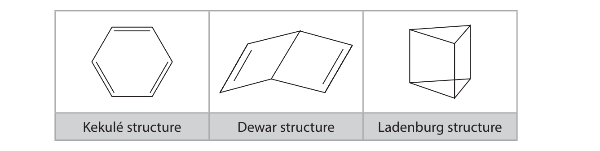

The delocalised model for the structure of benzene has been accepted since the 1930s following the study of its X‐ray diffraction pattern and the understanding of electron delocalisation in bonding theory.

The Dewar and Ladenburg structures have since been isolated as stable compounds but there is no compound with the Kekulé structure.

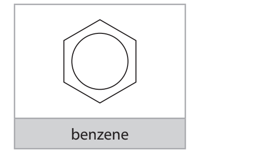

Describe a **chemical** test, including the result, that could distinguish the Dewar structure from benzene.

### 19((b)) — 2 marks — command: state — structured — from paper Oct 2021 · WCH15/01
State **one** similarity and **one** difference you would expect in the** low** resolution proton NMR spectrum of the Ladenburg structure and that of benzene.

You **must** include data from the Data Booklet to support your answer.

### 19((c)) — 2 marks — command: explain — structured — from paper Oct 2021 · WCH15/01
Explain how X‐ray diffraction shows that benzene has a delocalised structure and **not **a Kekulé structure.

### 19((d)) — 3 marks — command: multiple — structured — from paper Oct 2021 · WCH15/01
The Ladenburg and Dewar structures both isomerise to benzene. The enthalpy changes are –376 kJ mol–1 and –297 kJ mol–1 respectively.

i)  Draw a **labelled** enthalpy level diagram showing the relative thermodynamic stability of the Ladenburg structure, the Dewar structure and benzene. Include the enthalpy change values in kJ mol–1. Your diagram does **not** need to be to scale.

**(2)**

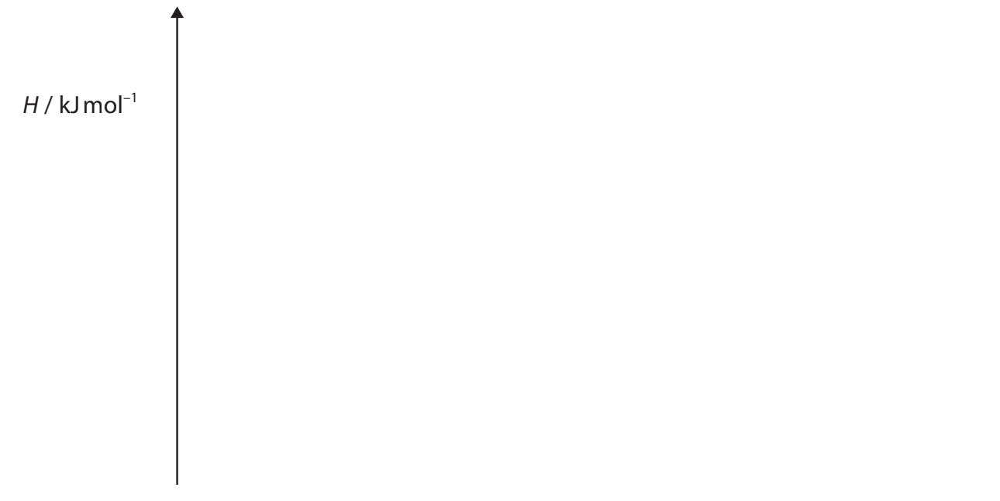

ii) Give a possible reason why the isomerisation of the Dewar structure to benzene has a lower activation energy than that of the Ladenburg structure to benzene.

**(1)**

### 19((e)) — 2 marks — command: suggest — structured — from paper Oct 2021 · WCH15/01
The enthalpy change of hydrogenation of hex‐3‐ene is –118 kJ mol–1.

The table shows the enthalpy changes of hydrogenation of two further alkenes containing six carbon atoms.

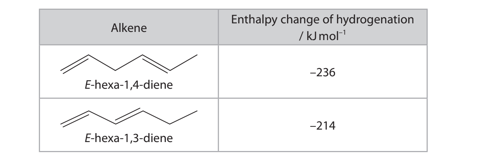

Use your knowledge of benzene thermochemistry to suggest explanations for **both** of these enthalpy changes of hydrogenation in relation to the value for hex‐3‐ene.

### 19((f)) — 8 marks — command: multiple — structured — from paper Oct 2021 · WCH15/01
Methylbenzene, C6H5CH3 , reacts with ethanoyl chloride, CH3COCl, in the presence of the catalyst aluminium chloride, AlCl3 , to form a mixture of organic products with the formula CH3COC6H4CH3.

C6H5CH3 + CH3COCl → CH3COC6H4CH3 + HCl

i) Draw the **skeletal** formulae of** three **different arenes with the formula CH3COC6H4CH3 .

**(2)**

ii) The 13C NMR spectrum of **one** of these arenes, compound **X**, is shown.

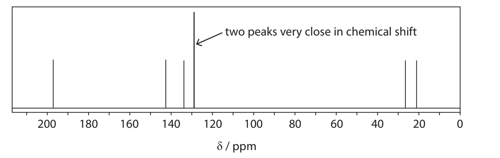

Identify compound **X. **Use the number of peaks on the 13C NMR spectrum to justify your answer.

**(2)**

iii) Complete the diagram, including curly arrows, to show the mechanism for the formation of compound **X** in this reaction. Include an equation for the regeneration of the catalyst.

**(4)**

CH3COCl + AlCl3 → CH3CO++ AlC$l_{4}^{-}$

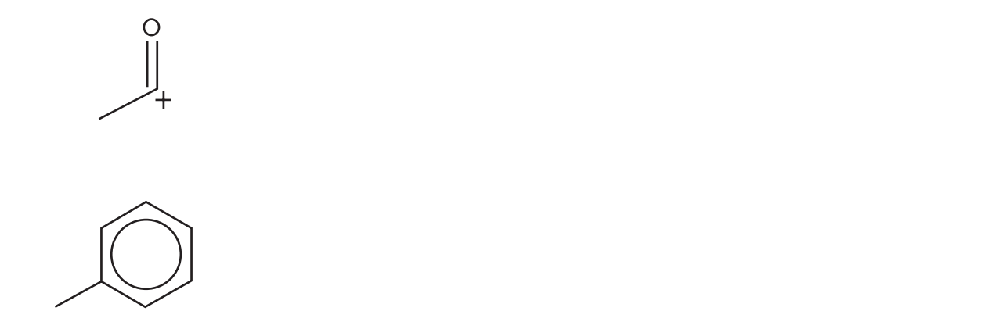

## Q2 — medium — 12 marks · structured-questions

### 20((a)) — 5 marks — command: multiple — structured — from paper June 2021 · WCH15/01
This question is about benzene and some related compounds.

Some standard enthalpies of combustion are shown.

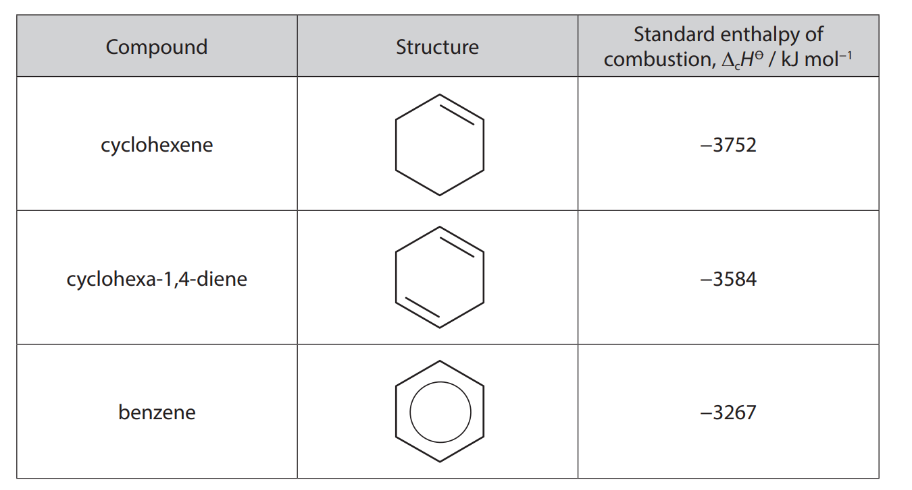

i) Using the standard enthalpies of combustion of cyclohexene and cyclohexa-1,4-diene, calculate a value for the enthalpy of combustion of the theoretical compound ‘cyclohexa-1,3,5-triene’.

**(2)**

ii) Explain the difference between the enthalpy of combustion of ‘cyclohexa-1,3,5-triene’ calculated in (a)(i) and the enthalpy of combustion of benzene given in the table.

**(3)**

### 20((b)) — 4 marks — command: contrast — structured — from paper June 2021 · WCH15/01
Bromine reacts with cyclohexene to form 1,2-dibromocyclohexane, and with benzene to form bromobenzene.

Compare and contrast these reactions, considering the type and mechanism of each reaction and the conditions required.

You are **not** required to draw the mechanisms of the reactions.

### 20((c)) — 3 marks — command: multiple — structured — from paper June 2021 · WCH15/01
Bromine also reacts with phenol.

i) Identify, by name or formula, the organic product when phenol reacts with **excess** bromine.

**(1)**

ii) Explain why bromine reacts much faster with phenol than with benzene.

**(2)**

## Q3 — medium — 20 marks · structured-questions

### 24((a)) — 5 marks — command: multiple — structured — from paper Jan 2021 · WCH15/01
**Coffee Chemistry**

There are over a thousand chemical compounds in coffee and their physiological effects are the subject of considerable speculation and research. The verdict on coffee is contradictory: some of the compounds have been identified as toxic and even carcinogenic but others are antioxidants associated with cancer prevention. Recent research has identified compounds in coffee that might be used in the treatment of prostate cancer.

By far the best known compound in coffee is caffeine, the most widely consumed psychoactive drug in the world. In small amounts it is a stimulant but doses in excess of 10 g per day are toxic. Caffeine contains amide and amine groups.

Chlorogenic acid is responsible for the acidic taste of coffee. It is an antioxidant and has also been shown to slightly decrease blood pressure.

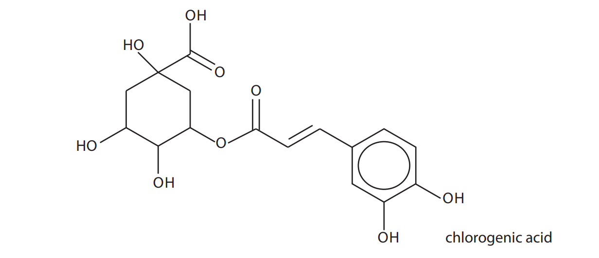

Caffeic acid, quinic acid and acetoin are also present in coffee.

Another way of drawing the structure of caffeine is shown.

i) The bonding represented by this diagram of caffeine differs from that given in the passage.

Explain what this diagram indicates about the bonding in caffeine, stating the effect on the structure of caffeine.

**(3)**

ii) Suggest why caffeine is a much weaker base than a primary amine such as ethylamine, even though the right-hand ring has two amine groups.

**(2)**

### 24((b)) — 6 marks — command: calculate — structured — from paper Jan 2021 · WCH15/01
A 200 cm3 cup of coffee contains approximately 85 mg of caffeine.

i) Calculate the concentration, in mol dm−3, of caffeine in this cup of coffee.

Give your answer to an appropriate number of significant figures.

**(4)**

ii) The removal of caffeine from the body is a first order reaction with a half-life of between three and seven hours for an adult.

An adult drinks coffee containing a total of 160 mg of caffeine.

Calculate to the nearest hour the **minimum** time needed for the amount of caffeine in their body to drop to 20 mg.

**(2)**

### 24((c)) — 6 marks — command: multiple — structured — from paper Jan 2021 · WCH15/01
Chlorogenic acid is an ester of caffeic acid, a compound that is present in all plants.

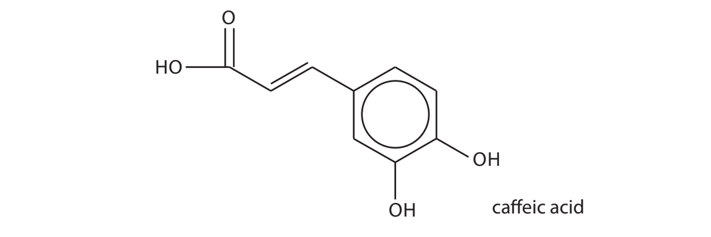

i) A student suggested that caffeic acid could be synthesised by an electrophilic substitution of 1,2-dihydroxybenzene.

Draw the mechanism of this electrophilic substitution, including the formation of a suitable electrophile.

**(5)**

ii) Deduce the structure of quinic acid which combines with caffeic acid to form chlorogenic acid.

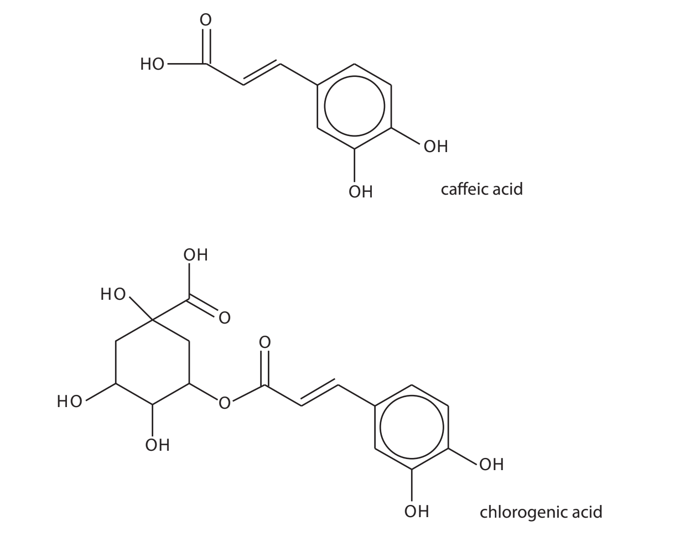

**(1)**

| quinic acid |
|---|

### 24((d)) — 3 marks — command: multiple — structured — from paper Jan 2021 · WCH15/01
The structure of acetoin is shown with one of the proton environments labelled.

i) Identify the other proton environments of acetoin on the structure and label them B, C etc.

**(1)**

ii) Complete the table to show the splitting pattern in the high resolution proton NMR spectrum of acetoin.

**(2)**

| **Proton environment** | **Splitting pattern** |
|---|---|
| A |   |
|   |   |
|   |   |
|   |   |
|   |   |
|   |   |

## Q4 — hard — 21 marks · structured-questions

### 16((a)) — 6 marks — command: design — structured — from paper Jan 2022 · WCH15/01
Benzoic acid is a white crystalline solid with the structure shown.

It is found in many plants as it is an important building block for the biosynthesis of a variety of compounds, such as plant hormones and attractants for pollinators.

The role of benzoic acid in the chemical industry is also widespread and approximately 500000 tonnes are produced annually. It is used in the synthesis of many compounds, including medicines, dyes and insect repellents.

Such synthetic dyes are often classified as aryl azo dyes. These dyes have a range of vivid colours and a wide range of uses in many industries, including food and textiles. Their synthesis involves the formation of a diazonium ion. This ion then reacts with a phenol in a coupling reaction, to form the dye. The relative simplicity of the reactions involved and ready availability of starting materials make azo dyes cheap to produce.

Salts of benzoic acid, such as calcium benzoate and sodium benzoate, are used in the food industry as preservatives.

Devise a reaction scheme to produce benzoic acid from benzene, via bromobenzene and then a Grignard reagent.

Include the reagents and essential conditions for each step and give the name or structure of each of the intermediate compounds.

Details of practical procedures and reaction mechanisms are **not** required.

### 16((b)) — 9 marks — command: multiple — structured — from paper Jan 2022 · WCH15/01
Benzoic acid can be used in the synthesis of azo dyes.

i) In Step** 1**, benzoic acid reacts with concentrated nitric acid to form 3‐nitrobenzoic acid.

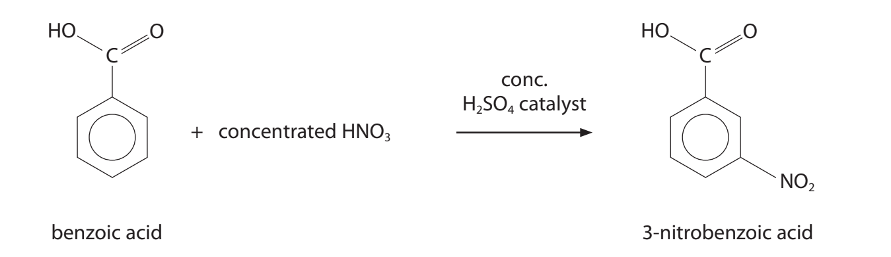

Draw the mechanism for the reaction, using appropriate curly arrows.

Include equations showing the role of the catalyst and how it is regenerated.

**(5)**

ii) In Step **2**, the 3‐nitrobenzoic acid reacts to form 3‐aminobenzoic acid.

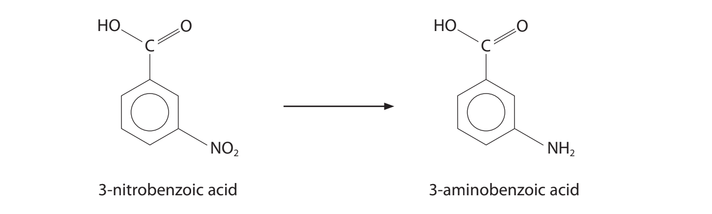

State the reagents required for this reaction.

**(1)**

** **

iii) In Step **3**, the 3‐aminobenzoic acid reacts with sodium nitrite and dilute hydrochloric acid, forming a diazonium ion.

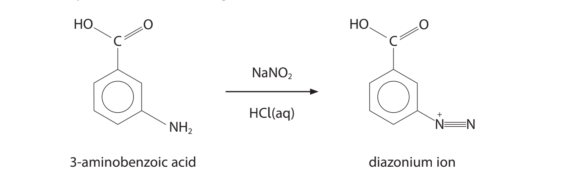

State a temperature at which this reaction should take place, giving **one** reason for your answer.

**(2)**

iv) Draw the structure of the azo dye formed when the diazonium ion reacts with phenol.

**(1)**

### 16((c)) — 6 marks — command: deduce — structured — from paper Jan 2022 · WCH15/01
Hydrated calcium benzoate is used as a preservative in soft drinks. It has the formula Ca(C6H5COO)2·xH2O.

2.60 g of hydrated calcium benzoate was dissolved in deionised water. Excess lead(II) nitrate solution was added, forming a precipitate of lead(II) benzoate, Pb(C6H5COO)2 (s). This precipitate was removed and dried. The mass of the dry solid was 3.89 g.

Calculate the molar mass of hydrated calcium benzoate and hence deduce the value of x.

## Q5 — easy — 1 marks · multiple-choice-questions

### 10() — 1 mark — multiple_choice — from paper Jan 2021 · WCH15/01
The delocalised electrons in benzene result from the overlap of
- **A.** s orbitals to form σ bonds
- **B.** s orbitals to form $π$ bonds
- **C.** p orbitals to form σ bonds
- **D.** p orbitals to form $π$ bonds

## Q6 — easy — 1 marks · multiple-choice-questions

### 1() — 1 mark — multiple_choice
Which of these correctly gives the reagents and conditions for the nitration of benzene?
- **A.** Concentrated HNO3 and concentrated H2SO4, above 55 °C
- **B.** Concentrated HNO3 and concentrated H2SO4, below 55 °C
- **C.** Concentrated HNO3 and dilute H2SO4, below 55 °C
- **D.** Dilute HNO3 and concentrated H2SO4, below 55 °C

## Q7 — medium — 3 marks · multiple-choice-questions

### 6((a)) — 1 mark — multiple_choice — from paper Jan 2022 · WCH15/01
Methylbenzene reacts with a mixture of concentrated nitric acid and concentrated sulfuric acid to form 2,4,6‐ trinitromethylbenzene.

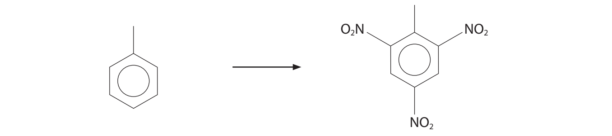

What is the number of peaks in the 13C NMR spectrum of methylbenzene?
- **A.** seven
- **B.** six
- **C.** five
- **D.** four

### 6((b)) — 1 mark — multiple_choice — from paper Jan 2022 · WCH15/01
What type of reaction takes place?
- **A.** nucleophilic addition
- **B.** nucleophilic substitution
- **C.** electrophilic addition
- **D.** electrophilic substitution

### 6((c)) — 1 mark — multiple_choice — from paper Jan 2022 · WCH15/01
Which expression shows the mass in grams of 2,4,6‐trinitromethylbenzene formed from 10 g of methylbenzene if the yield of the reaction is 85%?

[*M*r values: methylbenzene = 92       2,4,6‐trinitromethylbenzene = 227]
- **A.** (10 × 85 × 227) ÷ (92 × 100)
- **B.** (10 × 100 × 227) ÷ (92 × 85)
- **C.** (10 × 100 × 227) ÷ (92 × 115)
- **D.** (10 × 115 × 227) ÷ (92 × 100)

## Q8 — medium — 1 marks · multiple-choice-questions

### 9() — 1 mark — multiple_choice — from paper June 2021 · WCH15/01
Benzene is sometimes represented by a Kekulé structure.

If this were the **only** structure of benzene, what would be the total number of isomers of dichlorobenzene?
- **A.** two
- **B.** three
- **C.** four
- **D.** five

## Q9 — medium — 1 marks · multiple-choice-questions

### 10() — 1 mark — multiple_choice — from paper June 2021 · WCH15/01
What is the product when benzene reacts with fuming sulfuric acid?

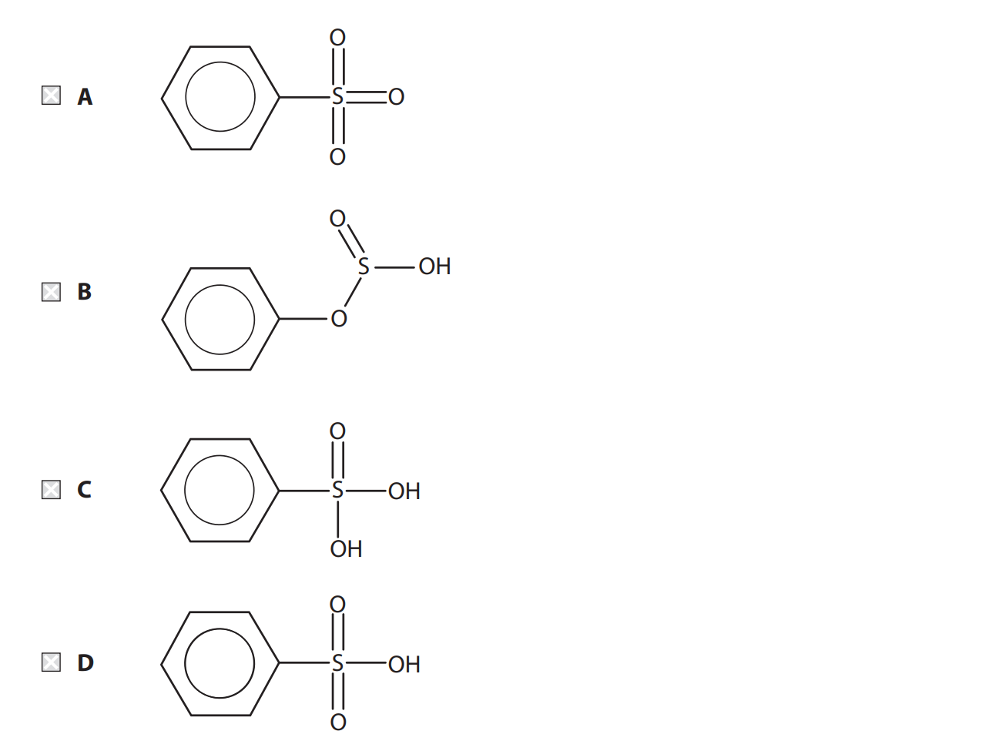
- **A.** 
- **B.** 
- **C.** 
- **D.** 

## Q10 — medium — 1 marks · multiple-choice-questions

### 11() — 1 mark — multiple_choice
Which of these could** not **be formed when excess benzene is heated with trichloromethane, CHCl3, in the presence of an aluminium chloride catalyst?

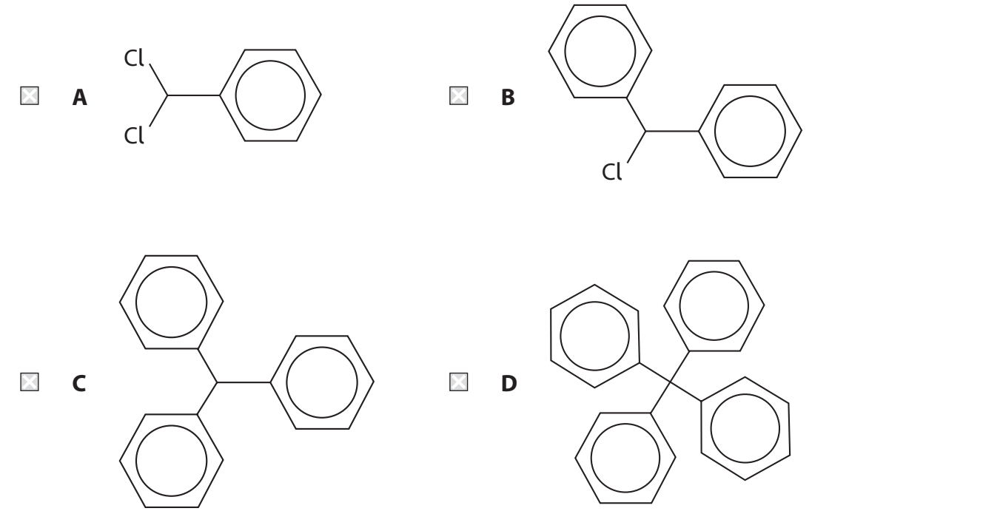
- **A.** 
- **B.** 
- **C.** 
- **D.** 

## Q11 — medium — 1 marks · multiple-choice-questions

### 11() — 1 mark — multiple_choice — from paper June 2021 · WCH15/01
Hydrogen bonds are formed when methylamine dissolves in water.

Which structure best represents a hydrogen bond between methylamine and water?

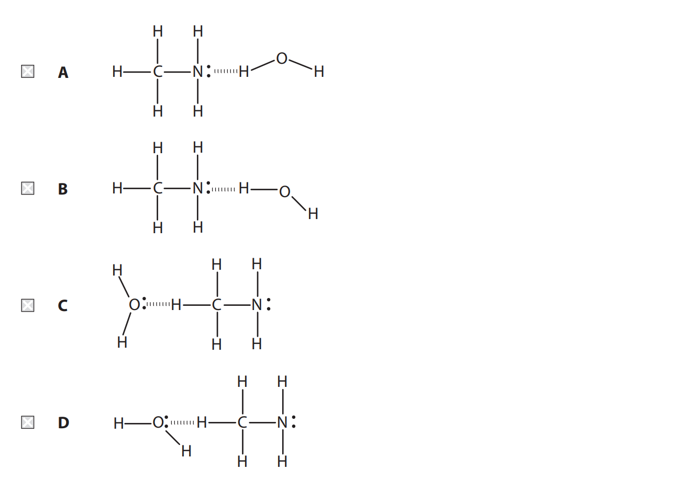
- **A.** 
- **B.** 
- **C.** 
- **D.** 

## Q12 — medium — 1 marks · multiple-choice-questions

### 12() — 1 mark — multiple_choice — from paper Oct 2021 · WCH15/01
What is the molar mass, in g mol–1, of the organic product when phenol reacts with **excess** bromine water?
- **A.** 156.9
- **B.** 172.9
- **C.** 330.7
- **D.** 488.5

## Q13 — medium — 1 marks · multiple-choice-questions

### 1() — 1 mark — multiple_choice
The standard enthalpy change of hydrogenation of cyclohexene is −120 kJ mol-1.  The skeletal formulae of cyclohexene and benzene are shown.

Which of these is the correct value for the standard enthalpy change of hydrogenation of benzene?
- **A.** −360 kJ mol-1
- **B.** −208 kJ mol-1
- **C.** −152 kJ mol-1
- **D.** −120 kJ mol-1

## Q14 — hard — 1 marks · multiple-choice-questions

### 11() — 1 mark — multiple_choice — from paper Jan 2021 · WCH15/01
The reaction of ethene with bromine occurs under normal laboratory conditions but the reaction of benzene with bromine to form bromobenzene requires heat and the presence of a catalyst.

The best explanation for the difference in reactivity is that the delocalised electrons in benzene
- **A.** repel electrophiles
- **B.** result in a kinetic barrier to intermediate formation
- **C.** result in benzene having an endothermic enthalpy of formation
- **D.** make benzene thermodynamically stable with respect to the formation of bromobenzene
