# Mark Schemes — Organic Chemistry: Nitrogen Compounds
**5. Transition Metals & Organic Nitrogen Chemistry** · Edexcel International A Level (IAL) Chemistry (YCH11)

## Q1 — medium — 9 marks · structured-questions

### 11((a)) — 1 marks
The classification of the labelled amine group

- Tertiary (amine) / 3° (amine); **[1 mark] **

**Final answer:** **[Total: 1 mark] **

- *Chlorpheniramine has three N-C bonds in the amine group*
- *This means that it is a tertiary amine*

### 11((b)) — 4 marks
Explanations for **each** of these properties of pyridine are:

- The nitrogen / N (atom) has a lone pair of electrons; **[1 mark] **
- Which can form a hydrogen bond to the water / to the δ+ hydrogen;** [1 mark] **
- And can accept a H+ ion (from water) / form C5H5NH+ / form a dative bond to a H+ ion (from water); **[1 mark] **
- Leaving a (slight excess) of hydroxide ions; **[1 mark] **

**[Total: 4 marks] **

- *Amines can behave as Brønsted-Lowry bases as the nitrogen atom has a lone pair of electrons *

  - *Brønsted-Lowry bases will donate a pair of electrons*
  - *This will remove an H**+ **ion leaving an excess of OH**-** ions which in turn make the solution alkaline *
- *This lone pair can also form hydrogen bonds with water *

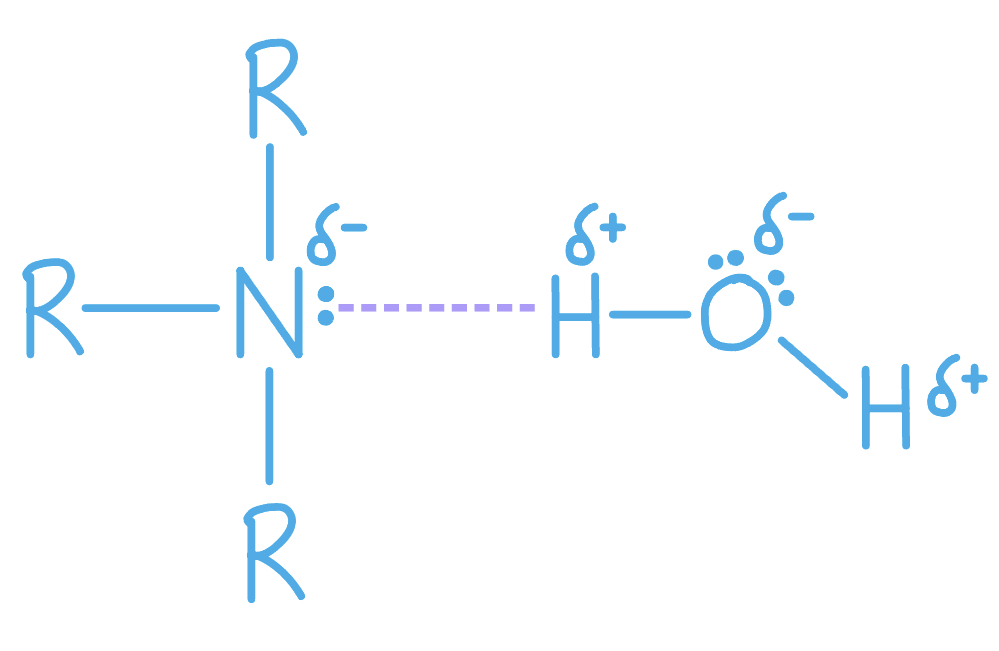

### 11((c)) — 4 marks
The completed mechanism for this proposed reaction is:

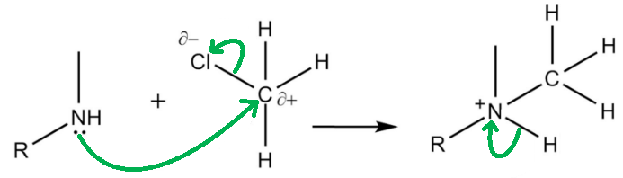

- Curly arrow from the lone pair of the nitrogen atom to the δ+ carbon atom; **[1 mark]**
- Correct dipole shown on the C–Cl bond **AND **a curly arrow from the C–Cl bond to the Cl atom or just beyond; **[1 mark]**
- Correct formula of the intermediate including the + charge on the N atom;** [1 mark]**
- Arrow from the N-H bond to the N+; **[1 mark] **

**Final answer:** **[Total: 4 marks] **

- *Don't be put off by the more complex compound names, the mechanism will still involve the same steps *
- *The reaction mechanism that takes place between ammonia and a haloalkane (such as chloromethane) is nucleophilic substitution*

  - *The lone pair on the nitrogen atom means that the amine can act as a nucleophile *
  - *This lone pair will attack the δ+ C atom *
- *Remember: **Make sure your arrows go from an area of negative charge to a positive charge*

## Q2 — medium — 6 marks · structured-questions

### 12((a)) — 2 marks
The two monomers that produce this polymer are:

- 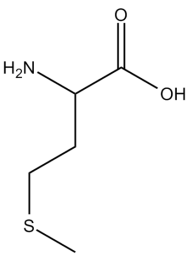

  - ; **[1 mark]**
-  ; **[1 mark]**

**Final answer:** **[Total: 2 marks] **

- *You would not gain the mark if you use acyl chlorides to show the monomers *
- *The polymer is an example of a polyamide*

  - *In order to work out the structures of the two monomers you must look for the amide link *

### 12((b)) — 2 marks
The structures of the two monomers that produce this polymer are:

- 

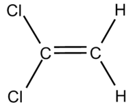

; **[1 mark]**

- 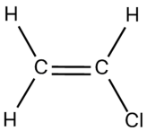 ; **[1 mark]**

**Final answer:** **[Total: 2 marks] **

- *The polymer is formed from addition polymerisation *

  - *There is no ester or amide link present *
- *During addition polymerisation, the double bond opens up and bonds onto the next monomer*
- *The arrangement of atoms which are bonded to the carbons in the double bond does not change*

  - *This means that you can just draw them in the same place *

### 12((c)) — 2 marks
To calculate the approximate number of repeat units in the polymer:

- Molar mass of repeat unit = (12 × 12) + 14 = 158 (g mol−1);** [1 mark]**
- Number of repeat units = $\frac{300000}{158}$ = 1898.73 → 1899 **OR **1900 (units); **[1 mark] **

**Final answer:** **[Total: 2 marks] **

- *The final answer must be rounded up to a whole number as you cannot have 0.73 of a repeat unit *
- *The total molar mass is 300 000 g mol**-1*
- *The molar mass of 1 repeat unit is: *

  - *12 x C = 144 *
  - *14 x H = 14*
  - *14 + 144 = 158 g mol**-1** *
  
    - *Careful: **There are "hidden hydrogens" on the benzene ring*
- *The number of units is *$\frac{\mathrm{total} \mathrm{molar} \mathrm{mass}}{\mathrm{molar} \mathrm{mass} \mathrm{of} \mathrm{repeating} \mathrm{unit}}$

## Q3 — medium — 17 marks · structured-questions

### 19((a)) — 5 marks
i) The functional group present in **X** is:

- Amine; **[1 mark]**

ii) The molar mass of **X** is:

- **Rearrange the ideal gas equation:** *n* = $\frac{pV}{RT}$; **[1 mark]**
- **Change volume to m****3**: 157 cm3 = 1.57 x 10-4 / 0.000157 m3 **AND** **Change temperature to K**: 15 + 273 = 288 K; **[1 mark]**
- **Evaluate *****n****: n* = $\frac{103000\times1.57\times10^{-4}}{8.31\times288}$ = 6.7568 x 10−3; **[1 mark]**
- **Calculate molar mass**: *M*r = 0.493 ÷ 6.7568 x 10−3 = 72.963 = 73 (g mol-1); **[1 mark]**

**[Total: 5 marks]**

- *You should know that amines are basic as they act as Bronsted-Lowry bases in aqueous solutions by donating the  lone pair of electrons on the nitrogen atom to a proton, forming a dative bond*
- *Basic compounds will turn damp red litmus paper blue*
- *When using the ideal gas equation, ensure that you convert the units to the necessary units:*

  - *Volume in m**3** (multiply cm**3 **by 1 x 10**6**)*
  - *Pressure in Pa*
  - *Temperature in K (°C + 273)*
- *The most common mistakes are not / incorrectly converting units and rearranging the equation incorrectly*
- *You could alternatively rewrite the Ideal Gas Equation in terms of mass and molar mass:*

  - $pV=\frac{m}{M_{r}}RT$
- *And rearrange to give **M**r**:*

  - $M_{r}=\frac{mRT}{pV}$
- *A correct answer with some working scores 4 marks but a correct answer with no working scores 0 marks, so make sure you show the working, especially when the question prompts you to*

### 19((b)) — 5 marks
i) The steamy fumes, by name or formula is:

- Hydrogen chloride / HCl; [1 mark]

ii) The functional group present in **Y **is:

- N-substituted amide / -CONHR;

iii) The empirical formula of **Y **is:

|   | **C** | **H** | **N** | **O** |
|---|---|---|---|---|
| **%** | **62.6** | **11.3** | **12.2** | **13.9** |
| **mol** | $\frac{62.6}{12}$  **(= 5.1267)** | $\frac{11.3}{1}$  **(= 11.3)** | $\frac{12.2}{14}$  **(= 0.8714)** | $\frac{13.9}{16}$  **(= 0.86875)** |
| **Ratio** | **5.9 / 6.0** | **13.0** | **1.0** | **1.0** |

- Conversion of percentages by mass into moles;
- Evaluation of moles 
**AND** 
Division by the smallest value to give a ratio;
- Conversion of ratio into an empirical formula: C6H13NO;

**[Total: 5 marks]**

- *The reaction between an amine and ethanoyl chloride is an addition-elimination reaction meaning two molecules join together, and then a small molecule is eliminated - in this case, hydrogen chloride, which forms the steamy fumes*

  - *Hydrochloric acid or HCl (aq) are also accepted answers*
- *The organic product contains a new functional group - amide - in which a carbonyl group is next to an NH group*
- *An example is the reaction of butylamine with ethanoyl chloride:*

  - *CH**3**COCl + CH**3**CH**2**CH**2**CH**2**NH**2** → CH**3**CONHCH**2**CH**2**CH**2**CH**3** + HCl*
- *The resulting amide is an N-substituted amide, as two different groups are attached to the nitrogen atom*
- *For the name of the functional group of **Y**, other accepted answers are:*

  - *Amide*
  - *Acid amide*
  - *-CONH**2*
  - *-CONH-*
- *When deciding the empirical formula, don't forget to convert the ratio of atoms into an empirical formula - it is surprising how many times students forget to do this, even though they have done all of the hard work!*
- *For the empirical formula, a correct answer with no working scores 1 mark*

### 19((c)) — 6 marks
The structure of **Y **is:

**Chemical ideas expressed**

- Three peaks indicates three proton environments 
**OR** 
Three types of proton / hydrogen
- No splitting / peaks have one split shows no proton environment is adjacent to another
- Chemical shift = 7 (ppm) indicates N—**H** proton
- Nine protons in one environment and no coupling indicates (CH3)3C—
- Chemical shift = 2 (ppm) indicates C**H**3C=O protons
- Structure of **Y** is

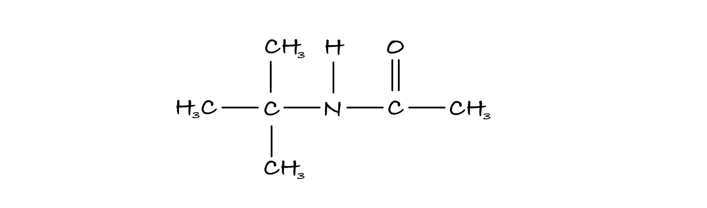

**[Total: 6 marks]**

- *As this spectrum was made using high-resolution NMR, if any of the protons environments were adjacent to each other, the peaks would have shown some splitting*
- *This is the key to deducing the structure*
- *Together with knowing from part (b) that the functional group is -CONHR and its empirical formula is C**6**H**13**NO, it is a matter of trying to piece together the formula that satisfies the number of protons in each proton environment which is given by the relative peak areas*
- *You could give the formula as displayed, structural, skeletal or any combination of these*
- *You could have also scored a mark for identifying CH**3**C=O is indicated by an amide responsible at the chemical shift at 2 ppm **OR **that CH**3**C=O is indicated by the reaction with ethanoyl chloride*
- *An answer scoring** 6** marks would include*

  - *6 correct marking points **AND **the answer is written in a clear and logical order and points fully explained *
- *An answer scoring** 5** marks would include*

  - *5-4 correct marking points **AND **the answer is written in a clear and logical order and points fully explained *
- *An answer scoring** 4** marks would include*

  - *4-3 correct marking points **AND **the answer has some structure and gives some explained points*
- *An answer scoring **3** marks would include*

  - *3-2 correct marking points **AND **the answer has some structure and gives some explained points*

### 19((d)) — 1 marks
The structure of **X** is:

- 

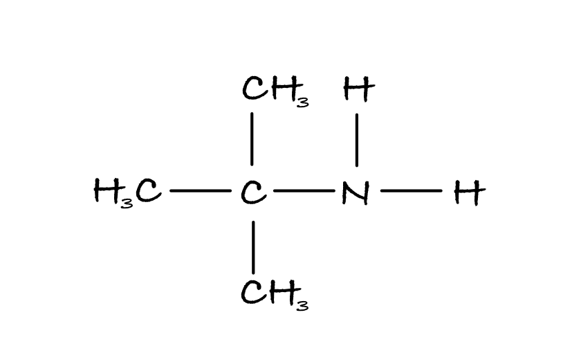

;** [1 mark]**

**[Total: 1 mark]**

- *You could draw the displayed, structural or skeletal formulae or any combination of these for this mark*
- *Acyl chlorides undergo condensation reactions with ammonia and amines to form amides*
- *The amide, **Y**, can be produced from the reaction of ethanoyl chloride and primary amine, **X*

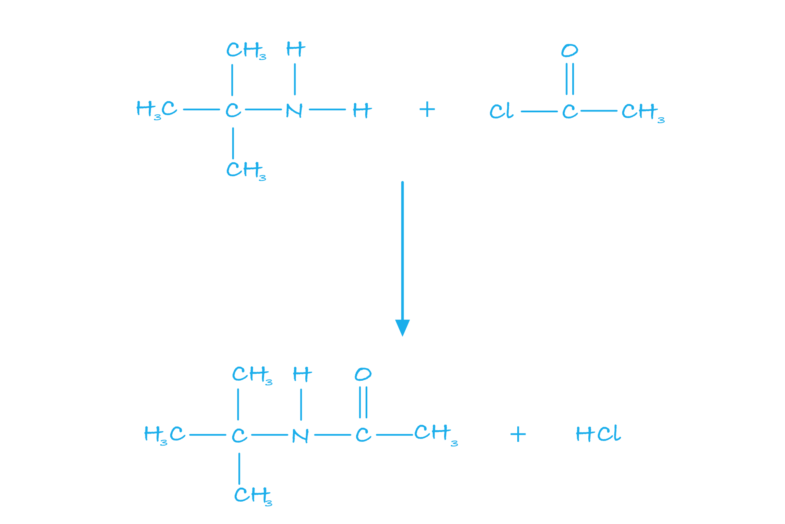

## Q4 — medium — 15 marks · structured-questions

### 1() — 7 marks
i) Molecules in order of increasing base strength:

- Phenylamine < ammonia < N-methylethylamine 
**OR** 
Phenylamine is the weakest **AND** N-methylethylamine is the strongest base; **[1 mark]**

ii) Explain your answer to part (i):

- Base strength depends on the <u>availability of the lone pair on the N</u> atom; **[1 mark]**
- N-methylethylamine strongest due to <u>positive inductive effect</u> from alkyl groups 
**OR** 
Alkyl groups on N-methylethylamine push electrons / negative charge towards the N; **[1 mark]**
- <u>Lone pair more/most available</u> to accept proton in <u>N-methylethylamine</u>; **[1 mark]**
- In <u>phenylamine </u>the <u>N atom is bonded directly to the benzene</u> ring; **[1 mark]**
- <u>Lone pair on the N becomes delocalised</u> within/into the benzene ring 
**OR** 
<u>Overlap of the lone pair on N and the benzene</u> ring electrons; **[1 mark]**

- <u>Lone pair</u> on N is <u>no longer/not fully available</u> to accept a proton; **[1 mark]**

**[Total: 7 marks]**

- *The greater the electron density on the nitrogen atom in an amine the more likely the lone pair is to be available for bonding*

  - *Alkyl groups have a tendency to push electrons away from themselves and onto the nitrogen atom*
  - *There are two alkyl groups in N-methylethylamine, a secondary amine, and none in ammonia*
- *This is known as the positive inductive effect*

  - *The more alkyl groups there are the more available the lone pair of electrons is on the nitrogen atom*
- *In phenylamine the lone pair on the nitrogen atom is drawn towards the delocalisation in the ring and this interaction makes the lone pair less available to bond with an incoming proton (H**+** ion)*

### 2() — 3 marks
Name the type of reaction and suggest suitable reagents and conditions for the conversion of nitrobenzene to phenylamine

- Reduction;** [1 mark]**

Alternative 1

- Sn / tin **AND** concentrated HCl; **[1 mark]**
- Heat **AND** NaOH solution; **[1 mark]**

Alternative 2

- H2; **[1 mark]**
- Ni/ Pt/ Pd catalyst; **[1 mark]**

Alternative 3

- LiAlH4; **[1 mark]**
- Dry ether; **[1 mark]**

**[Total: 3 marks]**

- *Once the benzene ring has undergone nitration the NO**2** group can then be reacted with appropriate reducing agents*
- *Nitration of a benzene ring followed by the reduction of the NH**2** group is a common pathway so it is worth making sure you have learned this thoroughly*
- *LiAlH**4** in dry ether is an almost universal reducing agent and works in most examples of organic reduction. It can be used to convert nitrile groups (-CN) to amino groups (-NH**2**) so is very important in the production of amines*

### 3() — 3 marks
i) Suggest a condition that could be added to ensure that the salt would not break down during the reaction:

- Completed at a low temperature 
**OR** 
Done in ice / ice cold conditions; **[1 mark]**

ii) The structure of the organic compound formed in the ice-cold acidic mixture is:

- Structure showing nitrogen containing group with triple bond **AND** positive charge on correct N atom **AND **negative charge on the Cl; **[1 mark]**

**[Total: 2 marks]**

- *In order for the nitrous acid to be used in this process it must be made in situ as it is an unstable compound*

  - *The reaction must also be kept at a low temperature to prevent this from decomposing*
- *The equation for the reaction is:*

  - *NaNO**2 **(aq) + HCl (aq) → HNO**2 **(aq) + NaCl (aq)*
- *The acid can then react with the amine to produce a diazonium salt*
- *A Nitrogen atom that has four bonds will have a positive charge as it is electron deficient*

### 4() — 2 marks
Suggest a structure for the azo dye if the coupling agent used is 2,6-dimethylphenol:

- Correct bond link between N atom and the coupling agent;** [1 mark]**
- Correct overall structure;** [1 mark]**

**[Total: 2 marks]**

- *The -OH group should be the opposite side of the nitrogen containing group*

  - *A coupling agent is an arene compound that will bond to the diazonium salt*
  - *The diazonium salt acts as an electrophile*
  - *Coupling of diazonium salts with different aromatic compounds forms dyes of different colours*

## Q5 — medium — 10 marks · structured-questions

### 1() — 4 marks
> **[mark-scheme]**
> The reagents, conditions and type of reaction are:
> 
> Step 1:
> 
> - Reagents and conditions: concentrated nitric acid / HNO3 with concentrated sulfuric acid / H2SO4
> **AND**
> A temperature in the range 30 - 55 °C **[1 mark]**
> - Type of reaction: electrophilic substitution
> **OR**
> Nitration **[1 mark]**
> 
> Step 2:
> 
> - Reagents and conditions: Tin / Sn with concentrated hydrochloric acid / HCl, followed by (aqueous) sodium hydroxide / NaOH
> **OR**
> Hydrogen / H2 with a nickel / Ni / palladium / Pd / platinum / Pt catalyst **[1 mark]**
> - Type of reaction: reduction
> **OR**
> Redox **[1 mark]**
> 
> Each part is marked independently but nitration must occur before reduction
> 
> For both steps, allow conc instead of concentrated and temperatures above 55 °C are not accepted
> 
> For Step 2, using iron / Fe or zinc / Zn instead of tin is accepted

> **[exam-tip]**
> Step 1
> 
> The most common error is writing "nitric acid and sulfuric acid" without "concentrated". Both acids must be concentrated because the nitrating mixture only generates the reactive NO2+ electrophile under strongly acidic conditions.
> 
> Temperature control also matters because the ring undergoes dinitration and gives the wrong product above 55 °C.
> 
> Step 2
> 
> The most common error is writing about the Sn / HCl reducing mixture but stopping there. The initial product is a phenylammonium salt, and the free amine is only released when aqueous NaOH is added. Always include the alkali step if you use the Sn / HCl route.
> 
> Catalytic hydrogenation (H2 with a Ni, Pd, or Pt catalyst) is an alternative that gives the free amine directly, without needing the additional alkali step.

### 2() — 2 marks
> **[mark-scheme]**
> The methyl group directs to the 4-position because:
> 
> - It is electron-releasing / electron-donating
> **OR**
> It has a positive inductive effect 
> **OR**
> It pushes electrons into the ring **[1 mark]**
> - This increases the electron density of the (benzene) ring specifically at the 2-, 4- (and 6-) positions
> **OR**
> This makes the 2-, 4- (and 6-) positions more susceptible to electrophilic attack
> **OR**
> This makes the 2-, 4- (and 6-) positions more nucleophilic **[1 mark]**
> 
> For the second mark, "increases the electron density of the ring" is not accepted without correctly specifying the positions

> **[exam-tip]**
> Nitration occurs at position 4 rather than position 3 because alkyl groups like methyl are electron-releasing, pushing electron density into the ring at the 2-, 4- and 6- positions. The 3- (and 5-) position  receives less electron density, making it attractive to an electrophile like NO2+.
> 
> The most common error is just writing that the methyl group "activates the ring" or "makes the ring more electron-rich". This will not gain the second mark because the positions gaining the extra electron density are not specified. So, your answer must name the 2- and 4-positions.

### 3() — 4 marks
> **[mark-scheme]**
> The number of peaks in the 13C NMR spectrum of each compound is:
> 
> - Compound **A** (4-methylphenylamine): five / 5 peaks **[1 mark]**
> - Compound **B **(2-methylphenylamine): seven / 7 peaks **[1 mark]**
> 
> Explanation:
> 
> - Compound **A** is symmetrical / has a plane of symmetry (so pairs of carbon atoms in the ring are in equivalent environments)
> **OR**
> In compound **A**, carbons 2 and 6 are equivalent **AND **carbons 3 and-5 are equivalent **[1 mark]**
> - Compound **B **is asymmetrical / lacks a plane of symmetry
> **OR**
> All carbon atoms are in different environments / there are no equivalent carbons **[1 mark]**
> 
> The explanation marking points cannot be awarded if the answer talks about proton (1H) environments instead of carbon environments.

> **[exam-tip]**
> When counting 13C NMR peaks, count every distinct carbon environment in the entire molecule, including the methyl group carbon. A common mistake is to focus only on the benzene ring and overlook the CH3 carbon, giving answers of 4 and 6 instead of 5 and 7.
> 
> For symmetrical molecules like compound A, use the plane of symmetry to identify equivalent carbons. The vertical mirror plane in 4-methylphenylamine makes carbon 2 equivalent to carbon 6 and carbon 3 equivalent to carbon 5. This reduces seven carbon atoms to five unique environments. Compound B has no plane of symmetry, so all seven carbons are distinct.
> 
> Make sure you are counting carbon environments, not hydrogen environments.
> 
> - 13C NMR gives one peak per unique carbon, regardless of how many hydrogens are attached.
> - If you are thinking about splitting patterns or the number of attached protons, you have switched to 1H NMR thinking.

## Q6 — hard — 21 marks · structured-questions

### 21((a)) — 1 marks
The completed left‐hand side of the equation is:

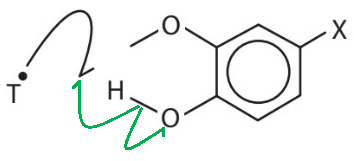

- Two curly fish hook / half-arrows to show homolytic fission of the O–H bond; **[1 mark]**

**[Total: 1 mark]**

- *Careful**: Your arrows cannot be double-headed as this is a free radical mechanism*
- *To get TH and an oxygen radical in the curcumin molecule, the O–H bond must break homolytically *

### 21((b)) — 3 marks
The completed mechanism for the step shown is:

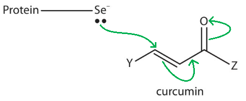

- A curly arrow from the <u>lone pair</u> on Se to the correct C of the carbon-carbon double bond / C=C; **[1 mark]**
- A curly arrow from the C=C bond to the adjacent carbon-carbon single bond / C–C bond **AND** 
A curly arrow from the C=O bond to the oxygen atom / O; **[1 mark]**

**[Total: 2 marks]**

- *Although this is an unfamiliar mechanism, your knowledge of mechanisms / curly arrows and the diagram given should allow you to score maximum marks for this question*

  - *A new bond forms between the selenium and carbon*
  - *This causes the carbon-carbon double bond / C=C moves along one on the carbon chain*
  - *As a result of this, the carbonyl bond / C=O breaks heterolytically giving the O**–** shown in the product*
- *Careful:** Make sure that your curly arrows start from lone pairs or the centre of bonds that are breaking / moving*

### 21((c)) — 2 marks
The completed table is:

|   | **[Au(curc)****2****]****+** | **[Al(curc)(C****2****H****5****OH)****2****(NO****3****)****2****]** |
|---|---|---|
| Coordination number | 4 | **Final answer:** **6** |
| O–M–O bond angle | 90° | **Final answer:** **90°** |
| Shape | **Final answer:** **square planar** | octahedral |
| Charge on metal ion | **Final answer:** **+3** | +3 |

- All **four** answers correct; **[2 marks]**
- **Two** or **three **answers correct; **[1 mark]**

**[Total: 2 marks]**

- *The [Au(curc)**2**]**+** complex:*

  - *The only way this complex can have a coordination number of 4 **AND** an O–M–O bond angle of 90° is if the shape is square planar*
  - *The charge on the metal ion will be the same as the other complex as only the ligands have been changed, there is no mention of the oxidation state of gold changing in the question *
  - *Also, the charge on each ligand is 1- and the overall charge of the complex is 1+, so Au must have a 3+ charge: 2 x (1-) + (3+) = 1+*
- *The [Al(curc)(C**2**H**5**OH)**2**(NO**3**)**2**] complex:*

  - *Octahedral complexes have a coordination number of 6*
  - *Octahedral complexes have bond angles of 90° and 180° but the question clearly stated that the curcumin anion occupies adjacent coordination sites in the complex*
  
    - *This means that the O–M–O bond angle cannot be 180° *

### 21((d)) — 7 marks
i) The reagents and conditions needed in Step **X** are:

- Reagents = sodium / potassium dichromate(VI) / K2Cr2O7 / Na2Cr2O7 / Cr2O72–  
**AND**
Sulfuric acid / H2SO4 / H+; **[1 mark]**
- Conditions = heat / reflux; **[1 mark]**

ii) The structure of compound **A** is:

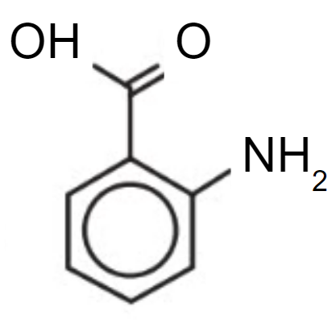

Correct structure of 2-aminobenzoic acid

- **OR**
Correct structure of the 2-aminobenzoic acid hydrochloride salt / with the NH2 replaced by NH3Cl
**OR**
Correct structure of 2-aminobenzoic acid with a protonated amine group / with the NH2 replaced by NH3+; **[1 mark]**

iii) The reagents needed in Step** Y **are:

- NaNO2 / sodium nitr<u>**ite**</u> / sodium nitrate(III) **AND **HCl / hydrochloric acid
**OR**
HNO2 / nitrous acid
**OR**
H+ **AND **NO2–; **[1 mark]**

iv) The structure of compound** B** is:

- 

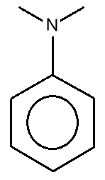

; **[1 mark]**

v) The temperature should be neither higher nor lower than 5 °C because:

Above 5 oC:

- The diazonium / it decomposes
**OR**
The diazonium / it reacts with water
**OR**
The diazonium / it forms a phenol 
**OR**
The diazonium / it undergoes nucleophilic substitution; **[1 mark]**

Below 5 oC:

- The reaction / rate of reaction is too slow; **[1 mark]**

**[Total: 7 marks]**

- *You need to know the various reagents, conditions and products for converting one functional group into another*

  - *2-nitrobenzaldehyde is oxidised to 2-nitrobenzoic acid, which is the classic conversion of an alcohol to a carboxylic acid by acidified potassium dichromate(VI)*
  - *2-nitrobenzoic acid is reduced to 2-aminobenzoic acid by heating under reflux with tin and concentrated hydrochloric acid*
  - *2-aminobenzoic acid is converted in step **Y** to the azo compound using sodium nitrite and hydrochloric acid*
- *In step **Z**, the triple bond of the azo compound is broken and attaches, in the 4-position, to N,N-dimethylphenylamine*
- *Steps **Y **and **Z** have to be performed at low temperatures for the reasons given in the mark scheme, but this is at the expense of the reaction rate *

### 21((e)) — 5 marks
i) The completed equation for this reaction is:

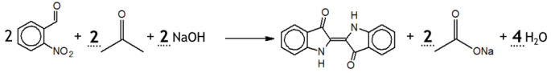

- Correct balancing of propanone (2) **AND** sodium ethanoate (2); **[1 mark]**

The second mark is dependent on the correct balancing of propanone and sodium ethanoate

- Correct balancing of sodium hydroxide (2) **AND** water (4); **[1 mark]**

ii) The mass of 2‐nitrobenzaldehyde required to make 10.0 g of indigotin from this reaction with an 85.0% yield is:

Option 1:

- *M*r of 2-nitrobenzaldehyde = 151 (g mol-1)
**AND**
*M*r of indigotin = 262 (g mol-1); **[1 mark]**
- Mass of indigotin with a 100% yield = $\frac{100}{85}\times10.0$ = 11.765 (g)
**AND**
Moles of indigotin with a 100% yield = $\frac{11.765}{262}$ = 0.044903; **[1 mark]**
- Moles of 2-nitrobenzaldehyde = 0.044903 x 2 = 0.089807
**AND**
Mass of 2-nitrobenzaldehyde = 0.089707 x 151 = 13.561 **OR **14 g; **[1 mark]**

Option 2:

- *M*r of 2-nitrobenzaldehyde = 151 (g mol-1)
**AND**
*M*r of indigotin = 262 (g mol-1); **[1 mark]**
- Moles of indigotin in 10.0 g = $\frac{10.0}{262}$ = 0.038168
**AND**
Moles of 2-nitrobenzaldehyde (85% yield) = 0.038168 x 2 = 0.076336; **[1 mark]**
- Moles of 2-nitrobenzaldehyde (100% yield) = $\frac{100}{85}\times0.076336$ = 0.089807
**AND**
Mass of 2-nitrobenzaldehyde = 0.089707 x 151 = 13.561 **OR **14 g; **[1 mark]**

**[Total: 5 marks]**

- *The synthesis of indigotin is relatively quick / simple to perform*
- *However, it is complex involving a series of condensation, disproportionation and oxidation reactions*

  - *Therefore, take your time balancing the equation*
  - *Focusing on the equation, the propanoate molecule loses a methyl group which forms the missing carbon in the pentagon ring of each half of the indigotin molecule*
  
    - *Therefore, you will need 2 propanoates*
    - *The 2 propanoate molecules will form 2 sodium ethanoates *
    - *This means that you need 2 sodium hydroxides*
  - *After this, you need to balance the water molecules*
- *To be able to calculate the mass of 2-nitrobenzaldehyde needed to make 10.0 g of indigotin assuming an 85% yield:*

  - *You need to know the molar masses of 2-nitrobenzaldehyde and indigotin*
  
    - *2-nitrobenzaldehyde = (7 x 12.0) + (5 x 1.0) + 14.0 + (3 x 16.0) = 151 g mol**-1** *
    - *Indigotin = (16 x 12.0) + (10 x 1.0) + (2 x 14.0) + (2 x 16.0) = 262 g mol**-1** *
  - *You can then follow either method to calculate the mass*
  
    - *Remember:** The reaction has an 85% yield that has to be accounted for in your calculation *

### 21((f)) — 3 marks
i) The structure of the organic product when coumarin 440 undergoes hydrolysis with **excess** aqueous sodium hydroxide is:

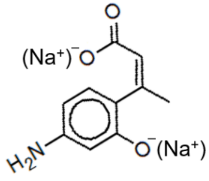

- Clearly hydrolysed ester linkage
**AND**
Correct carbon frame with an amine group; **[1 mark]**
- Deprotonated carboxylic acid
**AND**
Deprotonated phenol groups; **[1 mark]**

ii) The structure of the organic product when coumarin 440 undergoes condensation with ethanoyl chloride is:

- 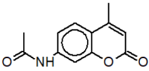 **OR** 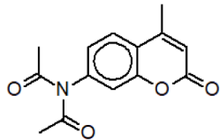 ; **[1 mark]**

**[Total: 3 marks]**

- *For part (i)*

  - *The ester linkage on the coumarin 440 molecule is broken by the :OH**–** group from the sodium hydroxide* 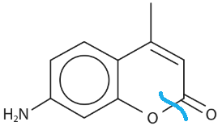 * *
  - *This results in the following structure* 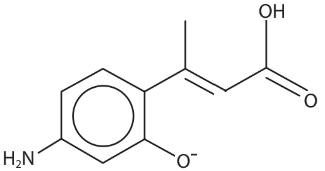
  - *Since the sodium hydroxide is in excess, the OH group is deprotonated. The deprotonated OH group and the O**–** both form O**–**Na**+** salts shown in the mark scheme*
- *For part (ii)*

  - *This reaction is a condensation / nucleophilic addition-elimination reaction to form an amide*
  - *Tip: **Draw the coumarin 440 molecule as the general R–NH**2** molecule to make it easier to deduce the final product*
  
    - *Draw this general R–NH**2** molecule next to an ethanoyl chloride molecule placing the acyl chloride group and amine group next to each other* 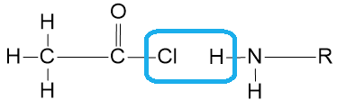
    - *This allows you to see the small molecule that is going to be formed as a by-product*
    - *Remove the HCl and connect the C=O with the N-H to form the -CONH- amide group*
    - *Finish your answer off by replacing the R group with the main fragment of coumarin 440 that you removed*

## Q7 — medium — 1 marks · multiple-choice-questions

### 12() — 1 marks
**Correct answer: A** — amides

**Final answer:** **The correct answer is ****A**** because:**

- To form a polyamide, the monomers required are:

  - A diamine and dicarboxylic acid
  - A diamine and dioyl chloirde
  - Amino acids
- Amides do not join together to form polyamides

**B** is incorrect as amino acids combine to form polypeptides and proteins, which are polyamides

**C** is incorrect as  diacyl chlorides combine with diamines to form polyamides

**D** is incorrect as diamines combine with diacyl chlorides to form polyamides

## Q8 — medium — 1 marks · multiple-choice-questions

### 12() — 1 marks
**Correct answer: C** — 2-methylbutanamide

**Final answer:** **The correct answer is ****C**** because: **

- The longest chain incorporating the amide group, CONH2, is a butane chain

  - This means that the compound will have butanamide as part of its name
- Carbon 1 is the amide carbon

  - This means that there is a methyl group attached to carbon 2
- Therefore, the compound is called 2-methylbutanamide

**A** and **B** are incorrect as  the amide carbon is part of the main carbon chain

**D **is incorrect as** ** the carbon chain is numbered from the amide end

## Q9 — medium — 1 marks · multiple-choice-questions

### 13() — 1 marks
**Correct answer: C** — CH3CH2CH2NH2 > NH3 > C6H5NH2

**Final answer:** **The correct answer is ****C**** because: **

- The nitrogen atom in ammonia and amine molecules can accept a proton (H+ ion) by donating its lone pair of electrons to a proton and forming a dative bond, thus acting as a Brønsted-Lowry base
- Alkyl groups donate electron density to the nitrogen atom causing the lone pair of electrons to become more available

  - This means that the nitrogen lone pair is more able to form a dative covalent bond and therefore is a stronger base than ammonia
- Aromatic rings such as the benzene ring cause the lone pair of electrons on the nitrogen atom to be delocalised into the benzene ring

  - This means that the nitrogen lone pair is less available to form a dative covalent bond and therefore is a weaker base than ammonia
- This means that CH3CH2CH2NH2 is a stronger base than NH3 and that NH3 is a stronger base than C6H5NH2
- **Careful: **The question asks for the order in **decreasing **basicity, which means that you should start with the strongest base

**A** is incorrect as  C6H5NH2 is the weakest base in the sequence

**B **is incorrect as** ** CH3CH2CH2NH2 is a stronger base than NH3

**D **is incorrect as** ** this shows the order of increasing basicity

## Q10 — medium — 2 marks · multiple-choice-questions

### 13((a)) — 1 marks
**Correct answer: B** — 

**Final answer:** **The correct answer is ****B**** because:**

- Alanine will exist as a zwitterion with both acidic and basic properties:

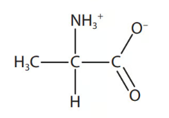

- If the pH is** **high, the zwitterion will react with OH-:

  - The -NH3+ part of the zwitterion will donate an H+ ion to OH- to reform the -NH2 group and produce water
  - This causes the zwitterion to become a negatively charged ion, with the structure shown in **B**

**A** is incorrect as this structure is only possible near neutral pH

**C** is incorrect as  this structure is formed at low pH

**D** is incorrect as this structure dominates at neutral pH

### 13((b)) — 1 marks
**Correct answer: D** — ionic bonds

**Final answer:** **The correct answer is ****D**** because:**

- Alanine will exist as a zwitterion, even in the solid state, so will have both a positive (-NH3+) and a negative** **(-COO-) charge
- Ionic bonds form between these opposite charges in neighbouring molecules
- Ionic bonds are the reason why amino acids have higher than expected melting temperatures

**A** is incorrect as  van der Waals forces are the weakest forces broken

**B** is incorrect as  hydrogen bonds are weaker than ionic bonds

**C** is incorrect as  covalent bonds are not broken when amino acids melt

## Q11 — medium — 1 marks · multiple-choice-questions

### 13() — 1 marks
**Correct answer: C** — phenylamine, ammonia, butylamine

**Final answer:** **The correct answer is ****C**** because: **

- The nitrogen atom in ammonia and amine molecules can accept a proton / H+ ion

  - The base strength of amines depends on the ability of the lone pair of electrons on the nitrogen atom to accept a proton and form a dative covalent bond
- Butylamine will be the strongest base as the alkyl group releases electrons and pushes electrons towards the nitrogen atom

  - This means that the nitrogen is more able to accept a proton / is a stronger base
- Phenylamine will be the weakest base as the lone pair of electrons on the nitrogen delocalise with the ring of electrons in the benzene ring

  - This means that the nitrogen is less able to accept a proton / is a weaker base

**A** is incorrect as butylamine has the highest pH and phenylamine the lowest

**B **is incorrect as** **phenylamine has the lowest pH

**D **is incorrect as** ** phenylamine has a lower pH than ammonia

## Q12 — medium — 1 marks · multiple-choice-questions

### 14() — 1 marks
**Correct answer: B** — 

**Final answer:** **The correct answer is ****B**** because: **

- Carbon typically forms 4 covalent bonds
- Nitrogen typically forms 3 covalent bonds
- The nitrile / C$\equiv$N bond is a triple bond
- Reverting all four compounds back to the parent nitrile compound allows the number of bonds on the nitrile carbon to be checked

| **Final answer:** **A**  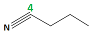 | **Final answer:** **B**  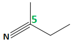 | **Final answer:** **C**  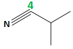 | **Final answer:** **D**  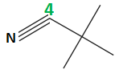 |
|---|---|---|---|

**A** is incorrect as this amine could be prepared by the reduction of butanenitrile

**C **is incorrect as** **this amine could be prepared by the reduction of 2-methylpropanenitrile

**D **is incorrect as** ** this amine could be prepared by the reduction of 2,2-dimethylpropanenitrile

## Q13 — medium — 1 marks · multiple-choice-questions

### 14() — 1 marks
**Correct answer: A** — 

**Final answer:** **The correct answer is ****A**** because: **

- The polymer is an addition polymer as there is no functionality within the carbon chain
- This means that you can remove the continuation bonds, brackets and n and place a carbon=carbon double bond / C=C on the remaining carbon-carbon single bond / C-C

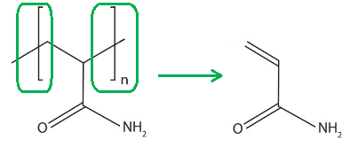

**B** is incorrect as this monomer has four carbon atoms not three and would give a polymer with a methyl group on a different carbon to the amide group

**C **is incorrect as** ** this monomer has four carbon atoms not three and would give a polymer with a methyl group branched chain

**D **is incorrect as** ** this monomer has five carbon atoms not three and would give a polymer with two methyl group branched chains

## Q14 — medium — 1 marks · multiple-choice-questions

### 15() — 1 marks
**Correct answer: B** — 4

**Final answer:** **The correct answer is ****B**** because: **

- Amino acids are formed by the condensation reaction of the carboxylic acid group of one monomer with the amine group of another monomer, which forms the amide bond -CONH-
- Breaking the C-N bond of each amide group in the main chain gives 6 potential monomers
- The first monomer on the left and the last monomer on the right are the same monomer but upside down
- The second monomer on the left and the second to last monomer on the right are the same monomer but, again, upside down

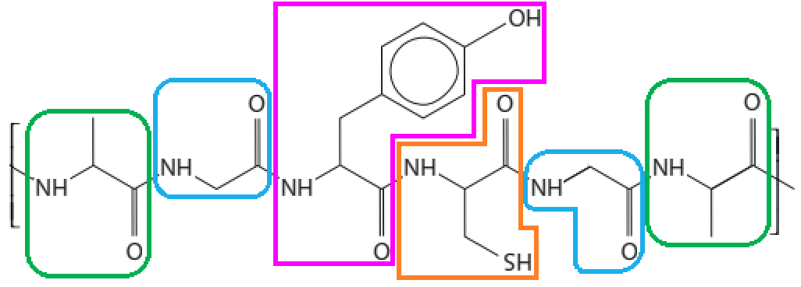

- Overall, there are 4 individual, different amino acids that are used to form the polymer

**A**, **C** and **D** are incorrect as the polymer is formed from four different amino acids

## Q15 — medium — 1 marks · multiple-choice-questions

### 15() — 1 marks
**Correct answer: D** — a polyamide but not a polypeptide

**Final answer:** **The correct answer is ****D**** because: **

- A polypeptide is a specific type of polyamide that is made from monomers that are amino acids

  - This repeat unit is made from two monomers:

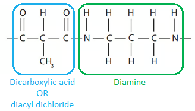

- This means that the polymer cannot be a polypeptide

- When the repeat units combine to form the polymer, it will have the amide / –CONH– linkage

  - This means that the polymer is a polyamide

**A** is incorrect as  polypeptides are formed from amino acids

**B **is incorrect as** **it is a polyamide

**C **is incorrect as** ** it cannot be a polypeptide

## Q16 — medium — 1 marks · multiple-choice-questions

### 1() — 1 marks
**Correct answer: C** — Phenylamine < ammonia < butylamine

**Final answer:** **The correct answer is C**

- Base strength depends on the availability of the nitrogen lone pair to accept a proton
- In phenylamine:

  - The nitrogen lone pair is partially delocalised into the aromatic ring.
  - This reduces the electron density on nitrogen, making it less available to accept a proton.
  - Phenylamine is the weakest base.
- In ammonia:

  - The lone pair is fully available but there are no electron-donating groups to enhance it
- In butylamine:

  - The alkyl group exerts a positive inductive effect.
  - This increases electron density on nitrogen, making the lone pair more available to accept a proton.
  - Butylamine is the strongest base.

**A** is incorrect as this lists the compounds in decreasing order of base strength, not increasing. Phenylamine is the weakest base, not the strongest.

**B** is incorrect as ammonia is not the weakest base. Phenylamine is weaker than ammonia because the nitrogen lone pair is partially delocalised into the aromatic ring, reducing its availability to accept a proton.

**D** is incorrect as butylamine is a stronger base than ammonia. The alkyl group exerts a positive inductive effect, increasing electron density on the nitrogen and making the lone pair more available to accept a proton than in ammonia.

## Q17 — medium — 1 marks · multiple-choice-questions

### 1() — 1 marks
**Correct answer: A** — 

**Final answer:** **The correct answer is A**

- Diazotisation requires sodium nitrite (NaNO2), which reacts with dilute HCl to generate nitrous acid (HNO2) in situ
- Acidic conditions are essential as HNO2 only forms when a strong acid is present
- The temperature must be kept below 10°C to prevent decomposition of the unstable diazonium ion (C6H5N2+)

**B** is incorrect as NaNO3 (sodium nitrate) cannot react with HCl to generate HNO2. Only sodium nitrite (NaNO2) produces the nitrous acid needed for diazotisation.

**C** is incorrect as temperatures above 10°C cause the diazonium ion to decompose, releasing N2 gas and forming phenol rather than the desired diazonium salt.

**D** is incorrect as NaOH provides alkaline conditions under which HNO2 cannot form. Dilute HCl is required. Alkaline conditions are used in the second step of azo dye synthesis (coupling with a phenol), not in diazotisation.

## Q18 — medium — 1 marks · multiple-choice-questions

### 1() — 1 marks
**Correct answer: B** — H3N+CH2COO-

**Final answer:** **The correct answer is B**

- At the isoelectric point (pH 6.0), glycine carries no overall charge and exists predominantly as the zwitterion
- The amine group is protonated (H3N+) and the carboxylate group is deprotonated (COO-)
- Although internal charges exist on both groups, the net charge is zero

**A** is incorrect as H2NCH2COOH is the fully uncharged form of glycine, which does not predominate at any pH. The amine group spontaneously accepts a proton from the carboxylic acid group, so amino acids exist almost entirely as zwitterions.

**C** is incorrect as H3N+CH2COOH is the cationic form, which predominates at low pH well below the isoelectric point. At pH 6.0, the carboxylic acid group has donated its proton.

**D** is incorrect as H2NCH2COO- is the anionic form, which predominates at high pH above the isoelectric point. At pH 6.0, the amine group remains protonated.

## Q19 — medium — 1 marks · multiple-choice-questions

### 1() — 1 marks
**Correct answer: A** — CH3COOH and NH4Cl

**Final answer:** **The correct answer is A**

- Acid hydrolysis breaks the C−N bond in the amide, initially producing ethanoic acid (CH3COOH) and ammonia (NH3)
- In excess HCl (acidic conditions), the basic NH3 immediately accepts a proton to form the ammonium ion, giving NH4Cl as the ionic product
- CH3COOH remains fully protonated in acidic conditions

**B** is incorrect as NH3 would not remain free in the presence of excess HCl. The basic ammonia immediately accepts a proton to form the ammonium ion, giving NH4Cl.

**C** is incorrect as CH3COO- is the deprotonated form of ethanoic acid, which only predominates in alkaline conditions. In excess HCl, the carboxylic acid remains fully protonated as CH3COOH.

**D** is incorrect as both products correspond to alkaline hydrolysis (for example with NaOH), not acid hydrolysis. Under acidic conditions, the carboxylic acid is protonated and the ammonia is converted to an ammonium salt.

## Q20 — medium — 1 marks · multiple-choice-questions

### 1() — 1 marks
**Correct answer: A** — H2N(CH2)6NH2 and HOOC(CH2)4COOH

**Final answer:** **The correct answer is A**

- Locate the amide bonds (C−N) in the repeat unit as these are the junction points between monomers
- The –NH(CH2)6NH– fragment comes from a diamine.

- Adding H to each nitrogen gives H2N(CH2)6NH2 (1,6-diaminohexane)
- The –CO(CH2)4CO– fragment comes from a diacid.

- Adding –OH to each carbonyl gives HOOC(CH2)4COOH (hexanedioic acid)

**B** is incorrect as HOOC(CH2)6COOH contains 8 carbon atoms in total (6 CH2 groups plus the 2 carbonyl carbons). The –CO(CH2)4CO– fragment in the repeat unit has only 6 carbons total, giving hexanedioic acid (HOOC(CH2)4COOH).

**C** is incorrect as amino acid monomers each carry both an amine and a carboxylic acid group on the same molecule. The repeat unit shown has consecutive amine groups and separate carbonyl groups, which can only arise from a diamine and a diacid used as two separate monomers.

**D** is incorrect as the chain lengths are assigned to the wrong monomers. The –NH(CH2)6NH– section gives the diamine with a (CH2)6 chain, and the –CO(CH2)4CO– section gives the diacid with a (CH2)4 chain, not the reverse.

## Q21 — medium — 1 marks · multiple-choice-questions

### 1() — 1 marks
**Correct answer: C** — 2

**Final answer:** **The correct answer is C**

- A chiral centre is a carbon atom with four different groups attached
- C2 (the alpha-carbon): bonded to –COOH, –NH2, –H, and –CH(OH)CH3 — four different groups, so this is a chiral centre
- C3 (in the R-group): bonded to –OH, –H, –CH3, and –CH(NH2)COOH — four different groups, so this is also a chiral centre
- C1 (the COOH carbon) and C4 (the CH3 carbon) do not have four different groups and are not chiral centres
- Total chiral centres: 2

**A** is incorrect as threonine does contain chiral centres. Zero chiral centres only applies to glycine, which has two identical hydrogen substituents on its alpha-carbon.

**B** is incorrect as the R-group of threonine contains a second chiral centre at C3, where –OH, –H, –CH3, and –CH(NH2)COOH are all attached to the same carbon. Identifying only the alpha-carbon and stopping there misses this.

**D** is incorrect as 4 is the total number of carbon atoms in the threonine molecule, not the number of chiral centres. Not all carbon atoms have four different substituents and not all are chiral centres.

## Q22 — hard — 1 marks · multiple-choice-questions

### 10() — 1 marks
**Correct answer: D** — CH3COCl

**Final answer:** **The correct answer is ****D ****because:**

- ** **N- substituted amides are formed by either:

  - A condensation reaction between an acyl chloride and ammonia / an amine
  - A carboxylic acid reacting with an amine
  - An ester reacting with an amine
- From the name of the desired product, N-methylethanamide:

  - The N-methyl portion will come from the methylamine
  - The amide describes the amide linkage in the product
  - This leaves the -ethan- portion of the name unaccounted for
- The reaction between an acyl chloride and an amine can occur at room temperature

  - CH3COCl is the acyl chloride, ethanoyl chloride, which accounts for the -ethan- portion of the N-methylethanamide product

**A** is incorrect as  the reaction with a ketone would NOT form an N-substituted amide

**B** is incorrect as any reaction with a carboxylic acid would be too slow at room temperature

**C** is incorrect as any reaction with an ester would be too slow at room temperature

## Q23 — hard — 1 marks · multiple-choice-questions

### 1() — 1 marks
**Correct answer: D** — Excess CH3NH2 + CH3CH2Br →

**Final answer:** **The correct answer is D**

- A secondary amine has two carbon groups attached to the nitrogen
- Excess CH3NH2 reacts with CH3CH2Br by nucleophilic substitution.
- The nitrogen in CH3NH2 attacks the carbon bearing the bromine, displacing Br-:

CH3NH2 + CH3CH2Br → CH3NHCH2CH3 + HBr

- The product has two carbon groups on the nitrogen (methyl and ethyl), making it a secondary amine.
- Using excess CH3NH2 minimises further substitution.

**A** is incorrect as substitution of CH3Br with excess NH3(aq) gives a primary amine (CH3NH2). Excess ammonia favours monosubstitution at nitrogen, giving a primary amine, not a secondary one.

**B** is incorrect as reduction of CH3CH2CN (a nitrile) with LiAlH4 gives a primary amine (CH3CH2CH2NH2). The –CN group is converted to –CH2NH2, producing a nitrogen with only one carbon group attached.

**C** is incorrect as reduction of CH3CONH2 (a primary amide) with LiAlH4 gives a primary amine (CH3CH2NH2). The carbonyl is reduced but nitrogen still carries only one carbon group in the product.
