# Exam Questions — Organic Chemistry: Nitrogen Compounds
**5. Transition Metals & Organic Nitrogen Chemistry** · Edexcel International A Level (IAL) Chemistry (YCH11)
> Source: [https://www.savemyexams.com/international-a-level/chemistry/edexcel/17/topic-questions/5-transition-metals-and-organic-nitrogen-chemistry/5-5-organic-chemistry-nitrogen-compounds/structured-questions/](https://www.savemyexams.com/international-a-level/chemistry/edexcel/17/topic-questions/5-transition-metals-and-organic-nitrogen-chemistry/5-5-organic-chemistry-nitrogen-compounds/structured-questions/) · 23 questions · total 96 marks

## Q1 — medium — 9 marks · structured-questions

### 11((a)) — 1 mark — command: deduce — structured — from paper Jan 2022 · WCH15/01
Chlorpheniramine is an amine used in the treatment of hayfever.

Deduce the classification of the labelled amine group.

### 11((b)) — 4 marks — command: explain — structured — from paper Jan 2022 · WCH15/01
The compound pyridine is used in the synthesis of chlorpheniramine.

Like many amines, pyridine is miscible with water and the solution formed is alkaline.

Explain **each** of these properties of pyridine.

### 11((c)) — 4 marks — command: complete — structured — from paper Jan 2022 · WCH15/01
A student suggested that the final step in the synthesis of chlorpheniramine starts with the reaction between monodesmethylchlorpheniramine and chloromethane.

Assuming the reaction is similar to that between ammonia and chloromethane, complete the mechanism for this proposed reaction. Some of the organic structures shown have been simplified.

Include curly arrows, and any relevant dipoles and lone pairs of electrons.

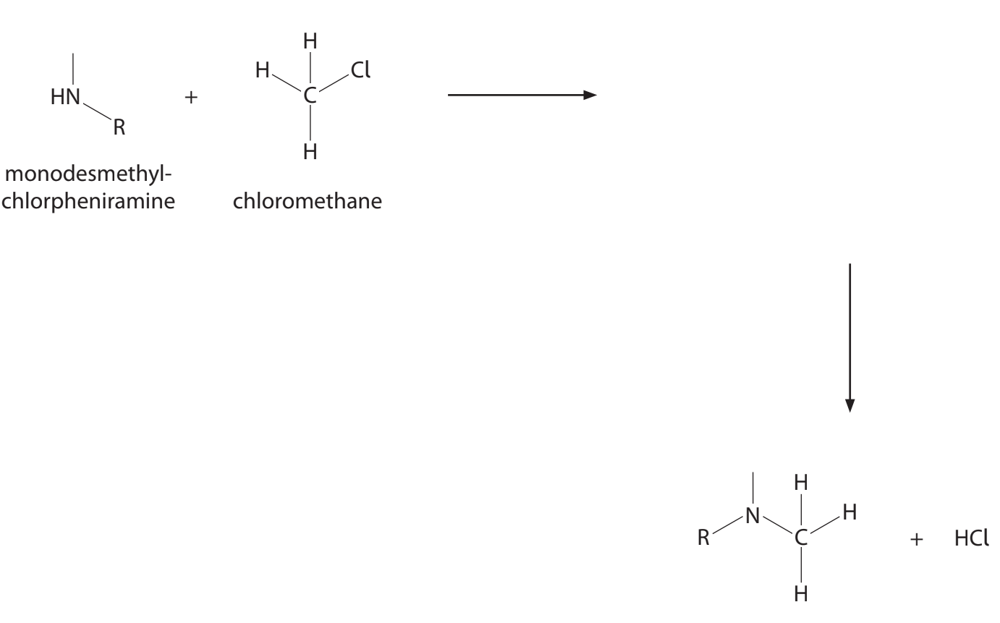

## Q2 — medium — 6 marks · structured-questions

### 12((a)) — 2 marks — command: predict — structured — from paper Jan 2022 · WCH15/01
This question is about polymers.

The diagram shows part of the structure of a polymer formed by a **condensation** reaction between two amino acids.

Predict the structures of the two monomers that produce this polymer.

### 12((b)) — 2 marks — command: deduce — structured — from paper Jan 2022 · WCH15/01
The diagram shows a repeat unit of an addition polymer used in some food wraps. It is formed from two different monomers.

Deduce the structures of the two monomers that produce this polymer.

### 12((c)) — 2 marks — command: calculate — structured — from paper Jan 2022 · WCH15/01
A synthetic rubber polymer has the structure shown.

The molar mass of the synthetic rubber is approximately 300 000 g mol−1.

Calculate the approximate number of repeat units in the polymer.

## Q3 — medium — 17 marks · structured-questions

### 19((a)) — 5 marks — command: multiple — structured — from paper June 2021 · WCH15/01
This question is about the investigation of an organic compound **X**. **X** is a liquid at room temperature and pressure, which turns damp red litmus paper blue.

i) Name the functional group present in **X**.

**(1)**

ii) When 0.493 g of **X** was vaporised, 157 cm3 of dry air was displaced, measured at 15 °C and 103 000 Pa.

Calculate the molar mass of **X**, using the ideal gas equation. You **must** show your working.

**(4)**

### 19((b)) — 5 marks — command: multiple — structured — from paper June 2021 · WCH15/01
**X** reacted vigorously with ethanoyl chloride forming steamy fumes and a white solid **Y**.

i) Identify the steamy fumes, by name or formula.

**(1)**

ii) Suggest the functional group present in **Y**.

** (1)**

iii) Analysis of Y showed that its composition by mass was 62.6% carbon; 11.3% hydrogen; 12.2% nitrogen; 13.9% oxygen.

Determine the empirical formula of **Y**. You **must** show your working.

**(3)**

### 19((c)) — 6 marks — command: deduce — structured — from paper June 2021 · WCH15/01
A simplified **high** resolution proton NMR spectrum of **Y** is shown. The relative peak areas are given near each peak.

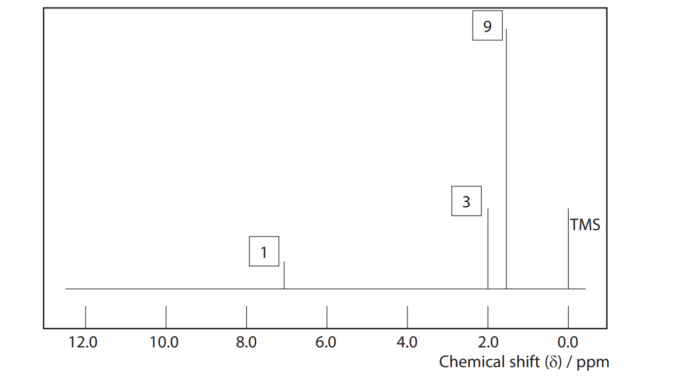

Deduce the structure of **Y**, using the NMR spectrum and the other information in the question.

### 19((d)) — 1 mark — command: draw — structured — from paper June 2021 · WCH15/01
Draw the structure of compound **X**.

## Q4 — medium — 15 marks · structured-questions

### 1() — 7 marks — command: multiple — structured
Three nitrogen containing molecules, ammonia, NH3, phenylamine, C6H5NH2 and N-methylethylamine, CH3CH2NHCH3, are drawn below respectively in **Figure 1.**

**Figure 1**

** **i) List the three amine molecules drawn in **Figure 1** in order of increasing base strength.

ii) Explain your answer to part (i).

### 2() — 3 marks — command: suggest — structured
Phenylamine, C6H5NH2 shown in **Figure 1** in part (a) can be produced from nitrobenzene, C6H5NO2.

Name the type of reaction and suggest suitable reagents and conditions for this conversion.

### 3() — 3 marks — command: multiple — structured
Azo dyes are organic compounds, which are largely used in the treatment of textiles andleather products, as well as in food. Phenylamine, C6H5NH2, can be used in the manufacture of azo dyes.

The manufacturing process is outlined below.

**Step 1**

Phenylamine is dissolved in HCl to produce a diazonium salt. A diazonium salt contains two nitrogen atoms joined together by a triple bond. The reaction for this process is as follows:

C6H5NH2  +  HCl   +  HNO2   →    C6H5N2+Cl-    +   2H2O

**Step 2**

This solution is then slowly added to an alkaline solution of a phenol coupling agent to form the dye.

i) The diazonium salt, C6H5N2+Cl-, is an unstable compound. Suggest a condition that could be added to ensure that the salt would not break down during the reaction.

ii) Draw the structure of the diazonium salt formed in **Step 1**, showing the displayed formula of the nitrogen containing group.

### 4() — 2 marks — command: suggest — structured
Phenol, C6H5OH, is an aromatic organic compound which is also crucial in the manufacture of azo dyes.

The final step of the azo dye production, involves pairing up the diazonium salt with a phenol compound as a coupling agent.

Suggest a structure for the azo dye if the coupling agent used is 2,6-dimethylphenol.

## Q5 — medium — 10 marks · structured-questions

### 1() — 4 marks — command: describe — structured
4-Methylphenylamine (compound **A**) and 2-methylphenylamine (compound **B**) are isomeric aromatic amines with molecular formula C7H9N. The structures of compound A and compound B are shown.

Compound **A** can be synthesised from methylbenzene in two steps. A reaction scheme for this synthesis is shown.

Describe how compound **A** is synthesised from methylbenzene. For each step, state the reagents, conditions, and type of reaction.

### 2() — 2 marks — command: explain — structured
Explain why the methyl group in methylbenzene directs the incoming electrophile to the 4-position rather than the 3-position during nitration.

### 3() — 4 marks — command: explain — structured
State the number of peaks in the 13C NMR spectrum of each compound and explain the difference.

## Q6 — hard — 21 marks · structured-questions

### 21((a)) — 1 mark — command: complete — structured — from paper Oct 2021 · WCH15/01
Organic molecules are an important source of colour both in the natural world and in a wide range of industrial applications.

Curcumin contributes to the yellow colour of turmeric spice and is used as an additive in cosmetics and foods. It has been suggested that curcumin can act as an antioxidant and anticancer agent, through reactions with free radicals and proteins, and may also inhibit Alzheimer’s disease by complexing to toxic metal ions.

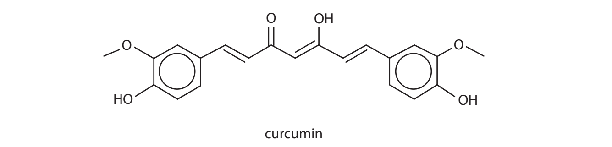

Azo dyes are synthetic compounds that do not occur naturally. They can be used to colour textiles such as cotton. The acid‐base indicator methyl red is an azo dye.

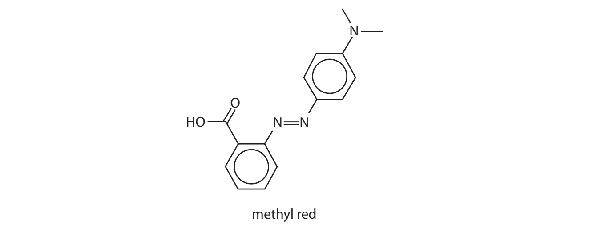

Indigotin is used to dye denim a blue colour and coumarin 440 is used to generate blue light in lasers. Both dyes occur naturally in plants but can be synthesised in the laboratory.

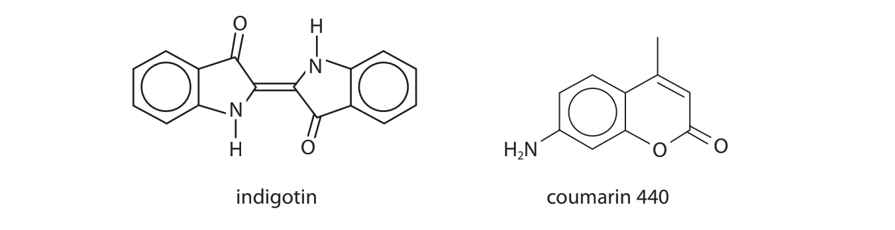

The equation shows the reaction between a free radical T• and curcumin (shown by a simplified structure).

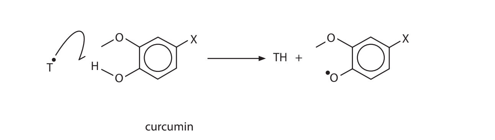

Complete the left‐hand side of the equation by adding curly half‐arrows.

### 21((b)) — 3 marks — command: complete — structured — from paper Oct 2021 · WCH15/01
Selenide anions attached to protein side‐chains may undergo nucleophilic addition reactions with curcumin. Complete the mechanism for one of the steps in such a reaction, adding curly arrows to the simplified structures shown.

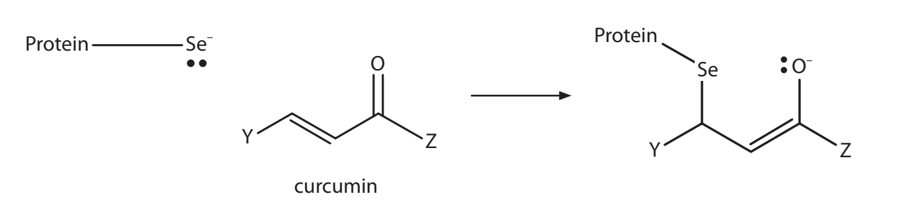

### 21((c)) — 2 marks — command: complete — structured — from paper Oct 2021 · WCH15/01
Curcumin anions can act as bidentate ligands in metal‐curcumin (M‐curc) complexes. The oxygen atoms of the curc ligand occupy adjacent coordination sites in the complex, as shown.

Complete the table relating to two M‐curc complexes.

|   | **[Au(curc)****2****]****+** | **[Al(curc)(C****2****H****5****OH)****2****(NO****3****)****2****]** |
|---|---|---|
| Coordination number | 4 |   |
| O–M–O bond angle | 90° |   |
| Shape |   | octahedral |
| Charge on metal ion |   | +3 |

### 21((d)) — 7 marks — command: multiple — structured — from paper Oct 2021 · WCH15/01
An incomplete synthesis for methyl red starting from 2‐nitrobenzaldehyde and phenylamine is shown.

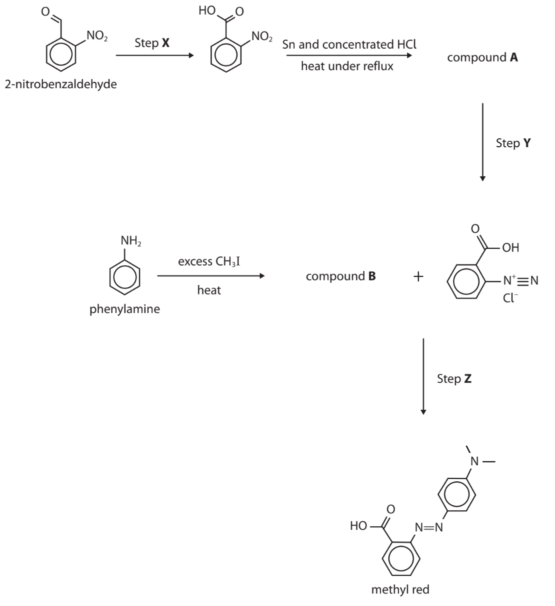

i) State the reagents and conditions needed in Step **X**.

**(2)**

ii) Draw the structure of compound **A**.

**(1)**

iii) State the reagents needed in Step** Y**.

**(1)**

iv) Draw the structure of compound** B**.

**(1)**

v) The temperature used in Steps **Y** and** Z** should be kept as close to 5 °C as possible. State why the temperature should be neither higher nor lower than 5 °C.

**(2)**

### 21((e)) — 5 marks — command: multiple — structured — from paper Oct 2021 · WCH15/01
Indigotin can be synthesised from 2‐nitrobenzaldehyde and propanone in aqueous sodium hydroxide.

i) Complete the equation for this reaction.

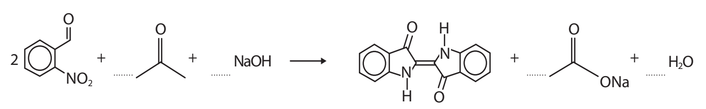

**(2)**

ii) Calculate the mass of 2‐nitrobenzaldehyde required to make 10.0 g of indigotin from this reaction when the percentage yield is 85.0%.

**(3)**

### 21((f)) — 3 marks — command: give — structured — from paper Oct 2021 · WCH15/01
Give the structure of the **organic **product of each of the following reactions of coumarin 440.

i) Hydrolysis with **excess** aqueous sodium hydroxide.

**(2)**

ii) Condensation with ethanoyl chloride.

**(1)**

## Q7 — medium — 1 marks · multiple-choice-questions

### 12() — 1 mark — multiple_choice — from paper June 2021 · WCH15/01
Which type of compound **cannot** be a monomer in the formation of polyamides?
- **A.** amides
- **B.** amino acids
- **C.** diacyl chlorides
- **D.** diamines

## Q8 — medium — 1 marks · multiple-choice-questions

### 12() — 1 mark — multiple_choice — from paper Jan 2021 · WCH15/01
What is the name of the compound shown?

- **A.** 1-methylpropanamide
- **B.** 3-methylpropanamide
- **C.** 2-methylbutanamide
- **D.** 3-methylbutanamide

## Q9 — medium — 1 marks · multiple-choice-questions

### 13() — 1 mark — multiple_choice — from paper Oct 2021 · WCH15/01
Which sequence shows these compounds in order of **decreasing** basicity?
- **A.** C6H5NH2 > CH3CH2CH2NH2 > NH3
- **B.** NH3 > CH3CH2CH2NH2 > C6H5NH2
- **C.** CH3CH2CH2NH2 > NH3 > C6H5NH2
- **D.** C6H5NH2 > NH3 > CH3CH2CH2NH2

## Q10 — medium — 2 marks · multiple-choice-questions

### 13((a)) — 1 mark — multiple_choice — from paper June 2021 · WCH15/01
Alanine is an amino acid.

Which structure best represents alanine at **high** pH?

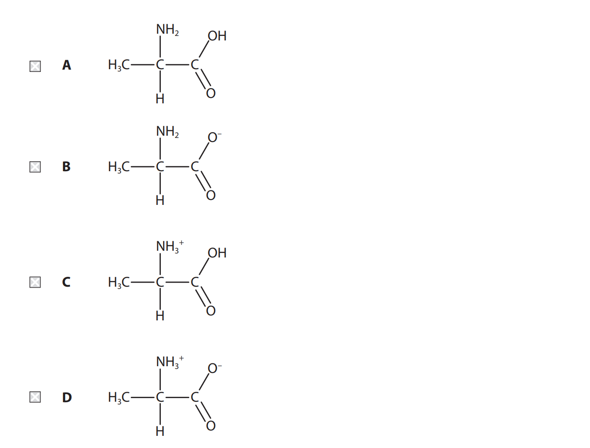
- **A.** 
- **B.** 
- **C.** 
- **D.** 

### 13((b)) — 1 mark — multiple_choice — from paper June 2021 · WCH15/01
Alanine is a crystalline solid at room temperature.

What are the main forces broken when alanine melts?
- **A.** London forces
- **B.** hydrogen bonds
- **C.** covalent bonds
- **D.** ionic bonds

## Q11 — medium — 1 marks · multiple-choice-questions

### 13() — 1 mark — multiple_choice — from paper Jan 2021 · WCH15/01
Separate 0.1 mol dm−3 aqueous solutions of ammonia, butylamine and phenylamine were prepared.

Which of the following sequences shows the solutions in order of **increasing** pH?
- **A.** butylamine, phenylamine, ammonia
- **B.** ammonia, butylamine, phenylamine
- **C.** phenylamine, ammonia, butylamine
- **D.** ammonia, phenylamine, butylamine

## Q12 — medium — 1 marks · multiple-choice-questions

### 14() — 1 mark — multiple_choice — from paper Oct 2021 · WCH15/01
Which amine could **not** be prepared by the reduction of a nitrile?

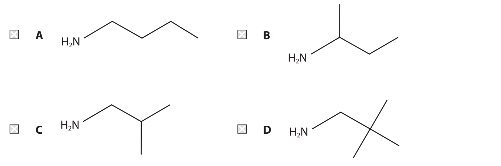
- **A.** 
- **B.** 
- **C.** 
- **D.** 

## Q13 — medium — 1 marks · multiple-choice-questions

### 14() — 1 mark — multiple_choice — from paper Jan 2021 · WCH15/01
The repeat unit of a polymer is shown.

What is the structure of the monomer?

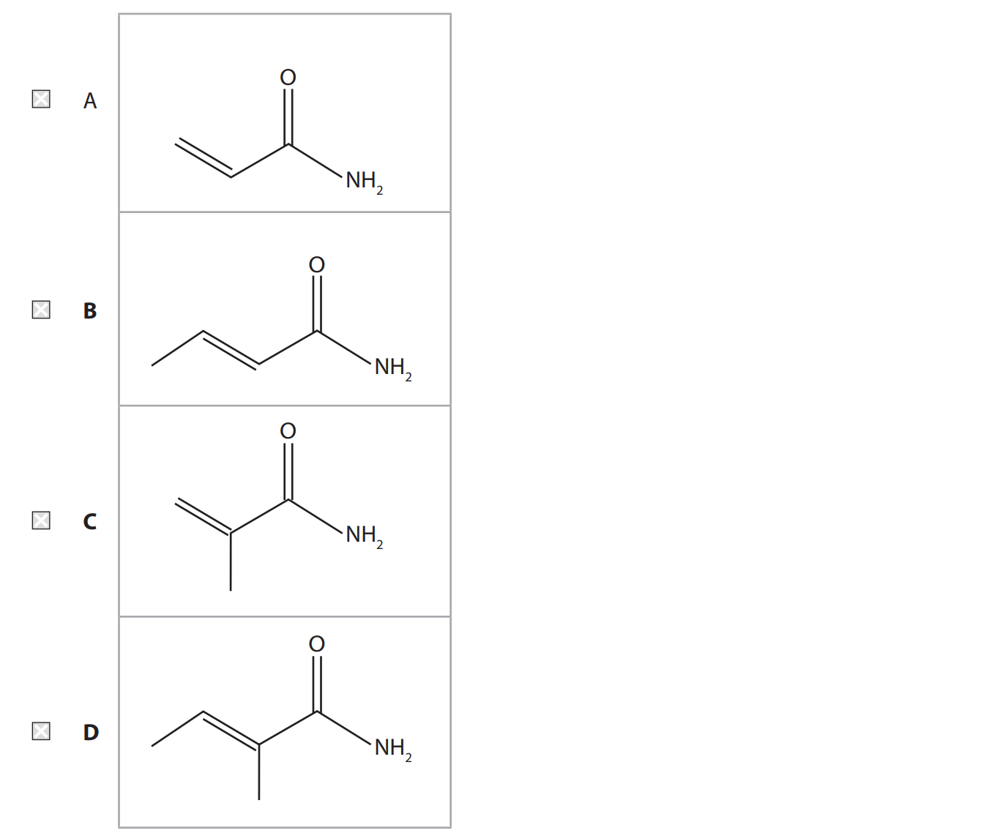
- **A.** 
- **B.** 
- **C.** 
- **D.** 

## Q14 — medium — 1 marks · multiple-choice-questions

### 15() — 1 mark — multiple_choice — from paper Oct 2021 · WCH15/01
How many **different** amino acids form the repeat unit of the polymer shown?

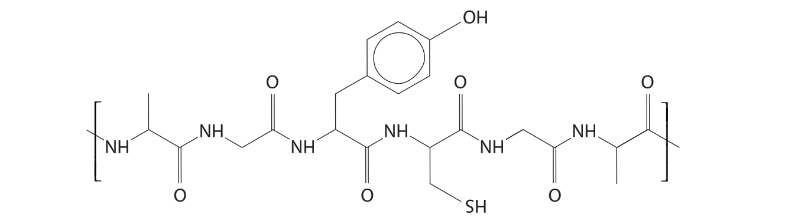
- **A.** 3
- **B.** 4
- **C.** 5
- **D.** 6

## Q15 — medium — 1 marks · multiple-choice-questions

### 15() — 1 mark — multiple_choice — from paper Jan 2021 · WCH15/01
The repeat unit of a polymer is shown.

This polymer could be
- **A.** both a polypeptide and a polyamide
- **B.** neither a polypeptide nor a polyamide
- **C.** a polypeptide but not a polyamide
- **D.** a polyamide but not a polypeptide

## Q16 — medium — 1 marks · multiple-choice-questions

### 1() — 1 mark — multiple_choice
Which of these correctly lists ammonia, butylamine and phenylamine in order of **increasing** base strength?
- **A.** Ammonia < butylamine < phenylamine
- **B.** Ammonia < phenylamine < butylamine
- **C.** Phenylamine < ammonia < butylamine
- **D.** Phenylamine < butylamine < ammonia

## Q17 — medium — 1 marks · multiple-choice-questions

### 1() — 1 mark — multiple_choice
Which of these correctly shows the reagents and conditions for the diazotisation of phenylamine (C6H5NH2)?

|   | Reagents | Temperature |
|---|---|---|
| **A** | NaNO2, dilute HCl | Below 10°C |
| **B** | NaNO3, dilute HCl | Below 10°C |
| **C** | NaNO2, dilute HCl | Above 10°C |
| **D** | NaNO2, dilute NaOH | Below 10°C |
- **A.** 
- **B.** 
- **C.** 
- **D.** 

## Q18 — medium — 1 marks · multiple-choice-questions

### 1() — 1 mark — multiple_choice
The structure of the amino acid glycine is shown.

Glycine has an isoelectric point of 6.0. Which species is the predominant form of glycine at pH 6?
- **A.** H2NCH2COOH
- **B.** H3N+CH2COO-
- **C.** H3N+CH2COOH
- **D.** H2NCH2COO-

## Q19 — medium — 1 marks · multiple-choice-questions

### 1() — 1 mark — multiple_choice
Ethanamide, CH3CONH2, is heated under reflux with excess dilute hydrochloric acid. Which products are formed?
- **A.** CH3COOH and NH4Cl
- **B.** CH3COOH and NH3
- **C.** CH3COO- and NH4Cl
- **D.** CH3COO- and NH3

## Q20 — medium — 1 marks · multiple-choice-questions

### 1() — 1 mark — multiple_choice
A section of a polyamide is shown.

Which monomers were used to produce this polymer?
- **A.** H2N(CH2)6NH2 and HOOC(CH2)4COOH
- **B.** H2N(CH2)6NH2 and HOOC(CH2)6COOH
- **C.** H2N(CH2)6COOH and H2N(CH2)4COOH
- **D.** HOOC(CH2)6COOH and H2N(CH2)4NH2

## Q21 — medium — 1 marks · multiple-choice-questions

### 1() — 1 mark — multiple_choice
The structure of threonine is shown.

How many chiral centres does threonine contain?
- **A.** 0
- **B.** 1
- **C.** 2
- **D.** 4

## Q22 — hard — 1 marks · multiple-choice-questions

### 10() — 1 mark — multiple_choice — from paper June 2021 · WCH14/01
Which reagent reacts at room temperature with methylamine, CH3NH2, to form the compound N-methylethanamide?
- **A.** CH3COCH3
- **B.** CH3COOH
- **C.** CH3COOCH3
- **D.** CH3COCl

## Q23 — hard — 1 marks · multiple-choice-questions

### 1() — 1 mark — multiple_choice
Which reaction produces a secondary amine as the major organic product?
- **A.** CH3Br + excess NH3(aq) →
- **B.** CH3CH2CN + LiAlH4, then H3O+ →
- **C.** CH3CONH2 + LiAlH4, then H3O+ →
- **D.** Excess CH3NH2 + CH3CH2Br →
