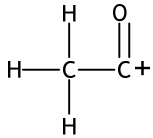
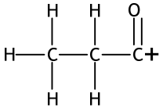
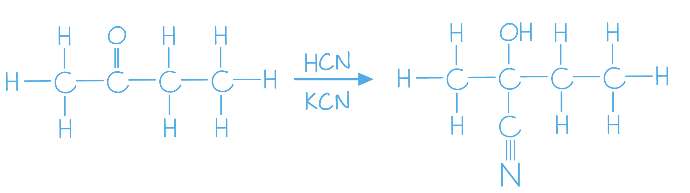
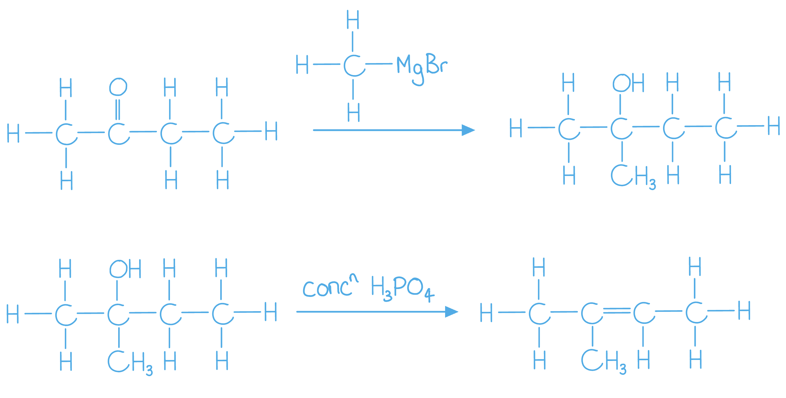
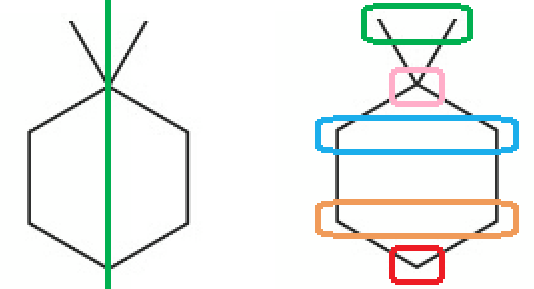

# Mark Schemes — Organic Synthesis
**5. Transition Metals & Organic Nitrogen Chemistry** · Edexcel International A Level (IAL) Chemistry (YCH11)

## Q1 — hard — 12 marks · structured-questions

### 20((a)) — 3 marks
i) The structures of the species responsible for these two peaks are:

-  ; **[1 mark]   **
-  ; **[1 mark]**

ii) The structure of **one** other species that would produce a peak at a different *m / z* value in the mass spectrum of butanone is:

- CH3+ 
**OR**
CH3CH2+
**OR**
C2H5+
**OR**
CH3COCH2CH3+; **[1 mark] **

**Final answer:** **[Total: 3 marks] **

- *Giving the structural formulae e.g. CH**3**CO**+**, C**2**H**5**CO**+** , CH**3**COCH**2**+** is also accepted for the mark*

  - *Take your time to double-check that the m/z value matches the species that you have drawn or written*
  
    - *CH**3**CO**+ **= 43*
    - *C**2**H**5**CO**+** or CH**3**COCH**2**+** = 57*
- *Any species with an **m / z** value of 43 or 57 will not be awarded the mark for part (ii) as you have been asked for a different species which doesn't have an **m / z** value of 43 or 57*

### 20((b)) — 4 marks
The reagents and essential conditions for each step and the name or structure of each of the intermediate compounds are:

- The reaction of butanone with iodine in sodium hydroxide / NaOH;** [1 mark] **
- To form sodium propanoate; **[1 mark] **
- Add dilute sulfuric acid / H2SO4
**AND**
To form propanoic acid / CH3CH2COOH (and distil off);** [1 mark]**
- (Reflux propanoic acid with) lithium tetrahydridoaluminate(III) / LiAlH4 / lithium aluminium hydride in dry ether (to give propan-1-ol); **[1 mark]**

**Final answer:** **[Total: 4 marks] **

- *Stating potassium hydroxide, alkali, alkaline or OH**−** would be a valid answer for the first mark *
- *This will then form CH**3**CH**2**COO**−**Na**+** / CH**3**CH**2**COONa or the propanoate ion*
- *Instead of sulfuric acid, any named strong acid would also be acceptable and work in this reaction scheme*
- *The use of LiAlH**4** in dry ether on propanoic acid or propanal to give propan-1-ol would also gain the mark*

### 20((c)) — 5 marks
The reagents and essential conditions for each step and give the name or structure of each of the intermediate compounds are:

- Identification of a suitable halogenoalkane
CH3Br
**OR**
CH3Cl
**OR**
CH3I; **[1 mark] **
- Reaction with magnesium (powder) in dry ether; **[1 mark] **
- To form the Grignard reagent CH3MgBr / methyl magnesium bromide; **[1 mark] **
- Formation of 2-methylbutan-2-ol by reacting the Grignard reagent with butanone; **[1 mark]**
- Reaction with concentrated phosphoric acid or concentrated sulfuric acid (to give 2-methylbut-2-ene (and some 2-methylbut-1-ene)); **[1 mark] **

**Final answer:** **[Total: 5 marks] **

- *If the Grignard reagent is not used such as the example below involving the reaction of butanone with HCN / KCN / CN**−** to form 2-hydroxy-2- methylbutanenitrile, you can only score 1 mark*

- *It can help to draw out the reaction scheme so you can see which functional groups are changing *

- *Double-check that the halogenoalkane that you use to make the Grignard reagent is the same throughout the reaction scheme *

  - *I.e. if you use CH**3**Br, the Grignard should also contain bromine *

## Q2 — easy — 1 marks · multiple-choice-questions

### 17() — 1 marks
**Correct answer: C** — will be lower than the true value

**Final answer:** **The correct answer is ****C**** because: **

- Pure substances have sharp, well-defined melting points / temperatures
- Impurities cause the melting point / temperature to be lower than the expected data value
- Impurities also cause the melting point / temperature to occur over a broader range than that of a pure substance

**A**, **B** and **D** are incorrect as  an impure sample would cause the melting temperature value to be lower

|   |   |
|---|---|

## Q3 — medium — 1 marks · multiple-choice-questions

### 13() — 1 marks
**Correct answer: D** — 

**Final answer:** **The correct answer is ****D**** because:**

- Alkenes react with steam and sulfuric acid to form an alcohol, so compound W must show the double bond broken and hydroxyl group attached
- This means the intermediate contains three alcohol groups, one of which is secondary and the other two are primary
- The final product contains a ketone and a dicarboxylic acid
- These can only have been produced by the oxidation of a secondary and primary alcohol groups respectively
- Hot acidified potassium dichromate, K2Cr2O7 is a standard oxidising agent for this reaction

**A** is incorrect as  the compound W is correct but LiAlH4 is a reducing agent

**B** is incorrect as  both the compound W and reagent are incorrect

**C **is incorrect as  the compound W is the wrong compound

## Q4 — medium — 1 marks · multiple-choice-questions

### 16() — 1 marks
**Correct answer: D** — carbon dioxide giving carboxylic acids

**Final answer:** **The correct answer is ****D**** because: **

- Grignard reagents are used to increase the carbon chain length of various compounds
- This can result in a change in the functional group within the compound
- The reactions of a Grignard reagent such as CH3CH2MgI with:

  - **A** - water
  
    - CH3CH2MgI  + H2O → CH3CH3 + Mg(OH)I
    - An alkane is formed
  - **B** - methanal
  
    - CH3CH2MgI  + HCHO $\overset{H_{2}O}{\rightarrow}$ CH3CH2CH2OH + Mg(OH)I
    - A primary alcohol, propanol, is formed
    - Grignard reagents can also react with longer chain aldehydes to form secondary alcohols
  - **C** - ketones
  
    - CH3CH2MgI  + CH3COCH3 $\overset{H_{2}O}{\rightarrow}$ CH3CH2C(CH3)(OH) + Mg(OH)I
    - A tertiary alcohol is formed, which is true of all ketones reacting with Grignard reagents
  - **D** - carbon dioxide
  
    - CH3CH2MgI  + CO2 $\overset{H_{2}O}{\rightarrow}$ CH3CH2COOH + Mg(OH)I
    - A carboxylic acid is formed

**A** is incorrect as  Grignard reagents react with water giving alkanes

**B **is incorrect as** **Grignard reagents react with methanal giving primary alcohols

**C **is incorrect as** **Grignard reagents react with ketones giving tertiary alcohols only

## Q5 — medium — 1 marks · multiple-choice-questions

### 16() — 1 marks
**Correct answer: B** — five

**Final answer:** **The correct answer is ****B**** because: **

- The hydrocarbon has symmetry within the molecule

  - The mirror line runs vertically through the middle of the molecule

- This means that there are some carbon atoms that are equivalent / in the same environment

**A** is incorrect as  the carbon with the two methyl groups attached has been omitted

**C **is incorrect as** **the carbon with the two methyl groups attached has been omitted **AND **the symmetry of the structure has been ignored

**D **is incorrect as** **the symmetry of the structure has been ignored

## Q6 — medium — 1 marks · multiple-choice-questions

### 17() — 1 marks
**Correct answer: C** — C4H6

**Final answer:** **The correct answer is ****C**** because: **

- |   | **CO****2** | ** H****2****O** |
|---|---|---|
| Values from question | 2.64 g | 0.81 g |
| Molecular mass | 44.0 | 18.0 |
| Moles | = 0.06 | = 0.045 |
|   | **C** | **H** |
| Moles | 0.06 | 0.045 x 2 = 0.09 |
| Ratio | = 1 | = 1.5 |
| Simplest whole-number ratio | 2 | 3 |

- This gives an empirical formula of C2H3 for the hydrocarbon

  - This cannot be a molecular formula
  - The possible molecular formulae for hydrocarbons with 2 carbons are C2H6 (ethane), C2H4 (ethene) and C2H2 (ethyne)
- With an empirical formula of C2H3, some possible molecular formulae are:

  - C4H6
  - C6H9
  - It is not necessary to go beyond C6H9 as the number of hydrogen atoms is increasing, which rules option **D** out
- From the possible molecular formulae, the only matching option is **C** / C4H6

**A** is incorrect as  C2H3 cannot be a molecular formula

**B **is incorrect as** ** this formula is obtained without doubling the moles of water to give the moles of hydrogen

**D **is incorrect as** **the moles of water has been halved instead of doubled

## Q7 — medium — 1 marks · multiple-choice-questions

### 1() — 1 marks
**Correct answer: A** — 

**Final answer:** **The correct answer is A**

- Propan-1-ol is a primary alcohol with 3 carbon atoms
- CH3CH2MgBr (ethylmagnesium bromide) contributes 2 carbon atoms
- The carbonyl compound must contribute exactly 1 carbon atom and produce a primary alcohol on addition
- Methanal (HCHO) has no carbon substituents on the carbonyl carbon.
- Addition of the ethyl Grignard reagent followed by acid workup gives CH3CH2CH2OH (propan-1-ol)

**B** is incorrect as ethanal (CH3CHO) already carries one carbon substituent on the carbonyl carbon. Reaction with CH3CH2MgBr gives butan-2-ol, a secondary alcohol, not propan-1-ol.

**C** is incorrect as propanal already carries an ethyl group on the carbonyl carbon. Reaction of CH3CH2MgBr with propanal followed by acid workup gives a five-carbon secondary alcohol (pentan-3-ol), not a three-carbon primary alcohol.

**D** is incorrect as propanone (CH3COCH3) reacts with CH3CH2MgBr to give a tertiary alcohol (2-methylbutan-2-ol). The name propanone shares the prefix "prop" with the target product, but the chemistry is entirely different.

## Q8 — hard — 1 marks · multiple-choice-questions

### 18() — 1 marks
**Correct answer: C** — 19.51 g

**Final answer:** **The correct answer is ****C**** because: **

- Moles of benzenecarboxylic acid in 8.24 g $\frac{8.24}{122}$ = 0.0675... moles

  - But, the 8.24 g is the result of a 60% yield in the second step of the reaction scheme
- Moles of benzenecarboxylic acid produced with a 100% yield instead of 60% $\frac{0.0675}{60}\times100$ = 0.1126... moles

  - Since one mole of methylbenzene forms 1 mole of benzenecarboxylic acid, there are also 0.1126... moles of methylbenzene
  - But the 0.1126... moles of ethylbenzene is the result of a 45% yield in the first step of the reaction scheme
- Moles of methylbenzene produced with a 100% yield instead of 45% $\frac{0.1126}{45}\times100$ = 0.2502... moles

  - Since one mole of benzene forms 1 mole of methylbenzene, there are also 0.2502... moles of benzene
- Mass of 0.2502... moles of benzene 0.2502 x 78 = 19.51 g

**A** is incorrect as  this is the mass of benzenecarboxylic acid that would be formed from 8.24 g of benzene in this sequence

**B **is incorrect as** ** this is the mass of benzene if both reactions have 100% yield

**D **is incorrect as** ** this value is calculated without using the *M*r values
