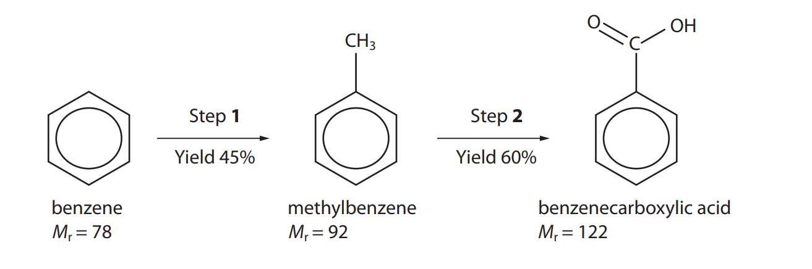

# Exam Questions — Organic Synthesis
**5. Transition Metals & Organic Nitrogen Chemistry** · Edexcel International A Level (IAL) Chemistry (YCH11)
> Source: [https://www.savemyexams.com/international-a-level/chemistry/edexcel/17/topic-questions/5-transition-metals-and-organic-nitrogen-chemistry/5-6-organic-synthesis/structured-questions/](https://www.savemyexams.com/international-a-level/chemistry/edexcel/17/topic-questions/5-transition-metals-and-organic-nitrogen-chemistry/5-6-organic-synthesis/structured-questions/) · 8 questions · total 19 marks

## Q1 — hard — 12 marks · structured-questions

### 20((a)) — 3 marks — command: give — structured — from paper Jan 2021 · WCH15/01
Ketones are useful starting compounds in organic synthesis.

This question is about butanone.

The mass spectrum of butanone has significant peaks at *m/ z* = 43 and at *m/ z *= 57.

i) Give the structures of the species responsible for these two peaks.

**(2)**

ii) Give the structure of **one** other species that you would expect to produce a peak at a different *m/ z* value in the mass spectrum of butanone.

**(1)**

### 20((b)) — 4 marks — command: design — structured — from paper Jan 2021 · WCH15/01
Devise a reaction scheme to prepare propan-1-ol from butanone, using no more than **four** steps.

Identify the reagents and essential conditions for each step and give the name or structure of each of the intermediate compounds.

### 20((c)) — 5 marks — command: design — structured — from paper Jan 2021 · WCH15/01
Devise a reaction scheme to prepare 2-methylbut-2-ene from butanone, using no more than **four** steps.

Identify the reagents and essential conditions for each step and give the name or structure of each of the intermediate compounds.

## Q2 — easy — 1 marks · multiple-choice-questions

### 17() — 1 mark — multiple_choice — from paper Oct 2021 · WCH15/01
The melting temperature is determined for impure crystals of an organic compound. When compared with a data book value for the pure compound, the measured melting temperature
- **A.** will be the same as the true value
- **B.** will be higher than the true value
- **C.** will be lower than the true value
- **D.** could be higher or lower than the true value

## Q3 — medium — 1 marks · multiple-choice-questions

### 13() — 1 mark — multiple_choice — from paper Jan 2022 · WCH14/01
But-2-ene-1,4-diol may be converted into 2-oxobutanedioic acid in a two-step synthesis through an intermediate compound **W.**

HOCH2CH$=$CHCH2OH   `rightwards arrow from Step space 1 to steam space and space straight H subscript 2 SO subscript 4 of` **W**  $\underset{\mathrm{Step}2}{\rightarrow}$  HO2CCOCH2CO2H           but-2-ene-1,4-diol                                                         2-oxobutanedioic acid

Identify the intermediate compound **W** and the reagent for Step **2**.

|   | ** ** | **Compound W** | **Reagent for Step 2** |
|---|---|---|---|
| ☐ | **A** | HOCH2CH(OH)CH2CH2OH | LiAlH4 in dry ether |
| ☐ | **B** | HOOCH2CH$=$CHCOOH | LiAlH4 in dry ether |
| ☐ | **C** | OHCCH(OH)CH2CHO | hot acidified K2Cr2O7 |
| ☐ | **D** | HOCH2CH(OH)CH2CH2OH | hot acidified K2Cr2O7 |
- **A.** 
- **B.** 
- **C.** 
- **D.** 

## Q4 — medium — 1 marks · multiple-choice-questions

### 16() — 1 mark — multiple_choice — from paper Oct 2021 · WCH15/01
Grignard reagents react with
- **A.** water giving primary alcohols
- **B.** all aldehydes giving secondary alcohols
- **C.** ketones giving secondary or tertiary alcohols
- **D.** carbon dioxide giving carboxylic acids

## Q5 — medium — 1 marks · multiple-choice-questions

### 16() — 1 mark — multiple_choice — from paper Jan 2021 · WCH15/01
The structure of a hydrocarbon is shown.

How many peaks will there be in the 13C NMR spectrum of this compound?
- **A.** four
- **B.** five
- **C.** seven
- **D.** eight

## Q6 — medium — 1 marks · multiple-choice-questions

### 17() — 1 mark — multiple_choice — from paper Jan 2021 · WCH15/01
When a sample of a hydrocarbon is burned completely in oxygen, 2.64 g of carbon dioxide and 0.81 g of water are formed.

Which of these could be the **molecular** formula of the hydrocarbon?
- **A.** C2H3
- **B.** C4H3
- **C.** C4H6
- **D.** C12H9

## Q7 — medium — 1 marks · multiple-choice-questions

### 1() — 1 mark — multiple_choice
Which carbonyl compound reacts with CH3CH2MgBr, followed by acid workup, to produce propan-1-ol?
- **A.** 
- **B.** 
- **C.** 
- **D.** 

## Q8 — hard — 1 marks · multiple-choice-questions

### 18() — 1 mark — multiple_choice — from paper Jan 2021 · WCH15/01
Benzenecarboxylic acid may be produced from benzene in a two-step synthesis.

8.24 g of benzenecarboxylic acid was formed in this synthesis.

What mass of benzene was used?
- **A.** 3.48 g
- **B.** 5.27 g
- **C.** 19.51 g
- **D.** 30.52 g
