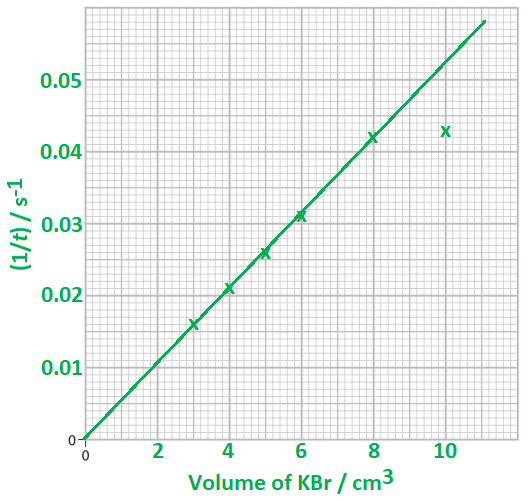
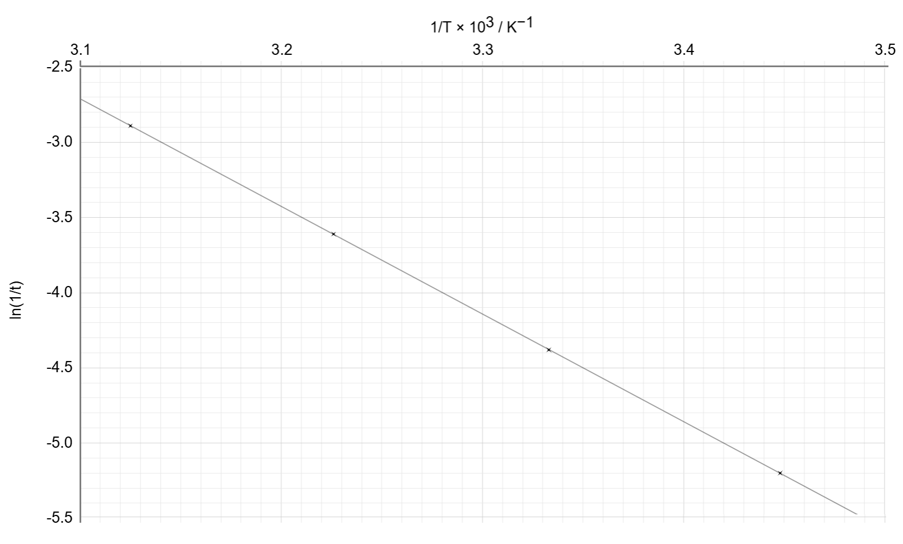
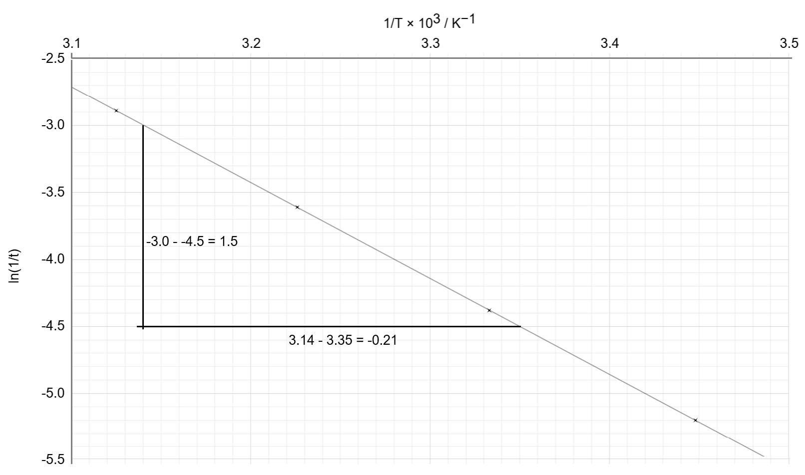

# Mark Schemes — Advanced Physical Chemistry Core Practicals
**6. Practical Skills in Chemistry II** · Edexcel International A Level (IAL) Chemistry (YCH11)

## Q1 — medium — 12 marks · structured-questions

### 3((a)) — 1 marks
**One** reason why the contents of beaker **P** are poured back into beaker **Q **in Step **3** is:

- To mix the reactants
**OR**
To form a uniform / homogeneous solution; **[1 mark]**

**[Total: 1 mark]**

- *Careful:** There is a temptation to talk about making / helping the reactants to react but pouring the contents of one beaker back into another is simply an alternative method of mixing*

### 3((b)) — 4 marks
i) Phenol is added to the reaction mixture to:

- React with / remove the bromine / Br2; **[1 mark]**
- Delay the colour change / bleaching of the indicator 
**OR **
Prevent an immediate colour change; **[1 mark]**

ii) The colour of the reaction mixture before it turns colourless is:

- Pink / red; **[1 mark]**

iii) The temperature is measured in Step **4** because:

- Temperature / it affects the rate (constant)
**OR**
Temperature / it is a control variable
**OR**
Temperature / it must be constant; **[1 mark]**

**Final answer:** **[Total: 4 marks]**

- *Without the addition of phenol, the methyl orange indicator would be immediately bleached / turn from pink to colourless by the bromine as stated at the start of this question *

  - *Phenol delays this colour change as it can react with the bromine*
- *This experiment is to determine the rate equation for the reaction between bromide ions, Br**–**, and bromate(V) ions, BrO**3**–**, in aqueous acid*

  - *Temperature affects the rate of a chemical reaction*
  - *This will have a knock-on effect on the rate constant and, therefore, the rate equation *

### 3((c)) — 6 marks
i) The missing values are:

- 1 / *t* = 0.021 for a volume of 4.0 cm3 of KBr
**AND**
1 / *t* = 0.016 for a volume of 3.0 cm3 of KBr
**AND**
Both values given to 2 significant figures; **[1 mark]**

ii) The graph of 1 / *t* against the volume of KBr, including a line of best fit, is:

- oth axes correctly labelled including units 
**AND**
Suitable scales on both axes; **[1 mark]**
- All points plotted correctly within ±1 small square; **[1 mark]**
- A straight line of best fit passing through the origin
**AND**
Missing the anomalous point at 10 cm3 KBr; **[1 mark]**

iii) The volume of KBr is proportional to the concentration of bromide ions in the reaction mixture because:

- The total volume remains the same / constant
**OR**
The total volume of KBr solution remains at 10 cm3
**OR**
The volume of KBr is the only variable; **[1 mark]**

iv) The order of reaction with respect to bromide ions is:

- First / 1st order; **[1 mark]**

**[Total: 6 marks]**

- *For part (i)*

  - *To get the missing values you calculate the reciprocal of the time, e.g. *$\frac{1}{48}$* = 0.021*
- *For part (ii)*

  - *The volume of KBr must go on the x-axis as this is the independent variable*
  - *Remember: **Examiners will be looking for the following things when marking graphs:*
  
    - *Axes the correct way around*
    - *Suitable scales applied to both axes *
    - *Labels **AND** units on both axes*
    - *The graph covering at least half of the available space*
    - *Lines of best fit that ignore obvious anomalies*
- *For part (iii)*

  - *The KBr is the only species responsible for the bromide ions*
  - *This means that as the concentration of KBr changes, the concentration of bromide ions will change by the same amount*
- *For part (iv)*

  - *The graph produces a straight line that increases proportionally*
  - *This is the correct shape for a first-order reaction*

### 3((d)) — 1 marks
The rate equation for the overall reaction is:

- Rate = *k *[Br−] [BrO3−] [ H+]2
**OR**
Rate = *k *[KBr] [KBrO3] [ H+]2; **[1 mark]**

**[Total: 1 mark]**

- *Careful:** Although both graphs show the correct shape for a first-order graph, the second graph has [ H**+**]**2** on the x-axis*

## Q2 — medium — 10 marks · structured-questions

### 3((a)) — 1 marks
A polystyrene cup was used instead of a glass beaker in Step** 1** because:

- Polystyrene is a better / good insulator
**OR**
Polystyrene <u>reduces / minimises</u> heat loss (to the surroundings); **[1 mark]**

**[Total: 1 mark]**

- *You should know why polystyrene is used for this experiment from your current and previous studies*

### 3((b)) — 3 marks
The enthalpy change for the formation of this solution of lithium chloride is:

- Heat produced, *Q* = 1306.25 (J) 
**OR**
1.30625 (kJ); **[1 mark]**
- Moles of LiCl = 0.0500
**OR**
5.00 x 10−2 (mol); **[1 mark]**
- Enthalpy change = –26125 J mol-1 
**OR**
–26.125 kJ mol-1; **[1 mark]**

**[Total: 3 marks]**

- *The first step of this calculation uses **Q** = **mc**Δ**T*

  - *m** = the mass of distilled water = 25.0 cm**3** *
  - *c** = the specific heat capacity of the water = 4.18 J g**−1** °C**−1** *
  - *Δ**T** = the temperature change = 12.5 **o**C*
  - *So, **Q** = 25.0 x 4.18 x 12.5 = 1306.25 (J) *
- *The second step of this calculation is to determine the number of moles of LiCl using moles = *$\frac{\mathrm{mass}}{M_{r}}$

  - *Moles = *`fraction numerator 2.12 over denominator open parentheses 6.9 plus 35.5 close parentheses end fraction`* = 0.0500 *
- *The final step is to determine the enthalpy change using Δ**H** = *$\frac{Q}{n}$

  - *Enthalpy change in J mol**-1** = *$\frac{1306.25}{0.0500}$* = –26125 J mol**-1**  **OR **Enthalpy change in kJ mol**-1** = *$\frac{1.30625}{0.0500}$* = –26.125 kJ mol**-1** *
  - *The answer should have a negative sign since it is exothermic (got hotter)*
- *The correct value, negative sign and correct units are all required for the final mark*

### 3((c)) — 1 marks
The percentage uncertainty in the temperature **change** in this experiment is:

- (±) 4 (%); **[1 mark]**

**[Total: 1 mark]**

- *Remember:** Percentage uncertainty = *$\frac{\mathrm{total} \mathrm{uncertainty}}{\mathrm{measured} \mathrm{value}}\times100$
- *The thermometer is used twice to determine the temperature *

  - *Final temperature - initial temperature = temperature change *
- *Therefore, the calculation is *`fraction numerator open parentheses 2 cross times 0.25 close parentheses over denominator 12.5 end fraction cross times 100`* = ±4 **o**C*

### 3((d)) — 5 marks
Changes to the procedure that would give a more accurate temperature rise are:

- Measure the temperature of the water every 30 s for 2 1⁄2 minutes; **[1 mark]**
- Add the lithium chloride at exactly 3 min; **[1 mark]**
- (Stir and) record the temperature every 30 s for another 5 minutes; **[1 mark]**
- Plot a graph of temperature against time (including lines of best fit); **[1 mark]**
- Extrapolate the lines of best fit to the time of mixing **AND **Determine the maximum temperature change / rise at that time; **[1 mark]**

**[Total: 5 marks]**

- *Describing how to complete this experiment is a relatively common question*
- *So, make sure you can write the detailed method *

## Q3 — hard — 12 marks · structured-questions

### 1() — 1 marks
> **[mark-scheme]**
> The observation is:
> 
> - Solution suddenly turns blue-black **[1 mark]**
> 
> Other accepted colours are blue, dark blue and black
> 
> A colour change of blue-black (or equivalent) to colourless is not accepted

> **[exam-tip]**
> The colour change is sudden and distinct, not gradual.
> 
> The solution remains colourless (or very pale yellow) throughout the timing period. It then turns blue-black almost instantaneously when the sodium thiosulfate is consumed.
> 
> The key feature to describe is the abruptness of the change. A gradual colour change would suggest a different experimental method.

### 2() — 2 marks
> **[mark-scheme]**
> The role of this sodium thiosulfate is to:
> 
> - To react with / remove the iodine (as it is formed) **OR**
> 2S2O32− + I2 → S4O62− + 2I− **[1 mark]**
> - This delays the colour change (to blue-black)
> **OR**
> So the blue-black colour only appears when all the thiosulfate is used up / when a fixed amount of reaction has taken place **OR**
> So the solution does not immediately change colour **[1 mark]**
> 
> The following answers are not accepted:
> 
> - "To slow down the reaction"
> - "To quench the reaction"
> - "Acts as a catalyst / indicator"

> **[exam-tip]**
> Examiners comment that "Fully correct responses are very rare" for this question. But, the marks are there to be taken if you understand the thiosulfate's role precisely.
> 
> The thiosulfate reacts with iodine as it forms:
> 
> 2S2O32− (aq) + I2 (aq) → S4O62− (aq) + 2I− (aq)
> 
> While thiosulfate remains in solution, any I2 produced is immediately removed and the starch stays colourless.
> 
> The moment all the thiosulfate is used up, I2 starts to accumulate and the solution turns blue-black. This gives a sharp, reproducible time point corresponding to a fixed, known amount of reaction.
> 
> The three traps, which score zero marks, to avoid are:
> 
> 1. "To quench / stop the reaction"
> 
>   - This confuses the clock reaction with iodometric titrations, where thiosulfate is added after the reaction to find out how much iodine was produced.
>   - Here, thiosulfate is present throughout and it does not stop anything.
> 2. "To slow down the reaction"
> 
>   - Thiosulfate has no effect on the rate of the peroxodisulfate–iodide reaction.
>   - It only removes the iodine product.
>   - The main reaction carries on at the same rate.
> 3. "It acts as a catalyst / indicator"
> 
>   - Thiosulfate is consumed in the reaction, so it is not a catalyst.
>   - Thiosulfate does not produce the colour change, so it is not an indicator.

### 3() — 2 marks
> **[mark-scheme]**
> The order of reaction with respect to S2O82− is:
> 
> - 1 / first order / 1st order**[1 mark]**
> - As the concentration of S2O82− / [S2O82−]  doubles, the rate / 1/*t* doubles 
> **OR**
> As the concentration of S2O82− / [S2O82−]  doubles, the time / *t* halves **[1 mark]**
> 
> The mathematical relationship (doubling/halving) must be explicitly stated for the second mark
> 
> Qualitative statements using the data table are accepted for the second mark, e.g. "When concentration increases from 0.050 to 0.100, 1/*t* increases from 0.0125 to 0.0250"
> 
> Vague qualitative statements such as "as concentration increases, the rate increases" are not accepted

> **[exam-tip]**
> Use the 1/*t* column as your measure of rate. When the concentration doubles (from 0.050 to 0.100 mol dm−3), 1/*t* also doubles (from 0.0125 to 0.0250 s−1). Rate doubling when concentration doubles is the defining feature of first-order kinetics.
> 
> For reference:
> 
> - Zero order: rate unchanged when concentration doubles
> - First order: rate doubles when concentration doubles
> - Second order: rate quadruples when concentration doubles
> 
> Always state the order **and** give a justification using numbers from the table. Both are required for full marks.

### 4() — 2 marks
The plotted graph is:

**[2 marks]**

> **[mark-scheme]**
> 1 mark for all four points plotted correctly within ± half a small square
> 
> 1 mark for a straight line of best fit drawn through the points

> **[exam-tip]**
> Plot data points as crosses (×). Dots can be obscured by the line.
> 
> Draw a straight line of best fit using a ruler.
> 
> - Do not join the points with short straight segments (dot-to-dot) as this is explicitly penalised in mark schemes.
> 
> Examiners frequently make the same comments for this type of graph:
> 
> - Students struggle to plot negative y-axis scales correctly
> - Students often draw curves of best fit, because this is a rate graph

### 5() — 1 marks
To determine the gradient:

- Draw a large construction triangle using two points on the line that are well separated:

- Calculate the change in 1/*T*:

3.14 - 3.35 = -0.21

- Ensure that the x 10-3 is accounted for:

-0.21 x 10-3 = -2.1 x 10-4

- Calculate the change in ln(1/*t*):

-3.0 - -4.5 = 1.5

- Calculate the gradient:

gradient = $\frac{Δy}{Δx}$

gradient = $\frac{1.5}{-2.1\times10^{-4}}$

gradient = **-7140 (to 3 s.f.)** **[1 mark]**

> **[mark-scheme]**
> 1 mark for evidence of working on the graph **AND** a negative gradient value in the range -6800 to -7500, written to 3 significant figures
> 
> Allow error carried forward from an incorrect line of best fit
> 
> The construction triangle must span at least half the length of the drawn line

> **[exam-tip]**
> Use the largest possible triangle to reduce the percentage error in your gradient. Always pick two points that lie exactly on your drawn line (read from the graph), not values from the data table.
> 
> Show your construction triangle on the graph as examiners check for this. If you cannot show a full triangle, at minimum mark the two points you used with their coordinates.
> 
> The most common mistake in this question is forgetting that the x-axis is x10-3, which means calculated answers are a factor of 1000 wrong.

### 6() — 2 marks
To calculate *E*a:

- *E*a can be calculated:

gradient = $-\frac{E_{a}}{R}$

- Rearrange to find *E*a:

*E*a = −gradient × *R*

- Substitute the gradient (using −7140 from the example line of best fit):

*E*a = −(−7140) × 8.31 **[1 mark]**

*E*a = 59333.4 J mol−1

- Convert from J mol-1 to kJ mol-1:

*E*a = $\frac{59333.4}{1000}$

*E*a = **59.3 kJ mol****-1**** (to 3 s.f.) ****[1 mark]**

> **[mark-scheme]**
> 1 mark for correct substitution of gradient into the equation with correct rearrangement
> 
> 1 mark for a positive *E*a value in the range 55.0 – 65.0 **AND **units of kJ mol−1
> 
> Allow error carried forward from an incorrect gradient in the previous part

> **[exam-tip]**
> Three things catch students out on this calculation:
> 
> 1. The sign of *E*a
> 
>   - *E*a must always be positive.
>   - Activation energy is the energy barrier that has to be overcome, so a negative value is physically impossible.
>   - Your gradient from the Arrhenius plot is negative (a downward slope)
>   - So, when you substitute into *E*a = −gradient × R, the two negatives cancel and *E*a comes out positive.
>   - If you get a negative *E*a, check whether you dropped the negative sign in front of "gradient".
> 2. Units
> 
>   - J mol-1 not kJ mol-1
>   - Multiplying by R = 8.31 J K-1 mol-1 gives your answer in J mol-1.
>   - The question asks for kJ mol-1, so divide by 1000.
>   - Forgetting this conversion is one of the most common ways to lose the second mark, even with correct working.
> 3. Your gradient, your answer
> 
>   - The acceptable range (55.0 – 65.0 kJ mol-1) exists because no two students draw exactly the same line of best fit.
>   - You will not be penalised for a slightly different gradient, provided your working is consistent with the value you found in part (e).

### 7() — 2 marks
> **[mark-scheme]**
> An improvement to the experimental method is:
> 
> - Place the flask / beaker on a white tile / white paper / white background **[1 mark]**
> - This makes the (blue-black) colour change easier to see / sharper / more obvious so the timer is stopped at a more consistent point in each run
> 
> **OR**
> 
> So the exact same tint/shade is detected each time **[1 mark]**
> 
> Answers suggesting the use of a colorimeter / light sensor / spectrophotometer to remove human reaction time are not accepted

> **[exam-tip]**
> This question asks how to make the timing more reproducible. It does not ask how to make the experiment more accurate in general. Keep that in mind as answers often go off-topic and lose marks.
> 
> The traps to avoid, which score no marks are:
> 
> 1. The black cross trap
> 
> - The black cross method is designed for reactions where a precipitate gradually forms and you stop timing when the cross disappears.
> - In this experiment, the solution stays colourless and then suddenly turns blue-black.
> - There is no gradual cloudiness to watch for, so a black cross does nothing useful.
> - A white background makes the first appearance of blue-black colour sharper and easier to detect.
> 
> 1. The colorimeter trap
> 
> - "Use a colorimeter / light sensor / data logger" is a well-documented Edexcel examiner trap that scores zero.
> - A colorimeter is the expected improvement for continuous monitoring experiments (Core Practical 9a / 13a), where you measure a gradual change in absorbance over time — it is the right tool in those experiments.
> - In an iodine clock reaction, the thiosulfate keeps [I2] at effectively zero right up to the end point, then the blue-black colour appears almost instantaneously.
> - There is no gradual change to monitor, so the colorimeter would read zero and then suddenly jump to maximum — it cannot improve timing reproducibility.
> - Past Edexcel mark schemes explicitly instruct examiners: do not award marks for "use a colorimeter" at sudden colour-change endpoints. Stick to the white tile.
> 
> 1. The repeats trap
> 
> - "Repeat the experiment and find a mean" does not answer the question.
> - The question asks specifically about improving the method of detecting the colour change so that each individual timing is more reproducible.
> - Repeating the experiment is good practice but it does not make a single measurement easier to judge.
